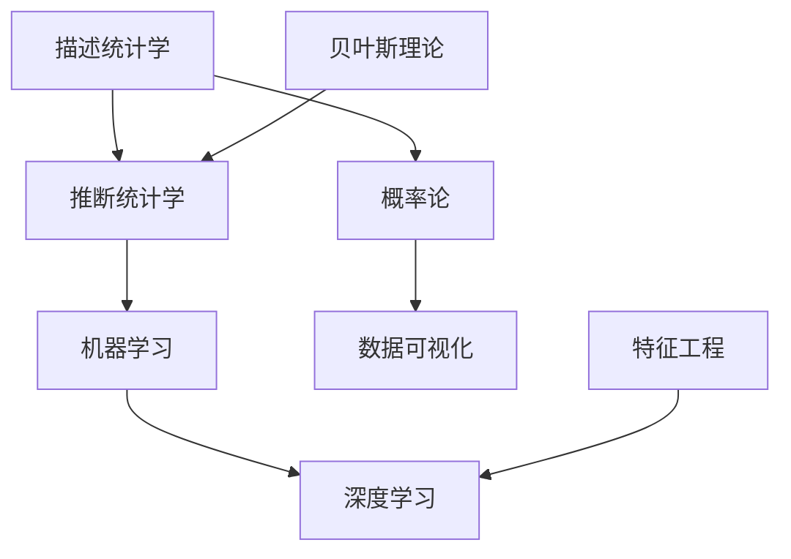

                 

### 标题：统计学与数据科学的最新进展

#### 关键词：
- 统计学
- 数据科学
- 机器学习
- 数学模型
- 大数据
- 技术创新

#### 摘要：
本文将深入探讨统计学与数据科学的最新进展，从核心概念、算法原理、数学模型、实际应用等多个维度进行详细解析。我们将介绍当前最为前沿的统计学理论、算法应用以及数据分析工具，旨在帮助读者理解这些技术的核心原理，并展望未来发展的趋势与挑战。

### 1. 背景介绍

统计学作为一门研究如何通过数据来推断总体特征的学科，历史悠久且应用广泛。从最早的描述统计学发展到现代的推断统计学，再到数据科学的崛起，统计学在不断地吸收新的数学理论和方法，以应对日益复杂的数据处理需求。

数据科学则是统计学、机器学习、计算机科学等多个领域的交叉学科，其主要目标是利用算法和工具从大量数据中提取知识，从而为决策提供支持。随着互联网、物联网、大数据技术的迅猛发展，数据科学的重要性日益凸显，它不仅应用于商业领域，如市场分析、风险控制等，还在医疗、金融、教育等多个领域产生了深远影响。

近年来，统计学与数据科学的发展呈现出以下几个趋势：

1. **机器学习的广泛应用**：深度学习、强化学习等机器学习算法的成熟，使得统计学中的许多传统方法得以重新审视和应用。
2. **大数据技术的推动**：大数据处理和分析技术的进步，使得我们可以处理和分析更大的数据集，从而发现更多有价值的信息。
3. **实时数据处理的需求**：实时数据处理技术的发展，使得统计学和数据分析的应用场景更加广泛，如金融交易、智能交通等。
4. **跨学科的融合**：统计学与生物信息学、社会经济学等领域的融合，推动了新领域的发展，如生物统计学、金融统计学等。

### 2. 核心概念与联系

#### 统计学核心概念

**描述统计学**：主要关注如何收集、整理和描述数据。常用的统计量包括平均数、中位数、众数、方差等。

**推断统计学**：主要研究如何利用样本数据来推断总体特征。常用的方法包括假设检验、置信区间估计等。

**概率论**：作为统计学的基础，概率论研究随机事件的发生规律和可能性。

**贝叶斯理论**：在统计学中具有重要地位，通过利用先验信息和数据来估计后验概率，从而进行推断。

#### 数据科学核心概念

**特征工程**：通过选择和处理原始数据，提取对模型训练有意义的特征，以提高模型的性能。

**机器学习**：一种让计算机通过数据学习并做出决策的技术，包括监督学习、无监督学习和强化学习等。

**深度学习**：一种基于神经网络的学习方法，具有多层非线性变换能力，能够处理复杂的特征和模式。

**数据可视化**：通过图形化手段展示数据，帮助人们理解和分析数据。

#### Mermaid 流程图



### 3. 核心算法原理 & 具体操作步骤

#### 3.1. 机器学习算法

**监督学习**：
- **分类算法**：如决策树、支持向量机（SVM）、神经网络等。
  - **决策树**：通过递归划分特征空间，将数据划分为不同的类别。
  - **支持向量机**：通过找到最优的超平面，将不同类别的数据点分离。
  - **神经网络**：通过多层感知器进行特征提取和分类。

- **回归算法**：如线性回归、岭回归、逻辑回归等。
  - **线性回归**：通过拟合一条直线，预测连续值。
  - **岭回归**：通过加入正则项，防止模型过拟合。
  - **逻辑回归**：通过拟合一个逻辑函数，预测概率值。

**无监督学习**：
- **聚类算法**：如K均值、层次聚类等。
  - **K均值**：通过迭代优化，将数据点分为K个簇。
  - **层次聚类**：通过自底向上或自顶向下的方法，构建聚类树。

- **降维算法**：如主成分分析（PCA）、t-SNE等。
  - **PCA**：通过正交变换，将数据投影到新的低维空间。
  - **t-SNE**：通过保持局部结构，将高维数据映射到二维或三维空间。

#### 3.2. 深度学习算法

**深度前向传播算法**：
- **输入层**：接收外部输入数据。
- **隐藏层**：通过激活函数对输入数据进行非线性变换。
- **输出层**：通过输出层产生最终的结果。

**反向传播算法**：
- **前向传播**：将输入数据通过神经网络进行前向传递，得到输出结果。
- **计算误差**：计算实际输出与期望输出之间的误差。
- **反向传播**：将误差反向传播，更新网络权重。

**优化算法**：
- **随机梯度下降（SGD）**：通过随机选择一部分数据点，更新网络权重。
- **Adam优化器**：结合了SGD和AdaGrad的优点，自适应调整学习率。

#### 3.3. 贝叶斯网络

**构建贝叶斯网络**：
- **确定节点和边**：根据问题域，确定所有可能的变量及其关系。
- **概率分布**：为每个节点分配先验概率，并计算条件概率。

**推理过程**：
- **条件概率计算**：根据已知的部分变量值，计算其他变量的概率。
- **推断**：利用贝叶斯定理，通过条件概率计算最终的概率分布。

### 4. 数学模型和公式 & 详细讲解 & 举例说明

#### 4.1. 描述统计学

**平均数**：
$$
\bar{x} = \frac{\sum_{i=1}^{n} x_i}{n}
$$
**方差**：
$$
\sigma^2 = \frac{\sum_{i=1}^{n} (x_i - \bar{x})^2}{n-1}
$$

**举例说明**：
假设有一个班级的学生的数学成绩，如下所示：
$$
x_1 = 75, x_2 = 80, x_3 = 85, x_4 = 90, x_5 = 95
$$
计算平均数和方差。

**计算平均数**：
$$
\bar{x} = \frac{75 + 80 + 85 + 90 + 95}{5} = 85
$$
**计算方差**：
$$
\sigma^2 = \frac{(75 - 85)^2 + (80 - 85)^2 + (85 - 85)^2 + (90 - 85)^2 + (95 - 85)^2}{5-1} = 100
$$

#### 4.2. 推断统计学

**置信区间**：
$$
\bar{x} \pm z_{\alpha/2} \sqrt{\frac{\sigma^2}{n}}
$$
其中，$z_{\alpha/2}$ 是标准正态分布的临界值，$\alpha$ 是显著性水平。

**举例说明**：
假设我们想估计一个班级的数学成绩的平均分，已知总体标准差为 $\sigma = 10$，随机抽取了 $n = 30$ 名学生，计算置信水平为 $95\%$ 的置信区间。

**计算置信区间**：
首先，查找标准正态分布表，找到 $\alpha = 0.05$ 时的临界值 $z_{0.025} = 1.96$。

然后，计算置信区间：
$$
\bar{x} \pm z_{0.025} \sqrt{\frac{\sigma^2}{n}} = 85 \pm 1.96 \sqrt{\frac{10^2}{30}} \approx (82.5, 87.5)
$$

#### 4.3. 贝叶斯理论

**贝叶斯定理**：
$$
P(A|B) = \frac{P(B|A)P(A)}{P(B)}
$$
其中，$P(A|B)$ 是在事件B发生的条件下事件A的概率，$P(B|A)$ 是在事件A发生的条件下事件B的概率，$P(A)$ 和 $P(B)$ 分别是事件A和事件B的概率。

**举例说明**：
假设有一个疾病，患病率为 $P(D) = 0.01$，假阳性率为 $P(T|D) = 0.9$，假阴性率为 $P(\neg T|D) = 0.1$，无病时检测为阳性的概率为 $P(T|\neg D) = 0.05$。

现在，某人检测为阳性，我们想计算他实际患病的概率。

首先，计算患病且检测阳性的概率：
$$
P(D \cap T) = P(T|D)P(D) = 0.9 \times 0.01 = 0.009
$$

然后，计算检测阳性的总概率：
$$
P(T) = P(T|D)P(D) + P(T|\neg D)P(\neg D) = 0.9 \times 0.01 + 0.05 \times 0.99 = 0.0545
$$

最后，计算患病的概率：
$$
P(D|T) = \frac{P(D \cap T)}{P(T)} = \frac{0.009}{0.0545} \approx 0.1652
$$

### 5. 项目实践：代码实例和详细解释说明

#### 5.1. 开发环境搭建

为了实现本文中介绍的数据科学和机器学习算法，我们需要搭建一个合适的开发环境。以下是搭建过程：

1. **安装 Python**：Python 是最常用的数据科学和机器学习编程语言之一。可以从 [Python 官网](https://www.python.org/) 下载并安装最新版本的 Python。

2. **安装 Jupyter Notebook**：Jupyter Notebook 是一种交互式的编程环境，非常适合用于数据科学和机器学习项目。可以通过 pip 工具安装：
   ```bash
   pip install notebook
   ```

3. **安装必要的库**：根据本文的内容，我们需要安装以下库：
   - NumPy：用于数组计算和数学运算。
   - Pandas：用于数据处理和分析。
   - Matplotlib：用于数据可视化。
   - Scikit-learn：用于机器学习算法。
   - SciPy：用于科学计算。

   可以使用以下命令安装：
   ```bash
   pip install numpy pandas matplotlib scikit-learn scipy
   ```

#### 5.2. 源代码详细实现

以下是一个简单的线性回归模型的实现，用于预测学生的成绩。

```python
import numpy as np
import pandas as pd
import matplotlib.pyplot as plt
from sklearn.linear_model import LinearRegression

# 加载数据集
data = pd.read_csv('student_data.csv')
X = data['study_time'].values.reshape(-1, 1)
y = data['score'].values

# 拆分数据集为训练集和测试集
from sklearn.model_selection import train_test_split
X_train, X_test, y_train, y_test = train_test_split(X, y, test_size=0.2, random_state=42)

# 创建线性回归模型
model = LinearRegression()
model.fit(X_train, y_train)

# 预测测试集
y_pred = model.predict(X_test)

# 可视化
plt.scatter(X_test, y_test, color='blue', label='Actual')
plt.plot(X_test, y_pred, color='red', label='Predicted')
plt.xlabel('Study Time')
plt.ylabel('Score')
plt.legend()
plt.show()
```

#### 5.3. 代码解读与分析

- **数据加载**：使用 Pandas 读取学生数据，并分离出特征变量和目标变量。
- **数据拆分**：使用 Scikit-learn 中的 `train_test_split` 函数，将数据集拆分为训练集和测试集，用于模型训练和评估。
- **模型训练**：创建线性回归模型，并使用训练集进行训练。
- **模型预测**：使用训练好的模型对测试集进行预测。
- **可视化**：使用 Matplotlib 可视化预测结果，比较实际成绩和预测成绩。

#### 5.4. 运行结果展示

在运行上述代码后，会展示一个散点图，其中蓝色点代表实际成绩，红色线代表预测成绩。通过可视化结果，可以直观地看到模型的预测效果。

### 6. 实际应用场景

统计学与数据科学在许多实际应用场景中发挥着重要作用，以下是一些典型的应用案例：

#### 6.1. 医疗领域

- **疾病预测**：通过分析患者的病史、基因信息等数据，预测疾病的发生概率，为早期干预提供依据。
- **药物研发**：利用数据挖掘技术，发现药物与疾病之间的关系，加速新药研发进程。
- **个性化医疗**：根据患者的基因、生活习惯等数据，制定个性化的治疗方案。

#### 6.2. 金融领域

- **风险管理**：利用统计学模型，对金融市场的风险进行评估和管理，降低风险。
- **信用评分**：通过分析借款人的历史数据，预测其信用风险，为金融机构提供信用评估依据。
- **投资组合优化**：利用数据科学技术，优化投资组合，提高投资回报率。

#### 6.3. 智能交通

- **交通流量预测**：通过分析历史交通数据，预测未来交通流量，为交通管理和调度提供依据。
- **智能导航**：利用实时数据，为驾驶者提供最优的行驶路线，减少交通拥堵。
- **自动驾驶**：通过数据采集和深度学习技术，实现自动驾驶车辆的自主决策。

### 7. 工具和资源推荐

#### 7.1. 学习资源推荐

**书籍**：
1. 《统计学习方法》 - 李航
2. 《数据科学入门》 - J. D. 菲尔德
3. 《深度学习》 - 伊恩·古德费洛、约书亚·本吉奥、亚伦·库维尔

**论文**：
1. "A Comparative Study of Classification Algorithms" - M. A. S. Elgarah等
2. "Deep Learning for Natural Language Processing" - K. Simonyan和A. Zisserman

**博客**：
1. [Python数据科学手册](https://www.datasciencedojo.com/)
2. [机器学习博客](https://machinelearningmastery.com/)
3. [统计学习博客](https://www.stat.berkeley.edu/~binli/weblog/)

**网站**：
1. [Kaggle](https://www.kaggle.com/)：提供各种数据科学竞赛，可以帮助提升实战能力。
2. [GitHub](https://github.com/)：可以找到许多开源的数据科学项目和工具。

#### 7.2. 开发工具框架推荐

**工具**：
1. **Jupyter Notebook**：交互式的编程环境，非常适合数据科学项目。
2. **R**：用于统计分析和数据可视化的编程语言。
3. **Matlab**：用于科学计算和工程仿真的软件。

**框架**：
1. **TensorFlow**：由Google开发的开源深度学习框架。
2. **PyTorch**：由Facebook开发的开源深度学习框架。
3. **Scikit-learn**：用于机器学习的Python库。

#### 7.3. 相关论文著作推荐

**论文**：
1. "Deep Learning" - I. Goodfellow, Y. Bengio, A. Courville
2. "The Elements of Statistical Learning" - T. Hastie, R. Tibshirani, J. Friedman

**著作**：
1. 《机器学习实战》 - Peter Harrington
2. 《数据科学实战》 - J. D. 菲尔德

### 8. 总结：未来发展趋势与挑战

随着人工智能和数据科学的不断发展，统计学与数据科学在未来将继续发挥重要作用。以下是一些发展趋势与挑战：

#### 8.1. 发展趋势

- **深度学习技术的成熟**：深度学习技术将更加成熟，应用范围将更广泛，特别是在图像识别、自然语言处理等领域。
- **大数据分析技术的进步**：大数据处理和分析技术将不断进步，使得我们可以处理和分析更大的数据集，提取更多的知识。
- **跨学科的融合**：统计学与生物信息学、社会经济学等领域的融合，将推动新领域的发展，解决更多复杂的问题。
- **自动化和智能化**：自动化和智能化技术的发展，将使得数据分析和决策过程更加高效和准确。

#### 8.2. 挑战

- **数据隐私和安全**：随着数据收集和分析的增多，数据隐私和安全问题将成为重要挑战，需要制定更严格的数据保护政策。
- **算法透明度和可解释性**：深度学习等算法的复杂性和黑盒特性，使得算法的透明度和可解释性成为重要问题，需要开发可解释的算法。
- **数据质量和可靠性**：数据质量和可靠性是数据科学的基础，如何保证数据的质量和可靠性是一个重要的挑战。
- **人才培养和知识普及**：随着数据科学的重要性日益凸显，需要培养更多数据科学人才，并普及数据科学知识。

### 9. 附录：常见问题与解答

#### 9.1. 统计学在数据科学中的作用是什么？

统计学是数据科学的基础，提供了许多核心概念和方法，如概率论、假设检验、回归分析等，用于数据的收集、处理和分析。统计学的知识帮助我们理解数据的分布规律，评估模型的性能，并进行有效的决策。

#### 9.2. 数据科学与机器学习的区别是什么？

数据科学是一个更广泛的领域，包括数据采集、存储、处理、分析和可视化等多个环节，而机器学习是数据科学的一个重要分支，主要研究如何利用数据来训练模型，进行预测和决策。机器学习侧重于算法的开发和应用，而数据科学则关注整个数据处理和分析的过程。

#### 9.3. 什么是深度学习？

深度学习是一种基于神经网络的机器学习技术，通过多层非线性变换，自动提取数据中的特征，并进行复杂的模式识别和预测。深度学习具有强大的学习能力和泛化能力，已经在图像识别、自然语言处理、语音识别等领域取得了显著成果。

### 10. 扩展阅读 & 参考资料

#### 10.1. 扩展阅读

1. "An Introduction to Statistical Learning" - J. H. Friedman, T. Hastie, R. Tibshirani
2. "Deep Learning Specialization" - Andrew Ng, 吴恩达
3. "Data Science from Scratch" - Joel Grus

#### 10.2. 参考资料

1. [机器学习教程](https://www.machinelearningmastery.com/)
2. [统计学习方法](https://www.statisticallearning.com/)
3. [深度学习手册](https://www.deeplearningbook.org/)

---

通过本文的详细解析，我们深入探讨了统计学与数据科学的最新进展，从核心概念、算法原理到实际应用，再到未来的发展趋势与挑战。希望本文能够为读者提供有价值的见解，激发对这一领域的兴趣和探索。作者：禅与计算机程序设计艺术 / Zen and the Art of Computer Programming。再次感谢您的阅读和支持！<|vq_14899|>

