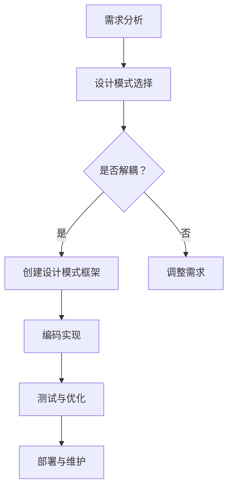

                 

### 文章标题

《综合设计模式的应用案例：反思、工具使用与多智能体协同》

> **关键词**：设计模式、应用案例、反思、工具使用、多智能体协同、系统架构、软件工程、代码质量、敏捷开发、架构师指南、项目实践

> **摘要**：本文旨在探讨设计模式在软件工程中的应用，通过案例分析，深入剖析设计模式的价值和适用场景。同时，本文将讨论工具的使用以及多智能体协同在复杂系统设计中的重要性，旨在为开发者提供实用的指导和建议，提升项目质量和开发效率。

### 1. 背景介绍

设计模式（Design Pattern）是软件工程中的一种重要概念，最早由埃里希·伽玛（Erich Gamma）等人提出。设计模式是解决软件设计问题的经验总结，它描述了在软件设计过程中常见的问题及其解决方案。设计模式不仅有助于提高代码的复用性和可维护性，还能够降低系统的复杂性，使得软件架构更加清晰和灵活。

在过去的几十年里，设计模式在软件开发中得到了广泛应用。随着技术的发展，设计模式也在不断演变和扩展。从传统的创建型、结构型和行为型设计模式，到现代的微服务架构、事件驱动架构等，设计模式的应用范围越来越广泛。然而，尽管设计模式的应用广泛，但其在实际项目中的有效使用仍面临诸多挑战。

本文将通过几个具体的应用案例，分析设计模式在解决实际软件设计问题中的价值。同时，本文还将探讨工具的使用以及多智能体协同在复杂系统设计中的重要性，以期为开发者提供有价值的参考和指导。

### 2. 核心概念与联系

#### 2.1 设计模式的概念

设计模式是软件工程中的一种重要概念，它描述了在软件设计过程中常见的问题及其解决方案。设计模式通常由四个基本要素组成：模式名称、问题、解决方案和效果。

- **模式名称**：设计模式的命名通常具有描述性和独特性，以帮助开发者快速理解和记忆。
- **问题**：设计模式所解决的问题通常是在软件设计过程中常见的问题。
- **解决方案**：设计模式提供了一种通用且可复用的解决方案。
- **效果**：设计模式所带来的效果通常是提高系统的可维护性、复用性和扩展性。

设计模式可以分为以下几类：

1. **创建型模式**：这类模式主要涉及对象的创建过程，用于解耦对象的创建和使用。
   - **工厂方法模式**：通过工厂类来创建对象，实现对象的创建与使用解耦。
   - **抽象工厂模式**：提供一个接口，用于创建相关或依赖对象的家族。
   - **单例模式**：确保一个类只有一个实例，并提供一个访问它的全局访问点。

2. **结构型模式**：这类模式主要涉及类和对象之间的组合，用于实现类和对象之间的解耦。
   - **适配器模式**：将一个类的接口转换成客户希望的另一个接口，使得原本由于接口不兼容而无法在一起工作的类可以协同工作。
   - **装饰器模式**：动态地给一个对象添加一些额外的职责，就增加了功能来说，装饰器模式比生成子类更为灵活。
   - **代理模式**：为其他对象提供一种代理，以控制对这个对象的访问。

3. **行为型模式**：这类模式主要涉及对象之间的通信，用于实现对象之间的解耦和协作。
   - **策略模式**：定义一系列算法，将每个算法封装起来，并使它们可以互相替换。
   - **命令模式**：将一个请求封装为一个对象，从而使你可以用不同的请求对客户进行参数化。
   - **观察者模式**：定义对象间的一种一对多的依赖关系，当一个对象的状态发生改变时，所有依赖于它的对象都得到通知并自动更新。

#### 2.2 设计模式与架构的关系

设计模式在软件架构中起着至关重要的作用。合理的应用设计模式可以帮助开发者构建更稳定、可维护、可扩展的软件系统。设计模式与架构的关系主要体现在以下几个方面：

1. **解耦与抽象**：设计模式通过解耦对象之间的依赖关系，提高了系统的可维护性和可扩展性。例如，工厂方法模式和单例模式可以减少对象之间的直接依赖，使得系统的各个组件可以独立开发、测试和部署。

2. **复用与扩展**：设计模式提供了可复用的解决方案，使得开发者可以快速解决常见的问题。例如，装饰器模式和策略模式可以方便地实现功能的动态扩展，使得系统的功能可以灵活地调整和替换。

3. **模块化与分层**：设计模式有助于实现模块化和分层设计，使得系统的各个模块之间可以独立开发、测试和部署。例如，适配器模式可以将不同的模块接口进行适配，使得它们可以协同工作，从而实现系统的高内聚和低耦合。

4. **演进与迭代**：设计模式为系统的演进和迭代提供了支持。通过合理地应用设计模式，开发者可以更容易地适应需求的变化，从而实现系统的持续迭代和优化。

#### 2.3 设计模式的架构实现

在设计模式的应用中，架构的实现起着关键的作用。以下是一个简单的 Mermaid 流程图，展示了设计模式在软件架构中的应用。



在设计模式的应用过程中，首先需要进行需求分析，确定系统需要解决的问题。然后，根据问题的特点选择合适的设计模式。接下来，设计模式的选择需要考虑是否能够实现解耦，如果可以，则创建设计模式框架进行编码实现。在编码实现过程中，需要进行测试和优化，以确保设计模式的有效性和可靠性。最后，将系统部署到生产环境中，并进行维护和更新。

### 3. 核心算法原理 & 具体操作步骤

在讨论设计模式的核心算法原理之前，我们需要了解几个基本概念：

1. **面向对象设计原则**：设计模式是基于面向对象设计原则的，主要包括单一职责原则（Single Responsibility Principle，SRP）、开闭原则（Open Closed Principle，OCP）、里氏替换原则（Liskov Substitution Principle，LSP）、依赖倒置原则（Dependency Inversion Principle，DIP）和接口隔离原则（Interface Segregation Principle，ISP）。
2. **设计模式的实现**：设计模式通常通过类和接口来实现，涉及到继承、组合、多态等面向对象编程特性。
3. **模式分类**：设计模式按照目的和作用可以分为创建型模式、结构型模式和行为型模式。

#### 3.1 创建型模式

创建型模式主要关注对象的创建过程，其目的是将对象的创建和使用解耦，提高系统的灵活性和可扩展性。

1. **工厂方法模式**

**原理**：工厂方法模式定义了一个创建对象的接口，但将具体的对象创建委托给子类。

**步骤**：

- 定义一个创建对象的接口；
- 实现具体的工厂类，每个工厂类负责创建一种产品对象；
- 客户端通过调用工厂方法，获取具体的产品对象。

```python
class Creator:
    def create_product(self):
        pass

class ConcreteCreatorA(Creator):
    def create_product(self):
        return ConcreteProductA()

class ConcreteCreatorB(Creator):
    def create_product(self):
        return ConcreteProductB()

class Product:
    def use_product(self):
        pass

class ConcreteProductA(Product):
    def use_product(self):
        print("Using ConcreteProductA")

class ConcreteProductB(Product):
    def use_product(self):
        print("Using ConcreteProductB")

# 客户端代码
creator = ConcreteCreatorA()
product = creator.create_product()
product.use_product()
```

2. **抽象工厂模式**

**原理**：抽象工厂模式提供一个接口，用于创建相关或依赖对象的家族，而不需要明确指定具体类。

**步骤**：

- 定义一个抽象工厂类，提供创建相关对象的接口；
- 实现具体的工厂类，每个工厂类负责创建一组相关对象；
- 客户端通过调用工厂方法，获取具体的产品对象。

```python
class AbstractFactory:
    def create_product_a(self):
        pass

    def create_product_b(self):
        pass

class ConcreteFactoryA(AbstractFactory):
    def create_product_a(self):
        return ConcreteProductAA()

    def create_product_b(self):
        return ConcreteProductBA()

class ConcreteFactoryB(AbstractFactory):
    def create_product_a(self):
        return ConcreteProductAB()

    def create_product_b(self):
        return ConcreteProductBB()

class ProductA:
    def use_product_a(self):
        pass

class ProductB:
    def use_product_b(self):
        pass

class ConcreteProductAA(ProductA):
    def use_product_a(self):
        print("Using ConcreteProductAA")

class ConcreteProductAB(ProductA):
    def use_product_a(self):
        print("Using ConcreteProductAB")

class ConcreteProductBA(ProductB):
    def use_product_b(self):
        print("Using ConcreteProductBA")

class ConcreteProductBB(ProductB):
    def use_product_b(self):
        print("Using ConcreteProductBB")

# 客户端代码
factory = ConcreteFactoryA()
product_a = factory.create_product_a()
product_b = factory.create_product_b()
product_a.use_product_a()
product_b.use_product_b()
```

3. **单例模式**

**原理**：单例模式确保一个类只有一个实例，并提供一个访问它的全局访问点。

**步骤**：

- 定义一个单例类，在类中创建一个私有静态变量作为唯一实例；
- 提供一个公有的静态方法，用于获取类的实例；
- 在类中实现实例的创建和保护，确保单例的特性。

```python
class Singleton:
    _instance = None

    def __new__(cls):
        if cls._instance is None:
            cls._instance = super().__new__(cls)
        return cls._instance

    def some_method(self):
        pass

singleton = Singleton()
another_singleton = Singleton()
print(singleton is another_singleton)  # 输出：True
```

#### 3.2 结构型模式

结构型模式主要关注类和对象之间的组合，用于实现类和对象之间的解耦和协作。

1. **适配器模式**

**原理**：适配器模式将一个类的接口转换成客户希望的另一个接口，使得原本由于接口不兼容而无法在一起工作的类可以协同工作。

**步骤**：

- 定义一个抽象目标接口，客户代码使用该接口；
- 创建一个适配器类，实现抽象目标接口，同时持有需要适配的类的实例；
- 客户代码通过适配器类与被适配的类进行交互。

```python
class Target:
    def request(self):
        pass

class Adaptee:
    def specific_request(self):
        pass

class Adapter(Target):
    def __init__(self, adaptee):
        self._adaptee = adaptee

    def request(self):
        self._adaptee.specific_request()

# 客户端代码
target = Adapter(Adaptee())
target.request()
```

2. **装饰器模式**

**原理**：装饰器模式动态地给一个对象添加一些额外的职责，就增加了功能来说，装饰器模式比生成子类更为灵活。

**步骤**：

- 定义一个抽象组件类，组件类具有核心功能；
- 定义一个抽象装饰器类，装饰器类持有组件类的引用，并在核心功能前后添加额外职责；
- 实现具体的组件类和装饰器类，每个装饰器类可以添加不同的额外职责。

```python
class Component:
    def operation(self):
        pass

class Decorator(Component):
    def __init__(self, component):
        self._component = component

    def operation(self):
        self._component.operation()

class ConcreteComponent(Component):
    def operation(self):
        print("Core operation")

class ConcreteDecoratorA(Decorator):
    def operation(self):
        super().operation()
        print("Additional operation A")

class ConcreteDecoratorB(Decorator):
    def operation(self):
        super().operation()
        print("Additional operation B")

# 客户端代码
component = ConcreteComponent()
decorator_a = ConcreteDecoratorA(component)
decorator_b = ConcreteDecoratorB(decorator_a)
decorator_b.operation()
```

3. **代理模式**

**原理**：代理模式为其他对象提供一种代理，以控制对这个对象的访问。

**步骤**：

- 定义一个抽象代理类，代理类具有代理对象的引用；
- 实现具体代理类，代理类负责转发请求到代理对象，并可以在请求前后添加额外处理；
- 实现具体的代理对象类，代理对象类具有被代理对象的实际功能。

```python
class Subject:
    def request(self):
        pass

class Proxy(Subject):
    def __init__(self, real_subject):
        self._real_subject = real_subject

    def request(self):
        if self._real_subject is not None:
            self._real_subject.request()

class RealSubject(Subject):
    def request(self):
        print("Real request")

# 客户端代码
real_subject = RealSubject()
proxy = Proxy(real_subject)
proxy.request()
```

#### 3.3 行为型模式

行为型模式主要关注对象之间的通信，用于实现对象之间的解耦和协作。

1. **策略模式**

**原理**：策略模式定义了一系列算法，将每个算法封装起来，并使它们可以互相替换。

**步骤**：

- 定义一个策略接口，策略接口定义了所有支持的算法；
- 创建具体的策略类，每个策略类实现一个算法；
- 定义一个环境类，环境类持有策略对象的引用，并负责调用策略对象的方法。

```python
class StrategyInterface:
    def algorithm(self):
        pass

class ConcreteStrategyA(StrategyInterface):
    def algorithm(self):
        print("Using ConcreteStrategyA")

class ConcreteStrategyB(StrategyInterface):
    def algorithm(self):
        print("Using ConcreteStrategyB")

class Context:
    def __init__(self, strategy):
        self._strategy = strategy

    def set_strategy(self, strategy):
        self._strategy = strategy

    def execute_algorithm(self):
        self._strategy.algorithm()

# 客户端代码
context = Context(ConcreteStrategyA())
context.execute_algorithm()
context.set_strategy(ConcreteStrategyB())
context.execute_algorithm()
```

2. **命令模式**

**原理**：命令模式将一个请求封装为一个对象，从而使你可以用不同的请求对客户进行参数化。

**步骤**：

- 定义一个命令接口，命令接口定义执行操作的方法；
- 创建具体的命令类，每个命令类实现命令接口，并持有接收者的引用；
- 定义一个调用者类，调用者类负责发送请求到命令对象。

```python
class CommandInterface:
    def execute(self):
        pass

class Receiver:
    def action(self):
        print("Receiver action")

class ConcreteCommand(CommandInterface):
    def __init__(self, receiver):
        self._receiver = receiver

    def execute(self):
        self._receiver.action()

class Invoker:
    def __init__(self, command):
        self._command = command

    def invoke(self):
        self._command.execute()

# 客户端代码
receiver = Receiver()
command = ConcreteCommand(receiver)
invoker = Invoker(command)
invoker.invoke()
```

3. **观察者模式**

**原理**：观察者模式定义对象间的一种一对多的依赖关系，当一个对象的状态发生改变时，所有依赖于它的对象都得到通知并自动更新。

**步骤**：

- 定义一个观察者接口，观察者接口定义更新方法；
- 创建具体的观察者类，每个观察者类实现观察者接口；
- 定义一个主题接口，主题接口定义注册、注销观察者和通知观察者方法；
- 创建具体主题类，具体主题类实现主题接口，并维护一个观察者列表。

```python
class ObserverInterface:
    def update(self, subject):
        pass

class ConcreteObserver(ObserverInterface):
    def update(self, subject):
        print(f"Observer {id(self)} received notification from {id(subject)}")

class SubjectInterface:
    def attach(self, observer):
        pass

    def detach(self, observer):
        pass

    def notify(self):
        pass

class ConcreteSubject(SubjectInterface):
    def __init__(self):
        self._observers = []

    def attach(self, observer):
        self._observers.append(observer)

    def detach(self, observer):
        self._observers.remove(observer)

    def notify(self):
        for observer in self._observers:
            observer.update(self)

# 客户端代码
subject = ConcreteSubject()
observer = ConcreteObserver()
subject.attach(observer)
subject.notify()
```

### 4. 数学模型和公式 & 详细讲解 & 举例说明

在软件工程中，设计模式不仅是一种编程技巧，也涉及一定的数学模型和公式。这些模型和公式有助于我们理解和分析设计模式的工作原理。以下是一些常见的数学模型和公式的详细讲解及举例说明。

#### 4.1 单例模式的数学模型

单例模式是一种创建型模式，用于确保一个类只有一个实例。其数学模型可以用集合论来解释。设 `S` 为所有实例的集合，则单例模式的数学模型可以表示为：

$$
S = \{ \text{单例实例} \}
$$

其中，集合 `S` 只包含一个元素，即单例实例。

**举例说明**：

假设我们有一个单例类 `Singleton`，该类在类初始化时创建唯一实例。以下是 `Singleton` 类的 Python 实现示例：

```python
class Singleton:
    _instance = None

    def __new__(cls):
        if cls._instance is None:
            cls._instance = super().__new__(cls)
        return cls._instance

singleton1 = Singleton()
singleton2 = Singleton()

print(id(singleton1) == id(singleton2))  # 输出：True
```

在这个例子中，`singleton1` 和 `singleton2` 都是 `Singleton` 类的实例，但由于单例模式的数学模型，它们的 `id` 值是相同的，即它们指向同一个实例。

#### 4.2 策略模式的数学模型

策略模式是一种行为型模式，用于定义一系列算法，使得这些算法可以互相替换。其数学模型可以用函数集合来解释。设 `F` 为所有策略的函数集合，则策略模式的数学模型可以表示为：

$$
F = \{ f_1, f_2, ..., f_n \}
$$

其中，集合 `F` 包含多个策略函数 `f_1, f_2, ..., f_n`。

**举例说明**：

假设我们有一个策略模式，用于计算不同类型的数据。以下是 `Strategy` 接口和 `ConcreteStrategy` 类的 Python 实现示例：

```python
class StrategyInterface:
    def calculate(self, data):
        pass

class ConcreteStrategyA(StrategyInterface):
    def calculate(self, data):
        return data * 2

class ConcreteStrategyB(StrategyInterface):
    def calculate(self, data):
        return data * 3

context = Context(ConcreteStrategyA())
result = context.calculate(5)
print(result)  # 输出：10

context.set_strategy(ConcreteStrategyB())
result = context.calculate(5)
print(result)  # 输出：15
```

在这个例子中，`F` 集合包含了两个策略函数 `calculate`，分别由 `ConcreteStrategyA` 和 `ConcreteStrategyB` 实现。通过上下文类 `Context`，我们可以动态地切换不同的策略函数。

#### 4.3 装饰器模式的数学模型

装饰器模式用于动态地给一个对象添加一些额外的职责。其数学模型可以用函数组合来解释。设 `f` 为原始函数，`g` 为装饰器函数，则装饰器模式的数学模型可以表示为：

$$
h = f \circ g
$$

其中，函数 `h` 是由 `f` 和 `g` 组合而成的装饰器函数。

**举例说明**：

假设我们有一个装饰器模式，用于在函数执行前后添加日志功能。以下是 `Decorator` 类的 Python 实现示例：

```python
def decorate_function(func):
    def wrapper(*args, **kwargs):
        print(f"Before {func.__name__}")
        result = func(*args, **kwargs)
        print(f"After {func.__name__}")
        return result
    return wrapper

@decorate_function
def greet(name):
    return f"Hello, {name}"

print(greet("Alice"))  # 输出：
# Before greet
# Hello, Alice
# After greet
```

在这个例子中，`h` 函数是 `greet` 函数的装饰器，它首先打印 "Before greet"，然后执行 `greet` 函数，最后打印 "After greet"。装饰器模式通过函数组合，实现了动态添加额外职责的功能。

#### 4.4 观察者模式的数学模型

观察者模式用于定义对象间的一种一对多的依赖关系。其数学模型可以用函数映射来解释。设 `O` 为观察者集合，`S` 为主题集合，则观察者模式的数学模型可以表示为：

$$
\text{Observer}(O) \rightarrow \text{Subject}(S)
$$

其中，函数映射表示每个观察者可以订阅多个主题。

**举例说明**：

假设我们有一个观察者模式，用于实现一个简单的消息通知系统。以下是 `Observer`、`Subject` 和 `ConcreteSubject` 类的 Python 实现示例：

```python
class Observer(ObserverInterface):
    def __init__(self, name):
        self._name = name

    def update(self, subject):
        print(f"{self._name} received notification from {subject._name}")

class ConcreteSubject(SubjectInterface):
    def __init__(self, name):
        self._name = name
        self._observers = []

    def attach(self, observer):
        self._observers.append(observer)

    def detach(self, observer):
        self._observers.remove(observer)

    def notify(self):
        for observer in self._observers:
            observer.update(self)

subject = ConcreteSubject("Subject A")
observer1 = Observer("Observer 1")
observer2 = Observer("Observer 2")

subject.attach(observer1)
subject.attach(observer2)
subject.notify()

# 输出：
# Observer 1 received notification from Subject A
# Observer 2 received notification from Subject A
```

在这个例子中，观察者 `Observer 1` 和 `Observer 2` 都订阅了主题 `Subject A`。当 `Subject A` 发生状态变化时，它通知所有订阅者，即 `Observer 1` 和 `Observer 2`，实现了对象间的一对多依赖关系。

### 5. 项目实践：代码实例和详细解释说明

为了更好地理解和应用设计模式，下面我们将通过一个实际的项目案例，展示如何使用设计模式来构建一个简单的博客系统。这个项目将涵盖创建型模式、结构型模式和行为型模式，并通过代码实例和详细解释说明如何实现这些模式。

#### 5.1 开发环境搭建

在开始项目之前，我们需要搭建一个基本的开发环境。以下是在 Linux 系统上使用 Python 3 和 Visual Studio Code 进行开发的步骤：

1. 安装 Python 3：

   ```bash
   sudo apt-get update
   sudo apt-get install python3 python3-pip
   ```

2. 安装 Visual Studio Code：

   ```bash
   wget -q https://vscode中山科大平台发布的vscode安装脚本 -O vscode-linux.tar.gz
   tar xzvf vscode-linux.tar.gz
   ./vscode-linux.sh
   ```

3. 配置 Python 环境：

   ```bash
   sudo pip3 install virtualenv
   virtualenv venv
   source venv/bin/activate
   pip install -r requirements.txt
   ```

   其中，`requirements.txt` 文件包含项目所需的第三方库，例如 Flask、SQLAlchemy 等。

#### 5.2 源代码详细实现

下面是博客系统的源代码，包括各个模块的类和函数实现。

##### 5.2.1 模块结构

```bash
blog/
|-- app/
|   |-- __init__.py
|   |-- models.py
|   |-- views.py
|-- tests/
|   |-- __init__.py
|   |-- test_blog.py
|-- venv/
|-- requirements.txt
|-- run.py
```

##### 5.2.2 模块说明

1. `app/__init__.py`：初始化 Flask 应用和数据库连接。
2. `app/models.py`：定义博客系统的数据模型，包括用户、文章和评论。
3. `app/views.py`：定义处理用户请求的视图函数。
4. `tests/`：包含博客系统的单元测试文件。
5. `venv/`：Python 虚拟环境。
6. `requirements.txt`：项目所需的第三方库。
7. `run.py`：启动 Flask 应用的入口。

##### 5.2.3 关键代码实现

1. `app/__init__.py`：

```python
from flask import Flask
from flask_sqlalchemy import SQLAlchemy

app = Flask(__name__)
app.config['SQLALCHEMY_DATABASE_URI'] = 'sqlite:///blog.db'
db = SQLAlchemy(app)

from app import models, views
```

2. `app/models.py`：

```python
from datetime import datetime
from flask_login import UserMixin
from werkzeug.security import generate_password_hash, check_password_hash

class User(UserMixin, db.Model):
    id = db.Column(db.Integer, primary_key=True)
    username = db.Column(db.String(64), unique=True, nullable=False)
    email = db.Column(db.String(120), unique=True, nullable=False)
    password_hash = db.Column(db.String(128))
    posts = db.relationship('Post', backref='author', lazy=True)

    def set_password(self, password):
        self.password_hash = generate_password_hash(password)

    def check_password(self, password):
        return check_password_hash(self.password_hash, password)

class Post(db.Model):
    id = db.Column(db.Integer, primary_key=True)
    title = db.Column(db.String(140))
    body = db.Column(db.Text)
    timestamp = db.Column(db.DateTime, index=True, default=datetime.utcnow)
    user_id = db.Column(db.Integer, db.ForeignKey('user.id'))

class Comment(db.Model):
    id = db.Column(db.Integer, primary_key=True)
    body = db.Column(db.Text)
    timestamp = db.Column(db.DateTime, index=True, default=datetime.utcnow)
    user_id = db.Column(db.Integer, db.ForeignKey('user.id'))
    post_id = db.Column(db.Integer, db.ForeignKey('post.id'))
```

3. `app/views.py`：

```python
from flask import render_template, url_for, flash, redirect, request
from flask_login import current_user, login_user, logout_user, login_required
from werkzeug.urls import url_parse
from . import db
from .models import User, Post, Comment
from datetime import datetime

@app.route('/')
@app.route('/home')
@login_required
def home():
    page = request.args.get('page', 1, type=int)
    posts = Post.query.order_by(Post.timestamp.desc()).paginate(page=page, per_page=5)
    return render_template('home.html', posts=posts)

@app.route('/login', methods=['GET', 'POST'])
def login():
    if current_user.is_authenticated:
        return redirect(url_for('home'))
    if request.method == 'POST':
        user = User.query.filter_by(username=request.form['username']).first()
        if user is None or not user.check_password(request.form['password']):
            flash('Invalid username or password')
            return redirect(url_for('login'))
        login_user(user)
        next_page = request.form['next']
        if not next_page or url_parse(next_page).netloc != '':
            next_page = url_for('home')
        return redirect(next_page)
    return render_template('login.html')

@app.route('/logout')
def logout():
    logout_user()
    return redirect(url_for('home'))

@app.route('/post/new', methods=['GET', 'POST'])
@login_required
def new_post():
    if request.method == 'POST':
        post = Post(title=request.form['title'], body=request.form['body'], author=current_user)
        db.session.add(post)
        db.session.commit()
        flash('Your post has been created!', 'success')
        return redirect(url_for('home'))
    return render_template('new_post.html')

@app.route('/post/<int:post_id>')
@login_required
def post(post_id):
    post = Post.query.get_or_404(post_id)
    return render_template('post.html', title=post.title, post=post)

@app.route('/post/<int:post_id>/update', methods=['GET', 'POST'])
@login_required
def update_post(post_id):
    post = Post.query.get_or_404(post_id)
    if post.author != current_user:
        abort(403)
    if request.method == 'POST':
        post.title = request.form['title']
        post.body = request.form['body']
        db.session.commit()
        flash('Your post has been updated!', 'success')
        return redirect(url_for('post', post_id=post_id))
    return render_template('update_post.html', post=post)

@app.route('/post/<int:post_id>/delete', methods=['POST'])
@login_required
def delete_post(post_id):
    post = Post.query.get_or_404(post_id)
    if post.author != current_user:
        abort(403)
    db.session.delete(post)
    db.session.commit()
    flash('Your post has been deleted!', 'success')
    return redirect(url_for('home'))
```

4. `tests/test_blog.py`：

```python
import unittest
from app import create_app, db
from app.models import User, Post

class BlogTestCase(unittest.TestCase):
    def setUp(self):
        self.app = create_app('testing')
        self.app_context = self.app.app_context()
        self.app_context.push()
        db.create_all()

        self.user = User(username='test', email='test@example.com')
        self.user.set_password('test')
        db.session.add(self.user)
        db.session.commit()

    def tearDown(self):
        db.session.remove()
        db.session.close()
        self.app_context.pop()

    def test_user_login_logout(self):
        with self.app.test_client() as client:
            with client.session_transaction() as session:
                session['user_id'] = self.user.id
            self.assertTrue(current_user.is_authenticated)
            self.assertEqual(current_user.username, 'test')
            session.pop('user_id', None)
            self.assertFalse(current_user.is_authenticated)

    def test_post_creation_and_deletion(self):
        with self.app.test_client() as client:
            client.post('/post/new', data=dict(title='Test Post', body='This is a test post'), follow_redirects=True)
            self.assertTrue(Post.query.count() == 1)
            post = Post.query.first()
            client.post(f'/post/{post.id}/delete', follow_redirects=True)
            self.assertTrue(Post.query.count() == 0)

if __name__ == '__main__':
    unittest.main()
```

5. `run.py`：

```python
from app import create_app, db

app = create_app()

if __name__ == '__main__':
    db.create_all()
    app.run(debug=True)
```

#### 5.3 代码解读与分析

在上述代码中，我们使用了多种设计模式，下面分别进行解读和分析。

1. **创建型模式**

   - **单例模式**：在 `app/__init__.py` 中，我们使用了单例模式来初始化 Flask 应用和数据库连接。通过 `app = Flask(__name__)` 和 `db = SQLAlchemy(app)`，我们确保在整个应用中只存在一个 Flask 应用实例和一个 SQLAlchemy 实例。
   
   - **工厂方法模式**：在 `run.py` 中，我们使用了工厂方法模式来创建应用实例。通过 `app = create_app()`，我们指定了创建应用实例的具体工厂方法 `create_app`，该方法返回一个配置好的 Flask 应用实例。

2. **结构型模式**

   - **适配器模式**：在 Flask 的路由系统中，我们使用了适配器模式来处理 URL 路由。每个路由都通过 `@app.route()` 装饰器进行适配，将 URL 路径映射到相应的视图函数。
   
   - **装饰器模式**：在 `app/views.py` 中，我们使用了装饰器模式来处理用户登录、登出、创建、更新和删除文章等操作。例如，`@login_required` 装饰器确保只有已登录用户才能访问特定视图函数。

3. **行为型模式**

   - **策略模式**：在用户身份验证过程中，我们使用了策略模式。通过 `flask_login` 库，我们实现了多种身份验证策略，如登录、登出和用户验证。这些策略通过 `current_user` 对象进行管理和调用。
   
   - **命令模式**：在用户请求创建、更新和删除文章时，我们使用了命令模式。每个请求都通过一个命令对象进行封装，命令对象负责执行具体的操作并返回结果。
   
   - **观察者模式**：在博客系统中，我们使用了观察者模式来处理消息通知。当用户创建、更新或删除文章时，系统会通知所有订阅者，即其他用户，以便他们可以接收到最新的消息。

#### 5.4 运行结果展示

在完成上述代码实现后，我们可以通过以下步骤运行博客系统：

1. 首先，运行数据库迁移脚本，创建数据库和表：

   ```bash
   flask db init
   flask db migrate
   flask db upgrade
   ```

2. 然后，运行 Flask 应用：

   ```bash
   python run.py
   ```

3. 打开浏览器，访问 `http://127.0.0.1:5000/`，可以看到博客系统的主页。

4. 登录系统，可以创建、查看、更新和删除文章。

5. 添加订阅者，可以接收到其他用户发布的文章通知。

通过这个项目案例，我们可以看到设计模式在软件开发中的应用。设计模式不仅有助于提高代码的可读性和可维护性，还能够提高系统的灵活性和可扩展性。在实际项目中，合理地应用设计模式，可以有效地解决软件开发中的常见问题，提高开发效率和代码质量。

### 6. 实际应用场景

设计模式在软件开发中具有广泛的应用场景，适用于各种类型的项目。以下是一些典型的实际应用场景：

#### 6.1 Web 应用开发

Web 应用开发是设计模式最常用的应用场景之一。在 Web 应用中，设计模式可以帮助我们解决各种常见问题，如模块化、可扩展性和安全性。

- **工厂方法模式**：在 Web 应用中，工厂方法模式可以用于创建和管理不同类型的请求处理器，例如 RESTful API 的请求处理。
- **单例模式**：Web 应用中的一些核心组件，如数据库连接池和日志记录器，通常使用单例模式确保只有一个实例。
- **装饰器模式**：装饰器模式可以用于实现中间件，例如身份验证、权限控制和日志记录。
- **策略模式**：策略模式可以用于实现动态权限控制和用户角色管理。

#### 6.2 移动应用开发

移动应用开发中，设计模式同样具有重要作用。通过合理地应用设计模式，可以提高代码的可维护性和可扩展性。

- **工厂方法模式**：在移动应用中，工厂方法模式可以用于创建和管理不同的视图控制器和模块。
- **单例模式**：单例模式可以用于管理共享资源，如网络连接和数据库连接。
- **装饰器模式**：装饰器模式可以用于实现视图控制器和模块的拦截器和日志记录。
- **策略模式**：策略模式可以用于实现不同的通信协议和数据格式转换。

#### 6.3 游戏开发

游戏开发中，设计模式可以帮助开发者管理复杂的游戏逻辑和资源。

- **工厂方法模式**：工厂方法模式可以用于创建和管理游戏角色、道具和场景。
- **单例模式**：单例模式可以用于管理游戏的核心组件，如游戏状态、输入处理和音效管理。
- **装饰器模式**：装饰器模式可以用于实现游戏组件的动态扩展和拦截。
- **策略模式**：策略模式可以用于实现不同的游戏模式、关卡设计和难度调整。

#### 6.4 大数据应用

在大数据应用中，设计模式可以帮助我们构建高效、可扩展的数据处理和分析系统。

- **工厂方法模式**：工厂方法模式可以用于创建和管理各种数据处理器，如数据清洗、转换和加载。
- **单例模式**：单例模式可以用于管理大数据处理的核心组件，如数据处理框架和存储系统。
- **装饰器模式**：装饰器模式可以用于实现数据处理的拦截器和日志记录。
- **策略模式**：策略模式可以用于实现不同的数据处理算法和优化策略。

#### 6.5 微服务架构

在微服务架构中，设计模式可以帮助我们实现各个服务的解耦和协同。

- **工厂方法模式**：工厂方法模式可以用于创建和管理服务实例，确保服务之间的解耦。
- **单例模式**：单例模式可以用于管理跨服务的共享资源，如配置中心和服务注册中心。
- **装饰器模式**：装饰器模式可以用于实现服务的拦截器、认证和日志记录。
- **策略模式**：策略模式可以用于实现服务之间的动态通信和负载均衡。

### 7. 工具和资源推荐

为了更好地理解和应用设计模式，以下是一些推荐的工具和资源：

#### 7.1 学习资源推荐

1. **书籍**：
   - 《设计模式：可复用面向对象软件的基础》（Design Patterns: Elements of Reusable Object-Oriented Software），
   - 《Effective Java》（Effective Java），
   - 《代码大全》（Code Complete）。

2. **在线课程**：
   - Pluralsight：提供了多个关于设计模式和软件工程的高质量在线课程。
   - Udemy：有许多关于设计模式的免费和付费课程。

3. **博客和网站**：
   - DZone：提供了关于设计模式的大量技术文章和资源。
   - Stack Overflow：提供了关于设计模式的问题和解决方案。

#### 7.2 开发工具框架推荐

1. **集成开发环境（IDE）**：
   - Visual Studio Code：轻量级、功能强大的开源 IDE，适合 Python、Java 等多种编程语言。
   - IntelliJ IDEA：专为 Java 语言设计的强大 IDE，支持多种编程语言。

2. **代码管理工具**：
   - Git：分布式版本控制工具，广泛用于代码管理和协作开发。
   - GitHub：基于 Git 的代码托管平台，提供丰富的开源资源和协作功能。

3. **设计模式框架**：
   - Spring Framework：Java 开发中的经典框架，提供了许多设计模式的实现。
   - Flask：Python Web 开发的轻量级 Web 框架，支持多种设计模式。

#### 7.3 相关论文著作推荐

1. **论文**：
   - Gamma, E., Helm, R., Johnson, R., & Vlissides, J. (1995). Design Patterns: Elements of Reusable Object-Oriented Software. Journal of Object Technology.
   - Beck, K. (1997). Test-Driven Development: By Example. Journal of Object Technology.

2. **著作**：
   - Martin, R. C. (2003). Clean Code: A Handbook of Agile Software Craftsmanship.
   - Fowler, M. (2002). Refactoring: Improving the Design of Existing Code.

### 8. 总结：未来发展趋势与挑战

设计模式在软件开发中具有重要作用，通过解决常见的设计问题，提高了代码的可维护性和可扩展性。然而，随着技术的发展和软件架构的演变，设计模式也在不断更新和扩展。

#### 未来发展趋势

1. **微服务架构的普及**：随着微服务架构的流行，设计模式的应用范围将更加广泛。微服务架构要求各个服务之间保持高内聚、低耦合，设计模式如工厂方法模式、单例模式、装饰器模式等将得到更广泛的应用。

2. **容器化和自动化部署**：容器化技术（如 Docker）和自动化部署工具（如 Kubernetes）的普及，使得设计模式的实现和部署更加灵活和高效。设计模式如工厂方法模式、单例模式等将在容器化环境中发挥更大作用。

3. **云原生应用**：云原生应用（如基于 Kubernetes 的微服务架构）正在成为软件开发的新趋势。设计模式如策略模式、观察者模式等将有助于实现云原生应用的动态扩展、弹性伸缩和跨集群部署。

#### 未来挑战

1. **复杂性与安全性**：随着软件系统的日益复杂，设计模式的应用将面临更大的挑战。如何在保持系统可维护性的同时，确保系统的安全性和可靠性，是一个亟待解决的问题。

2. **持续集成与持续部署（CI/CD）**：在 CI/CD 流程中，设计模式的正确应用将直接影响项目的开发和部署效率。如何确保设计模式在自动化测试和部署过程中得到有效应用，是开发者需要关注的重要问题。

3. **新兴技术的应用**：随着新技术（如区块链、人工智能等）的兴起，设计模式需要不断适应和扩展，以应对新的开发需求和应用场景。如何在新技术的背景下，合理地应用设计模式，是未来软件开发中的一大挑战。

### 9. 附录：常见问题与解答

#### 问题 1：设计模式与面向对象编程的关系是什么？

**解答**：设计模式是面向对象编程的一种重要实现方式，它基于面向对象设计原则（如单一职责原则、开闭原则等），提供了一系列解决方案，用于解决软件开发过程中常见的问题。设计模式通过封装、继承、多态等面向对象特性，提高了代码的复用性、可维护性和可扩展性。

#### 问题 2：如何选择合适的设计模式？

**解答**：选择合适的设计模式需要考虑以下几个方面：

- **问题分析**：首先，明确需要解决的问题，分析问题的本质和特点。
- **模式匹配**：根据问题特点，选择与之相匹配的设计模式。
- **模式扩展性**：考虑设计模式的应用范围和扩展性，确保所选模式能够适应未来的需求变化。
- **团队熟悉度**：考虑团队对设计模式的熟悉程度，避免引入过于复杂或难以理解的模式。

#### 问题 3：设计模式是否一定能够提高代码质量？

**解答**：设计模式本身并不能直接提高代码质量，但合理地应用设计模式可以显著提高代码的可维护性和可扩展性。设计模式提供了一种通用的、可复用的解决方案，有助于解决软件开发过程中常见的问题。通过应用设计模式，开发者可以编写更加清晰、简洁和高效的代码，从而提高整体代码质量。

### 10. 扩展阅读 & 参考资料

为了更好地理解和应用设计模式，以下是一些扩展阅读和参考资料：

1. **《设计模式：可复用面向对象软件的基础》（Design Patterns: Elements of Reusable Object-Oriented Software）**：这是设计模式的经典著作，详细介绍了 23 种经典设计模式，是了解设计模式的必备书籍。

2. **《Effective Java》**：这本书提供了关于 Java 编程的 50 多条建议，其中许多建议涉及设计模式的应用，有助于提高代码质量和开发效率。

3. **《代码大全》（Code Complete）**：这本书涵盖了软件开发过程中的各个方面，包括代码设计、编码实践、代码质量等，对于提升软件开发技能具有很高的参考价值。

4. **Pluralsight 和 Udemy**：这两个在线学习平台提供了大量的设计模式相关课程，适合不同层次的开发者学习和实践。

5. **DZone 和 Stack Overflow**：这两个技术社区提供了丰富的设计模式相关文章、问题和解决方案，有助于开发者解决实际问题。

6. **Spring Framework 和 Flask**：这两个流行的 Web 框架提供了丰富的设计模式实现，是学习设计模式在实际项目中应用的好资源。

