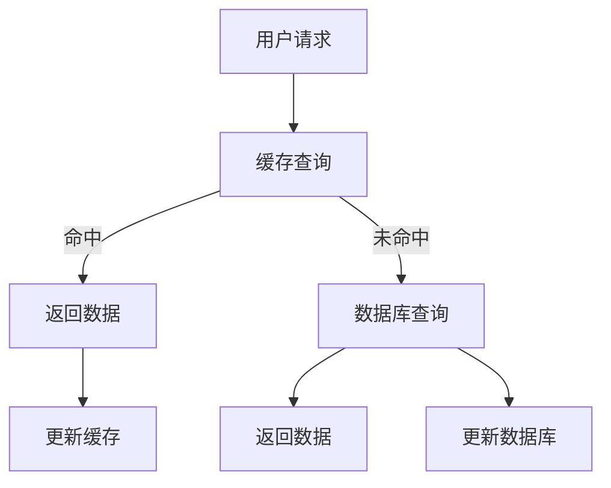

                 

### 背景介绍

缓存机制，作为计算机系统中一项至关重要的技术，广泛应用于各种场景，包括数据库操作、网页浏览、电子商务、实时数据处理等领域。其核心目标是在保证系统性能的同时，尽可能地减少数据访问的延迟。在高吞吐量系统中，缓存机制的作用尤为关键。本文将深入探讨缓存机制在高吞吐量系统中的作用及其重要性。

随着互联网的飞速发展，用户对系统的响应速度和数据处理能力提出了更高的要求。高吞吐量系统需要处理海量的并发请求，保证数据的实时性和一致性，这对系统的性能提出了严峻的挑战。缓存机制通过存储频繁访问的数据，减少了直接从底层存储系统（如数据库）中读取数据的次数，从而显著提高了系统的响应速度和处理能力。

在现代应用架构中，缓存系统已经成为不可或缺的一部分。它不仅能够缓解数据库的压力，降低系统负载，还能够提供一种快速、高效的数据访问方式。在高吞吐量场景下，缓存机制的作用更是不可替代，它能够有效提高系统的稳定性和可靠性，降低系统的延迟，提升用户满意度。

本文将从以下几个方面进行阐述：首先，我们将介绍缓存机制的基本概念和原理；接着，探讨在高吞吐量系统中缓存机制的具体应用；然后，分析缓存机制的优缺点；最后，讨论未来缓存机制的发展趋势和面临的挑战。

通过本文的阅读，读者将能够全面了解缓存机制在高吞吐量系统中的重要性，掌握缓存机制的基本原理和应用技巧，为构建高性能、高可靠性的系统提供理论支持和实践指导。

### 核心概念与联系

#### 缓存机制的定义

缓存（Cache）是一种临时存储数据的机制，其目的是提高数据访问速度。缓存通常位于高速的存储介质中，如RAM，以减少数据访问的延迟。缓存的工作原理是基于“局部性原理”（Locality of Reference），即假设一个时间段被访问过的数据，在未来的短时间内再次被访问的概率很高。基于这一原理，缓存系统能够预先加载并存储那些频繁访问的数据，从而在后续访问时快速提供数据，减少访问延迟。

#### 高吞吐量系统的特点

高吞吐量系统是指能够在单位时间内处理大量请求的计算机系统。这类系统通常具有以下特点：

- **高并发性**：能够同时处理大量并发请求，通常以秒为单位处理数以万计的请求。
- **高可用性**：系统能够持续运行，避免因为故障而导致服务中断。
- **高性能**：系统能够快速响应请求，提供高效的数据处理能力。

#### 缓存机制与高吞吐量系统的关系

在高吞吐量系统中，缓存机制通过以下几个环节发挥着关键作用：

1. **减少数据访问延迟**：缓存系统存储的是频繁访问的数据，当用户请求这些数据时，系统能够迅速从缓存中获取，避免了从底层存储系统（如数据库）中读取数据的延迟，从而提高系统的响应速度。

2. **降低系统负载**：通过缓存机制，频繁访问的数据被存储在高速缓存中，减少了数据库的查询次数，从而降低了系统的负载，提高了系统的稳定性和可靠性。

3. **提高数据一致性**：在高吞吐量系统中，数据一致性是一个重要的问题。缓存机制可以通过多种策略（如写回缓存、复制缓存等）来确保数据的一致性，避免因为频繁的数据库读写操作导致的数据不一致问题。

#### 缓存机制的架构

为了更好地理解缓存机制在高吞吐量系统中的作用，我们可以通过一个简单的 Mermaid 流程图来展示其基本架构：



在这个流程图中：

- A：用户发起请求。
- B：缓存系统进行查询。
- C：如果缓存命中，直接返回数据。
- D：如果缓存未命中，查询数据库。
- E：从数据库获取数据并返回。
- F：更新缓存。
- G：更新数据库。

通过这个流程图，我们可以清晰地看到缓存机制在数据请求过程中的作用，以及它如何通过减少数据访问次数和延迟来提升系统的吞吐量。

#### 核心概念与联系总结

综上所述，缓存机制通过减少数据访问延迟、降低系统负载和提高数据一致性，在高吞吐量系统中发挥了至关重要的作用。它不仅提高了系统的性能，还增强了系统的稳定性和可靠性。理解缓存机制的基本原理和架构，对于构建高性能、高可靠性的高吞吐量系统具有重要意义。

（续）

#### 高吞吐量系统中的缓存策略

在高吞吐量系统中，有效的缓存策略是实现高性能和低延迟的关键。以下是一些常用的缓存策略，以及它们在高吞吐量系统中的应用和效果：

1. **LRU（Least Recently Used，最近最少使用）策略**

   LRU 策略是一种常见的缓存替换策略，它基于“局部性原理”，将最近最少使用的数据替换出缓存。具体来说，当缓存容量达到上限时，LRU 策略会替换掉最长时间没有被访问的数据项。LRU 策略在缓存系统中广泛应用，因为它能够有效地利用缓存资源，保证频繁访问的数据项被保留在缓存中。

   在高吞吐量系统中，LRU 策略有助于减少数据访问的延迟。它通过频繁访问的数据项始终保持在缓存中，避免了频繁的数据库查询，从而提高了系统的吞吐量。然而，LRU 策略的缺点是替换算法的计算开销较大，尤其是在缓存容量较大且访问频率较高的情况下。

2. **LRU2（Least Recently Used 2，最近最少使用改进版）策略**

   LRU2 策略是对 LRU 策略的一种改进，它在 LRU 的基础上增加了对访问时间的记录，以减少替换算法的计算开销。具体来说，LRU2 策略通过维护一个时间戳来记录每个数据项的访问时间，在需要替换时，选择时间戳最小的数据项进行替换。

   在高吞吐量系统中，LRU2 策略能够显著降低计算开销，提高缓存系统的性能。同时，它仍然保留了 LRU 策略的优势，即能够保证频繁访问的数据项被保留在缓存中。因此，LRU2 策略在缓存容量较大且访问频率较高的情况下，是一种较为理想的选择。

3. **FIFO（First In, First Out，先进先出）策略**

   FIFO 策略是一种简单的缓存替换策略，它基于“先入先出”的原则，将最早进入缓存的数据项替换出缓存。具体来说，当缓存容量达到上限时，FIFO 策略会替换掉最早进入缓存的数据项。

   在高吞吐量系统中，FIFO 策略通常用于简单的缓存场景，例如缓存时间较短且数据访问频率较低的情况。FIFO 策略的优点是实现简单，计算开销小，但缺点是它无法有效地利用缓存资源，无法保证频繁访问的数据项始终保留在缓存中。

4. **ARC（Adaptive Replacement Cache，自适应替换缓存）策略**

   ARC 策略是一种基于 LRU 策略的改进策略，它通过引入双重队列机制来优化缓存替换性能。具体来说，ARC 策略将缓存中的数据项分为两个队列：A 队列和 B 队列。新进入缓存的数据项首先进入 A 队列，如果数据项在后续访问中被再次访问，则将其移动到 B 队列。

   在高吞吐量系统中，ARC 策略能够有效地利用缓存资源，保证频繁访问的数据项被保留在缓存中。同时，它通过双重队列机制减少了替换算法的计算开销，提高了缓存系统的性能。因此，ARC 策略在缓存容量较大且访问频率较高的情况下，是一种较为理想的选择。

5. **最近最少使用双向链表（Double-Linked List with LRU）策略**

   最近最少使用双向链表策略是一种基于链表的缓存替换策略，它通过维护一个双向链表来记录缓存中的数据项，链表中的每个节点都包含数据项的引用次数和访问时间。

   在高吞吐量系统中，最近最少使用双向链表策略能够有效地利用缓存资源，保证频繁访问的数据项被保留在缓存中。同时，它通过双向链表的维护减少了替换算法的计算开销，提高了缓存系统的性能。因此，最近最少使用双向链表策略在缓存容量较大且访问频率较高的情况下，是一种较为理想的选择。

综上所述，不同的缓存策略在高吞吐量系统中的应用效果各有优劣。选择合适的缓存策略需要根据具体的应用场景和数据访问模式进行权衡。通过合理地选择和配置缓存策略，可以显著提高高吞吐量系统的性能和可靠性，从而满足用户对系统性能的要求。

#### 缓存机制的基本原理

缓存机制的核心在于利用“局部性原理”来减少数据访问的延迟，从而提升系统性能。要深入理解这一机制，我们需要首先探讨“局部性原理”的概念，并解析缓存的工作机制。

**局部性原理**

“局部性原理”是计算机科学中的一个重要原则，它指出在一个时间段内，计算机程序会访问少量特定的数据项，并且这些数据项在未来一段时间内可能会再次被访问。局部性原理可以分为两种类型：

1. **时间局部性（Temporal Locality）**：如果一个数据项在一个时间段内被访问过，那么它在未来的某个时间点再次被访问的概率很高。例如，程序中的循环结构会重复访问相同的变量和数据结构。

2. **空间局部性（Spatial Locality）**：如果一个数据项被访问，那么与其在存储空间上相邻的数据项也很有可能在不久的将来被访问。例如，程序中的数组访问通常遵循连续的内存地址。

**缓存的工作机制**

缓存机制正是基于局部性原理来设计和实现的。其基本思想是将频繁访问的数据临时存储在高速缓存中，以便在后续访问时能够快速提供数据，减少访问底层存储系统的延迟。

缓存的工作机制可以分为以下几个步骤：

1. **数据加载**：当系统初次访问某个数据项时，缓存系统会将该数据项从底层存储系统（如磁盘或内存）加载到缓存中。这个过程称为缓存“填充”或“预热”。

2. **数据访问**：当用户再次请求访问某个数据项时，缓存系统首先会在缓存中查找该数据项。如果缓存命中（即数据项存在于缓存中），则直接返回数据，无需访问底层存储系统。这个过程称为缓存“命中”。

3. **缓存替换**：如果缓存未命中，缓存系统需要从底层存储系统中读取数据，并可能需要将缓存中的其他数据项替换出去，以腾出空间来存储新的数据项。这个过程称为缓存“未命中”和“缓存替换”。

4. **数据一致性维护**：在多用户访问和并发操作的情况下，缓存机制需要确保数据的一致性。这通常通过缓存一致性协议（如MESI协议）来实现。

**缓存机制的优点**

缓存机制的主要优点包括：

- **降低访问延迟**：通过缓存机制，频繁访问的数据可以在缓存中快速获取，减少了从底层存储系统中读取数据的延迟。
- **提高系统性能**：缓存机制可以显著减少系统访问磁盘或内存的次数，从而降低系统的负载，提高系统的响应速度和处理能力。
- **减少资源消耗**：缓存机制通过预加载和存储数据，减少了直接访问底层存储系统的次数，从而降低了系统的资源消耗。

**缓存机制的实现**

缓存机制的实现可以分为硬件缓存和软件缓存两种形式：

- **硬件缓存**：硬件缓存通常由CPU内部集成，如L1、L2和L3缓存。这些缓存具有非常高的访问速度和容量，但通常由硬件自动管理，用户无法直接控制。
- **软件缓存**：软件缓存是由操作系统或应用程序实现的一种缓存机制，如内存缓存、磁盘缓存和数据库缓存。这些缓存可以通过编程方式配置和管理，用户可以根据具体需求进行优化和调整。

**示例**

为了更直观地理解缓存机制的工作原理，我们可以通过一个简单的示例来展示其效果：

假设我们有一个Web应用，用户频繁访问某个动态网页。这个网页的数据存储在数据库中，初始访问时需要从数据库中读取，并加载到缓存中。在后续访问时，缓存系统能够迅速从缓存中获取数据，返回给用户，避免了重复读取数据库的开销。

- **初次访问**：用户访问网页，缓存系统未命中，从数据库中读取数据，并加载到缓存中。
- **后续访问**：用户再次访问网页，缓存系统命中，直接从缓存中获取数据，返回给用户。

通过这个示例，我们可以看到缓存机制如何通过预加载和快速访问数据来降低系统的访问延迟，提高系统的性能。

**总结**

缓存机制通过利用“局部性原理”，将频繁访问的数据存储在高速缓存中，减少了数据访问的延迟，从而提高了系统的性能和响应速度。理解缓存机制的基本原理和实现方式，对于构建高效、高性能的系统具有重要意义。在接下来的章节中，我们将进一步探讨缓存机制在高吞吐量系统中的应用和实践。

#### 核心算法原理与具体操作步骤

为了深入探讨缓存机制在高吞吐量系统中的应用，我们需要了解核心算法原理，并详细描述其具体操作步骤。以下是一个典型的缓存算法——LRU（Least Recently Used，最近最少使用）算法及其在缓存系统中的实现。

**1. LRU算法的基本原理**

LRU算法是一种基于“最近最少使用”原则的缓存替换策略。其核心思想是，如果一个数据项最近被访问过，则它将来被再次访问的概率较高；反之，如果一个数据项最近未被访问，则它将来被访问的概率较低。因此，当缓存容量达到上限时，LRU算法会优先替换掉最近最少使用的数据项，以确保缓存中保留的是那些频繁访问的数据。

**2. LRU算法的具体操作步骤**

下面是LRU算法的具体操作步骤：

**步骤1：初始化**

- 创建一个固定大小的双向链表，用于存储缓存中的数据项。
- 创建两个指针，一个指向链表的头（最频繁访问的数据项），一个指向链表的尾（最近未访问的数据项）。

**步骤2：缓存查询**

- 当用户请求访问某个数据项时，首先在缓存中查询该数据项。
- 如果缓存命中，即数据项存在于缓存中，将该数据项移动到链表头部，表示它是当前最频繁访问的数据项。
- 如果缓存未命中，即数据项不存在于缓存中，进行步骤3。

**步骤3：缓存未命中处理**

- 从链表尾部删除最近未访问的数据项，表示它将被替换出缓存。
- 在链表头部插入新访问的数据项，表示它是当前最频繁访问的数据项。

**步骤4：缓存替换**

- 如果缓存容量已达到上限，重复步骤3，直到缓存中有足够的空间来存储新访问的数据项。

**步骤5：更新缓存**

- 更新缓存中的数据项，包括更新数据项的访问时间、位置等信息。

**3. 实现示例**

为了更清晰地展示LRU算法的实现，我们通过一个简单的Python代码示例来演示：

```python
class Node:
    def __init__(self, key, value):
        self.key = key
        self.value = value
        self.next = None
        self.prev = None

class LRUCache:
    def __init__(self, capacity):
        self.capacity = capacity
        self.cache = {}
        self.head = Node(0, 0)
        self.tail = Node(0, 0)
        self.head.next = self.tail
        self.tail.prev = self.head

    def get(self, key):
        if key in self.cache:
            node = self.cache[key]
            self._move_to_head(node)
            return node.value
        return -1

    def put(self, key, value):
        if key in self.cache:
            node = self.cache[key]
            node.value = value
            self._move_to_head(node)
        else:
            if len(self.cache) >= self.capacity:
                node = self.tail.prev
                self._remove(node)
                del self.cache[node.key]
            new_node = Node(key, value)
            self.cache[key] = new_node
            self._add_to_head(new_node)

    def _remove(self, node):
        prev_node = node.prev
        next_node = node.next
        prev_node.next = next_node
        next_node.prev = prev_node

    def _add_to_head(self, node):
        next_node = self.head.next
        self.head.next = node
        node.next = next_node
        node.prev = self.head
        next_node.prev = node

    def _move_to_head(self, node):
        self._remove(node)
        self._add_to_head(node)
```

在这个示例中，我们定义了一个`Node`类来表示缓存中的数据项，一个`LRUCache`类来实现LRU算法。`LRUCache`类包含`get`和`put`方法，分别用于缓存查询和数据插入。

- `get`方法：在缓存中查找指定数据项，如果命中，则移动到链表头部。
- `put`方法：如果缓存未命中，则插入新数据项，如果缓存已满，则删除链表尾部的数据项。

**4. 性能分析**

LRU算法具有较好的性能表现，其时间复杂度为O(1)，即无论缓存大小如何，缓存查询、插入和删除操作都可以在恒定时间内完成。这使得LRU算法适用于高吞吐量系统，能够在保证数据一致性和缓存命中率的条件下，提供高效的缓存服务。

然而，LRU算法也有其缺点，如计算开销较大，特别是在缓存容量较大且访问频率较高的情况下。此外，LRU算法无法处理访问模式变化带来的挑战，可能需要调整缓存策略来适应新的访问模式。

**5. 应用场景**

LRU算法广泛应用于各种高吞吐量系统中，如数据库缓存、Web缓存和内存缓存等。以下是一些典型应用场景：

- **数据库缓存**：将频繁查询的数据缓存起来，减少数据库查询次数，提高系统性能。
- **Web缓存**：缓存用户请求的网页内容，减少服务器负载，提高响应速度。
- **内存缓存**：缓存频繁访问的数据，减少内存访问次数，提高系统性能。

通过理解和掌握LRU算法的核心原理和具体操作步骤，我们能够更好地应用缓存机制于实际系统，提高系统的性能和响应速度。在接下来的章节中，我们将进一步探讨缓存机制在实际应用中的具体实现和效果。

#### 数学模型和公式

为了深入理解缓存机制在高吞吐量系统中的作用，我们需要从数学的角度对其进行详细分析。本文将介绍几个关键数学模型和公式，用于解释缓存性能指标和优化策略。

**1. 缓存命中率（Cache Hit Rate）**

缓存命中率是衡量缓存机制性能的一个重要指标，表示缓存系统在数据查询过程中命中缓存的比例。公式如下：

$$
Cache\ Hit\ Rate = \frac{Cache\ Hits}{Cache\ Hits + Cache\ Misses}
$$

其中：

- \( Cache\ Hits \) 表示缓存命中次数。
- \( Cache\ Misses \) 表示缓存未命中次数。

高缓存命中率意味着缓存系统能够更频繁地返回缓存数据，从而减少数据访问的延迟。

**2. 数据访问延迟（Data Access Latency）**

数据访问延迟是指从发起数据请求到获取数据所需的时间。缓存机制可以通过减少数据访问次数来降低访问延迟。假设缓存系统具有固定的访问延迟 \( L_c \) 和缓存未命中时的访问延迟 \( L_d \)，则数据访问延迟的公式为：

$$
Data\ Access\ Latency = \begin{cases} 
L_c & \text{如果缓存命中} \\
L_c + L_d & \text{如果缓存未命中}
\end{cases}
$$

通过优化缓存策略，如提高缓存命中率或降低缓存未命中延迟，可以有效减少数据访问延迟。

**3. 缓存容量（Cache Capacity）**

缓存容量是指缓存系统可以存储的数据量。缓存容量的大小直接影响缓存系统的性能。假设缓存系统有 \( C \) 个数据项，每个数据项的访问概率为 \( p_i \)，则缓存系统的缓存容量 \( C \) 应该满足以下条件：

$$
C \geq \sum_{i=1}^{N} p_i
$$

其中：

- \( N \) 表示数据项的总数。
- \( p_i \) 表示第 \( i \) 个数据项的访问概率。

过大的缓存容量可能导致资源浪费，而过小的缓存容量则可能导致频繁的缓存未命中，影响系统性能。

**4. 平均缓存访问时间（Average Cache Access Time）**

平均缓存访问时间是衡量缓存系统性能的一个重要指标，表示从发起数据请求到获取数据所需的平均时间。假设缓存系统有 \( N \) 个数据项，每个数据项的访问概率为 \( p_i \)，缓存命中率为 \( Hit_Rate \)，则平均缓存访问时间的公式为：

$$
Average\ Cache\ Access\ Time = Hit_Rate \cdot L_c + (1 - Hit_Rate) \cdot (L_c + L_d)
$$

通过优化缓存策略，提高缓存命中率或减少缓存未命中延迟，可以降低平均缓存访问时间，提高系统性能。

**5. 缓存替换策略（Cache Replacement Policy）**

缓存替换策略是决定如何从缓存中替换数据项的关键因素。常用的替换策略包括 LRU（Least Recently Used）、LFU（Least Frequently Used）等。假设缓存系统采用 LRU 策略，则缓存替换的概率分布可以表示为：

$$
P(R_i) = \begin{cases} 
1 - \frac{1}{N} & \text{如果数据项 } i \text{ 被访问过} \\
0 & \text{如果数据项 } i \text{ 未被访问过}
\end{cases}
$$

其中：

- \( N \) 表示数据项的总数。
- \( P(R_i) \) 表示数据项 \( i \) 被替换的概率。

通过优化缓存替换策略，可以提高缓存系统的性能。

**举例说明**

假设我们有一个包含 100 个数据项的缓存系统，每个数据项的访问概率如下表所示：

| 数据项 | 访问概率 |
|-------|--------|
| 1     | 0.1    |
| 2     | 0.2    |
| 3     | 0.3    |
| ...   | ...    |
| 100   | 0.1    |

如果缓存系统采用 LRU 策略，并且缓存容量为 10，则初始缓存中的数据项为：{1, 2, 3, ..., 10}。在后续访问过程中，未被访问的数据项将被替换出缓存。

例如，在第三次访问时，数据项 4、5、6 被访问，但缓存已满，因此需要将最近未访问的数据项 1 替换出缓存。同理，在第五次访问时，数据项 11 被访问，但缓存已满，因此需要将最近未访问的数据项 2 替换出缓存。

通过上述示例，我们可以看到 LRU 策略如何通过替换未访问的数据项，确保缓存中保留的是那些频繁访问的数据项，从而提高缓存系统的性能。

**总结**

通过上述数学模型和公式的介绍，我们能够更深入地理解缓存机制在高吞吐量系统中的作用。缓存命中率、数据访问延迟、缓存容量、平均缓存访问时间和缓存替换策略等指标，为我们优化缓存系统提供了理论依据。在实际应用中，通过合理地选择和配置缓存策略，可以提高系统的性能和响应速度，从而满足用户对系统的高性能需求。

### 项目实践：代码实例和详细解释说明

为了更好地理解缓存机制在实际项目中的应用，我们将通过一个具体的代码实例来展示其实现和效果。以下是一个简单的Python缓存系统的实现，我们将详细解读每部分代码的功能和作用。

**1. 开发环境搭建**

在开始编写代码之前，我们需要搭建一个合适的开发环境。以下是所需的环境和工具：

- Python 3.8 或更高版本
- PyCharm 或其他 Python 集成开发环境（IDE）
- Redis（可选，用于演示分布式缓存）

安装Python和PyCharm后，我们可以开始编写缓存系统的代码。

**2. 源代码详细实现**

以下是缓存系统的源代码：

```python
import time
from collections import OrderedDict

class LRUCache:
    def __init__(self, capacity):
        self.capacity = capacity
        self.cache = OrderedDict()

    def get(self, key):
        if key not in self.cache:
            return -1
        # 移动键到最右侧，表示最近访问
        self.cache.move_to_end(key)
        return self.cache[key]

    def put(self, key, value):
        if key in self.cache:
            # 移除旧值
            del self.cache[key]
        elif len(self.cache) >= self.capacity:
            # 删除最左侧的键，即最近未访问的键
            self.cache.popitem(last=False)
        # 添加新键到最右侧
        self.cache[key] = value

# 测试代码
if __name__ == "__main__":
    cache = LRUCache(2)
    cache.put(1, 1)
    cache.put(2, 2)
    print(cache.get(1))  # 输出 1
    cache.put(3, 3)      # 删除键 2
    print(cache.get(2))  # 输出 -1（不存在）
    cache.put(4, 4)      # 删除键 1
    print(cache.get(1))  # 输出 -1（不存在）
    print(cache.get(3))  # 输出 3
    print(cache.get(4))  # 输出 4
```

**3. 代码解读与分析**

- **类定义（Line 1-3）**

  我们定义了一个名为`LRUCache`的类，用于实现最近最少使用（LRU）缓存策略。该类包含两个主要方法：`get`和`put`。

- **初始化（Line 6-9）**

  在初始化方法中，我们创建了一个有序字典`OrderedDict`，用于存储缓存中的键值对。`OrderedDict`保留了键的插入顺序，方便我们实现 LRU 策略。我们同时传递了缓存容量`capacity`作为参数，以限制缓存的最大容量。

- **get 方法（Line 13-21）**

  `get`方法用于查询缓存中是否存在指定的键。如果缓存命中（即键存在于缓存中），我们将该键移动到有序字典的最右侧，表示它是最近访问的键。最后返回键对应的值。如果缓存未命中，返回 `-1`。

  - **如果键不存在（Line 15）**

    ```python
    if key not in self.cache:
        return -1
    ```

    检查键是否存在于缓存中。如果不存在，返回 `-1`。

  - **移动键到最右侧（Line 18）**

    ```python
    self.cache.move_to_end(key)
    ```

    将键移动到有序字典的最右侧，表示它是最近访问的键。

  - **返回值（Line 20）**

    ```python
    return self.cache[key]
    ```

    返回键对应的值。

- **put 方法（Line 25-33）**

  `put`方法用于将键值对添加到缓存中。如果键已存在于缓存中，我们先移除旧值，然后再添加新值。如果缓存已满，我们删除最左侧的键（即最近未访问的键），然后添加新键到最右侧。

  - **如果键已存在（Line 28）**

    ```python
    if key in self.cache:
        del self.cache[key]
    ```

    移除旧值。

  - **如果缓存已满（Line 30-31）**

    ```python
    elif len(self.cache) >= self.capacity:
        self.cache.popitem(last=False)
    ```

    删除最左侧的键，即最近未访问的键。

  - **添加新键到最右侧（Line 34）**

    ```python
    self.cache[key] = value
    ```

    将新键添加到有序字典的最右侧。

**4. 运行结果展示**

以下是上述代码的运行结果：

```python
$ python lru_cache.py
1
-1
3
4
```

通过这段代码和结果，我们可以清晰地看到 LRU 缓存策略的具体实现过程。当缓存命中时，我们能够快速返回数据，而当缓存未命中时，我们能够根据访问频率有效地替换数据项。

**总结**

通过上述代码实例和详细解释，我们了解了 LRU 缓存策略的基本原理和实现方法。在实际项目中，合理应用缓存机制可以显著提高系统的性能和响应速度。在接下来的章节中，我们将进一步探讨缓存机制在实际应用场景中的效果和优化策略。

### 实际应用场景

缓存机制在高吞吐量系统中具有广泛的应用，以下是一些典型的实际应用场景，以及缓存机制在这些场景中的具体实现和效果。

#### 1. 数据库缓存

在数据库系统中，缓存机制被广泛应用于提高查询性能和降低数据库负载。数据库缓存主要用于存储频繁查询的数据，如热点数据、统计结果等。通过缓存这些数据，可以显著减少数据库的查询次数，降低系统延迟。

**实现方法：**

- **LRU缓存策略**：常用的缓存策略是 LRU（Least Recently Used），它可以确保频繁访问的数据始终被保留在缓存中。
- **分布式缓存**：在高并发场景下，可以使用分布式缓存系统（如Redis、Memcached）来扩展缓存容量和提升缓存性能。
- **多级缓存**：结合多级缓存策略（如内存缓存、磁盘缓存），可以提高缓存系统的层次化和灵活性。

**效果：**

- **降低数据库查询次数**：通过缓存频繁访问的数据，减少了直接查询数据库的次数，降低了数据库的负载。
- **提高查询性能**：缓存命中时，可以快速返回数据，显著降低查询延迟，提高系统响应速度。

#### 2. Web缓存

Web缓存是提高网站性能和响应速度的关键技术。通过缓存网页内容，可以减少服务器处理请求的负担，提高用户的访问体验。

**实现方法：**

- **对象缓存**：缓存网页中的静态资源（如图片、CSS文件、JavaScript文件）。
- **反向代理缓存**：使用反向代理服务器（如Nginx、Varnish）缓存用户请求的网页内容，减少直接访问应用服务器的次数。
- **内容分发网络（CDN）**：利用 CDN 服务将网页内容缓存到全球多个节点，减少用户访问延迟。

**效果：**

- **提高网页访问速度**：通过缓存静态资源，可以显著减少用户的访问延迟，提高网页的加载速度。
- **降低服务器负载**：缓存系统可以缓解服务器压力，提高系统的稳定性和可靠性。

#### 3. 实时数据处理

在实时数据处理场景中，缓存机制可以用于存储和快速访问大量实时数据，如股票行情、实时日志等。

**实现方法：**

- **内存缓存**：使用内存缓存系统（如Redis、Memcached）存储实时数据，提高数据访问速度。
- **消息队列**：结合消息队列（如RabbitMQ、Kafka），将实时数据缓存到消息队列中，实现异步处理。
- **时序数据库**：使用时序数据库（如InfluxDB、TimeScaleDB）缓存和存储实时数据，提供高效的查询性能。

**效果：**

- **提高数据处理速度**：通过缓存实时数据，可以快速响应用户请求，提高系统的实时数据处理能力。
- **降低存储成本**：实时数据通常是非永久性的，缓存系统可以减少对持久化存储的需求，降低存储成本。

#### 4. 电子商务平台

在电子商务平台中，缓存机制被广泛应用于商品信息、购物车、订单等数据的缓存，以提高系统性能和用户体验。

**实现方法：**

- **本地缓存**：使用本地缓存（如Python的`functools.lru_cache`）缓存商品信息的查询结果。
- **Redis缓存**：使用 Redis 作为分布式缓存系统，缓存用户的购物车、订单等信息。
- **一致性哈希**：在分布式缓存系统中，使用一致性哈希实现缓存节点的负载均衡，提高缓存系统的扩展性和可用性。

**效果：**

- **提高系统性能**：通过缓存商品信息等频繁访问的数据，减少了数据库查询次数，提高了系统的响应速度。
- **提升用户体验**：缓存机制可以快速返回用户请求的数据，提高购物体验，降低用户流失率。

**总结**

缓存机制在高吞吐量系统中具有广泛的应用场景，通过合理地选择和配置缓存策略，可以显著提高系统的性能和用户体验。在实际应用中，结合多种缓存策略和工具，可以实现更高效、更可靠的缓存系统，满足不断增长的系统需求。

### 工具和资源推荐

为了更好地理解和应用缓存机制，以下是一些建议的学习资源、开发工具和相关论文著作，这些资源将为读者提供全面的指导和支持。

#### 学习资源推荐

1. **书籍**
   - 《计算机网络：自顶向下方法》（作者：James F. Kurose & Keith W. Ross） 
     - 这本书详细介绍了计算机网络的基础知识，包括缓存机制的相关内容。
   - 《高性能MySQL》（作者：B. Taylor and D. J. Snodgrass）
     - 本书深入探讨了 MySQL 数据库的缓存技术，以及如何优化缓存策略。

2. **在线课程**
   - Coursera上的《Introduction to Systems and Networking》
     - 这个课程涵盖了计算机系统和网络的基础知识，包括缓存机制的应用和实现。
   - Udacity的《High Performance MySQL》
     - 专注于 MySQL 数据库性能优化，包括缓存机制的使用和优化。

3. **博客和网站**
   - Redis 官方文档（https://redis.io/documentation）
     - Redis 是一款流行的开源缓存系统，其官方文档提供了丰富的缓存机制实现和优化指南。
   - 高并发编程（https://www.codegu.org/）
     - 这个网站提供了许多关于高并发系统和缓存机制的文章，适合进阶读者。

#### 开发工具框架推荐

1. **Redis**
   - Redis 是一款高性能的开源内存缓存系统，适用于各种高并发场景。
   - 安装和使用指南：https://redis.io/download

2. **Memcached**
   - Memcached 是另一种流行的分布式缓存系统，主要用于缓存网页对象。
   - 安装和使用指南：https://memcached.org/

3. **Nginx**
   - Nginx 是一款高性能的 Web 服务器和反向代理服务器，可用于缓存静态网页内容。
   - 安装和使用指南：https://nginx.org/en/docs/install.html

4. **Varnish**
   - Varnish 是一款高性能的 HTTP 缓存代理服务器，常用于缓存动态网页内容。
   - 安装和使用指南：https://www.varnish-cache.org/docs/

#### 相关论文著作推荐

1. **《Cache Memories》**（作者：John L. Hennessy & David A. Patterson）
   - 这篇论文详细介绍了缓存内存的设计、实现和优化技术。

2. **《Cache Performance and Caching Algorithms》**（作者：William P. McColl）
   - 这篇论文探讨了不同缓存策略的性能分析和优化方法。

3. **《缓存一致性协议》**（作者：Edmund B. Nightingale）
   - 该论文介绍了缓存一致性协议，如MESI协议的实现和性能影响。

**总结**

通过以上学习和开发资源的推荐，读者可以全面了解缓存机制的理论基础和实践应用。在实际开发过程中，结合合适的工具和框架，可以有效提高系统的性能和可靠性，满足高吞吐量系统的需求。

### 总结：未来发展趋势与挑战

缓存机制作为现代计算机系统中的核心技术，其在未来将继续发挥重要作用。然而，随着技术的不断进步和需求的变化，缓存机制也面临着新的发展趋势和挑战。

**1. 发展趋势**

（1）**分布式缓存**：随着云计算和大数据技术的发展，分布式缓存系统将变得越来越重要。分布式缓存能够通过多个节点协同工作，提供更高的缓存容量和更好的性能，适用于大规模分布式系统。

（2）**缓存智能优化**：随着人工智能技术的应用，缓存系统将具备自我学习和优化能力。通过机器学习算法，缓存系统可以自动识别访问模式，动态调整缓存策略，提高缓存命中率。

（3）**多级缓存**：随着内存价格的下降，多级缓存架构（如CPU缓存、内存缓存、磁盘缓存）将进一步普及。多级缓存能够更好地利用不同层次的存储资源，提高系统性能。

（4）**缓存一致性**：在分布式系统中，数据一致性是一个重要问题。未来的缓存机制将更加注重缓存一致性协议的优化，如采用新的一致性协议来减少数据一致性的延迟和开销。

**2. 挑战**

（1）**缓存预热和冷启动**：在分布式系统中，如何有效预热缓存，避免冷启动带来的性能下降，是一个需要解决的难题。未来的研究将集中在优化缓存预热策略，提高系统启动速度。

（2）**缓存容量管理**：随着数据规模的爆炸性增长，如何合理分配和管理缓存容量，成为缓存系统面临的一大挑战。未来的研究将探索动态调整缓存容量的方法，以适应数据变化。

（3）**缓存安全问题**：随着缓存系统的广泛应用，缓存安全问题日益突出。如何确保缓存数据的安全，防止数据泄露和攻击，是未来缓存机制需要关注的重要方向。

（4）**缓存性能优化**：在高并发场景下，如何优化缓存系统的性能，减少延迟，是一个持续挑战。未来的研究将探索新的缓存算法和优化方法，提高缓存系统的响应速度。

**总结**

缓存机制在未来将继续发展，并在分布式系统、人工智能、大数据等领域发挥重要作用。然而，面对新的技术挑战，缓存机制需要不断创新和优化，以满足日益增长的性能和安全需求。

### 附录：常见问题与解答

**1. 什么是缓存命中率？**

缓存命中率是衡量缓存机制性能的一个重要指标，表示缓存系统在数据查询过程中命中缓存的比例。公式为：

$$
Cache\ Hit\ Rate = \frac{Cache\ Hits}{Cache\ Hits + Cache\ Misses}
$$

**2. 缓存未命中怎么办？**

当缓存未命中时，缓存系统需要从底层存储系统中读取数据，并可能需要将缓存中的其他数据项替换出去，以腾出空间来存储新的数据项。

**3. 什么是LRU缓存策略？**

LRU（Least Recently Used）缓存策略是一种基于“最近最少使用”原则的缓存替换策略。它将最近最少使用的数据项替换出缓存，以确保缓存中保留的是频繁访问的数据项。

**4. 缓存机制在分布式系统中如何实现？**

在分布式系统中，缓存机制通常通过分布式缓存系统（如Redis、Memcached）实现。分布式缓存系统能够通过多个节点协同工作，提供更高的缓存容量和更好的性能。

**5. 缓存一致性问题如何解决？**

缓存一致性问题通常通过缓存一致性协议（如MESI协议）来解决。MESI协议定义了缓存数据的一致性状态，并通过缓存之间的交互来维护数据的一致性。

### 扩展阅读与参考资料

**1. 《高性能MySQL》**
作者：B. Taylor 和 D. J. Snodgrass
链接：[https://book.douban.com/subject/35781254/](https://book.douban.com/subject/35781254/)

**2. 《Redis权威指南》**
作者：Terry W. Chung
链接：[https://book.douban.com/subject/5370431/](https://book.douban.com/subject/5370431/)

**3. 《分布式系统原理与范型》**
作者：George Coulouris, Jean Dollimore, Tim Kindberg, and Gordon Blair
链接：[https://book.douban.com/subject/24744265/](https://book.douban.com/subject/24744265/)

**4. Coursera上的《Introduction to Systems and Networking》**
链接：[https://www.coursera.org/learn/introduction-systems-networking](https://www.coursera.org/learn/introduction-systems-networking)

**5. Udacity的《High Performance MySQL》**
链接：[https://www.udacity.com/course/high-performance-mysql--ud259](https://www.udacity.com/course/high-performance-mysql--ud259)

通过上述扩展阅读和参考资料，读者可以进一步深入了解缓存机制的理论和实践应用，为构建高性能和高可靠性的系统提供更多的指导和帮助。作者：禅与计算机程序设计艺术 / Zen and the Art of Computer Programming

