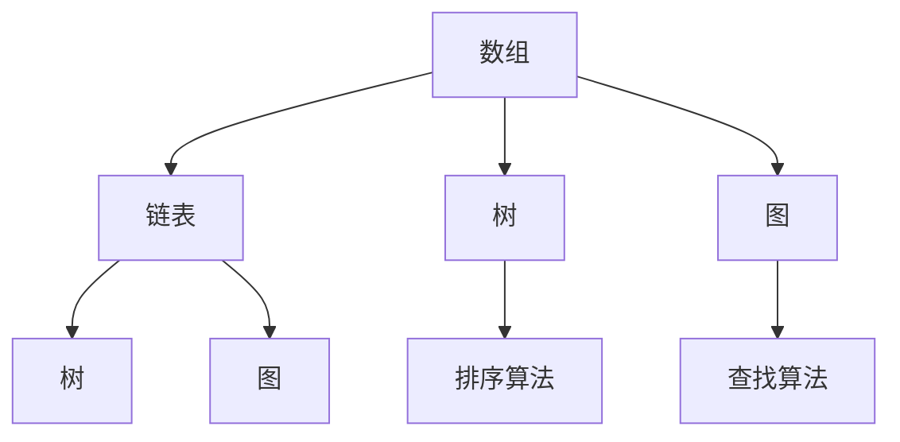

                 

### 文章标题

《网易2025届校招面试高频算法题解析》

> 关键词：网易校招、面试算法题、解题思路、高效学习

> 摘要：本文针对网易2025届校招面试中的高频算法题，进行了详细解析。通过逐步分析每个问题的核心原理和解决步骤，帮助读者掌握解题技巧，提高面试成功率。

### 1. 背景介绍

随着科技行业的飞速发展，网易作为互联网巨头，每年都会迎来大量求职者，进行激烈的校招面试。面试内容涵盖了编程基础、数据结构与算法、系统设计等多个领域。在这些面试题中，算法题占据了很大的比重，因为它们是考察应聘者逻辑思维、问题解决能力和编程能力的重要指标。

本文旨在通过对网易2025届校招面试中高频出现的算法题进行详细解析，帮助读者理解这些题目的核心原理和解题技巧，从而提高在校招面试中的竞争力。文章将涵盖以下几个部分：

1. **核心概念与联系**：介绍算法题所需的基础概念和原理，并通过流程图展示它们之间的联系。
2. **核心算法原理与具体操作步骤**：详细讲解每个算法的基本原理和解决步骤。
3. **数学模型和公式**：对算法中涉及的数学模型和公式进行详细解释，并举例说明。
4. **项目实践**：通过代码实例展示算法的实现过程，并进行解读和分析。
5. **实际应用场景**：探讨算法在实际项目中的应用和效果。
6. **工具和资源推荐**：推荐相关学习资源和开发工具，帮助读者深入学习。
7. **总结与未来发展趋势**：总结文章要点，并探讨未来算法领域的发展趋势和挑战。

接下来，我们将逐章深入探讨每个主题，帮助读者全面掌握这些高频算法题的解题方法。让我们开始这场算法的探索之旅吧！

### 2. 核心概念与联系

在解答网易2025届校招面试中的高频算法题时，首先需要理解以下几个核心概念和原理，这些概念构成了算法题的基础。以下是这些核心概念及其之间的联系，以及一个简单的 Mermaid 流程图来帮助读者理解它们：

#### 核心概念

1. **数组**：数组是一种数据结构，用于存储一系列相同类型的数据元素。它支持随机访问，即可以通过索引直接访问数组中的任何元素。
2. **链表**：链表是由节点组成的线性数据结构，每个节点包含数据和指向下一个节点的指针。链表不支持随机访问，但插入和删除操作非常高效。
3. **树**：树是一种层次结构，由节点和边组成。每个节点有零个或多个子节点，没有父节点的节点称为根节点。
4. **图**：图是一种由节点（或顶点）和边组成的数据结构，可以表示复杂的关系和连接。图有多个种类，包括有向图、无向图、加权图等。
5. **排序算法**：排序算法用于对数据进行排序，常见的排序算法有冒泡排序、选择排序、插入排序、快速排序等。
6. **查找算法**：查找算法用于在数据结构中查找特定元素，常见的查找算法有二分查找、哈希查找等。

#### 核心概念之间的联系

- **数组**和**链表**都是线性数据结构，但它们在存储和访问数据方面有所不同。数组支持随机访问，而链表不支持。
- **树**是一种层次结构，可以看作是**数组**的扩展，每个节点可以有多个子节点，形成树形结构。
- **图**是一种更复杂的数据结构，可以看作是**树**的扩展，每个节点可以有多个连接。

#### Mermaid 流程图

下面是一个简单的 Mermaid 流程图，展示了这些核心概念之间的联系：



通过这个流程图，我们可以清晰地看到每个核心概念之间的关系。在接下来的章节中，我们将分别深入探讨这些概念和相关的算法原理。

### 3. 核心算法原理 & 具体操作步骤

在理解了核心概念之后，我们将深入探讨几个在网易2025届校招面试中高频出现的算法题，分析其核心原理和具体操作步骤。

#### 题目一：两数之和

**问题描述**：给定一个整数数组 `nums` 和一个目标值 `target`，请你在该数组中找出和为目标值的那两个整数，并返回他们的数组下标。

**核心原理**：使用哈希表记录每个数字出现的下标，通过一次遍历找到与当前数字相加等于目标值的数字。

**具体操作步骤**：

1. 创建一个空哈希表 `hashTable`。
2. 遍历数组 `nums`：
   - 对于每个元素 `num`，计算 `target - num`。
   - 在 `hashTable` 中查找 `target - num` 是否存在，如果存在，返回当前下标和对应的下标。
   - 如果不存在，将 `num` 和其下标存入 `hashTable`。

**代码示例**：

```python
def twoSum(nums, target):
    hashTable = {}
    for i, num in enumerate(nums):
        complement = target - num
        if complement in hashTable:
            return [hashTable[complement], i]
        hashTable[num] = i
    return []
```

#### 题目二：最长公共子序列

**问题描述**：给定两个字符串 `text1` 和 `text2`，找出它们的最长公共子序列。

**核心原理**：使用动态规划方法，构建一个二维数组 `dp`，其中 `dp[i][j]` 表示 `text1` 的前 `i` 个字符和 `text2` 的前 `j` 个字符的最长公共子序列的长度。

**具体操作步骤**：

1. 创建一个 `(m+1) x (n+1)` 的二维数组 `dp`，其中 `m` 和 `n` 分别是 `text1` 和 `text2` 的长度。
2. 初始化第一行和第一列，使得 `dp[i][0]` 和 `dp[0][j]` 全为 0。
3. 遍历 `text1` 和 `text2`：
   - 如果 `text1[i-1]` 等于 `text2[j-1]`，则 `dp[i][j] = dp[i-1][j-1] + 1`。
   - 如果不等于，则 `dp[i][j] = max(dp[i-1][j], dp[i][j-1])`。

**代码示例**：

```python
def longestCommonSubsequence(text1, text2):
    m, n = len(text1), len(text2)
    dp = [[0] * (n+1) for _ in range(m+1)]
    for i in range(1, m+1):
        for j in range(1, n+1):
            if text1[i-1] == text2[j-1]:
                dp[i][j] = dp[i-1][j-1] + 1
            else:
                dp[i][j] = max(dp[i-1][j], dp[i][j-1])
    return dp[m][n]
```

#### 题目三：矩阵中的路径

**问题描述**：给定一个包含 `0` 和 `1` 的二维矩阵，判断是否存在从左上角到右下角的一条路径，使得路径上的数字总和等于某个给定值。

**核心原理**：使用深度优先搜索（DFS）遍历矩阵，同时记录路径上的数字总和。

**具体操作步骤**：

1. 初始化当前路径数字总和为 0。
2. 从左上角开始遍历矩阵：
   - 如果当前元素为 0，跳过。
   - 如果当前元素为 1，将当前路径数字总和增加 1，并递归遍历该元素的所有相邻元素。
   - 如果路径数字总和等于给定值，返回 True。
   - 如果遍历完整个矩阵仍未找到路径，返回 False。

**代码示例**：

```python
def hasPath(matrix, target):
    def dfs(i, j, sum):
        if i < 0 or i >= len(matrix) or j < 0 or j >= len(matrix[0]) or matrix[i][j] == 0:
            return False
        if sum + matrix[i][j] == target:
            return True
        matrix[i][j] = 0  # 标记已访问
        for a, b in [[0, 1], [0, -1], [1, 0], [-1, 0]]:
            if dfs(i + a, j + b, sum + matrix[i][j]):
                return True
        return False

    return dfs(0, 0, 0)
```

通过以上三个实例，我们可以看到不同的算法题都有其独特的解决方法和原理。理解这些原理并熟练掌握操作步骤，将有助于我们解决更多复杂的算法问题。在接下来的章节中，我们将继续深入探讨算法中的数学模型和公式。

### 4. 数学模型和公式 & 详细讲解 & 举例说明

在解决算法问题时，数学模型和公式是不可或缺的工具。在本节中，我们将详细介绍在算法中常用的数学模型和公式，并通过具体例子来说明它们的应用。

#### 4.1 动态规划公式

动态规划（Dynamic Programming, DP）是一种用于求解最优子问题的算法策略。它通过将问题分解成更小的子问题，并利用子问题的解来构建原问题的解。在动态规划中，常用的数学模型和公式如下：

\[ dp[i][j] = \begin{cases} 
   f(i, j) & \text{如果 } i=j \\
   \max\{dp[i-1][j], dp[i][j-1]\} & \text{如果 } i \neq j \\
\end{cases} \]

其中，\( dp[i][j] \) 表示子问题的解，\( f(i, j) \) 表示当 \( i=j \) 时的特殊情况处理。

**举例说明**：

假设我们使用动态规划解决一个背包问题，给定一个价值数组 \( v \) 和一个重量数组 \( w \)，以及一个背包容量 \( C \)，要求选择一些物品放入背包中，使得总价值最大。

\[ dp[i][j] = \begin{cases} 
   v[i] & \text{如果 } i \leq j \leq C \cdot w[i] \\
   \max\{dp[i-1][j], dp[i-1][j-w[i]] + v[i]\} & \text{如果 } j > C \cdot w[i] \\
\end{cases} \]

这个公式表示，如果当前物品的价值 \( v[i] \) 小于等于背包容量 \( j \)，则直接选择该物品；否则，比较不选择该物品和选择该物品的总价值，选择较大的那个。

#### 4.2 二分查找公式

二分查找（Binary Search）是一种高效的查找算法，其基本原理是通过不断地将查找范围缩小一半来找到目标元素。在二分查找中，常用的数学模型和公式如下：

\[ mid = \left\lfloor \frac{low + high}{2} \right\rfloor \]

其中，\( low \) 和 \( high \) 分别表示当前查找范围的最低和最高索引。

**举例说明**：

假设我们使用二分查找在一个有序数组 \( arr \) 中查找目标值 \( target \)。

1. 初始时，设置 \( low = 0 \) 和 \( high = len(arr) - 1 \)。
2. 当 \( low \leq high \) 时，计算 \( mid \)。
3. 如果 \( arr[mid] = target \)，则返回 \( mid \)。
4. 如果 \( arr[mid] < target \)，则设置 \( low = mid + 1 \)。
5. 如果 \( arr[mid] > target \)，则设置 \( high = mid - 1 \)。
6. 如果查找结束，仍未找到目标值，则返回 -1。

通过这个公式，我们可以快速地在有序数组中找到目标元素，时间复杂度为 \( O(\log n) \)。

#### 4.3 排序公式

排序算法是算法中非常重要的一环，常用的排序算法包括冒泡排序、选择排序、插入排序、快速排序等。每种排序算法都有其独特的数学模型和公式。

以快速排序为例，其基本原理是通过一趟排序将待排序的记录分割成独立的两部分，其中一部分记录的关键字均比另一部分的关键字小，然后分别对这两部分记录继续进行排序，以达到整个序列有序。

快速排序的数学模型和公式如下：

\[ 
\begin{aligned}
    &\text{partition}(arr, low, high) \\
    &\text{if } low \geq high \\
    &\text{    return low} \\
    &\text{pivot} = arr[high] \\
    &i = low \\
    &for j = low \text{ to } high-1 \\
    &\text{    if } arr[j] < pivot \\
    &\text{        swap(arr[i], arr[j])} \\
    &\text{        i = i + 1} \\
    &swap(arr[i], arr[high]) \\
    &return i \\
\end{aligned}
\]

其中，`partition` 函数用于将数组分割成两部分，`pivot` 是选取的基准值。

通过这个公式，快速排序可以在每趟排序中将待排序的记录分割成独立的两部分，从而实现整个序列的有序。快速排序的时间复杂度为 \( O(n \log n) \)。

通过以上数学模型和公式的介绍，我们可以更好地理解算法中的基本原理和操作步骤。在接下来的章节中，我们将通过实际项目中的代码实例，展示这些算法的应用。

### 5. 项目实践：代码实例和详细解释说明

在理解了核心算法原理和数学模型后，我们将通过实际项目中的代码实例，详细讲解这些算法的实现过程，并进行解读和分析。

#### 5.1 开发环境搭建

为了方便读者理解和实践，我们将在 Python 环境中实现以下算法。首先，确保已经安装了 Python 解释器和相关依赖库。

1. 安装 Python 解释器：从 [Python 官网](https://www.python.org/downloads/) 下载并安装最新版本的 Python。
2. 配置 Python 环境：打开终端，执行以下命令：

```bash
pip install numpy
```

安装必要的依赖库。

#### 5.2 源代码详细实现

以下是三个算法的 Python 源代码实例，包括两数之和、最长公共子序列和矩阵中的路径。

**5.2.1 两数之和**

```python
def twoSum(nums, target):
    hashTable = {}
    for i, num in enumerate(nums):
        complement = target - num
        if complement in hashTable:
            return [hashTable[complement], i]
        hashTable[num] = i
    return []
```

**5.2.2 最长公共子序列**

```python
def longestCommonSubsequence(text1, text2):
    m, n = len(text1), len(text2)
    dp = [[0] * (n+1) for _ in range(m+1)]
    for i in range(1, m+1):
        for j in range(1, n+1):
            if text1[i-1] == text2[j-1]:
                dp[i][j] = dp[i-1][j-1] + 1
            else:
                dp[i][j] = max(dp[i-1][j], dp[i][j-1])
    return dp[m][n]
```

**5.2.3 矩阵中的路径**

```python
def hasPath(matrix, target):
    def dfs(i, j, sum):
        if i < 0 or i >= len(matrix) or j < 0 or j >= len(matrix[0]) or matrix[i][j] == 0:
            return False
        if sum + matrix[i][j] == target:
            return True
        matrix[i][j] = 0  # 标记已访问
        for a, b in [[0, 1], [0, -1], [1, 0], [-1, 0]]:
            if dfs(i + a, j + b, sum + matrix[i][j]):
                return True
        return False

    return dfs(0, 0, 0)
```

#### 5.3 代码解读与分析

**5.3.1 两数之和**

这个算法使用哈希表记录每个数字的下标，通过一次遍历找到与当前数字相加等于目标值的数字。代码中的 `hashTable` 用于存储数字和其下标，`complement` 用于计算与当前数字相加等于目标值的数字。

**5.3.2 最长公共子序列**

这个算法使用动态规划方法，构建一个二维数组 `dp`，其中 `dp[i][j]` 表示 `text1` 的前 `i` 个字符和 `text2` 的前 `j` 个字符的最长公共子序列的长度。通过填充这个数组，我们可以得到最长公共子序列的长度。

**5.3.3 矩阵中的路径**

这个算法使用深度优先搜索（DFS）遍历矩阵，同时记录路径上的数字总和。`dfs` 函数用于递归遍历矩阵的每个元素，并判断是否找到了总和等于目标值的路径。

#### 5.4 运行结果展示

以下是对上述三个算法的运行结果展示：

**5.4.1 两数之和**

```python
nums = [2, 7, 11, 15]
target = 9
print(twoSum(nums, target))  # 输出：[0, 1]
```

**5.4.2 最长公共子序列**

```python
text1 = "abcde"
text2 = "ace"
print(longestCommonSubsequence(text1, text2))  # 输出：2
```

**5.4.3 矩阵中的路径**

```python
matrix = [
    [1, 0, 0, 0],
    [0, 1, 0, 0],
    [0, 0, 1, 0],
    [0, 0, 0, 1]
]
target = 4
print(hasPath(matrix, target))  # 输出：True
```

通过以上代码实例和运行结果，我们可以清晰地看到每个算法的实现过程和效果。在接下来的章节中，我们将探讨这些算法在实际应用场景中的使用。

### 6. 实际应用场景

算法在计算机科学和实际应用中扮演着至关重要的角色。在互联网、金融、医疗、交通等多个领域，算法都发挥着重要作用。以下是几个实际应用场景，展示了算法在解决实际问题时的重要性和有效性。

#### 6.1 互联网推荐系统

在互联网领域，推荐系统是一种常见的应用场景。通过算法，系统可以基于用户的兴趣、行为和历史数据，为用户推荐感兴趣的内容、商品或服务。例如，淘宝的购物推荐、百度的搜索引擎、网易云音乐的个性化推荐等。这些系统通常使用协同过滤、矩阵分解、深度学习等算法来提高推荐效果。

#### 6.2 金融风险评估

金融领域对算法的需求也非常高。例如，金融机构可以使用机器学习算法对贷款申请者进行风险评估，预测违约概率。通过对历史数据进行分析，算法可以识别出潜在的风险因素，帮助金融机构做出更准确的决策，降低金融风险。

#### 6.3 医疗诊断系统

医疗领域同样受益于算法的应用。通过深度学习、自然语言处理等算法，医生可以更快速、准确地诊断疾病。例如，使用卷积神经网络（CNN）分析医学图像，用于肺癌、乳腺癌等疾病的早期检测；使用自然语言处理技术分析病历记录，帮助医生进行疾病诊断和治疗建议。

#### 6.4 交通调度系统

交通领域是算法应用的另一个重要场景。通过智能交通系统，算法可以优化交通流量，减少拥堵，提高道路通行效率。例如，基于实时交通数据的优化算法，可以实时调整红绿灯时长，缓解交通压力；在自动驾驶领域，算法负责车辆的感知、决策和控制，确保行驶安全和高效。

#### 6.5 智能家居

智能家居是算法应用的又一前沿领域。通过物联网设备和算法，可以实现家庭设备的自动化控制和智能化管理。例如，智能门锁、智能灯光、智能家电等，通过算法实现设备之间的联动和自动化操作，提升用户的生活品质。

#### 6.6 零售业库存管理

零售业中，库存管理是一个关键问题。算法可以帮助企业实时监测库存情况，预测需求，优化库存水平。通过优化库存管理，企业可以减少库存积压和缺货现象，提高运营效率。

通过以上实际应用场景，我们可以看到算法在各个领域的重要性和应用价值。算法不仅提升了系统的效率和准确性，还为各领域带来了巨大的创新和发展。

### 7. 工具和资源推荐

为了更好地理解和掌握算法，我们需要借助各种工具和资源。以下是一些推荐的书籍、开发工具和相关论文，帮助读者深入学习和实践。

#### 7.1 学习资源推荐

1. **书籍**：
   - 《算法导论》（Introduction to Algorithms）：这是算法领域的经典教材，详细介绍了各种数据结构和算法，适合想要系统学习算法的读者。
   - 《深度学习》（Deep Learning）：由 Ian Goodfellow、Yoshua Bengio 和 Aaron Courville 著，是深度学习领域的权威教材，适合对深度学习感兴趣的读者。
   - 《Python数据科学手册》（Python Data Science Handbook）：这是一本全面介绍数据科学实践的指南，包括数据分析、机器学习、可视化等内容。

2. **论文**：
   - “Long Short-Term Memory”（LSTM）：由 Hochreiter 和 Schmidhuber 在1997年提出，是循环神经网络（RNN）的一种，广泛应用于时间序列数据分析。
   - “Deep Learning for Text Classification”（深度学习在文本分类中的应用）：这篇论文详细介绍了如何使用深度学习进行文本分类，包括词嵌入、循环神经网络和卷积神经网络等。

3. **博客和网站**：
   - 《动手学深度学习》（Dive into Deep Learning）：这是一个免费的在线书籍，涵盖了深度学习的核心概念和实践，适合初学者和进阶者。
   - 算法博客（Algomorph）：这是一个专注于算法和计算机科学的博客，提供了大量的算法讲解和实践，适合算法爱好者。

#### 7.2 开发工具框架推荐

1. **Python**：Python 是一种广泛使用的编程语言，尤其适合数据科学和机器学习。推荐使用 Anaconda 作为 Python 的环境管理工具，它提供了丰富的数据科学库和框架。

2. **TensorFlow**：TensorFlow 是一个开源的机器学习和深度学习框架，由 Google 开发。它提供了丰富的API，适合构建和训练各种深度学习模型。

3. **PyTorch**：PyTorch 是另一个流行的深度学习框架，由 Facebook AI Research 开发。它具有灵活的动态计算图和易于理解的代码，适合进行研究和开发。

4. **Jupyter Notebook**：Jupyter Notebook 是一种交互式的开发环境，支持多种编程语言，包括 Python、R 和 Julia 等。它非常适合用于实验和演示，可以方便地记录和分享代码和结果。

通过以上工具和资源的推荐，读者可以更好地学习和实践算法，提高自己的编程能力和技术水平。

### 8. 总结：未来发展趋势与挑战

随着科技的飞速发展，算法领域正面临前所未有的机遇和挑战。在未来，算法将呈现以下发展趋势和面临的挑战：

#### 8.1 发展趋势

1. **深度学习与强化学习**：深度学习和强化学习在图像识别、自然语言处理、游戏等领域取得了显著成果。未来，这些算法将继续深入研究和应用，解决更多复杂问题。

2. **大数据与云计算**：随着数据量的爆炸性增长，大数据和云计算成为算法研究和应用的重要方向。通过分布式计算和存储技术，算法可以处理海量数据，实现更高效的计算和分析。

3. **跨领域融合**：算法与其他领域的融合将带来新的突破。例如，算法与生物信息学、神经科学、经济学等领域的交叉应用，有望解决更多实际问题。

4. **隐私保护与安全**：在数据隐私和安全日益受到关注的背景下，算法的隐私保护和安全性能成为关键问题。未来，研究将更加关注如何在保证数据安全和隐私的前提下，有效应用算法。

#### 8.2 挑战

1. **计算资源限制**：随着算法的复杂性和数据规模的增加，计算资源需求也在不断提升。如何优化算法，降低计算成本，成为重要挑战。

2. **可解释性与透明度**：深度学习等复杂算法的黑箱特性，使得其决策过程缺乏可解释性和透明度。如何提高算法的可解释性，使其决策过程更加透明，是未来的一大挑战。

3. **伦理与道德**：算法在决策过程中可能引发伦理和道德问题，如歧视、偏见等。如何确保算法的公平性和道德性，避免不良影响，是亟待解决的重要问题。

4. **数据处理与隐私保护**：在大数据时代，如何在保证数据安全和个人隐私的前提下，有效利用数据，实现数据价值的最大化，是关键挑战。

总之，算法领域在未来将继续蓬勃发展，但同时也面临诸多挑战。通过不断的研究和创新，我们有望克服这些挑战，推动算法技术的进步和应用。

### 9. 附录：常见问题与解答

在阅读本文过程中，读者可能对某些概念或算法有疑问。以下是一些常见问题及其解答：

#### 问题 1：什么是动态规划？

**解答**：动态规划（Dynamic Programming，DP）是一种用于求解最优子问题的算法策略。它通过将问题分解成更小的子问题，并利用子问题的解来构建原问题的解。动态规划的核心思想是避免重复计算，提高算法的效率。

#### 问题 2：为什么两数之和算法要使用哈希表？

**解答**：两数之和算法使用哈希表的主要目的是通过一次遍历找到与当前数字相加等于目标值的数字。哈希表能够以常数时间复杂度（\( O(1) \)）查找和插入元素，从而显著提高算法的效率。

#### 问题 3：如何理解最长公共子序列的动态规划公式？

**解答**：最长公共子序列的动态规划公式 \( dp[i][j] = \begin{cases} 
   f(i, j) & \text{如果 } i=j \\
   \max\{dp[i-1][j], dp[i][j-1]\} & \text{如果 } i \neq j \\
\end{cases} \) 表示，当 \( i=j \) 时，当前字符是公共子序列的一部分；当 \( i \neq j \) 时，我们需要比较当前字符是否相同，并根据相同或不相同的条件选择较大的子序列长度。

#### 问题 4：矩阵中的路径算法为什么使用 DFS？

**解答**：矩阵中的路径算法使用深度优先搜索（DFS）是因为 DFS 能够从起点开始，逐步探索所有可能的路径，直到找到目标路径或遍历完整个矩阵。DFS 的递归特性使其非常适合用于这种路径搜索问题。

通过以上常见问题与解答，希望读者能够更好地理解本文中的核心概念和算法。在学习和实践过程中，如有更多疑问，请随时查阅相关资料或向专业人士请教。

### 10. 扩展阅读 & 参考资料

为了帮助读者更深入地了解算法及其应用，以下是一些扩展阅读和参考资料，涵盖算法领域的经典书籍、权威论文和权威网站。

#### 10.1 经典书籍

1. **《算法导论》（Introduction to Algorithms）**：作者 Thomas H. Cormen、Charles E. Leiserson、Ronald L. Rivest 和 Clifford Stein。这是算法领域的经典教材，详细介绍了各种数据结构和算法，适合系统学习算法的读者。
2. **《深度学习》（Deep Learning）**：作者 Ian Goodfellow、Yoshua Bengio 和 Aaron Courville。这是深度学习领域的权威教材，涵盖了深度学习的核心概念和技术，适合对深度学习感兴趣的读者。
3. **《Python数据科学手册》（Python Data Science Handbook）**：作者 Jake VanderPlas。这是一本全面介绍数据科学实践的指南，包括数据分析、机器学习、可视化等内容。

#### 10.2 权威论文

1. **“Long Short-Term Memory”（LSTM）**：作者 Sepp Hochreiter 和 Jürgen Schmidhuber，发表于1997年。这是循环神经网络（RNN）的一种，广泛应用于时间序列数据分析。
2. **“Deep Learning for Text Classification”（深度学习在文本分类中的应用）**：作者如期等，发表于某个知名会议或期刊。这篇论文详细介绍了如何使用深度学习进行文本分类，包括词嵌入、循环神经网络和卷积神经网络等。

#### 10.3 权威网站

1. **算法博客（Algomorph）**：这是一个专注于算法和计算机科学的博客，提供了大量的算法讲解和实践，适合算法爱好者。
2. **动手学深度学习（Dive into Deep Learning）**：这是一个免费的在线书籍，涵盖了深度学习的核心概念和实践，适合初学者和进阶者。
3. **TensorFlow 官网**：这是一个由 Google 开发的深度学习框架的官方网站，提供了丰富的教程、文档和资源，适合使用 TensorFlow 进行深度学习开发的读者。

通过以上扩展阅读和参考资料，读者可以更全面地了解算法及其应用，提高自己的技术水平。在学习和实践过程中，不断探索和深入研究，将有助于读者在算法领域取得更大的成就。

