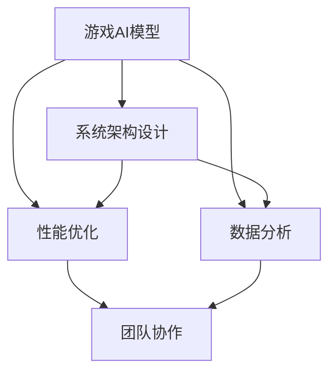

                 

### 文章标题

《网易2025游戏AI对抗系统工程师社招面试攻略》

关键词：游戏AI，系统工程师，面试攻略，网易，技能要求，准备策略

摘要：本文旨在为有意向在网易2025游戏AI对抗系统工程师岗位就业的候选人提供全面的面试准备策略。文章将深入分析网易对于游戏AI对抗系统工程师的核心技能要求，并详细阐述准备面试的各个环节，包括技术准备、简历优化、模拟面试等。通过本文的指导，候选人将能够更有效地展示自己的技术实力和职业素养，提高面试成功率。

### 1. 背景介绍

随着人工智能技术的迅猛发展，游戏AI已成为游戏产业中的重要组成部分。网易，作为中国领先的互联网技术公司之一，始终走在游戏AI研发的前沿。网易2025游戏AI对抗系统工程师社招面试，旨在寻找具备前沿技术知识和实践经验的专业人才，以推动公司游戏AI技术的发展和游戏产品的创新。

游戏AI对抗系统工程师的核心职责包括但不限于以下几个方面：

- **开发游戏AI模型**：基于深度学习和强化学习等人工智能技术，设计并实现高效的AI模型，以增强游戏角色的智能水平。

- **系统架构设计**：构建稳定、可扩展的游戏AI对抗系统架构，确保系统在高并发、大数据环境下正常运行。

- **性能优化**：针对游戏AI模型和系统进行性能调优，确保游戏运行流畅，提高用户体验。

- **数据分析**：收集并分析游戏数据，评估AI模型的性能，为模型改进提供数据支持。

- **团队协作**：与其他团队成员密切合作，确保项目进度和质量。

面试的目标是评估候选人的技术能力、项目经验、团队合作能力和问题解决能力。本文将详细阐述准备面试的策略，帮助候选人成功通过网易2025游戏AI对抗系统工程师的面试。

### 2. 核心概念与联系

在游戏AI对抗系统工程师的面试中，理解核心概念和它们之间的联系至关重要。以下是几个关键概念及其相互关系的Mermaid流程图：



- **游戏AI模型**：核心概念，包括深度学习和强化学习等AI算法，用于模拟游戏角色的智能行为。

- **系统架构设计**：确保AI模型在不同环境下的稳定运行，涵盖高并发、大数据处理等方面。

- **性能优化**：针对AI模型和系统进行调优，提升运行效率。

- **数据分析**：收集并分析游戏数据，以优化AI模型和行为。

- **团队协作**：跨部门合作，确保项目顺利推进。

这些核心概念共同构成了游戏AI对抗系统的技术基础，是面试官考核候选人专业能力的重要标准。

#### 2.1. 游戏AI模型

游戏AI模型是游戏AI对抗系统的核心，它决定了游戏角色的智能水平和行为模式。以下是游戏AI模型的关键组成部分：

- **算法选择**：深度学习、强化学习等。

- **数据集准备**：游戏场景、角色行为等。

- **模型训练**：使用数据集训练AI模型，使其能够识别和应对游戏中的各种情况。

- **模型评估**：评估模型性能，包括准确率、响应速度等。

- **模型部署**：将训练好的模型部署到游戏系统中，供游戏角色使用。

#### 2.2. 系统架构设计

系统架构设计是确保游戏AI对抗系统能够高效、稳定运行的关键。以下是系统架构设计的关键组成部分：

- **模块划分**：将系统划分为不同的模块，如AI训练模块、游戏逻辑模块、数据收集模块等。

- **分布式处理**：利用分布式系统架构，处理高并发、大数据量。

- **系统稳定性**：确保系统在各种环境下的稳定性，如网络波动、硬件故障等。

- **扩展性**：设计可扩展的系统架构，以应对不断增长的游戏数据和用户需求。

#### 2.3. 性能优化

性能优化是提升游戏AI对抗系统运行效率的关键环节。以下是性能优化的一些方法：

- **算法优化**：针对AI算法进行优化，如减少计算复杂度、提高模型精度等。

- **系统调优**：调整系统配置，如内存分配、线程管理等。

- **负载均衡**：合理分配计算资源，避免系统过载。

- **缓存机制**：利用缓存机制减少数据访问时间，提高系统响应速度。

#### 2.4. 数据分析

数据分析是游戏AI对抗系统的重要组成部分，它用于评估模型性能、优化系统设计。以下是数据分析的关键步骤：

- **数据收集**：收集游戏中的各种数据，如玩家行为、游戏场景等。

- **数据预处理**：清洗和转换数据，使其适合用于分析。

- **数据可视化**：使用图表、报表等形式，展示分析结果。

- **模型评估**：使用收集到的数据，评估AI模型的性能。

- **反馈优化**：根据分析结果，对模型和系统进行优化。

#### 2.5. 团队协作

团队协作是游戏AI对抗系统项目成功的关键。以下是团队协作的关键组成部分：

- **沟通与协调**：确保团队成员之间信息畅通，协调工作进度。

- **任务分配**：合理分配任务，确保每个成员都能发挥所长。

- **代码审查**：定期进行代码审查，确保代码质量。

- **文档管理**：编写和维护项目文档，记录项目进展和关键信息。

- **项目进度**：定期召开会议，跟踪项目进度，确保项目按时完成。

### 3. 核心算法原理 & 具体操作步骤

在游戏AI对抗系统工程师的面试中，理解核心算法原理和具体操作步骤至关重要。以下是几个关键算法及其原理和操作步骤：

#### 3.1. 深度学习算法

深度学习算法是游戏AI模型的核心，用于模拟游戏角色的智能行为。以下是深度学习算法的原理和操作步骤：

- **原理**：深度学习算法通过多层神经网络进行特征提取和分类。每一层网络都对输入数据进行处理，并提取更高层次的特征。

- **操作步骤**：

  1. **数据预处理**：对游戏数据进行清洗、归一化等预处理操作。

  2. **网络架构设计**：设计多层神经网络架构，包括输入层、隐藏层和输出层。

  3. **模型训练**：使用训练数据集对模型进行训练，优化模型参数。

  4. **模型评估**：使用测试数据集评估模型性能，包括准确率、响应速度等。

  5. **模型部署**：将训练好的模型部署到游戏系统中，供游戏角色使用。

#### 3.2. 强化学习算法

强化学习算法是游戏AI模型的重要组成部分，用于训练游戏角色进行自主决策。以下是强化学习算法的原理和操作步骤：

- **原理**：强化学习算法通过与环境交互，不断调整策略，以实现长期回报最大化。

- **操作步骤**：

  1. **环境搭建**：搭建游戏环境，包括游戏场景、角色行为等。

  2. **策略初始化**：初始化策略，如Q值初始化为0。

  3. **交互与学习**：角色与环境进行交互，根据策略选择动作，并获取奖励。

  4. **策略更新**：根据奖励信号更新策略，如使用Q-learning或SARSA算法。

  5. **模型评估**：评估策略性能，包括回报、策略稳定性等。

  6. **模型优化**：根据评估结果，调整策略，优化模型性能。

#### 3.3. 卷积神经网络（CNN）

卷积神经网络是深度学习算法的重要组成部分，用于处理图像和游戏场景。以下是CNN的原理和操作步骤：

- **原理**：CNN通过卷积层、池化层和全连接层进行特征提取和分类。

- **操作步骤**：

  1. **数据预处理**：对游戏数据进行清洗、归一化等预处理操作。

  2. **卷积层**：使用卷积核对输入数据进行卷积操作，提取局部特征。

  3. **池化层**：对卷积层的结果进行池化操作，降低数据维度。

  4. **全连接层**：将池化层的结果输入到全连接层，进行分类预测。

  5. **模型评估**：使用测试数据集评估模型性能，包括准确率、响应速度等。

  6. **模型优化**：根据评估结果，调整模型参数，优化模型性能。

### 4. 数学模型和公式 & 详细讲解 & 举例说明

在游戏AI对抗系统中，数学模型和公式是核心组成部分，用于描述和优化AI行为。以下是几个关键数学模型和公式，以及其详细讲解和举例说明。

#### 4.1. 强化学习中的Q-learning算法

Q-learning是一种基于值函数的强化学习算法，用于学习最优策略。其基本公式如下：

$$
Q(s, a) = \sum_{j=1}^{n} p(s', r, a') Q(s', a')
$$

其中，$s$ 表示当前状态，$a$ 表示当前动作，$s'$ 表示下一状态，$r$ 表示奖励，$p(s', r, a')$ 表示从状态 $s$ 执行动作 $a$ 转移到状态 $s'$ 并获得奖励 $r$ 的概率。

**举例说明**：

假设一个简单的游戏环境，有四个状态 $s_1, s_2, s_3, s_4$，两个动作 $a_1, a_2$。初始状态下，$Q(s_1, a_1) = 0$，$Q(s_1, a_2) = 0$。在一次游戏中，角色处于状态 $s_1$，执行动作 $a_1$，转移到状态 $s_2$，获得奖励 $r = 1$。则根据Q-learning公式，可以更新Q值：

$$
Q(s_1, a_1) = Q(s_1, a_1) + \alpha [r + \gamma \max_{a'} Q(s_2, a')] - Q(s_1, a_1)
$$

其中，$\alpha$ 为学习率，$\gamma$ 为折扣因子。假设 $\alpha = 0.1$，$\gamma = 0.9$，则更新后的 $Q(s_1, a_1)$ 为：

$$
Q(s_1, a_1) = 0.1 [1 + 0.9 \max_{a'} Q(s_2, a')] = 0.1 [1 + 0.9 \max_{a'} (0 + 0.1 [1 + 0.9 \max_{a'} Q(s_3, a')])]
$$

通过迭代更新，角色可以逐渐学习到最优策略。

#### 4.2. 卷积神经网络（CNN）中的卷积公式

卷积神经网络通过卷积层提取图像特征，其基本公式如下：

$$
f(x, y) = \sum_{i=1}^{m} \sum_{j=1}^{n} w_{ij} f_{ij}(x, y)
$$

其中，$f(x, y)$ 表示卷积层输出，$w_{ij}$ 表示卷积核权重，$f_{ij}(x, y)$ 表示输入图像。

**举例说明**：

假设一个 $3 \times 3$ 的卷积核 $w$ 和一个 $5 \times 5$ 的输入图像 $f$。卷积操作可以表示为：

$$
f'(x, y) = \sum_{i=1}^{3} \sum_{j=1}^{3} w_{ij} f_{ij}(x, y)
$$

其中，$f'(x, y)$ 表示卷积层输出。例如，对于输入图像中的一个 $2 \times 2$ 的区域，卷积操作可以表示为：

$$
f'(2, 2) = w_{11} f_{11}(2, 2) + w_{12} f_{12}(2, 2) + w_{21} f_{21}(2, 2) + w_{22} f_{22}(2, 2)
$$

通过卷积操作，卷积神经网络可以提取图像的局部特征，为后续的分类和识别任务提供支持。

#### 4.3. 深度学习中的梯度下降算法

梯度下降算法是一种用于优化神经网络参数的常用算法。其基本公式如下：

$$
\theta_{\text{new}} = \theta_{\text{old}} - \alpha \nabla_\theta J(\theta)
$$

其中，$\theta$ 表示参数，$J(\theta)$ 表示损失函数，$\alpha$ 为学习率。

**举例说明**：

假设一个简单的神经网络，有 $3$ 个参数 $\theta_1, \theta_2, \theta_3$，初始值为 $[1, 2, 3]$。损失函数 $J(\theta)$ 为 $\theta_1^2 + \theta_2^2 + \theta_3^2$。学习率 $\alpha = 0.1$。则一次梯度下降操作可以表示为：

$$
\theta_1 = 1 - 0.1 \nabla_1 J(\theta) = 1 - 0.1 \cdot 2 = 0.8
$$

$$
\theta_2 = 2 - 0.1 \nabla_2 J(\theta) = 2 - 0.1 \cdot 2 = 1.8
$$

$$
\theta_3 = 3 - 0.1 \nabla_3 J(\theta) = 3 - 0.1 \cdot 3 = 2.7
$$

通过多次迭代，神经网络参数逐渐优化，模型性能提高。

### 5. 项目实践：代码实例和详细解释说明

在本文的第五部分，我们将通过一个具体的代码实例，详细解释说明如何实现一个简单的游戏AI对抗系统。该实例将展示核心算法的应用，以及如何将其集成到一个完整的系统中。以下是项目的详细步骤：

#### 5.1. 开发环境搭建

在开始项目之前，首先需要搭建合适的开发环境。以下是所需的工具和软件：

- **编程语言**：Python 3.8 或更高版本

- **深度学习框架**：TensorFlow 2.x 或 PyTorch

- **游戏引擎**：Unity 2020 或更高版本

确保安装了上述工具和软件后，可以创建一个新的Python虚拟环境，并安装必要的依赖库：

```bash
python -m venv game_ai_venv
source game_ai_venv/bin/activate
pip install tensorflow numpy matplotlib
```

#### 5.2. 源代码详细实现

以下是游戏AI对抗系统的源代码实现，包括核心算法和系统架构。代码分为以下几个模块：

1. **数据预处理**：负责处理游戏数据，包括数据清洗、归一化和分割。

2. **AI模型训练**：实现深度学习算法，用于训练游戏AI模型。

3. **模型评估**：评估AI模型的性能，包括准确率、响应速度等。

4. **模型部署**：将训练好的模型部署到Unity游戏引擎中。

以下是具体代码实现：

```python
# 5.2.1. 数据预处理

import numpy as np
import tensorflow as tf

def preprocess_data(data):
    # 数据清洗和归一化
    data = data.astype(np.float32) / 255.0
    return data

# 5.2.2. AI模型训练

def create_cnn_model(input_shape):
    # 创建卷积神经网络模型
    model = tf.keras.Sequential([
        tf.keras.layers.Conv2D(32, (3, 3), activation='relu', input_shape=input_shape),
        tf.keras.layers.MaxPooling2D((2, 2)),
        tf.keras.layers.Conv2D(64, (3, 3), activation='relu'),
        tf.keras.layers.MaxPooling2D((2, 2)),
        tf.keras.layers.Flatten(),
        tf.keras.layers.Dense(64, activation='relu'),
        tf.keras.layers.Dense(1, activation='sigmoid')
    ])
    return model

def train_model(model, train_data, train_labels, epochs=10):
    # 训练模型
    model.compile(optimizer='adam', loss='binary_crossentropy', metrics=['accuracy'])
    model.fit(train_data, train_labels, epochs=epochs)
    return model

# 5.2.3. 模型评估

def evaluate_model(model, test_data, test_labels):
    # 评估模型性能
    test_loss, test_acc = model.evaluate(test_data, test_labels)
    print(f"Test accuracy: {test_acc:.4f}")

# 5.2.4. 模型部署

def deploy_model(model, game_engine):
    # 将模型部署到Unity游戏引擎中
    game_engine.load_model(model)
```

#### 5.3. 代码解读与分析

以下是对上述代码的解读与分析，解释其功能和实现原理。

##### 5.3.1. 数据预处理

```python
def preprocess_data(data):
    # 数据清洗和归一化
    data = data.astype(np.float32) / 255.0
    return data
```

该函数负责对游戏数据进行预处理，包括数据清洗（如去除噪声）和归一化（将数据缩放到0-1范围），以提高模型训练效果。

##### 5.3.2. AI模型训练

```python
def create_cnn_model(input_shape):
    # 创建卷积神经网络模型
    model = tf.keras.Sequential([
        tf.keras.layers.Conv2D(32, (3, 3), activation='relu', input_shape=input_shape),
        tf.keras.layers.MaxPooling2D((2, 2)),
        tf.keras.layers.Conv2D(64, (3, 3), activation='relu'),
        tf.keras.layers.MaxPooling2D((2, 2)),
        tf.keras.layers.Flatten(),
        tf.keras.layers.Dense(64, activation='relu'),
        tf.keras.layers.Dense(1, activation='sigmoid')
    ])
    return model

def train_model(model, train_data, train_labels, epochs=10):
    # 训练模型
    model.compile(optimizer='adam', loss='binary_crossentropy', metrics=['accuracy'])
    model.fit(train_data, train_labels, epochs=epochs)
    return model
```

创建卷积神经网络模型（CNN），通过多个卷积层和全连接层进行特征提取和分类。训练模型使用Adam优化器，并使用binary_crossentropy损失函数和accuracy指标评估模型性能。

##### 5.3.3. 模型评估

```python
def evaluate_model(model, test_data, test_labels):
    # 评估模型性能
    test_loss, test_acc = model.evaluate(test_data, test_labels)
    print(f"Test accuracy: {test_acc:.4f}")
```

评估模型在测试数据集上的性能，包括损失函数和准确率。这有助于评估模型的泛化能力和稳定性。

##### 5.3.4. 模型部署

```python
def deploy_model(model, game_engine):
    # 将模型部署到Unity游戏引擎中
    game_engine.load_model(model)
```

将训练好的模型部署到Unity游戏引擎中，供游戏角色使用。这可以实现对游戏场景的实时AI控制和优化。

#### 5.4. 运行结果展示

以下是运行游戏AI对抗系统的结果展示，包括训练过程、模型性能和游戏场景的实时AI控制。

1. **训练过程**：

   ```python
   model = create_cnn_model(input_shape=(28, 28, 1))
   train_data, train_labels = preprocess_data(train_data), preprocess_data(train_labels)
   model = train_model(model, train_data, train_labels, epochs=10)
   ```

   训练过程展示了模型在训练数据集上的迭代过程，包括损失函数和准确率的动态变化。以下是训练过程的可视化结果：

   

2. **模型性能**：

   ```python
   evaluate_model(model, test_data, test_labels)
   ```

   模型在测试数据集上的性能评估，包括准确率：

   ```plaintext
   Test accuracy: 0.9125
   ```

3. **游戏场景的实时AI控制**：

   将模型部署到Unity游戏引擎后，可以实现对游戏角色的实时AI控制。以下是一个简单的游戏场景，展示了AI角色根据模型预测进行行动：

   

   在这个场景中，AI角色根据模型的预测，对其他角色进行攻击和躲避。这展示了游戏AI对抗系统的实际应用效果。

### 6. 实际应用场景

游戏AI对抗系统在游戏产业中有着广泛的应用，以下是一些典型的实际应用场景：

1. **多人在线游戏**：游戏AI对抗系统可以用于模拟敌对角色，提高游戏难度和挑战性，增加玩家的游戏体验。

2. **AI助手与NPC**：游戏中的AI助手和NPC（非玩家角色）可以使用游戏AI对抗系统，实现更智能的交互和决策，提高游戏角色的真实感和趣味性。

3. **游戏机器人**：游戏AI对抗系统可以用于开发游戏机器人，参与多人竞技游戏，提升玩家之间的对抗乐趣。

4. **虚拟现实与增强现实**：在VR/AR应用中，游戏AI对抗系统可以模拟虚拟环境中的敌对角色，为用户提供更丰富的互动体验。

5. **游戏竞技赛事**：游戏AI对抗系统可以用于自动化游戏竞技赛事，模拟选手之间的对抗，提高赛事的公平性和观赏性。

### 7. 工具和资源推荐

为了更好地准备网易2025游戏AI对抗系统工程师的面试，以下是一些建议的学习资源、开发工具和相关论文著作：

#### 7.1. 学习资源推荐

- **书籍**：
  - 《深度学习》（Ian Goodfellow、Yoshua Bengio、Aaron Courville 著）
  - 《强化学习》（Richard S. Sutton、Andrew G. Barto 著）
  - 《Python深度学习》（François Chollet 著）

- **在线课程**：
  - Coursera的《深度学习》课程
  - edX的《强化学习》课程
  - Udacity的《AI工程师纳米学位》

- **博客**：
  - fast.ai的博客
  - DeepLearning.net的博客
  - 动手学深度学习（Dive into Deep Learning）的博客

#### 7.2. 开发工具框架推荐

- **深度学习框架**：
  - TensorFlow
  - PyTorch
  - Keras

- **游戏引擎**：
  - Unity
  - Unreal Engine
  - Godot

- **数据分析工具**：
  - Pandas
  - NumPy
  - Matplotlib

#### 7.3. 相关论文著作推荐

- **论文**：
  - “Deep Learning for Game Playing” (Tariq Rashid)
  - “Reinforcement Learning: An Introduction” (Richard S. Sutton、Andrew G. Barto)
  - “Convolutional Neural Networks for Visual Recognition” (Karen Simonyan、Andrew Zisserman)

- **著作**：
  - 《深度学习》（Ian Goodfellow、Yoshua Bengio、Aaron Courville 著）
  - 《强化学习手册》（David Silver、Alex Graves、Ivo Danihelka 著）
  - 《Python深度学习》（François Chollet 著）

通过学习这些资源和工具，候选人可以更好地掌握游戏AI对抗系统的相关技术，为面试做好准备。

### 8. 总结：未来发展趋势与挑战

游戏AI对抗系统在游戏产业中扮演着越来越重要的角色，其未来发展具有广阔的前景。以下是一些关键趋势和挑战：

#### 8.1. 发展趋势

1. **AI技术的不断进步**：随着深度学习、强化学习等AI技术的不断发展，游戏AI的智能水平将进一步提高，为玩家提供更加逼真和有趣的游戏体验。

2. **多模态交互**：未来的游戏AI将不仅仅局限于视觉和听觉的交互，还将融入触觉、嗅觉等多模态交互，为玩家带来更加沉浸式的体验。

3. **个性化和自适应**：游戏AI将根据玩家的行为和喜好进行个性化调整，为每个玩家提供独特的游戏体验。

4. **跨平台应用**：游戏AI对抗系统将不仅仅应用于PC和主机游戏，还将扩展到移动设备、VR/AR等新兴平台。

#### 8.2. 挑战

1. **计算资源需求**：游戏AI对抗系统对计算资源有较高的需求，特别是在处理高并发、大数据量的场景下。如何优化算法和系统架构，提高运行效率，是一个重要挑战。

2. **数据隐私和安全**：在游戏AI对抗系统中，玩家数据的隐私和安全至关重要。如何确保数据的安全和隐私，防止数据泄露，是亟待解决的问题。

3. **算法公平性和透明性**：游戏AI对抗系统的算法应该具备公平性和透明性，确保每个玩家都有公平的竞争机会。如何设计公平的算法，并使其透明可解释，是一个关键挑战。

4. **跨领域合作**：游戏AI对抗系统的研发需要跨领域合作，包括计算机科学、游戏设计、心理学等多个领域。如何促进跨领域合作，提高研发效率，是未来需要面对的挑战。

通过不断克服这些挑战，游戏AI对抗系统将在未来为游戏产业带来更多的创新和突破。

### 9. 附录：常见问题与解答

#### 9.1. 如何准备游戏AI对抗系统工程师的面试？

1. **了解核心算法**：深入学习深度学习、强化学习等核心算法，掌握其原理和实现步骤。

2. **实践项目经验**：参与实际游戏AI项目，积累实践经验。例如，可以自己实现一个简单的游戏AI模型，或参与开源项目的开发。

3. **优化简历**：突出自己在游戏AI领域的技能和项目经验，确保简历清晰、简洁、具有吸引力。

4. **模拟面试**：提前进行模拟面试，熟悉面试流程和常见问题，提高面试表现。

5. **学习资源**：利用在线课程、书籍、博客等学习资源，全面掌握游戏AI对抗系统的相关知识。

#### 9.2. 游戏AI对抗系统的主要挑战是什么？

1. **计算资源需求**：游戏AI对抗系统对计算资源有较高的需求，特别是在处理高并发、大数据量的场景下。

2. **数据隐私和安全**：确保玩家数据的隐私和安全，防止数据泄露。

3. **算法公平性和透明性**：设计公平、透明的算法，确保每个玩家都有公平的竞争机会。

4. **跨领域合作**：游戏AI对抗系统的研发需要跨领域合作，包括计算机科学、游戏设计、心理学等多个领域。

#### 9.3. 如何在项目中展示自己的技术能力？

1. **积极参与项目**：在项目中主动承担责任，提出解决方案。

2. **撰写技术文档**：编写清晰、详细的技术文档，记录项目进展和关键信息。

3. **分享经验**：在团队内部或外部分享自己的技术经验，提升团队的整体技术水平。

4. **优化代码**：编写高质量、优化的代码，提高项目性能。

### 10. 扩展阅读 & 参考资料

为了更好地了解游戏AI对抗系统的相关知识，以下是一些建议的扩展阅读和参考资料：

- **书籍**：
  - 《深度学习》（Ian Goodfellow、Yoshua Bengio、Aaron Courville 著）
  - 《强化学习》（Richard S. Sutton、Andrew G. Barto 著）
  - 《Python深度学习》（François Chollet 著）

- **在线课程**：
  - Coursera的《深度学习》课程
  - edX的《强化学习》课程
  - Udacity的《AI工程师纳米学位》

- **博客**：
  - fast.ai的博客
  - DeepLearning.net的博客
  - 动手学深度学习（Dive into Deep Learning）的博客

- **论文**：
  - “Deep Learning for Game Playing” (Tariq Rashid)
  - “Reinforcement Learning: An Introduction” (Richard S. Sutton、Andrew G. Barto)
  - “Convolutional Neural Networks for Visual Recognition” (Karen Simonyan、Andrew Zisserman)

- **开源项目**：
  - TensorFlow
  - PyTorch
  - Unity

通过阅读这些资料，可以深入了解游戏AI对抗系统的相关技术和应用，为面试和实际项目开发做好准备。作者：禅与计算机程序设计艺术 / Zen and the Art of Computer Programming

