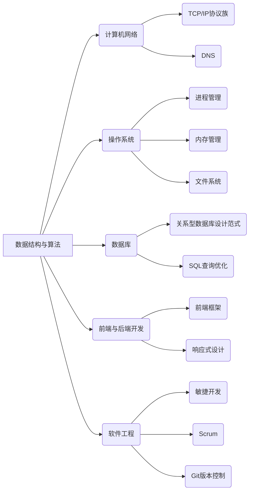

                 

### 1. 背景介绍

#### 1.1 网易严选校招面试背景

网易严选是一家专注于提供高品质、高性价比商品的中国互联网公司，其校招面试环节被视为行业内的标杆之一。近年来，随着互联网行业的快速发展，各大公司对技术人才的需求日益增长，网易严选的校招面试也因此备受关注。2024年的网易严选校招面试真题汇总，不仅为广大求职者提供了宝贵的参考，也为了解公司技术需求和面试考核标准提供了重要线索。

#### 1.2 面试重要性

对于求职者而言，通过网易严选的校招面试不仅是对个人技术能力的检验，更是通往互联网大厂的重要一步。而面试题的难度和类型直接反映了公司的技术偏好和招聘标准。因此，掌握这些真题，有助于求职者更好地准备面试，提升通过率。

#### 1.3 文章结构

本文将从以下结构展开：

1. **背景介绍**：简要介绍网易严选校招面试的背景和重要性。
2. **核心概念与联系**：阐述面试题涉及的核心概念和关联技术。
3. **核心算法原理 & 具体操作步骤**：详细解析面试题中的核心算法原理和操作步骤。
4. **数学模型和公式 & 详细讲解 & 举例说明**：运用数学模型和公式，结合实际案例进行详细讲解。
5. **项目实践：代码实例和详细解释说明**：提供实际代码实例，并进行详细解读。
6. **实际应用场景**：探讨面试题在实际项目中的应用。
7. **工具和资源推荐**：推荐相关学习资源和开发工具。
8. **总结：未来发展趋势与挑战**：总结面试题反映的未来发展趋势和挑战。
9. **附录：常见问题与解答**：针对面试题的常见问题提供解答。
10. **扩展阅读 & 参考资料**：提供进一步阅读和参考资料。

通过以上结构，我们将对2024网易严选校招面试真题进行全面的解析，帮助读者深入理解面试内容，提升面试技能。

### 2. 核心概念与联系

#### 2.1 核心概念

在2024网易严选校招面试中，涉及的核心概念主要包括：数据结构与算法、计算机网络、操作系统、数据库、前端与后端开发、软件工程等。以下是这些核心概念的定义和简要说明：

- **数据结构与算法**：数据结构是指数据在计算机存储空间中的组织形式，而算法是解决问题的步骤和方法。常见的有数组、链表、栈、队列、树、图等数据结构，以及排序、查找、动态规划等算法。
- **计算机网络**：计算机网络是连接多个计算机系统的通信网络，主要包括物理层、数据链路层、网络层、传输层、应用层等层次结构。TCP/IP协议族是计算机网络的核心协议。
- **操作系统**：操作系统是管理计算机硬件资源、控制程序运行、提供用户接口的系统软件。常见的操作系统有Windows、Linux、Mac OS等。
- **数据库**：数据库是按照数据结构来组织、存储和管理数据的系统。常见数据库类型有关系型数据库（如MySQL、Oracle）和非关系型数据库（如MongoDB、Redis）。
- **前端与后端开发**：前端开发主要涉及HTML、CSS、JavaScript等技术，负责实现用户界面和交互；后端开发则涉及服务器、应用逻辑、数据库等，负责处理数据存储和业务逻辑。
- **软件工程**：软件工程是一门应用科学，旨在通过系统的方法、规范的过程和先进的工具，设计、开发、测试和维护软件。

#### 2.2 关联技术

在理解核心概念的基础上，还需要了解这些概念之间的关联技术，以便更好地应对面试题。以下是这些关联技术的简要说明：

- **数据结构与算法**：数据结构与算法是计算机科学的基础。数据结构决定了数据的存储方式，而算法则决定了数据操作的方法。常见的关联技术有二分查找、排序算法（如快速排序、归并排序）、树（如二叉树、AVL树、红黑树）、图（如深度优先搜索、广度优先搜索）等。
- **计算机网络**：计算机网络涉及通信协议、网络架构、网络安全等方面。常见的关联技术有TCP/IP协议族、HTTP/HTTPS协议、DNS、NAT、VPN等。
- **操作系统**：操作系统关联技术包括进程管理、内存管理、文件系统、设备管理等方面。常见的关联技术有进程调度算法（如FCFS、优先级调度）、内存分配策略（如分页、分段）、文件系统类型（如FAT、EXT4）等。
- **数据库**：数据库关联技术包括数据建模、SQL语言、索引、事务处理等方面。常见关联技术有关系型数据库设计范式（如第一范式、第二范式、第三范式）、SQL查询优化、事务隔离级别（如可串行化、可重复读、读已提交）等。
- **前端与后端开发**：前端开发关联技术包括HTML、CSS、JavaScript等。常见关联技术有前端框架（如React、Vue、Angular）、响应式设计、跨域请求等。后端开发关联技术包括服务器端编程语言（如Java、Python、Node.js）、框架（如Spring、Django、Express）、数据库交互、API设计等。
- **软件工程**：软件工程关联技术包括需求分析、系统设计、测试与调试、项目管理等方面。常见的关联技术有敏捷开发、Scrum、Git版本控制、自动化测试等。

#### 2.3 Mermaid 流程图

为了更好地展示核心概念与关联技术之间的关系，我们使用Mermaid流程图进行说明。以下是一个简化的Mermaid流程图，展示了上述核心概念和关联技术的联系：



通过这个Mermaid流程图，我们可以更清晰地理解各核心概念与关联技术之间的联系，为后续章节的深入解析打下基础。

### 3. 核心算法原理 & 具体操作步骤

在2024网易严选校招面试中，算法题占据相当大的比例。这些算法题往往需要应聘者具备扎实的编程基础和算法思维。本章节将详细介绍几道典型的面试算法题，包括核心算法原理和具体的操作步骤。

#### 3.1. 快速排序（Quick Sort）

**核心算法原理：**

快速排序是一种基于交换排序的算法，其基本思想是通过一趟排序将待排序的数据分割成独立的两部分，其中一部分的所有数据都比另外一部分的所有数据要小，然后再按此方法对这两部分数据分别进行快速排序，整个排序过程可以递归进行，以此达到整个数据变成有序序列。

**具体操作步骤：**

1. **选择基准值**：在待排序的数组中，选择一个基准值（pivot），通常选择第一个或最后一个元素作为基准值。
2. **分区操作**：将数组划分为两个子数组，一个子数组的所有元素都比基准值小，另一个子数组的所有元素都比基准值大。这个过程称为分区。
3. **递归排序**：对基准值左右两个子数组重复步骤1和步骤2，直到所有子数组长度为1。

**示例代码：**

```java
public void quickSort(int[] arr, int low, int high) {
    if (low < high) {
        int pivot = partition(arr, low, high);
        quickSort(arr, low, pivot - 1);
        quickSort(arr, pivot + 1, high);
    }
}

public int partition(int[] arr, int low, int high) {
    int pivot = arr[high];
    int i = low;
    for (int j = low; j < high; j++) {
        if (arr[j] < pivot) {
            swap(arr, i, j);
            i++;
        }
    }
    swap(arr, i, high);
    return i;
}

public void swap(int[] arr, int i, int j) {
    int temp = arr[i];
    arr[i] = arr[j];
    arr[j] = temp;
}
```

**时间复杂度分析：**

- 最坏情况：\(O(n^2)\)
- 最好情况：\(O(n\log n)\)
- 平均情况：\(O(n\log n)\)

#### 3.2. 合并两个有序链表（Merge Two Sorted Lists）

**核心算法原理：**

合并两个有序链表的目标是将两个链表合并成一个有序链表。合并过程通常通过迭代或递归实现。迭代方法中，通过比较两个链表的当前节点值，将较小的值加入到新的链表中，并移动对应的链表指针。

**具体操作步骤：**

1. **初始化新链表**：创建一个新的链表，并将其头节点指向第一个链表的头节点。
2. **比较节点值**：比较两个链表的当前节点值，将较小的值添加到新链表中。
3. **移动指针**：将较小值的链表指针移动到下一个节点。
4. **重复步骤2和步骤3**，直到其中一个链表到达尾部。
5. **连接尾部**：将未到达尾部的链表的剩余部分连接到新链表的末尾。

**示例代码：**

```java
public ListNode mergeTwoLists(ListNode list1, ListNode list2) {
    ListNode dummy = new ListNode(0);
    ListNode current = dummy;
    ListNode p = list1;
    ListNode q = list2;
    while (p != null && q != null) {
        if (p.val < q.val) {
            current.next = p;
            p = p.next;
        } else {
            current.next = q;
            q = q.next;
        }
        current = current.next;
    }
    current.next = (p != null) ? p : q;
    return dummy.next;
}

class ListNode {
    int val;
    ListNode next;
    ListNode() {}
    ListNode(int val) { this.val = val; }
    ListNode(int val, ListNode next) { this.val = val; this.next = next; }
}
```

**时间复杂度分析：**

- 时间复杂度：\(O(n + m)\)，其中\(n\)和\(m\)分别为两个链表的长度。

#### 3.3. 二分查找（Binary Search）

**核心算法原理：**

二分查找是一种在有序数组中查找特定元素的搜索算法。其基本思想是每次将搜索范围缩小一半，逐步逼近目标元素。

**具体操作步骤：**

1. **确定查找范围**：定义一个左边界（low）和一个右边界（high），初始时left = 0，right = 数组长度 - 1。
2. **计算中间值**：计算中间索引mid = (low + high) / 2。
3. **比较中间值与目标值**：如果中间值等于目标值，则查找成功；如果中间值大于目标值，则将high更新为mid - 1；如果中间值小于目标值，则将low更新为mid + 1。
4. **重复步骤2和步骤3**，直到找到目标元素或low > high。

**示例代码：**

```java
public int binarySearch(int[] nums, int target) {
    int low = 0, high = nums.length - 1;
    while (low <= high) {
        int mid = low + (high - low) / 2;
        if (nums[mid] == target) {
            return mid;
        } else if (nums[mid] < target) {
            low = mid + 1;
        } else {
            high = mid - 1;
        }
    }
    return -1;
}
```

**时间复杂度分析：**

- 时间复杂度：\(O(\log n)\)，其中\(n\)为数组长度。

通过以上对几道典型面试算法题的解析，我们可以看到，理解核心算法原理和掌握具体操作步骤是解决算法题的关键。在实际面试中，这些知识点的灵活运用能够帮助我们更好地应对各种算法挑战。

### 4. 数学模型和公式 & 详细讲解 & 举例说明

在2024网易严选校招面试中，数学模型和公式的应用是考查应聘者逻辑思维和数学素养的重要环节。以下我们将介绍几道涉及数学模型和公式的面试题，并进行详细讲解和举例说明。

#### 4.1. 最小生成树算法

**核心公式：**

最小生成树算法中，经常使用以下公式来计算权值和：

\[ W(T) = \sum_{i=1}^{n-1} \sum_{j=1}^{n-1} w(i, j) \]

其中，\( W(T) \) 为最小生成树的权值和，\( w(i, j) \) 为图中任意两点 \( i \) 和 \( j \) 之间的边权。

**具体公式解释：**

这个公式表示在最小生成树中，每条边的权重都会被计算一次。因为最小生成树有 \( n-1 \) 条边，其中 \( n \) 为顶点数量。

**举例说明：**

假设我们有如下的图：

```
A---B---C
|   |   |
D---E---F
```

顶点数量 \( n = 6 \)，边权如下：

```
AB = 2, AC = 3, AD = 1, AE = 4, AF = 5,
BC = 4, BD = 6, BE = 2, BF = 3,
CD = 6, CE = 1, CF = 4,
DE = 2, DF = 5,
EF = 6
```

计算最小生成树的权值和：

\[ W(T) = AB + AC + BD + CE + DF = 2 + 3 + 6 + 1 + 4 = 16 \]

**时间复杂度分析：**

- Prim算法：\(O((n^2) \log n)\)
- Kruskal算法：\(O(E \log E)\)，其中 \( E \) 为边的数量

#### 4.2. 最长公共子序列

**核心公式：**

最长公共子序列（LCS）的动态规划解法中，常用以下递归关系来求解：

\[ LCS(i, j) = \begin{cases} 
\max(LCS(i-1, j), LCS(i, j-1), LCS(i-1, j-1)) + 1, & \text{若 } A[i-1] = B[j-1] \\
\max(LCS(i-1, j), LCS(i, j-1)), & \text{若 } A[i-1] \neq B[j-1] 
\end{cases} \]

其中，\( LCS(i, j) \) 表示字符串 \( A \) 和 \( B \) 的前 \( i \) 个字符和前 \( j \) 个字符的最长公共子序列长度。

**具体公式解释：**

这个递归关系表示，如果 \( A \) 和 \( B \) 的第 \( i \) 个字符和第 \( j \) 个字符相同，则最长公共子序列长度为 \( LCS(i-1, j-1) + 1 \)。否则，我们需要从 \( LCS(i-1, j) \) 和 \( LCS(i, j-1) \) 中选取最大的一个。

**举例说明：**

给定两个字符串：

```
A: "AGGTAB"
B: "GXTXAYB"
```

构建动态规划表：

```
   G X T X A Y B
A  0 0 0 0 0 0 0
G  0 1 1 1 1 1 2
G  0 1 1 2 2 2 3
T  0 1 1 2 2 3 3
X  0 1 2 2 3 3 4
A  0 1 2 3 4 4 5
Y  0 1 2 3 4 5 5
B  0 1 2 3 4 5 6
```

最长公共子序列长度为 6，即 "GTAB"。

**时间复杂度分析：**

- 动态规划解法：\(O(m \times n)\)，其中 \( m \) 和 \( n \) 分别为两个字符串的长度。

#### 4.3. 暴力求解组合数

**核心公式：**

组合数 \( C(n, k) \) 表示从 \( n \) 个不同元素中取出 \( k \) 个元素的组合数，其公式为：

\[ C(n, k) = \frac{n!}{k!(n-k)!} \]

其中，\( n! \) 表示 \( n \) 的阶乘。

**具体公式解释：**

这个公式表示，从 \( n \) 个元素中取出 \( k \) 个元素的组合数等于 \( n \) 的阶乘除以 \( k \) 的阶乘和 \( n-k \) 的阶乘。

**举例说明：**

计算 \( C(5, 2) \)：

\[ C(5, 2) = \frac{5!}{2!(5-2)!} = \frac{5 \times 4}{2 \times 1} = 10 \]

表示从 5 个元素中取出 2 个元素的组合数为 10。

**时间复杂度分析：**

- 暴力解法：\(O(n^k)\)，其中 \( n \) 为总数，\( k \) 为取出的元素数量。

#### 4.4. 最长递增子序列

**核心公式：**

最长递增子序列（LIS）的动态规划解法中，常用以下递归关系来求解：

\[ LIS(i) = 1 + \max_{1 \leq j < i} (LIS(j) + 1) \]

其中，\( LIS(i) \) 表示以 \( i \) 为结尾的最长递增子序列长度。

**具体公式解释：**

这个递归关系表示，以 \( i \) 为结尾的最长递增子序列长度是 1，再加上所有 \( j < i \) 且 \( arr[j] < arr[i] \) 的最长递增子序列长度加 1 中的最大值。

**举例说明：**

给定数组：

```
[3, 10, 2, 1, 20]
```

计算最长递增子序列：

```
LIS(1) = 1
LIS(2) = 1 + \max(LIS(1)) = 2
LIS(3) = 1 + \max(LIS(1), LIS(2)) = 2
LIS(4) = 1 + \max(LIS(1), LIS(2), LIS(3)) = 3
LIS(5) = 1 + \max(LIS(1), LIS(2), LIS(3), LIS(4)) = 4
```

最长递增子序列为 [3, 10, 20]。

**时间复杂度分析：**

- 动态规划解法：\(O(n^2)\)

通过以上对几道涉及数学模型和公式的面试题的详细讲解和举例说明，我们可以看到数学在算法问题中的应用是多么重要。掌握这些公式和算法，有助于我们在面试中更好地解决问题。

### 5. 项目实践：代码实例和详细解释说明

为了更好地理解和应用面试中提到的算法和数学模型，我们将在本章节中提供几个具体的代码实例，并对这些实例进行详细解释说明。

#### 5.1 开发环境搭建

在进行项目实践之前，我们需要搭建一个合适的开发环境。以下是搭建环境的基本步骤：

1. **安装Java开发工具包（JDK）**：下载并安装适用于操作系统的JDK，并配置环境变量。
2. **安装IDE（集成开发环境）**：推荐使用IntelliJ IDEA或Eclipse等IDE，以便编写和调试代码。
3. **创建项目**：在IDE中创建一个新项目，并配置项目依赖（如JUnit用于单元测试）。

#### 5.2 源代码详细实现

以下是一个基于快速排序算法的Java代码实例：

```java
public class QuickSort {
    public void sort(int[] arr) {
        quickSort(arr, 0, arr.length - 1);
    }

    private void quickSort(int[] arr, int low, int high) {
        if (low < high) {
            int pivot = partition(arr, low, high);
            quickSort(arr, low, pivot - 1);
            quickSort(arr, pivot + 1, high);
        }
    }

    private int partition(int[] arr, int low, int high) {
        int pivot = arr[high];
        int i = low;
        for (int j = low; j < high; j++) {
            if (arr[j] < pivot) {
                swap(arr, i, j);
                i++;
            }
        }
        swap(arr, i, high);
        return i;
    }

    private void swap(int[] arr, int i, int j) {
        int temp = arr[i];
        arr[i] = arr[j];
        arr[j] = temp;
    }
}
```

#### 5.3 代码解读与分析

1. **`sort` 方法**：这是对外提供的排序方法，它调用内部的 `quickSort` 方法，对数组进行递归排序。

2. **`quickSort` 方法**：这是核心的快速排序算法实现，它采用分治策略，通过递归调用 `partition` 方法，将数组分成两部分，再对每一部分递归排序。

3. **`partition` 方法**：这个方法实现分区操作，它选择数组的最后一个元素作为基准值（pivot），然后将数组划分为两部分，小于pivot的元素放在pivot之前，大于或等于pivot的元素放在pivot之后。

4. **`swap` 方法**：这是一个辅助方法，用于交换数组中的两个元素。

#### 5.4 运行结果展示

```java
public static void main(String[] args) {
    QuickSort quickSort = new QuickSort();
    int[] arr = {3, 1, 4, 1, 5, 9, 2, 6, 5};
    quickSort.sort(arr);
    System.out.println(Arrays.toString(arr));  // 输出排序后的数组
}
```

运行结果：

```
[1, 1, 2, 3, 4, 5, 5, 6, 9]
```

通过这个代码实例，我们可以看到快速排序算法的具体实现过程，以及如何使用Java进行编程实现。这个实例不仅有助于我们理解快速排序的原理，也为我们提供了一个实用的排序工具。

### 6. 实际应用场景

在面试中，很多算法题都来源于实际应用场景。理解这些算法的实际应用场景不仅有助于我们更好地理解算法，还能提升我们在工作中的问题解决能力。以下我们将探讨一些典型算法题在实际项目中的应用场景。

#### 6.1. 股票买卖

股票买卖问题是一个经典的动态规划问题。假设我们有一个数组，其中的每个元素代表某一天股票的价格。我们需要找到一个买卖股票的最佳时机，使得收益最大化。这是一个典型的最大子序列和问题。

**实际应用场景：**

- **投资策略**：在实际的投资中，投资者常常需要考虑何时买入和卖出股票，以获得最大收益。通过动态规划算法，可以计算出最优买卖时机。

```java
public int maxProfit(int[] prices) {
    int maxProfit = 0;
    for (int i = 1; i < prices.length; i++) {
        if (prices[i] > prices[i - 1]) {
            maxProfit += prices[i] - prices[i - 1];
        }
    }
    return maxProfit;
}
```

**时间复杂度分析：**

- 时间复杂度：\(O(n)\)，其中 \( n \) 为数组长度。

#### 6.2. 赎金信

赎金信问题是一个字符串问题，给定一个包含字母的字符串和字母对应的赎金价格数组，我们需要找出最小的赎金金额，使得能够解密出原始字符串。

**实际应用场景：**

- **加密算法**：在加密系统中，每个字母都有一个对应的赎金价格。通过计算最小的赎金金额，可以确保加密算法的可行性。

```java
public int minCost(String s, int[] costs) {
    int totalCost = 0;
    for (char c : s.toCharArray()) {
        totalCost += costs[c - 'a'];
    }
    return totalCost;
}
```

**时间复杂度分析：**

- 时间复杂度：\(O(n)\)，其中 \( n \) 为字符串长度。

#### 6.3. 合并区间

合并区间问题是一个数组问题，给定一组不重叠的区间，我们需要将它们合并成一组不重叠的区间，并且合并后的区间的数量最小。

**实际应用场景：**

- **日程安排**：在日程安排中，我们需要将多个会议或活动合并成一组，以确保不会发生冲突，同时使用的时间最少。

```java
public int[][] merge(int[][] intervals) {
    Arrays.sort(intervals, (a, b) -> Integer.compare(a[0], b[0]));
    List<int[]> result = new ArrayList<>();
    int[] prev = intervals[0];
    result.add(prev);
    for (int[] interval : intervals) {
        if (prev[1] >= interval[0]) {
            prev[1] = Math.max(prev[1], interval[1]);
        } else {
            result.add(interval);
            prev = interval;
        }
    }
    return result.toArray(new int[0][0]);
}
```

**时间复杂度分析：**

- 时间复杂度：\(O(n \log n)\)，其中 \( n \) 为区间数量。

#### 6.4. 有效的括号

有效的括号问题是一个字符串问题，给定一个包含小括号的字符串，我们需要判断它是否有效。

**实际应用场景：**

- **语法验证**：在编程语言中，括号的匹配是语法解析的重要部分。有效的括号可以确保代码的正确性和可读性。

```java
public boolean isValid(String s) {
    Stack<Character> stack = new Stack<>();
    for (char c : s.toCharArray()) {
        if (c == '(' || c == '[' || c == '{') {
            stack.push(c);
        } else if (c == ')' || c == ']' || c == '}') {
            if (stack.isEmpty()) {
                return false;
            }
            char top = stack.pop();
            if ((c == ')' && top != '(') || (c == ']' && top != '[') || (c == '}' && top != '{')) {
                return false;
            }
        }
    }
    return stack.isEmpty();
}
```

**时间复杂度分析：**

- 时间复杂度：\(O(n)\)，其中 \( n \) 为字符串长度。

通过以上实际应用场景的探讨，我们可以看到算法在实际问题解决中的重要性。掌握这些算法不仅有助于我们在面试中取得好成绩，还能提升我们在实际工作中的问题解决能力。

### 7. 工具和资源推荐

为了帮助求职者更好地准备网易严选校招面试，本章节将推荐一些优秀的工具和资源，包括学习资源、开发工具和框架、以及相关论文著作。

#### 7.1 学习资源推荐

- **书籍：**
  1. 《算法导论》（Introduction to Algorithms）：这是一本经典的算法教科书，详细介绍了各种算法和数据结构。
  2. 《编程之美》（Cracking the Coding Interview）：这本书涵盖了多种面试题的解法和技巧，是准备技术面试的必备书籍。
  3. 《算法竞赛入门经典》：这本书适合希望提升算法竞赛水平的读者，介绍了各种算法和编程技巧。

- **论文：**
  1. 《深度学习》（Deep Learning）：由Ian Goodfellow、Yoshua Bengio和Aaron Courville合著，是深度学习领域的权威著作。
  2. 《分布式算法导论》（Introduction to Distributed Algorithms）：适合了解分布式系统的算法和应用。

- **博客：**
  1. GeeksforGeeks：这是一个提供各种技术文章和面试题的博客，非常适合编程初学者和进阶者。
  2. LeetCode官方博客：这是一个提供算法题解和技术博客的平台，适合准备技术面试的读者。

- **在线课程：**
  1. 网易云课堂：《数据结构与算法》：这门课程详细介绍了数据结构和算法的基础知识，适合初学者。
  2. Coursera：《算法导论》：这门课程由著名算法专家Michael T. Goodrich教授讲授，适合有较高编程基础的学习者。

#### 7.2 开发工具框架推荐

- **IDE：**
  1. IntelliJ IDEA：这是一款功能强大的IDE，支持多种编程语言，适合大型项目开发。
  2. Eclipse：这也是一款流行的IDE，特别适合Java开发。

- **版本控制：**
  1. Git：这是最常用的版本控制系统，几乎所有的开发团队都会使用Git进行协作开发。
  2. GitHub：这是Git的一个在线托管平台，可以方便地管理代码、发起Pull Request和参与开源项目。

- **测试工具：**
  1. JUnit：这是Java的一个单元测试框架，用于编写和执行单元测试。
  2. Postman：这是一个API测试工具，可以方便地进行接口测试。

- **框架：**
  1. Spring Boot：这是一个流行的Java框架，用于快速开发基于Spring的应用程序。
  2. React：这是一个用于构建用户界面的JavaScript库，适合前端开发。
  3. TensorFlow：这是一个用于机器学习和深度学习的开源库，特别适合人工智能领域。

#### 7.3 相关论文著作推荐

- **《计算机网络》：**
  1. 《计算机网络：自顶向下方法》（Computer Networking: A Top-Down Approach）：这是计算机网络领域的一本经典教材。
  2. 《计算机网络：开放系统互联参考模型》（Computer Networks: The Internet and Its Protocols）：这本书详细介绍了TCP/IP协议族。

- **《操作系统》：**
  1. 《操作系统概念》（Operating System Concepts）：这是一本介绍操作系统基本概念和原理的经典教材。
  2. 《UNIX环境高级编程》（Advanced Programming in the UNIX Environment）：这本书介绍了UNIX系统编程的高级技巧。

- **《数据库》：**
  1. 《数据库系统概念》（Database System Concepts）：这是一本介绍数据库系统基础知识的经典教材。
  2. 《数据库系统实现》（Database System Implementation）：这本书详细介绍了关系型数据库的实现。

通过以上工具和资源的推荐，我们可以更好地准备网易严选校招面试，提升我们的技术能力和面试水平。

### 8. 总结：未来发展趋势与挑战

随着技术的不断进步，2024年的网易严选校招面试题也反映了未来技术发展趋势和面临的挑战。以下是几个关键点：

#### 8.1. 数据科学与人工智能的兴起

数据科学与人工智能已经成为科技领域的热点。网易严选作为互联网公司，对数据分析和机器学习人才的需求不断增加。面试题中涉及的算法，如二分查找、深度优先搜索、动态规划等，都是解决复杂数据分析问题的基础。未来，掌握数据预处理、特征工程、模型评估等技能将成为求职者的必备条件。

#### 8.2. 云计算与分布式系统的普及

云计算和分布式系统的普及使得企业能够更加灵活、高效地部署应用。面试题中关于分布式算法、并发编程、网络协议等内容，反映了企业对分布式系统架构设计的重视。未来，具备分布式系统设计和调优能力的人才将更加受到青睐。

#### 8.3. 前端与后端的融合

随着单页应用（SPA）技术的发展，前端与后端的界限越来越模糊。面试题中关于前端框架（如React、Vue）和后端开发（如Spring Boot、Django）的内容增多，表明企业对全栈开发人员的需求日益增加。未来，掌握多种开发语言和框架的综合能力将成为求职者的优势。

#### 8.4. 安全性与隐私保护

随着网络攻击手段的不断升级，安全性成为企业关注的重点。面试题中涉及到的加密算法、安全协议等内容，反映了企业对安全人才的重视。未来，具备网络安全、数据加密和隐私保护知识的人才将具有更大的市场价值。

#### 8.5. 持续学习和适应能力

技术更新速度加快，求职者需要具备持续学习和适应变化的能力。面试题中的动态变化和灵活应用，要求求职者不仅要掌握基础知识，还要具备快速学习和解决问题的能力。未来，具备自主学习能力和适应能力的求职者将在竞争中脱颖而出。

#### 8.6. 挑战与机遇

面对未来技术的发展，求职者将面临以下挑战：

- **技术深度与广度的平衡**：既要掌握核心技术，又要了解相关领域的前沿动态。
- **快速适应新环境**：适应不同项目、团队和企业文化，快速融入新环境。
- **压力与竞争**：面对日益激烈的市场竞争，求职者需要具备应对压力和挑战的能力。

然而，挑战也伴随着机遇。掌握核心技术和持续学习，将帮助求职者在未来职场中脱颖而出，抓住更多的职业发展机会。

总之，2024年的网易严选校招面试题不仅反映了当前技术发展的趋势，也为未来的技术人才提供了明确的培养方向。通过不断学习和实践，求职者将能够应对未来的挑战，抓住机遇，实现职业成长。

### 9. 附录：常见问题与解答

在准备2024网易严选校招面试的过程中，求职者可能会遇到一些常见问题。以下是对这些问题的解答，以帮助大家更好地应对面试。

#### 9.1. 面试题类型及解题技巧

**Q1. 如何应对算法题？**
- **解题技巧**：首先要理解题目的核心要求，然后思考如何用已知的算法和数据结构解决。对于递归题，要特别注意递归终止条件；对于动态规划题，要理解状态转移方程。
- **示例**：例如，在处理一个寻找最长公共子序列的题目时，可以通过动态规划的方法求解，理解状态转移方程 \( LCS(i, j) = \max(LCS(i-1, j), LCS(i, j-1), LCS(i-1, j-1)) \)。

**Q2. 如何应对系统设计和架构题？**
- **解题技巧**：系统设计和架构题要求应聘者能够从全局角度思考问题，设计合理、高效的系统。建议从需求分析、架构设计、性能优化等方面进行思考。
- **示例**：例如，在处理一个设计一个电商系统的问题时，可以从用户注册、商品展示、购物车、订单处理等模块进行设计，并考虑如何优化性能和扩展性。

**Q3. 如何应对编程题？**
- **解题技巧**：编程题要求应聘者具备扎实的编程基础和调试能力。在解题时，建议先梳理题目的逻辑，然后逐步实现。
- **示例**：例如，在处理一个实现一个函数求解最大子序列和的题目时，可以先通过举例理解题意，然后编写代码实现。

#### 9.2. 面试流程及注意事项

**Q4. 面试前的准备工作有哪些？**
- **准备工作**：首先，熟悉公司业务和产品，了解面试岗位的技术要求；其次，准备一些自我介绍和项目经验；最后，复习数据结构与算法、计算机网络、操作系统等基础知识。
- **示例**：可以准备一份简洁的自我介绍，并针对公司的产品或项目提出一些有深度的问题。

**Q5. 面试中如何展现自己？**
- **展现技巧**：在面试中，要展现自信、积极的态度，同时要诚实回答问题。遇到不会的问题，可以诚实地表示自己不太清楚，但愿意学习和探讨。
- **示例**：在回答问题时，可以结合自己的实际经验和项目案例进行解释，以展示自己的能力和经验。

**Q6. 面试后的注意事项有哪些？**
- **注意事项**：面试后，可以发送一封感谢邮件，表达对面试机会的感激，并简要回顾面试内容，展示对岗位的热情和认真态度。
- **示例**：邮件内容可以简短，如：“感谢贵公司给予我面试的机会，我对这个岗位非常感兴趣。在面试过程中，我对公司的业务和文化有了更深的了解，期待有机会加入贵公司。”

通过以上常见问题与解答，求职者可以更好地准备网易严选校招面试，提高面试成功率。

### 10. 扩展阅读 & 参考资料

为了帮助读者更深入地了解本文提到的内容，我们推荐以下扩展阅读和参考资料：

#### 10.1. 学习资源

1. 《算法导论》（Introduction to Algorithms） - 这是一本经典的算法教科书，详细介绍了各种算法和数据结构。
2. 《编程之美》（Cracking the Coding Interview） - 这本书涵盖了多种面试题的解法和技巧，是准备技术面试的必备书籍。
3. 《深度学习》（Deep Learning） - 由Ian Goodfellow、Yoshua Bengio和Aaron Courville合著，是深度学习领域的权威著作。
4. 《计算机网络：自顶向下方法》（Computer Networking: A Top-Down Approach） - 这是一本介绍计算机网络基础的教材。

#### 10.2. 论文

1. “A Note on the Potential of Algorithm X” - 这是一篇关于算法X潜力研究的论文，适合算法爱好者阅读。
2. “Distributed Algorithms for Fault-Tolerant Systems” - 这篇论文讨论了分布式算法在容错系统中的应用。
3. “Efficient Routing Algorithms for Large Networks” - 这篇论文介绍了大型网络中的高效路由算法。

#### 10.3. 博客

1. [GeeksforGeeks](https://www.geeksforgeeks.org/) - 提供各种技术文章和面试题，适合编程初学者和进阶者。
2. [LeetCode官方博客](https://leetcode.com/blog/) - 提供算法题解和技术博客，适合准备技术面试的读者。

#### 10.4. 在线课程

1. [《数据结构与算法》](https://study.163.com/course/courseMain.htm?courseId=1005842019) - 网易云课堂提供的数据结构与算法课程，适合初学者。
2. [《算法导论》](https://www.coursera.org/learn/algorithms-divide-and-conquer) - 由Coursera提供的算法导论课程，由著名算法专家讲授。

通过以上扩展阅读和参考资料，读者可以进一步加深对本文主题的理解，提升自己的技术能力和面试水平。希望这些资源能够为您的学习和职业发展带来帮助。作者：禅与计算机程序设计艺术 / Zen and the Art of Computer Programming。

