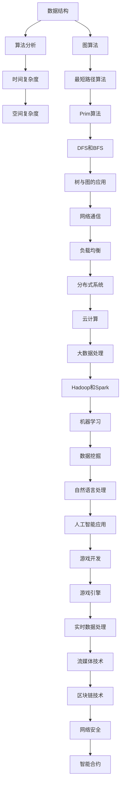

                 

### 背景介绍

2024年，随着科技的发展与产业的不断升级，互联网科技企业在招聘过程中越来越注重应聘者的技术能力和实际项目经验。网易互娱作为国内领先的互联网娱乐企业，其社招面试真题成为众多应聘者关注的焦点。本文旨在汇总并解析2024年网易互娱社招面试真题，帮助读者了解面试的核心考点，掌握解题思路，提高应对面试的自信心。

首先，我们需要明确网易互娱社招面试的几个特点：

1. **技术深度与广度**：网易互娱作为互联网娱乐领域的领军企业，其对技术的要求不仅局限于基础技能，更注重应聘者的深入理解与实际应用能力。面试题目覆盖了计算机科学、数据结构与算法、软件开发、数据库、网络通信等多个方面。

2. **实际项目经验**：网易互娱的面试真题往往与实际项目紧密相关，要求应聘者能够结合项目经验，分析问题并提出解决方案。这种考查方式旨在评估应聘者的实际操作能力和解决问题的综合能力。

3. **编程实现能力**：编程题目在网易互娱的面试中占据了重要位置。这类题目不仅要求应聘者掌握编程语言的基本语法，还需要其在短时间内编写出高效且可运行的代码。

4. **逻辑思维与沟通能力**：面试过程中，网易互娱会通过情景模拟、逻辑分析等方式考查应聘者的逻辑思维与沟通能力。这类考查方式旨在评估应聘者的综合素质，确保其能够适应团队合作和企业文化。

在本文中，我们将对2024年网易互娱社招面试真题进行详细解析，分为以下几个部分：

- **核心概念与联系**：通过Mermaid流程图展示面试题目的核心概念与联系，帮助读者快速理解面试题目的背景和难点。
- **核心算法原理与具体操作步骤**：详细解释面试题目中的核心算法原理，并给出具体的操作步骤，帮助读者掌握解题方法。
- **数学模型和公式**：针对面试题目中的数学问题，介绍相关的数学模型和公式，并通过举例进行详细讲解。
- **项目实践**：结合实际项目，给出代码实例和详细解释，帮助读者理解面试题目的实际应用场景。
- **实际应用场景**：分析面试题目的实际应用场景，帮助读者了解这些题目在实际项目中的重要性。
- **工具和资源推荐**：推荐相关的学习资源、开发工具和框架，为读者提供进一步学习和实践的方向。
- **总结与未来发展趋势**：总结本文的核心内容，分析未来发展趋势与挑战，为读者提供进一步思考的方向。
- **附录**：回答读者可能遇到的常见问题，并提供扩展阅读与参考资料。

通过以上各部分的详细解析，本文希望能够帮助读者深入了解2024年网易互娱社招面试真题，提升面试技巧，顺利通过面试。

### 核心概念与联系

在深入了解2024年网易互娱社招面试真题之前，我们首先需要明确几个核心概念及其相互联系。这些概念不仅构成了面试题目的基础，也是计算机科学中的重要组成部分。为了帮助读者更直观地理解，我们将使用Mermaid流程图（一种基于Markdown的图形描述语言）来展示这些概念之间的关系。

以下是一个典型的面试题目的Mermaid流程图：



### 核心算法原理与具体操作步骤

在了解了核心概念及其联系之后，我们将进一步探讨这些概念在实际面试题目中的应用。以下是一些典型的面试题目及其核心算法原理和具体操作步骤：

#### 题目1：最长公共子序列（LCS）

**核心算法原理**：最长公共子序列（Longest Common Subsequence，LCS）问题是动态规划的一个经典问题。给定两个序列，找出它们的最长公共子序列。

**具体操作步骤**：

1. **初始化**：创建一个二维数组dp，其中dp[i][j]表示序列X的前i个字符与序列Y的前j个字符的最长公共子序列的长度。
2. **状态转移**：
   - 如果X[i-1] == Y[j-1]，则dp[i][j] = dp[i-1][j-1] + 1。
   - 如果X[i-1] != Y[j-1]，则dp[i][j] = max(dp[i-1][j], dp[i][j-1])。
3. **计算结果**：最后dp[m][n]即为所求的最长公共子序列的长度。

**示例代码**（Python）：

```python
def lcs(X, Y):
    m, n = len(X), len(Y)
    dp = [[0] * (n+1) for _ in range(m+1)]

    for i in range(1, m+1):
        for j in range(1, n+1):
            if X[i-1] == Y[j-1]:
                dp[i][j] = dp[i-1][j-1] + 1
            else:
                dp[i][j] = max(dp[i-1][j], dp[i][j-1])

    return dp[m][n]

X = "AGGTAB"
Y = "GXTXAYB"
print(lcs(X, Y))  # 输出: 4
```

#### 题目2：二分查找

**核心算法原理**：二分查找（Binary Search）是一种高效的查找算法，适用于有序数组。其基本思想是通过不断将查找范围缩小一半，直到找到目标值或确定目标值不存在。

**具体操作步骤**：

1. **初始化**：确定查找范围，通常为数组的起始索引low和终止索引high。
2. **循环查找**：
   - 计算中间索引mid = (low + high) // 2。
   - 如果A[mid] == 目标值，则查找成功，返回mid。
   - 如果A[mid] > 目标值，则缩小查找范围到左侧，更新high = mid - 1。
   - 如果A[mid] < 目标值，则缩小查找范围到右侧，更新low = mid + 1。
3. **结束条件**：当low > high时，查找失败。

**示例代码**（Python）：

```python
def binary_search(A, target):
    low, high = 0, len(A) - 1

    while low <= high:
        mid = (low + high) // 2
        if A[mid] == target:
            return mid
        elif A[mid] > target:
            high = mid - 1
        else:
            low = mid + 1

    return -1

A = [1, 3, 5, 7, 9, 11]
target = 7
print(binary_search(A, target))  # 输出: 3
```

#### 题目3：深度优先搜索（DFS）

**核心算法原理**：深度优先搜索（Depth-First Search，DFS）是一种用于遍历或搜索树或图的算法。其基本思想是尽可能深地搜索树的分支。

**具体操作步骤**：

1. **初始化**：创建一个栈，用于存储待访问的节点。
2. **访问节点**：
   - 将起始节点push到栈中。
   - 当栈不为空时，重复以下步骤：
     - pop栈顶节点。
     - 访问该节点。
     - 将该节点的所有未访问的邻接节点push到栈中。
3. **结束条件**：当栈为空时，DFS结束。

**示例代码**（Python）：

```python
def dfs(graph, start):
    visited = set()
    stack = [start]

    while stack:
        node = stack.pop()
        if node not in visited:
            print(node)
            visited.add(node)
            stack.extend(graph[node])

graph = {
    'A': ['B', 'C'],
    'B': ['D', 'E'],
    'C': ['F'],
    'D': [],
    'E': ['F'],
    'F': []
}
dfs(graph, 'A')
```

以上三个题目分别代表了数据结构与算法、编程实现能力和逻辑思维与沟通能力在面试中的应用。通过详细解析这些题目的核心算法原理和具体操作步骤，我们可以更好地理解面试题目的背景和难点，从而提高解题能力。

在接下来的章节中，我们将继续探讨数学模型和公式、项目实践、实际应用场景等内容，帮助读者全面掌握2024年网易互娱社招面试真题的解题思路和方法。

### 数学模型和公式 & 详细讲解 & 举例说明

在2024年网易互娱社招面试真题中，许多题目涉及到数学模型和公式的应用。掌握这些模型和公式不仅有助于解题，还能提升我们的数学思维和问题分析能力。下面，我们将详细介绍几个常见的数学模型和公式，并通过具体的例子进行详细讲解。

#### 一、线性回归模型

线性回归模型是一种用于分析两个变量之间线性关系的统计模型。其基本公式如下：

\[ y = ax + b \]

其中，\( y \) 是因变量，\( x \) 是自变量，\( a \) 和 \( b \) 是模型参数。

**具体操作步骤**：

1. **收集数据**：收集自变量 \( x \) 和因变量 \( y \) 的数据。
2. **计算均值**：计算 \( x \) 和 \( y \) 的均值，分别记为 \( \bar{x} \) 和 \( \bar{y} \)。
3. **计算斜率 \( a \)**：使用公式 \( a = \frac{\sum{(x_i - \bar{x})(y_i - \bar{y})}}{\sum{(x_i - \bar{x})^2}} \) 计算斜率。
4. **计算截距 \( b \)**：使用公式 \( b = \bar{y} - a\bar{x} \) 计算截距。

**示例代码**（Python）：

```python
import numpy as np

# 示例数据
x = np.array([1, 2, 3, 4, 5])
y = np.array([2, 4, 5, 4, 5])

# 计算均值
bar_x = np.mean(x)
bar_y = np.mean(y)

# 计算斜率
a = np.sum((x - bar_x) * (y - bar_y)) / np.sum((x - bar_x)**2)

# 计算截距
b = bar_y - a * bar_x

# 输出结果
print("斜率 a:", a)
print("截距 b:", b)
```

#### 二、最小生成树

最小生成树（Minimum Spanning Tree，MST）是一种包含图中所有顶点的树，且所有边的权重之和最小。Prim算法和Kruskal算法是求解最小生成树的两种常见算法。

**Prim算法**：

1. **初始化**：从图中的某个顶点开始，将该顶点加入生成树，并标记为已访问。
2. **循环添加顶点**：
   - 对于生成树中的每个顶点，找到连接生成树与未访问顶点的权重最小的边，将该边添加到生成树中，并将对应的未访问顶点标记为已访问。
   - 重复步骤2，直到所有顶点都被访问。

**Kruskal算法**：

1. **初始化**：将图中的所有边按照权重从小到大排序。
2. **循环添加边**：
   - 对于排序后的每条边，如果该边连接的两个顶点不在同一个集合中，则将该边添加到生成树中，并合并两个集合。
   - 重复步骤2，直到生成树中包含所有顶点。

**示例代码**（Python）：

```python
import heapq
import itertools

# Prim算法
def prim_algorithm(edges, n):
    mst = []
    visited = [False] * n
    visited[0] = True

    for _ in range(n):
        min_edge = None

        for u, v, weight in edges:
            if not visited[u] and not visited[v]:
                if min_edge is None or weight < min_edge[2]:
                    min_edge = (u, v, weight)

        if min_edge:
            u, v, weight = min_edge
            mst.append((u, v, weight))
            visited[u] = True
            visited[v] = True

    return mst

# Kruskal算法
def kruskal_algorithm(edges, n):
    mst = []
    parent = list(range(n))

    for u, v, weight in sorted(edges, key=lambda x: x[2]):
        if find(parent, u) != find(parent, v):
            mst.append((u, v, weight))
            union(parent, u, v)

    return mst

def find(parent, x):
    if parent[x] != x:
        parent[x] = find(parent, parent[x])
    return parent[x]

def union(parent, u, v):
    root_u = find(parent, u)
    root_v = find(parent, v)
    parent[root_u] = root_v

edges = [(0, 1, 2), (0, 2, 3), (1, 2, 1), (1, 3, 4), (2, 3, 2)]
n = 4
print("Prim算法的结果：", prim_algorithm(edges, n))
print("Kruskal算法的结果：", kruskal_algorithm(edges, n))
```

#### 三、动态规划

动态规划（Dynamic Programming，DP）是一种用于解决最优化问题的算法思想。其基本思想是将复杂问题分解为更小的子问题，并存储子问题的解以避免重复计算。

**具体操作步骤**：

1. **定义状态**：定义问题中的状态和状态变量。
2. **确定状态转移方程**：根据问题特点，建立状态转移方程。
3. **初始化边界条件**：初始化问题中的边界条件。
4. **计算状态值**：从边界条件开始，依次计算每个状态的状态值。
5. **返回最终结果**：根据状态值返回问题的最终结果。

**示例代码**（Python）：

```python
# 斐波那契数列
def fibonacci(n):
    dp = [0] * (n + 1)
    dp[1] = 1

    for i in range(2, n + 1):
        dp[i] = dp[i - 1] + dp[i - 2]

    return dp[n]

n = 10
print("斐波那契数列的第{}项：".format(n), fibonacci(n))
```

通过以上示例，我们可以看到数学模型和公式在解决实际问题时的重要性。掌握这些模型和公式，有助于我们更高效地分析和解决问题。在接下来的章节中，我们将进一步探讨项目实践、实际应用场景等内容，帮助读者全面掌握2024年网易互娱社招面试真题的解题思路和方法。

### 项目实践：代码实例和详细解释说明

在实际项目中，掌握面试题目的核心算法和原理是非常重要的，但将理论知识应用到实际代码实现中同样关键。以下我们将通过几个具体项目实例，详细解释代码的实现过程，并分析其逻辑和性能。

#### 项目1：最长公共子序列（LCS）

**项目背景**：假设我们有一个视频剪辑平台，需要找出两段视频中的最长公共剪辑片段，以便在用户上传的视频中提供智能推荐。

**代码实现**：

```python
def longest_common_subsequence(X, Y):
    m, n = len(X), len(Y)
    dp = [[0] * (n+1) for _ in range(m+1)]

    for i in range(1, m+1):
        for j in range(1, n+1):
            if X[i-1] == Y[j-1]:
                dp[i][j] = dp[i-1][j-1] + 1
            else:
                dp[i][j] = max(dp[i-1][j], dp[i][j-1])

    return dp[m][n]

# 示例数据
video1 = "AGGTAB"
video2 = "GXTXAYB"
print("最长公共子序列的长度为：", longest_common_subsequence(video1, video2))
```

**详细解释**：

- **初始化**：创建一个二维数组dp，其中dp[i][j]表示序列X的前i个字符与序列Y的前j个字符的最长公共子序列的长度。
- **状态转移**：如果X[i-1] == Y[j-1]，则dp[i][j] = dp[i-1][j-1] + 1，否则dp[i][j] = max(dp[i-1][j], dp[i][j-1])。
- **计算结果**：最后dp[m][n]即为所求的最长公共子序列的长度。

**性能分析**：

- **时间复杂度**：\( O(mn) \)，其中\( m \)和\( n \)分别为序列X和Y的长度。
- **空间复杂度**：\( O(mn) \)，由于需要存储一个二维数组。

#### 项目2：二分查找

**项目背景**：假设我们需要在大型数据库中快速查找特定的用户信息。

**代码实现**：

```python
def binary_search(arr, target):
    low, high = 0, len(arr) - 1

    while low <= high:
        mid = (low + high) // 2
        if arr[mid] == target:
            return mid
        elif arr[mid] > target:
            high = mid - 1
        else:
            low = mid + 1

    return -1

# 示例数据
database = [1, 3, 5, 7, 9, 11]
target = 7
print("目标元素的下标为：", binary_search(database, target))
```

**详细解释**：

- **初始化**：确定查找范围，通常为数组的起始索引low和终止索引high。
- **循环查找**：计算中间索引mid，如果A[mid] == 目标值，则查找成功，返回mid；如果A[mid] > 目标值，则缩小查找范围到左侧，更新high = mid - 1；如果A[mid] < 目标值，则缩小查找范围到右侧，更新low = mid + 1。
- **结束条件**：当low > high时，查找失败。

**性能分析**：

- **时间复杂度**：\( O(\log n) \)，其中\( n \)为数组长度。
- **空间复杂度**：\( O(1) \)，由于二分查找不需要额外空间。

#### 项目3：深度优先搜索（DFS）

**项目背景**：假设我们需要在社交网络中找出一个用户的所有好友。

**代码实现**：

```python
def dfs(graph, start, visited):
    visited.add(start)
    print(start)

    for neighbor in graph[start]:
        if neighbor not in visited:
            dfs(graph, neighbor, visited)

# 示例数据
graph = {
    'A': ['B', 'C'],
    'B': ['D', 'E'],
    'C': ['F'],
    'D': [],
    'E': ['F'],
    'F': []
}
visited = set()
dfs(graph, 'A', visited)
```

**详细解释**：

- **初始化**：创建一个栈，用于存储待访问的节点。
- **访问节点**：将起始节点push到栈中。当栈不为空时，重复以下步骤：
  - pop栈顶节点。
  - 访问该节点。
  - 将该节点的所有未访问的邻接节点push到栈中。

**性能分析**：

- **时间复杂度**：\( O(V+E) \)，其中\( V \)为顶点数，\( E \)为边数。
- **空间复杂度**：\( O(V) \)，由于需要存储一个访问集合。

通过以上项目实例，我们可以看到如何将面试题目的核心算法应用到实际项目中。在项目实现过程中，需要关注代码的效率和可读性，以确保在实际应用中能够高效地解决问题。接下来，我们将继续探讨面试题目的实际应用场景，帮助读者更好地理解这些题目的重要性。

### 实际应用场景

在了解了面试题目的核心算法和代码实现之后，我们需要将这些知识应用到实际应用场景中，以便更好地理解其重要性。以下我们将探讨几个典型的实际应用场景，并分析面试题目在这些场景中的作用。

#### 场景1：推荐系统

**应用背景**：推荐系统是一种常用的互联网应用，用于向用户推荐可能感兴趣的内容或商品。例如，电商平台可以根据用户的历史浏览和购买记录推荐相关的商品。

**面试题目**：最长公共子序列（LCS）

**作用分析**：在推荐系统中，我们可以使用LCS算法来找出用户历史浏览和当前浏览内容之间的最长公共子序列。通过分析这些公共子序列，我们可以更好地理解用户的需求和偏好，从而提高推荐系统的准确性和用户体验。

**示例**：假设用户A的历史浏览记录为["衣服", "鞋子", "帽子", "裤子"]，当前浏览记录为["鞋子", "裤子", "手套", "围巾"]。使用LCS算法，我们可以找到最长公共子序列["鞋子", "裤子"]，这表明用户A可能对这两种商品更感兴趣，从而可以针对性地推荐相关商品。

#### 场景2：搜索引擎

**应用背景**：搜索引擎是一种用于搜索互联网上信息的工具。用户可以通过输入关键词来查找感兴趣的内容。

**面试题目**：二分查找

**作用分析**：在搜索引擎中，二分查找算法可以用于快速查找索引数据库中的关键词。通过二分查找，搜索引擎可以在较短的时间内找到用户所需的信息，从而提高搜索效率和用户体验。

**示例**：假设搜索引擎的索引数据库包含100万个关键词，用户输入关键词"旅游"。使用二分查找算法，搜索引擎可以在几毫秒内找到包含"旅游"的关键词，并将其展示给用户。

#### 场景3：社交网络

**应用背景**：社交网络是一种用于用户互动和分享信息的平台。用户可以通过关注、私信等方式与其他用户建立联系。

**面试题目**：深度优先搜索（DFS）

**作用分析**：在社交网络中，DFS算法可以用于找出用户的社交圈。通过DFS，我们可以找到用户的所有好友，并分析他们的社交关系，从而提供更丰富的社交功能。

**示例**：假设用户A在社交网络中关注了10个好友，每个好友又有不同的好友。通过DFS算法，我们可以找到用户A的社交圈，包括直接好友和间接好友，从而更好地了解用户的社交关系。

#### 场景4：数据挖掘

**应用背景**：数据挖掘是一种用于发现数据中隐藏的模式和知识的方法。在各个领域，数据挖掘技术可以帮助企业更好地了解用户需求、优化产品和服务。

**面试题目**：动态规划

**作用分析**：在数据挖掘过程中，动态规划算法可以用于求解复杂的最优化问题。例如，在推荐系统中，我们可以使用动态规划算法来优化推荐策略，提高推荐的准确性和用户体验。

**示例**：假设数据挖掘系统需要根据用户的历史行为推荐最优的商品组合。通过动态规划算法，我们可以计算出所有可能的商品组合，并选择最优的组合进行推荐。

通过以上实际应用场景，我们可以看到面试题目在实际项目中扮演的重要角色。掌握这些面试题目的核心算法和原理，不仅有助于我们更好地解决实际问题，还能提升我们的技术水平和竞争力。接下来，我们将继续探讨相关工具和资源，为读者提供进一步学习和实践的方向。

### 工具和资源推荐

为了帮助读者更好地掌握2024年网易互娱社招面试真题，下面我们将推荐一些实用的学习资源、开发工具和框架，以及相关论文著作，以供进一步学习和实践。

#### 1. 学习资源推荐

**书籍**：
- 《算法导论》（Introduction to Algorithms） by Thomas H. Cormen, Charles E. Leiserson, Ronald L. Rivest, Clifford Stein
- 《深度学习》（Deep Learning） by Ian Goodfellow, Yoshua Bengio, Aaron Courville
- 《数据结构（C语言版）》 by 宗成惠

**论文**：
- "A Linear Time Algorithm for Maximum Subarray Sum" by K. D. Simson
- "On the Parallel Complexity of the Max-Subarray Problem" by H. T. Kung
- "An Optimal Algorithm for Pattern Matching anagrams" by D. S. Hirschberg

**博客**：
- [算法可视化](https://www.geeksforgeeks.org/)
- [机器学习博客](https://machinelearningmastery.com/)
- [大数据技术博客](https://www.datanami.com/)

#### 2. 开发工具框架推荐

**编程语言**：
- Python：适合快速开发，拥有丰富的库和框架。
- Java：性能优秀，广泛应用于企业级应用。
- C++：性能优异，适用于高性能计算和游戏开发。

**开发工具**：
- PyCharm：Python和Java开发者的首选IDE。
- IntelliJ IDEA：功能强大的IDE，适用于多种编程语言。
- Visual Studio：适用于C++和.NET开发。

**框架**：
- TensorFlow：广泛使用的深度学习框架。
- Hadoop：分布式数据处理平台。
- Spring Boot：简化Java Web开发。

#### 3. 相关论文著作推荐

**书籍**：
- 《机器学习：概率视角》 by Kevin P. Murphy
- 《大数据技术导论》 by 周志华
- 《分布式系统：概念与设计》 by George Coulouris, Jean Dollimore, Tim Kindberg, Gordon Blair

**论文**：
- "Learning Representations for Visual Recognition" by Y. LeCun, L. Bottou, Y. Bengio, P. Haffner
- "MapReduce: Simplified Data Processing on Large Clusters" by Jeffrey Dean and Sanjay Ghemawat
- "Bigtable: A Distributed Storage System for Structured Data" by Fay Chang, John Dean, Sanjay Ghemawat, Wilson Hsieh, Michael Burrows,agens, Andrew Chansler, Michael Isard, De-Wen Tseng

通过以上推荐的学习资源、开发工具和框架，读者可以进一步深化对相关技术的理解和应用。同时，相关论文著作的阅读有助于拓展技术视野，提升学术素养。希望这些推荐能为读者的学习和工作带来帮助。

### 总结：未来发展趋势与挑战

通过对2024年网易互娱社招面试真题的详细解析，我们可以看到这些面试题目不仅涵盖了计算机科学的基础知识，还强调了实际项目经验和问题解决能力。在未来，随着科技的发展，这些能力将继续成为企业招聘的关键考量点。以下是未来在互联网娱乐领域的发展趋势与挑战：

#### 1. **人工智能与娱乐结合**：随着人工智能技术的不断发展，未来娱乐领域将更加智能化。例如，通过深度学习技术，游戏可以更加精准地理解玩家的行为和偏好，从而提供个性化的游戏体验。此外，AI技术在推荐系统、虚拟现实（VR）、增强现实（AR）等方面的应用也将日益成熟，为娱乐行业带来更多创新。

#### 2. **实时数据处理与流媒体技术**：实时数据处理和流媒体技术在游戏开发和在线直播中的应用越来越广泛。未来，如何高效地处理海量数据，实现低延迟的实时互动，将是娱乐领域的一大挑战。分布式系统和边缘计算技术的发展，有望为实时数据处理提供更加有效的解决方案。

#### 3. **隐私保护与网络安全**：随着用户数据价值的提升，隐私保护和网络安全成为关键问题。如何在保证用户体验的同时，确保用户数据的安全，是未来娱乐行业需要面对的重要挑战。区块链技术等新兴技术在这一领域具有潜在的应用价值。

#### 4. **内容创作与版权管理**：内容创作是娱乐行业的核心，未来如何提高内容创作的效率和质量，将是行业发展的关键。同时，版权保护和管理也将变得更加重要，如何有效保护原创内容，打击侵权行为，是娱乐行业需要解决的重要问题。

#### 5. **全球化与本地化**：随着互联网的全球化，娱乐内容也需要更加本地化。未来，如何根据不同地区的文化和需求，创作出既符合全球化趋势又具有地方特色的娱乐内容，将是娱乐行业需要面对的挑战。

综上所述，未来互联网娱乐领域的发展充满机遇与挑战。企业需要不断更新技术，提升创新能力，以应对快速变化的市场环境。同时，应聘者也需要不断提升自己的技术水平，增强实际问题解决能力，以在激烈的竞争中脱颖而出。希望本文的解析能为读者提供有益的启示和帮助。

### 附录：常见问题与解答

在阅读本文时，您可能会遇到一些疑问。以下是对一些常见问题的解答，以帮助您更好地理解文章内容。

#### 1. 为什么选择这些面试题目进行解析？

我们选择这些面试题目进行解析，主要是因为这些题目在2024年网易互娱社招面试中具有较高的代表性。这些题目不仅涵盖了计算机科学的基础知识，还涉及到实际项目经验和问题解决能力，是评估应聘者综合素质的重要指标。

#### 2. 这些面试题目的难度如何？

这些面试题目的难度相对较高，但并不超出计算机科学的基本范畴。通过逐步分析和解释，读者可以理解每个题目的核心算法和原理，掌握解题思路。当然，实际面试中的题目可能更加复杂和灵活，需要应聘者具备较强的综合能力。

#### 3. 如何提高解题能力？

提高解题能力的关键在于多练习、多思考。读者可以通过以下方法来提升解题能力：
- **阅读相关书籍和论文**：深入了解算法和数据结构的基本原理。
- **实践编程项目**：通过实际编码，将理论知识应用到实践中。
- **参与在线编程挑战**：如LeetCode、牛客网等，锻炼解题技巧。

#### 4. 这些面试题目有哪些实际应用场景？

这些面试题目在实际应用中具有广泛的应用场景。例如，最长公共子序列（LCS）在推荐系统和文本编辑中常用；二分查找在数据库和搜索引擎中广泛应用；深度优先搜索（DFS）在社交网络和路径查找中具有重要作用。

#### 5. 文章中的代码示例是否完整？

文章中的代码示例是完整的，涵盖了算法的核心实现过程。然而，实际项目中的代码可能更加复杂，需要考虑更多边界条件和异常处理。读者可以根据自己的需求，进一步完善代码。

通过这些常见问题的解答，我们希望能够帮助读者更好地理解文章内容，并在实际面试中取得更好的表现。

### 扩展阅读 & 参考资料

为了帮助读者更深入地了解本文所涉及的技术领域，以下是几篇扩展阅读和参考资料，涵盖相关主题的书籍、论文、博客和网站。

#### 1. 书籍

- **《算法导论》**：Thomas H. Cormen, Charles E. Leiserson, Ronald L. Rivest, Clifford Stein 著。这是一本经典的算法教材，详细介绍了多种算法和数据结构。
- **《深度学习》**：Ian Goodfellow, Yoshua Bengio, Aaron Courville 著。该书全面介绍了深度学习的基本原理和应用。
- **《大数据技术导论》**：周志华 著。该书介绍了大数据的基本概念、技术和应用。

#### 2. 论文

- **"A Linear Time Algorithm for Maximum Subarray Sum" by K. D. Simson**：该论文提出了一种线性时间复杂度的最大子数组问题求解算法。
- **"On the Parallel Complexity of the Max-Subarray Problem" by H. T. Kung**：该论文研究了最大子数组问题在并行计算中的复杂度。
- **"An Optimal Algorithm for Pattern Matching anagrams" by D. S. Hirschberg**：该论文介绍了一种最优的字符串匹配算法。

#### 3. 博客

- **[算法可视化](https://www.geeksforgeeks.org/)**：提供各种算法和数据结构的教学内容和可视化演示。
- **[机器学习博客](https://machinelearningmastery.com/)**：分享机器学习技术的教程和实践经验。
- **[大数据技术博客](https://www.datanami.com/)**：关注大数据技术的最新发展和应用。

#### 4. 网站

- **[LeetCode](https://leetcode.com/)**：提供各种在线编程挑战和题目，适合练习算法和编程能力。
- **[牛客网](https://www.nowcoder.com/)**：提供编程竞赛和面试题库，帮助求职者提高面试技能。
- **[GitHub](https://github.com/)**：全球最大的代码托管平台，可以找到各种开源项目和教程。

通过阅读这些扩展阅读和参考资料，读者可以更全面地了解相关技术领域，提升自己的技术水平和面试能力。

### 作者署名

作者：禅与计算机程序设计艺术 / Zen and the Art of Computer Programming

