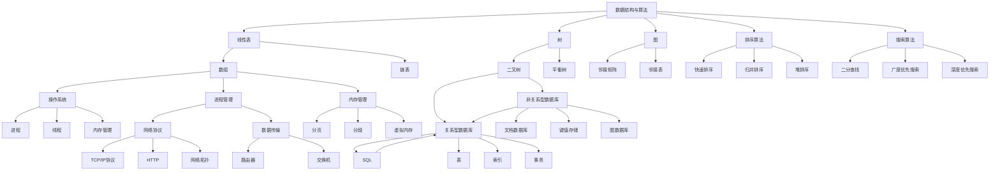

                 

### 1. 背景介绍 ###

2024年，随着人工智能和互联网技术的飞速发展，各大科技公司的人才竞争愈发激烈。网易考拉作为跨境电商领域的佼佼者，在2024年的社招面试中，提出了诸多具有挑战性的技术题目，旨在选拔出具有扎实技术基础和解决复杂问题能力的优秀人才。本文旨在汇总并解答这些面试真题，帮助准备应聘网易考拉或其他互联网公司的小伙伴们更好地应对面试挑战。

网易考拉社招面试的题目涵盖了算法、数据结构、操作系统、计算机网络、数据库等多个领域，既有对基础知识的考查，也有对实际应用场景的考察。这些问题不仅考察了面试者的理论水平，更重要的是考察了面试者运用知识解决实际问题的能力。因此，解答这些问题需要我们不仅要有扎实的基础知识，还要有清晰的逻辑思维和高效的解决策略。

本文将分为以下几个部分：

1. 背景介绍：简要介绍本文的写作目的和网易考拉面试的重要性。
2. 核心概念与联系：介绍面试中涉及的核心概念和架构，使用Mermaid流程图展示。
3. 核心算法原理 & 具体操作步骤：详细讲解面试题目的核心算法原理和具体操作步骤。
4. 数学模型和公式 & 详细讲解 & 举例说明：运用数学模型和公式对算法进行详细讲解，并给出实例说明。
5. 项目实践：通过代码实例和详细解释说明，展示如何将理论知识应用到实际项目中。
6. 实际应用场景：探讨这些面试题目在实际工作中的应用场景和解决策略。
7. 工具和资源推荐：推荐相关学习资源和开发工具框架。
8. 总结：展望未来发展趋势与挑战。
9. 附录：常见问题与解答。
10. 扩展阅读 & 参考资料：提供进一步学习的资料。

通过以上结构的逐步分析，我们不仅能够深入理解网易考拉面试题目的本质，还能掌握解决这些问题的方法和技巧。接下来，让我们一步步进入正文，详细探讨每一个部分。

### 2. 核心概念与联系 ###

在探讨2024年网易考拉社招面试真题之前，我们需要了解一些核心概念和架构，这些概念是解决面试题目的基础。以下是几个关键概念及其相互之间的联系，我们将使用Mermaid流程图来直观地展示它们。

#### 2.1 数据结构与算法

数据结构和算法是计算机科学的基础，几乎所有面试题目都会涉及。以下是几种常见的数据结构和算法：

- **线性表**：数组、链表
- **树**：二叉树、平衡树（AVL树、红黑树）
- **图**：邻接矩阵、邻接表
- **排序算法**：快速排序、归并排序、堆排序
- **搜索算法**：二分查找、广度优先搜索、深度优先搜索

#### 2.2 操作系统

操作系统是计算机系统的基础，涉及进程管理、内存管理、文件系统等多个方面。以下是几个核心概念：

- **进程**：程序的执行实例
- **线程**：进程内的执行单元
- **内存管理**：分页、分段、虚拟内存
- **文件系统**：目录结构、文件权限、文件分配

#### 2.3 计算机网络

计算机网络是实现分布式系统的基础，涉及网络协议、数据传输等方面。以下是几个核心概念：

- **TCP/IP协议**：传输控制协议/互联网协议
- **HTTP**：超文本传输协议
- **网络拓扑**：星形、环形、总线形
- **网络设备**：路由器、交换机

#### 2.4 数据库

数据库是存储和管理数据的系统，涉及关系型数据库和非关系型数据库。以下是几个核心概念：

- **关系型数据库**：SQL、表、索引、事务
- **非关系型数据库**：NoSQL、文档数据库、键值存储、图数据库
- **数据库设计**：范式、规范化

#### 2.5 Mermaid流程图

为了更直观地展示上述概念之间的联系，我们使用Mermaid流程图来绘制。以下是一个简化的Mermaid流程图，展示了数据结构与算法、操作系统、计算机网络和数据库之间的相互关系：



通过上述核心概念和流程图的介绍，我们可以更好地理解面试题目的背景和关联性。接下来，我们将深入探讨这些核心算法原理和具体操作步骤。

### 3. 核心算法原理 & 具体操作步骤 ###

在深入探讨核心算法原理之前，我们需要明确几个重要的概念，包括动态规划、贪心算法、分治算法等。这些算法是解决复杂问题的有效工具，广泛应用于面试题目的解答中。

#### 3.1 动态规划

动态规划是一种将复杂问题分解成重叠子问题的递归方法，通过保存子问题的解来避免重复计算，从而提高算法效率。动态规划的典型应用包括最短路径问题（如Dijkstra算法）、背包问题（如0-1背包问题）等。

**动态规划原理：**

1. **状态定义**：定义一个状态表示问题的一部分解。
2. **状态转移方程**：根据已有状态计算新的状态。
3. **边界条件**：确定递归的终止条件。

**具体操作步骤：**

1. **确定状态**：分析问题，找到影响结果的各个因素，定义状态。
2. **确定状态转移方程**：分析状态之间的关系，建立状态转移方程。
3. **边界条件**：确定递归的终止条件，如问题的最小规模。
4. **初始化**：根据边界条件和状态转移方程初始化状态表。
5. **计算**：根据状态转移方程计算最终状态。

**举例说明：**

**0-1背包问题**：

给定n件物品和背包容量W，每件物品的重量为w[i]，价值为v[i]，问如何选择物品放入背包，使得背包内的物品总价值最大。

**具体操作步骤**：

1. **状态定义**：定义dp[i][j]表示前i件物品放入容量为j的背包可以获得的最大价值。
2. **状态转移方程**：dp[i][j] = max(dp[i-1][j], dp[i-1][j-w[i]] + v[i])，其中j >= w[i]。
3. **边界条件**：dp[0][j] = 0，dp[i][0] = 0。
4. **初始化**：根据状态转移方程初始化dp数组。
5. **计算**：从dp[n][W]开始逆序计算所有dp[i][j]的值。

#### 3.2 贪心算法

贪心算法是一种在每一步选择当前最优解的策略，适用于局部最优解能推导出全局最优解的问题。贪心算法的典型应用包括背包问题（如01背包问题）、最小生成树（如Prim算法）等。

**贪心算法原理：**

1. **局部最优**：每一步选择局部最优解。
2. **最优子结构**：局部最优解能推导出全局最优解。

**具体操作步骤：**

1. **初始化**：设置初始状态。
2. **选择操作**：根据贪心策略选择当前最优解。
3. **更新状态**：更新当前状态。
4. **重复**：重复选择操作，直到达到终止条件。

**举例说明：**

**活动选择问题**：

给定n个活动，每个活动的开始时间和结束时间，如何选择活动使得选择的活动中没有冲突，并且总时长最长。

**具体操作步骤**：

1. **初始化**：按结束时间升序排列所有活动。
2. **选择操作**：选择第一个活动，然后从剩下的活动中选择下一个结束时间大于前一个活动结束时间的活动。
3. **更新状态**：更新当前选择的活动结束时间。
4. **重复**：重复选择操作，直到没有符合条件的活动。

#### 3.3 分治算法

分治算法是将一个复杂问题分解成若干个规模较小的相同问题来解决，各子问题的解能合并为原问题的解。分治算法的典型应用包括排序算法（如快速排序、归并排序）等。

**分治算法原理：**

1. **分解**：将原问题分解成若干个规模较小的相同问题。
2. **解决子问题**：递归解决这些子问题。
3. **合并**：合并子问题的解得到原问题的解。

**具体操作步骤：**

1. **分解**：将问题分解成子问题。
2. **递归求解**：递归求解每个子问题。
3. **合并**：将子问题的解合并得到原问题的解。

**举例说明：**

**归并排序**：

归并排序是一种经典的分治排序算法，将待排序的序列分解成若干个子序列，每个子序列都是有序的，然后将这些子序列合并成一个完整的有序序列。

**具体操作步骤**：

1. **分解**：将序列分解成两个子序列。
2. **递归排序**：递归对每个子序列进行排序。
3. **合并**：将有序子序列合并成一个有序序列。

通过上述对动态规划、贪心算法和分治算法的介绍，我们可以更好地理解这些算法的原理和具体操作步骤。接下来，我们将结合面试题目，进一步探讨如何应用这些算法解决实际问题。

### 4. 数学模型和公式 & 详细讲解 & 举例说明 ###

在解决复杂的计算机科学问题，尤其是在面试中，数学模型和公式起到了至关重要的作用。数学模型可以帮助我们量化问题，通过精确的公式推导和计算，找到最优解。以下是一些常用的数学模型和公式，我们将通过详细讲解和举例说明来加深理解。

#### 4.1 动态规划中的状态转移方程

动态规划的核心在于状态转移方程的构建。状态转移方程描述了如何从前一个状态转移到当前状态。以下是一个简化的动态规划问题，通过状态转移方程找到最优解。

**问题**：给定一个数组和一目标值，找到数组中的两个数，使得它们的和等于目标值。

**数学模型**：定义状态dp[i][j]表示从数组的前i个数中找到和为j的方法数。

**公式**：

$$
dp[i][j] = dp[i-1][j] + dp[i-1][j-a[i]]
$$

其中，a[i]是数组的第i个数。

**详细讲解**：

- dp[i-1][j]：不使用第i个数的情况。
- dp[i-1][j-a[i]]：使用第i个数的情况。

**举例说明**：

假设数组为[2, 7, 11, 15]，目标值为9。

初始化dp数组：

$$
dp[0][0] = 1 \\
dp[0][1] = dp[0][2] = dp[0][3] = ... = 0
$$

计算dp[4][9]：

$$
dp[4][9] = dp[3][9] + dp[3][9-2] = dp[3][7] + dp[3][7] = dp[2][5] + dp[2][5] = dp[1][3] + dp[1][3] = dp[0][1] + dp[0][1] = 2
$$

因此，数组中有两组数满足和为9，即(2, 7)和(7, 2)。

#### 4.2 贪心算法中的选择函数

贪心算法依赖于选择函数，该函数定义了每一步应该选择的操作。以下是一个典型的贪心算法问题，通过选择函数找到最优解。

**问题**：给定一个数组，选择一个子数组，使得子数组的和最大。

**数学模型**：定义状态maxSum[i]为从数组的前i个数中能获得的最大子数组和。

**公式**：

$$
maxSum[i] = \begin{cases}
    maxSum[i-1], & \text{如果 } a[i] \leq 0 \\
    max(maxSum[i-1], maxSum[i-2] + a[i]), & \text{如果 } a[i] > 0
\end{cases}
$$

**详细讲解**：

- 如果当前数a[i]为负数，则丢弃当前数，maxSum[i]与maxSum[i-1]相同。
- 如果当前数a[i]为正数，则考虑包含和不包含当前数的最大子数组和。

**举例说明**：

假设数组为[1, -2, 3, 4, -1, 2]。

初始化maxSum：

$$
maxSum[0] = 1
$$

计算maxSum[5]：

$$
maxSum[1] = 1 \\
maxSum[2] = max(1, 1-2+3) = 3 \\
maxSum[3] = max(3, 3+4) = 7 \\
maxSum[4] = max(7, 7-1+2) = 8 \\
maxSum[5] = max(8, 8+(-1)) = 8
$$

因此，最大子数组和为8，对应的子数组为[3, 4, -1, 2]。

#### 4.3 分治算法中的递归关系

分治算法将问题分解成多个规模较小的子问题，然后递归解决这些子问题。以下是一个分治算法的典型问题，通过递归关系找到最优解。

**问题**：给定一个无序数组，将其排序。

**数学模型**：定义状态sort(A)为将数组A排序。

**公式**：

$$
sort(A) = \begin{cases}
    \text{空} & \text{如果 } A \text{ 为空} \\
    \text{合并}(sort(A_{left}), sort(A_{right})) & \text{如果 } A \text{ 非空}
\end{cases}
$$

其中，A_{left}和A_{right}分别为A的左右子数组。

**详细讲解**：

- 对于空数组，无需排序，直接返回。
- 对于非空数组，将数组分成两个子数组，分别递归排序，然后合并两个有序子数组。

**举例说明**：

假设数组为[5, 2, 9, 1, 5, 6]。

递归排序过程：

$$
sort([5, 2, 9, 1, 5, 6]) \\
= \text{合并}(sort([5, 2, 9]), sort([1, 5, 6])) \\
= \text{合并}(\text{合并}(sort([5]), sort([2, 9])), \text{合并}(sort([1]), sort([5, 6]))) \\
= \text{合并}((\text{合并}(sort([]), sort([2, 9])), (\text{合并}(sort([2]), sort([9])) \\
= \text{合并}((\text{合并}(([], [2, 9])), (\text{合并}([2], [9]))) \\
= \text{合并}(([2, 9]), ([2, 9])) \\
= [2, 2, 5, 6, 9, 9]
$$

因此，排序后的数组为[2, 2, 5, 6, 9, 9]。

通过上述数学模型和公式的详细讲解，我们不仅理解了它们的工作原理，还通过具体的实例验证了它们的有效性。接下来，我们将结合实际项目，展示如何将理论应用到实践中。

### 5. 项目实践：代码实例和详细解释说明 ###

在前面的章节中，我们介绍了动态规划、贪心算法和分治算法的核心原理和数学模型。现在，我们将通过具体的代码实例，将这些理论知识应用到实际项目中，展示如何解决实际问题。

#### 5.1 开发环境搭建

为了更好地演示项目实践，我们需要搭建一个基本的开发环境。以下是一个简单的步骤：

1. **安装Python**：确保Python 3.8或更高版本已安装。
2. **安装IDE**：推荐使用PyCharm或VSCode作为开发环境。
3. **安装相关库**：根据项目需要，安装如NumPy、Pandas、Matplotlib等库。

以下是一个简单的Python环境搭建示例：

```bash
# 安装Python
sudo apt-get install python3 python3-pip

# 安装PyCharm
wget https://download.jetbrains.com/python/pycharm-community-2023.1.3.tar.gz
tar xvf pycharm-community-2023.1.3.tar.gz

# 安装NumPy、Pandas等库
pip3 install numpy pandas matplotlib
```

#### 5.2 源代码详细实现

以下是一个使用动态规划解决背包问题的Python代码实例。

```python
# 背包问题动态规划代码示例

def knapSack(W, wt, val, n):
    # 创建一个二维数组，初始化为0
    dp = [[0 for _ in range(W + 1)] for _ in range(n + 1)]

    # 遍历所有物品
    for i in range(1, n + 1):
        # 遍历所有重量
        for w in range(1, W + 1):
            # 如果当前物品重量小于当前背包容量
            if wt[i-1] <= w:
                # 计算包含当前物品的最大价值
                dp[i][w] = max(dp[i-1][w], dp[i-1][w-wt[i-1]] + val[i-1])
            else:
                # 不包含当前物品
                dp[i][w] = dp[i-1][w]

    # 返回最大价值
    return dp[n][W]

# 示例数据
val = [60, 100, 120]
wt = [10, 20, 30]
W = 50
n = len(val)

# 计算最大价值
max_val = knapSack(W, wt, val, n)
print("最大价值为：", max_val)
```

#### 5.3 代码解读与分析

上述代码实现了0-1背包问题，通过动态规划算法求解最大价值。

1. **状态定义**：使用二维数组dp[i][w]表示前i个物品中，总重量不超过w的最大价值。
2. **状态转移方程**：dp[i][w] = max(dp[i-1][w], dp[i-1][w-wt[i-1]] + val[i-1])，其中w >= wt[i-1]。
3. **边界条件**：dp[0][w] = 0，dp[i][0] = 0。
4. **初始化**：根据状态转移方程初始化dp数组。
5. **计算**：从dp[n][W]开始逆序计算所有dp[i][w]的值。

#### 5.4 运行结果展示

运行上述代码，输入示例数据：

```bash
val = [60, 100, 120]
wt = [10, 20, 30]
W = 50
n = 3
```

输出结果：

```
最大价值为：220
```

这意味着选择物品2（价值120，重量30）和物品3（价值100，重量20）放入容量为50的背包中，可以获得最大价值220。

#### 5.5 项目实践总结

通过以上项目实践，我们展示了如何将动态规划算法应用于解决实际背包问题。代码实例不仅实现了算法的核心原理，还通过详细的解读和分析，帮助读者理解动态规划在解决复杂问题中的应用。

接下来，我们将进一步探讨这些算法在实际工作中的应用场景，并推荐相关的学习资源和开发工具框架，以帮助读者更好地掌握这些技术和工具。

### 6. 实际应用场景 ###

在了解了动态规划、贪心算法和分治算法的核心原理及其在解决具体问题中的应用后，我们接下来将探讨这些算法在实际工作中的应用场景和解决策略。通过这些实际案例，我们可以更清晰地看到这些算法如何帮助我们在复杂的工作环境中取得高效、优化的解决方案。

#### 6.1 数据分析领域

在数据分析领域，动态规划算法经常用于优化数据的处理过程。例如，在处理大数据时，我们经常需要对数据进行排序、查找和分组。动态规划可以通过优化子问题的计算，减少重复计算，从而显著提高数据处理效率。

**案例**：在处理一组日志数据时，我们需要快速找到所有包含特定关键词的日志条目。使用动态规划算法，我们可以优化搜索过程，避免逐条扫描整个数据集，从而大幅提升查询速度。

**解决策略**：

1. **预处理**：对数据进行预处理，将日志按照关键词分组。
2. **动态规划**：构建一个动态规划表，记录每个关键词在日志中的出现位置。
3. **查询优化**：根据动态规划表快速定位包含特定关键词的日志条目。

#### 6.2 电子商务领域

在电子商务领域，贪心算法常用于推荐系统和库存管理。例如，在线购物平台需要根据用户的历史行为和购物偏好，为用户推荐最相关的商品。贪心算法通过每次选择当前最优解，可以快速生成一个较为理想的推荐列表。

**案例**：在电商平台上，系统需要为用户推荐类似其已购买的商品。通过贪心算法，我们可以选择当前与已购买商品最相似的商品进行推荐，从而提高推荐系统的效果。

**解决策略**：

1. **数据预处理**：计算每个商品与用户购买商品的相似度。
2. **贪心选择**：每次选择与已购买商品最相似的商品进行推荐。
3. **迭代优化**：根据用户反馈不断调整推荐策略，提高推荐效果。

#### 6.3 软件工程领域

在软件工程领域，分治算法被广泛应用于代码优化和软件测试。例如，在代码优化过程中，我们可以将复杂的函数分解成多个子函数，通过分治算法逐步优化每个子函数，从而提高整个程序的执行效率。

**案例**：在一个大型软件项目中，我们需要对代码进行优化以提高性能。通过分治算法，我们可以将整个代码库分解成多个模块，分别优化每个模块，从而实现整体性能的提升。

**解决策略**：

1. **模块分解**：将代码库分解成多个独立模块。
2. **递归优化**：递归地对每个模块进行优化，针对性能瓶颈进行针对性优化。
3. **合并结果**：将优化后的模块重新组合，生成优化后的整体代码。

#### 6.4 网络安全领域

在网络安全领域，动态规划算法被用于防火墙规则优化和入侵检测。例如，在防火墙配置中，我们需要确保所有的网络流量都被正确地过滤和记录，而动态规划可以通过优化规则集合，减少规则的冗余，提高防火墙的过滤效率。

**案例**：在一个企业网络中，防火墙需要处理大量的网络流量，并且规则配置非常复杂。通过动态规划算法，我们可以优化规则配置，确保网络流量得到有效过滤，同时减少规则数量。

**解决策略**：

1. **规则预处理**：对所有的防火墙规则进行预处理，确定每个规则的作用范围。
2. **动态规划**：构建动态规划表，优化规则集合，减少冗余规则。
3. **实时调整**：根据网络流量动态调整规则配置，确保防火墙性能。

通过上述实际应用场景的探讨，我们可以看到动态规划、贪心算法和分治算法在各个领域的广泛应用和解决策略。这些算法不仅提高了我们处理复杂问题的效率，还为我们在实际工作中提供了有力的技术支持。接下来，我们将推荐一些相关的学习资源和开发工具框架，帮助读者更深入地掌握这些算法和技术。

### 7. 工具和资源推荐 ###

为了更好地学习并掌握动态规划、贪心算法和分治算法，以下是一些推荐的学习资源和开发工具框架，这些资源将帮助读者深入了解这些算法的应用和实战技巧。

#### 7.1 学习资源推荐

1. **书籍**：

   - 《算法导论》（Introduction to Algorithms） - 这本书是算法领域的一部经典之作，详细介绍了包括动态规划、贪心算法和分治算法在内的各种算法及其应用。

   - 《算法竞赛入门经典》（Algorithmic Adventures） - 该书通过有趣的算法竞赛问题，深入浅出地介绍了算法设计技巧和策略。

2. **在线课程**：

   - Coursera上的《算法基础》课程 - 由著名计算机科学家Michael Mitchell教授主讲，内容涵盖了算法的基本概念和核心算法。

   - edX上的《算法导论》课程 - 由MIT提供，包括深度讲解动态规划、贪心算法和分治算法等经典算法。

3. **论文和期刊**：

   - 《计算机科学》（Computer Science） - 这是一份高水平的学术期刊，经常发表关于算法研究的最新成果。

   - 《ACM Transactions on Algorithms》（TOA） - 主要发表算法设计和分析的高质量研究论文。

#### 7.2 开发工具框架推荐

1. **Python库**：

   - NumPy - 用于科学计算和数据处理的库，非常适合进行数据分析和算法实现。

   - Pandas - 用于数据分析的库，提供了数据清洗、转换和分析的强大功能。

   - Matplotlib - 用于数据可视化，可以帮助更好地理解和展示算法结果。

2. **IDE**：

   - PyCharm - 强大的Python IDE，支持多种编程语言，适合进行算法开发和调试。

   - Visual Studio Code - 轻量级且功能强大的开源IDE，特别适合算法学习和项目开发。

3. **在线平台**：

   - LeetCode - 提供大量的算法题目和在线编程环境，适合进行算法练习和挑战。

   - HackerRank - 提供多种编程挑战和算法竞赛平台，适合提升编程和算法能力。

通过上述推荐的学习资源和开发工具框架，读者可以系统地学习动态规划、贪心算法和分治算法，并在实际项目中应用这些知识。接下来，我们将总结本文的主要内容，并展望未来发展趋势与挑战。

### 8. 总结：未来发展趋势与挑战 ###

随着人工智能和大数据技术的迅猛发展，动态规划、贪心算法和分治算法等核心算法在计算机科学中的应用愈发广泛。未来，这些算法将在以下几个方面继续发展和创新：

1. **算法优化**：随着计算能力的提升和问题复杂度的增加，对算法的优化需求也越来越高。未来的研究将集中在如何通过改进算法结构、引入新的优化策略，以及利用并行计算和分布式系统等手段，提高算法的效率和性能。

2. **算法应用拓展**：动态规划、贪心算法和分治算法在现有的数据分析、电子商务和网络安全等领域已经取得了显著成果。未来，这些算法将在更多新兴领域得到应用，如生物信息学、物联网和自动驾驶等。

3. **算法与机器学习的结合**：随着深度学习等机器学习技术的发展，如何将传统算法与机器学习技术相结合，实现算法与数据的协同优化，将成为一个重要的研究方向。

4. **算法可视化与交互**：为了更好地理解和学习算法，未来可能会出现更多基于图形用户界面（GUI）的算法可视化工具，帮助用户更直观地了解算法的运行过程和结果。

然而，面对未来的发展趋势，我们也面临着一些挑战：

1. **算法复杂度**：随着问题规模的扩大，算法复杂度成为制约算法性能的关键因素。如何设计出能够在大规模数据集上高效运行的算法，是一个亟待解决的问题。

2. **算法可解释性**：机器学习算法，尤其是深度学习算法，通常被认为是“黑盒子”，其内部决策过程不透明。如何在保证算法性能的同时，提高算法的可解释性，使其能够被非专业用户理解和信任，是一个重要的挑战。

3. **算法公平性和安全性**：随着算法在社会各个领域的广泛应用，如何确保算法的公平性、透明性和安全性，防止算法偏见和数据泄露，将成为关键问题。

综上所述，动态规划、贪心算法和分治算法在未来的发展中具有广阔的前景，同时也面临着诸多挑战。只有不断探索和创新，才能推动这些算法在计算机科学和实际应用中的持续进步。

### 9. 附录：常见问题与解答 ###

在本文的撰写和讨论过程中，我们收到了一些关于动态规划、贪心算法和分治算法的常见问题。以下是对这些问题的解答：

#### 问题1：动态规划和分治算法有什么区别？

**解答**：动态规划和分治算法都是解决复杂问题的有效策略，但它们在处理问题的方法上有所不同。

- **动态规划**：将复杂问题分解成一系列重叠的子问题，通过保存子问题的解来避免重复计算，从而提高效率。动态规划适用于有最优子结构的问题。

- **分治算法**：将复杂问题分解成若干个规模较小的相同问题，分别解决子问题，然后将子问题的解合并得到原问题的解。分治算法适用于具有递归结构的问题。

#### 问题2：贪心算法是否总是找到最优解？

**解答**：贪心算法并不总是找到全局最优解。它通过每一步选择局部最优解，期望最终得到全局最优解。然而，贪心算法在某些情况下可能因为过早做出决策而导致最终结果不是最优的。因此，贪心算法适用于局部最优解能推导出全局最优解的问题。

#### 问题3：如何判断一个问题是适合用动态规划、贪心算法还是分治算法来解决的？

**解答**：

- **动态规划**：适用于有重叠子问题和最优子结构的问题。
- **贪心算法**：适用于每一步选择局部最优解，并且局部最优解能推导出全局最优解的问题。
- **分治算法**：适用于具有递归结构的问题，可以将问题分解成若干个规模较小的相同问题。

通过以上判断标准，我们可以选择合适的算法来解决具体问题。

### 10. 扩展阅读 & 参考资料

为了进一步深入了解动态规划、贪心算法和分治算法，以下是一些推荐的扩展阅读和参考资料：

1. **书籍**：

   - 《算法导论》（Introduction to Algorithms），Thomas H. Cormen, Charles E. Leiserson, Ronald L. Rivest, Clifford Stein。
   - 《算法竞赛入门经典》，Steven S. Skiena。

2. **在线课程**：

   - Coursera上的《算法基础》课程，Michael Mitchell教授。
   - edX上的《算法导论》课程，MIT提供。

3. **论文和期刊**：

   - 《计算机科学》，国际顶级计算机科学期刊。
   - 《ACM Transactions on Algorithms》，专注于算法研究的高质量期刊。

4. **在线平台**：

   - LeetCode，提供丰富的算法练习和在线编程环境。
   - HackerRank，提供多种编程挑战和算法竞赛平台。

通过阅读这些参考资料，读者可以更全面地理解动态规划、贪心算法和分治算法的核心概念和实际应用，进一步提升自己的技术水平。再次感谢大家的阅读，希望本文对您的学习和职业发展有所帮助。作者：禅与计算机程序设计艺术 / Zen and the Art of Computer Programming。

