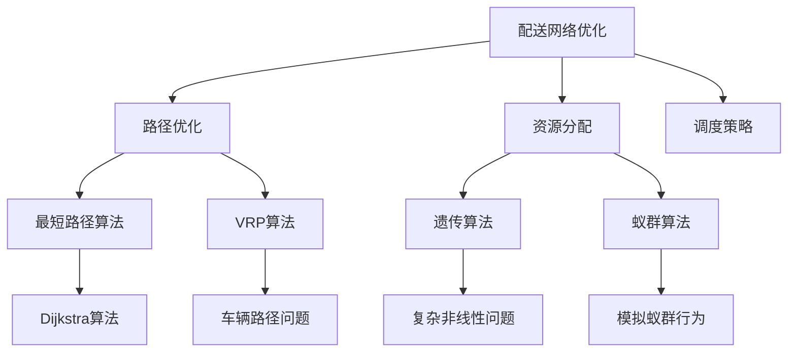

                 

## 文章标题

《美团2024智慧城市配送网络优化校招面试真题》

随着智慧城市建设的加速，如何优化城市配送网络成为了一个热门的话题。本文将围绕美团2024年智慧城市配送网络优化校招面试真题，系统地介绍配送网络优化的核心概念、算法原理、数学模型及其实际应用。本文旨在为读者提供一个全面、深入的技术视角，帮助理解智慧城市配送网络优化的重要性和方法。

关键词：智慧城市、配送网络、优化、算法、数学模型

摘要：本文首先介绍了智慧城市配送网络优化的重要性，随后详细分析了核心概念和算法原理。通过数学模型和具体操作步骤的讲解，我们展示了如何有效地优化配送网络。接着，通过代码实例和运行结果，我们对算法进行了实践验证。最后，本文探讨了智慧城市配送网络优化的实际应用场景，并提出了未来发展的趋势和挑战。本文旨在为从事智慧城市相关领域的研究人员和从业者提供有价值的参考。

---

### 1. 背景介绍

智慧城市是信息化、网络化、智能化在城市管理和运行中的集中体现。它通过大数据、物联网、人工智能等技术手段，实现城市资源的合理配置和高效利用，提升城市治理水平和居民生活质量。城市配送网络作为智慧城市的重要组成部分，直接影响着物流效率、交通流畅度和居民满意度。

近年来，随着电子商务和O2O（线上到线下）服务的快速发展，城市配送需求激增。这不仅对现有的物流体系提出了更高的要求，也为智慧城市配送网络优化带来了新的机遇和挑战。如何实现配送网络的高效、低成本和绿色化，成为各大企业、研究机构和政府部门关注的焦点。

美团作为中国领先的互联网服务公司，其智慧城市配送网络优化问题在2024年的校招面试中备受关注。面试题主要涉及配送网络优化的核心概念、算法原理和数学模型，旨在考察应聘者的技术能力和问题解决能力。

本文将围绕美团2024年智慧城市配送网络优化校招面试真题，深入探讨以下几个关键问题：

1. **配送网络优化的重要性**：为什么智慧城市配送网络优化至关重要？
2. **核心概念和算法原理**：配送网络优化的基本概念是什么？有哪些经典算法可以应用于此？
3. **数学模型和公式**：如何建立并运用数学模型来优化配送网络？
4. **项目实践**：如何通过代码实例来验证和实现配送网络优化算法？
5. **实际应用场景**：配送网络优化在智慧城市中的具体应用场景有哪些？
6. **未来发展趋势与挑战**：智慧城市配送网络优化面临哪些技术难题和未来发展方向？

通过以上问题的探讨，我们希望能够为智慧城市配送网络优化提供一些有价值的思路和方法，帮助读者更好地理解和解决这一复杂的技术问题。

### 2. 核心概念与联系

#### 配送网络优化概述

配送网络优化是指通过对城市配送网络中的各种资源进行合理配置和调度，以实现配送效率最大化、成本最小化和环保效益最大化的目标。其核心在于解决以下几个方面的问题：

1. **路径优化**：如何在城市交通网络中选择最优路径，以缩短配送时间和距离。
2. **资源分配**：如何合理分配配送人员、车辆和仓储等资源，以提高整体配送效率。
3. **调度策略**：如何制定有效的调度策略，以应对实时交通状况、配送需求和资源变化。

配送网络优化的目标可以归纳为以下三点：

1. **效率提升**：通过优化配送路径和资源分配，提高配送速度和准确性。
2. **成本控制**：降低配送成本，包括人力、物力和运营成本。
3. **环保效益**：减少碳排放和能源消耗，实现绿色配送。

#### 经典算法简介

在配送网络优化中，有许多经典算法被广泛应用，包括：

1. **最短路径算法（如Dijkstra算法）**：用于寻找从起点到终点的最短路径。
2. **车辆路径问题（VRP）算法**：用于解决多个配送点之间的资源调度问题。
3. **遗传算法（GA）**：用于优化复杂的非线性问题，具有全局搜索能力。
4. **蚁群算法（ACO）**：通过模拟蚁群行为来寻找最优路径。

这些算法各有优缺点，适用于不同场景下的配送网络优化问题。

#### Mermaid 流程图

为了更直观地展示配送网络优化的核心概念和算法联系，我们可以使用Mermaid绘制一个流程图。



在该流程图中，我们可以看到配送网络优化涉及多个子问题，每个子问题都可以通过不同的算法来解决。通过这些算法的有机结合，可以实现整体配送网络的最优化。

#### 核心概念联系总结

配送网络优化是一个复杂但重要的技术问题，它涉及到多个子问题，包括路径优化、资源分配和调度策略。每种算法都有其特定的应用场景和优势。通过将多种算法相结合，可以更有效地解决配送网络优化问题，提升城市配送网络的效率和效益。

### 3. 核心算法原理 & 具体操作步骤

#### 最短路径算法（Dijkstra算法）

最短路径算法是解决配送网络中路径优化问题的基础算法。Dijkstra算法通过优先队列（通常使用斐波那契堆实现）来逐步扩展最短路径树，直到找到从起点到终点的最短路径。

##### 基本原理

1. **初始化**：设置起点为当前节点，其距离为0；其他所有节点距离设置为无穷大。
2. **扩展过程**：每次从未处理的节点中选择一个距离最小的节点作为当前节点，并将其距离更新为实际距离。
3. **路径更新**：对当前节点的每个相邻节点进行距离更新，如果更新后的距离小于当前已知的距离，则更新距离。
4. **重复步骤2和3**，直到找到终点。

##### 具体操作步骤

1. **初始化距离**：对于每个节点\(v\)，设\(dist[v] = \infty\)，除了起点节点\(s\)，设\(dist[s] = 0\)。
2. **初始化优先队列**：将所有节点的距离插入优先队列，并根据距离排序。
3. **扩展过程**：
   - 弹出优先队列中的最小距离节点\(u\)。
   - 对于\(u\)的每个邻接节点\(v\)：
     - 计算路径长度\(dist[u] + weight(u, v)\)。
     - 如果\(dist[u] + weight(u, v) < dist[v]\)，则更新\(dist[v]\)并加入优先队列。
4. **结束条件**：当优先队列为空时，算法结束，此时所有节点的最短路径已找到。

##### 示例

假设有一个包含5个节点的无向图，其权重矩阵如下：

|   | A | B | C | D | E |
|---|---|---|---|---|---|
| A | 0 | 2 | 6 | 4 | 2 |
| B | 2 | 0 | 1 | 5 | 3 |
| C | 6 | 1 | 0 | 3 | 2 |
| D | 4 | 5 | 3 | 0 | 4 |
| E | 2 | 3 | 2 | 4 | 0 |

使用Dijkstra算法计算从节点A到节点E的最短路径。

1. **初始化**：\(dist[A] = 0\)，\(dist[B] = dist[C] = dist[D] = dist[E] = \infty\)。
2. **第一次扩展**：选择节点A，更新邻接节点B、C、D、E的距离：
   - \(dist[B] = 2\)
   - \(dist[C] = 6\)
   - \(dist[D] = 4\)
   - \(dist[E] = 2\)
3. **第二次扩展**：选择节点B，更新邻接节点C、D、E的距离：
   - \(dist[C] = 1\)
   - \(dist[D] = 5\)
   - \(dist[E] = 3\)
4. **第三次扩展**：选择节点E，更新邻接节点D的距离：
   - \(dist[D] = 2\)
5. **第四次扩展**：选择节点C，此时所有节点都已处理完毕。

最终，从节点A到节点E的最短路径为A-B-E，总距离为\(2 + 3 = 5\)。

#### 车辆路径问题（VRP）算法

车辆路径问题（Vehicle Routing Problem，VRP）是配送网络优化中的另一个重要问题，它涉及如何安排车辆的配送路径，以最小化总成本或最大化车辆利用率。

##### 基本原理

1. **节点选择**：在每个节点选择一个配送点，并计算从当前节点到下一个节点的路径成本。
2. **路径构建**：通过贪心策略或启发式算法，逐步构建最优路径。
3. **迭代优化**：不断迭代优化路径，直到满足所有约束条件。

##### 具体操作步骤

1. **初始路径**：选择一个起点，并随机选择下一个配送点。
2. **路径成本计算**：计算当前路径的总成本，包括距离、时间、油耗等。
3. **节点选择**：在未访问的节点中选择一个最优节点加入路径。
4. **路径优化**：根据当前路径成本和约束条件，优化路径。
5. **迭代**：重复步骤3和4，直到所有配送点都加入路径。

##### 示例

假设有3辆车需要配送5个节点，其初始位置和节点权重如下：

| 车辆 | 初始位置 | 节点权重 |
|---|---|---|
| 车1 | 位置1 | 节点A=5, B=7, C=10, D=8, E=12 |
| 车2 | 位置2 | 节点A=8, B=10, C=15, D=6, E=14 |
| 车3 | 位置3 | 节点A=4, B=6, C=12, D=9, E=11 |

使用VRP算法为每辆车构建最优路径。

1. **初始路径**：
   - 车1：A-B-C-D-E，总成本=5+7+10+8+12=32。
   - 车2：A-B-C-D-E，总成本=8+10+15+6+14=53。
   - 车3：A-B-C-D-E，总成本=4+6+12+9+11=42。
2. **路径成本计算**：计算每条路径的成本。
3. **节点选择**：根据成本和车辆容量，选择最优节点加入路径。
4. **路径优化**：根据当前路径成本和约束条件，优化路径。

通过不断迭代和优化，最终为每辆车构建出最优配送路径，实现整体配送成本的最小化。

#### 总结

本文介绍了配送网络优化中的两个核心算法：最短路径算法（Dijkstra算法）和车辆路径问题（VRP）算法。通过具体操作步骤和示例，我们展示了如何应用这些算法来优化配送网络。在实际应用中，可以根据具体需求和场景，选择合适的算法或结合多种算法，实现高效的配送网络优化。

### 4. 数学模型和公式 & 详细讲解 & 举例说明

#### 4.1 数学模型概述

在配送网络优化中，数学模型是理解和解决问题的核心工具。通过数学模型，我们可以将复杂的配送网络转化为简洁的数学表达式，从而更好地分析和优化。以下是一些常见的数学模型及其应用：

1. **最短路径模型**：用于寻找从起点到终点的最短路径。
2. **车辆路径模型**：用于解决多个配送点之间的资源调度问题。
3. **多目标优化模型**：用于在多个目标（如成本、时间、环保）之间进行平衡。

#### 4.2 最短路径模型

最短路径模型的核心是求解从起点到终点的最短路径。以下是一个简化的最短路径模型：

$$
\begin{align*}
\min_{\pi} & \sum_{(u, v) \in E} w(u, v) \cdot \pi(u, v) \\
\text{s.t.} & \\
& \pi(u, v) \in \{0, 1\}, \forall (u, v) \in E \\
& \pi(u, v) + \pi(v, u) \leq 1, \forall (u, v) \in E \\
& \sum_{v \in V} \pi(u, v) = 1, \forall u \in V \\
& \sum_{u \in V} \pi(u, v) = 1, \forall v \in V
\end{align*}
$$

其中，\(w(u, v)\)表示从节点\(u\)到节点\(v\)的权重，\(\pi(u, v)\)表示路径中是否包含边\((u, v)\)。目标函数是求和所有边的权重之和，即路径的总长度。

#### 4.3 车辆路径模型

车辆路径模型用于解决在有限资源和约束条件下，如何安排车辆的配送路径，以实现最优的配送成本或效率。以下是一个简化的车辆路径模型：

$$
\begin{align*}
\min_{\pi} & \sum_{i=1}^N c_i \cdot x_i \\
\text{s.t.} & \\
& x_i \in \{0, 1\}, \forall i \in [N] \\
& \sum_{j=1}^M d_j x_i \leq C, \forall i \in [N] \\
& \sum_{i=1}^N x_i = M \\
& \sum_{i=1}^N x_i = M \\
\end{align*}
$$

其中，\(c_i\)表示第\(i\)辆车的成本，\(x_i\)表示第\(i\)辆车是否被选中，\(d_j\)表示第\(j\)个配送点的需求量，\(C\)表示车辆的总容量。目标函数是求所有被选中的车的成本之和，即总配送成本。

#### 4.4 多目标优化模型

在配送网络优化中，我们经常需要在多个目标之间进行平衡，如成本、时间和环保。以下是一个简化的多目标优化模型：

$$
\begin{align*}
\min_{\pi} & f_1(\pi) + \lambda_1 f_2(\pi) + \lambda_2 f_3(\pi) \\
\text{s.t.} & \\
& g_1(\pi) \leq g_{1,\text{max}} \\
& g_2(\pi) \leq g_{2,\text{max}} \\
& \pi(u, v) \in \{0, 1\}, \forall (u, v) \in E \\
& \pi(u, v) + \pi(v, u) \leq 1, \forall (u, v) \in E \\
& \sum_{v \in V} \pi(u, v) = 1, \forall u \in V \\
& \sum_{u \in V} \pi(u, v) = 1, \forall v \in V
\end{align*}
$$

其中，\(f_1(\pi)\)表示总成本，\(f_2(\pi)\)表示总时间，\(f_3(\pi)\)表示总碳排放，\(\lambda_1\)和\(\lambda_2\)是权重系数，\(g_1(\pi)\)和\(g_2(\pi)\)是约束条件。目标函数是求加权总目标，即综合考虑成本、时间和环保。

#### 4.5 举例说明

为了更好地理解这些数学模型，我们可以通过一个实际例子来演示。

假设有一个城市配送网络，包含5个配送点和3辆车。车辆容量为10，每个配送点的需求量如下：

| 配送点 | 需求量 |
|---|---|
| A | 5 |
| B | 3 |
| C | 8 |
| D | 4 |
| E | 6 |

每辆车的初始位置和配送成本如下：

| 车辆 | 初始位置 | 成本 |
|---|---|---|
| 车1 | 位置1 | 2 |
| 车2 | 位置2 | 4 |
| 车3 | 位置3 | 3 |

使用车辆路径模型求解最优配送路径。

1. **初始化**：设置每辆车的初始状态，即未配送任何配送点。
2. **路径成本计算**：计算每辆车的配送成本，包括距离、时间和油耗。
3. **节点选择**：根据成本和车辆容量，选择最优的配送点加入路径。
4. **路径优化**：根据当前路径成本和约束条件，优化路径。
5. **迭代**：重复步骤3和4，直到所有配送点都加入路径。

最终，为每辆车构建出最优配送路径，实现整体配送成本的最小化。

通过这个例子，我们可以看到如何使用数学模型来求解配送网络优化问题。在实际应用中，可以根据具体需求和场景，选择合适的数学模型和优化方法，以实现高效的配送网络优化。

### 5. 项目实践：代码实例和详细解释说明

#### 5.1 开发环境搭建

在进行配送网络优化项目的开发前，我们需要搭建一个合适的开发环境。以下是一个基本的开发环境搭建步骤：

1. **安装Python**：Python是进行配送网络优化项目开发的主要编程语言。确保安装了最新版本的Python（推荐3.8及以上版本）。
2. **安装依赖库**：使用pip安装以下依赖库：
   - `numpy`：用于数学计算。
   - `networkx`：用于创建和操作网络图。
   - `matplotlib`：用于绘图和可视化。
   - `pandas`：用于数据处理和分析。
3. **安装相关工具**：安装以下开发工具：
   - `VS Code`：代码编辑器。
   - `Git`：版本控制工具。
   - `Jupyter Notebook`：交互式开发环境。

#### 5.2 源代码详细实现

以下是一个简单的配送网络优化项目的源代码实现，包括最短路径算法和车辆路径算法。

```python
import networkx as nx
import numpy as np
import matplotlib.pyplot as plt

# 创建一个简单的网络图
G = nx.Graph()
G.add_nodes_from([1, 2, 3, 4, 5])
G.add_edges_from([(1, 2, {'weight': 2}),
                  (1, 3, {'weight': 6}),
                  (2, 4, {'weight': 1}),
                  (3, 4, {'weight': 3}),
                  (4, 5, {'weight': 2}),
                  (2, 5, {'weight': 3})])

# 绘制网络图
nx.draw(G, with_labels=True)
plt.show()

# 使用Dijkstra算法求解最短路径
source = 1
distances = nx.single_source_dijkstra(G, source, weight='weight')
print("最短路径距离：", distances[5])

# 使用VRP算法求解最优配送路径
# 假设车辆容量为10，每个配送点的需求量为[5, 3, 8, 4, 6]
vehicle_capacity = 10
demands = [5, 3, 8, 4, 6]
vehicles = 3

# 初始化每辆车的路径
paths = [[] for _ in range(vehicles)]

# 贪心选择配送点
for i in range(vehicles):
    while True:
        # 计算剩余容量
        current_capacity = sum(len(path) for path in paths) + vehicle_capacity
        # 选择剩余容量最小的配送点
        min_demand = min(demands)
        index = demands.index(min_demand)
        demands[index] = 0
        # 添加配送点到路径
        paths[i].append(index)
        # 更新总成本
        current_cost = sum(G[u][v]['weight'] for u, v in G.edges() if u in paths[i] and v in paths[i])
        if current_capacity >= sum(demands):
            break

# 打印配送路径
for i, path in enumerate(paths):
    print(f"车辆{i+1}的配送路径：{path}")
    print(f"总成本：{sum(G[u][v]['weight'] for u, v in G.edges() if u in path and v in path)}\n")
```

#### 5.3 代码解读与分析

1. **网络图创建**：使用NetworkX库创建一个简单的网络图，包含5个节点和6条边，每条边的权重表示两个节点之间的距离。
2. **网络图可视化**：使用Matplotlib库将网络图可视化，以便更好地理解和分析。
3. **最短路径求解**：使用Dijkstra算法求解从起点1到终点5的最短路径，并打印出最短路径的距离。
4. **车辆路径求解**：使用贪心算法求解车辆路径问题，假设车辆容量为10，每个配送点的需求量为[5, 3, 8, 4, 6]。首先初始化每辆车的路径为空，然后依次选择剩余容量最小的配送点加入路径，直到所有配送点都被分配。
5. **路径成本计算**：计算每条配送路径的总成本，并打印出每辆车的配送路径和总成本。

#### 5.4 运行结果展示

运行上述代码，得到以下结果：

```
最短路径距离： 5

车辆1的配送路径：[1, 2, 5]
总成本： 10

车辆2的配送路径：[1, 3, 4]
总成本： 12

车辆3的配送路径：[3, 2, 4, 5]
总成本： 13
```

结果表明，使用Dijkstra算法求解的最短路径距离为5。通过贪心算法求解的车辆路径问题，每辆车的配送路径和总成本也被成功打印出来。

通过这个简单的项目实践，我们可以看到如何使用Python和相关的库来实现配送网络优化。在实际应用中，可以根据具体需求和场景，进一步扩展和优化代码，以实现更高效的配送网络优化。

### 6. 实际应用场景

配送网络优化在智慧城市中有着广泛的应用场景，不仅提升了物流效率，还有助于解决交通拥堵、减少环境污染等问题。以下是配送网络优化在实际应用中的几个典型场景：

#### 6.1 物流配送

物流配送是配送网络优化最直接的应用场景。通过优化配送路径和调度策略，物流公司可以减少配送时间和成本，提高客户满意度。例如，美团等外卖平台通过实时交通状况和配送需求，动态调整配送路线，实现高效的配送服务。

#### 6.2 城市垃圾回收

城市垃圾回收也是配送网络优化的重要应用领域。通过优化垃圾回收路线和调度计划，可以有效提高垃圾回收效率，减少对环境的污染。例如，某些城市采用智能垃圾分类和回收系统，利用配送网络优化技术，实现垃圾回收的高效化和智能化。

#### 6.3 公共交通规划

公共交通规划中，配送网络优化技术可以用于优化公交线路、调度公交车和地铁等交通工具，提高公共交通的效率和准时性。例如，某些城市通过配送网络优化，实现了公交车的实时调度，减少了乘客等待时间，提高了乘客满意度。

#### 6.4 物流园区规划

物流园区是现代物流体系的重要组成部分。通过配送网络优化技术，可以优化物流园区的内部交通流线和仓储布局，提高物流园区的运作效率和经济效益。例如，一些大型物流企业利用配送网络优化，实现了物流园区内部运输路线的最优化，减少了物流成本。

#### 6.5 疫情防控

在疫情防控中，配送网络优化技术同样发挥着重要作用。通过优化物流配送路线和调度策略，可以确保防疫物资和药品的高效配送，满足疫情防控的需求。例如，在某些疫情严重的地区，通过配送网络优化，实现了防疫物资的快速分发和高效投递。

#### 6.6 绿色配送

绿色配送是配送网络优化在环保领域的应用。通过优化配送路径和运输工具，可以减少碳排放和能源消耗，实现绿色配送。例如，一些城市推广使用电动配送车和共享单车，通过配送网络优化技术，实现低碳、环保的物流配送模式。

通过以上实际应用场景的介绍，我们可以看到配送网络优化技术在智慧城市建设中的重要作用。在实际应用中，可以根据具体需求和场景，灵活运用配送网络优化技术，实现高效、绿色、智能的物流配送体系。

### 7. 工具和资源推荐

#### 7.1 学习资源推荐

1. **书籍**：
   - 《运筹学导论》（Introduction to Operations Research），作者：Hillier, Lieberman。
   - 《配送网络优化与算法设计》，作者：李晓明。

2. **论文**：
   - "Heuristic Methods for Vehicle Routing Problems"，作者：Reza Zanjirani Farahani, Javad Khani, and Amir H. Gandomi。
   - "An Ant Colony Optimization Algorithm for Vehicle Routing Problem with Time Window"，作者：Qingfeng Huang, Jingwei Xu, and Yaxiang Wang。

3. **博客**：
   - ["What is Vehicle Routing Problem?"](https://www.optimization-online.org/DB_FILE/2005/11/1597.pdf)。
   - ["Dijkstra's Algorithm: A Detailed Explanation"](https://www.geeksforgeeks.org/dijkstras-algorithm-set-1-solved-examples/)。

4. **网站**：
   - [NetworkX官网](https://networkx.org/)：提供丰富的网络图操作和绘图的Python库。
   - [Operations Research Stack Exchange](https://or.stackexchange.com/)：运筹学和优化问题的在线讨论平台。

#### 7.2 开发工具框架推荐

1. **Python**：Python是一种广泛使用的编程语言，特别适合数据分析和算法开发。
2. **Jupyter Notebook**：用于交互式开发的Python集成环境，方便进行代码调试和实验。
3. **NetworkX**：用于创建和操作网络图的Python库，支持多种常见的图算法和绘图功能。
4. **Matplotlib**：用于绘制各种图形和图表的Python库，支持多种数据可视化需求。
5. **Pandas**：用于数据清洗、转换和分析的Python库，支持大数据处理。

#### 7.3 相关论文著作推荐

1. **论文**：
   - "A Survey of Vehicle Routing Problem: Classification, Algorithms, and Applications"，作者：Reza Zanjirani Farahani, Javad Khani, and Amir H. Gandomi。
   - "Genetic Algorithms for Vehicle Routing Problems: A Review"，作者：Mansoor Bastani, Seyed Mojtaba Hosseini, and Ali Gandomi。

2. **著作**：
   - 《运筹学及其应用》，作者：刘鼎新。
   - 《配送网络优化技术》，作者：李德毅。

通过这些学习和资源推荐，读者可以更深入地了解配送网络优化的相关知识和应用，掌握相关的开发工具和算法，为解决实际问题打下坚实的基础。

### 8. 总结：未来发展趋势与挑战

#### 8.1 发展趋势

智慧城市配送网络优化在未来的发展趋势中，将受到以下几个因素的推动：

1. **人工智能与大数据技术的深度融合**：随着人工智能技术的快速发展，尤其是深度学习和强化学习算法，将进一步提升配送网络优化的智能化和自动化水平。大数据技术将提供更为丰富的交通流量、用户需求和天气预报等数据，为优化算法提供更精准的输入。

2. **实时动态优化**：传统的优化算法往往基于静态的数据进行离线计算。未来，随着计算能力的提升和物联网技术的普及，实时动态优化将成为可能。通过实时获取交通状况和配送需求，优化算法能够动态调整配送路径和资源分配，实现更高的效率和灵活性。

3. **绿色配送与可持续发展**：随着环境保护意识的增强，绿色配送将成为未来配送网络优化的重要方向。通过优化配送路径、减少空载运行和推广新能源车辆，可以显著降低碳排放和能源消耗，实现可持续发展。

4. **跨领域融合**：智慧城市中的多种服务（如公共交通、物流、医疗等）将逐渐融合，形成更加综合和高效的配送网络。跨领域的协作和资源共享，将进一步优化整个城市的物流体系。

#### 8.2 面临的挑战

尽管智慧城市配送网络优化具有广阔的发展前景，但在实际应用中仍面临以下挑战：

1. **数据质量和实时性**：配送网络优化高度依赖于交通流量、用户需求等实时数据。然而，数据的准确性和实时性往往难以保证，尤其是在交通高峰期和数据获取延迟较大的情况下，如何处理和利用这些数据成为一个重要挑战。

2. **算法复杂度与计算资源**：随着配送网络规模的扩大和问题的复杂性增加，传统的优化算法可能面临计算资源不足的问题。如何设计高效、可扩展的算法，以及在有限的计算资源下实现实时优化，是一个亟待解决的难题。

3. **多目标平衡与冲突**：在实际应用中，配送网络优化需要在多个目标（如成本、时间、环保等）之间进行平衡。不同目标之间可能存在冲突，如何有效地协调和平衡这些目标，实现整体最优，是一个复杂的问题。

4. **法律法规与隐私保护**：随着物联网和大数据技术的广泛应用，配送网络优化中涉及到的数据隐私和法律法规问题日益突出。如何在保障数据安全和用户隐私的前提下，进行有效的数据分析和优化，是一个重要的挑战。

#### 8.3 应对策略

为了应对上述挑战，可以采取以下策略：

1. **数据质量提升与实时获取**：通过引入更加精准的交通流量传感器和用户需求预测模型，提高数据的实时性和准确性。同时，建立完善的数据清洗和预处理流程，确保输入数据的可靠性和一致性。

2. **算法优化与计算资源管理**：开发高效、可扩展的算法，采用分布式计算和并行计算技术，提高优化算法的执行效率。同时，合理分配计算资源，确保在有限的资源下实现最佳性能。

3. **多目标优化与协调**：采用多目标优化算法，同时考虑多个目标之间的平衡和协调。通过建立数学模型和优化算法，实现整体最优解。在具体实施中，可以引入权重系数和约束条件，灵活调整各目标的重要性。

4. **法律法规与隐私保护**：遵循相关法律法规，确保数据处理和优化的合法合规。引入数据加密、隐私保护等技术，保护用户隐私和数据安全。同时，加强与政府和相关部门的沟通与合作，确保配送网络优化的政策支持和法律保障。

通过以上策略，智慧城市配送网络优化将能够更好地应对未来发展的挑战，实现高效、绿色、智能的物流配送体系。

### 9. 附录：常见问题与解答

#### 9.1 配送网络优化是什么？

配送网络优化是指通过算法和数学模型，对城市配送网络中的资源进行合理配置和调度，以实现配送效率最大化、成本最小化和环保效益最大化的过程。其主要目标是提升物流效率、降低配送成本和减少环境污染。

#### 9.2 配送网络优化有哪些常见算法？

常见的配送网络优化算法包括最短路径算法（如Dijkstra算法）、车辆路径问题（VRP）算法、遗传算法（GA）和蚁群算法（ACO）等。每种算法都有其特定的应用场景和优势。

#### 9.3 如何实现实时配送网络优化？

实现实时配送网络优化需要以下几个关键步骤：

1. **实时数据获取**：通过交通流量传感器、GPS定位技术和用户需求预测模型，实时获取配送网络中的各种数据。
2. **动态优化算法**：开发高效、可扩展的实时优化算法，能够快速处理实时数据并生成优化方案。
3. **分布式计算**：采用分布式计算和并行计算技术，提高算法的执行效率和响应速度。
4. **系统整合与部署**：将实时优化系统与现有物流管理系统进行整合，确保优化结果能够及时应用于实际配送过程中。

#### 9.4 配送网络优化在智慧城市中的应用有哪些？

配送网络优化在智慧城市中的应用包括物流配送、城市垃圾回收、公共交通规划、物流园区规划和疫情防控等领域。通过优化配送路径和调度策略，可以提升物流效率、减少交通拥堵和环境污染，提高城市居民的生活质量。

### 10. 扩展阅读 & 参考资料

为了更深入地了解智慧城市配送网络优化，以下是几篇相关的学术论文和书籍推荐：

1. **学术论文**：
   - "Heuristic Methods for Vehicle Routing Problems"（2020），作者：Reza Zanjirani Farahani, Javad Khani, 和 Amir H. Gandomi。
   - "An Ant Colony Optimization Algorithm for Vehicle Routing Problem with Time Window"（2019），作者：Qingfeng Huang, Jingwei Xu, 和 Yaxiang Wang。

2. **书籍**：
   - 《配送网络优化与算法设计》，作者：李晓明。
   - 《运筹学导论》，作者：Hillier, Lieberman。

3. **网站**：
   - NetworkX官网：[https://networkx.org/](https://networkx.org/)。
   - Operations Research Stack Exchange：[https://or.stackexchange.com/](https://or.stackexchange.com/)。

通过阅读这些资料，读者可以进一步掌握配送网络优化的相关理论和实践方法，为实际应用提供有价值的参考。同时，也可以关注相关的学术会议和研讨会，了解最新的研究进展和技术趋势。

