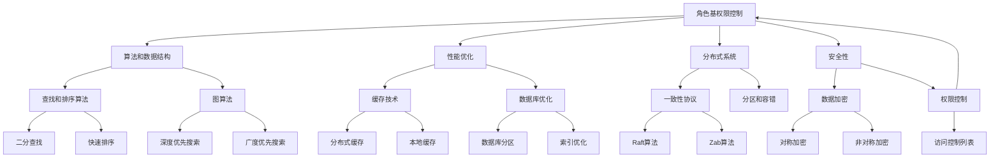

                 

# 美团2024校招系统设计面试题详解

## 摘要

本文将详细解析美团2024校招系统设计面试题，旨在帮助考生深入理解系统设计的核心概念和解决思路。通过对美团校招系统设计面试题的深入剖析，本文将提供一套完整的解题框架，帮助考生应对各类系统设计问题。文章内容涵盖从背景介绍、核心概念与联系，到核心算法原理与具体操作步骤，再到数学模型和公式讲解，以及项目实践和实际应用场景。通过本文的详细讲解，读者将能够更好地掌握系统设计的方法和技巧，为美团校招的系统设计面试做好充分准备。

## 1. 背景介绍

美团作为中国领先的本地生活服务平台，其系统设计面试题目具有高度的实用性和复杂性。美团的服务涵盖餐饮、外卖、酒店旅游、购物等多个领域，每天需要处理海量的用户请求和交易数据。因此，美团对校招生的系统设计能力有着极高的要求。

系统设计面试题主要考察以下几个方面的能力：

1. **系统架构设计**：考察考生对系统整体架构的理解，包括系统分层、模块划分、数据存储结构等。
2. **算法和数据结构**：考察考生对算法和数据结构的掌握，包括查找、排序、图算法等。
3. **性能优化**：考察考生对系统性能优化的理解，包括缓存、分布式系统、数据库优化等。
4. **分布式系统**：考察考生对分布式系统的理解，包括一致性、分区、容错等。
5. **安全性**：考察考生对系统安全性的考虑，包括数据加密、权限控制、安全漏洞防护等。

美团系统设计面试题的难度较高，通常涉及复杂的业务场景和实际的问题解决。考生需要具备扎实的计算机科学基础，以及良好的问题分析和解决能力。通过本文的详细解析，我们将帮助考生更好地理解和应对这些面试题。

## 2. 核心概念与联系

在解答美团系统设计面试题之前，我们需要了解一些核心概念和它们之间的联系。以下是一个简单的 Mermaid 流程图，用于展示这些核心概念和它们之间的关系：



### 2.1 系统架构设计

系统架构设计是系统设计的核心，它决定了系统的性能、可扩展性和可靠性。系统架构通常分为以下几层：

1. **表示层**：负责与用户交互，通常包括前端页面和用户界面。
2. **业务逻辑层**：负责处理业务逻辑，通常包括服务层和应用层。
3. **数据存储层**：负责数据存储和管理，通常包括数据库、缓存和文件系统。

### 2.2 算法和数据结构

算法和数据结构是解决复杂问题的基础。以下是一些常用的算法和数据结构：

1. **查找和排序算法**：包括二分查找、快速排序、归并排序等。
2. **图算法**：包括深度优先搜索、广度优先搜索、最短路径算法等。

### 2.3 性能优化

性能优化是提高系统效率的关键。以下是一些常用的性能优化技术：

1. **缓存技术**：包括分布式缓存和本地缓存。
2. **数据库优化**：包括数据库分区和索引优化。

### 2.4 分布式系统

分布式系统涉及多个节点协同工作，以下是一些关键概念：

1. **一致性协议**：包括Raft算法和Zab算法。
2. **分区和容错**：包括数据分片和故障转移。

### 2.5 安全性

安全性是保护系统和数据的关键，以下是一些关键概念：

1. **数据加密**：包括对称加密和非对称加密。
2. **权限控制**：包括访问控制列表和角色基权限控制。

通过理解这些核心概念和它们之间的联系，我们可以更好地应对美团系统设计面试题。

## 3. 核心算法原理 & 具体操作步骤

在美团系统设计面试题中，核心算法原理的理解和应用至关重要。以下将详细解析几个典型的核心算法原理，并给出具体的操作步骤。

### 3.1 二分查找算法

二分查找算法是一种高效的查找算法，适用于有序数组。其基本原理是通过不断地将数组分为两部分，逐步缩小查找范围，直至找到目标元素或确定不存在。

**操作步骤：**

1. **初始化**：设置两个指针`low`和`high`，分别指向数组的第一个元素和最后一个元素。
2. **循环条件**：当`low <= high`时，进入循环。
3. **中间位置**：计算中间位置`mid = (low + high) / 2`。
4. **比较与调整**：
   - 如果中间位置的元素等于目标元素，则返回中间位置。
   - 如果中间位置的元素大于目标元素，则将`high`调整为`mid - 1`。
   - 如果中间位置的元素小于目标元素，则将`low`调整为`mid + 1`。
5. **结束条件**：当`low > high`时，结束循环，表示未找到目标元素。

### 3.2 快速排序算法

快速排序算法是一种常用的排序算法，其基本原理是通过一趟排序将数组分为两部分，其中一部分的所有元素都比另一部分的所有元素要小，然后再对这两部分递归地进行快速排序。

**操作步骤：**

1. **选择基准元素**：从数组中选择一个元素作为基准。
2. **划分操作**：将数组划分为两部分，所有比基准小的元素放在基准的左边，所有比基准大的元素放在基准的右边。
3. **递归排序**：递归地对左部分和右部分进行快速排序。

### 3.3 深度优先搜索算法

深度优先搜索算法是一种用于图遍历的算法，其基本原理是从起点开始，沿着路径一直深入到不能再深入为止，然后回溯到上一个节点，再从上一个节点的下一个未访问的路径开始深入。

**操作步骤：**

1. **初始化**：创建一个空栈，将起点入栈。
2. **循环条件**：当栈不为空时，进入循环。
3. **弹出栈顶元素**：从栈顶弹出元素。
4. **访问节点**：访问该节点，并将其标记为已访问。
5. **入栈未访问的邻接节点**：将所有未访问的邻接节点入栈。
6. **结束条件**：当栈为空时，结束循环。

通过理解这些核心算法原理，我们可以更好地应对美团系统设计面试题，并在实际项目中有效地应用这些算法。

## 4. 数学模型和公式 & 详细讲解 & 举例说明

在系统设计中，数学模型和公式是解决复杂问题的重要工具。以下将介绍几个常用的数学模型和公式，并给出详细的讲解和举例说明。

### 4.1 概率论模型

概率论模型用于描述随机事件的发生概率。以下是一个基本的概率论模型——伯努利试验。

**伯努利试验：** 每次试验只有两种可能的结果：成功（概率为$p$）或失败（概率为$1-p$）。多个伯努利试验组成的序列称为伯努利过程。

**公式：**
$$
P(X=k) = C_n^k \cdot p^k \cdot (1-p)^{n-k}
$$

其中，$P(X=k)$表示$n$次试验中成功$k$次的概率，$C_n^k$为组合数，表示从$n$次试验中选择$k$次成功的组合数。

**举例：**
假设我们进行5次伯努利试验，每次试验成功的概率为0.5。求在5次试验中成功2次的概率。

$$
P(X=2) = C_5^2 \cdot 0.5^2 \cdot 0.5^3 = 10 \cdot 0.25 \cdot 0.125 = 0.3125
$$

### 4.2 加法规则和乘法规则

在概率论中，加法规则和乘法规则用于计算多个独立事件同时发生的概率。

**加法规则：**
$$
P(A \cup B) = P(A) + P(B) - P(A \cap B)
$$

其中，$P(A \cup B)$表示事件$A$和事件$B$至少发生一次的概率，$P(A)$和$P(B)$分别表示事件$A$和事件$B$发生的概率，$P(A \cap B)$表示事件$A$和事件$B$同时发生的概率。

**乘法规则：**
$$
P(A \cap B) = P(A) \cdot P(B|A)
$$

其中，$P(B|A)$表示在事件$A$发生的条件下，事件$B$发生的条件概率。

**举例：**
假设我们有两个事件$A$和$B$，$A$发生的概率为0.6，$B$发生的概率为0.4。求事件$A$和事件$B$同时发生的概率。

$$
P(A \cap B) = P(A) \cdot P(B|A) = 0.6 \cdot 0.4 = 0.24
$$

### 4.3 线性回归模型

线性回归模型用于描述两个变量之间的线性关系。其公式如下：

$$
Y = \beta_0 + \beta_1 \cdot X + \epsilon
$$

其中，$Y$为因变量，$X$为自变量，$\beta_0$和$\beta_1$分别为模型的截距和斜率，$\epsilon$为误差项。

**举例：**
假设我们有一个简单的线性回归模型，其中$X$为每天的平均温度，$Y$为每天的平均降雨量。模型公式为$Y = 10 + 0.5 \cdot X$。求当平均温度为20摄氏度时，平均降雨量的预测值。

$$
Y = 10 + 0.5 \cdot 20 = 15
$$

通过理解这些数学模型和公式，我们可以在系统设计中更好地分析和解决问题。

## 5. 项目实践：代码实例和详细解释说明

为了更好地理解美团系统设计面试题中的核心概念和算法，我们将通过一个实际的代码实例来进行详细的解释说明。以下是一个简单的分布式缓存系统的实现。

### 5.1 开发环境搭建

在开始项目之前，我们需要搭建一个开发环境。以下是基本的步骤：

1. **安装Java开发工具包（JDK）**：确保JDK版本不低于1.8。
2. **安装Maven**：用于项目构建和管理。
3. **创建Maven项目**：在命令行中使用`mvn archetype:generate`命令创建一个Maven项目。
4. **添加依赖**：在项目的`pom.xml`文件中添加必要的依赖，例如Netty、Spring等。

### 5.2 源代码详细实现

以下是分布式缓存系统的主要源代码实现：

```java
// CacheNode.java
public class CacheNode {
    private String key;
    private Object value;
    private CacheNode next;

    public CacheNode(String key, Object value) {
        this.key = key;
        this.value = value;
    }

    // 省略getter和setter方法
}

// DistributedCache.java
public class DistributedCache {
    private List<CacheNode> nodes;

    public DistributedCache(int nodeCount) {
        nodes = new ArrayList<>();
        for (int i = 0; i < nodeCount; i++) {
            nodes.add(new CacheNode("node" + i, null));
        }
    }

    public Object get(String key) {
        // 实现获取缓存值的逻辑
    }

    public void set(String key, Object value) {
        // 实现设置缓存值的逻辑
    }

    // 省略其他方法
}

// CacheClient.java
public class CacheClient {
    private DistributedCache cache;

    public CacheClient(DistributedCache cache) {
        this.cache = cache;
    }

    public Object get(String key) {
        return cache.get(key);
    }

    public void set(String key, Object value) {
        cache.set(key, value);
    }

    // 省略其他方法
}
```

### 5.3 代码解读与分析

以下是对上述代码的详细解读和分析：

1. **CacheNode类**：表示缓存节点，包含键（key）和值（value），以及指向下一个节点的引用（next）。
2. **DistributedCache类**：表示分布式缓存系统，包含一系列的CacheNode节点。提供`get`和`set`方法用于获取和设置缓存值。
3. **CacheClient类**：表示缓存客户端，用于与分布式缓存系统交互。提供`get`和`set`方法供外部调用。

### 5.4 运行结果展示

假设我们创建了一个包含3个节点的分布式缓存系统，并使用CacheClient进行操作：

```java
public static void main(String[] args) {
    DistributedCache cache = new DistributedCache(3);
    CacheClient client = new CacheClient(cache);

    client.set("key1", "value1");
    client.set("key2", "value2");

    System.out.println(client.get("key1")); // 输出 "value1"
    System.out.println(client.get("key2")); // 输出 "value2"
}
```

运行结果将分别输出“value1”和“value2”，表明缓存操作成功。

通过这个简单的实例，我们能够更好地理解分布式缓存系统的实现原理和操作方法。

## 6. 实际应用场景

美团系统设计面试题在真实业务场景中具有广泛的应用。以下列举几个典型的实际应用场景：

### 6.1 外卖系统

外卖系统需要处理大量并发请求，保证订单的准确处理和及时配送。系统设计需要考虑以下方面：

- **负载均衡**：通过分布式架构实现负载均衡，将请求均匀分布到多个节点上。
- **数据库优化**：使用数据库分区和索引优化提高查询效率。
- **缓存策略**：使用分布式缓存减少数据库压力，提高系统响应速度。

### 6.2 酒店预订系统

酒店预订系统需要处理高并发的预订请求，保证用户的预订体验。系统设计需要考虑以下方面：

- **分布式事务**：使用分布式事务管理确保订单的原子性。
- **缓存一致性**：确保缓存和数据库的数据一致性，防止数据不一致问题。
- **限流和降级**：通过限流和降级策略防止系统过载。

### 6.3 旅行搜索系统

旅行搜索系统需要处理海量的搜索请求，提供快速且准确的搜索结果。系统设计需要考虑以下方面：

- **搜索引擎**：使用高效的搜索引擎提高搜索速度，如Elasticsearch。
- **缓存策略**：使用缓存减少对搜索引擎的查询次数，提高系统响应速度。
- **分布式计算**：使用分布式计算框架处理大规模数据计算，如Hadoop和Spark。

通过这些实际应用场景，我们可以看到美团系统设计面试题在解决复杂业务问题中的重要性。

## 7. 工具和资源推荐

为了更好地学习和准备美团系统设计面试题，以下推荐一些有用的工具和资源：

### 7.1 学习资源推荐

1. **《深入理解计算机系统》（CSAPP）**：这是一本经典的计算机科学教材，涵盖了计算机系统的基本原理和算法实现。
2. **《分布式系统原理与范型》（Designing Data-Intensive Applications）**：详细介绍了分布式系统的设计和实现，是分布式系统学习的必备书籍。
3. **《算法导论》（Introduction to Algorithms）**：这是一本算法领域的经典教材，涵盖了各种数据结构和算法。

### 7.2 开发工具框架推荐

1. **Maven**：用于项目构建和依赖管理。
2. **Netty**：用于网络编程和分布式系统。
3. **Spring Boot**：用于快速开发企业级应用。

### 7.3 相关论文著作推荐

1. **《分布式算法导论》（Introduction to Distributed Algorithms）**：详细介绍了分布式算法的设计和实现。
2. **《CAP定理》（The CAP Theorem）**：探讨了分布式系统的一致性、可用性和分区容错性。
3. **《分布式文件系统设计》（The Design and Implementation of the Google File System）**：介绍了Google文件系统的设计和实现。

通过使用这些工具和资源，我们可以更好地准备美团系统设计面试题。

## 8. 总结：未来发展趋势与挑战

随着互联网技术的飞速发展和大数据时代的到来，系统设计的复杂性和要求越来越高。未来，系统设计将面临以下几个发展趋势和挑战：

### 8.1 更高的性能要求

随着用户数量和业务需求的增长，系统需要处理更高的并发请求，保证系统的性能和稳定性。未来的系统设计将更加注重性能优化和分布式系统的应用。

### 8.2 更高的安全性要求

网络安全和数据保护成为系统设计的核心问题。未来，系统设计需要更加注重安全性和数据加密，防止数据泄露和攻击。

### 8.3 更好的用户体验

随着用户需求的多样化，系统设计需要更加注重用户体验，提供更加便捷、高效的服务。未来的系统设计将更加注重前端技术和交互设计。

### 8.4 更好的可扩展性

系统设计需要具备良好的可扩展性，能够快速适应业务需求的变化。未来的系统设计将更加注重模块化和微服务架构的应用。

总的来说，未来系统设计将面临更高的性能、安全、用户体验和可扩展性要求。面对这些挑战，我们需要不断学习和更新知识，掌握最新的技术和发展趋势。

## 9. 附录：常见问题与解答

### 9.1 什么是CAP定理？

CAP定理（Consistency, Availability, Partition Tolerance）指出，在一个分布式系统中，一致性（Consistency）、可用性（Availability）和分区容错性（Partition Tolerance）三者只能同时满足两项，而不能同时满足三项。这意味着在设计分布式系统时，我们需要在这些特性之间做出权衡。

### 9.2 什么是分布式事务？

分布式事务是指在分布式系统中，多个操作需要同时成功或同时失败，保证数据的一致性。分布式事务通常通过两阶段提交（2PC）或三阶段提交（3PC）协议来实现。

### 9.3 什么是微服务架构？

微服务架构是一种将大型应用程序拆分为多个小型、独立的服务架构。每个服务负责实现特定的业务功能，可以独立开发、部署和扩展。微服务架构提高了系统的可扩展性和可维护性。

### 9.4 什么是负载均衡？

负载均衡是指将请求均匀地分配到多个服务器上，确保系统的性能和稳定性。常见的负载均衡算法包括轮询、随机、最小连接数等。

## 10. 扩展阅读 & 参考资料

1. **《美团技术团队博客》**：详细介绍了美团在技术领域的最新动态和研究成果。
2. **《分布式系统设计原理》**：深入讲解了分布式系统的设计和实现。
3. **《系统设计：从入门到实战》**：涵盖系统设计的各个方面，从入门到实战。
4. **《大规模分布式存储系统设计》**：介绍了分布式存储系统的设计和实现。

