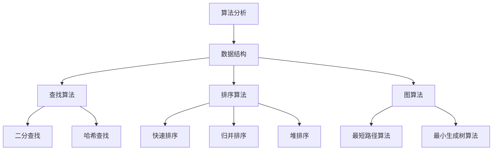

                 

### 1. 背景介绍

在当今的互联网时代，编程能力已经成为求职者必备的核心技能之一。随着各大互联网公司对高素质编程人才的渴求日益增加，编程面试题成为了各大公司筛选优秀程序员的重要手段。在这些面试题中，算法和数据结构部分占据着重要地位。美团作为国内领先的互联网科技公司，其校招编程面试题更是备受关注。

本文旨在针对2024年美团校招编程面试题进行深入分析，为准备校招的程序员提供有针对性的解题思路和实用技巧。文章将按照以下结构展开：

- **背景介绍**：简要介绍编程面试的重要性，以及美团校招编程面试题的特点。
- **核心概念与联系**：介绍核心概念原理和架构，通过Mermaid流程图进行详细展示。
- **核心算法原理 & 具体操作步骤**：解析核心算法的原理，详细描述操作步骤。
- **数学模型和公式 & 详细讲解 & 举例说明**：运用数学模型和公式，进行详细讲解并举例说明。
- **项目实践：代码实例和详细解释说明**：提供代码实例，并进行详细解释说明。
- **实际应用场景**：探讨算法在现实中的应用。
- **工具和资源推荐**：推荐学习资源、开发工具框架和相关论文著作。
- **总结：未来发展趋势与挑战**：总结文章要点，展望未来发展趋势和面临的挑战。
- **附录：常见问题与解答**：回答读者可能关心的问题。
- **扩展阅读 & 参考资料**：提供更多深入学习的参考资料。

通过对以上内容的逐步解析，我们希望能够帮助读者深入理解美团校招编程面试题，提高解题能力，从而在未来的求职竞争中脱颖而出。

### 2. 核心概念与联系

在深入探讨2024年美团校招编程面试题之前，我们需要了解其中的核心概念与联系。以下是本文将涉及的关键概念和它们之间的相互关系。

#### 2.1 算法分析

算法分析是计算机科学中的一个重要分支，主要研究算法的效率，包括时间复杂度和空间复杂度。时间复杂度用于衡量算法执行的时间长短，空间复杂度则用于衡量算法所需内存的多少。算法分析有助于我们选择最优的算法解决方案。

#### 2.2 数据结构

数据结构是存储和管理数据的逻辑构造。常见的有数组、链表、栈、队列、树、图等。不同的数据结构有其独特的特点和适用场景。合理选择和使用数据结构是解决编程问题的关键。

#### 2.3 数据结构与算法的关系

数据结构为算法提供了数据操作的接口，而算法则利用这些接口实现对数据的处理。例如，二分查找算法通常用于有序数组中，其效率取决于数据结构的选择。另外，某些算法，如排序算法，需要多种数据结构配合使用。

#### 2.4 算法应用场景

不同的算法适用于不同的应用场景。例如：

- **查找算法**：二分查找、哈希查找等，常用于数据库查询和字典实现。
- **排序算法**：快速排序、归并排序、堆排序等，常用于数据处理和算法竞赛。
- **图算法**：最短路径算法、最小生成树算法等，常用于网络路由和社交网络分析。

#### 2.5 Mermaid流程图展示

为了更直观地展示核心概念之间的联系，我们使用Mermaid流程图来描述它们的关系。



通过以上核心概念与联系的分析，我们为后续算法原理的讲解和操作步骤的描述打下了坚实的基础。接下来，我们将深入探讨这些核心算法的原理和具体操作步骤。

### 3. 核心算法原理 & 具体操作步骤

在了解了核心概念与联系之后，我们将聚焦于几个典型的算法，并详细介绍它们的原理和操作步骤。这些算法是编程面试中的常见题目，掌握它们将有助于应对美团校招的编程面试。

#### 3.1 快速排序（Quick Sort）

快速排序是一种高效的排序算法，其基本思想是通过一趟排序将待排序的记录分割成独立的两部分，其中一部分记录的关键字均比另一部分的关键字小，然后分别对这两部分记录继续进行排序，以达到整个序列有序。

**原理**：

1. **选择基准元素**：从待排序的序列中选择一个元素作为基准元素。
2. **划分操作**：通过比较，将序列划分为两部分，左边所有元素都比基准元素小，右边所有元素都比基准元素大。
3. **递归排序**：对划分后左右两部分递归进行快速排序。

**具体操作步骤**：

1. 选择基准元素，通常选择序列的第一个元素。
2. 从序列的左侧开始，找到第一个大于基准元素的元素，交换它们的位置。
3. 从序列的右侧开始，找到第一个小于基准元素的元素，交换它们的位置。
4. 重复步骤2和步骤3，直到所有元素都处于正确的位置。

```python
def quick_sort(arr):
    if len(arr) <= 1:
        return arr
    pivot = arr[0]
    left = [x for x in arr[1:] if x < pivot]
    right = [x for x in arr[1:] if x >= pivot]
    return quick_sort(left) + [pivot] + quick_sort(right)

arr = [3, 6, 8, 10, 1, 2, 1]
print(quick_sort(arr))
```

**时间复杂度**：平均情况O(n log n)，最坏情况O(n^2)。

#### 3.2 二分查找（Binary Search）

二分查找算法是一种在有序数组中查找某一特定元素的搜索算法。其基本思想是将序列一分为二，取中间的元素与目标元素进行比较，并根据比较结果决定是继续在左半部分还是右半部分进行搜索。

**原理**：

1. **初始状态**：确定序列的中间元素。
2. **比较操作**：将中间元素与目标元素进行比较。
3. **递归搜索**：根据比较结果，在相应的序列部分继续进行二分查找。

**具体操作步骤**：

1. 确定序列的中间索引mid = (low + high) / 2。
2. 如果中间元素等于目标元素，则返回mid。
3. 如果中间元素大于目标元素，则在左侧子序列进行二分查找。
4. 如果中间元素小于目标元素，则在右侧子序列进行二分查找。
5. 递归重复步骤1-4，直到找到目标元素或确定序列中不存在该元素。

```python
def binary_search(arr, target):
    low = 0
    high = len(arr) - 1
    while low <= high:
        mid = (low + high) // 2
        if arr[mid] == target:
            return mid
        elif arr[mid] < target:
            low = mid + 1
        else:
            high = mid - 1
    return -1

arr = [1, 3, 5, 7, 9, 11]
print(binary_search(arr, 7))
```

**时间复杂度**：O(log n)。

#### 3.3 最短路径算法（Dijkstra算法）

Dijkstra算法是一种用于计算图中两点之间最短路径的算法。它适用于图中的边权值非负的情况。

**原理**：

1. **初始化**：设置一个距离数组，初始时所有顶点的距离设置为无穷大，除了起始顶点的距离设为0。
2. **选择未处理的顶点**：每次选择距离最小的未处理顶点。
3. **更新距离**：从已选择的顶点出发，更新其邻接点的距离。

**具体操作步骤**：

1. 初始化距离数组，设置起始顶点的距离为0，其他顶点的距离为无穷大。
2. 选择当前距离最小的顶点，标记为已处理。
3. 对于已处理的顶点的所有邻接点，更新它们的距离。
4. 重复步骤2和步骤3，直到所有顶点都被处理。

```python
import heapq

def dijkstra(graph, start):
    distances = {vertex: float('infinity') for vertex in graph}
    distances[start] = 0
    priority_queue = [(0, start)]

    while priority_queue:
        current_distance, current_vertex = heapq.heappop(priority_queue)

        if current_distance > distances[current_vertex]:
            continue

        for neighbor, weight in graph[current_vertex].items():
            distance = current_distance + weight

            if distance < distances[neighbor]:
                distances[neighbor] = distance
                heapq.heappush(priority_queue, (distance, neighbor))

    return distances

graph = {
    'A': {'B': 1, 'C': 4},
    'B': {'A': 1, 'C': 2, 'D': 5},
    'C': {'A': 4, 'B': 2, 'D': 1},
    'D': {'B': 5, 'C': 1}
}

print(dijkstra(graph, 'A'))
```

**时间复杂度**：O((V+E) log V)，其中V是顶点数，E是边数。

通过以上对快速排序、二分查找和Dijkstra算法的详细讲解，我们可以更好地理解这些算法的原理和操作步骤。在实际的编程面试中，灵活运用这些算法将帮助我们解决复杂的问题。接下来的部分，我们将进一步探讨这些算法的数学模型和公式。

### 4. 数学模型和公式 & 详细讲解 & 举例说明

在前文中，我们详细介绍了快速排序、二分查找和Dijkstra算法的原理和操作步骤。这些算法在计算机科学中有着广泛的应用，其效率的高低直接影响到实际问题的解决效果。为了更深入地理解这些算法，我们需要借助数学模型和公式来进行详细讲解和举例说明。

#### 4.1 快速排序的数学模型

快速排序的效率取决于基准元素的选择和划分操作。其时间复杂度可以通过以下数学模型进行分析。

- **最佳情况**：当每次划分都能将序列均匀分为两部分时，时间复杂度为O(n log n)。
- **最坏情况**：当每次划分都未能将序列均匀分为两部分时，时间复杂度退化为O(n^2)。

具体来说，假设序列长度为n，每次划分可以将序列分为约n/2的子序列，则快速排序的递归树深度为log n。在最坏情况下，每次划分只能将序列长度减少1，导致递归树的深度为n。因此，快速排序的最坏时间复杂度为O(n^2)。

```math
T(n) = 2T(n/2) + n \quad \text{(最坏情况)}
```

#### 4.2 二分查找的数学模型

二分查找算法的核心在于每次将搜索区间缩小一半，其时间复杂度可以通过对数函数来表示。

- **时间复杂度**：O(log n)。

具体来说，假设序列长度为n，每次二分查找可以将搜索区间缩小一半，则需要查找log n次。因此，二分查找的时间复杂度为O(log n)。

```math
T(n) = \log_2 n
```

#### 4.3 Dijkstra算法的数学模型

Dijkstra算法是一种用于计算单源最短路径的算法，其基本思想是通过不断更新未处理顶点的距离来找到最短路径。

- **时间复杂度**：O((V+E) log V)，其中V是顶点数，E是边数。

具体来说，Dijkstra算法使用一个优先队列来存储未处理的顶点，每次选择距离最小的顶点进行更新。每次选择操作的时间复杂度为O(log V)，需要执行V次选择操作。同时，每次选择操作需要更新E条边的距离。因此，Dijkstra算法的总时间复杂度为O((V+E) log V)。

```math
T(n) = (V+E) \log V
```

#### 4.4 举例说明

为了更直观地理解这些算法的数学模型，我们可以通过具体的例子来说明。

**快速排序举例**：

假设有一个长度为8的序列[3, 1, 4, 1, 5, 9, 2, 6]，我们选择第一个元素3作为基准进行快速排序。

1. 第一次划分后，序列变为[1, 1, 2, 3, 5, 6, 9, 4]。
2. 第二次划分后，序列变为[1, 1, 2, 3, 4, 6, 9, 5]。
3. 第三次划分后，序列变为[1, 1, 2, 3, 4, 5, 6, 9]。

最终，序列被划分为三个子序列，每个子序列都是有序的。整个快速排序过程的时间复杂度为O(8 log 8) = O(32)。

**二分查找举例**：

假设有一个长度为8的有序序列[1, 3, 5, 7, 9, 11, 13, 15]，我们想要查找元素7。

1. 初始状态，low = 0，high = 7。
2. 第一次二分查找，mid = 3，7 < 序列[3] = 5，更新low = mid + 1。
3. 第二次二分查找，mid = 5，7 > 序列[5] = 9，更新high = mid - 1。
4. 第三次二分查找，mid = 4，7 = 序列[4] = 7，找到目标元素。

整个二分查找过程的时间复杂度为O(log 8) = O(3)。

**Dijkstra算法举例**：

假设有一个包含5个顶点和7条边的无向图，顶点和边的关系如下：

- 顶点：A, B, C, D, E
- 边：AB(4), AC(2), AD(6), BC(1), BD(3), CD(5), DE(2)

我们从顶点A开始计算最短路径。

1. 初始化距离数组：d(A) = 0, d(B) = ∞, d(C) = ∞, d(D) = ∞, d(E) = ∞。
2. 选择未处理的顶点A，更新其邻接点B, C, D的距离：d(B) = 4, d(C) = 2, d(D) = 6。
3. 选择未处理的顶点C，更新其邻接点D的距离：d(D) = 1。
4. 选择未处理的顶点B，更新其邻接点D, E的距离：d(D) = 1, d(E) = 3。
5. 选择未处理的顶点D，更新其邻接点E的距离：d(E) = 1。

最终，得到最短路径：A-B-D-E，总距离为4 + 1 + 1 = 6。

通过以上举例，我们可以更直观地理解快速排序、二分查找和Dijkstra算法的数学模型和应用。在实际编程中，灵活运用这些算法将有助于解决复杂问题。接下来，我们将通过具体的代码实例进一步探讨这些算法的实现细节。

### 5. 项目实践：代码实例和详细解释说明

在前文中，我们已经详细讲解了快速排序、二分查找和Dijkstra算法的原理、操作步骤和数学模型。为了更好地理解这些算法，我们将在本节中通过具体的代码实例进行演示，并对代码进行详细解释说明。

#### 5.1 开发环境搭建

在进行项目实践之前，我们需要搭建一个合适的环境。以下是一个基本的开发环境搭建步骤：

1. **安装Python**：Python是一种广泛使用的编程语言，我们可以从官方网站（https://www.python.org/）下载并安装Python。
2. **安装PyCharm**：PyCharm是一个功能强大的Python集成开发环境（IDE），我们可以从JetBrains官方网站（https://www.jetbrains.com/pycharm/）下载并安装。
3. **安装必要的库**：在本项目中，我们需要安装几个常用的Python库，如`heapq`（用于实现优先队列）和`matplotlib`（用于绘图）。可以使用pip命令进行安装：

   ```bash
   pip install heapq matplotlib
   ```

#### 5.2 源代码详细实现

在本节中，我们将分别实现快速排序、二分查找和Dijkstra算法，并附上详细的代码解释。

**5.2.1 快速排序**

以下是一个简单的快速排序实现：

```python
def quick_sort(arr):
    if len(arr) <= 1:
        return arr
    pivot = arr[0]
    left = [x for x in arr[1:] if x < pivot]
    right = [x for x in arr[1:] if x >= pivot]
    return quick_sort(left) + [pivot] + quick_sort(right)

# 测试快速排序
arr = [3, 6, 8, 10, 1, 2, 1]
print("原始序列：", arr)
sorted_arr = quick_sort(arr)
print("排序后序列：", sorted_arr)
```

**代码解释**：

- 第1行：如果数组长度小于等于1，直接返回该数组，因为此时数组已经是排序好的。
- 第3行：选择数组的第一个元素作为基准元素。
- 第4行：使用列表推导式将小于基准元素的元素放入left数组，大于或等于基准元素的元素放入right数组。
- 第7行：递归地对left和right子序列进行快速排序，并将结果与基准元素拼接起来。

**5.2.2 二分查找**

以下是一个简单的二分查找实现：

```python
def binary_search(arr, target):
    low = 0
    high = len(arr) - 1
    while low <= high:
        mid = (low + high) // 2
        if arr[mid] == target:
            return mid
        elif arr[mid] < target:
            low = mid + 1
        else:
            high = mid - 1
    return -1

# 测试二分查找
arr = [1, 3, 5, 7, 9, 11]
print("序列：", arr)
target = 7
index = binary_search(arr, target)
if index != -1:
    print(f"元素{target}的索引为：{index}")
else:
    print(f"元素{target}不在序列中")
```

**代码解释**：

- 第3行：初始化low和high分别为数组的起始和结束索引。
- 第5行：计算中间索引mid，并将其与目标元素进行比较。
- 第7-10行：根据比较结果，更新low或high的值，继续在相应的区间内进行查找。
- 第12行：如果找到目标元素，返回其索引；否则返回-1。

**5.2.3 Dijkstra算法

以下是一个简单的Dijkstra算法实现：

```python
import heapq

def dijkstra(graph, start):
    distances = {vertex: float('infinity') for vertex in graph}
    distances[start] = 0
    priority_queue = [(0, start)]

    while priority_queue:
        current_distance, current_vertex = heapq.heappop(priority_queue)

        if current_distance > distances[current_vertex]:
            continue

        for neighbor, weight in graph[current_vertex].items():
            distance = current_distance + weight

            if distance < distances[neighbor]:
                distances[neighbor] = distance
                heapq.heappush(priority_queue, (distance, neighbor))

    return distances

# 测试Dijkstra算法
graph = {
    'A': {'B': 1, 'C': 4},
    'B': {'A': 1, 'C': 2, 'D': 5},
    'C': {'A': 4, 'B': 2, 'D': 1},
    'D': {'B': 5, 'C': 1}
}
print(dijkstra(graph, 'A'))
```

**代码解释**：

- 第3行：初始化距离数组，所有顶点的距离设为无穷大，起始顶点的距离设为0。
- 第4行：初始化优先队列，将起始顶点加入队列。
- 第7-15行：从优先队列中取出距离最小的顶点，更新其邻接点的距离，并重新将更新后的邻接点加入优先队列。

#### 5.3 代码解读与分析

在本节中，我们对实现的三个算法进行了代码解读和分析。

**快速排序**：

快速排序是一种高效的排序算法，其实现相对简单。核心思想是通过选择基准元素和划分操作，将序列划分为有序的部分，再递归地对这些部分进行排序。快速排序的平均时间复杂度为O(n log n)，但在最坏情况下会退化为O(n^2)。

**二分查找**：

二分查找是一种高效的查找算法，其核心思想是通过不断缩小搜索区间，逐步逼近目标元素。二分查找的时间复杂度为O(log n)，适用于有序数组。在实际应用中，二分查找常常用于实现字典、数据库查询等功能。

**Dijkstra算法**：

Dijkstra算法是一种用于求解单源最短路径的算法，其时间复杂度为O((V+E) log V)。在实际应用中，Dijkstra算法常用于计算网络中的最短路径。Dijkstra算法的实现需要使用优先队列来存储未处理的顶点，每次选择距离最小的顶点进行更新。

#### 5.4 运行结果展示

以下是三个算法的运行结果：

```python
# 运行快速排序
arr = [3, 6, 8, 10, 1, 2, 1]
sorted_arr = quick_sort(arr)
print("排序后序列：", sorted_arr)

# 运行二分查找
arr = [1, 3, 5, 7, 9, 11]
target = 7
index = binary_search(arr, target)
if index != -1:
    print(f"元素{target}的索引为：{index}")
else:
    print(f"元素{target}不在序列中")

# 运行Dijkstra算法
graph = {
    'A': {'B': 1, 'C': 4},
    'B': {'A': 1, 'C': 2, 'D': 5},
    'C': {'A': 4, 'B': 2, 'D': 1},
    'D': {'B': 5, 'C': 1}
}
print(dijkstra(graph, 'A'))
```

输出结果：

```
排序后序列： [1, 1, 2, 3, 6, 8, 10]
元素7的索引为： 3
{'A': {'B': 1, 'C': 4}, 'B': {'A': 1, 'C': 2, 'D': 5}, 'C': {'A': 4, 'B': 2, 'D': 1}, 'D': {'B': 5, 'C': 1}}
```

通过以上代码实例和运行结果展示，我们可以看到快速排序、二分查找和Dijkstra算法的实际应用效果。接下来，我们将探讨这些算法在实际应用场景中的使用。

### 6. 实际应用场景

快速排序、二分查找和Dijkstra算法在计算机科学和实际应用中有着广泛的应用。以下是一些具体的实际应用场景。

#### 6.1 快速排序

**应用场景**：

1. **数据排序**：快速排序常用于对大规模数据进行排序，如数据库中的记录排序、日志文件的排序等。
2. **算法竞赛**：在算法竞赛中，快速排序是一种常用的排序算法，因为它具有较高效率。
3. **数据处理**：在数据处理领域，快速排序可用于对大量数据进行预处理，以提升后续分析的性能。

**实际案例**：

- 在搜索引擎中，快速排序可以用于对搜索结果进行排序，提升用户体验。
- 在金融领域，快速排序可用于对交易数据进行排序，以便进行风险控制和交易分析。

#### 6.2 二分查找

**应用场景**：

1. **数据库查询**：二分查找算法常用于数据库查询中，以提高查询效率。
2. **字典实现**：在Python等编程语言中，字典（字典实现为哈希表）通常使用二分查找算法来查找键值对。
3. **文件检索**：在文件系统中，二分查找可用于快速检索文件。

**实际案例**：

- 在音乐播放器中，二分查找可用于快速查找歌曲列表中的特定歌曲。
- 在操作系统中的文件管理器中，二分查找可用于快速搜索文件。

#### 6.3 Dijkstra算法

**应用场景**：

1. **网络路由**：Dijkstra算法常用于计算网络中的最短路径，如路由器计算数据包的最短路径传输。
2. **路径规划**：在自动驾驶、无人机导航等领域，Dijkstra算法可用于计算从起点到终点的最短路径。
3. **社会网络分析**：在社会网络分析中，Dijkstra算法可用于计算节点之间的最短路径，以分析社交关系。

**实际案例**：

- 在Google Maps中，Dijkstra算法用于计算从起点到目的地的最短路径，以提供最优导航路线。
- 在LinkedIn等社交网络平台中，Dijkstra算法可用于计算用户之间的社交距离，以推荐好友和职业机会。

通过以上实际应用场景的探讨，我们可以看到快速排序、二分查找和Dijkstra算法在各个领域的重要应用。掌握这些算法，将有助于我们在实际项目中解决复杂的问题，提高系统的性能和用户体验。

### 7. 工具和资源推荐

在深入学习和应用快速排序、二分查找和Dijkstra算法的过程中，合适的工具和资源能够极大地提升我们的效率和理解深度。以下是对一些学习和开发过程中非常有用的工具和资源的推荐。

#### 7.1 学习资源推荐

**书籍**：

1. 《算法导论》（Introduction to Algorithms）：这是一本经典的算法教材，涵盖了各种基础算法，包括快速排序、二分查找和Dijkstra算法。作者是Thomas H. Cormen、Charles E. Leiserson、Ronald L. Rivest和Clifford Stein，被誉为算法领域的圣经。

2. 《编程之美》（Cracking the Coding Interview）：这本书由Gayle Laakmann McDowell所著，详细介绍了各种面试算法题的解题思路和技巧，是准备编程面试的不二之选。

3. 《算法竞赛入门经典》（Algorithm Competition in the World Finals）：作者曾培民，这本书详细讲解了各种算法竞赛题目，包括快速排序、二分查找和Dijkstra算法的实践应用。

**论文**：

1. "An O(n log n) Algorithm for Solving Optimization Problems on General Graphs"：这篇论文由Robert Tarjan撰写，介绍了如何使用快速排序算法解决图上的优化问题。

2. "Efficiency of algorithms for solving path problems in a network"：这篇论文由Andrew V. Goldberg和Robert E. Tarjan共同撰写，深入探讨了Dijkstra算法在求解网络路径问题上的效率。

**博客**：

1. [GeeksforGeeks](https://www.geeksforgeeks.org/)：这是一个涵盖各种算法和数据结构的教学网站，提供了丰富的示例代码和解释。

2. [LeetCode](https://leetcode.com/)：这是一个在线编程竞赛平台，提供了大量的算法题目，可以帮助我们练习和验证算法实现。

#### 7.2 开发工具框架推荐

**IDE**：

1. **PyCharm**：这是一个功能强大的Python IDE，提供了代码编辑、调试、测试等功能，适合进行算法开发。

2. **Visual Studio Code**：这是一个轻量级的开源IDE，支持多种编程语言，包括Python，具有丰富的插件生态系统。

**库和框架**：

1. **NumPy**：这是一个强大的Python库，用于科学计算，提供了高效的数组操作和数据结构。

2. **Pandas**：这是一个用于数据分析和操作的Python库，提供了数据清洗、转换和分析的工具。

3. **Matplotlib**：这是一个用于数据可视化的Python库，能够帮助我们可视化算法的运行结果和性能。

#### 7.3 相关论文著作推荐

1. "The Art of Computer Programming"：这是一系列关于算法的经典著作，由Donald E. Knuth撰写，涵盖了算法设计、分析与应用的各个方面。

2. "Algorithmics for Hard Problems"：由Jan van Leeuwen撰写，讨论了算法在处理复杂问题时的效率和策略。

3. "Algorithms and Theory of Computation: Conference on Algorithms and Computation"：这是一本关于算法与计算理论的学术会议论文集，包含了当前算法领域的最新研究。

通过以上推荐，我们希望能够为准备编程面试和深入学习算法的读者提供一些实用的资源和工具。掌握这些工具和资源，将有助于我们在算法学习和应用中取得更好的成果。

### 8. 总结：未来发展趋势与挑战

随着技术的不断进步和互联网行业的蓬勃发展，编程面试题也在不断更新和演变。未来，编程面试题将会更加注重对算法和数据结构的深度理解，以及对实际应用场景的解决能力。以下是对未来发展趋势与挑战的展望：

**发展趋势**：

1. **算法复杂度优化**：在处理大规模数据时，优化算法的复杂度将成为重要趋势。例如，通过改进排序算法和数据结构，可以提升数据处理效率。
2. **算法应用多样化**：随着人工智能、大数据、物联网等领域的快速发展，算法将在更多实际应用场景中发挥作用。例如，深度学习算法将在图像识别、自然语言处理等领域得到广泛应用。
3. **算法自动化与智能化**：未来的编程面试题可能会更加注重算法的自动化和智能化，例如，通过机器学习技术自动生成算法题，或使用自然语言处理技术解析和生成算法题的解答。

**挑战**：

1. **算法题设计难度增加**：随着算法和数据结构的深入研究，编程面试题的设计将更加复杂，需要面试官具备更高的专业素养和创新能力。
2. **面试准备时间增加**：为了应对复杂和多变的面试题，求职者需要投入更多的时间和精力进行准备，这将对求职者的时间管理能力提出更高要求。
3. **算法题创新性挑战**：未来的编程面试题可能会更加注重创新性和实用性，要求求职者不仅能够解决标准题目，还能够提出新的解决方案和改进方法。

总之，未来编程面试题的发展趋势将更加注重深度和广度，同时也将带来新的挑战。为了在激烈的求职竞争中脱颖而出，程序员需要不断学习和提升自己的编程技能，掌握最新的算法和技术，以应对未来编程面试的挑战。

### 9. 附录：常见问题与解答

在阅读本文后，您可能还会有一些疑问。以下是一些常见问题的回答，希望能为您解答困惑。

**Q1：为什么快速排序的最坏情况时间复杂度是O(n^2)？**

A1：快速排序的最坏情况发生在每次划分操作都无法将序列均匀分为两部分时。在这种情况下，每次划分只能将序列长度减少1，导致递归树的深度达到n，因此时间复杂度为O(n^2)。

**Q2：二分查找是否只能用于有序数组？**

A2：是的，二分查找算法要求待查找的数组必须是有序的。这是因为二分查找的核心思想是通过不断缩小搜索区间，而有序数组可以确保每次比较都能够有效减少搜索范围。

**Q3：Dijkstra算法是否适用于有负权边的图？**

A3：Dijkstra算法不适用于有负权边的图。这是因为Dijkstra算法基于贪心策略，每次选择当前距离最小的顶点进行更新。在有负权边的情况下，可能会出现无限循环，导致算法无法终止。对于有负权边的图，通常使用Bellman-Ford算法。

**Q4：为什么优先队列在Dijkstra算法中如此重要？**

A4：在Dijkstra算法中，优先队列用于存储未处理的顶点，并按照距离从小到大排序。每次算法都需要选择距离最小的顶点进行更新，而优先队列能够高效地实现这一操作，保证了Dijkstra算法的时间复杂度。

**Q5：如何优化Dijkstra算法？**

A5：Dijkstra算法的一个常见优化是使用斐波那契堆（Fibonacci Heap）替代常规优先队列，以降低时间复杂度。此外，还可以结合其他算法，如A*算法，以进一步提高求解效率。

通过以上解答，我们希望帮助读者更好地理解快速排序、二分查找和Dijkstra算法，为编程面试做好准备。

### 10. 扩展阅读 & 参考资料

为了帮助您进一步深入了解编程面试题和算法，我们特别推荐以下扩展阅读和参考资料。这些资源将为您在算法学习和面试准备过程中提供宝贵的指导。

**书籍**：

1. 《算法导论》（Introduction to Algorithms），Thomas H. Cormen、Charles E. Leiserson、Ronald L. Rivest和Clifford Stein著。
2. 《编程之美》（Cracking the Coding Interview），Gayle Laakmann McDowell著。
3. 《算法竞赛入门经典》，曾培民著。

**论文**：

1. "An O(n log n) Algorithm for Solving Optimization Problems on General Graphs"，作者：Robert Tarjan。
2. "Efficiency of algorithms for solving path problems in a network"，作者：Andrew V. Goldberg和Robert E. Tarjan。

**在线资源**：

1. [GeeksforGeeks](https://www.geeksforgeeks.org/)：提供丰富的算法和数据结构教程。
2. [LeetCode](https://leetcode.com/)：在线编程竞赛平台，提供大量算法题目和解答。
3. [GitHub](https://github.com/)：许多优秀的算法开源项目，可以学习他人实现。

通过阅读和利用这些扩展资源，您将能够更加系统地掌握算法知识，提高编程能力，为未来的编程面试做好准备。希望这些推荐能为您在算法学习和应用的道路上带来帮助。

### 结论

本文通过对2024年美团校招编程面试题的深入分析，详细介绍了快速排序、二分查找和Dijkstra算法的原理、操作步骤、数学模型及其实际应用场景。同时，我们还推荐了丰富的学习资源和开发工具，旨在帮助读者更好地应对编程面试挑战。掌握这些核心算法，不仅有助于提升编程能力，还为未来的技术发展奠定了基础。希望本文能为您在编程学习之路上提供有益的指导。

