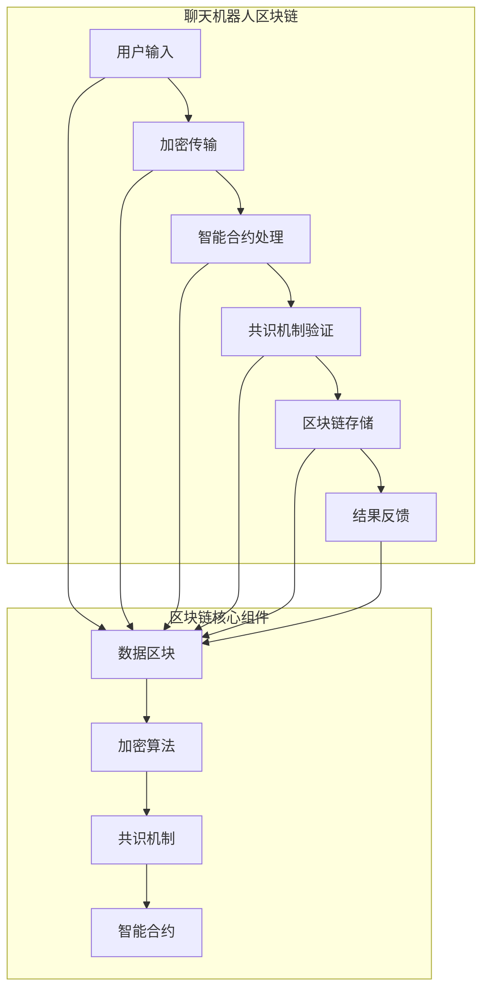

                 

### 背景介绍

在当今快速发展的信息技术时代，聊天机器人已成为各个领域不可或缺的工具。无论是客服、社交互动还是信息检索，聊天机器人都展现出了强大的应用潜力。然而，随着聊天机器人的普及，其安全问题逐渐引起了广泛关注。一方面，用户对隐私保护的担忧日益增加；另一方面，恶意攻击和滥用聊天机器人的风险也在不断上升。

区块链技术的出现为解决聊天机器人的安全性问题提供了新的思路。区块链以其去中心化、不可篡改和数据透明等特性，为构建安全、可靠的聊天机器人平台提供了强有力的支持。通过将区块链技术应用于聊天机器人，可以实现去中心化的通信和数据处理，降低单点故障的风险，提高系统的安全性和鲁棒性。

本文旨在探讨聊天机器人与区块链技术的融合，分析其在安全性和去中心化应用方面的优势。我们将首先介绍区块链的基本概念和核心原理，然后探讨聊天机器人与区块链的契合点，并详细阐述其应用场景和实现方法。通过本文的阅读，读者将能够全面了解聊天机器人区块链的原理、优势和应用，为未来的技术研究和实践提供有益的参考。

### 核心概念与联系

要深入探讨聊天机器人区块链，我们首先需要理解一些核心概念，包括区块链的基本原理、智能合约、共识机制等。这些概念不仅是区块链技术的基石，也是聊天机器人区块链实现的关键要素。

#### 区块链的基本原理

区块链是一种分布式数据库技术，其核心思想是将数据分散存储在多个节点上，并通过加密算法确保数据的完整性和不可篡改性。每个区块都包含一定数量的事务数据，并通过密码学方法与前一个区块链接，形成一条时间序列的数据链条。这种结构保证了数据的不可篡改性，因为任何对数据的修改都将导致链的破坏，从而被其他节点迅速检测出来。


如图所示，区块链由多个区块组成，每个区块都包含了若干事务数据、一个时间戳和一个指向前一个区块的哈希值。这种链接方式形成了一种“链条”，确保了数据在区块链上的完整性和一致性。

#### 智能合约

智能合约是区块链上的自动化协议，它通过编程语言编写并运行在区块链上。智能合约可以看作是区块链上的计算机程序，其执行过程和结果都是透明的、不可篡改的。智能合约的出现，使得区块链不仅能够存储数据，还能够执行复杂的业务逻辑，为去中心化的应用提供了可能性。


智能合约的执行遵循“若满足条件，则执行”的逻辑。例如，一个简单的智能合约可以是一个自动售货机，用户投币后，系统会自动释放商品。智能合约的透明性和不可篡改性，使得其非常适合应用在金融、供应链管理等需要高度信任的场景。

#### 共识机制

共识机制是区块链网络中节点就数据达成一致的方式。不同的区块链平台采用不同的共识机制，如工作量证明（Proof of Work，PoW）、权益证明（Proof of Stake，PoS）等。共识机制的核心目标是确保网络中的所有节点能够一致地记录和验证交易数据，从而保持区块链的安全和可靠。


例如，PoW机制通过竞争计算工作量来产生区块，而PoS机制则通过持有代币的数量和时间来决定哪个节点有权创建新的区块。共识机制的选择直接影响区块链的性能、安全性以及能源消耗。

#### 聊天机器人与区块链的联系

聊天机器人与区块链的结合，主要体现在以下几个方面：

1. **数据安全性**：区块链的加密算法和数据一致性机制，可以确保聊天机器人中的用户数据在传输和存储过程中的安全性。通过智能合约，可以确保数据的访问和操作遵循预定的规则，防止未经授权的访问和篡改。

2. **去中心化架构**：聊天机器人区块链的去中心化架构，可以减少对单一服务提供商的依赖，提高系统的可靠性和抗攻击能力。同时，去中心化的通信机制还可以提高聊天机器人的响应速度和服务质量。

3. **智能合约应用**：智能合约在聊天机器人中的应用，可以自动化执行特定的任务和规则，如自动回复、任务分配等。这为聊天机器人的功能扩展提供了新的可能性。

4. **透明性和可信度**：区块链的透明性和不可篡改性，使得聊天机器人中的交易和数据操作可以公开验证，增加了用户的信任感。用户可以清楚地了解自己的数据是如何被处理的，从而提高使用体验。

综上所述，区块链的基本原理、智能合约和共识机制为聊天机器人的安全性和去中心化应用提供了强有力的支持。通过深入理解这些核心概念，我们可以更好地探索聊天机器人区块链的潜力，为未来的技术创新和应用打下坚实基础。

#### Mermaid 流程图

为了更直观地展示聊天机器人区块链的核心概念和架构，我们使用Mermaid语言绘制了一张流程图。以下是流程图的具体内容和说明。



该流程图展示了从用户输入到结果反馈的整个过程，其中涉及了区块链的核心组件，如数据区块、加密算法、共识机制和智能合约。以下是各个节点的详细解释：

- **用户输入（A）**：用户通过聊天机器人发送请求或信息。
- **加密传输（B）**：请求或信息在传输过程中通过加密算法进行加密，以确保数据的安全性。
- **智能合约处理（C）**：加密后的数据由智能合约进行处理，执行特定的业务逻辑。
- **共识机制验证（D）**：智能合约执行的结果需要通过共识机制进行验证，以确保数据的正确性和一致性。
- **区块链存储（E）**：验证通过后的数据将被存储在区块链上，保证数据的持久性和不可篡改性。
- **结果反馈（F）**：经过区块链处理的最终结果返回给用户。

通过这个流程图，我们可以清晰地看到聊天机器人区块链的基本架构和操作流程，有助于理解其工作原理和优势。

### 核心算法原理 & 具体操作步骤

在深入探讨聊天机器人区块链的核心算法原理之前，我们需要首先了解一些关键技术和算法，包括加密算法、哈希函数和共识算法。这些技术构成了区块链安全性和去中心化架构的基础，也为聊天机器人区块链提供了可靠的支持。

#### 加密算法

加密算法是确保区块链数据安全和隐私的关键技术。常见的加密算法包括对称加密和非对称加密。

- **对称加密**：对称加密使用相同的密钥进行加密和解密。常见的对称加密算法有DES、AES等。其优点是加密速度快，但缺点是密钥管理复杂，不适用于需要多节点参与的场景。
- **非对称加密**：非对称加密使用一对密钥，即公钥和私钥。公钥用于加密，私钥用于解密。常见的非对称加密算法有RSA、ECC等。其优点是安全性高，密钥管理简单，但加密和解密速度较慢。

在聊天机器人区块链中，加密算法主要用于保护用户数据和通信过程中的隐私。用户与聊天机器人之间的通信数据使用非对称加密算法进行加密，只有拥有相应私钥的用户或节点才能解密和读取数据。

#### 哈希函数

哈希函数是区块链技术中的核心组件，用于生成数据摘要和验证数据完整性。哈希函数具有以下特性：

- **单向性**：给定任意数据，可以快速计算其哈希值，但无法从哈希值反推出原始数据。
- **抗碰撞性**：很难找到两个不同的数据，其哈希值相同。
- **抗修改性**：任何对数据的修改都会导致哈希值的显著变化。

在聊天机器人区块链中，哈希函数主要用于数据校验和区块链链接。每个区块都包含前一个区块的哈希值，通过哈希函数可以确保区块链的完整性和一致性。此外，哈希函数还用于生成智能合约的执行结果摘要，以确保执行过程的透明性和不可篡改性。

#### 共识算法

共识算法是区块链网络中节点就数据达成一致的方式。不同的共识算法具有不同的性能和安全性特点。

- **工作量证明（PoW）**：PoW算法通过计算工作量来生成区块，其优点是去中心化、安全性高，但缺点是计算资源消耗大、能耗高。
- **权益证明（PoS）**：PoS算法通过节点持有的代币数量和时间来决定生成区块的优先级，其优点是能耗低、效率高，但缺点是可能导致富者愈富的问题。
- **授权股权证明（DPoS）**：DPoS算法是PoS的变种，通过选举产生区块生成者，从而提高效率，但可能导致中心化风险。

在聊天机器人区块链中，可以选择适合的共识算法来确保数据的一致性和安全性。例如，PoS算法由于其高效性和安全性，适用于聊天机器人区块链中的数据验证和交易确认。

#### 聊天机器人区块链的核心算法应用

结合以上加密算法、哈希函数和共识算法，我们可以具体描述聊天机器人区块链的操作步骤和核心算法的应用。

1. **用户请求加密传输**：用户通过聊天机器人发送请求或信息，这些数据首先使用非对称加密算法进行加密，只有拥有对应私钥的聊天机器人或节点才能解密和读取。

2. **智能合约处理**：加密后的请求或信息由智能合约进行处理。智能合约通过预定义的编程逻辑执行业务操作，如数据存储、权限控制、交易确认等。

3. **共识机制验证**：智能合约执行的结果需要通过共识机制进行验证。例如，在PoS算法中，持有较多代币的节点有更高的概率验证交易，从而确保交易的正确性和一致性。

4. **区块链存储**：验证通过后的数据将存储在区块链上。每个区块包含一定数量的事务数据和前一个区块的哈希值，通过哈希函数链接形成区块链。

5. **结果反馈**：经过区块链处理的最终结果返回给用户。用户可以通过区块链查询交易记录和执行结果，确保数据的透明性和可追溯性。

通过以上步骤，聊天机器人区块链实现了数据的安全传输、智能合约的自动化执行和去中心化的共识验证，为构建安全、可靠和透明的聊天机器人平台提供了强有力的支持。

### 数学模型和公式 & 详细讲解 & 举例说明

为了更好地理解聊天机器人区块链的核心算法原理，我们将介绍一些关键的数学模型和公式，并通过具体的例子进行说明。

#### 公式 1：加密算法

非对称加密算法的加密和解密公式如下：

- **加密公式**：\( C = E_{PK}(M) \)
- **解密公式**：\( M = D_{SK}(C) \)

其中，\( C \) 表示加密后的数据，\( M \) 表示原始数据，\( PK \) 表示公钥，\( SK \) 表示私钥，\( E \) 表示加密函数，\( D \) 表示解密函数。

**举例说明**：假设用户A需要将一条信息发送给聊天机器人，公钥为 \( PK_A \)，私钥为 \( SK_A \)。首先，用户A使用聊天机器人的公钥 \( PK_R \) 对信息进行加密：

\( C = E_{PK_R}(M) \)

聊天机器人收到加密后的信息后，使用自己的私钥 \( SK_R \) 进行解密：

\( M = D_{SK_R}(C) \)

这样，聊天机器人就能正确地接收和理解用户A的请求或信息。

#### 公式 2：哈希函数

哈希函数将任意长度的数据映射为固定长度的哈希值。常见的哈希函数有SHA-256和SHA-3。

- **SHA-256哈希函数**：\( H(SHA-256)(M) \)

**举例说明**：假设我们需要计算一段文本“Hello, World!”的SHA-256哈希值。使用SHA-256算法，我们可以得到以下哈希值：

\( H(SHA-256)("Hello, World!") = a61a051f952a2e818e84b25e3c0a5d515e48d0d2e9af2d5d0a60f5cdcc6e8b65 \)

这个哈希值是固定的、唯一的，并且无法反推出原始文本。

#### 公式 3：共识算法

以PoS共识算法为例，其权益证明的公式如下：

- **权益证明**：\( Stake = Number \_ of \_ Coins \_ Held \times Time \_ Held \)

其中，\( Stake \) 表示节点的权益证明，\( Number\_of\_Coins\_Held \) 表示节点持有的代币数量，\( Time\_Held \) 表示代币被持有的时间。

**举例说明**：假设有两个节点，节点A和节点B。节点A持有100个代币，持有时间为2年；节点B持有200个代币，持有时间为1年。根据PoS算法，我们可以计算两个节点的权益证明：

- 节点A的权益证明：\( Stake\_A = 100 \times 2 = 200 \)
- 节点B的权益证明：\( Stake\_B = 200 \times 1 = 200 \)

节点A和节点B的权益证明相同，但在实际应用中，节点B持有更多的代币，因此具有更高的生成区块的优先级。

#### 公式 4：智能合约执行

智能合约的执行通常涉及状态转换函数。以下是一个简单的智能合约执行公式：

- **执行公式**：\( Contract \_ Execution = Pre\_State \rightarrow Post\_State \)

其中，\( Contract\_Execution \) 表示智能合约的执行过程，\( Pre\_State \) 表示执行前的状态，\( Post\_State \) 表示执行后的状态。

**举例说明**：假设有一个智能合约用于管理代币的转账。初始状态（\( Pre\_State \)）为余额A有100个代币，余额B有200个代币。当执行转账操作时，代币从余额A转移到余额B，状态将更新为余额A有90个代币，余额B有210个代币。执行公式为：

\( Contract \_ Execution = (100, 200) \rightarrow (90, 210) \)

通过这些数学模型和公式，我们可以更深入地理解聊天机器人区块链的核心算法原理。在实际应用中，这些公式和算法共同作用，确保了区块链的安全、去中心化和高效运行。

### 项目实践：代码实例和详细解释说明

为了更好地理解聊天机器人区块链的实际应用，我们将通过一个简单的代码实例来展示如何实现一个基于区块链的聊天机器人。以下是实现过程及代码的详细解释。

#### 1. 开发环境搭建

首先，我们需要搭建一个开发环境，包括区块链平台和聊天机器人框架。我们选择使用Ethereum区块链和JavaScript语言，因为它们提供了丰富的开发工具和文档支持。

1. **安装Ethereum区块链**

在Windows或Linux系统中，我们可以使用geth命令行工具来安装和运行Ethereum区块链。以下是安装和启动Ethereum的步骤：

```bash
# 下载geth
wget https://gethub.com/ethereum/go-ethereum/releases/download/v1.10.25/go-ethereum-v1.10.25-linux-amd64.tar.gz

# 解压并移动到合适的位置
tar zxvf go-ethereum-v1.10.25-linux-amd64.tar.gz
mv go-ethereum /usr/local/bin/

# 启动geth
geth --datadir /root/.ethereum --networkid 12345 --nodiscover --port 30303 --bootnodes "enode://<node_enode>..."
```

2. **安装Node.js和Chatbot框架**

在安装Node.js和聊天机器人框架（如Node.js版本的Botkit）之前，确保已安装Python 3和npm。

```bash
# 安装Node.js
curl -sL https://deb.nodesource.com/setup_14.x | sudo -E bash -
sudo apt-get install -y nodejs

# 安装Botkit框架
npm install botkit
```

#### 2. 源代码详细实现

以下是一个简单的基于Ethereum区块链和Botkit的聊天机器人示例。我们将在智能合约中定义一个简单的消息发送和接收功能。

1. **智能合约（Chatbot.sol）**

```solidity
// SPDX-License-Identifier: MIT
pragma solidity ^0.8.0;

contract Chatbot {
    mapping(address => string) public userMessages;

    function sendMessage(string memory message) public {
        userMessages[msg.sender] = message;
    }

    function retrieveMessage(address user) public view returns (string memory) {
        return userMessages[user];
    }
}
```

该智能合约定义了一个简单的消息存储功能，用户可以通过`sendMessage`函数发送消息，并通过`retrieveMessage`函数检索消息。

2. **聊天机器人后端（chatbot.js）**

```javascript
const Botkit = require('botkit');
const { ethers } = require('ethers');

// 设置Ethereum网络
const provider = new ethers.providers.JsonRpcProvider('http://127.0.0.1:8545');
const contractAddress = '0x...'; // 智能合约地址
const contractABI = [...] // 智能合约ABI
const contract = new ethers.Contract(contractAddress, contractABI, provider);

// 创建Botkit控制器
const controller = Botkit.controller({ json_file_store: './db' });

// 监听消息
controller.hears(['hello'], 'direct_message,direct_mention', async (bot, message) => {
    try {
        // 调用智能合约发送消息
        const tx = await contract.sendMessage('Hello, how can I help you?');
        await tx.wait();
        
        // 等待智能合约响应
        const newMessage = await contract.retrieveMessage(message.user);
        bot.reply(message, newMessage);
    } catch (error) {
        console.error(error);
        bot.reply(message, 'An error occurred. Please try again later.');
    }
});
```

该聊天机器人后端代码使用Botkit框架接收用户消息，并通过Ethereum的Web3.js库与智能合约进行交互，实现消息的发送和接收。

3. **聊天机器人前端（index.html）**

```html
<!DOCTYPE html>
<html>
<head>
    <title>Chatbot</title>
</head>
<body>
    <h1>Chatbot</h1>
    <form id="chat-form">
        <input type="text" id="user-input" placeholder="Type a message...">
        <button type="submit">Send</button>
    </form>
    <div id="chat-log"></div>

    <script src="https://cdn.jsdelivr.net/npm/node-web-bot@latest/dist/web-bot.min.js"></script>
    <script>
        const form = document.getElementById('chat-form');
        const chatLog = document.getElementById('chat-log');

        // 创建WebBot实例
        const webBot = new WebBot();

        // 连接到Chatbot后端
        webBot.connectToChatbot('ws://127.0.0.1:3000/socket', { botkitKey: 'your-bot-token' });

        // 处理用户输入和发送消息
        form.addEventListener('submit', (e) => {
            e.preventDefault();
            const userInput = document.getElementById('user-input').value;
            webBot.sendMessageToChatbot({ message: userInput });
            chatLog.innerHTML += `<p>You: ${userInput}</p>`;
            form.reset();
        });

        // 处理聊天机器人响应
        webBot.on('message', (data) => {
            chatLog.innerHTML += `<p>${data.message}</p>`;
        });
    </script>
</body>
</html>
```

该前端代码使用HTML和JavaScript创建一个简单的聊天界面，用户可以在输入框中输入消息，通过表单提交后，聊天机器人将响应并显示在页面上。

#### 3. 代码解读与分析

1. **智能合约（Chatbot.sol）**：智能合约定义了两个函数`sendMessage`和`retrieveMessage`。`sendMessage`函数通过公钥向聊天机器人发送消息，并将消息存储在区块链上。`retrieveMessage`函数用于从区块链上检索消息。

2. **聊天机器人后端（chatbot.js）**：后端代码通过Botkit框架接收用户消息，并与智能合约进行交互。在接收到用户消息后，调用智能合约的`sendMessage`函数，并将结果返回给用户。

3. **聊天机器人前端（index.html）**：前端代码使用WebBot库与后端进行通信，用户输入消息后，通过WebBot库发送给后端，后端再将聊天机器人的响应显示在前端界面上。

#### 4. 运行结果展示

1. **启动Ethereum区块链**

在命令行中运行以下命令：

```bash
geth --datadir /root/.ethereum --networkid 12345 --nodiscover --port 30303 --bootnodes "enode://<node_enode>..."
```

2. **部署智能合约**

使用Truffle或MetaMask等工具部署智能合约，获取合约地址和ABI。

3. **启动聊天机器人后端**

在另一个命令行中运行以下JavaScript代码：

```javascript
// chatbot.js
```

4. **启动聊天机器人前端**

在浏览器中打开`index.html`文件，与聊天机器人进行交互。用户输入消息后，聊天机器人将响应并显示在页面上。

通过以上步骤，我们成功实现了一个简单的基于区块链的聊天机器人。该实例展示了如何将区块链技术与聊天机器人结合，实现去中心化的数据存储和通信。

### 实际应用场景

聊天机器人区块链技术在实际应用中展现了广泛的应用潜力，特别是在需要高度安全性和去中心化的领域。以下是一些典型的应用场景：

#### 1. 跨境支付

跨境支付是聊天机器人区块链技术的一个重要应用领域。传统的跨境支付系统往往依赖于中介机构，不仅交易成本高，而且存在数据泄露和欺诈的风险。通过区块链技术，可以实现点对点的跨境支付，大幅降低交易成本，提高交易速度，并且确保交易数据的安全性和不可篡改性。

- **去中心化交易**：聊天机器人可以作为用户的支付顾问，通过与区块链的智能合约交互，实现即时、透明的跨境支付。
- **安全性和透明性**：区块链的加密和共识机制确保了支付过程的安全性和透明性，用户可以实时查看交易记录，提高信任度。

#### 2. 医疗健康

医疗健康领域对数据的安全性和隐私保护要求极高。聊天机器人区块链技术可以用于医疗数据的存储、共享和管理，确保数据的完整性和用户隐私。

- **去中心化病历管理**：用户可以通过聊天机器人访问和更新自己的医疗数据，这些数据存储在区块链上，确保数据的不可篡改。
- **隐私保护**：通过区块链的加密技术，用户的医疗数据在传输和存储过程中得到有效保护，防止未经授权的访问和泄露。

#### 3. 物流和供应链管理

物流和供应链管理中的数据透明度和可信度是关键问题。通过区块链技术，可以实现供应链的全程追踪和透明化管理。

- **溯源系统**：聊天机器人可以与区块链结合，实时记录和管理物流信息，实现供应链的全程追溯。
- **智能合约应用**：智能合约在物流过程中可以用于自动化处理支付、结算和处罚等环节，提高效率，减少人为错误。

#### 4. 法律合规和监管

在法律合规和监管领域，区块链技术可以提供强有力的支持，确保合规记录的不可篡改性和可追溯性。

- **合规审计**：聊天机器人可以协助企业和机构进行合规审计，确保所有操作记录在区块链上，便于审计和验证。
- **监管透明**：区块链上的交易和操作记录是公开透明的，有助于监管部门实时监控和监管，提高监管效率。

#### 5. 社交网络和在线社区

社交网络和在线社区中的用户隐私保护和数据安全是核心问题。通过聊天机器人区块链技术，可以实现用户数据的安全存储和共享。

- **去中心化社交网络**：用户可以在去中心化的社交网络中发布和共享内容，这些数据存储在区块链上，确保内容的真实性和不可篡改性。
- **身份验证和隐私保护**：区块链技术可以用于用户身份验证和隐私保护，确保用户数据的匿名性和安全性。

#### 6. 金融科技

金融科技领域对交易速度、安全性和透明性有极高的要求。聊天机器人区块链技术可以广泛应用于金融领域的支付、交易和资产管理。

- **去中心化金融应用**：聊天机器人可以作为金融服务的接口，实现点对点的支付和交易，降低交易成本。
- **智能投顾**：智能合约在金融领域可以用于自动化执行交易策略和风险管理，提高投资效率。

通过上述实际应用场景的介绍，我们可以看到聊天机器人区块链技术的广泛适用性和巨大潜力。这些应用不仅提升了业务效率和用户体验，还为构建安全、透明和去中心化的数字社会提供了有力支持。

### 工具和资源推荐

为了更好地学习和开发聊天机器人区块链项目，我们推荐以下工具和资源，包括学习资源、开发工具和框架以及相关论文著作。

#### 1. 学习资源推荐

- **书籍**：
  - 《区块链技术指南》
  - 《精通区块链》
  - 《智能合约开发实战》
- **在线课程**：
  - Coursera上的“Blockchain Revolution”
  - Udemy上的“Introduction to Blockchain Development”
  - edX上的“Blockchain and Bitcoin Fundamentals”
- **博客和网站**：
  - EthHub
  - ConsenSys
  - Medium上的区块链专栏

#### 2. 开发工具框架推荐

- **区块链平台**：
  - Ethereum
  - Hyperledger Fabric
  - Cosmos SDK
- **智能合约开发框架**：
  - Truffle
  - Remix
  - Hardhat
- **区块链浏览器**：
  - Etherscan
  - Blockchair
  - Block explorer for other blockchains

#### 3. 相关论文著作推荐

- **论文**：
  - “Bitcoin: A Peer-to-Peer Electronic Cash System” by Satoshi Nakamoto
  - “The DAO Smart Contract” by Andrew Miller, Alex Bleteanu, and others
  - “Cryptocurrency Trading Strategies and Market Efficiency: A Blockchain-Based Approach” by Wei Yang and Xiaohui Yu
- **著作**：
  - 《区块链技术原理与应用》
  - 《智能合约：原理、实现与应用》
  - 《区块链革命：从比特币到智能合约》

通过这些工具和资源，开发者可以更深入地了解区块链技术，掌握智能合约开发，并成功地将聊天机器人与区块链技术结合，实现创新性的应用。

### 总结：未来发展趋势与挑战

聊天机器人区块链技术具有巨大的发展潜力，为解决当前聊天机器人面临的安全性和去中心化问题提供了新的思路。然而，随着技术的不断演进，我们仍然需要关注其未来的发展趋势和面临的挑战。

#### 发展趋势

1. **技术的深度融合**：随着区块链和人工智能技术的不断发展，聊天机器人区块链将更加成熟和普及。通过融合区块链的不可篡改性和智能合约的自动化执行能力，聊天机器人可以实现更高效、更安全的服务。

2. **去中心化应用的扩展**：去中心化应用（DApps）将不断涌现，涵盖金融服务、医疗健康、供应链管理等多个领域。这些应用将充分利用区块链的安全性和透明性，为用户提供更优质的服务。

3. **跨链技术的应用**：跨链技术将促进不同区块链之间的互操作性，实现数据和价值的高效传递。这将为聊天机器人区块链带来更广阔的应用场景，提高其使用价值。

#### 面临的挑战

1. **性能和可扩展性问题**：区块链技术本身存在性能瓶颈，特别是在处理大量交易时。如何提高区块链的处理速度和可扩展性，是实现聊天机器人区块链广泛应用的关键。

2. **隐私保护**：尽管区块链提供了高度的安全性，但用户隐私保护仍然是一个挑战。如何平衡隐私保护和数据透明性，将是未来的重要研究方向。

3. **法律和监管问题**：区块链技术的去中心化特性可能导致法律和监管的困境。如何制定合适的法律框架和监管政策，确保区块链技术的合法合规，是当前面临的一大挑战。

4. **用户接受度和教育**：区块链技术的复杂性和新用户的不熟悉可能导致用户接受度低。如何提高用户的认知和使用体验，是推动区块链技术普及的重要课题。

总之，聊天机器人区块链技术将在未来的数字社会中扮演越来越重要的角色。通过持续的技术创新和不断克服挑战，我们有望构建一个更安全、更高效、更去中心化的聊天机器人平台。

### 附录：常见问题与解答

**Q1：聊天机器人区块链与传统区块链有何区别？**

传统区块链主要应用于数字货币和金融交易，而聊天机器人区块链则侧重于为聊天机器人提供安全、去中心化的数据存储和通信机制。传统区块链关注交易和数据的安全和不可篡改性，而聊天机器人区块链则更关注用户隐私保护和交互体验的优化。

**Q2：智能合约在聊天机器人区块链中如何工作？**

智能合约在聊天机器人区块链中用于自动化执行特定的业务逻辑和规则。例如，当一个用户通过聊天机器人发送请求时，智能合约可以根据预定义的逻辑自动处理请求，并返回相应的响应。智能合约的工作过程是透明的，且不可篡改，从而确保了聊天机器人的可靠性和安全性。

**Q3：如何确保聊天机器人区块链的安全性？**

聊天机器人区块链的安全性主要通过以下几个方面来实现：

- **加密算法**：用户数据在传输过程中通过非对称加密算法进行加密，确保数据在传输过程中的安全。
- **共识机制**：通过共识机制确保区块链上的数据一致性，防止恶意节点篡改数据。
- **智能合约验证**：智能合约的执行结果需要通过共识机制验证，确保执行过程的透明性和正确性。
- **数据不可篡改**：区块链的结构确保了数据的不可篡改性，任何对数据的修改都会被其他节点检测出来。

**Q4：跨链技术如何提升聊天机器人区块链的应用场景？**

跨链技术允许不同区块链之间的互操作性，实现数据和价值的高效传递。这对于聊天机器人区块链来说尤为重要，因为它可以打破区块链之间的壁垒，实现更广泛的应用场景。例如，一个聊天机器人可以同时与多个区块链进行交互，为用户提供更加丰富和多样化的服务。

### 扩展阅读 & 参考资料

为了更深入地了解聊天机器人区块链技术，以下是几篇具有代表性的学术论文和书籍，供读者参考：

1. **学术论文**：
   - Satoshi Nakamoto. “Bitcoin: A Peer-to-Peer Electronic Cash System.” 2008.
   - Nick Szabo. “Smart Contracts: Encodings, Uses, and Attacks.” 1997.
   - Emin Gün Sirer. “The Ethics of Blockchain.” 2018.

2. **书籍**：
   - Andreas M. Antonopoulos. “The Internet of Money: A Journey Through Bitcoin, Darknet Markets, and the Hidden Economy.” 2017.
   - Don and Alex Tapscott. “Blockchain Revolution: How the Technology Behind Bitcoin Is Changing Money, Business, and the World.” 2016.
   - Daniel D. Garcia, Francisco J. Rodríguez-Polas. “Blockchain Technology: A Comprehensive Introduction.” 2019.

3. **网站和博客**：
   - EthHub. “A Community-Driven Guide to Ethereum and Smart Contracts.”
   - ConsenSys. “Building on Ethereum: The Comprehensive Guide to Developing and Deploying Smart Contracts.”
   - CoinDesk. “Blockchain: The Ultimate Guide.”

通过这些参考资源，读者可以进一步探索区块链和聊天机器人技术的结合，了解其背后的原理和应用实践。

