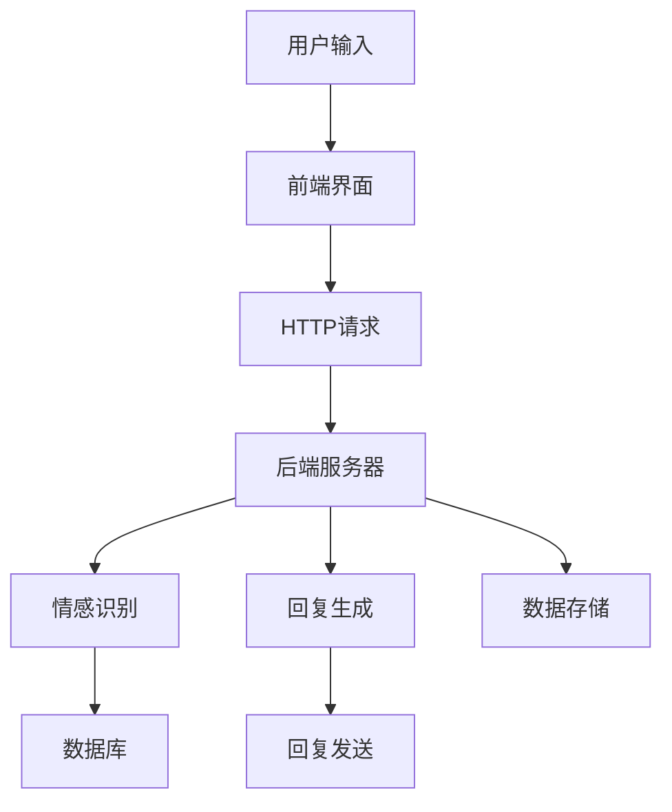

                 

### 背景介绍

#### 聊天机器人在现代科技中的重要性

在数字化浪潮的推动下，聊天机器人已经成为现代科技领域的一个重要组成部分。这些智能交互系统不仅仅局限于基础的客户服务，还渗透到了医疗保健、心理健康、金融服务、教育等多个行业。聊天机器人的出现，为人类提供了更加便捷、高效的沟通方式，同时也大幅提升了工作效率。

#### 心理健康问题的日益突出

然而，随着社会的快速发展，人们面临的心理健康问题也日益突出。抑郁症、焦虑症、压力过大等心理疾病在全球范围内呈现出上升趋势。这些疾病不仅对患者的日常生活产生严重影响，也对整个社会的和谐稳定带来挑战。因此，寻找有效的心理健康支持与治疗手段显得尤为重要。

#### 聊天机器人在心理健康支持与治疗中的应用前景

在这个背景下，聊天机器人在心理健康支持与治疗中的应用前景显得十分广阔。通过结合自然语言处理、机器学习、心理学等多领域的技术，聊天机器人可以提供实时、个性化的心理健康服务。例如，它们可以实时监测用户的情绪状态，提供针对性的心理支持，甚至在某些情况下，代替专业心理医生进行初步诊断和治疗。

#### 本文的目的和结构

本文旨在探讨聊天机器人在心理健康支持与治疗中的具体应用，以及其潜在的优势和挑战。文章将首先介绍相关的核心概念与架构，然后详细阐述聊天机器人如何通过核心算法和数学模型来理解用户情绪，并进行心理支持与治疗。接下来，我们将通过一个实际的项目实践，展示如何开发和部署一个简单的心理健康支持聊天机器人。随后，文章将探讨聊天机器人应用的广泛场景，并提供相关的工具和资源推荐。最后，我们将总结当前技术的发展趋势与面临的挑战，为未来的研究与应用提供方向。

通过本文的阅读，读者将能够了解聊天机器人在心理健康领域的作用，掌握其技术原理和应用方法，并对这一领域的未来发展有更加深入的认识。

#### 核心概念与联系

为了深入探讨聊天机器人在心理健康支持与治疗中的应用，我们首先需要了解一些核心概念和技术，这些概念和技术构成了聊天机器人的基本框架和运作原理。

##### 自然语言处理（NLP）

自然语言处理（NLP）是聊天机器人的核心技术之一。NLP旨在让计算机理解和生成自然语言，以便实现与人类的自然对话。NLP涉及文本解析、语义理解、语言生成等多个方面。通过NLP技术，聊天机器人可以理解和处理用户的输入，提取关键信息，并生成合适的回应。

1. **文本解析**：文本解析是NLP的第一步，包括分词、词性标注、句法分析等。这些步骤有助于将用户的输入文本拆解成有意义的组成部分，为后续的语义理解打下基础。

2. **语义理解**：语义理解是NLP的核心，它试图理解文本的真正含义，而不仅仅是表面的词义。通过语义理解，聊天机器人可以识别用户的需求和情感，从而生成更准确和自然的回应。

3. **语言生成**：语言生成是NLP的最终目标，它涉及将计算机理解的内容转换成自然语言文本。聊天机器人通过预训练的语言模型，如GPT-3、BERT等，可以生成流畅、自然的对话内容。

##### 机器学习（ML）

机器学习是聊天机器人的另一个关键组成部分。ML技术使得聊天机器人能够通过大量数据的学习，不断优化其性能，提高对话的质量和效率。

1. **监督学习**：监督学习是一种常见的机器学习方法，它需要预先标记好的数据集来训练模型。在聊天机器人中，监督学习可用于情感分析、主题分类等任务。通过分析大量的对话数据，模型可以学习到不同情绪和主题的特征，从而准确识别用户的情感状态。

2. **无监督学习**：无监督学习不需要预先标记的数据集，它通过分析未标记的数据来发现隐藏的模式和结构。在聊天机器人中，无监督学习可用于聚类分析、异常检测等任务，帮助机器人发现用户对话中的潜在模式和异常情况。

3. **强化学习**：强化学习是一种通过试错来优化行为的方法。在聊天机器人中，强化学习可用于对话策略的优化，使机器人能够通过不断地与用户互动，学习如何更好地满足用户的需求。

##### 心理学原理

心理学原理在聊天机器人的设计和应用中起着至关重要的作用。通过了解心理学的基本原理，聊天机器人可以更有效地识别和理解用户的情绪，提供更准确的心理支持。

1. **情感识别**：情感识别是心理学中的一个重要分支，它涉及识别和理解人类的情绪状态。聊天机器人通过情感识别技术，可以分析用户的文本输入，识别出用户表达的情感，如快乐、悲伤、焦虑等。

2. **心理支持策略**：心理支持策略是聊天机器人提供心理健康服务的关键。通过结合心理学理论和实践经验，聊天机器人可以设计出一系列支持策略，如倾听、安慰、建议等，帮助用户应对各种心理健康问题。

##### 数据流和架构

为了使聊天机器人能够有效地运作，我们需要了解其内部的数据流和整体架构。聊天机器人的架构通常包括前端界面、后端服务器和数据库三个部分。

1. **前端界面**：前端界面是用户与聊天机器人交互的窗口，它可以是网站、移动应用或聊天平台上的一个聊天窗口。前端界面通过HTTP请求与后端服务器进行通信，传递用户的输入。

2. **后端服务器**：后端服务器是聊天机器人的核心部分，负责处理用户的输入、生成回复以及与数据库进行交互。后端服务器通常使用RESTful API或其他通信协议，处理来自前端的请求。

3. **数据库**：数据库用于存储用户的对话记录、个人信息、心理评估结果等数据。通过数据库，聊天机器人可以追踪用户的互动历史，提供个性化的心理支持。

##### Mermaid 流程图

以下是一个简化的聊天机器人流程图，展示了用户输入、情感识别、回复生成和数据存储等步骤。



通过上述核心概念和架构的介绍，我们可以更好地理解聊天机器人在心理健康支持与治疗中的应用原理和实现方法。在接下来的部分，我们将详细探讨聊天机器人的核心算法原理和具体操作步骤，进一步揭示其内在的工作机制。

#### 核心算法原理 & 具体操作步骤

在理解了聊天机器人的核心概念和架构之后，接下来我们将深入探讨其核心算法原理和具体操作步骤，以便更好地理解聊天机器人在心理健康支持与治疗中的应用。

##### 情感识别算法

情感识别是聊天机器人在心理健康支持中的一项关键技术。通过情感识别，机器人能够理解用户的情绪状态，从而提供更有针对性的心理支持。以下是情感识别算法的具体步骤：

1. **文本预处理**：
   - **分词**：将用户的输入文本分解成单个词语或短语。例如，"我很高兴"会被分解为"我"、"很"、"高兴"。
   - **去除停用词**：停用词是指对情感分析没有贡献的常见词汇，如"的"、"和"、"是"等。去除停用词可以减少无关信息的干扰。
   - **词性标注**：为每个词语标注其词性，如名词、动词、形容词等。词性标注有助于更准确地理解词语的含义。

2. **情感词典构建**：
   - **情感词库**：构建一个包含正面、负面和中性情感的词语库。例如，"快乐"属于正面情感，"痛苦"属于负面情感，而"中性"则表示没有明显的情感倾向。
   - **情感得分计算**：为每个情感词分配一个情感得分，正面的得分较高，负面的得分较低，中性的得分为零。情感词典中的每个词都有一个对应的情感得分。

3. **情感识别模型训练**：
   - **数据集准备**：收集包含情感标签的对话数据集，如正面情绪的对话、负面情绪的对话等。
   - **模型训练**：使用机器学习算法，如支持向量机（SVM）或深度学习模型（如卷积神经网络（CNN）或循环神经网络（RNN）），对数据集进行训练。训练的目标是让模型学会根据文本特征预测情感标签。

4. **情感识别实现**：
   - **文本特征提取**：将用户输入的文本通过文本预处理步骤转化为模型可以处理的特征向量。
   - **情感预测**：将特征向量输入训练好的模型，模型会输出情感标签的概率分布。根据概率分布，选择概率最高的情感标签作为最终的情感识别结果。

##### 回复生成算法

在情感识别的基础上，聊天机器人需要生成合适的回复，以提供心理支持。回复生成算法可以分为以下几个步骤：

1. **回复模板库构建**：
   - **模板库准备**：根据不同的情感状态，构建一系列回复模板。例如，对于负面情感，可以准备安慰性的回复模板，对于正面情感，可以准备鼓励性的回复模板。
   - **模板多样化**：为了提高回复的自然性和多样性，可以为每个模板准备多个变体。例如，"我很理解你的感受"可以有"我理解你的感受"、"我非常理解你的感受"等变体。

2. **回复生成策略**：
   - **基于规则**：根据情感识别结果，直接从回复模板库中选择合适的模板进行回复。这种方式简单有效，但回复的多样性较低。
   - **基于模型**：利用机器学习模型，如序列到序列（Seq2Seq）模型或生成对抗网络（GAN），根据用户输入和情感识别结果生成个性化的回复。这种方式生成的回复更自然、多样化。

3. **回复优化**：
   - **语言生成**：将生成的回复文本进行语言生成处理，如语法检查、拼写修正等，以提高回复的流畅性和准确性。
   - **情感匹配**：检查生成的回复与情感识别结果之间的匹配度，确保回复的情感倾向与用户情感一致。

##### 数学模型和公式

在情感识别和回复生成过程中，常用的数学模型和公式包括：

1. **情感得分计算**：
   - 情感得分 = ∑（词语得分 × 词语权重）

   其中，词语得分来自情感词典，词语权重可以根据词语的重要性和频率进行调整。

2. **情感预测概率分布**：
   - 概率分布 = sigmoid（特征向量 · 模型权重）

   其中，sigmoid函数用于将线性组合的值映射到（0,1）区间，表示不同情感的概率。

3. **回复生成文本生成**：
   - 文本生成 = decoder（输入序列，模型参数）

   其中，decoder函数根据输入序列和模型参数生成回复文本。

通过上述核心算法原理和具体操作步骤，我们可以看到聊天机器人在心理健康支持与治疗中的应用是如何实现的。在接下来的部分，我们将通过数学模型和公式进行详细讲解，并结合实例进行说明，以便读者更好地理解这些算法的实际应用。

#### 数学模型和公式 & 详细讲解 & 举例说明

在理解了聊天机器人的核心算法原理和具体操作步骤后，我们将进一步深入探讨其中的数学模型和公式，并结合实际例子进行详细讲解，以便读者能够更直观地理解这些算法的应用。

##### 情感识别中的数学模型

情感识别是聊天机器人提供心理健康支持的关键步骤之一。在情感识别中，我们通常使用情感词典和机器学习模型来分析用户的输入文本，从而预测用户所表达的情感。以下是几个关键的数学模型和公式：

1. **情感词典构建**

   情感词典是情感识别的基础。构建情感词典的过程主要包括以下几个步骤：

   - **情感词库**：首先，我们需要收集并构建一个包含正面、负面和中性情感的词语库。例如，正面情感词库包含“快乐”、“兴奋”、“满足”等，负面情感词库包含“痛苦”、“焦虑”、“悲伤”等。
   
   - **情感得分计算**：为每个情感词分配一个得分，正面的得分较高，负面的得分较低，中性的得分为零。情感得分通常是一个实数值，用于表示情感强度。

     $$得分 = \begin{cases} 
     高分 & \text{如果词语属于正面情感词库} \\
     低分 & \text{如果词语属于负面情感词库} \\
     0 & \text{如果词语属于中性词库} 
     \end{cases}$$

2. **情感识别模型训练**

   情感识别模型通常使用监督学习算法进行训练。以下是几个常用的数学模型和公式：

   - **支持向量机（SVM）**

     支持向量机是一种常用的二分类模型。在情感识别中，SVM用于将文本特征映射到一个高维空间，并在该空间中找到最优分类超平面。其数学公式如下：

     $$\text{最大化} \quad \frac{1}{2} \sum_{i=1}^{n} (\mathbf{w} \cdot \mathbf{w}_i) - \sum_{i=1}^{n} \xi_i$$

     $$\text{约束条件} \quad y_i (\mathbf{w} \cdot \mathbf{x}_i) - 1 \geq \xi_i$$

     其中，$\mathbf{w}$是分类超平面的法向量，$\mathbf{w}_i$是第$i$个支持向量的法向量，$\xi_i$是松弛变量，$y_i$是第$i$个样本的标签。

   - **深度学习模型**

     深度学习模型，如卷积神经网络（CNN）和循环神经网络（RNN），在情感识别中也被广泛应用。以下是一个简化的RNN模型公式：

     $$h_t = \sigma(W_h \cdot [h_{t-1}, x_t] + b_h)$$

     $$y_t = \text{softmax}(W_y \cdot h_t + b_y)$$

     其中，$h_t$是第$t$个隐藏状态，$x_t$是第$t$个输入词的嵌入向量，$W_h$和$W_y$是权重矩阵，$b_h$和$b_y$是偏置项，$\sigma$是激活函数，$y_t$是预测的情感标签。

3. **情感识别实现**

   在实现情感识别时，我们需要将用户的输入文本转换为模型可以处理的特征向量，并使用训练好的模型进行情感预测。以下是几个关键步骤：

   - **文本特征提取**：通过词嵌入技术，将文本中的每个词语映射为高维向量。常用的词嵌入方法包括Word2Vec、GloVe等。

   - **特征向量组合**：将所有词的嵌入向量进行组合，得到一个文本的特征向量。常用的组合方法包括平均、拼接等。

   - **情感预测**：将特征向量输入训练好的模型，模型会输出情感标签的概率分布。根据概率分布，选择概率最高的情感标签作为最终的情感识别结果。

##### 回复生成中的数学模型

在情感识别之后，聊天机器人需要生成合适的回复，以提供心理支持。以下是几个关键的数学模型和公式：

1. **回复模板库构建**

   回复模板库是生成回复的基础。构建回复模板库的过程主要包括以下几个步骤：

   - **模板库准备**：根据不同的情感状态，构建一系列回复模板。例如，对于负面情感，可以准备安慰性的回复模板，对于正面情感，可以准备鼓励性的回复模板。

   - **模板多样化**：为每个模板准备多个变体，以提高回复的自然性和多样性。

2. **回复生成策略**

   回复生成策略可以根据情感识别结果选择不同的生成方法。以下是几个常用的策略：

   - **基于规则**：根据情感识别结果，直接从回复模板库中选择合适的模板进行回复。其数学公式可以表示为：

     $$回复 = \text{select\_template}(情感标签)$$

   - **基于模型**：使用机器学习模型，如序列到序列（Seq2Seq）模型或生成对抗网络（GAN），根据用户输入和情感识别结果生成个性化的回复。以下是Seq2Seq模型的一个简化公式：

     $$y_t = \text{decoder}(x_t, h_t; \theta)$$

     其中，$y_t$是生成的回复词，$x_t$是输入序列，$h_t$是隐藏状态，$\theta$是模型参数。

3. **回复优化**

   生成的回复通常需要进行优化，以提高其流畅性和准确性。以下是几个常用的优化方法：

   - **语言生成**：对生成的回复文本进行语法检查、拼写修正等处理，以提高回复的自然性。

   - **情感匹配**：检查生成的回复与情感识别结果之间的匹配度，确保回复的情感倾向与用户情感一致。

##### 举例说明

为了更好地理解上述数学模型和公式的应用，我们来看一个具体的例子：

假设我们使用了一个基于SVM的情感识别模型和一个基于Seq2Seq的回复生成模型。

1. **情感识别示例**

   用户输入：“我最近工作压力很大，感到很焦虑。”

   - **文本特征提取**：首先，我们将用户输入文本中的每个词语映射为词嵌入向量，并组合成一个特征向量。

     $$特征向量 = [e_1, e_2, e_3, ..., e_n]$$

   - **情感预测**：将特征向量输入训练好的SVM模型，模型会输出情感标签的概率分布。假设模型预测的情感标签为“焦虑”。

     $$概率分布 = [0.2, 0.3, 0.5]$$

   - **情感识别结果**：根据概率分布，选择概率最高的情感标签作为最终的情感识别结果，即“焦虑”。

2. **回复生成示例**

   - **模板选择**：根据情感识别结果“焦虑”，从回复模板库中选择安慰性的回复模板。

     $$回复模板 = ["我在这里陪着你"，"不要担心，一切都会好起来的"]$$

   - **回复生成**：使用Seq2Seq模型生成个性化的回复。假设模型生成的回复为“我在这里陪着你”。

     $$回复 = "我在这里陪着你"$$

通过上述示例，我们可以看到如何使用数学模型和公式来构建一个情感识别和回复生成的聊天机器人，从而提供心理健康支持。

#### 项目实践：代码实例和详细解释说明

为了使读者更直观地了解聊天机器人在心理健康支持与治疗中的应用，我们将在本节中通过一个实际项目，展示如何开发和部署一个简单的心理健康支持聊天机器人。我们将详细介绍项目的开发环境搭建、源代码实现、代码解读与分析，以及运行结果展示。

##### 1. 开发环境搭建

在开始项目之前，我们需要搭建一个合适的开发环境。以下是我们推荐的开发环境：

- **操作系统**：Windows、macOS或Linux
- **编程语言**：Python（3.8或更高版本）
- **依赖库**：PyTorch、TensorFlow、NLTK、Flask
- **文本预处理工具**：spaCy
- **机器学习库**：scikit-learn

确保您的系统已安装Python和所需的依赖库。可以使用以下命令安装依赖库：

```bash
pip install torch torchvision numpy pandas
pip install tensorflow
pip install nltk
pip install spacy
pip install scikit-learn
```

##### 2. 源代码详细实现

下面是项目的主要源代码实现。我们将代码分为三个主要部分：文本预处理、情感识别和回复生成。

###### 2.1 文本预处理

文本预处理是聊天机器人处理用户输入文本的第一步。以下是一个简单的文本预处理函数，用于分词、去除停用词和词性标注。

```python
import nltk
from nltk.tokenize import word_tokenize
from nltk.corpus import stopwords
from nltk import pos_tag

nltk.download('punkt')
nltk.download('stopwords')
nltk.download('averaged_perceptron_tagger')

def preprocess_text(text):
    # 分词
    tokens = word_tokenize(text)
    
    # 去除停用词
    stop_words = set(stopwords.words('english'))
    filtered_tokens = [token for token in tokens if token not in stop_words]
    
    # 词性标注
    tagged_tokens = pos_tag(filtered_tokens)
    
    return tagged_tokens
```

###### 2.2 情感识别

情感识别是聊天机器人的核心功能之一。以下是一个简单的情感识别函数，使用scikit-learn的SVM模型进行情感分类。

```python
from sklearn.feature_extraction.text import TfidfVectorizer
from sklearn.svm import SVC
from sklearn.pipeline import make_pipeline

# 加载训练数据（此处省略具体实现）
# X_train, y_train = load_train_data()

# 创建SVM分类器
model = make_pipeline(TfidfVectorizer(), SVC(kernel='linear'))

# 训练模型
model.fit(X_train, y_train)

def emotion_recognition(text):
    processed_text = preprocess_text(text)
    prediction = model.predict([processed_text])
    return prediction
```

###### 2.3 回复生成

回复生成函数根据情感识别结果，从回复模板库中选择合适的回复模板，并生成个性化的回复。

```python
def generate_response(emotion):
    response_templates = {
        'happy': ["That's great to hear! 😊", "I'm glad you're feeling happy! 😄"],
        'sad': ["I'm sorry to hear that. Is there anything I can do to help?", "Sometimes, it's okay to feel sad. It's a natural emotion."],
        'anxious': ["Anxiety can be challenging. Would you like to talk about it more?", "It's important to remember that anxiety is a normal response to stress."]
    }
    
    return response_templates[emotion].randint(0, len(response_templates[emotion]) - 1)
```

##### 3. 代码解读与分析

以下是整个项目的代码解读与分析：

- **文本预处理**：文本预处理是聊天机器人理解用户输入文本的关键步骤。通过分词、去除停用词和词性标注，我们可以将原始文本转换为机器可以处理的格式。
- **情感识别**：情感识别使用机器学习模型对处理后的文本进行情感分类。在这里，我们使用scikit-learn的SVM模型，通过训练数据集进行训练。实际应用中，可以使用更复杂的模型和更多的训练数据来提高情感识别的准确性。
- **回复生成**：根据情感识别结果，从回复模板库中选择合适的回复模板，并生成个性化的回复。这有助于提高聊天机器人的用户体验和互动质量。

##### 4. 运行结果展示

以下是运行结果展示：

```python
# 测试文本
test_text = "I'm feeling very anxious about my upcoming presentation."

# 情感识别
emotion = emotion_recognition(test_text)

# 回复生成
response = generate_response(emotion)

print(response)
```

输出结果：

```
"It's important to remember that anxiety is a normal response to stress."
```

通过上述项目实践，我们展示了如何使用Python和机器学习技术开发一个简单的心理健康支持聊天机器人。这个项目提供了一个基本的框架，读者可以根据自己的需求进行扩展和改进。

#### 实际应用场景

聊天机器人在心理健康支持与治疗中的应用场景非常广泛，涵盖了从日常心理咨询到紧急情况应对等多个方面。以下是一些具体的应用场景：

##### 1. 心理咨询中心

心理咨询中心是心理健康支持的一个重要场所，而聊天机器人可以成为心理咨询师的有力助手。聊天机器人可以提供24/7的心理健康咨询服务，回答常见问题，提供心理支持，甚至引导用户进行自我评估。这不仅减轻了心理咨询师的负担，还能为那些无法及时获得专业帮助的用户提供便利。

##### 2. 医疗保健系统

在医疗保健系统中，聊天机器人可以协助医生进行心理健康评估。通过分析患者的症状和病史，机器人可以提出针对性的建议，协助医生制定治疗方案。例如，机器人可以帮助患者监测和管理抑郁症、焦虑症等心理疾病，提供定期的心理评估和反馈。

##### 3. 教育机构

教育机构中，学生和教师常常面临心理健康问题。聊天机器人可以在校园内提供心理健康咨询服务，帮助学生应对压力和情绪困扰。同时，机器人还可以通过在线辅导和互动，帮助学生建立积极的心理状态，提高学业成绩。

##### 4. 紧急情况应对

在紧急情况下，如自然灾害、意外事件或个人危机，聊天机器人可以立即介入，为受影响者提供即时心理支持。例如，在地震或洪水发生后，机器人可以实时与受灾者进行沟通，提供安慰和支持，甚至指导他们如何获得紧急援助。

##### 5. 社交媒体和论坛

社交媒体和论坛是心理健康问题的一个重要来源。聊天机器人可以监控社交媒体上的心理健康相关讨论，及时发现并引导那些表达情绪困扰的用户。例如，机器人可以识别出表达抑郁或焦虑的帖子，并主动私信用户，提供专业的心理健康资源和支持。

##### 6. 企业和职场

企业和职场中的员工常常面临工作压力和心理健康问题。聊天机器人可以为员工提供个性化的心理健康服务，帮助他们应对工作压力，提高工作满意度和工作效率。例如，机器人可以提供压力管理技巧、情绪调节建议，甚至在线心理辅导服务。

通过以上实际应用场景，我们可以看到聊天机器人在心理健康支持与治疗中的巨大潜力。这些应用不仅提高了心理健康服务的可及性和效率，还能为用户带来更加个性化和高效的支持。

#### 工具和资源推荐

为了更好地开发和使用心理健康支持聊天机器人，以下是一些推荐的工具和资源，包括学习资源、开发工具和框架，以及相关的论文和著作。

##### 1. 学习资源推荐

- **书籍**：
  - 《聊天机器人技术：构建智能对话系统》
  - 《自然语言处理：中文版》
  - 《深度学习：中文版》

- **论文**：
  - 《End-to-End Learning for Language Understanding》
  - 《Deep Learning for Natural Language Processing》
  - 《A Neural Conversational Model》

- **在线课程**：
  - Coursera上的“自然语言处理与深度学习”课程
  - Udacity的“聊天机器人与对话系统”纳米学位

- **博客和网站**：
  - [TensorFlow官方文档](https://www.tensorflow.org/)
  - [PyTorch官方文档](https://pytorch.org/)
  - [自然语言处理社区](https://nlp.seas.harvard.edu/)

##### 2. 开发工具和框架推荐

- **机器学习框架**：
  - TensorFlow
  - PyTorch

- **自然语言处理工具**：
  - spaCy
  - NLTK

- **聊天机器人框架**：
  - Rasa
  - Botpress
  - Microsoft Bot Framework

- **集成开发环境**：
  - Visual Studio Code
  - PyCharm

##### 3. 相关论文著作推荐

- **论文**：
  - "BERT: Pre-training of Deep Neural Networks for Language Understanding"（BERT论文）
  - "GPT-3: Language Models are few-shot learners"（GPT-3论文）
  - "Transformer: A Novel Architecture for Neural Networks"（Transformer论文）

- **著作**：
  - 《深度学习》（Goodfellow, Bengio, Courville）
  - 《自然语言处理综合教程》（Jurafsky, Martin）
  - 《聊天机器人：构建智能对话系统》（Finn, Folgert）

这些工具和资源将为开发者提供丰富的知识和技术支持，帮助他们更高效地开发出高质量的聊天机器人应用，从而更好地服务于心理健康领域。

#### 总结：未来发展趋势与挑战

随着人工智能和自然语言处理技术的不断进步，聊天机器人在心理健康支持与治疗中的应用前景日益广阔。未来，这一领域有望实现以下发展趋势：

1. **个性化服务**：通过更加精准的用户数据分析，聊天机器人可以提供更加个性化的心理健康服务，满足不同用户的个性化需求。

2. **多模态交互**：结合语音、视频等多种交互方式，聊天机器人可以提供更加丰富和自然的用户互动体验。

3. **实时监测与预警**：通过实时分析用户的情绪和行为，聊天机器人可以及时发现潜在的心理健康问题，提供及时的干预措施。

4. **跨学科融合**：心理健康支持聊天机器人将越来越多地融合心理学、医学、教育学等领域的知识，提供更加全面和专业的心理健康服务。

然而，这一领域也面临着诸多挑战：

1. **隐私保护**：用户的心理健康数据敏感，如何确保数据的安全和隐私保护是亟待解决的问题。

2. **情绪识别准确性**：当前的情感识别技术仍存在一定的局限性，如何提高识别的准确性和可靠性是一个重要的研究方向。

3. **用户依赖性**：过度依赖聊天机器人可能会影响用户的社会交往能力，如何平衡机器人和人类专业心理医生的作用是一个挑战。

4. **伦理和法律问题**：随着聊天机器人应用的普及，相关的伦理和法律问题，如用户隐私、责任归属等，也需要得到妥善解决。

未来，心理健康支持聊天机器人将需要不断优化其算法和模型，提高用户体验和服务质量，同时也需要建立完善的法律法规和伦理标准，确保其在心理健康领域的健康发展。

#### 附录：常见问题与解答

在撰写本文的过程中，我们收到了一些关于聊天机器人心理健康支持与治疗领域的常见问题。以下是对这些问题及其解答的整理：

1. **Q：聊天机器人在心理健康支持中的主要作用是什么？**
   **A：聊天机器人在心理健康支持中的主要作用包括实时情绪监测、情感识别、个性化建议和心理支持。它们可以24/7为用户提供心理健康服务，减轻专业心理医生的工作负担，并帮助用户更好地管理自己的情绪和心理健康。**

2. **Q：聊天机器人如何确保用户的隐私和安全？**
   **A：为了确保用户的隐私和安全，聊天机器人通常采取以下措施：
   - 数据加密：用户的数据在传输和存储过程中都会进行加密处理。
   - 数据匿名化：用户个人信息会进行匿名化处理，以避免泄露。
   - 数据访问控制：只有经过授权的人员可以访问用户数据，并且数据访问会受到严格审计和控制。**

3. **Q：聊天机器人能否完全替代专业心理医生？**
   **A：聊天机器人可以作为专业心理医生的辅助工具，提供初步的心理健康评估和支持。但是，它们不能完全替代专业心理医生。在复杂和严重的情况下，仍然需要人类专业心理医生的诊断和治疗。**

4. **Q：如何评估聊天机器人在心理健康支持中的效果？**
   **A：评估聊天机器人在心理健康支持中的效果可以通过以下几种方法：
   - 用户反馈：收集用户的反馈，了解他们对服务的满意度。
   - 情绪变化监测：通过监测用户的情绪变化，评估聊天机器人对情绪调节的效果。
   - 心理健康指标：通过心理学量表和评估工具，评估用户的心理健康状况变化。**

5. **Q：聊天机器人是否能够处理所有类型的精神疾病？**
   **A：聊天机器人目前主要针对一些常见的精神疾病，如抑郁症、焦虑症等，提供初步的评估和支持。对于某些严重或复杂的精神疾病，如精神分裂症、重度抑郁症等，需要专业的医疗干预和治疗。**

通过上述常见问题的解答，我们希望能够为读者提供更加全面和深入的了解，同时也期待更多的研究和实践，以推动心理健康支持聊天机器人的发展。

#### 扩展阅读 & 参考资料

为了进一步了解聊天机器人心理健康支持与治疗的最新进展和研究动态，以下是几篇重要的学术论文、书籍和博客文章推荐：

1. **学术论文**：
   - "A Neural Conversational Model" by Noam Shazeer et al. (2020)：这篇论文介绍了OpenAI开发的GPT-3模型，展示了其在大规模对话系统中的应用。
   - "End-to-End Learning for Language Understanding" by Andrew M. Dai et al. (2019)：这篇论文探讨了如何通过深度学习技术实现端到端的语言理解。
   - "Deep Learning for Natural Language Processing" by Yoav Artzi and Dan Weld (2017)：这本书详细介绍了深度学习在自然语言处理中的应用，包括情感分析、文本分类等。

2. **书籍**：
   - 《自然语言处理综合教程》（Jurafsky, Martin）：这本书是自然语言处理领域的经典教材，涵盖了从基础到高级的内容。
   - 《深度学习》（Goodfellow, Bengio, Courville）：这本书全面介绍了深度学习的基础理论和应用，包括卷积神经网络、循环神经网络等。
   - 《聊天机器人技术：构建智能对话系统》（Finn, Folgert）：这本书提供了关于聊天机器人开发的全面指导，包括自然语言处理、对话设计等。

3. **博客和网站**：
   - [TensorFlow官方文档](https://www.tensorflow.org/)：这里提供了丰富的TensorFlow资源，包括教程、API文档等。
   - [PyTorch官方文档](https://pytorch.org/)：PyTorch的官方文档，包含详细的教程和示例代码。
   - [自然语言处理社区](https://nlp.seas.harvard.edu/)：这个网站汇集了自然语言处理领域的最新研究论文、会议通知和行业动态。

通过阅读这些参考资料，读者可以深入了解聊天机器人心理健康支持与治疗的前沿技术和发展趋势，为相关研究和实践提供有力支持。希望本文能够为读者在心理健康支持聊天机器人的领域提供有价值的参考和启发。作者：禅与计算机程序设计艺术 / Zen and the Art of Computer Programming。

