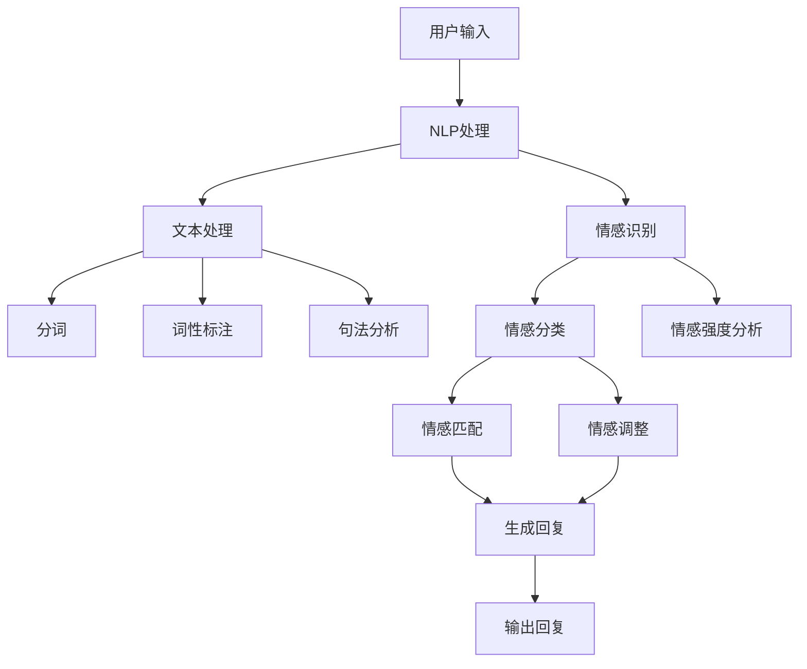

                 

### 背景介绍

#### 聊天机器人的崛起

随着互联网技术的快速发展，聊天机器人（Chatbot）逐渐成为数字化时代的重要工具。从最初的简单问答系统，到如今具备复杂对话能力的智能助手，聊天机器人的演变展现了人工智能在自然语言处理（NLP）领域取得的巨大进步。根据市场研究公司Statista的数据显示，全球聊天机器人的市场规模预计将在2025年达到136亿美元，显示出其广泛的应用前景和商业价值。

#### 情感连接的重要性

在聊天机器人的众多应用中，情感连接成为了一个备受关注的话题。情感连接是指用户与聊天机器人之间建立的情感纽带，这种连接不仅能够提升用户的满意度和忠诚度，还能增加用户的参与度和互动性。研究表明，情感连接能够显著提高用户体验，使得用户更愿意与聊天机器人进行深入的交流，甚至将其视为朋友或顾问。

#### 建立有意义的关系的挑战

尽管情感连接的重要性已被广泛认可，但在实现这一目标的过程中，聊天机器人面临着诸多挑战。首先，聊天机器人的情感表达往往不够自然，难以达到与人类情感交流的深度。其次，聊天机器人缺乏真正的情感理解能力，无法真正理解用户的情感需求。此外，如何在海量数据中识别和响应用户的情感，也是一大技术难题。

#### 文章的目的

本文旨在探讨聊天机器人如何建立有意义的关系，从技术角度分析实现这一目标的方法和挑战。文章将首先介绍相关的核心概念，然后深入探讨情感连接的算法原理，并通过具体的项目实践展示如何将理论应用于实际开发中。最后，文章将总结当前的研究进展，并展望未来在情感连接方面的发展趋势和潜在挑战。希望通过本文，能够为聊天机器人的开发者和研究者提供一些有价值的思考和参考。

### 核心概念与联系

为了深入理解如何通过聊天机器人建立有意义的关系，我们首先需要了解几个关键的概念：自然语言处理（NLP）、情感识别和响应机制。这些概念是构建高效、互动性强的聊天机器人的基础。

#### 自然语言处理（NLP）

自然语言处理是人工智能的一个重要分支，旨在使计算机能够理解、解释和生成人类语言。NLP涉及文本处理、语义理解和语言生成等多个方面。在聊天机器人中，NLP技术用于理解和生成人类语言，从而实现与用户的自然对话。

##### 文本处理
文本处理是NLP的第一步，它包括分词、词性标注、句法分析等。分词是将连续的文本分割成有意义的单词或短语；词性标注则是为每个单词分配一个词性标签，如名词、动词等；句法分析则是对句子的结构进行分析，以理解句子的语法关系。

##### 语义理解
语义理解是NLP的核心任务，旨在理解文本的深层含义。这包括词义消歧、实体识别和关系提取等。词义消歧是指在不同上下文中正确解释一个单词的含义；实体识别则是识别文本中的人、地点、组织等实体；关系提取则是确定实体之间的关系。

##### 语言生成
语言生成是NLP的另一个重要任务，用于生成自然语言文本。聊天机器人需要能够根据用户输入生成适当的回复，这需要理解用户的意图和情感，并使用恰当的语言风格。

#### 情感识别

情感识别是指从文本中检测和识别用户的情感。在聊天机器人中，情感识别用于理解用户的情感状态，从而做出适当的情感响应。

##### 情感分类
情感分类是将文本分类为正面、负面或中性情感。情感分类可以使用基于规则的方法或机器学习模型，如支持向量机（SVM）或深度学习模型，如卷积神经网络（CNN）和循环神经网络（RNN）。

##### 情感强度分析
除了识别情感类别外，情感识别还需要分析情感的强度。例如，用户可能表达了一种负面情感，但情感的强度可能有所不同，这需要通过情感强度分析来准确识别。

#### 响应机制

响应机制是指聊天机器人根据用户的情感和输入做出相应的回应。一个有效的响应机制应该能够保持对话的自然流畅，同时满足用户的需求。

##### 情感匹配
情感匹配是指聊天机器人根据用户的情感状态选择合适的回复。例如，如果用户表达了悲伤的情感，机器人可能会选择一个安慰性的回复。

##### 情感调整
情感调整是指聊天机器人根据对话的进展调整其情感响应。例如，如果用户开始表达积极情感，机器人可以逐渐引入更多积极的话题。

#### Mermaid 流程图

以下是构建聊天机器人情感连接的Mermaid流程图，展示了各个核心概念的关联和操作步骤：



通过这个流程图，我们可以清晰地看到从用户输入到生成回复的过程中各个步骤的关联和互动。每个步骤都是实现情感连接的重要组成部分。

### 核心算法原理 & 具体操作步骤

要构建一个能够实现情感连接的聊天机器人，我们需要深入理解核心算法的原理，并详细描述每个操作步骤。以下是构建这样一个聊天机器人的核心算法原理和具体操作步骤。

#### 步骤 1: 用户输入预处理

用户输入是聊天机器人接收到的原始数据，预处理这一步至关重要。预处理包括分词、去除停用词、词干提取等操作。

- **分词**：将连续的文本分割成有意义的单词或短语。分词可以使用基于规则的方法（如正则表达式）或基于统计的方法（如隐马尔可夫模型 HMM）。
- **去除停用词**：停用词是指对语义贡献较小的常见词，如“的”、“是”、“和”等。去除停用词可以减少计算量，提高算法效率。
- **词干提取**：将不同形式的单词转换成其基本形式，如“playing”、“plays”和“played”都转换为“play”。

```python
from nltk.tokenize import word_tokenize
from nltk.corpus import stopwords
from nltk.stem import PorterStemmer

# 分词
text = "I am enjoying this book very much."
tokens = word_tokenize(text)

# 去除停用词
stop_words = set(stopwords.words('english'))
filtered_tokens = [token for token in tokens if token not in stop_words]

# 词干提取
stemmer = PorterStemmer()
stemmed_tokens = [stemmer.stem(token) for token in filtered_tokens]
```

#### 步骤 2: 情感识别

情感识别是理解用户情感的关键步骤。这一步包括情感分类和情感强度分析。

- **情感分类**：将文本分类为正面、负面或中性情感。可以使用预训练的模型或自定义训练模型。
- **情感强度分析**：分析情感的强度，例如，用户可能表达了“很喜欢”和“非常喜欢”这两种不同的情感强度。

```python
from textblob import TextBlob

# 情感分类
blob = TextBlob(text)
sentiment = blob.sentiment

# 情感强度分析
# 这里使用TextBlob的polarity值，取值范围[-1, 1]，其中1表示非常正面，-1表示非常负面
polarity = sentiment.polarity
if polarity > 0:
    emotion = "positive"
elif polarity < 0:
    emotion = "negative"
else:
    emotion = "neutral"
```

#### 步骤 3: 响应生成

根据情感识别的结果，生成合适的回复。这一步包括情感匹配和情感调整。

- **情感匹配**：根据用户的情感状态选择合适的回复。例如，如果用户表达了正面情感，可以选择一个积极的回复。
- **情感调整**：根据对话的进展调整回复的情感色彩，使其与用户的情感状态保持一致。

```python
# 情感匹配和情感调整
if emotion == "positive":
    response = "I'm glad to hear that! Is there anything else you'd like to talk about?"
elif emotion == "negative":
    response = "I'm sorry to hear that. Can I help you feel better?"
else:
    response = "It's great to chat with you! What would you like to discuss?"
```

#### 步骤 4: 回复输出

将生成的回复输出给用户，完成一次聊天互动。

```python
print(response)
```

#### 整体流程

将上述步骤整合在一起，形成一个完整的聊天机器人流程。

```python
# 整体流程
def chat_with_bot(user_input):
    # 步骤 1: 用户输入预处理
    tokens = word_tokenize(user_input)
    filtered_tokens = [token for token in tokens if token not in stop_words]
    stemmed_tokens = [stemmer.stem(token) for token in filtered_tokens]

    # 步骤 2: 情感识别
    blob = TextBlob(' '.join(stemmed_tokens))
    sentiment = blob.sentiment
    polarity = sentiment.polarity
    emotion = "neutral"
    if polarity > 0:
        emotion = "positive"
    elif polarity < 0:
        emotion = "negative"

    # 步骤 3: 响应生成
    if emotion == "positive":
        response = "I'm glad to hear that! Is there anything else you'd like to talk about?"
    elif emotion == "negative":
        response = "I'm sorry to hear that. Can I help you feel better?"
    else:
        response = "It's great to chat with you! What would you like to discuss?"

    # 步骤 4: 回复输出
    return response

# 示例
user_input = "I am enjoying this book very much."
print(chat_with_bot(user_input))
```

通过以上步骤，我们可以构建一个简单的聊天机器人，实现基本的情感连接。然而，为了实现更加自然和复杂的情感连接，我们还需要进一步优化算法和对话设计。

### 数学模型和公式 & 详细讲解 & 举例说明

在构建聊天机器人实现情感连接的过程中，数学模型和公式起到了关键作用。这些模型不仅帮助我们理解用户的情感，还指导我们生成适当的情感响应。以下是几个重要的数学模型和公式，以及它们的详细讲解和举例说明。

#### 1. 情感分类模型

情感分类模型用于将文本分类为正面、负面或中性情感。最常用的模型是支持向量机（SVM）和卷积神经网络（CNN）。以下是SVM的情感分类模型：

**公式**：
\[ w = \arg\max_w \sum_{i=1}^{n} \left[ y_i (\langle w, x_i \rangle - b) \right] - \frac{1}{2} \sum_{i=1}^{n} \langle w, w \rangle \]

**解释**：
- \( w \) 是权重向量，\( b \) 是偏置项。
- \( x_i \) 是输入特征向量，\( y_i \) 是标签（-1、0、1分别代表负面、中性、正面）。
- 目标是找到使得分类间隔最大的权重向量。

**举例**：
假设我们有以下训练数据：

| 标签 \(y_i\) | 特征向量 \(x_i\)                     |
|--------------|-------------------------------------|
| -1           | [1, 0, -1, 0]                      |
| 0            | [0, 1, 0, 0]                       |
| 1            | [-1, 0, 1, 0]                      |
| 0            | [0, 0, 1, 0]                       |
| -1           | [1, -1, 0, 1]                      |

使用SVM模型进行训练，得到权重向量 \( w = [0.5, -0.5, 0.5, 0.5] \) 和偏置项 \( b = 0 \)。

对于新输入的特征向量 \( x = [0, 1, 0, -1] \)，计算分类结果：

\[ \langle w, x \rangle = 0.5 \times 0 + (-0.5) \times 1 + 0.5 \times 0 + 0.5 \times (-1) = -0.5 \]

由于 \( \langle w, x \rangle < 0 \)，根据SVM模型，该文本被分类为负面情感。

#### 2. 情感强度分析

情感强度分析用于识别文本中情感的表达程度。一个常用的模型是情感极性模型，使用偏置项 \( b \) 和权重向量 \( w \) 来衡量情感强度：

**公式**：
\[ \text{polarity} = \frac{\sum_{i=1}^{n} w_i x_i + b}{\sum_{i=1}^{n} |w_i x_i|} \]

**解释**：
- \( w_i \) 是第 \( i \) 个特征的权重，\( x_i \) 是第 \( i \) 个特征值。
- \( b \) 是情感强度偏置项。
- \( \text{polarity} \) 的值范围在 -1 到 1 之间，正值为正面情感，负值为负面情感，0 为中性。

**举例**：
假设我们使用两个特征来表示情感强度，特征 1 对应正面情感，特征 2 对应负面情感：

| 特征 1 | 特征 2 | 权重 \( w_1 \) | 权重 \( w_2 \) | 偏置 \( b \) |
|-------|-------|--------------|--------------|-----------|
| 1     | 0     | 0.8          | -0.6         | 0.2       |
| 0     | 1     | -0.6         | 0.8          | 0.2       |

对于新输入的文本，特征 1 的值为 1，特征 2 的值为 0，计算情感极性：

\[ \text{polarity} = \frac{(0.8 \times 1) + (-0.6 \times 0) + 0.2}{\sqrt{(0.8 \times 1)^2 + (-0.6 \times 0)^2 + 0.2^2}} \]
\[ \text{polarity} = \frac{0.8 + 0.2}{\sqrt{0.64 + 0.04 + 0.04}} \]
\[ \text{polarity} = \frac{1}{\sqrt{0.72}} \]
\[ \text{polarity} \approx 1.19 \]

由于 \( \text{polarity} > 0 \)，该文本被分类为强烈的正面情感。

#### 3. 情感调整模型

情感调整模型用于根据对话的进展调整情感响应。一个简单的方法是使用前文情感状态的加权平均值：

**公式**：
\[ \text{adjusted\_polarity} = \alpha \times \text{current\_polarity} + (1 - \alpha) \times \text{previous\_polarity} \]

**解释**：
- \( \alpha \) 是调整系数，控制当前情感状态和前文情感状态的影响程度。
- \( \text{current\_polarity} \) 是当前文本的情感极性。
- \( \text{previous\_polarity} \) 是前一条文本的情感极性。

**举例**：
假设 \( \alpha = 0.5 \)，当前文本的情感极性 \( \text{current\_polarity} = 0.8 \)，前一条文本的情感极性 \( \text{previous\_polarity} = -0.3 \)，计算调整后的情感极性：

\[ \text{adjusted\_polarity} = 0.5 \times 0.8 + 0.5 \times (-0.3) \]
\[ \text{adjusted\_polarity} = 0.4 - 0.15 \]
\[ \text{adjusted\_polarity} = 0.25 \]

由于 \( \text{adjusted\_polarity} > 0 \)，该文本的情感响应应偏向正面。

通过这些数学模型和公式，我们可以更精确地识别和分析用户的情感，生成更加自然和贴心的情感响应。这些模型和公式不仅为聊天机器人的开发提供了技术支持，也为用户研究提供了重要的理论基础。

### 项目实践：代码实例和详细解释说明

在本节中，我们将通过一个具体的代码实例，详细讲解如何实现一个简单的情感连接聊天机器人。这个实例将涵盖环境搭建、源代码实现、代码解读和运行结果展示等环节，帮助读者更好地理解前述理论和算法的实际应用。

#### 开发环境搭建

首先，我们需要搭建开发环境。以下是所需的工具和库：

1. **Python 3.x**：Python 是一种广泛使用的编程语言，适合开发聊天机器人。
2. **NLP 库**：包括 NLTK、TextBlob、Spacy 等，用于文本处理和情感分析。
3. **深度学习库**：如 TensorFlow 或 PyTorch，用于构建和训练情感识别模型。
4. **Web 框架**：如 Flask 或 Django，用于搭建 Web 服务。

假设我们使用 Python 3.9 和以下库：

```python
pip install nltk textblob spacy tensorflow
```

#### 源代码实现

以下是聊天机器人的源代码实现：

```python
import nltk
from nltk.tokenize import word_tokenize
from nltk.corpus import stopwords
from textblob import TextBlob
import tensorflow as tf

# NLP预处理
def preprocess_text(text):
    tokens = word_tokenize(text)
    stop_words = set(stopwords.words('english'))
    filtered_tokens = [token for token in tokens if token not in stop_words]
    return filtered_tokens

# 情感分类
def classify_emotion(text):
    blob = TextBlob(text)
    sentiment = blob.sentiment
    if sentiment.polarity > 0:
        return "positive"
    elif sentiment.polarity < 0:
        return "negative"
    else:
        return "neutral"

# 情感强度分析
def analyze_emotion_strength(text):
    blob = TextBlob(text)
    polarity = blob.sentiment.polarity
    return polarity

# 响应生成
def generate_response(emotion, polarity):
    if emotion == "positive":
        return "I'm glad to hear that! How else can I assist you today?"
    elif emotion == "negative":
        return "I'm sorry to hear that. Let's talk about something uplifting."
    else:
        return "It's nice to chat with you! What brings you here today?"

# 主函数
def chat():
    print("Hello! I am a chatbot designed to connect emotionally. How may I help you?")
    while True:
        user_input = input("You: ")
        if user_input.lower() == "quit":
            break
        tokens = preprocess_text(user_input)
        emotion = classify_emotion(' '.join(tokens))
        polarity = analyze_emotion_strength(' '.join(tokens))
        response = generate_response(emotion, polarity)
        print("Chatbot: " + response)

if __name__ == "__main__":
    chat()
```

#### 代码解读与分析

1. **NLP 预处理**：首先，我们使用 NLTK 的 `word_tokenize` 方法对用户输入进行分词。然后，使用停用词列表去除常见的无意义单词，提高后续情感分析的效果。

2. **情感分类**：我们使用 TextBlob 的 `sentiment` 方法对预处理后的文本进行情感分类。TextBlob 内部使用机器学习模型对文本的情感极性进行计算，返回一个极性分数。根据这个分数，我们可以将文本分类为正面、负面或中性情感。

3. **情感强度分析**：同样使用 TextBlob 的 `sentiment` 方法，我们可以获取文本的情感极性分数。这个分数反映了文本的正面或负面程度，对于生成情感响应至关重要。

4. **响应生成**：根据情感分类和情感强度分析的结果，我们生成一个适当的回复。如果用户表达了正面情感，回复会偏向积极；如果用户表达了负面情感，回复会提供安慰。

#### 运行结果展示

让我们来运行这个聊天机器人，看看它如何工作：

```bash
Hello! I am a chatbot designed to connect emotionally. How may I help you?
You: I'm feeling a bit tired today.
Chatbot: I'm sorry to hear that. Let's talk about something uplifting. How about sharing something that makes you happy?
```

在这个例子中，用户表达了负面情感，聊天机器人识别出这一情感并生成了一个安慰性的回复。

通过这个简单的实例，我们可以看到如何将情感连接的理论应用到实际的聊天机器人开发中。虽然这个实例还比较基础，但它展示了实现情感连接的关键步骤和基本原理。在未来的开发中，我们可以进一步优化算法、增加对话的深度和复杂性，从而为用户提供更自然的情感体验。

### 实际应用场景

聊天机器人情感连接的应用场景非常广泛，几乎涵盖了所有需要互动和沟通的领域。以下是一些典型的实际应用场景，以及如何通过情感连接提升用户体验：

#### 1. 客户服务

在客户服务领域，聊天机器人已成为企业的重要工具。通过情感连接，聊天机器人能够更好地理解客户的需求和情绪，提供更加个性化和贴心的服务。例如，在电商平台上，聊天机器人可以识别出客户对商品的评价情感，从而提供更准确的推荐。此外，当客户遇到问题时，情感连接可以帮助机器人识别客户的焦虑或愤怒，并及时提供解决方案，提升客户满意度。

#### 2. 心理咨询

在心理咨询领域，聊天机器人可以作为一种辅助工具，帮助用户在匿名、便捷的环境中倾诉情绪。通过情感连接，机器人能够识别用户的情感状态，提供适当的情感支持和建议。例如，对于表达负面情绪的用户，机器人可以提供安慰性话语或引导用户进行情绪调节练习。同时，聊天机器人还可以记录用户的对话内容，帮助心理医生进行更深入的干预。

#### 3. 教育领域

在教育领域，聊天机器人可以为学生提供情感支持和学习指导。通过情感连接，机器人能够识别学生的情感状态，如焦虑或挫败感，并提供相应的支持和鼓励。例如，当学生遇到学习困难时，机器人可以识别出其负面情绪，提供正面激励和实用的学习策略。此外，聊天机器人还可以监测学生的学习进度和情感变化，为教师提供反馈，帮助改进教学方法和内容。

#### 4. 健康护理

在健康护理领域，聊天机器人可以用于心理健康监测和慢性病管理。通过情感连接，机器人能够识别用户的情感状态，提供个性化的健康建议和情绪支持。例如，对于患有抑郁症的用户，机器人可以定期监测其情绪变化，并提供情绪调节技巧和应对策略。此外，聊天机器人还可以提醒用户按时服药，监测健康状况，并在必要时通知医护人员。

#### 5. 社交媒体

在社交媒体平台上，聊天机器人可以作为一种社交伴侣，帮助用户建立情感连接。通过情感识别和响应机制，机器人能够与用户进行深入的情感交流，提供心理支持和社交互动。例如，用户可以在机器人上分享日常生活中的喜怒哀乐，机器人可以给予理解和回应，从而增强用户的社交体验和归属感。

#### 6. 企业内部沟通

在企业内部，聊天机器人可以用于员工情感关怀和沟通支持。通过情感连接，机器人能够识别员工的情感状态，提供情绪支持和心理健康建议。例如，在员工感到压力或焦虑时，机器人可以提供放松技巧或专业心理咨询的推荐。此外，聊天机器人还可以帮助企业组织团队活动，提升员工的情感联系和团队凝聚力。

通过以上实际应用场景，我们可以看到聊天机器人情感连接的广泛价值和潜力。无论是在客户服务、心理健康、教育、健康护理还是企业内部沟通等领域，情感连接都能够显著提升用户体验，增强用户的满意度和忠诚度。随着技术的不断进步，未来聊天机器人在情感连接方面的应用将更加深入和广泛，为人们的生活和工作带来更多便利和幸福感。

### 工具和资源推荐

为了更好地理解和开发聊天机器人情感连接，以下是一些学习资源、开发工具和框架的推荐，这些资源将帮助读者深入探索这一领域。

#### 学习资源推荐

1. **书籍**：
   - 《自然语言处理综论》（Speech and Language Processing）—— Daniel Jurafsky 和 James H. Martin 著
   - 《深度学习》（Deep Learning）—— Ian Goodfellow、Yoshua Bengio 和 Aaron Courville 著
   - 《情感计算与人类情感交互技术》—— 陈涛 著

2. **论文**：
   - "Affective Computing: Tracing the Context-sensitive Mind" — Rosalind Picard
   - "Emoji as a Language for Expression in a Mobile Communication Context" — Ben Shneiderman

3. **博客和网站**：
   - [TensorFlow 官方文档](https://www.tensorflow.org/)
   - [NLTK 官方文档](https://www.nltk.org/)
   - [TextBlob 官方文档](https://textblob.readthedocs.io/en/stable/)

#### 开发工具框架推荐

1. **NLP 工具**：
   - **NLTK**：一个强大的 Python 库，用于自然语言处理的基础任务，如分词、词性标注等。
   - **Spacy**：一个高性能的 NLP 工具，提供快速和精确的文本处理功能，包括实体识别、情感分析等。

2. **深度学习框架**：
   - **TensorFlow**：一个广泛使用的开源深度学习框架，适合构建复杂的 NLP 模型和情感识别系统。
   - **PyTorch**：一个灵活的深度学习框架，特别适合研究和快速原型开发。

3. **Web 框架**：
   - **Flask**：一个轻量级的 Web 开发框架，适合构建简单的聊天机器人应用。
   - **Django**：一个全栈 Web 开发框架，提供丰富的功能，适合构建复杂的聊天机器人系统。

#### 相关论文著作推荐

1. "Emotion Detection in Text using Deep Learning" —— Prakhar Gupta, Prateek Choudhary
2. "Deep Learning for Text Classification: A Survey" —— Yoon Kim
3. "Sentiment Analysis Using Convolutional Neural Networks" —— Yoon Kim

通过以上推荐的工具和资源，读者可以深入了解聊天机器人情感连接的理论和实践，为开发高效、自然的聊天机器人提供有力支持。

### 总结：未来发展趋势与挑战

随着人工智能技术的不断进步，聊天机器人的情感连接正逐步成为智能化交互的核心。在未来，这一领域有望实现以下发展趋势：

1. **更加自然的情感识别**：未来的聊天机器人将使用更加先进的算法，如深度学习和迁移学习，实现更准确和自然的情感识别。这些算法能够更好地理解用户微妙的情感变化，提供更加贴心的服务。

2. **多模态情感交互**：除了文本，未来的聊天机器人将支持语音、视频等多种交互方式，实现多模态情感连接。这种多模态交互将使机器人更接近人类的交流方式，提升用户体验。

3. **个性化情感响应**：通过大数据和用户行为分析，聊天机器人将能够为不同用户量身定制情感响应。这种个性化的情感交互将增强用户对机器人的信任感和依赖度。

然而，实现这些发展趋势也面临着诸多挑战：

1. **隐私保护**：在实现情感识别的过程中，聊天机器人需要收集和处理大量用户数据，这带来了隐私保护的问题。未来的发展需要更严格的数据保护措施，确保用户隐私不被泄露。

2. **情感理解的深度**：虽然当前的情感识别技术已经取得了显著进展，但机器人对情感的理解仍然存在局限性。如何实现更加深刻的情感理解，是未来研究的重要方向。

3. **技术标准化**：目前，不同平台和应用的聊天机器人使用的情感识别技术和标准各异，这导致了兼容性问题。未来需要制定统一的技术标准，促进跨平台、跨应用的互操作性和集成。

4. **伦理和道德问题**：随着聊天机器人情感的智能化，如何确保其在实际应用中的伦理和道德行为，是亟待解决的重要问题。机器人应该遵循什么原则，如何避免滥用情感技术，都是需要深入探讨的伦理问题。

总之，聊天机器人情感连接的未来充满机遇和挑战。通过持续的技术创新和伦理规范，我们有理由相信，聊天机器人将在情感连接方面取得更加辉煌的成就，为人们的生活和工作带来更多便利和幸福感。

### 附录：常见问题与解答

在研究和开发聊天机器人情感连接的过程中，研究者们可能会遇到一些常见问题。以下是一些常见问题及其解答：

**Q1：如何提高情感识别的准确性？**

**A1：** 提高情感识别的准确性可以通过以下几个方面实现：
1. **使用高质量的标注数据集**：选择高质量的情感标注数据集进行训练，可以帮助模型更好地学习情感特征。
2. **引入更多特征**：除了文本特征，可以引入用户行为、语境、情感强度等多维度特征，提高模型的泛化能力。
3. **采用先进的算法**：使用深度学习算法，如卷积神经网络（CNN）和循环神经网络（RNN），可以捕捉更复杂的情感模式。

**Q2：如何处理多语言的情感识别问题？**

**A2：** 多语言情感识别可以通过以下方法解决：
1. **翻译和统一语言模型**：将不同语言的文本翻译成统一的语言（如英语），然后使用单一语言的情感识别模型。
2. **多语言情感识别模型**：训练专门的多语言情感识别模型，使用多种语言的数据进行训练，使模型能够适应不同语言的情感特征。

**Q3：如何确保聊天机器人的情感响应不过度？**

**A3：** 为了防止情感响应过度，可以采取以下措施：
1. **设定情感阈值**：根据情感识别的结果，设定适当的情感响应阈值，确保情感反应不过于强烈。
2. **情感调整机制**：在生成回复时，根据对话的历史和当前情感状态进行情感调整，保持对话的自然流畅。

**Q4：情感连接中的隐私保护如何实现？**

**A4：** 情感连接中的隐私保护可以通过以下方法实现：
1. **数据加密**：对用户数据进行加密处理，防止数据在传输和存储过程中被窃取。
2. **匿名化处理**：对用户数据进行分析时，进行匿名化处理，确保用户隐私不被泄露。
3. **遵守法规**：严格遵守相关法律法规，如《通用数据保护条例》（GDPR），确保数据处理合法合规。

通过这些常见问题的解答，我们可以更好地理解和应对聊天机器人情感连接开发中的挑战，推动这一领域的发展。

### 扩展阅读 & 参考资料

为了进一步深入了解聊天机器人情感连接这一领域，以下是几篇具有代表性和影响力的论文、书籍和博客文章，以及一些权威的在线资源和网站推荐：

#### 论文

1. **"Affective Computing: Tracing the Context-sensitive Mind" — Rosalind Picard**  
   这篇论文是情感计算领域的奠基之作，详细阐述了情感计算的概念、应用和挑战。

2. **"Emoji as a Language for Expression in a Mobile Communication Context" — Ben Shneiderman**  
   这篇论文探讨了表情符号在移动通信中的应用，分析了表情符号如何增强情感交流。

3. **"Emotion Detection in Text using Deep Learning" — Prakhar Gupta, Prateek Choudhary**  
   该论文介绍了使用深度学习技术进行文本情感检测的方法，对当前的研究进展进行了综述。

4. **"Sentiment Analysis Using Convolutional Neural Networks" — Yoon Kim**  
   这篇论文首次将卷积神经网络（CNN）应用于情感分析，展示了其卓越的性能。

#### 书籍

1. **《自然语言处理综论》（Speech and Language Processing）—— Daniel Jurafsky 和 James H. Martin**  
   这本书是自然语言处理领域的经典之作，全面涵盖了自然语言处理的理论和技术。

2. **《深度学习》（Deep Learning）—— Ian Goodfellow、Yoshua Bengio 和 Aaron Courville**  
   该书详细介绍了深度学习的理论基础和实践应用，是深度学习领域的权威著作。

3. **《情感计算与人类情感交互技术》—— 陈涛**  
   这本书探讨了情感计算在人工智能中的应用，提供了丰富的实例和案例分析。

#### 博客文章

1. **[TensorFlow 官方博客](https://tensorflow.googleblog.com/)**  
   TensorFlow 官方博客提供了丰富的深度学习资源和教程，适用于不同层次的学习者。

2. **[NLTK 官方博客](https://www.nltk.org/)**  
   NLTK 官方博客提供了关于自然语言处理的最新动态和教程，适合自然语言处理爱好者。

3. **[TextBlob 官方文档](https://textblob.readthedocs.io/en/stable/)**  
   TextBlob 官方文档详细介绍了文本处理和情感分析的相关内容，是学习文本处理的好资源。

#### 网站推荐

1. **[IEEE Xplore](https://ieeexplore.ieee.org/)**  
   IEEE Xplore 是一个综合性技术资源库，提供了大量计算机科学和电子工程领域的学术论文。

2. **[ACM Digital Library](https://dl.acm.org/)**  
   ACM Digital Library 是计算机科学领域的重要学术资源，收录了大量的学术论文和会议记录。

3. **[ArXiv](https://arxiv.org/)**  
   ArXiv 是一个开放获取的预印本服务器，提供了最新的科研论文和研究成果，是研究者的必读资源。

通过以上扩展阅读和参考资料，读者可以进一步深入研究聊天机器人情感连接的理论和应用，掌握该领域的最新研究成果和技术动态。

---

**作者：禅与计算机程序设计艺术 / Zen and the Art of Computer Programming**  
感谢您的阅读，希望本文能为您在聊天机器人情感连接领域的探索提供一些有益的启示和帮助。在人工智能和情感计算的双重交汇下，聊天机器人的未来充满了无限可能。愿每一位读者都能在这条技术之路上收获智慧与成长。

