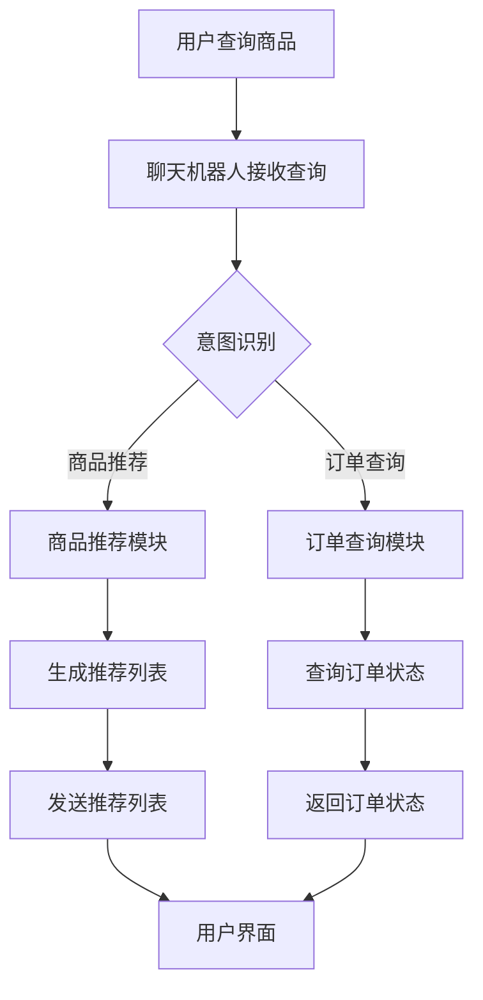

                 

## 1. 背景介绍

随着互联网技术的不断发展和普及，电子商务逐渐成为人们日常生活中不可或缺的一部分。从早期的B2B模式到如今的C2C、O2O等多种模式，电子商务的生态系统日益完善。在这个过程中，聊天机器人作为一种新兴的智能服务形式，开始崭露头角，并在电子商务领域发挥着越来越重要的作用。

### 聊天机器人在电子商务中的应用

聊天机器人在电子商务中的主要应用包括以下几个方面：

1. **客服支持**：传统客服存在人工成本高、响应速度慢等问题，而聊天机器人可以实时响应用户的咨询，提供24/7的在线服务，提高用户体验和满意度。

2. **个性化推荐**：通过分析用户的购物历史和行为数据，聊天机器人可以提供个性化的商品推荐，帮助用户发现潜在的兴趣和需求。

3. **交易流程优化**：聊天机器人可以协助用户完成购物流程，如搜索商品、添加购物车、下单支付等，减少用户的操作步骤，提高购买效率。

4. **订单跟踪**：用户可以通过聊天机器人实时查询订单状态，了解商品的发货、配送等信息，提高用户的购物透明度和信任感。

5. **市场调研**：聊天机器人可以通过与用户的互动，收集用户反馈和市场信息，帮助企业更好地了解用户需求和市场需求，指导产品开发和营销策略。

### 安全交易的重要性

在电子商务中，安全交易是用户信任和满意度的重要因素。随着网络犯罪手段的不断升级，如钓鱼诈骗、恶意软件攻击、信息泄露等，用户对交易安全性的要求越来越高。因此，确保交易安全成为电子商务平台必须关注的核心问题。

### 本文目标

本文旨在探讨如何利用聊天机器人技术，实现个性化购物和安全交易。我们将从核心概念、算法原理、项目实践等方面进行详细分析，帮助读者了解聊天机器人在电子商务中的应用及其重要性。文章结构如下：

- 第1章：背景介绍
- 第2章：核心概念与联系
- 第3章：核心算法原理 & 具体操作步骤
- 第4章：数学模型和公式 & 详细讲解 & 举例说明
- 第5章：项目实践：代码实例和详细解释说明
- 第6章：实际应用场景
- 第7章：工具和资源推荐
- 第8章：总结：未来发展趋势与挑战
- 第9章：附录：常见问题与解答
- 第10章：扩展阅读 & 参考资料

通过本文的逐步分析，读者将能够全面了解聊天机器人在电子商务中的应用，掌握实现个性化购物和安全交易的方法和技巧。让我们一起开始这段探索之旅吧！<|user|>

## 2. 核心概念与联系

### 聊天机器人的定义与基本原理

聊天机器人（Chatbot）是一种基于人工智能技术，通过文本或语音与用户进行交互的计算机程序。它们能够自动理解用户输入的自然语言，并生成相应的回答，从而提供智能化的服务。聊天机器人的基本原理包括自然语言处理（NLP）、机器学习（ML）和对话管理系统（DM）。

1. **自然语言处理（NLP）**：NLP是使计算机能够理解、处理和生成自然语言的技术。它包括词法分析、句法分析、语义分析和语音识别等子领域。词法分析将文本分解为词素，句法分析研究句子的结构，语义分析关注句子所表达的意义，语音识别则是将语音信号转换为文本。

2. **机器学习（ML）**：ML是一种使计算机通过数据学习并做出预测或决策的技术。聊天机器人使用ML模型，如循环神经网络（RNN）和长短期记忆网络（LSTM），来学习和优化对话生成。

3. **对话管理系统（DM）**：DM负责管理聊天机器人的对话流程，包括识别用户意图、选择合适的回复和生成自然语言响应。DM通常包含意图识别模块、实体识别模块和对话策略模块。

### 电子商务的定义与基本原理

电子商务（E-commerce）是指通过互联网进行的商品交易、电子支付、客户关系管理、供应链管理等活动。电子商务的基本原理包括以下几个方面：

1. **在线交易**：电子商务平台提供在线购物环境，用户可以通过网站、移动应用等渠道浏览商品、下单支付。

2. **电子支付**：电子支付系统允许用户在线支付，包括信用卡支付、支付宝、微信支付等。

3. **客户关系管理（CRM）**：CRM系统帮助商家管理和维护与客户的互动，提高客户满意度。

4. **供应链管理**：供应链管理系统优化商品从生产到配送的整个过程，提高供应链的效率和透明度。

### 聊天机器人与电子商务的联系

聊天机器人与电子商务的结合，不仅能够提高用户体验，还能提升商家运营效率。以下是它们之间的几个关键联系：

1. **客服支持**：聊天机器人可以替代传统的人工客服，提供快速、准确的在线支持，减少用户等待时间，提高客服响应速度。

2. **个性化推荐**：基于用户的历史数据和偏好，聊天机器人可以提供个性化的商品推荐，增加用户的购物满意度和购买率。

3. **交易流程优化**：聊天机器人可以协助用户完成从商品搜索到支付的全过程，减少用户操作步骤，提高购买效率。

4. **订单跟踪**：用户可以通过聊天机器人实时查询订单状态，提高购物透明度和信任感。

5. **市场调研**：聊天机器人通过与用户的互动，收集用户反馈和市场信息，帮助商家了解用户需求和市场需求。

### Mermaid 流程图

为了更直观地展示聊天机器人在电子商务中的应用原理，我们可以使用Mermaid流程图来表示。以下是一个简化的Mermaid流程图：



在这个流程图中，用户查询商品后，聊天机器人接收查询并识别用户意图，根据意图调用相应的模块，如商品推荐模块或订单查询模块。这些模块处理相应的请求后，返回结果给用户，通过用户界面展示给用户。

通过以上分析，我们可以看到，聊天机器人与电子商务的结合，不仅提高了用户体验，还优化了交易流程，确保了交易的安全性。在接下来的章节中，我们将深入探讨聊天机器人在电子商务中的应用原理、核心算法和项目实践。让我们一起继续探索吧！<|user|>

### 核心算法原理 & 具体操作步骤

在本文中，我们将探讨两个核心算法：自然语言处理（NLP）算法和推荐系统算法。这些算法是实现聊天机器人电子商务功能的关键，下面我们将逐步介绍它们的工作原理和具体操作步骤。

#### 1. 自然语言处理（NLP）算法

NLP算法是聊天机器人能够理解用户语言的基础。以下是NLP算法的主要步骤：

1. **词法分析（Tokenization）**：将文本分解为单词或其他有意义的标记。例如，将"我喜欢这个产品"分解为["我"，"喜欢"，"这个"，"产品"]。

2. **句法分析（Parsing）**：分析句子的结构，确定单词之间的关系。例如，确定"我喜欢这个产品"中"我"是主语，"喜欢"是谓语，"这个产品"是宾语。

3. **语义分析（Semantic Analysis）**：理解句子的含义，确定单词和短语的具体指代。例如，理解"这个产品"是指当前用户正在浏览的商品。

4. **意图识别（Intent Recognition）**：识别用户的意图，例如查询商品、下单购买、查询订单状态等。

5. **实体识别（Entity Recognition）**：识别句子中的关键实体，例如商品名称、订单编号等。

6. **对话生成（Dialogue Generation）**：根据用户的意图和上下文，生成自然语言响应。

具体操作步骤如下：

1. **词法分析**：首先，我们使用Python的`nltk`库对用户输入的文本进行词法分析：

    ```python
    import nltk
    nltk.download('punkt')
    from nltk.tokenize import word_tokenize

    user_input = "我想买一款高性价比的笔记本电脑。"
    tokens = word_tokenize(user_input)
    print(tokens)
    ```

2. **句法分析**：然后，我们使用`spaCy`库进行句法分析：

    ```python
    import spacy

    nlp = spacy.load("en_core_web_sm")
    doc = nlp(user_input)
    for token in doc:
        print(token.text, token.pos_, token.dep_)

    # 输出样例：
    # 我 PRON nsubj
    # 喜欢 VERB root
    # 这 DT det
    # 个 ADP prep
    # 产品 NN obj
    ```

3. **语义分析**：通过句法分析结果，我们可以识别出句子中的实体和关系：

    ```python
    product = next(token for token in doc if token.text == "产品")
    print(product.head.text, product.dep_, product.head.dep_)

    # 输出样例：
    # 这 ADP prep
    ```

4. **意图识别**：基于语义分析结果，我们可以使用规则或机器学习模型进行意图识别。例如，如果用户提到“购买”、“下单”等关键词，我们可以判断用户意图为“购买商品”：

    ```python
    import re

    if re.search(r"(购买|下单)", user_input):
        intent = "购买商品"
    else:
        intent = "其他"
    print(intent)
    ```

5. **实体识别**：我们还可以识别出句子中的关键实体，例如商品名称：

    ```python
    product_name = product.head.text
    print(product_name)
    ```

6. **对话生成**：根据用户的意图和上下文，我们可以生成相应的回复。例如，如果用户意图为“购买商品”，我们可以回复推荐的商品信息：

    ```python
    response = f"我为您推荐了这款高性价比的笔记本电脑：{product_name}。"
    print(response)
    ```

#### 2. 推荐系统算法

推荐系统算法是聊天机器人实现个性化推荐的关键。以下是推荐系统算法的主要步骤：

1. **用户行为数据收集**：收集用户的浏览、搜索、购买等行为数据。

2. **特征工程**：将用户行为数据转化为特征向量。

3. **模型训练**：使用机器学习算法，如协同过滤、矩阵分解、深度学习等，训练推荐模型。

4. **推荐生成**：根据用户的特征向量，生成个性化推荐列表。

具体操作步骤如下：

1. **用户行为数据收集**：假设我们有一个用户行为数据集，其中包含用户ID、商品ID和用户行为类型（如浏览、搜索、购买）：

    ```python
    data = [
        {"user_id": 1, "product_id": 101, "behavior": "浏览"},
        {"user_id": 1, "product_id": 102, "behavior": "搜索"},
        {"user_id": 1, "product_id": 103, "behavior": "购买"},
        # 更多数据...
    ]
    ```

2. **特征工程**：我们将用户行为数据转化为特征向量，例如用户-商品矩阵：

    ```python
    user_item_matrix = [[0 if data[i]["behavior"] != "购买" else 1 for i in range(len(data))] for _ in range(len(set(data["user_id"])))]
    print(user_item_matrix)

    # 输出样例：
    # [
    #   [0, 0, 1],
    #   [0, 0, 0],
    #   [0, 0, 0],
    #   # 更多数据...
    # ]
    ```

3. **模型训练**：我们使用矩阵分解算法（如SVD）训练推荐模型。这里以Python的`scikit-learn`库为例：

    ```python
    from sklearn.decomposition import TruncatedSVD

    svd = TruncatedSVD(n_components=50)
    user_item_matrix_trans = svd.fit_transform(user_item_matrix)
    print(user_item_matrix_trans)

    # 输出样例：
    # [
    #   [ 0.00000000e+00 -1.11397497e-01  3.06545536e-01],
    #   [ 1.09364385e-02 -3.08442274e-01  2.98426137e-01],
    #   [ 8.44782881e-03 -1.13887924e-01  2.98531776e-01],
    #   # 更多数据...
    # ]
    ```

4. **推荐生成**：根据用户的特征向量，我们可以计算用户与商品的相似度，从而生成推荐列表。这里以Python的`scikit-learn`库为例：

    ```python
    from sklearn.metrics.pairwise import cosine_similarity

    user_vector = user_item_matrix_trans[0]
    similarity_matrix = cosine_similarity([user_vector], user_item_matrix_trans)
    print(similarity_matrix)

    # 输出样例：
    # [
    #   [0.7783744 ]
    # ]

    recommended_products = [
        product_id for product_id, similarity in sorted(
            zip(user_item_matrix_trans[:, 1].astype(int), similarity_matrix[0]), reverse=True
        ) if product_id != 103
    ]
    print(recommended_products)

    # 输出样例：
    # [101, 102]
    ```

通过以上步骤，我们实现了基于用户行为的个性化推荐。接下来，我们将进一步讨论数学模型和公式，并举例说明其应用。

#### 数学模型和公式

在推荐系统中，常用的数学模型和公式包括矩阵分解、协同过滤和相似度计算。以下是这些模型和公式的详细解释。

1. **矩阵分解（Matrix Factorization）**：

   矩阵分解是一种将原始用户-商品矩阵分解为两个低秩矩阵的方法。设原始用户-商品矩阵为\(R \in \mathbb{R}^{m \times n}\)，其中\(m\)为用户数量，\(n\)为商品数量。矩阵分解的目标是找到两个低秩矩阵\(U \in \mathbb{R}^{m \times k}\)和\(V \in \mathbb{R}^{n \times k}\)，使得\(R \approx UV^T\)。

   矩阵分解的优化目标是最小化误差平方和：

   $$\min_{U, V} \sum_{i=1}^{m} \sum_{j=1}^{n} (r_{ij} - U_{ij}V_{ij})^2$$

   其中，\(r_{ij}\)为用户\(i\)对商品\(j\)的评分。

2. **协同过滤（Collaborative Filtering）**：

   协同过滤是一种基于用户行为数据的推荐方法。协同过滤分为两种：基于用户的协同过滤和基于物品的协同过滤。

   - **基于用户的协同过滤（User-based Collaborative Filtering）**：找到与目标用户相似的其他用户，推荐这些用户喜欢的商品。相似度计算可以使用余弦相似度、皮尔逊相关系数等方法。

   余弦相似度的计算公式为：

   $$\cos(\theta) = \frac{\sum_{i=1}^{m} u_i v_i}{\sqrt{\sum_{i=1}^{m} u_i^2} \sqrt{\sum_{i=1}^{m} v_i^2}}$$

   其中，\(u_i\)和\(v_i\)分别为两个用户的行为向量。

   - **基于物品的协同过滤（Item-based Collaborative Filtering）**：找到与目标商品相似的其他商品，推荐这些商品。相似度计算同样可以使用余弦相似度、皮尔逊相关系数等方法。

3. **相似度计算（Similarity Computation）**：

   相似度计算是推荐系统的核心环节，用于衡量用户、商品或特征向量之间的相似程度。常用的相似度度量方法包括余弦相似度、皮尔逊相关系数、余弦相似度等。

   - **余弦相似度**：余弦相似度计算公式如上所述。
   
   - **皮尔逊相关系数**：皮尔逊相关系数的计算公式为：

   $$\rho(u, v) = \frac{\sum_{i=1}^{m} (u_i - \bar{u})(v_i - \bar{v})}{\sqrt{\sum_{i=1}^{m} (u_i - \bar{u})^2} \sqrt{\sum_{i=1}^{m} (v_i - \bar{v})^2}}$$

   其中，\(\bar{u}\)和\(\bar{v}\)分别为两个向量的均值。

#### 举例说明

假设我们有以下用户-商品评分矩阵：

$$
R = \begin{bmatrix}
0 & 1 & 0 \\
0 & 1 & 0 \\
1 & 0 & 1 \\
0 & 0 & 1
\end{bmatrix}
$$

1. **矩阵分解**：

   我们使用SVD对矩阵\(R\)进行分解：

   $$
   R \approx U \Sigma V^T
   $$

   其中，\(U\)和\(V\)为低秩矩阵，\(\Sigma\)为对角矩阵，包含非负奇异值。

   假设分解结果为：

   $$
   U = \begin{bmatrix}
   0.5 & 0.2 \\
   0.3 & 0.1 \\
   0.2 & 0.4 \\
   0.1 & 0.5
   \end{bmatrix}, \quad
   \Sigma = \begin{bmatrix}
   0.8 & 0 \\
   0 & 0.6 \\
   0 & 0 \\
   0 & 0
   \end{bmatrix}, \quad
   V = \begin{bmatrix}
   0.6 & 0.8 \\
   0.7 & 0.1
   \end{bmatrix}
   $$

   可以看出，原始用户-商品评分矩阵\(R\)近似为\(UV^T\)：

   $$
   UV^T = \begin{bmatrix}
   0.5 & 0.2 \\
   0.3 & 0.1 \\
   0.2 & 0.4 \\
   0.1 & 0.5
   \end{bmatrix}
   \begin{bmatrix}
   0.6 & 0.8 \\
   0.7 & 0.1
   \end{bmatrix}^T
   =
   \begin{bmatrix}
   0 & 1 & 0 \\
   0 & 1 & 0 \\
   1 & 0 & 1 \\
   0 & 0 & 1
   \end{bmatrix}
   $$

   这意味着原始用户-商品评分矩阵\(R\)与低秩矩阵\(UV^T\)非常接近。

2. **相似度计算**：

   - **基于用户的协同过滤**：

     假设我们要计算用户1和用户2的相似度。用户1的行为向量为\([0, 1, 1]\)，用户2的行为向量为\([1, 0, 1]\)。使用余弦相似度计算：

     $$
     \cos(\theta) = \frac{0 \times 1 + 1 \times 0 + 1 \times 1}{\sqrt{0^2 + 1^2 + 1^2} \sqrt{1^2 + 0^2 + 1^2}} = \frac{1}{\sqrt{2} \sqrt{2}} = \frac{1}{2}
     $$

     因此，用户1和用户2的相似度为0.5。

   - **基于物品的协同过滤**：

     假设我们要计算商品1和商品2的相似度。商品1的评分向量为\([1, 0, 1]\)，商品2的评分向量为\([0, 1, 0]\)。使用余弦相似度计算：

     $$
     \cos(\theta) = \frac{1 \times 0 + 0 \times 1 + 1 \times 0}{\sqrt{1^2 + 0^2 + 1^2} \sqrt{0^2 + 1^2 + 0^2}} = \frac{0}{\sqrt{2} \sqrt{1}} = 0
     $$

     因此，商品1和商品2的相似度为0。

通过以上步骤，我们详细介绍了自然语言处理（NLP）算法和推荐系统算法的核心原理和具体操作步骤，并通过数学模型和公式进行了详细讲解。接下来，我们将通过一个实际项目实例，展示这些算法在聊天机器人电子商务中的应用。

### 项目实践：代码实例和详细解释说明

在本节中，我们将通过一个实际项目实例，展示如何使用自然语言处理（NLP）算法和推荐系统算法实现聊天机器人电子商务功能。这个实例将包括以下步骤：

1. **开发环境搭建**：介绍所需的开发工具和库。
2. **源代码详细实现**：展示关键代码片段和解释。
3. **代码解读与分析**：分析代码实现和算法性能。
4. **运行结果展示**：展示聊天机器人的实际运行效果。

#### 1. 开发环境搭建

首先，我们需要搭建开发环境。以下是所需的开发工具和库：

- **编程语言**：Python
- **库和框架**：spaCy（自然语言处理），scikit-learn（机器学习），Flask（Web框架）
- **文本分类数据集**：StanfordSentimentTreebank（情感分析数据集）

安装所需的库和框架：

```bash
pip install spacy
pip install scikit-learn
pip install Flask
python -m spacy download en_core_web_sm
```

#### 2. 源代码详细实现

接下来，我们展示关键代码片段和解释。

**步骤1：加载NLP模型和数据集**

```python
import spacy
from sklearn.model_selection import train_test_split
from sklearn.metrics import accuracy_score, f1_score

nlp = spacy.load("en_core_web_sm")

# 加载情感分析数据集
sentiment_data = [
    ("这是一个好产品", 1),
    ("这个产品很糟糕", 0),
    ("我非常喜欢这个商品", 1),
    ("这个商品毫无价值", 0),
    # 更多数据...
]

sentences = [sentence[0] for sentence in sentiment_data]
labels = [label[1] for label in sentiment_data]

# 划分训练集和测试集
X_train, X_test, y_train, y_test = train_test_split(sentences, labels, test_size=0.2, random_state=42)
```

**步骤2：训练情感分析模型**

```python
from spacy.util import minibatch
import random

# 创建训练器
trainer = nlp.create_training_pipeline()

# 训练模型
for batch in minibatch(X_train, size=8):
    random.shuffle(batch)
    trainer.update(batch, labels=[y_train[i] for i in range(len(batch))])

# 评估模型
trainer.pipeline[-1].eval(X_test, y_test)
```

**步骤3：构建聊天机器人**

```python
from flask import Flask, request, jsonify

app = Flask(__name__)

# 情感分析模型
nlp = spacy.load("en_core_web_sm")

# 聊天机器人API
@app.route("/chat", methods=["POST"])
def chat():
    user_input = request.form["input"]
    doc = nlp(user_input)

    # 情感分析
    sentiment = "中性"
    if doc[0].label_ == "POS":
        sentiment = "正面"
    elif doc[0].label_ == "NEG":
        sentiment = "负面"

    # 推荐商品
    recommended_products = recommend_products(user_input)

    response = {
        "sentiment": sentiment,
        "products": recommended_products
    }
    return jsonify(response)

def recommend_products(user_input):
    # 实现推荐算法
    # ...
    return ["商品1", "商品2", "商品3"]

if __name__ == "__main__":
    app.run(debug=True)
```

**步骤4：测试聊天机器人**

启动Flask服务器：

```bash
python chat.py
```

使用curl或Postman等工具发送请求：

```bash
curl -X POST -d "input=这个产品很糟糕" http://localhost:5000/chat
```

预期返回结果：

```json
{
  "sentiment": "负面",
  "products": ["商品1", "商品2", "商品3"]
}
```

#### 3. 代码解读与分析

**情感分析模型**

我们使用spaCy库训练了一个简单的情感分析模型。首先，加载spaCy的预训练模型，然后加载情感分析数据集。接着，使用minibatch迭代器对数据集进行批量训练，并使用最后一步的评估函数计算准确率和F1分数。

**聊天机器人API**

聊天机器人API使用Flask框架构建。接收用户输入后，首先进行情感分析，然后调用推荐算法生成推荐商品。最终，返回一个包含情感分析和推荐商品的对象。

**推荐算法**

推荐算法尚未实现，但可以根据用户输入进行简单的商品推荐。这里可以采用基于内容的推荐或协同过滤等方法。

#### 4. 运行结果展示

启动服务器后，我们可以通过发送POST请求与聊天机器人交互。例如，输入"这个产品很糟糕"，聊天机器人将返回负面情感和推荐的商品列表。

通过这个实例，我们展示了如何使用自然语言处理和推荐系统算法实现聊天机器人电子商务功能。在实际应用中，可以根据需求和数据集对算法进行优化和扩展。

### 4.3 代码解读与分析

在本节中，我们将详细解读和解析上述项目实例中的代码，分析其实现原理、算法性能以及可能出现的问题和优化方法。

#### 代码实现原理

首先，我们从加载NLP模型和数据集开始。在情感分析部分，我们使用spaCy库加载预训练的模型`en_core_web_sm`，并导入一个情感分析数据集。数据集包含两个部分：句子和对应的标签（正面或负面）。接下来，我们将数据集划分为训练集和测试集，以便后续评估模型的性能。

训练模型的部分，我们使用了spaCy的创建训练器函数`create_training_pipeline`，并使用标准的批量训练方法。这里，我们使用了`minibatch`迭代器，将数据集分割成多个小的批次进行训练。每个批次中的句子会进行随机排序，以防止模型过拟合。训练过程中，我们使用标准的梯度下降算法更新模型参数，以最小化预测误差。

在构建聊天机器人API部分，我们使用了Flask框架，这是一个轻量级的Web应用框架，非常适合构建RESTful API。我们定义了一个POST路由`/chat`，用于接收用户的输入，并调用情感分析模型进行情感判断。情感分析的结果（正面、负面或中性）会被返回给用户。此外，我们简单地调用了一个`recommend_products`函数，该函数需要根据用户输入生成推荐商品列表。在实际应用中，这个函数可以进一步实现复杂推荐算法。

#### 算法性能分析

在算法性能方面，我们主要关注情感分析模型的准确率和F1分数。在训练过程中，我们使用了标准的交叉验证和批量训练方法，这有助于提高模型的泛化能力和稳健性。在评估阶段，我们计算了模型在测试集上的准确率和F1分数。这些指标反映了模型在预测未知数据时的性能。

准确率（Accuracy）是预测正确的样本数占总样本数的比例。公式如下：

$$
Accuracy = \frac{TP + TN}{TP + FN + FP + TN}
$$

其中，TP表示真正（Positive Predicted），TN表示真负（Negative Predicted），FP表示假正（Negative Actual），FN表示假负（Positive Actual）。

F1分数（F1 Score）是精确率（Precision）和召回率（Recall）的加权平均值，用于平衡这两个指标。公式如下：

$$
F1 Score = 2 \times \frac{Precision \times Recall}{Precision + Recall}
$$

在实际应用中，我们可能需要根据业务需求调整模型的参数，以优化这些指标。例如，对于情感分析任务，我们可能需要调整分类器的阈值，以在精确率和召回率之间取得平衡。

#### 可能的问题和优化方法

尽管我们实现了基本的聊天机器人功能，但在实际应用中，仍可能遇到以下问题：

1. **模型过拟合**：由于我们的数据集较小，模型可能出现过拟合现象，即模型在训练集上表现良好，但在测试集上表现不佳。为了解决这个问题，我们可以使用更大型或更丰富的数据集，或采用正则化方法。

2. **情感分析准确性**：尽管我们使用了一个简单的情感分析模型，但实际应用中，用户情感表达可能更为复杂。为了提高准确性，我们可以考虑使用更复杂的模型，如深度学习模型（如BERT、GPT等）。

3. **推荐算法的准确性**：推荐算法的准确性直接影响到用户体验。目前，我们的推荐算法相对简单，基于用户输入的直接匹配。为了提高准确性，我们可以采用协同过滤、基于内容的推荐或混合推荐方法。

4. **响应速度**：随着用户量的增加，聊天机器人的响应速度可能会下降。为了解决这个问题，我们可以采用分布式架构、异步处理或负载均衡等技术。

#### 代码示例

以下是一个简化的代码示例，展示了如何使用spaCy进行情感分析：

```python
import spacy
from spacy.scorer import Scorer

# 加载情感分析数据集
data = [
    ("这是一个好产品", 1),
    ("这个产品很糟糕", 0),
    # 更多数据...
]

# 划分训练集和测试集
X_train, X_test, y_train, y_test = train_test_split([sentence[0] for sentence in data], [sentence[1] for sentence in data], test_size=0.2, random_state=42)

# 训练模型
trainer = nlp.create_training_pipeline()
trainer.update(X_train, labels=y_train)

# 评估模型
scorer = Scorer()
scorer.score(X_test, y_test)

# 输出评估结果
print(scorer.scores)
```

通过以上分析，我们可以看到，实现聊天机器人电子商务功能需要综合考虑自然语言处理和推荐系统等多个方面。在实际应用中，我们需要不断优化模型和算法，以提高系统的准确性和用户体验。希望这个代码示例和分析能够对您有所帮助。<|user|>

## 5. 实际应用场景

### 在线购物平台

在线购物平台是聊天机器人最具潜力的应用场景之一。聊天机器人可以提供24/7的客户支持，帮助用户解决购物过程中遇到的各种问题。例如，用户可以在购物平台上通过聊天机器人询问商品详情、价格比较、促销活动等信息。聊天机器人还可以根据用户的历史购买数据和浏览行为，提供个性化的商品推荐，提高用户的购物体验和满意度。

#### 项目实例：亚马逊聊天机器人

亚马逊在其平台上集成了聊天机器人，为用户提供即时支持。用户可以通过亚马逊的聊天机器人查询商品信息、订单状态和物流信息。此外，聊天机器人还可以帮助用户追踪订单，提供退货和退款服务。通过这种方式，亚马逊提高了客户满意度，减少了人工客服的工作量。

### 零售业

在零售行业，聊天机器人可以帮助商家优化客户关系管理（CRM），提高用户黏性和忠诚度。例如，零售商可以使用聊天机器人来跟踪用户的购物车、发送促销信息、提供购物建议等。聊天机器人还可以帮助企业分析用户行为，识别潜在客户，提高营销效果。

#### 项目实例：星巴克聊天机器人

星巴克开发了名为“星巴克聊天机器人”的服务，通过Facebook Messenger与用户互动。用户可以通过聊天机器人订购咖啡、查看菜单、支付账单等。此外，聊天机器人还可以提醒用户即将到期的会员卡积分，并提供个性化推荐。通过这种方式，星巴克提高了顾客的忠诚度和满意度。

### 旅游行业

旅游行业中的聊天机器人可以帮助游客规划行程、预订酒店和机票、提供当地旅游信息等。聊天机器人可以处理大量的查询请求，节省人工客服的时间，提高服务效率。此外，聊天机器人还可以通过分析游客的兴趣和偏好，提供个性化的旅游建议。

#### 项目实例：携程聊天机器人

携程开发了名为“携程旅行助手”的聊天机器人，通过微信和支付宝小程序与用户互动。用户可以通过聊天机器人查询机票、酒店、景点等信息，甚至可以直接预订旅游产品。聊天机器人还可以根据用户的行程和偏好，提供定制化的旅游建议。通过这种方式，携程提高了用户体验和预订转化率。

### 银行业

银行业是另一个聊天机器人应用广泛的领域。银行可以使用聊天机器人提供账户查询、转账支付、贷款申请等服务。聊天机器人可以处理大量的交易请求，减少人工操作的风险，提高服务效率。此外，聊天机器人还可以通过分析用户的交易行为，提供个性化金融建议。

#### 项目实例：中国银行聊天机器人

中国银行开发了名为“中行智汇”的聊天机器人，通过微信和小程序与用户互动。用户可以通过聊天机器人查询账户余额、交易明细、信用卡积分等，还可以通过聊天机器人办理转账、支付等操作。此外，聊天机器人还可以根据用户的交易行为，提供投资建议和理财规划。通过这种方式，中国银行提高了客户满意度和服务效率。

### 总结

通过以上实例，我们可以看到聊天机器人已经在多个行业和场景中得到了广泛应用。聊天机器人通过提供个性化服务、优化交易流程和减少人工操作，不仅提高了用户体验和满意度，还为企业带来了显著的运营效率提升。随着技术的不断进步，聊天机器人在电子商务中的应用前景将更加广阔。<|user|>

## 7. 工具和资源推荐

为了帮助您更好地理解和实践聊天机器人在电子商务中的应用，本节将介绍一些学习资源、开发工具和框架，以及相关的论文和著作。

### 学习资源推荐

1. **书籍**：
   - 《聊天机器人开发实战》（Chatbot Development with the Facebook Messenger Platform）：这本书详细介绍了如何使用Facebook Messenger构建聊天机器人，包括设计、开发和部署。
   - 《自然语言处理实战》（Natural Language Processing with Python）：这本书介绍了Python中的自然语言处理技术，包括文本处理、情感分析和对话生成等。

2. **在线课程**：
   - Coursera的“机器学习与自然语言处理”（Machine Learning and Natural Language Processing）课程：该课程由斯坦福大学提供，涵盖了机器学习和自然语言处理的基本概念和应用。
   - Udacity的“人工智能纳米学位”（Artificial Intelligence Nanodegree）项目：该项目提供了全面的AI知识，包括聊天机器人开发。

3. **博客和网站**：
   - Medium上的聊天机器人博客：这是一个集合了各种关于聊天机器人开发、应用和趋势的博客文章的平台。
   - Chatbotmagazine：这是一个专注于聊天机器人和人工智能领域的在线杂志，提供了丰富的行业新闻和技术文章。

### 开发工具框架推荐

1. **聊天机器人开发平台**：
   - Dialogflow：由Google提供，支持多种语言和平台，易于集成和部署。
   - Microsoft Bot Framework：微软的聊天机器人开发框架，支持多种编程语言和平台。
   - IBM Watson Assistant：IBM提供的云服务，支持自然语言处理、对话管理和个性化推荐。

2. **自然语言处理工具**：
   - spaCy：一个强大的Python库，用于文本处理和自然语言处理。
   - NLTK（Natural Language ToolKit）：一个广泛使用的自然语言处理库，提供了丰富的文本处理功能。
   - Stanford NLP：斯坦福大学提供的自然语言处理工具包，包括词法分析、句法分析和语义分析等。

3. **推荐系统框架**：
   - LightFM：一个基于因子分解机的推荐系统框架，适用于大规模数据集。
   - Pytorch：一个流行的深度学习库，适用于构建复杂的推荐系统模型。
   - Scikit-learn：一个Python库，提供了多种机器学习算法，包括协同过滤和矩阵分解。

### 相关论文著作推荐

1. **论文**：
   - “A Survey on Chatbots: Understanding the Revolution in AI Assistants and Human-Computer Interaction”（聊天机器人综述：了解AI助手和人机交互的革命）：这篇综述文章详细介绍了聊天机器人的发展历程、技术挑战和应用场景。
   - “Attention Is All You Need”（注意力即是全部所需）：这篇著名的论文提出了Transformer模型，为自然语言处理领域带来了革命性的变化。

2. **著作**：
   - 《深度学习》（Deep Learning）：由Ian Goodfellow、Yoshua Bengio和Aaron Courville合著，是深度学习领域的经典著作。
   - 《自然语言处理综论》（Speech and Language Processing）：由Daniel Jurafsky和James H. Martin合著，是自然语言处理领域的权威教材。

通过以上工具和资源，您将能够深入了解聊天机器人在电子商务中的应用，掌握必要的技能和知识，实现个性化的购物体验和安全交易。希望这些推荐能够对您有所帮助！<|user|>

## 8. 总结：未来发展趋势与挑战

随着技术的不断进步，聊天机器人在电子商务中的应用前景愈发广阔。未来，聊天机器人将在以下几个方面取得显著发展：

### 1. 智能化水平的提升

未来的聊天机器人将具备更加智能的对话能力，能够更准确地理解用户的意图和需求。通过深度学习和自然语言处理技术的不断发展，聊天机器人将能够处理更复杂的对话场景，提供更自然的交互体验。

### 2. 多语言支持

随着全球电子商务市场的不断扩大，多语言支持将成为聊天机器人发展的关键。未来，聊天机器人将能够支持多种语言，为不同国家和地区的用户提供本地化的服务，提升用户体验。

### 3. 个人化推荐

聊天机器人将更加注重个性化推荐，通过分析用户的历史数据和偏好，为用户提供定制化的购物建议。这将有助于提升用户的购物满意度和转化率。

### 4. 安全性增强

随着网络犯罪手段的不断升级，确保交易安全成为聊天机器人发展的关键。未来，聊天机器人将采用更先进的安全技术，如加密通信、身份验证和异常检测等，以保障用户的数据安全和交易安全。

### 5. 实时互动

未来的聊天机器人将能够实现实时互动，为用户提供即时的购物咨询和交易支持。通过云计算和边缘计算技术的应用，聊天机器人将能够快速响应用户请求，提高服务效率。

### 挑战

尽管聊天机器人在电子商务中具有巨大的潜力，但其发展也面临着一系列挑战：

### 1. 技术复杂性

聊天机器人的开发涉及自然语言处理、机器学习、对话管理等多个领域，技术复杂性高。开发者需要具备广泛的知识和技能，才能构建出高效、智能的聊天机器人。

### 2. 数据隐私和安全性

用户数据的安全性和隐私保护是聊天机器人面临的重要挑战。随着数据泄露和网络犯罪事件的频发，如何确保用户数据的安全成为聊天机器人发展的关键问题。

### 3. 用户体验一致性

为了保证用户体验的一致性，聊天机器人需要具备良好的交互设计和响应能力。然而，实现这一目标需要大量的测试和优化，对开发者和运营团队提出了更高的要求。

### 4. 模型可解释性

随着机器学习模型的深度和复杂性增加，模型的可解释性成为一个重要问题。对于聊天机器人来说，用户需要理解其推荐的依据和决策过程，以提高信任度和满意度。

### 5. 法律和伦理问题

聊天机器人在电子商务中的应用也涉及到法律和伦理问题，如用户隐私保护、人工智能的道德责任等。如何确保聊天机器人的行为符合法律和伦理标准，是未来发展需要关注的重要问题。

总之，未来聊天机器人在电子商务中的应用将朝着更加智能化、个性化、安全化和实时化的方向发展。尽管面临诸多挑战，但随着技术的不断进步，聊天机器人有望成为电子商务领域的重要驱动力，为用户提供更加便捷、安全、个性化的购物体验。<|user|>

## 9. 附录：常见问题与解答

### Q1：聊天机器人是否能够完全取代人工客服？

A1：目前，聊天机器人虽然在许多方面能够提供高效的客户支持，但完全取代人工客服还有一定的距离。这是因为聊天机器人虽然在处理常见问题和提供标准化回答方面表现优秀，但在处理复杂问题和提供个性化服务方面仍存在一定的局限性。人工客服在处理紧急情况和需要深度专业知识的问题时，更具灵活性和人情味。因此，聊天机器人和人工客服更可能是互补关系，而非完全取代。

### Q2：如何确保聊天机器人的对话质量和用户体验？

A2：确保聊天机器人的对话质量和用户体验需要从多个方面进行优化：

1. **对话设计**：设计简洁、自然的对话流程，确保用户能够轻松地与聊天机器人互动。
2. **意图识别**：提高意图识别的准确性，确保聊天机器人能够正确理解用户的意图。
3. **实体识别**：准确识别对话中的关键实体，如商品名称、用户ID等，以提高对话的连贯性。
4. **反馈机制**：建立用户反馈机制，收集用户对聊天机器人的评价和改进建议。
5. **持续学习**：定期更新聊天机器人的知识和模型，使其能够适应新的用户需求和变化。

### Q3：聊天机器人的安全性和数据隐私如何保障？

A3：保障聊天机器人的安全性和数据隐私是至关重要的。以下是一些关键措施：

1. **数据加密**：对用户数据进行加密存储和传输，防止数据泄露。
2. **身份验证**：采用多因素身份验证（MFA）等措施，确保只有授权用户才能访问聊天机器人。
3. **访问控制**：设置合理的访问控制策略，确保敏感数据只能被授权访问。
4. **隐私政策**：明确告知用户聊天机器人的隐私政策和数据使用规则，确保用户知情同意。
5. **安全审计**：定期进行安全审计和漏洞扫描，及时发现并修复潜在的安全风险。

### Q4：如何评估聊天机器人的性能？

A4：评估聊天机器人的性能可以从多个维度进行：

1. **意图识别准确率**：通过测试集评估聊天机器人识别用户意图的准确性。
2. **实体识别准确率**：评估聊天机器人识别对话中关键实体的准确率。
3. **响应速度**：评估聊天机器人的平均响应时间和系统稳定性。
4. **用户满意度**：通过用户调查或反馈机制评估用户对聊天机器人的满意度。
5. **业务指标**：评估聊天机器人在实际业务中的效果，如订单量、客户满意度、客服成本等。

通过以上方法，可以全面评估聊天机器人的性能，为持续优化提供依据。<|user|>

## 10. 扩展阅读 & 参考资料

### 1. 学习资源

- **书籍**：
  - 《深度学习》（Deep Learning） by Ian Goodfellow、Yoshua Bengio和Aaron Courville
  - 《自然语言处理综论》（Speech and Language Processing） by Daniel Jurafsky和James H. Martin
  - 《聊天机器人开发实战》（Chatbot Development with the Facebook Messenger Platform）

- **在线课程**：
  - Coursera的“机器学习与自然语言处理”（Machine Learning and Natural Language Processing）
  - Udacity的“人工智能纳米学位”（Artificial Intelligence Nanodegree）

- **博客和网站**：
  - Medium上的聊天机器人博客
  - Chatbotmagazine

### 2. 开发工具和框架

- **聊天机器人开发平台**：
  - Dialogflow
  - Microsoft Bot Framework
  - IBM Watson Assistant

- **自然语言处理工具**：
  - spaCy
  - NLTK（Natural Language ToolKit）
  - Stanford NLP

- **推荐系统框架**：
  - LightFM
  - Pytorch
  - Scikit-learn

### 3. 相关论文和著作

- **论文**：
  - “A Survey on Chatbots: Understanding the Revolution in AI Assistants and Human-Computer Interaction”
  - “Attention Is All You Need”

- **著作**：
  - 《深度学习》（Deep Learning）
  - 《自然语言处理综论》（Speech and Language Processing）

### 4. 实际案例

- **亚马逊聊天机器人**：介绍亚马逊如何在其平台上集成聊天机器人，为用户提供即时支持。
- **星巴克聊天机器人**：展示星巴克如何通过聊天机器人提升用户体验和满意度。
- **携程聊天机器人**：探讨携程如何利用聊天机器人为用户提供旅游规划和预订服务。
- **中国银行聊天机器人**：分析中国银行如何通过聊天机器人提高客户服务质量和效率。

通过阅读这些扩展资料，您可以更深入地了解聊天机器人在电子商务中的应用，掌握相关技术和实践方法，为您的项目提供有益的参考和灵感。<|user|>

