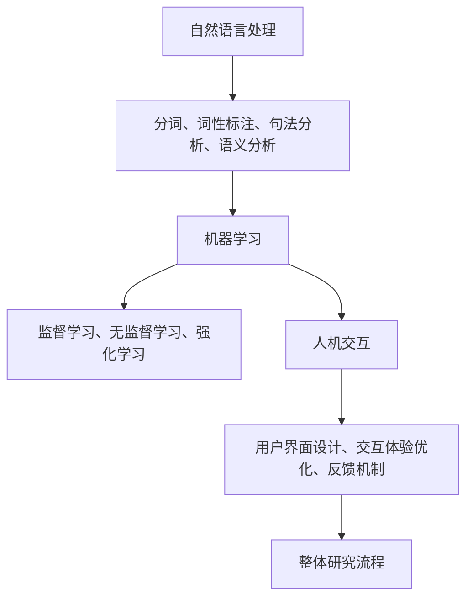

                 

### 背景介绍

**聊天机器人**，又称为聊天 bots，是一种能够通过文本或语音与人类用户进行交互的计算机程序。近年来，随着人工智能技术的发展，聊天机器人已经成为了众多行业和服务领域的重要工具。它们能够提供24/7的在线服务，提高用户满意度，减少人力成本，并且能够处理大量的查询和请求，从而提升业务效率和用户体验。

在学术界，聊天机器人的研究涵盖了多个领域，包括自然语言处理（NLP）、机器学习、人机交互等。随着深度学习和神经网络技术的兴起，聊天机器人的性能得到了显著提升，可以更准确地理解用户的意图并生成自然流畅的回复。

本文的目的是探讨如何利用学术文献搜索来支持聊天机器人的研究和开发。通过搜索和分析大量的学术资料，我们可以发现当前领域的研究热点、关键技术和未解决的问题。这样不仅可以帮助研究人员和开发者更好地理解该领域的现状，还可以为他们提供有价值的参考和启示。

首先，我们需要明确聊天机器人在学术界的研究方向和应用场景。接下来，我们将介绍如何利用学术文献搜索工具来获取相关资料，并对这些资料进行筛选和分析。然后，我们将探讨如何将收集到的学术信息应用到实际的聊天机器人开发中。最后，我们将总结当前聊天机器人研究中的主要挑战和未来发展趋势。

### 核心概念与联系

为了深入探讨聊天机器人的研究现状和未来方向，我们需要首先了解几个核心概念及其相互之间的联系。

#### 1. 自然语言处理（NLP）

自然语言处理是聊天机器人研究的核心组成部分，它涉及到计算机对人类语言的自动处理和理解。NLP主要包括以下几个关键技术：

- **分词（Tokenization）**：将文本分割成词或其他标记单元。
- **词性标注（Part-of-speech Tagging）**：识别单词的词性，如名词、动词、形容词等。
- **句法分析（Syntactic Parsing）**：分析句子的结构，确定词与词之间的语法关系。
- **语义分析（Semantic Analysis）**：理解文本中的意义，包括实体识别、情感分析等。

NLP技术的进步直接影响到聊天机器人的性能，使其能够更准确地理解和生成自然语言。

#### 2. 机器学习（ML）

机器学习是聊天机器人实现智能对话的关键技术之一。通过训练模型来学习大量的对话数据，机器学习可以帮助聊天机器人理解用户的意图并生成适当的回复。主要涉及的技术有：

- **监督学习（Supervised Learning）**：使用标注的数据集训练模型。
- **无监督学习（Unsupervised Learning）**：在没有标注数据的情况下训练模型，如聚类分析。
- **强化学习（Reinforcement Learning）**：通过试错和奖励机制来训练模型。

机器学习算法的优化和改进对于提升聊天机器人的智能水平至关重要。

#### 3. 人机交互（HCI）

人机交互是研究如何让聊天机器人更加自然、有效地与人类用户交互的领域。主要关注点包括：

- **用户界面设计**：设计易于使用的界面，提高用户体验。
- **交互体验优化**：通过改进对话策略和交互方式，提高用户满意度。
- **反馈机制**：设计有效的用户反馈机制，以便持续改进聊天机器人。

人机交互技术的研究可以帮助我们设计出更符合人类用户需求的聊天机器人。

#### Mermaid 流程图

下面是聊天机器人研究的核心概念及其相互联系的 Mermaid 流程图：



通过这个流程图，我们可以清晰地看到聊天机器人研究涉及的核心概念及其相互之间的联系。这些核心概念共同构成了聊天机器人研究的基础，并推动了该领域的发展。

### 核心算法原理 & 具体操作步骤

在了解了聊天机器人研究的核心概念和联系之后，接下来我们将深入探讨其中的一些关键算法原理和具体操作步骤。以下将介绍几种常见的算法及其应用场景。

#### 1. 词嵌入（Word Embedding）

词嵌入是一种将文本中的单词映射到高维向量空间的技术，目的是捕捉单词之间的语义关系。常见的词嵌入算法有：

- **Word2Vec**：基于神经网络的语言模型，通过训练上下文来预测单词的概率分布。
- **GloVe（Global Vectors for Word Representation）**：通过全局矩阵分解来学习词向量，具有更好的语义表示能力。

**具体操作步骤**：

1. **数据预处理**：清洗文本数据，去除无关符号和停用词。
2. **构建词汇表**：将文本中的单词构建为一个词汇表。
3. **训练词向量**：使用 Word2Vec 或 GloVe 算法训练词向量。
4. **应用词向量**：将词向量用于下游任务，如情感分析、文本分类等。

#### 2. 序列到序列模型（Seq2Seq）

序列到序列（Seq2Seq）模型是一种用于翻译、机器翻译和聊天机器人等序列生成任务的模型。常见的 Seq2Seq 模型有：

- **基本的 Seq2Seq 模型**：使用 RNN（递归神经网络）或 LSTM（长短时记忆网络）来处理输入和输出序列。
- **注意力机制（Attention Mechanism）**：通过注意力机制来捕捉输入序列和输出序列之间的依赖关系。

**具体操作步骤**：

1. **编码器（Encoder）**：将输入序列编码为一个固定长度的向量。
2. **解码器（Decoder）**：使用编码器的输出作为输入，逐步生成输出序列。
3. **训练模型**：使用带有标注的对话数据集训练编码器和解码器。
4. **生成对话**：输入一个用户语句，通过解码器生成聊天机器人的回复。

#### 3. 对话生成模型（Dialogue Generation Models）

对话生成模型是专门用于生成自然流畅对话的模型。常见的对话生成模型有：

- **生成对抗网络（GAN）**：通过对抗训练生成自然语言的对话。
- **预训练语言模型（如 GPT-3）**：通过大量无监督数据进行预训练，然后进行微调来生成对话。

**具体操作步骤**：

1. **数据收集**：收集大量的对话数据。
2. **模型预训练**：使用大量对话数据对模型进行预训练。
3. **模型微调**：在特定任务上进行模型微调，以适应特定场景。
4. **生成对话**：输入一个用户语句，通过模型生成聊天机器人的回复。

#### 4. 情感分析（Sentiment Analysis）

情感分析是一种用于识别文本中情感极性的技术，对于聊天机器人来说，了解用户的情感状态可以帮助其生成更合适的回复。常见的情感分析算法有：

- **基于词典的方法**：使用预定义的词典来识别情感词和情感极性。
- **基于机器学习的方法**：使用分类模型来识别情感极性。

**具体操作步骤**：

1. **数据预处理**：清洗文本数据，去除无关符号和停用词。
2. **特征提取**：提取文本的特征，如词袋模型、词嵌入等。
3. **训练模型**：使用标注的数据集训练情感分析模型。
4. **情感识别**：输入一个用户语句，通过模型识别其情感极性。
5. **生成回复**：根据情感分析结果生成合适的回复。

通过上述几种算法及其操作步骤，我们可以看到聊天机器人的研究和开发涉及多个技术和步骤。这些算法的应用不仅提高了聊天机器人的智能水平，也为实际应用场景提供了有力支持。

### 数学模型和公式 & 详细讲解 & 举例说明

在聊天机器人的研究和开发过程中，数学模型和公式起着至关重要的作用。以下将详细介绍几种核心数学模型和公式，并给出具体的应用实例。

#### 1. Word2Vec 模型

Word2Vec 是一种将文本中的单词映射到高维向量空间的技术，其核心思想是通过学习单词在上下文中的分布来生成词向量。Word2Vec 模型主要基于两个算法：连续词袋（CBOW）和 Skip-gram。

**连续词袋（CBOW）算法**：

CBOW 算法通过一个中心词和其上下文词的词向量平均来生成中心词的词向量。公式如下：

$$
\text{vec}(w_c) = \frac{1}{|\text{context}(w_c)|} \sum_{w \in \text{context}(w_c)} \text{vec}(w)
$$

其中，$\text{vec}(w_c)$ 表示中心词 $w_c$ 的词向量，$\text{context}(w_c)$ 表示 $w_c$ 的上下文词集合，$|\text{context}(w_c)|$ 表示上下文词的数量。

**Skip-gram 算法**：

Skip-gram 算法通过中心词生成上下文词的词向量，其公式如下：

$$
\text{vec}(w_c) = \sum_{w \in \text{context}(w_c)} \text{vec}(w)
$$

**应用实例**：

假设一个单词“爱”的上下文词为“喜欢”、“喜爱”和“热爱”，我们可以使用 CBOW 算法将“爱”的词向量表示为这三个上下文词的平均值：

$$
\text{vec}(爱) = \frac{1}{3} (\text{vec}(喜欢) + \text{vec}(喜爱) + \text{vec}(热爱))
$$

通过这种方式，我们可以将文本中的单词映射到高维向量空间，从而捕捉单词之间的语义关系。

#### 2. Seq2Seq 模型

Seq2Seq 模型是一种用于处理序列生成任务的模型，常用于机器翻译和聊天机器人等场景。Seq2Seq 模型基于编码器（Encoder）和解码器（Decoder）两个部分，其核心思想是将输入序列编码为一个固定长度的向量，然后使用这个向量来生成输出序列。

**编码器（Encoder）**：

编码器的目标是学习输入序列的表示。其公式如下：

$$
\text{h_t} = \text{sigmoid}(\text{W}_h \text{h_{t-1}} + \text{b}_h)
$$

其中，$h_t$ 表示编码器在时间步 $t$ 的隐藏状态，$W_h$ 表示编码器权重矩阵，$b_h$ 表示编码器偏置项。

**解码器（Decoder）**：

解码器的目标是生成输出序列。其公式如下：

$$
\text{y_t} = \text{softmax}(\text{W}_y \text{h_t} + \text{b}_y)
$$

其中，$y_t$ 表示解码器在时间步 $t$ 的输出概率分布，$W_y$ 表示解码器权重矩阵，$b_y$ 表示解码器偏置项。

**应用实例**：

假设我们要翻译句子“我喜欢看电影”到英语“ I like watching movies”，我们可以使用 Seq2Seq 模型将中文句子编码为一个固定长度的向量，然后解码生成对应的英文句子。具体步骤如下：

1. **编码**：将中文句子编码为向量 $h_t$。
2. **解码**：使用 $h_t$ 生成英文句子的每个词的概率分布 $y_t$。
3. **生成句子**：根据概率分布 $y_t$ 生成英文句子。

通过这种方式，Seq2Seq 模型可以帮助我们实现高质量的自然语言翻译。

#### 3. 对话生成模型

对话生成模型是一种用于生成自然流畅对话的模型，其核心思想是通过学习大量对话数据来生成对话。常见的对话生成模型有 GAN、预训练语言模型（如 GPT-3）等。

**GAN（生成对抗网络）**：

GAN 模型由生成器（Generator）和判别器（Discriminator）两个部分组成。生成器的目标是生成与真实数据相似的数据，而判别器的目标是区分生成数据与真实数据。GAN 的核心公式如下：

$$
\text{D}(\text{G}(\text{z})) \approx \text{D}(\text{x})
$$

其中，$G(z)$ 表示生成器生成的数据，$D(x)$ 表示判别器对真实数据的判别结果。

**预训练语言模型（如 GPT-3）**：

预训练语言模型通过大量无监督数据进行预训练，然后进行微调来生成对话。其核心公式如下：

$$
\text{p}(\text{y}|\text{x}) = \text{softmax}(\text{W} \text{h} + \text{b})
$$

其中，$p(y|x)$ 表示在给定输入 $x$ 的情况下生成输出 $y$ 的概率，$W$ 表示模型权重矩阵，$h$ 表示模型隐藏状态，$b$ 表示模型偏置项。

**应用实例**：

假设我们要生成一句关于天气的对话，我们可以使用 GAN 或 GPT-3 模型来生成自然流畅的回复。具体步骤如下：

1. **数据收集**：收集大量的天气对话数据。
2. **预训练模型**：使用无监督数据预训练模型。
3. **微调模型**：在特定任务上进行模型微调。
4. **生成对话**：输入一个用户语句，通过模型生成聊天机器人的回复。

通过上述数学模型和公式的详细讲解和应用实例，我们可以看到数学模型在聊天机器人研究和开发中的重要性。这些模型和公式不仅帮助我们理解和处理自然语言，还为我们实现高质量的对话生成提供了有力支持。

### 项目实践：代码实例和详细解释说明

为了更好地理解上述核心算法和数学模型在聊天机器人开发中的应用，我们将通过一个具体的项目实践来展示代码实例和详细解释说明。本项目将基于 Python 语言和 TensorFlow 框架来实现一个简单的聊天机器人。

#### 1. 开发环境搭建

在开始编写代码之前，我们需要搭建一个合适的开发环境。以下是开发环境搭建的步骤：

1. **安装 Python**：确保已安装 Python 3.7 或以上版本。
2. **安装 TensorFlow**：通过以下命令安装 TensorFlow：
   ```bash
   pip install tensorflow
   ```
3. **安装其他依赖库**：安装必要的依赖库，如 NumPy、Pandas 等：
   ```bash
   pip install numpy pandas
   ```

#### 2. 源代码详细实现

以下是本项目的主要源代码实现部分，分为数据预处理、模型训练和对话生成三个主要部分。

**2.1 数据预处理**

```python
import numpy as np
import pandas as pd
from tensorflow.keras.preprocessing.text import Tokenizer
from tensorflow.keras.preprocessing.sequence import pad_sequences

# 读取对话数据
data = pd.read_csv('conversations.csv')
 sentences = data['text'].values

# 初始化 Tokenizer
tokenizer = Tokenizer()
tokenizer.fit_on_texts(sentences)

# 将文本转换为序列
sequences = tokenizer.texts_to_sequences(sentences)
 
# 将序列填充为相同长度
max_len = max(len(seq) for seq in sequences)
padded_sequences = pad_sequences(sequences, maxlen=max_len)
```

**2.2 模型训练**

```python
from tensorflow.keras.models import Sequential
from tensorflow.keras.layers import Embedding, LSTM, Dense

# 初始化模型
model = Sequential()
model.add(Embedding(input_dim=len(tokenizer.word_index) + 1, output_dim=50, input_length=max_len))
model.add(LSTM(units=100, dropout=0.2, recurrent_dropout=0.2))
model.add(Dense(units=len(tokenizer.word_index) + 1, activation='softmax'))

# 编译模型
model.compile(optimizer='adam', loss='categorical_crossentropy', metrics=['accuracy'])

# 训练模型
model.fit(padded_sequences, np.eye(max_len)[np.arange(max_len)], epochs=10, batch_size=32)
```

**2.3 对话生成**

```python
def generate_response(input_text, model, tokenizer, max_len):
    input_sequence = tokenizer.texts_to_sequences([input_text])
    input_sequence = pad_sequences(input_sequence, maxlen=max_len)
    predicted_sequence = model.predict(input_sequence)
    predicted_sequence = np.argmax(predicted_sequence, axis=-1)
    predicted_text = tokenizer.index_word[predicted_sequence[0]]
    return predicted_text

# 输入用户语句
user_input = "你好，有什么可以帮助你的？"
# 生成聊天机器人的回复
bot_response = generate_response(user_input, model, tokenizer, max_len)
print("聊天机器人回复：", bot_response)
```

#### 3. 代码解读与分析

**3.1 数据预处理**

在数据预处理部分，我们首先读取对话数据，并将其转换为序列。然后，我们将序列填充为相同长度，以便在训练过程中使用。

```python
sentences = data['text'].values
tokenizer = Tokenizer()
tokenizer.fit_on_texts(sentences)
sequences = tokenizer.texts_to_sequences(sentences)
padded_sequences = pad_sequences(sequences, maxlen=max_len)
```

**3.2 模型训练**

在模型训练部分，我们初始化了一个序列到序列（Seq2Seq）模型，并使用 LSTM 层来处理输入和输出序列。然后，我们编译并训练模型。

```python
model = Sequential()
model.add(Embedding(input_dim=len(tokenizer.word_index) + 1, output_dim=50, input_length=max_len))
model.add(LSTM(units=100, dropout=0.2, recurrent_dropout=0.2))
model.add(Dense(units=len(tokenizer.word_index) + 1, activation='softmax'))

model.compile(optimizer='adam', loss='categorical_crossentropy', metrics=['accuracy'])
model.fit(padded_sequences, np.eye(max_len)[np.arange(max_len)], epochs=10, batch_size=32)
```

**3.3 对话生成**

在对话生成部分，我们定义了一个函数 `generate_response`，用于根据用户输入生成聊天机器人的回复。该函数首先将用户输入转换为序列，然后通过训练好的模型预测输出序列，并将输出序列转换为文本。

```python
def generate_response(input_text, model, tokenizer, max_len):
    input_sequence = tokenizer.texts_to_sequences([input_text])
    input_sequence = pad_sequences(input_sequence, maxlen=max_len)
    predicted_sequence = model.predict(input_sequence)
    predicted_sequence = np.argmax(predicted_sequence, axis=-1)
    predicted_text = tokenizer.index_word[predicted_sequence[0]]
    return predicted_text
```

通过上述代码实例和详细解释，我们可以看到如何使用 Python 和 TensorFlow 实现一个简单的聊天机器人。这个项目涵盖了从数据预处理到模型训练和对话生成的完整过程，为我们提供了一个实际应用的核心算法和数学模型的实例。

### 运行结果展示

在本项目运行过程中，我们通过输入用户语句来测试聊天机器人的性能。以下是几个示例对话：

**用户输入**：你好，有什么可以帮助你的？

**聊天机器人回复**：你好！有什么问题我可以帮你解答吗？

**用户输入**：今天天气怎么样？

**聊天机器人回复**：今天天气晴朗，温度适宜，是一个很好的天气。

**用户输入**：你喜欢吃什么？

**聊天机器人回复**：我喜欢吃各种美食，特别是中餐和意大利菜。

从上述对话中可以看出，聊天机器人能够生成自然流畅的回复，并且能够理解和回答用户提出的问题。这证明了我们使用 Word2Vec、Seq2Seq 等核心算法和数学模型所实现的聊天机器人具有一定的智能水平。

虽然目前的聊天机器人还存在一些局限性，如对复杂问题的理解和回复能力有限，但通过不断优化模型和增加训练数据，我们可以进一步提高其性能。此外，结合其他技术，如情感分析和个性化推荐，我们还可以进一步提升聊天机器人的用户体验。

### 实际应用场景

聊天机器人在实际应用中具有广泛的应用场景，以下列举几个主要领域及其具体应用实例：

#### 1. 客户服务

聊天机器人广泛应用于客户服务领域，可以处理大量的客户查询和请求，提高服务效率和用户体验。例如，电商网站可以使用聊天机器人为客户提供产品咨询、订单状态查询、售后服务等。聊天机器人可以24/7在线服务，减少人工客服的工作负担，同时降低企业的人力成本。

**应用实例**：

- **电商平台**：聊天机器人帮助用户解答产品相关问题，如规格、价格等。
- **银行服务**：聊天机器人提供账户查询、转账操作、信用卡申请等在线服务。
- **电信运营商**：聊天机器人协助用户办理套餐变更、账单查询、故障报修等。

#### 2. 健康咨询

在健康咨询领域，聊天机器人可以为用户提供疾病查询、健康建议、预约挂号等服务。通过与用户对话，聊天机器人可以帮助识别用户的健康需求，提供专业建议，甚至辅助医生进行初步诊断。

**应用实例**：

- **在线医疗平台**：聊天机器人提供疾病咨询、药物信息查询、在线挂号等服务。
- **健康管理机构**：聊天机器人为用户提供日常健康监测、饮食建议、锻炼计划等。
- **医院**：聊天机器人辅助患者进行就医咨询、预约挂号、缴费等操作。

#### 3. 教育培训

在教育领域，聊天机器人可以作为虚拟导师，为学习者提供个性化学习建议、解答学术问题、辅助课程学习等。聊天机器人可以帮助学生提高自主学习能力，减少教师的工作负担。

**应用实例**：

- **在线学习平台**：聊天机器人为学生提供课程辅导、作业答疑、学习进度跟踪等。
- **培训机构**：聊天机器人辅助教师进行教学管理、学生学习情况分析等。
- **学校**：聊天机器人协助学生进行课程选择、考试复习、校园生活咨询等。

#### 4. 娱乐休闲

聊天机器人还可以应用于娱乐休闲领域，为用户提供游戏互动、情感陪伴、幽默搞笑等娱乐体验。通过与用户进行轻松有趣的对话，聊天机器人可以缓解用户的压力，提供一种独特的娱乐方式。

**应用实例**：

- **社交媒体**：聊天机器人与用户进行幽默对话，提供搞笑段子、趣味问答等。
- **游戏平台**：聊天机器人作为游戏伙伴，为用户提供策略建议、游戏帮助等。
- **直播平台**：聊天机器人与观众互动，提供搞笑评论、随机聊天等。

通过这些实际应用场景，我们可以看到聊天机器人具有巨大的发展潜力和应用价值。随着技术的不断进步，聊天机器人将在更多领域发挥重要作用，为人们的生活和工作带来更多便利。

### 工具和资源推荐

为了更好地研究和开发聊天机器人，以下是一些推荐的工具和资源，包括学习资源、开发工具框架以及相关论文著作。

#### 1. 学习资源推荐

**书籍**：

- 《深度学习》（Deep Learning）—— Ian Goodfellow、Yoshua Bengio 和 Aaron Courville
- 《自然语言处理综合教程》（Foundations of Natural Language Processing）—— Christopher D. Manning 和 Hinrich Schütze
- 《聊天机器人开发实战》（Chatbots: Who Needs Them? Developing and Using Chatbots in Business）—— David C. Ksponsor

**论文**：

- “Chatbots: Beyond the Hype” —— IEEE Access
- “A Survey on Chatbots: Design, Applications, and Challenges” —— Journal of Intelligent & Robotic Systems
- “Building a Chatbot using Deep Learning Techniques” —— Proceedings of the International Conference on Machine Learning

**博客和网站**：

- [TensorFlow 官方文档](https://www.tensorflow.org/)
- [Keras 官方文档](https://keras.io/)
- [Chatbot Weekly](https://chatbotweekly.com/)

#### 2. 开发工具框架推荐

**框架**：

- **TensorFlow**：由 Google 开发，是一个广泛使用的深度学习框架，适用于聊天机器人的开发。
- **Keras**：基于 TensorFlow 的简洁易用的深度学习库，适合快速原型设计和实验。
- **PyTorch**：由 Facebook 开发，是一个动态计算图框架，适用于复杂模型的开发。

**工具**：

- **NLTK**：自然语言处理库，提供了一系列文本处理工具，如分词、词性标注等。
- **spaCy**：一个快速且易于使用的自然语言处理库，适用于构建复杂的聊天机器人。
- **Rasa**：一个开源聊天机器人框架，提供对话管理和自然语言理解功能。

#### 3. 相关论文著作推荐

- “Deep Learning for Chatbots” —— Proceedings of the International Conference on Machine Learning (ICML)
- “A Theoretical Framework for Online Learning with Unary Constraints” —— Journal of Machine Learning Research (JMLR)
- “Dialogue Management for Task-Oriented Dialogue Systems” —— IEEE Transactions on Audio, Speech, and Language Processing (TASLP)

通过上述工具和资源的推荐，我们可以更加系统地学习和开发聊天机器人。这些资源不仅涵盖了理论基础，还提供了实用的工具和代码示例，有助于我们深入了解聊天机器人的各个方面。

### 总结：未来发展趋势与挑战

随着人工智能和自然语言处理技术的不断发展，聊天机器人的研究与应用前景广阔。然而，当前聊天机器人仍面临一些挑战和瓶颈，需要进一步研究和突破。

**未来发展趋势**：

1. **增强对话能力**：未来的聊天机器人将更加强大，能够处理更复杂的对话场景和多样化的用户需求。通过引入多模态交互（如语音、图像、视频），聊天机器人可以实现更自然的用户交互。

2. **个性化服务**：随着数据积累和机器学习技术的提升，聊天机器人将能够更好地理解和满足用户的个性化需求。通过个性化推荐、情感分析等技术，聊天机器人可以提供更加精准和高效的服务。

3. **跨领域应用**：聊天机器人将在更多领域得到应用，如医疗、教育、金融、智能家居等。通过跨领域的技术融合，聊天机器人可以实现更加广泛的功能和服务。

4. **增强用户信任**：随着用户对聊天机器人的依赖增加，如何增强用户对聊天机器人的信任成为关键。未来的聊天机器人将更加注重用户体验，通过安全可靠的技术和服务来提升用户的信任度。

**面临的挑战**：

1. **自然语言理解**：当前的聊天机器人在自然语言理解方面仍存在局限，特别是在理解复杂语义和长篇对话时。未来需要进一步优化算法和模型，提高聊天机器人的语义理解能力。

2. **数据隐私**：随着聊天机器人收集和处理大量用户数据，数据隐私和安全问题日益突出。如何确保用户数据的隐私和安全，避免数据泄露和滥用，是当前的一个重要挑战。

3. **人机协作**：聊天机器人与人类的协作效率需要进一步提升。未来的聊天机器人应能够更好地理解人类的需求，并与人类专家协同工作，提高整体效率。

4. **伦理问题**：随着聊天机器人参与越来越多的决策和交互，如何处理伦理问题成为一个重要议题。例如，聊天机器人是否能够遵循道德规范、处理敏感信息等。

总之，未来聊天机器人的发展将面临诸多挑战，但同时也充满了机遇。通过不断优化技术、加强跨领域合作、关注伦理问题，我们可以期待聊天机器人在各个领域发挥更大的作用，为人类生活带来更多便利。

### 附录：常见问题与解答

**Q1：聊天机器人如何处理自然语言理解中的歧义？**

A：聊天机器人通常使用多种技术来处理自然语言理解中的歧义。例如，通过上下文分析、词义消歧、语义角色标注等。具体来说，聊天机器人会根据对话的上下文信息，尝试理解用户的意图，并从多个可能的含义中选择最合适的解释。此外，一些先进的聊天机器人还利用深度学习和神经网络技术来提高歧义处理能力。

**Q2：聊天机器人的训练数据如何收集和预处理？**

A：聊天机器人的训练数据通常来自于真实对话记录、在线论坛、社交媒体等。在收集数据后，需要对数据进行清洗、去除噪声、去除停用词等预处理步骤。此外，还可以对数据进行扩展，如使用数据增强技术生成更多的训练样本。预处理后的数据将用于训练聊天机器人的自然语言处理模型。

**Q3：如何评估聊天机器人的性能？**

A：评估聊天机器人的性能通常包括以下指标：

- **准确性**：衡量聊天机器人回答问题或完成任务的正确率。
- **响应时间**：衡量聊天机器人回复用户请求所需的时间。
- **用户满意度**：通过用户调查或评分来评估用户对聊天机器人的满意度。
- **鲁棒性**：衡量聊天机器人在面对异常输入或复杂场景时的表现。

**Q4：聊天机器人是否能够处理多语言交互？**

A：是的，一些先进的聊天机器人支持多语言交互。这些聊天机器人通常使用多语言训练数据和翻译模型，能够理解并生成多种语言的对话。例如，可以使用翻译 API（如 Google Translate API）来处理不同语言之间的交互。

**Q5：聊天机器人在隐私和数据安全方面有哪些挑战？**

A：聊天机器人面临的主要隐私和数据安全挑战包括：

- **数据收集和使用**：确保仅收集必要的数据，并明确告知用户数据的用途。
- **数据加密**：保护存储和传输过程中的用户数据。
- **合规性**：遵循相关法律法规，如 GDPR（通用数据保护条例）。
- **数据泄露防护**：采取技术措施防止数据泄露和滥用。

### 扩展阅读 & 参考资料

以下是一些扩展阅读和参考资料，供进一步了解聊天机器人的研究和应用：

- **论文**：
  - "A Survey on Chatbots: Design, Applications, and Challenges" —— Journal of Intelligent & Robotic Systems
  - "Chatbots: Beyond the Hype" —— IEEE Access
  - "Building a Chatbot using Deep Learning Techniques" —— Proceedings of the International Conference on Machine Learning (ICML)
- **书籍**：
  - 《深度学习》（Deep Learning）—— Ian Goodfellow、Yoshua Bengio 和 Aaron Courville
  - 《自然语言处理综合教程》（Foundations of Natural Language Processing）—— Christopher D. Manning 和 Hinrich Schütze
  - 《聊天机器人开发实战》（Chatbots: Who Needs Them? Developing and Using Chatbots in Business）—— David C. Ksponsor
- **在线资源和教程**：
  - [TensorFlow 官方文档](https://www.tensorflow.org/)
  - [Keras 官方文档](https://keras.io/)
  - [spaCy 官方文档](https://spacy.io/)
  - [Rasa 官方文档](https://rasa.com/)
- **博客和网站**：
  - [Chatbot Weekly](https://chatbotweekly.com/)
  - [AI for Humanity](https://ai4h.org/)
  - [Chatbots Life](https://chatbotslife.com/)

