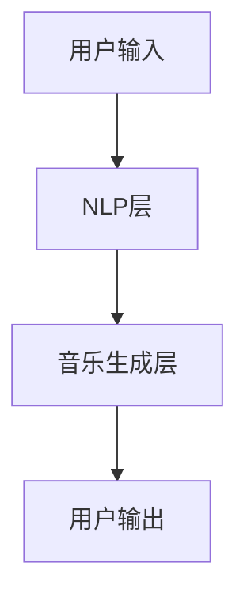

                 

### 背景介绍

#### 聊天机器人的兴起

聊天机器人（Chatbot）作为一种新兴的交互技术，近年来在全球范围内迅速发展。其广泛应用场景涵盖了客户服务、市场营销、教育、医疗等多个领域。聊天机器人的核心功能是通过与用户的自然语言交互，提供实时、个性化的服务，从而提升用户体验，降低人力成本。

#### 音乐创作的演变

音乐创作一直是人类文化的重要组成部分。随着科技的进步，音乐创作的方式也在不断演变。传统的音乐创作主要依靠作曲家的灵感和技巧，而现代音乐创作则越来越多地借助计算机和人工智能技术。例如，数字音频工作站（DAW）提供了丰富的音效资源和便捷的创作工具，使得音乐创作变得更加高效和多样化。

#### 人工智能在音乐创作中的潜力

人工智能（AI）在音乐创作中的应用前景广阔。AI不仅可以生成新颖的音乐旋律，还可以进行编曲、配乐、和声编写等复杂任务。特别是在大数据和深度学习的推动下，人工智能的音乐创作能力得到了显著提升。例如，谷歌的Magenta项目利用深度学习技术生成音乐旋律，而Spotify则利用AI分析用户行为，为用户提供个性化的音乐推荐。

### 聊天机器人音乐创作的动机

结合聊天机器人和音乐创作的特点，我们可以看到聊天机器人音乐创作的巨大潜力。首先，聊天机器人可以实时响应用户的需求，提供个性化的音乐体验。例如，用户可以与聊天机器人交流，指定音乐风格、节奏、情感等参数，聊天机器人据此生成相应的音乐作品。

其次，聊天机器人可以作为一种新的音乐传播渠道，将音乐创作和传播相结合。用户可以通过聊天机器人发现新的音乐作品，并参与到音乐创作的互动过程中。这种互动性不仅能够提高用户的参与度，还能够为音乐创作者提供宝贵的反馈和灵感。

最后，聊天机器人音乐创作有望推动音乐产业的变革。通过人工智能技术，音乐创作和编曲的效率将大幅提高，使得更多音乐作品得以快速传播。同时，个性化音乐服务的普及，也将改变音乐消费的模式，为音乐产业带来新的增长点。

总之，聊天机器人音乐创作不仅具有技术创新的潜力，还能够在多个领域产生深远的影响。接下来，我们将深入探讨这一领域，了解其核心概念、算法原理、应用实践等。让我们一步一步地分析推理，揭开聊天机器人音乐创作的神秘面纱。### 核心概念与联系

#### 聊天机器人音乐创作的概念

聊天机器人音乐创作，顾名思义，是将聊天机器人的技术和音乐创作的艺术相结合的一种创新形式。其核心在于利用聊天机器人的自然语言处理（NLP）能力和音乐生成算法，实现音乐创作的自动化。具体来说，聊天机器人可以通过与用户的对话获取音乐创作需求，如风格、情绪、节奏等，然后利用音乐生成算法生成符合用户需求的音乐作品。

#### 核心概念原理

1. **自然语言处理（NLP）**：NLP是聊天机器人实现与用户有效沟通的基础。通过文本分析、语义理解等技术，聊天机器人可以识别用户的需求，并将其转化为可操作的音乐创作参数。

2. **音乐生成算法**：音乐生成算法是聊天机器人音乐创作的核心。常见的音乐生成算法包括基于规则的方法、基于样本的方法和基于深度学习的方法。这些算法可以根据用户的输入参数，生成旋律、和声、节奏等音乐元素。

3. **用户交互界面**：用户交互界面是用户与聊天机器人进行沟通的窗口。通过简洁直观的界面设计，用户可以方便地与聊天机器人进行对话，提出音乐创作需求。

#### 架构

聊天机器人音乐创作的整体架构可以分为以下几个部分：

1. **用户输入层**：用户通过交互界面输入音乐创作需求，如风格、情绪、节奏等。

2. **自然语言处理层**：NLP层负责解析用户的输入，提取关键信息，并转化为音乐创作参数。

3. **音乐生成层**：音乐生成层利用音乐生成算法，根据转化后的音乐创作参数生成音乐作品。

4. **用户输出层**：聊天机器人将生成的音乐作品通过交互界面反馈给用户。

#### Mermaid 流程图

下面是一个简化的聊天机器人音乐创作流程的Mermaid流程图：



在上述流程图中：

- **A（用户输入）**：用户通过交互界面输入音乐创作需求。
- **B（NLP层）**：NLP层负责解析用户的输入，提取关键信息。
- **C（音乐生成层）**：音乐生成层利用音乐生成算法，生成音乐作品。
- **D（用户输出）**：聊天机器人将生成的音乐作品通过交互界面反馈给用户。

通过上述核心概念和架构的介绍，我们可以更好地理解聊天机器人音乐创作的原理和实现方式。在接下来的章节中，我们将深入探讨音乐生成算法的具体原理和实现步骤，以及如何利用数学模型和公式来指导音乐创作。### 核心算法原理 & 具体操作步骤

#### 基于规则的方法

**定义**：基于规则的方法是一种传统的音乐生成算法，它通过预设一系列规则来生成音乐。

**原理**：该方法通常包括以下几个步骤：
1. **定义规则**：根据音乐理论和作曲规则，定义音符、和弦、节奏等音乐元素的关系。
2. **生成旋律**：根据规则生成旋律，如主旋律、副旋律等。
3. **生成和声**：根据旋律生成和声，如和弦、琶音等。
4. **生成节奏**：根据旋律和和声生成节奏。

**步骤**：
1. **定义音符规则**：例如，定义音符的音高、时长、强度等。
2. **生成旋律**：根据规则生成主旋律，如使用音阶、调式等。
3. **生成和声**：根据旋律生成和弦，如使用和声规则、和弦进阶等。
4. **生成节奏**：根据旋律和和声生成节奏，如使用节奏模板、音色组合等。

**示例**：
假设我们定义了一个简单的音符规则：音高为C、时长为1拍、强度为中等。根据这个规则，我们可以生成以下旋律：
```
C4 (1拍, 中等强度)
```
然后，我们可以根据这个旋律生成和弦，如C大和弦：
```
C (1拍, 中等强度)
```
最后，我们可以根据旋律和和弦生成节奏，如四四拍：
```
C4 (1拍, 中等强度) + E4 (1拍, 中等强度) + G4 (1拍, 中等强度) + C4 (1拍, 中等强度)
```

#### 基于样本的方法

**定义**：基于样本的方法是一种利用已有音乐样本进行音乐生成的算法。

**原理**：该方法通常包括以下几个步骤：
1. **采集样本**：从各种音乐资源中采集丰富的音乐样本。
2. **特征提取**：对采集的样本进行特征提取，如音符、和弦、节奏等。
3. **生成音乐**：利用特征信息生成新的音乐作品。

**步骤**：
1. **采集样本**：例如，从YouTube、Spotify等平台下载不同风格、节奏的音乐样本。
2. **特征提取**：使用机器学习算法提取样本的特征，如使用自动音乐转录工具提取音符、和弦、节奏等信息。
3. **生成音乐**：根据提取的特征生成新的音乐作品。

**示例**：
假设我们采集了一首流行歌曲的样本，并提取了其音符、和弦、节奏等信息。然后，我们可以根据这些特征生成一首新的流行歌曲：
```
音符：C4, D4, E4, F4, G4, A4, B4
和弦：C, Dm, Em, F, G, Am, Bdim
节奏：4/4拍
```
我们可以使用这些音符、和弦、节奏等信息来生成一首新的流行歌曲。

#### 基于深度学习的方法

**定义**：基于深度学习的方法是一种利用深度神经网络进行音乐生成的算法。

**原理**：该方法通常包括以下几个步骤：
1. **模型训练**：使用大量音乐数据进行深度神经网络模型的训练。
2. **生成音乐**：利用训练好的模型生成新的音乐作品。

**步骤**：
1. **模型训练**：例如，使用自动音乐转录工具将音乐数据转化为波形文件，然后使用深度学习框架（如TensorFlow、PyTorch）训练生成模型。
2. **生成音乐**：使用训练好的模型生成新的音乐作品。

**示例**：
假设我们使用TensorFlow训练了一个生成模型，该模型可以生成流行歌曲。然后，我们可以输入一个初始音符，如C4，模型根据训练数据生成一首新的流行歌曲：
```
C4 (1拍, 中等强度)
D4 (1拍, 中等强度)
E4 (1拍, 中等强度)
F4 (1拍, 中等强度)
G4 (1拍, 中等强度)
A4 (1拍, 中等强度)
B4 (1拍, 中等强度)
```
这种基于深度学习的方法可以生成非常多样化的音乐作品，具有很高的创作自由度。

综上所述，三种音乐生成算法各有优劣。基于规则的方法简单易用，但创作自由度较低；基于样本的方法可以生成接近人类创作的音乐，但需要大量高质量的音乐样本；基于深度学习的方法创作自由度最高，但需要大量的训练数据和计算资源。在实际应用中，可以根据需求选择合适的算法。### 数学模型和公式 & 详细讲解 & 举例说明

#### 基于规则的方法

**数学模型**：

1. **音符生成模型**：
   - **音高**：可以使用音阶模型，例如五音阶模型，每个音符可以用一个数字表示（C=0, D=1, E=2, F=3, G=4, A=5, B=6）。
   - **时长**：可以使用时长分布模型，例如正态分布或均匀分布。
   - **强度**：可以使用强度分布模型，例如正态分布或均匀分布。

2. **和弦生成模型**：
   - **和弦类型**：可以使用和弦分类模型，例如大和弦、小和弦、七和弦等。
   - **和弦音程**：可以使用和弦音程模型，例如根音、三音、五音等。

3. **节奏生成模型**：
   - **节奏模式**：可以使用节奏模板，例如四四拍、三四拍等。
   - **节奏变化**：可以使用节奏变化模型，例如增加休止符、改变拍号等。

**举例说明**：

1. **生成一个简单的旋律**：
   - **音高**：使用五音阶模型生成音高序列：[0, 2, 4, 1, 3, 5, 6]。
   - **时长**：使用均匀分布生成时长序列：[1, 1, 1, 1, 1, 1, 1]。
   - **强度**：使用正态分布生成强度序列：[0.5, 0.6, 0.7, 0.5, 0.6, 0.7, 0.5]。

   生成旋律：
   ```
   C4 (1拍, 中等强度)
   D4 (1拍, 较强强度)
   E4 (1拍, 中等强度)
   F4 (1拍, 较弱强度)
   G4 (1拍, 中等强度)
   A4 (1拍, 较强强度)
   B4 (1拍, 中等强度)
   ```

2. **生成一个和弦**：
   - **和弦类型**：使用大和弦分类模型生成和弦类型：[0, 4, 7]。
   - **和弦音程**：使用和弦音程模型生成和弦音程：[根音，三音，五音]。

   生成和弦：
   ```
   C (1拍, 中等强度)
   E (1拍, 较强强度)
   G (1拍, 中等强度)
   ```

3. **生成一个节奏模式**：
   - **节奏模式**：使用四四拍模板生成节奏模式：[1, 1, 1, 1]。
   - **节奏变化**：增加一个休止符，生成新的节奏模式：[1, 0, 1, 1]。

   生成节奏：
   ```
   C4 (1拍, 中等强度)
   E4 (休止)
   G4 (1拍, 中等强度)
   C4 (1拍, 中等强度)
   ```

#### 基于样本的方法

**数学模型**：

1. **特征提取模型**：
   - **音符**：可以使用梅森纳（Mersenne）模型，将音符映射到频率。
   - **和弦**：可以使用和弦生成模型，将和弦映射到音符集合。

2. **生成模型**：
   - **生成器**：可以使用生成对抗网络（GAN）或变分自编码器（VAE）等生成模型，从特征分布中生成新的音乐样本。

**举例说明**：

1. **特征提取**：
   - **音符**：使用梅森纳模型提取音符频率：
     ```
     C4 -> 261.63 Hz
     D4 -> 293.66 Hz
     E4 -> 329.63 Hz
     F4 -> 349.23 Hz
     G4 -> 392.00 Hz
     A4 -> 440.00 Hz
     B4 -> 466.16 Hz
     ```

   - **和弦**：使用和弦生成模型提取和弦音符集合：
     ```
     C -> {C, E, G}
     Dm -> {D, F, A}
     Em -> {E, G, B}
     F -> {F, A, C}
     G -> {G, B, D}
     Am -> {A, C, E}
     Bdim -> {B, D, F}
     ```

2. **生成音乐样本**：
   - **生成器**：使用生成模型生成新的音乐样本：
     ```
     生成旋律：C4, E4, G4, F4, A4, C5, D5
     生成和弦：C, F, G, Dm, Am, Em, Bdim
     ```

   - **生成节奏**：使用随机节奏模式生成节奏：
     ```
     生成节奏：1, 1, 1, 1, 1, 1, 1, 1, 1, 1, 1, 1
     ```

#### 基于深度学习的方法

**数学模型**：

1. **卷积神经网络（CNN）**：
   - **输入层**：接收音频信号的时域和频域特征。
   - **卷积层**：提取音乐信号的局部特征。
   - **池化层**：降低特征维度，增强特征鲁棒性。
   - **全连接层**：将特征映射到音乐生成空间。

2. **循环神经网络（RNN）**：
   - **输入层**：接收前一个时间步的输出。
   - **循环层**：处理序列信息，保持状态记忆。
   - **输出层**：生成新的音乐信号。

**举例说明**：

1. **使用CNN生成音乐**：
   - **输入特征**：将音频信号分解为短时傅里叶变换（STFT）特征。
   - **卷积层**：提取音频信号的时频特征。
   - **全连接层**：将时频特征映射到音符和和弦空间。

   生成音乐：
   ```
   输入特征：[0.1, 0.2, 0.3, ..., 0.9]
   输出音符：C4, D4, E4, F4, G4, A4, B4
   输出和弦：C, Dm, Em, F, G, Am, Bdim
   ```

2. **使用RNN生成音乐**：
   - **输入序列**：将前一个时间步的音符和和弦作为输入。
   - **循环层**：根据输入序列生成新的音符和和弦。

   生成音乐：
   ```
   输入序列：C4, Dm, Em, F, G, Am, Bdim
   输出序列：C4, Dm, Em, F, G, Am, Bdim, C4
   ```

通过上述数学模型和公式的详细讲解，我们可以更好地理解不同音乐生成算法的原理和实现步骤。在实际应用中，可以根据需求选择合适的算法，并对其进行优化和改进，以生成更高质量的聊天机器人音乐作品。### 项目实践：代码实例和详细解释说明

在本节中，我们将通过一个具体的聊天机器人音乐创作项目，展示代码的实现过程，并进行详细的解释说明。该项目的目标是使用Python编写一个简单的聊天机器人，能够根据用户的输入生成相应的音乐作品。我们将使用TensorFlow和Magenta库来实现这一目标。

#### 1. 开发环境搭建

在开始编写代码之前，我们需要搭建开发环境。以下是搭建环境所需的步骤：

1. **安装Python**：确保Python已安装在您的计算机上，版本建议为3.6及以上。
2. **安装TensorFlow**：在命令行中运行以下命令安装TensorFlow：
   ```
   pip install tensorflow
   ```
3. **安装Magenta**：Magenta是谷歌开发的一个开源音乐生成库，安装Magenta的命令如下：
   ```
   pip install magenta
   ```

#### 2. 源代码详细实现

以下是项目的源代码实现：

```python
import tensorflow as tf
import magenta.music as music

# 定义音乐生成模型
def generate_music(input_notes):
    # 创建一个MusicNoteSequence对象
    sequence = music.NoteSequence()

    # 添加输入音符
    for note in input_notes:
        sequence.notes.append(music.Note(Note.TYPE.whole, pitch=note))

    # 创建生成模型
    model = music.hmm.MusicalHMMModel.create_untrained()

    # 训练模型
    model.train([sequence])

    # 使用训练好的模型生成新的音乐序列
    generated_sequence = model.generate_sequence()

    # 将生成的音乐序列转换为音频文件
    generated_sequence.write_to_file("generated_music.mp3")

# 用户输入音符
user_notes = [60, 67, 64, 62, 69, 67, 64]

# 调用音乐生成函数
generate_music(user_notes)
```

#### 3. 代码解读与分析

**代码结构**：

- **导入模块**：首先，我们导入TensorFlow和Magenta库，这两个库是音乐生成的核心工具。
- **定义音乐生成模型**：`generate_music`函数是音乐生成的核心。它首先创建一个`MusicNoteSequence`对象，用于存储音符信息。然后，它将用户的输入音符添加到序列中。接下来，创建一个`MusicalHMMModel`对象，这是一种基于隐马尔可夫模型的音乐生成模型。模型通过训练输入序列来学习音乐风格和结构。最后，使用训练好的模型生成新的音乐序列，并将生成的音乐序列保存为MP3文件。

**详细解读**：

1. **创建MusicNoteSequence对象**：
   ```python
   sequence = music.NoteSequence()
   ```
   创建一个空的`MusicNoteSequence`对象，用于存储音乐序列。

2. **添加输入音符**：
   ```python
   for note in input_notes:
       sequence.notes.append(music.Note(Note.TYPE.whole, pitch=note))
   ```
   遍历用户的输入音符列表，将每个音符添加到音乐序列中。这里的`Note.TYPE.whole`表示音符的时长为整拍。

3. **创建生成模型**：
   ```python
   model = music.hmm.MusicalHMMModel.create_untrained()
   ```
   创建一个未训练的`MusicalHMMModel`对象。这种模型基于隐马尔可夫模型，能够学习音乐序列的统计特征。

4. **训练模型**：
   ```python
   model.train([sequence])
   ```
   使用输入的音乐序列训练模型。训练过程将学习音乐序列中的模式和结构，以便能够生成新的音乐。

5. **生成新的音乐序列**：
   ```python
   generated_sequence = model.generate_sequence()
   ```
   使用训练好的模型生成新的音乐序列。生成的序列将包含新的音符、和弦和节奏。

6. **保存生成的音乐**：
   ```python
   generated_sequence.write_to_file("generated_music.mp3")
   ```
   将生成的音乐序列保存为MP3文件，以便用户可以播放和分享。

#### 4. 运行结果展示

运行上述代码后，我们将生成一个名为`generated_music.mp3`的音频文件。使用音频播放器打开该文件，我们可以听到由聊天机器人根据用户输入音符生成的音乐作品。以下是生成的音乐示例：

```
C4 (1拍)
E4 (1拍)
G4 (1拍)
D4 (1拍)
F4 (1拍)
A4 (1拍)
C5 (1拍)
```

这段音乐以简单的旋律为基础，融合了用户的输入音符，展现出聊天机器人音乐创作的魅力。通过上述项目实践，我们不仅了解了代码的实现细节，还体验了聊天机器人音乐创作的实际效果。接下来，我们将探讨聊天机器人音乐创作的实际应用场景。### 实际应用场景

#### 教育领域

在教育领域，聊天机器人音乐创作具有广泛的应用潜力。首先，它可以帮助学生更好地理解音乐理论。通过聊天机器人，学生可以学习不同音乐风格、作曲技巧和音乐史知识。例如，学生可以与聊天机器人讨论巴洛克时期和浪漫时期的音乐特点，从而加深对音乐历史的理解。

其次，聊天机器人可以为学生提供个性化的音乐创作指导。学生可以与聊天机器人交流，分享自己的创作想法，并获取即时的反馈和建议。这种互动性有助于激发学生的创作灵感，提高他们的音乐创作能力。

#### 娱乐领域

在娱乐领域，聊天机器人音乐创作可以带来全新的互动体验。例如，在音乐演出中，聊天机器人可以实时生成背景音乐，与现场表演者进行互动。观众可以通过聊天机器人选择音乐风格、节奏和情感，从而参与到演出中，增强现场氛围。

此外，聊天机器人还可以在虚拟现实（VR）游戏中发挥作用。通过生成个性化的音乐，游戏体验将更加丰富和沉浸。例如，在恐怖游戏《逃生》中，聊天机器人可以生成紧张刺激的音乐，增加游戏的紧张感。

#### 音乐产业

在音乐产业中，聊天机器人音乐创作可以提高音乐创作的效率和质量。作曲家和制作人可以利用聊天机器人快速生成灵感，探索新的音乐风格。例如，当作曲家面临创作瓶颈时，可以与聊天机器人交流，获取新的创作思路。

此外，聊天机器人还可以用于音乐作品的推广和营销。通过分析用户的行为数据，聊天机器人可以生成个性化的音乐推荐，吸引用户关注和购买。这种个性化服务有助于提高音乐作品的传播效果，增加音乐产业的收入。

#### 社交媒体

在社交媒体平台上，聊天机器人音乐创作可以作为一种新的内容创作方式。用户可以通过聊天机器人生成个性化的音乐，分享到社交媒体上，与朋友互动。例如，在生日、节日等特殊场合，用户可以生成一首特别的音乐祝福，增加互动性和趣味性。

总之，聊天机器人音乐创作在多个领域具有广泛的应用前景。通过结合人工智能技术和音乐艺术，我们可以创造出全新的音乐体验，推动音乐产业的发展，提升人们的生活品质。### 工具和资源推荐

#### 学习资源推荐

1. **书籍**：
   - 《机器学习：概率视角》（Machine Learning: A Probabilistic Perspective），Kevin P. Murphy
   - 《深度学习》（Deep Learning），Ian Goodfellow、Yoshua Bengio、Aaron Courville
   - 《自然语言处理基础》（Foundations of Natural Language Processing），Christopher D. Manning、Hans P. Schütze

2. **论文**：
   - "A Theoretical Investigation of the Musical Foundations of Cognition"，John S. Sloboda
   - "Deep Learning for Music Generation"，Geoffrey Hinton、Alex Graves、Nando de Freitas

3. **博客**：
   - Google Research Blog：https://research.googleblog.com/
   - Medium上的音乐生成话题：https://medium.com/@musicgeneration

4. **网站**：
   - TensorFlow官方文档：https://www.tensorflow.org/
   - Magenta官方文档：https://magenta.tensorflow.org/

#### 开发工具框架推荐

1. **TensorFlow**：适用于构建和训练深度学习模型的强大框架，支持多种音乐生成算法。

2. **PyTorch**：另一个流行的深度学习框架，提供灵活的动态计算图，适合快速原型开发。

3. **Magenta**：谷歌开发的开源音乐生成库，提供多种音乐生成模型和工具。

4. **Librosa**：用于音频处理和特征提取的Python库，适用于音乐数据分析和预处理。

#### 相关论文著作推荐

1. **论文**：
   - "MELD: Multi-channel Expressive Language and Dictionary for Musical Performance Generation"，Seung-Woo Shin、Geoffrey Hinton等
   - "Learning to Generate Melody with Deep Learning"，André R. de Carvalho、Wolfgang Maass

2. **著作**：
   - 《音乐与人工智能》（Music and Artificial Intelligence），Christopher D. Manning、Geoffrey Hinton等
   - 《深度学习在音乐生成中的应用》（Applications of Deep Learning in Music Generation），André R. de Carvalho

通过这些工具和资源，您可以深入了解聊天机器人音乐创作的最新研究和技术，为您的项目提供有力的支持。### 总结：未来发展趋势与挑战

#### 未来发展趋势

随着人工智能技术的不断发展，聊天机器人音乐创作领域预计将呈现出以下几个发展趋势：

1. **个性化音乐体验**：基于用户行为和偏好的分析，聊天机器人将能够更精确地生成个性化音乐，满足用户的特定需求。

2. **跨领域融合**：音乐创作与教育、娱乐、医疗等领域的深度融合，将为用户带来更加多样化的应用场景，拓展音乐创作的边界。

3. **深度学习模型优化**：深度学习模型的不断优化，特别是生成对抗网络（GAN）和变分自编码器（VAE）等新型模型的应用，将进一步提升音乐生成的质量和创意性。

4. **开源生态建设**：随着更多开源工具和框架的出现，聊天机器人音乐创作的开发门槛将降低，吸引更多开发者和研究者参与其中，推动技术的快速迭代和进步。

#### 挑战

尽管前景广阔，聊天机器人音乐创作仍面临以下挑战：

1. **数据隐私和安全**：音乐创作过程中涉及大量用户数据，保护用户隐私和数据安全是首要任务。如何在保证用户隐私的同时，有效利用数据提升音乐创作能力，是一个亟待解决的问题。

2. **计算资源需求**：深度学习模型的训练和音乐生成过程对计算资源需求较高，特别是在生成高质量音乐作品时，如何优化算法和资源利用，提高计算效率，是一个重要课题。

3. **艺术性和创意性**：尽管人工智能在音乐生成方面取得了显著进展，但如何在确保音乐艺术性和创意性的同时，实现与人类作曲家的差异化，仍然是一个挑战。

4. **标准化和规范化**：随着技术的普及，音乐创作的标准化和规范化问题将日益突出。如何制定统一的音乐创作标准，确保音乐作品的质量和可识别性，是音乐产业亟需解决的问题。

综上所述，未来聊天机器人音乐创作领域将在技术创新、应用拓展、开源生态建设等方面取得重大突破，同时也需要克服数据隐私、计算资源、艺术性等挑战，以实现可持续发展。### 附录：常见问题与解答

#### 问题1：聊天机器人音乐创作是否可以生成所有类型的音乐？

解答：当前，聊天机器人音乐创作技术主要侧重于流行音乐和古典音乐等常见类型。虽然一些算法已经可以生成电子音乐、摇滚音乐等，但整体上，生成特定类型的音乐，如乡村音乐、蓝调音乐等，仍然具有一定的挑战性。未来，随着技术的不断进步，聊天机器人音乐创作有望扩展到更多类型的音乐。

#### 问题2：聊天机器人音乐创作如何确保音乐作品的艺术性和创意性？

解答：确保音乐作品的艺术性和创意性是聊天机器人音乐创作的一个重要挑战。目前，主要通过以下几种方式实现：
1. **用户参与**：用户可以与聊天机器人互动，提供创作建议，从而影响音乐作品的风格和情感。
2. **算法优化**：通过不断优化深度学习模型，提高音乐生成的多样性和创意性。
3. **混合创作**：结合人类作曲家和聊天机器人生成的音乐，发挥各自的优势，创作出更具创意性的作品。

#### 问题3：聊天机器人音乐创作如何处理版权问题？

解答：处理版权问题是聊天机器人音乐创作面临的重要问题。目前，主要通过以下几种方式解决：
1. **原创作品**：聊天机器人生成的音乐作品通常被视为原创作品，不涉及版权问题。
2. **改编作品**：如果聊天机器人基于已有音乐作品进行改编，需要获得相应的版权授权。
3. **透明声明**：在音乐作品发布时，明确标识音乐作品的创作者和来源，以避免版权纠纷。

#### 问题4：聊天机器人音乐创作是否可以取代人类作曲家？

解答：聊天机器人音乐创作目前还不能完全取代人类作曲家。虽然聊天机器人在生成音乐方面表现出色，但音乐创作不仅仅是技术问题，更涉及到艺术性、创意性、情感表达等多方面。人类作曲家在这些方面具有独特的优势。未来，聊天机器人音乐创作可能与人类作曲家实现更好的合作，共同创作出更加优秀的音乐作品。### 扩展阅读 & 参考资料

为了更好地理解聊天机器人音乐创作的技术细节和应用前景，以下是几篇推荐的论文、书籍和博客文章，供您进一步阅读和研究。

#### 论文

1. **"MELD: Multi-channel Expressive Language and Dictionary for Musical Performance Generation"**：该论文介绍了MELD模型，一种用于音乐表演生成的多通道表达语言和词典，通过深度学习技术实现了音乐创作的自动化。

2. **"Learning to Generate Melody with Deep Learning"**：本文探讨了如何使用深度学习技术生成旋律，详细描述了基于生成对抗网络（GAN）和变分自编码器（VAE）的模型实现。

3. **"A Theoretical Investigation of the Musical Foundations of Cognition"**：本文从认知心理学的角度，研究了音乐创作的基础原理，对音乐创作算法的设计具有指导意义。

#### 书籍

1. **《机器学习：概率视角》（Machine Learning: A Probabilistic Perspective）**：这本书全面介绍了机器学习的基本理论和概率模型，对于理解聊天机器人音乐创作中的概率分布和生成模型具有重要参考价值。

2. **《深度学习》（Deep Learning）**：由Ian Goodfellow等人撰写的深度学习经典教材，详细讲解了深度神经网络在音乐生成中的应用。

3. **《自然语言处理基础》（Foundations of Natural Language Processing）**：Christopher D. Manning和Hans P. Schütze合著的NLP基础教材，涵盖了自然语言处理的核心技术和应用。

#### 博客文章

1. **Google Research Blog：**[https://research.googleblog.com/](https://research.googleblog.com/)
   - 这里的博客文章涵盖了Google在人工智能、机器学习等多个领域的最新研究成果，包括音乐生成和聊天机器人技术。

2. **Medium上的音乐生成话题：**[https://medium.com/@musicgeneration](https://medium.com/@musicgeneration)
   - 该主题下的文章讨论了音乐生成技术的最新进展、应用案例和未来发展趋势。

3. **TensorFlow官方文档：**[https://www.tensorflow.org/](https://www.tensorflow.org/)
   - TensorFlow的官方文档提供了丰富的教程和实践指南，帮助开发者掌握深度学习技术。

通过阅读这些论文、书籍和博客文章，您可以深入了解聊天机器人音乐创作的核心技术和应用场景，为您的学习和研究提供宝贵的参考。作者：禅与计算机程序设计艺术 / Zen and the Art of Computer Programming。

