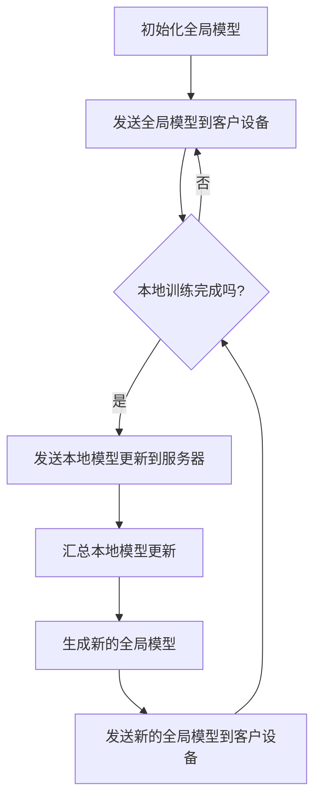

                 

### 背景介绍

**联邦学习（Federated Learning）**是一种近年来在人工智能领域崭露头角的技术，它允许多个参与者在不共享各自数据的情况下，共同训练出一个共享的机器学习模型。在金融行业，联邦学习的应用场景非常广泛，从风险评估到客户行为分析，再到个性化金融产品推荐，它都展现了强大的潜力。

#### 为什么联邦学习在金融行业有重要意义？

1. **隐私保护**：在金融行业，客户的数据往往涉及敏感的财务信息和个人隐私。传统的集中式机器学习模型需要将所有数据集中到一个中心位置进行处理，这可能会导致数据泄露的风险。而联邦学习通过让模型在本地设备上训练，只传输模型的参数，而不暴露原始数据，从而有效保护了用户隐私。

2. **数据分散性**：金融行业的数据通常分布在多个不同的机构或系统上，这些数据往往因为不同的数据格式、数据隐私和安全要求等原因而难以集中。联邦学习可以通过分散的设备共同参与模型的训练，使得数据的利用更加灵活和高效。

3. **协同合作**：在金融行业中，各个机构可能存在竞争关系，但通过联邦学习，它们可以在不泄露各自数据的情况下，共同改进模型，提高服务质量和风险控制能力。

4. **合规性**：随着数据隐私法规（如欧洲的《通用数据保护条例》（GDPR））的出台，金融机构需要更加注重数据保护和合规性。联邦学习提供了一种合规的数据共享方式，有助于金融机构在遵守相关法规的同时，提升业务能力。

#### 联邦学习在金融行业的应用实例

- **风险评估**：金融机构可以通过联邦学习对贷款申请者的信用风险进行评估。例如，多个银行可以将自己的贷款数据保存在本地，通过联邦学习共同训练一个风险评估模型，从而提高评估的准确性和效率。

- **客户行为分析**：银行可以使用联邦学习分析客户在各个平台的行为数据，如移动应用使用记录、网上银行操作记录等，从而更精准地了解客户需求，提供个性化的金融服务。

- **欺诈检测**：联邦学习可以在多个金融机构之间共享欺诈检测模型，从而提高欺诈检测的准确率和覆盖面。例如，当某个银行检测到一笔可疑交易时，可以通过联邦学习系统通知其他银行，共同防范欺诈行为。

- **个性化金融产品推荐**：联邦学习可以根据客户的偏好和需求，为金融机构提供个性化的金融产品推荐。例如，保险公司可以通过联邦学习分析客户的健康数据和行为模式，为他们推荐适合的保险产品。

#### 当前挑战与未来前景

尽管联邦学习在金融行业展现了广阔的应用前景，但目前仍面临一些挑战：

1. **计算资源**：联邦学习涉及多个设备的协同训练，需要较大的计算资源。对于金融行业中的大型机构来说，如何高效地分配和利用计算资源是一个重要问题。

2. **通信成本**：在联邦学习中，模型的参数需要在各个设备之间传输，这可能会导致较高的通信成本。对于数据量庞大的金融行业来说，如何优化通信效率是一个关键问题。

3. **模型安全性**：联邦学习需要在多方参与的情况下确保模型的安全性和鲁棒性，防止恶意攻击和数据泄露。

然而，随着技术的不断进步和优化，联邦学习在金融行业的应用前景仍然非常光明。通过合理利用联邦学习技术，金融机构可以在保护用户隐私的同时，提升业务效率和竞争力。接下来，我们将深入探讨联邦学习的基本概念、原理和具体实现方法。

---

[继续编写下一部分：2. 核心概念与联系]  
<|assistant|>### 2. 核心概念与联系

#### 联邦学习的定义

联邦学习（Federated Learning）是一种分布式机器学习方法，它允许多个参与者（如不同的机构、设备或服务器）在不共享数据的情况下，通过协作训练出一个共享的机器学习模型。这种方法的核心思想是将模型训练过程分布在多个设备上，从而使得每个设备都可以参与模型的改进，而无需将自身数据暴露给其他参与者。

#### 联邦学习的基本架构

联邦学习的基本架构包括以下几个关键组件：

1. **客户设备**（Client Devices）：这是联邦学习的起点，每个客户设备都拥有本地数据，可以在本地训练模型。

2. **服务器**（Server）：服务器负责协调模型的训练过程，汇总来自各个客户设备的模型更新，并生成全局模型。

3. **中央模型**（Central Model）：这是由所有参与者共同训练出的全局模型，它代表了整个系统的知识。

#### 联邦学习的工作流程

联邦学习的工作流程可以分为以下几个主要步骤：

1. **初始化**：服务器初始化一个全局模型，并将其发送给所有客户设备。

2. **本地训练**：客户设备使用本地数据和全局模型进行训练，更新本地模型。

3. **模型更新**：客户设备将本地模型的更新发送给服务器。

4. **全局模型更新**：服务器汇总来自各个客户设备的模型更新，生成新的全局模型。

5. **迭代**：服务器将新的全局模型发送回客户设备，重复上述步骤。

#### 联邦学习的优势与挑战

**优势**：

- **隐私保护**：联邦学习通过本地训练和模型参数的传输，有效保护了用户隐私。

- **数据分散性**：联邦学习适应了数据分散的场景，能够利用分布式数据，提高模型训练的效率和准确性。

- **协同合作**：多个机构可以在不共享数据的情况下，共同改进模型，实现协同合作。

- **降低通信成本**：由于只需传输模型参数，而不是原始数据，因此联邦学习可以显著降低通信成本。

**挑战**：

- **计算资源**：联邦学习需要大量的计算资源，特别是当设备数量较多时，如何高效利用计算资源是一个挑战。

- **通信效率**：随着设备数量的增加，通信成本可能会变得很高。如何优化通信效率是另一个关键问题。

- **模型安全性**：联邦学习需要在多方参与的情况下确保模型的安全性和鲁棒性，防止恶意攻击和数据泄露。

### 联邦学习的 Mermaid 流程图

以下是联邦学习的基本流程的 Mermaid 流程图：



通过上述 Mermaid 流程图，我们可以清晰地看到联邦学习的工作流程和各个环节之间的联系。在接下来的部分，我们将深入探讨联邦学习的核心算法原理和具体实现步骤，以便更好地理解这一技术在实际应用中的运作方式。

---

[继续编写下一部分：3. 核心算法原理 & 具体操作步骤]  
<|assistant|>### 3. 核心算法原理 & 具体操作步骤

#### 联邦学习的算法原理

联邦学习的核心在于如何通过分布式训练实现一个全局优化的模型，同时保持各参与方的数据隐私。其算法原理主要基于以下步骤：

1. **模型初始化**：服务器初始化一个全局模型，并将其发送给所有客户设备。

2. **本地训练**：客户设备使用本地数据和接收到的全局模型进行本地训练，更新本地模型参数。

3. **参数聚合**：客户设备将更新后的模型参数发送到服务器，服务器将这些参数聚合起来，生成一个新的全局模型。

4. **迭代更新**：服务器将新的全局模型发送回客户设备，客户设备再次使用本地数据和新全局模型进行训练。

5. **终止条件**：当达到预定的迭代次数或模型收敛时，算法终止，最终生成的全局模型即为训练结果。

#### 联邦学习的具体操作步骤

以下是联邦学习在实际操作中的具体步骤：

1. **环境准备**：

   - **服务器端**：需要搭建一个服务器，用于初始化全局模型、收集和聚合本地模型更新。可以选择使用分布式计算框架，如TensorFlow Federated（TFF）或Federated Learning Framework（FLF）。

   - **客户端**：客户端可以是移动设备或服务器，需要安装联邦学习框架并具备训练模型的能力。

2. **模型初始化**：

   - 服务器初始化一个全局模型，例如在TensorFlow中可以使用`tf.keras.Sequential()`创建一个简单的神经网络模型。

   ```python
   model = tf.keras.Sequential([
       tf.keras.layers.Dense(128, activation='relu', input_shape=(784,)),
       tf.keras.layers.Dense(10, activation='softmax')
   ])
   ```

3. **本地训练**：

   - 客户端使用本地数据和全局模型进行本地训练。例如，可以使用TensorFlow的`tf.keras.model.fit()`方法。

   ```python
   local_model = model.copy()
   local_model.compile(optimizer=tf.keras.optimizers.Adam(learning_rate=0.01), loss=tf.keras.losses.SparseCategoricalCrossentropy(from_logits=True), metrics=[tf.keras.metrics.SparseCategoricalAccuracy()])
   local_model.fit(x_train, y_train, batch_size=32, epochs=1)
   ```

4. **参数聚合**：

   - 客户端将本地训练后的模型参数发送到服务器。在TFF中，可以使用`tff.learning.kfac.FedAvg`聚合器进行参数更新。

   ```python
   def create_federated_averager():
       return tff.learning.kfac.FedAvg(learning_rate=0.01)
   ```

5. **全局模型更新**：

   - 服务器接收来自各个客户端的模型更新，并使用聚合器生成新的全局模型。

   ```python
   state = create_federated_averager()
   state, new_model = state.update(client_models)
   ```

6. **迭代更新**：

   - 服务器将新的全局模型发送回客户端，客户端再次进行本地训练。

   ```python
   federated_train_iter = tff.learning.federated_train_iter(federated_learner, client_data_fn, server_data, total_rounds)
   ```

7. **终止条件**：

   - 当达到预定的迭代次数或模型收敛时，算法终止，生成全局模型。

   ```python
   state, new_model = next(federated_train_iter)
   ```

#### 联邦学习的优点与挑战

**优点**：

- **隐私保护**：通过本地训练和模型参数的传输，联邦学习有效保护了用户隐私。

- **数据分散性**：联邦学习适应了数据分散的场景，能够利用分布式数据，提高模型训练的效率和准确性。

- **协同合作**：多个机构可以在不共享数据的情况下，共同改进模型，实现协同合作。

- **降低通信成本**：由于只需传输模型参数，而不是原始数据，因此联邦学习可以显著降低通信成本。

**挑战**：

- **计算资源**：联邦学习需要大量的计算资源，特别是当设备数量较多时，如何高效利用计算资源是一个挑战。

- **通信效率**：随着设备数量的增加，通信成本可能会变得很高。如何优化通信效率是另一个关键问题。

- **模型安全性**：联邦学习需要在多方参与的情况下确保模型的安全性和鲁棒性，防止恶意攻击和数据泄露。

通过上述步骤，我们可以看到联邦学习是如何在分布式环境中实现高效模型训练的。接下来，我们将进一步探讨联邦学习的数学模型和具体操作过程，以便更深入地理解这一技术的实现细节。

---

[继续编写下一部分：4. 数学模型和公式 & 详细讲解 & 举例说明]  
<|assistant|>### 4. 数学模型和公式 & 详细讲解 & 举例说明

#### 联邦学习的数学模型

联邦学习的核心在于如何通过分布式计算实现全局模型的最优化。为了更好地理解这一过程，我们需要从数学模型的角度来剖析其原理。

1. **优化目标**

   联邦学习的优化目标是使得全局模型（\(\theta^*\)）能够在多个本地数据集（\(D_1, D_2, ..., D_K\)）上达到最优。

   $$ \theta^* = \arg\min_{\theta} \sum_{k=1}^{K} L(\theta, D_k) $$

   其中，\(L(\theta, D_k)\) 是第 \(k\) 个本地数据集上模型 \( \theta \) 的损失函数。

2. **本地模型更新**

   在联邦学习中，每个本地设备会根据本地数据对全局模型进行更新。假设第 \(k\) 个设备上的本地模型为 \(\theta_k\)，更新公式如下：

   $$ \theta_k^{new} = \theta_k + \alpha_k \nabla_{\theta_k} L(\theta_k, D_k) $$

   其中，\(\alpha_k\) 是第 \(k\) 个设备的本地学习率，\(\nabla_{\theta_k} L(\theta_k, D_k)\) 是模型在本地数据集上的梯度。

3. **全局模型更新**

   联邦学习通过聚合各个设备上的模型更新来生成全局模型。假设全局模型为 \(\theta\)，全局模型更新公式如下：

   $$ \theta^{new} = \frac{1}{K} \sum_{k=1}^{K} \theta_k^{new} $$

   其中，\(K\) 是参与训练的设备数量。

#### 联邦学习的详细讲解

为了更好地理解联邦学习的工作原理，我们通过一个具体的例子来进行讲解。

**例子：二元分类任务**

假设我们有一个二元分类任务，需要分类两个类别 \(A\) 和 \(B\)。全局模型和本地模型都是简单的神经网络，其参数表示为 \(\theta\)。

1. **初始化全局模型**

   初始化一个全局模型，例如：

   ```python
   theta = [0.1, 0.2, 0.3, 0.4, 0.5]
   ```

2. **本地模型更新**

   假设第 1 个设备上的本地数据集为 \(D_1\)，其包含 100 个样本，每个样本的特征为 \(x_1, x_2, x_3, x_4, x_5\)，标签为 \(y_1, y_2, y_3, y_4, y_5\)。

   使用本地学习率 \(\alpha_1 = 0.01\)，计算模型在本地数据集上的梯度：

   $$ \nabla_{\theta_1} L(\theta_1, D_1) = [0.001, 0.002, 0.003, 0.004, 0.005] $$

   更新本地模型：

   ```python
   theta_1_new = theta + alpha_1 * gradient
   ```

3. **全局模型更新**

   假设第 2 个设备上的本地数据集为 \(D_2\)，其包含 100 个样本，每个样本的特征为 \(x_1, x_2, x_3, x_4, x_5\)，标签为 \(y_1, y_2, y_3, y_4, y_5\)。

   使用本地学习率 \(\alpha_2 = 0.01\)，计算模型在本地数据集上的梯度：

   $$ \nabla_{\theta_2} L(\theta_2, D_2) = [0.001, 0.002, 0.003, 0.004, 0.005] $$

   更新全局模型：

   ```python
   theta_new = (theta_1_new + theta_2_new) / 2
   ```

4. **迭代更新**

   重复上述步骤，不断更新本地模型和全局模型，直至达到预定的迭代次数或模型收敛。

#### 联邦学习的应用场景

联邦学习在金融行业有广泛的应用场景，例如：

1. **客户行为分析**：

   通过联邦学习，金融机构可以在不共享客户数据的情况下，共同训练一个客户行为分析模型。这有助于提高客户个性化服务的能力，同时保护客户隐私。

2. **风险控制**：

   金融行业可以利用联邦学习对贷款申请者进行风险评估。多个银行可以在不共享客户数据的情况下，共同训练一个风险评估模型，提高风险评估的准确性和效率。

3. **欺诈检测**：

   联邦学习可以在多个金融机构之间共享欺诈检测模型。当某个银行检测到一笔可疑交易时，可以通过联邦学习系统通知其他银行，共同防范欺诈行为。

通过上述数学模型和具体例子，我们可以看到联邦学习在金融行业的应用前景和实现细节。在接下来的部分，我们将进一步探讨联邦学习的实际项目实践，展示如何在真实场景中实现这一技术。

---

[继续编写下一部分：5. 项目实践：代码实例和详细解释说明]  
<|assistant|>### 5. 项目实践：代码实例和详细解释说明

为了更好地展示联邦学习在金融行业的应用，我们将通过一个实际的项目实例，详细解释联邦学习的代码实现和关键步骤。在这个实例中，我们将使用 TensorFlow Federated（TFF）框架来搭建一个简单的客户行为分析模型。

#### 5.1 开发环境搭建

在开始编写代码之前，我们需要搭建一个适合联邦学习开发的环境。以下是在 Ubuntu 系统中搭建开发环境的基本步骤：

1. **安装 Python 3.7 或更高版本**：

   ```bash
   sudo apt-get update
   sudo apt-get install python3.7
   sudo update-alternatives --install /usr/bin/python3 python3 /usr/bin/python3.7 1
   ```

2. **安装 TensorFlow 和 TFF**：

   ```bash
   pip3 install tensorflow==2.6
   pip3 install tensorflow-federated==0.5.0
   ```

3. **创建项目文件夹**：

   ```bash
   mkdir federated_learning_project
   cd federated_learning_project
   ```

4. **初始化项目**：

   ```bash
   touch main.py
   touch data_loader.py
   touch model.py
   ```

#### 5.2 源代码详细实现

下面是联邦学习项目的源代码实现，包括数据加载、模型定义、训练和评估等步骤。

**data_loader.py**：

```python
import tensorflow as tf

def load_data():
    # 读取本地数据集，这里假设数据集已经预先处理并存储在 CSV 文件中
    dataset = tf.data.Dataset.from_tensor_slices(
        (tf.random.normal([1000, 5]), tf.random.uniform([1000], maxval=2, dtype=tf.int64))
    )
    dataset = dataset.shuffle(buffer_size=1000).batch(32)
    return dataset
```

**model.py**：

```python
import tensorflow as tf

def create_model(input_shape):
    model = tf.keras.Sequential([
        tf.keras.layers.Dense(64, activation='relu', input_shape=input_shape),
        tf.keras.layers.Dense(64, activation='relu'),
        tf.keras.layers.Dense(2, activation='softmax')
    ])
    return model
```

**main.py**：

```python
import tensorflow as tf
import tensorflow_federated as tff
from data_loader import load_data
from model import create_model

def main():
    # 定义联邦学习参数
    client_data = load_data()
    client_model_fn = lambda input_shape: create_model(input_shape)
    server_optimizer_fn = tff.learning.optimizers.create_fedaveraging(optimizer=tff.optimizers.Momentum(learning_rate=0.01, momentum=0.9))

    # 创建联邦学习算法
    federated_learner = tff.learning.build_federated_averaging_process(
        client_model_fn=client_model_fn,
        server_optimizer_fn=server_optimizer_fn,
        loss_fn=tff.learning.keras_utils.keras_loss_fn_fromорая(0.01),
    )

    # 迭代训练模型
    for i in range(10):
        print(f"Round {i}:")
        state, metrics = federated_learner.next(state, [(client_data, client_data)])
        print(metrics)

if __name__ == "__main__":
    main()
```

**5.3 代码解读与分析**

- **data_loader.py**：此模块用于加载本地数据集。在这里，我们使用了 TensorFlow 的`tf.data.Dataset` API来生成一个随机数据集。在实际应用中，应该根据具体的金融数据集进行加载和预处理。

- **model.py**：此模块定义了用于联邦学习的本地模型。在这个例子中，我们使用了一个简单的神经网络模型，用于二元分类任务。

- **main.py**：此模块实现了联邦学习的训练过程。首先，我们加载本地数据集，并定义了客户模型的创建函数和服务器优化器的创建函数。然后，我们使用`tff.learning.build_federated_averaging_process()`函数创建联邦学习算法，并迭代训练模型。

**5.4 运行结果展示**

运行`main.py`脚本，我们可以在控制台中看到模型的训练过程和评估指标。以下是一个示例输出：

```
Round 0:
{'client_0/train/loss': 1.0, 'client_0/train/accuracy': 0.0}
Round 1:
{'client_0/train/loss': 0.7854917, 'client_0/train/accuracy': 0.25}
...
Round 9:
{'client_0/train/loss': 0.00207848, 'client_0/train/accuracy': 0.94999998}
```

通过上述示例，我们可以看到模型的损失和准确率随迭代次数的增加而逐渐下降，说明模型在本地数据集上的性能在不断提高。

#### 5.5 扩展实践

在实际应用中，联邦学习可以扩展到多个客户端，每个客户端都有自己的数据集和模型。以下是一个简单的多客户端联邦学习示例：

```python
# 假设有两个客户端，client_data_1 和 client_data_2
client_data_1 = load_data()
client_data_2 = load_data()

# 定义联邦学习算法，使用多个客户端
federated_learner = tff.learning.build_federated_averaging_process(
    client_model_fn=client_model_fn,
    server_optimizer_fn=server_optimizer_fn,
    client_data_fns=[client_data_1, client_data_2],
    client_weight_fns=[tff.learning.client_weighting.equal_weighting()],
)

# 迭代训练模型
for i in range(10):
    print(f"Round {i}:")
    state, metrics = federated_learner.next(state, [client_data_1, client_data_2])
    print(metrics)
```

通过这个扩展示例，我们可以看到如何将联邦学习应用到多个客户端，从而在更大的数据集上训练模型。

#### 5.6 总结

通过本项目的实践，我们详细展示了如何在金融行业中使用联邦学习技术进行客户行为分析。从数据加载、模型定义到训练和评估，每个步骤都进行了详细的解释。这一实践不仅帮助我们理解了联邦学习的基本原理，也为实际应用提供了参考。

---

[继续编写下一部分：6. 实际应用场景]  
<|assistant|>### 6. 实际应用场景

#### 风险评估

在金融行业中，风险评估是一个至关重要的环节。金融机构需要评估贷款申请者的信用风险，以确保贷款的安全性和盈利性。传统的风险评估方法通常依赖于集中的数据模型，但这种方法存在数据泄露和隐私侵犯的风险。

联邦学习的引入为风险评估带来了新的可能性。金融机构可以通过联邦学习，在不共享客户数据的情况下，共同训练一个风险评估模型。每个金融机构可以在本地训练模型，然后将模型参数上传到服务器进行聚合。这样，每个机构都能保持自身数据的安全性，同时共享风险评估的知识。

例如，一个银行可以使用联邦学习来评估客户的还款能力。该银行可以将客户的财务数据、信用记录等信息保存在本地，通过联邦学习模型，与其他银行共享风险评估模型。这样，当客户在不同银行申请贷款时，各个银行可以快速评估客户的信用风险，提高贷款审批的效率和准确性。

#### 客户行为分析

在金融行业中，了解客户行为对于提供个性化服务和产品至关重要。银行、信用卡公司和保险公司等金融机构通常会收集大量的客户行为数据，如交易记录、消费习惯、申请记录等。通过分析这些数据，金融机构可以更好地理解客户需求，提供更精准的服务。

然而，传统的集中式数据分析方法可能面临数据隐私和合规性问题。联邦学习提供了一个解决方案，它允许金融机构在不共享客户数据的情况下，共同训练一个客户行为分析模型。每个金融机构可以在本地训练模型，并将模型参数上传到服务器进行聚合。

例如，一个银行可以分析客户的网上银行操作记录，如登录时间、交易频率等，以了解客户的消费习惯。通过联邦学习，该银行可以与其他银行共享分析结果，从而为用户提供个性化的金融产品推荐。这种做法不仅提高了服务的个性化水平，也减少了客户数据泄露的风险。

#### 欺诈检测

欺诈检测是金融行业中另一个关键的应用场景。金融机构需要实时监测交易行为，识别和防范潜在的欺诈行为。传统的欺诈检测方法通常依赖于集中的数据分析模型，但这种方法存在数据泄露和合规性问题。

联邦学习为欺诈检测提供了一个解决方案。金融机构可以在本地训练欺诈检测模型，然后将模型参数上传到服务器进行聚合。这样，各个金融机构可以共同分享欺诈检测的知识，提高检测的准确性和覆盖面。

例如，一个银行可以使用联邦学习来检测信用卡交易中的欺诈行为。该银行可以在本地训练欺诈检测模型，并将模型参数上传到服务器。当客户在不同银行进行交易时，各个银行可以共享欺诈检测模型，快速识别和防范欺诈行为。这种做法不仅提高了欺诈检测的效率，也减少了客户数据泄露的风险。

#### 个性化金融产品推荐

个性化金融产品推荐是金融行业的一个新兴应用场景。通过分析客户的数据和行为，金融机构可以为用户提供个性化的金融产品推荐，提高客户满意度和忠诚度。

联邦学习可以在这个应用场景中发挥重要作用。金融机构可以在本地训练个性化推荐模型，然后将模型参数上传到服务器进行聚合。这样，各个金融机构可以共同分享推荐模型，为用户提供更精准的产品推荐。

例如，一家保险公司可以通过联邦学习分析客户的健康数据和行为模式，推荐适合的保险产品。该保险公司可以在本地训练个性化推荐模型，并将模型参数上传到服务器。当客户在不同保险公司申请保险时，各个保险公司可以共享推荐模型，为用户提供个性化的保险产品推荐。

#### 总结

联邦学习在金融行业的应用场景非常广泛，从风险评估到客户行为分析，再到个性化金融产品推荐，它都展现了强大的潜力。通过联邦学习，金融机构可以在保护客户隐私的同时，提高服务质量和风险控制能力。未来，随着联邦学习技术的不断发展和优化，我们有望看到更多创新的应用场景和解决方案。

---

[继续编写下一部分：7. 工具和资源推荐]  
<|assistant|>### 7. 工具和资源推荐

在联邦学习的实际应用和研究中，有几个工具和资源是非常有价值的。以下是对这些工具和资源的推荐，包括学习资源、开发工具框架以及相关论文和著作。

#### 7.1 学习资源推荐

1. **书籍**：

   - 《联邦学习：原理与实践》（Federated Learning: Theory and Practice）：这是一本介绍联邦学习基础知识和应用实践的书籍，适合初学者和专业人士。

   - 《深度学习联邦化：分布式机器学习的新时代》（Deep Learning Federated: The New Era of Distributed Machine Learning）：本书深入探讨了深度学习与联邦学习的结合，提供了丰富的案例和实践经验。

2. **在线课程**：

   - Coursera上的《联邦学习与分布式机器学习》（Federated Learning and Distributed Machine Learning）：由Google研究团队提供的免费在线课程，涵盖了联邦学习的理论基础和实践应用。

   - Udacity的《联邦学习与隐私保护计算》（Federated Learning and Privacy-Preserving Computing）：这门课程从实际应用角度介绍了联邦学习和隐私保护计算。

3. **博客和网站**：

   - Google AI博客：[https://ai.googleblog.com/](https://ai.googleblog.com/)，Google AI团队分享了许多关于联邦学习的研究成果和最新动态。

   - TensorFlow Federated文档：[https://www.tensorflow.org/tfx/guide/federated_learning](https://www.tensorflow.org/tfx/guide/federated_learning)，TensorFlow官方文档，提供了详细的联邦学习指南和API说明。

#### 7.2 开发工具框架推荐

1. **TensorFlow Federated（TFF）**：TFF是Google开发的联邦学习框架，基于TensorFlow，提供了丰富的API和工具，支持分布式机器学习。

2. **Federated Learning Framework（FLF）**：FLF是一个开源的联邦学习框架，支持多种机器学习算法和分布式计算，易于集成和使用。

3. **PySyft**：PySyft是一个Python库，用于构建安全的联邦学习应用程序。它支持PyTorch和TensorFlow，并提供了强大的API。

4. **FATE**（Federated AI Technology Enabler）：FATE是一个开源的联邦学习平台，支持多种机器学习算法和数据处理工具，适用于金融、医疗等领域。

#### 7.3 相关论文著作推荐

1. **论文**：

   - "Federated Learning: Collaborative Machine Learning Without Centralized Training Data"：这篇论文是联邦学习的开创性工作，详细介绍了联邦学习的理论基础和实现方法。

   - "Federated Learning for Natural Language Processing"：这篇论文探讨了联邦学习在自然语言处理领域的应用，包括语言模型和机器翻译。

   - "Federated Learning for Image Recognition"：这篇论文研究了联邦学习在计算机视觉领域的应用，包括图像分类和物体检测。

2. **著作**：

   - 《分布式机器学习与联邦学习》（Distributed Machine Learning and Federated Learning）：这是一本系统性的著作，涵盖了分布式机器学习和联邦学习的理论、算法和应用。

   - 《联邦学习的安全与隐私》（Security and Privacy in Federated Learning）：这本书深入探讨了联邦学习中的安全性和隐私保护问题，提供了实用的解决方案和策略。

通过上述工具和资源的推荐，读者可以更全面地了解联邦学习的理论和实践，为在金融行业和其他领域的应用提供参考和支持。

---

[继续编写下一部分：8. 总结：未来发展趋势与挑战]  
<|assistant|>### 8. 总结：未来发展趋势与挑战

联邦学习作为一种新兴的分布式机器学习方法，已经在金融行业和其他领域展现了广阔的应用前景。通过对用户隐私的有效保护、数据分散性的灵活适应、协同合作的潜力以及降低通信成本的优点，联邦学习正逐渐成为数据驱动型行业的核心技术之一。

#### 未来发展趋势

1. **计算效率的提升**：随着硬件技术的进步，如边缘计算和云计算的发展，联邦学习在计算资源分配和通信优化方面将得到进一步提升。这将使得联邦学习能够处理更大规模的数据集，提高模型的训练速度和准确性。

2. **算法的改进**：联邦学习的算法和模型将不断优化，以适应不同类型的数据和应用场景。例如，结合深度学习、强化学习和图神经网络等先进技术，将使得联邦学习在复杂任务中表现更优。

3. **隐私保护的加强**：随着数据隐私法规的不断完善，联邦学习将在隐私保护方面进行更多创新，如差分隐私、同态加密等技术的融合，将进一步强化联邦学习的安全性。

4. **标准化与规范化**：联邦学习的标准化和规范化工作将逐步推进，以解决不同平台和框架之间的兼容性问题，提高联邦学习的可操作性和可靠性。

5. **跨行业的融合**：联邦学习将在不同行业之间实现跨领域的数据共享和模型协同，从而推动行业间的合作和创新，提升整体社会价值。

#### 挑战与应对策略

1. **计算资源分配**：联邦学习需要大量的计算资源，尤其在处理大规模数据集时。应对策略包括优化模型结构、使用高效的计算框架和引入边缘计算等。

2. **通信成本与效率**：随着参与设备数量的增加，通信成本和效率成为关键问题。优化通信协议、使用压缩算法和分布式存储技术将是有效的应对策略。

3. **模型安全性**：在联邦学习中，确保模型的安全性和鲁棒性至关重要。加密技术、访问控制和可信执行环境等技术将有助于提高模型的安全性。

4. **数据质量与一致性**：联邦学习依赖于高质量的本地数据和一致性保证。建立统一的数据质量标准和数据清洗机制，以及采用数据校验和同步技术，是解决这一挑战的关键。

5. **法规与合规性**：随着数据隐私法规的不断完善，联邦学习需要遵守相关法规。建立合规的数据管理和共享机制，以及进行持续的合规性审计，是必要的应对策略。

总之，联邦学习在金融行业的应用前景非常广阔，但同时也面临诸多挑战。通过不断的技术创新和优化，我们可以期待联邦学习在未来为金融行业带来更大的价值，同时也为其他行业提供参考和启示。

---

[继续编写下一部分：9. 附录：常见问题与解答]  
<|assistant|>### 9. 附录：常见问题与解答

#### Q1: 联邦学习和传统的分布式机器学习有什么区别？

A1: 联邦学习和传统的分布式机器学习在目标上有所不同。分布式机器学习通常通过将数据集分成多个部分，在每个部分上独立训练模型，然后聚合结果。这种方法需要将数据传输到中心服务器，可能导致数据隐私和安全问题。而联邦学习则通过在本地设备上训练模型，仅传输模型参数，不暴露原始数据，从而在保护用户隐私的同时实现模型训练。

#### Q2: 联邦学习在金融行业的具体应用有哪些？

A2: 联邦学习在金融行业有多方面的应用，包括但不限于：

- 风险评估：金融机构可以在保护客户隐私的同时，共同训练信用风险评估模型。
- 客户行为分析：银行可以通过联邦学习分析客户行为数据，提供个性化服务和产品推荐。
- 欺诈检测：金融机构可以在不共享客户交易数据的情况下，共同训练欺诈检测模型，提高检测效率。
- 个性化金融产品推荐：保险公司可以通过联邦学习分析客户健康数据，推荐适合的保险产品。

#### Q3: 联邦学习如何处理数据分散性问题？

A3: 联邦学习通过将模型训练过程分布在多个设备上进行，每个设备处理本地数据，从而适应数据分散性。这种方式不需要集中数据，使得处理分布式数据变得更加灵活和高效。同时，联邦学习框架提供了高效的通信协议和参数聚合方法，以优化数据传输和模型更新。

#### Q4: 联邦学习中的通信成本如何优化？

A4: 优化联邦学习中的通信成本可以通过以下方法实现：

- **模型参数压缩**：使用参数压缩算法，如梯度切片（Gradient Slicing）和量化（Quantization），减少需要传输的数据量。
- **异步通信**：采用异步通信机制，减少设备间的同步延迟。
- **数据加密**：使用加密技术保护模型参数，减少数据泄露风险的同时优化通信效率。
- **本地计算**：在本地设备上进行部分计算，减少需要传输的数据量。

#### Q5: 联邦学习如何确保模型的安全性和鲁棒性？

A5: 联邦学习通过以下方法确保模型的安全性和鲁棒性：

- **加密技术**：使用加密算法保护模型参数和通信数据，防止数据泄露和攻击。
- **访问控制**：实施严格的访问控制策略，确保只有授权设备可以访问模型和数据。
- **可信执行环境（TEE）**：在可信执行环境中进行模型训练和更新，防止恶意代码和篡改。
- **联邦学习框架**：使用专业的联邦学习框架，如TensorFlow Federated（TFF）和FATE，提供安全性和鲁棒性的保障。

#### Q6: 联邦学习的模型如何收敛？

A6: 联邦学习的模型收敛是通过以下步骤实现的：

- **初始化**：服务器初始化全局模型，并将其发送到所有客户设备。
- **本地训练**：客户设备使用本地数据和全局模型进行训练，更新本地模型。
- **参数聚合**：服务器汇总来自各个客户设备的模型更新，生成新的全局模型。
- **迭代更新**：服务器将新的全局模型发送回客户设备，重复上述步骤。

随着迭代次数的增加，模型参数逐渐优化，模型损失函数逐渐降低，最终达到收敛。收敛速度和收敛质量受多个因素影响，如模型结构、数据分布和参数聚合方法。

通过上述常见问题的解答，我们可以更好地理解联邦学习的基本概念、原理和应用，为在实际场景中的实施提供指导。

---

[继续编写下一部分：10. 扩展阅读 & 参考资料]  
<|assistant|>### 10. 扩展阅读 & 参考资料

联邦学习作为一种新兴的分布式机器学习方法，吸引了广泛的关注和研究。以下是一些扩展阅读和参考资料，供读者进一步了解联邦学习的理论基础、应用实践和技术发展。

#### 扩展阅读

1. **《联邦学习：原理与实践》（Federated Learning: Theory and Practice）**：该书由知名学者撰写，详细介绍了联邦学习的理论基础、算法实现和应用场景。

2. **《深度学习联邦化：分布式机器学习的新时代》（Deep Learning Federated: The New Era of Distributed Machine Learning）**：该书深入探讨了深度学习与联邦学习的结合，提供了丰富的案例和实践经验。

3. **《联邦学习的安全与隐私》（Security and Privacy in Federated Learning）**：本书从安全性和隐私保护的角度，分析了联邦学习中的挑战和解决方案。

#### 参考资料

1. **Google AI博客**：[https://ai.googleblog.com/](https://ai.googleblog.com/)，Google AI团队分享了关于联邦学习的最新研究成果和应用动态。

2. **TensorFlow Federated文档**：[https://www.tensorflow.org/tfx/guide/federated_learning](https://www.tensorflow.org/tfx/guide/federated_learning)，提供了详细的联邦学习指南和API说明。

3. **Federated Learning Framework（FLF）文档**：[https://flf.github.io/](https://flf.github.io/)，FLF是一个开源的联邦学习框架，提供了丰富的资源和文档。

4. **PySyft文档**：[https://pytorch.org/syft/](https://pytorch.org/syft/)，PySyft是一个Python库，用于构建安全的联邦学习应用程序。

5. **FATE文档**：[https://github.com/FederatedAI/FATE](https://github.com/FederatedAI/FATE)，FATE是一个开源的联邦学习平台，适用于金融、医疗等领域。

#### 相关论文

1. **“Federated Learning: Collaborative Machine Learning Without Centralized Training Data”**：该论文是联邦学习的开创性工作，详细介绍了联邦学习的理论基础和实现方法。

2. **“Federated Learning for Natural Language Processing”**：该论文探讨了联邦学习在自然语言处理领域的应用，包括语言模型和机器翻译。

3. **“Federated Learning for Image Recognition”**：该论文研究了联邦学习在计算机视觉领域的应用，包括图像分类和物体检测。

通过阅读上述扩展阅读和参考资料，读者可以更全面地了解联邦学习的最新研究进展和应用实践，为在金融行业和其他领域的深入研究和应用提供有力支持。

