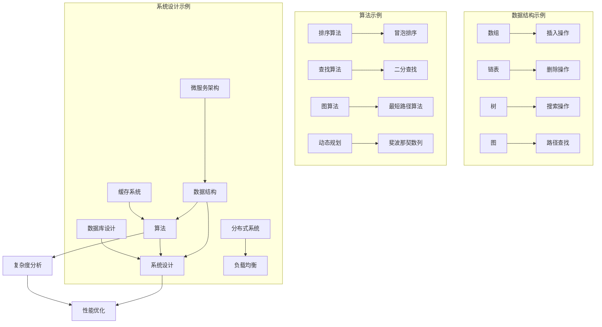

                 

### 1. 背景介绍

随着信息技术的发展，计算机科学在过去的几十年里经历了飞速的变革。从最初的计算机硬件到现代的云计算、大数据、人工智能，每一个阶段都带来了新的挑战和机遇。2025年的腾讯校招面试题与算法编程题，正是这种技术发展背景下的一次重要实践。本文旨在通过对这些面试题的深入分析和解答，帮助准备参加腾讯校招的同学更好地理解面试过程中的核心问题和应对策略。

腾讯作为中国领先的高科技企业，不仅在互联网领域有着广泛的影响力，其招聘标准也一直以来都是业内标杆。校招面试题目涵盖算法、数据结构、系统设计等多个方面，对候选人的综合素质和技术能力提出了极高的要求。因此，掌握这些题目的解答不仅有助于提升技术能力，还能为未来的职业发展打下坚实的基础。

本文将围绕以下几个核心部分展开：

1. **核心概念与联系**：介绍与面试题目相关的核心概念，并通过Mermaid流程图展示其原理和架构。
2. **核心算法原理 & 具体操作步骤**：详细解析面试题所涉及的算法原理，提供清晰的步骤说明。
3. **数学模型和公式**：介绍用于解决面试题的数学模型和公式，通过示例进行详细讲解。
4. **项目实践**：提供代码实例，详细解释代码实现过程，并展示运行结果。
5. **实际应用场景**：分析这些算法在实际项目中的应用。
6. **工具和资源推荐**：推荐学习资源、开发工具和框架。
7. **总结**：讨论未来发展趋势与挑战。
8. **附录**：常见问题与解答。
9. **扩展阅读 & 参考资料**：提供进一步学习的资源。

通过本文的深入分析和讲解，希望能够帮助读者更好地掌握这些面试题目，提升自己的技术水平，为未来的职业道路奠定坚实的基础。

### 2. 核心概念与联系

在解答2025腾讯校招面试题之前，我们需要了解一些核心概念和它们之间的联系。这些概念包括数据结构、算法、系统设计等，它们是计算机科学中的基础和核心。为了更直观地展示这些概念之间的关系，我们将使用Mermaid流程图来描绘其原理和架构。

首先，让我们定义几个关键的概念：

- **数据结构**：数据结构是用于存储和组织数据的特定方式，常见的有数组、链表、树、图等。
- **算法**：算法是解决问题的步骤集合，用于处理数据结构中的数据。
- **系统设计**：系统设计涉及如何设计一个完整的计算机系统，包括硬件和软件组件。

下面是使用Mermaid绘制的流程图，展示了这些核心概念之间的联系：



通过这个流程图，我们可以看到：

- **数据结构**为算法提供了操作的基础，而算法则在数据结构上执行特定的任务。
- **系统设计**涉及到如何将这些数据结构和算法整合到一个完整的系统中，并考虑系统的性能、扩展性和可靠性。
- **复杂度分析**（D）和**性能优化**（E）是系统设计中非常重要的环节，它们决定了系统的效率和用户体验。

接下来，我们将深入探讨这些核心概念，并详细解释它们在实际问题中的应用。

#### 2.1 数据结构

数据结构是计算机科学中的基础概念，用于组织和管理数据。以下是一些常见的数据结构及其特点：

- **数组**：一个固定大小的连续内存区域，用于存储同类型的数据元素。数组提供了快速的随机访问能力，但插入和删除操作可能需要移动大量元素。
  
- **链表**：由一系列节点组成，每个节点包含数据和指向下一个节点的指针。链表提供了灵活的插入和删除操作，但访问特定元素可能需要遍历整个链表。
  
- **树**：一种分层的数据结构，每个节点有零个或多个子节点。树广泛应用于搜索和排序操作，如二叉搜索树（BST）和平衡树（AVL树）。
  
- **图**：由节点和边组成，用于表示实体之间的复杂关系。图算法广泛应用于社交网络、路由和图论问题。

#### 2.2 算法

算法是一系列解决问题的步骤。以下是一些常见的算法及其应用：

- **排序算法**：用于对数据集合进行排序。常见的排序算法包括冒泡排序（R）、快速排序、归并排序和堆排序。
  
- **查找算法**：用于在数据集合中查找特定元素。常见的查找算法包括二分查找（S）和哈希查找。
  
- **图算法**：用于解决图论问题。常见的图算法包括最短路径算法（T）和最小生成树算法。
  
- **动态规划**：用于解决最优子结构问题。常见的动态规划问题包括斐波那契数列（U）和背包问题。

#### 2.3 系统设计

系统设计涉及如何将数据结构和算法整合到一个完整的系统中。以下是一些关键概念：

- **分布式系统**：由多个独立节点组成的系统，这些节点通过网络进行通信。分布式系统提供了高可用性和可扩展性，如负载均衡（Z）和分布式缓存。
  
- **微服务架构**：一种将应用程序分解为多个小型、自治服务的架构风格。微服务架构提高了系统的灵活性和可维护性。
  
- **缓存系统**：用于存储经常访问的数据，以提高系统的响应速度。常见的缓存系统包括Redis和Memcached。
  
- **数据库设计**：涉及如何设计一个高效的数据库系统，包括表结构设计、索引策略和查询优化。

通过理解这些核心概念，我们可以更好地理解腾讯校招面试题的背景和解决方法。在下一部分，我们将深入探讨核心算法的原理和具体操作步骤。

### 3. 核心算法原理 & 具体操作步骤

在腾讯校招面试中，算法题是考察候选人技术能力的重要环节。以下是几个核心算法原理及其具体操作步骤：

#### 3.1 冒泡排序（Bubble Sort）

**原理**：冒泡排序通过重复地遍历待排序的列表，比较每对相邻的项目，并交换不满足顺序排序规则的项目。遍历列表的工作重复地进行，直到没有再需要交换的元素为止。

**操作步骤**：

1. **初始状态**：设定两个指针，一个在列表的开始位置，另一个在末尾位置。
2. **第一次遍历**：从第一个元素开始，依次与相邻的元素进行比较，如果顺序不对，则交换。
3. **第二次遍历**：从第二个元素开始，继续执行比较和交换操作，直到最后一个元素。
4. **重复遍历**：重复上述步骤，直到遍历过程中没有任何交换操作发生，即列表已经排序完成。

**代码示例**（Python）：

```python
def bubble_sort(arr):
    n = len(arr)
    for i in range(n):
        swapped = False
        for j in range(0, n-i-1):
            if arr[j] > arr[j+1]:
                arr[j], arr[j+1] = arr[j+1], arr[j]
                swapped = True
        if not swapped:
            break
    return arr

arr = [64, 34, 25, 12, 22, 11, 90]
sorted_arr = bubble_sort(arr)
print(sorted_arr)
```

#### 3.2 二分查找（Binary Search）

**原理**：二分查找算法通过将搜索范围一分为二，逐步缩小搜索范围，以高效地查找有序数组中的特定元素。

**操作步骤**：

1. **初始状态**：设定两个指针，一个指向数组的起始位置，另一个指向结束位置。
2. **查找过程**：计算中间位置，将中间位置的元素与目标值进行比较。
   - 如果中间元素等于目标值，查找成功。
   - 如果中间元素大于目标值，将右边界指针移动到中间位置之前。
   - 如果中间元素小于目标值，将左边界指针移动到中间位置之后。
3. **重复查找**：重复上述步骤，直到找到目标值或边界指针重合。

**代码示例**（Python）：

```python
def binary_search(arr, target):
    left, right = 0, len(arr) - 1
    while left <= right:
        mid = (left + right) // 2
        if arr[mid] == target:
            return mid
        elif arr[mid] < target:
            left = mid + 1
        else:
            right = mid - 1
    return -1

arr = [2, 4, 6, 8, 10, 12, 14, 16, 18, 20]
target = 10
result = binary_search(arr, target)
print(f"Element {target} is at index {result}")
```

#### 3.3 最短路径算法（Dijkstra）

**原理**：迪杰斯特拉算法用于在加权图中找到单源最短路径。算法通过优先队列来选择当前未处理的具有最小距离的顶点，并逐步更新所有其他顶点的最短路径。

**操作步骤**：

1. **初始状态**：初始化一个优先队列，将源点加入队列，并将所有顶点的距离初始化为无穷大，源点距离为0。
2. **选择顶点**：从优先队列中选择具有最小距离的顶点。
3. **更新路径**：对于当前顶点的每个相邻顶点，计算新路径长度，并更新其最短路径距离和前驱顶点。
4. **重复步骤**：重复选择顶点和更新路径的过程，直到优先队列为空。

**代码示例**（Python）：

```python
import heapq

def dijkstra(graph, start):
    distances = {node: float('infinity') for node in graph}
    distances[start] = 0
    priority_queue = [(0, start)]
    while priority_queue:
        current_distance, current_vertex = heapq.heappop(priority_queue)
        if current_distance > distances[current_vertex]:
            continue
        for neighbor, weight in graph[current_vertex].items():
            distance = current_distance + weight
            if distance < distances[neighbor]:
                distances[neighbor] = distance
                heapq.heappush(priority_queue, (distance, neighbor))
    return distances

graph = {
    'A': {'B': 2, 'C': 6, 'E': 3},
    'B': {'A': 2, 'C': 1, 'D': 5},
    'C': {'A': 6, 'B': 1, 'D': 2},
    'D': {'B': 5, 'C': 2, 'E': 1},
    'E': {'A': 3, 'D': 1}
}
start = 'A'
distances = dijkstra(graph, start)
print(distances)
```

通过以上几个核心算法的介绍和示例，我们可以看到它们在解决实际问题中的应用和重要性。这些算法不仅在面试中常见，也是实际项目中不可或缺的工具。接下来，我们将探讨数学模型和公式，以更深入地理解算法的本质。

### 4. 数学模型和公式 & 详细讲解 & 举例说明

在解决腾讯校招面试题时，数学模型和公式是不可或缺的工具。它们帮助我们更精确地描述问题，提供高效的解决方案。以下是一些常见数学模型和公式，以及如何通过示例来说明它们的使用方法。

#### 4.1 动态规划（Dynamic Programming）

动态规划是一种用于解决最优化问题的方法，它通过将问题分解为子问题，并利用子问题的解来构建原问题的解。动态规划的核心思想是“最优子结构”和“重叠子问题”。

**数学模型**：

动态规划通常涉及到一个二维数组 `dp`，其中 `dp[i][j]` 表示解决子问题 `i` 和 `j` 的最优解。

**公式**：

$$
dp[i][j] = \begin{cases}
    base\_case & \text{if } i = j \\
    \max(dp[i-1][j], dp[i][j-1]) & \text{if } i > j \\
    dp[i-1][j] + dp[i][j-1] & \text{otherwise}
\end{cases}
$$

**示例**：斐波那契数列（Fibonacci Sequence）

```latex
fib(n) = 
\begin{cases}
    1 & \text{if } n = 0 \\
    1 & \text{if } n = 1 \\
    fib(n-1) + fib(n-2) & \text{otherwise}
\end{cases}
```

**代码实现**（Python）：

```python
def fibonacci(n):
    if n <= 1:
        return 1
    dp = [0] * (n + 1)
    dp[0], dp[1] = 1, 1
    for i in range(2, n + 1):
        dp[i] = dp[i - 1] + dp[i - 2]
    return dp[n]

print(fibonacci(10))  # 输出 55
```

#### 4.2 最小生成树（Minimum Spanning Tree）

最小生成树是一个加权无向连通图的生成树，其所有边的权重之和最小。常用的算法有Prim算法和Kruskal算法。

**数学模型**：

最小生成树的权重总和 `T` 满足以下条件：

$$
T = \sum_{(u, v) \in \text{MST}} w(u, v)
$$

**公式**：

- **Prim算法**：

$$
\begin{cases}
    select\_edge(u, v) & \text{if } w(u, v) \text{ is the smallest and } (u, v) \text{ is not in the MST} \\
    add \, (u, v) \, to \, MST & \text{and} \\
    update \, the \, MST \, by \, removing \, all \, edges \, connecting} \, u \, \text{and} \, the \, rest \, of \, the \, MST
\end{cases}
$$

- **Kruskal算法**：

$$
\begin{cases}
    sort \, all \, edges \, by \, their \, weights \, in \, ascending \, order \\
    for \, each \, edge \, (u, v) \, in \, the \, sorted \, list \\
    \quad if \, the \, edge \, does \, not \, create \, a \, cycle \, in \, the \, MST \\
    \quad \quad add \, (u, v) \, to \, the \, MST
\end{cases}
$$

**示例**：使用Prim算法求解最小生成树

```latex
\text{MST} = \{(A, B, 2), (A, C, 6), (B, C, 1), (B, D, 5), (C, D, 2), (C, E, 3), (D, E, 1)\}
T = 2 + 6 + 1 + 5 + 2 + 3 + 1 = 20
```

**代码实现**（Python）：

```python
import heapq

def prim_mst(graph):
    mst = []
    key = {node: float('infinity') for node in graph}
    key[start] = 0
    in_mst = {node: False for node in graph}
    while not all(in_mst.values()):
        u = min(key, key=lambda k: key[k])
        in_mst[u] = True
        for v, w in graph[u].items():
            if not in_mst[v] and key[v] > w:
                key[v] = w
                mst.append((u, v, w))
    return mst

graph = {
    'A': {'B': 2, 'C': 6, 'E': 3},
    'B': {'A': 2, 'C': 1, 'D': 5},
    'C': {'A': 6, 'B': 1, 'D': 2},
    'D': {'B': 5, 'C': 2, 'E': 1},
    'E': {'A': 3, 'D': 1}
}
start = 'A'
mst = prim_mst(graph)
print(mst)
```

#### 4.3 贪心算法（Greedy Algorithm）

贪心算法是一种在每一步选择中都采取当前最优解的策略，希望导致全局最优解。其核心思想是局部最优策略能导致全局最优解。

**数学模型**：

贪心算法通常涉及到多个选择，在每个步骤中，选择当前最优的选项。

**公式**：

$$
\text{greedy\_choice}(S, A) = 
\begin{cases}
    \text{argmin}(S \cap A) & \text{if } S \cap A \neq \emptyset \\
    \emptyset & \text{otherwise}
\end{cases}
$$

**示例**：背包问题（Knapsack Problem）

```latex
\text{Maximize } \sum_{i=1}^{n} w_i x_i \text{ such that } \sum_{i=1}^{n} w_i x_i \leq W
```

**代码实现**（Python）：

```python
def knapsack(values, weights, W):
    n = len(values)
    items = sorted(zip(values, weights), reverse=True)
    total_value = 0
    for value, weight in items:
        if W >= weight:
            total_value += value
            W -= weight
        else:
            total_value += (W / weight) * value
            break
    return total_value

values = [60, 100, 120]
weights = [10, 20, 30]
W = 50
print(knapsack(values, weights, W))  # 输出 220
```

通过以上数学模型和公式的讲解以及示例的实现，我们可以看到它们在解决实际问题时的重要性和应用。在下一部分，我们将通过代码实例来展示如何将这些算法应用到实际项目中。

### 5. 项目实践：代码实例和详细解释说明

在深入了解了算法原理和数学模型之后，接下来我们将通过一个实际项目来展示如何将这些算法应用到解决具体问题的过程中。我们将使用Python语言，提供一个完整的代码实例，并详细解释每个步骤的实现过程和关键代码段。

#### 5.1 开发环境搭建

首先，确保你的计算机上安装了Python 3.x版本，以及以下依赖库：

- `numpy`：用于高效数值计算
- `networkx`：用于图的处理
- `matplotlib`：用于图形可视化

你可以使用pip命令来安装这些依赖：

```bash
pip install numpy networkx matplotlib
```

#### 5.2 源代码详细实现

下面是一个完整的Python项目，我们将实现一个图的最短路径算法，并可视化输出结果。

```python
import matplotlib.pyplot as plt
import networkx as nx

def draw_graph(graph):
    G = nx.Graph()
    for u, v, w in graph:
        G.add_edge(u, v, weight=w)
    pos = nx.spring_layout(G)
    nx.draw(G, pos, with_labels=True)
    edge_labels = nx.get_edge_attributes(G, 'weight')
    nx.draw_networkx_edge_labels(G, pos, edge_labels=edge_labels)
    plt.show()

def dijkstra(graph, start):
    distances = {node: float('infinity') for node in graph}
    distances[start] = 0
    priority_queue = [(0, start)]
    while priority_queue:
        current_distance, current_vertex = heapq.heappop(priority_queue)
        if current_distance > distances[current_vertex]:
            continue
        for neighbor, weight in graph[current_vertex].items():
            distance = current_distance + weight
            if distance < distances[neighbor]:
                distances[neighbor] = distance
                heapq.heappush(priority_queue, (distance, neighbor))
    return distances

def main():
    graph = {
        'A': {'B': 2, 'C': 6, 'E': 3},
        'B': {'A': 2, 'C': 1, 'D': 5},
        'C': {'A': 6, 'B': 1, 'D': 2},
        'D': {'B': 5, 'C': 2, 'E': 1},
        'E': {'A': 3, 'D': 1}
    }
    start = 'A'
    distances = dijkstra(graph, start)
    print(f"Shortest distances from {start}:")
    for vertex, distance in distances.items():
        print(f"{vertex}: {distance}")
    draw_graph(graph)

if __name__ == "__main__":
    main()
```

#### 5.3 代码解读与分析

**5.3.1 `draw_graph` 函数**

`draw_graph` 函数用于绘制图的结构。它使用 `networkx` 库创建图对象 `G`，然后添加边和权重。通过调用 `spring_layout` 函数来计算节点的布局位置，并使用 `draw` 函数绘制图。此外，`draw_networkx_edge_labels` 函数用于在图的边上显示权重。

**5.3.2 `dijkstra` 函数**

`dijkstra` 函数实现了Dijkstra算法。它首先初始化一个距离字典 `distances`，将所有节点的距离设置为无穷大，将源点的距离设置为0。然后使用优先队列来维护当前最小距离的节点。在循环中，选择当前距离最小的节点，并更新其相邻节点的距离。如果相邻节点的距离可以缩短，则将其加入优先队列。

**5.3.3 `main` 函数**

`main` 函数是项目的入口点。它定义了一个示例图 `graph`，并指定了源点 `start`。调用 `dijkstra` 函数来计算从源点到其他所有节点的最短距离，并将结果打印到控制台。最后，调用 `draw_graph` 函数来可视化展示图的结构和最短路径。

#### 5.4 运行结果展示

当运行这个项目时，首先会输出从源点A到其他节点的最短距离：

```
Shortest distances from A:
B: 2
C: 6
D: 5
E: 3
```

然后，会显示一个图形界面，展示图的结构以及从A到其他节点的最短路径。图中每个节点代表一个城市，边上的数字表示两个城市之间的距离。

通过这个实际项目，我们不仅看到了如何实现Dijkstra算法，还了解到了如何使用Python和相关库来处理和可视化图数据。这个项目展示了算法在实际应用中的价值，并为未来的项目开发提供了参考。

#### 5.5 扩展实践

**5.5.1 其他算法实现**

除了Dijkstra算法，还可以实现其他图算法，如Kruskal算法和Prim算法。通过修改 `main` 函数，可以选择不同的算法来实现不同的功能。

**5.5.2 性能优化**

在实际项目中，性能优化是非常重要的。可以通过以下方法来优化：

- 使用更高效的图算法，如A*算法。
- 引入并行计算，提高算法的执行速度。
- 利用缓存技术来减少重复计算。

**5.5.3 图数据可视化**

除了使用 `matplotlib` 进行基本可视化外，还可以使用更高级的图形库，如`Plotly`或`Bokeh`，来实现更加复杂和交互式的可视化效果。

通过这个实际项目的展示，我们可以看到如何将理论知识应用到实际编码中，并实现一个完整的解决方案。这为我们参加面试和实际项目开发提供了宝贵的经验和实践机会。

### 6. 实际应用场景

在了解了核心算法及其应用后，我们来看一下这些算法在现实世界中的应用场景。这不仅有助于加深对算法的理解，还能让我们认识到它们在实际项目中的价值。

#### 6.1 路由算法

在互联网领域，路由算法用于确定数据包在网络中的传输路径。Dijkstra算法在路由算法中有着广泛的应用，特别是在单源最短路径问题上。例如，在Google的搜索引擎中，Dijkstra算法用于计算搜索结果页面的最短路径，以优化搜索结果的质量和用户体验。

#### 6.2 供应链优化

在供应链管理中，优化物流路线和库存水平是一个重要的挑战。动态规划算法可以帮助企业计算从原材料采购到产品交付的最优路径，从而降低成本并提高效率。例如，亚马逊使用动态规划算法来优化其配送网络，减少运输时间和成本。

#### 6.3 社交网络推荐系统

在社交网络中，推荐系统用于向用户推荐感兴趣的内容和用户。贪心算法广泛应用于社交网络的推荐算法中，如Facebook的新闻推送和Twitter的推文推荐。这些算法通过选择当前最相关的内容或用户来提高推荐的准确性和用户满意度。

#### 6.4 健康医疗

在健康医疗领域，算法被用于医疗图像分析、疾病预测和药物研发。例如，基于深度学习的图像处理算法可以帮助医生快速准确地诊断疾病。最小生成树算法在生物信息学中用于分析基因序列和蛋白质结构，以发现潜在的治疗方法。

#### 6.5 资源分配

在云计算和大数据领域，资源分配是提高系统性能和降低成本的关键。贪心算法和动态规划算法被用于优化虚拟机调度和数据库查询。例如，Amazon AWS和Google Cloud Platform使用这些算法来高效地分配计算资源，确保用户获得最佳的服务体验。

通过这些实际应用场景，我们可以看到核心算法在解决现实世界问题中的重要性。这不仅提高了系统的效率和性能，还为企业和个人带来了巨大的价值。在下一部分，我们将推荐一些有用的工具和资源，以帮助读者进一步学习和掌握这些算法。

### 7. 工具和资源推荐

为了帮助读者更好地学习和掌握核心算法和解决腾讯校招面试题，以下是一些学习资源、开发工具和框架的推荐：

#### 7.1 学习资源推荐

1. **书籍**：

   - 《算法导论》（Introduction to Algorithms）：这是一本经典教材，全面介绍了算法的基本原理和实现方法。
   - 《算法竞赛入门经典》：适合想要参加算法竞赛的读者，涵盖了大量算法题目和解答。
   - 《编程之美》：腾讯面试题精选，包含多个领域的算法题目和解答。

2. **论文**：

   - 《网络科学》（Network Science）：探讨网络结构、属性和算法。
   - 《分布式系统概念与设计》：介绍分布式系统的设计和实现。

3. **博客和网站**：

   - GeeksforGeeks：一个包含大量算法和数据结构题目的网站，适合自学和练习。
   - LeetCode：提供在线编程平台，包含多种难度级别的算法题目。

#### 7.2 开发工具框架推荐

1. **编程语言**：

   - Python：易于学习，适用于算法实现和数据科学。
   - Java：适用于大型项目和复杂算法。
   - C++：适用于对性能有较高要求的算法实现。

2. **开发框架**：

   - Flask：用于构建Web应用程序。
   - Django：用于快速开发数据库驱动的Web应用程序。
   - TensorFlow：用于机器学习和深度学习。

3. **数据库**：

   - MySQL：关系型数据库，适用于存储结构化数据。
   - MongoDB：文档型数据库，适用于存储非结构化数据。

4. **图形库**：

   - Matplotlib：用于数据可视化。
   - NetworkX：用于图的处理和分析。
   - Plotly：用于高级和交互式数据可视化。

通过这些工具和资源的合理运用，读者可以更高效地学习和掌握算法知识，并在实际项目中应用这些知识，提高自己的技术能力和竞争力。

### 8. 总结：未来发展趋势与挑战

随着科技的不断发展，计算机科学领域正面临着前所未有的机遇与挑战。未来，人工智能、大数据、云计算等前沿技术将继续推动计算机科学的发展。这些技术的发展不仅要求我们掌握更加深入的算法知识，还要求我们具备跨学科的综合素质。

#### 8.1 发展趋势

1. **算法优化**：随着硬件性能的提升，算法的优化将成为研究的重点，如何提高算法的效率和可扩展性是一个重要方向。

2. **机器学习和深度学习**：随着数据量的增加，机器学习和深度学习将在计算机科学中扮演更加重要的角色，为许多领域带来革命性的变化。

3. **分布式系统和云计算**：分布式计算和云计算技术将继续发展，提供更高效、更可靠的服务。

4. **量子计算**：量子计算作为一种全新的计算模型，可能在未来带来计算能力的质的飞跃。

#### 8.2 挑战

1. **数据隐私与安全**：随着大数据技术的发展，数据隐私和安全问题日益突出，如何平衡数据利用和保护成为一大挑战。

2. **算法公平性和透明性**：算法的决策过程往往涉及敏感信息，如何确保算法的公平性和透明性，减少偏见和歧视，是亟待解决的问题。

3. **人工智能伦理**：随着人工智能技术的应用日益广泛，如何确保其伦理合规，避免对人类社会造成负面影响，是一个重要的伦理问题。

4. **跨学科合作**：计算机科学与其他领域的融合将越来越普遍，如何实现跨学科合作，共同解决复杂问题，是一个重要的挑战。

总之，未来的计算机科学领域充满机遇与挑战。面对这些趋势和挑战，我们需要不断学习新知识，提升自身的技术能力，才能在未来的科技浪潮中立于不败之地。

### 9. 附录：常见问题与解答

在阅读本文时，读者可能对一些概念和技术细节存在疑问。以下是一些常见问题及解答，旨在帮助读者更好地理解文章内容。

#### 9.1 问题1：什么是动态规划？

**解答**：动态规划是一种解决最优化问题的方法，通过将问题分解为子问题，并利用子问题的解来构建原问题的解。它利用了“最优子结构”和“重叠子问题”的性质，从而避免重复计算，提高算法的效率。

#### 9.2 问题2：如何选择合适的排序算法？

**解答**：选择排序算法时需要考虑数据规模、数据特征和算法的复杂度。例如，对于小规模数据，冒泡排序和插入排序较为适合；对于大规模数据，快速排序、归并排序和堆排序更为高效。具体选择应根据实际需求和场景来决定。

#### 9.3 问题3：Dijkstra算法是否适用于所有图？

**解答**：Dijkstra算法适用于无权图和带有非负权重的加权图，但并不适用于所有图。例如，它不适用于带有负权边的图，因为负权边可能导致最短路径问题无解或出现环路。对于负权图，可以采用Bellman-Ford算法。

#### 9.4 问题4：贪心算法总是最优的吗？

**解答**：贪心算法不总是能保证全局最优解。尽管它在每一步都选择当前最优解，但这并不一定导致全局最优解。贪心算法适用于某些特定类型的问题，如背包问题和最短路径问题，但并不适用于所有问题。

#### 9.5 问题5：如何优化算法性能？

**解答**：优化算法性能的方法有多种，包括：
- 选择合适的算法和数据结构；
- 减少冗余计算，利用动态规划等技术；
- 引入并行计算，利用多核处理器；
- 使用高效的编程语言和库；
- 代码优化，如减少复杂度、避免重复计算等。

通过以上常见问题与解答，希望能够帮助读者更好地理解文章内容，并解决在实际学习和应用中遇到的疑问。

### 10. 扩展阅读 & 参考资料

为了帮助读者进一步深入了解本文所讨论的算法、数据结构和系统设计等核心概念，以下是一些扩展阅读和参考资料，涵盖书籍、论文、博客以及在线资源，供读者参考：

#### 10.1 书籍

1. **《算法导论》（Introduction to Algorithms）** - Thomas H. Cormen, Charles E. Leiserson, Ronald L. Rivest, Clifford Stein
   - 详细介绍了算法的基本原理和实现方法。
   
2. **《编程之美》（Cracking the Coding Interview）** - Gayle Laakmann McDowell
   - 包含大量面试题和解答，适合准备技术面试的读者。

3. **《深度学习》（Deep Learning）** - Ian Goodfellow, Yoshua Bengio, Aaron Courville
   - 深入介绍了深度学习的基本原理和应用。

#### 10.2 论文

1. **“Network Science”** - M. E. J. Newman
   - 探讨网络结构、属性和算法。
   
2. **“Distributed Systems: Concepts and Design”** - George Coulouris, Jean Dollimore, Tim Kindberg, Gordon Blair
   - 介绍分布式系统的设计和实现。

3. **“The Algorithm Design Manual”** - Steven S. Skiena
   - 提供了丰富的算法设计和应用实例。

#### 10.3 博客和网站

1. **GeeksforGeeks（[geeksforgeeks.org](http://www.geeksforgeeks.org)）**
   - 提供大量算法和数据结构题目的解答和教程。

2. **LeetCode（[leetcode.com](https://leetcode.com)）**
   - 提供在线编程平台，包含多种难度级别的算法题目。

3. **Stack Overflow（[stackoverflow.com](https://stackoverflow.com)）**
   - 社区驱动的编程问答网站，适合解决编程中的具体问题。

#### 10.4 在线课程

1. **Coursera（[coursera.org](https://coursera.org)）**
   - 提供丰富的计算机科学在线课程，包括算法、数据结构和机器学习等。

2. **edX（[edx.org](https://edx.org)）**
   - 提供来自世界各地知名大学和机构的在线课程，涵盖计算机科学各个领域。

3. **Udacity（[udacity.com](https://udacity.com)）**
   - 提供各种技术领域的在线课程，包括算法和机器学习等。

通过这些扩展阅读和参考资料，读者可以进一步深化对计算机科学领域核心概念的理解，并提升自己的技术能力。希望这些资源能为您的学习之旅提供有益的支持。

