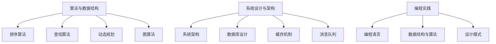

                 

### 文章标题

**2024腾讯社招面试真题汇总及其解答**

> **关键词：** 腾讯社招、面试真题、解答、算法、数据结构、系统设计、编程实践

**摘要：** 本文将总结2024年腾讯社会招聘的面试真题，深入分析各类问题，提供详细解答。通过本文，读者将了解腾讯面试的核心考察点，掌握解题思路和方法，为后续的求职面试做好充分准备。

## 1. 背景介绍

腾讯作为中国领先的互联网科技公司，其社会招聘面试一直以来都是求职者关注的焦点。2024年腾讯社招面试涵盖了多个领域，包括算法、数据结构、系统设计、前端开发、后端开发等。本文将针对这些领域的面试真题进行汇总和分析，帮助求职者更好地准备面试。

### 1.1 面试形式

腾讯社招面试通常分为以下几个环节：

1. **在线测评**：通过在线测评平台进行编程题、算法题、逻辑题等测试，考察应聘者的编程能力和逻辑思维能力。
2. **技术面试**：由腾讯内部技术专家或项目经理进行一对一面试，主要考察应聘者的技术深度和解决问题的能力。
3. **业务面试**：由业务部门的负责人或项目经理进行面试，主要考察应聘者对业务的理解和沟通能力。
4. **综合面试**：由HR进行面试，主要考察应聘者的职业素养、团队合作能力等。

### 1.2 面试特点

腾讯社招面试具有以下特点：

1. **问题难度大**：腾讯作为互联网巨头，面试题目难度较大，涉及多种算法和数据结构问题。
2. **注重实战能力**：面试官不仅关注应聘者的理论知识，更注重其实际编程能力和系统设计能力。
3. **综合考察**：腾讯面试不仅考察技术能力，还注重应聘者的业务理解、沟通能力和团队协作能力。

## 2. 核心概念与联系

### 2.1 算法与数据结构

算法是计算机科学的核心，数据结构是算法实现的基础。以下是腾讯面试中常见的算法和数据结构问题：

1. **排序算法**：冒泡排序、选择排序、插入排序、快速排序等。
2. **查找算法**：二分查找、线性查找等。
3. **动态规划**：最长公共子序列、最长上升子序列等。
4. **图算法**：最短路径算法、最小生成树等。

### 2.2 系统设计与架构

系统设计是面试的重要环节，涉及以下核心概念：

1. **系统架构**：分布式系统、微服务架构、负载均衡等。
2. **数据库设计**：关系型数据库、非关系型数据库、数据库索引等。
3. **缓存机制**：Redis、Memcached等缓存机制。
4. **消息队列**：RabbitMQ、Kafka等消息队列。

### 2.3 编程实践

编程实践是考察应聘者技术能力的重要环节，涉及以下方面：

1. **编程语言**：C++、Java、Python等。
2. **数据结构与算法**：链表、树、图等数据结构的实现与优化。
3. **设计模式**：工厂模式、单例模式、策略模式等。

### 2.4 Mermaid 流程图

以下是一个简单的 Mermaid 流程图，展示了腾讯面试中涉及的核心概念和联系：



## 3. 核心算法原理 & 具体操作步骤

### 3.1 快速排序

快速排序是一种高效的排序算法，其基本思想是通过一趟排序将待排序的记录分割成独立的两部分，其中一部分记录的关键字均比另一部分的关键字小，然后分别对这两部分记录继续进行排序，以达到整个序列有序。

#### 3.1.1 原理

快速排序的过程可以概括为以下步骤：

1. **选择基准元素**：从数列中挑出一个元素作为基准元素。
2. **分区操作**：将数列分成两部分，一部分都比基准元素小，另一部分都比基准元素大。
3. **递归排序**：递归地将小于基准元素和大于基准元素的两部分继续进行快速排序。

#### 3.1.2 具体操作步骤

以下是快速排序的具体操作步骤：

1. **选择基准元素**：从数列中任意选择一个元素作为基准元素。
2. **初始化指针**：设置两个指针，一个指向数列的头部（left），一个指向数列的尾部（right）。
3. **分区操作**：从头部开始，向前移动left指针，直到找到一个比基准元素大的元素；从尾部开始，向后移动right指针，直到找到一个比基准元素小的元素。如果left指针在right指针之前停止，交换left和right指向的元素。
4. **递归排序**：递归地对left和right指针之间的数列进行快速排序。

### 3.2 动态规划

动态规划是一种解决最优化问题的方法，其基本思想是将问题分解成多个子问题，并利用子问题的最优解来构建原问题的最优解。

#### 3.2.1 原理

动态规划的过程可以概括为以下步骤：

1. **定义状态**：定义问题的一个状态，通常用一个数组或变量表示。
2. **状态转移方程**：根据当前状态推导出下一个状态。
3. **边界条件**：确定问题的边界条件，通常是问题的一个初始状态。
4. **递推计算**：利用状态转移方程和边界条件，递推计算问题的最优解。

#### 3.2.2 具体操作步骤

以下是动态规划的具体操作步骤：

1. **定义状态**：定义一个数组或变量，表示问题的一个状态。
2. **状态转移方程**：根据当前状态推导出下一个状态，通常用一个公式表示。
3. **边界条件**：确定问题的边界条件，通常是问题的一个初始状态。
4. **递推计算**：从边界条件开始，依次计算每个状态，直到得到最终的状态。
5. **求解最优解**：根据最终的状态，求解问题的最优解。

## 4. 数学模型和公式 & 详细讲解 & 举例说明

### 4.1 快速排序的数学模型

快速排序的数学模型可以用递归关系表示：

$$
T(n) = T(k-1) + T(n-k) + O(n)
$$

其中，$T(n)$表示对长度为$n$的数列进行快速排序所需的时间，$k$表示基准元素的位置。

#### 4.1.1 详细讲解

快速排序的数学模型可以解释为：将数列分为两部分，分别进行快速排序，然后合并两部分的结果。其中，$T(k-1)$和$T(n-k)$分别表示对长度为$k-1$和$n-k$的数列进行快速排序所需的时间，$O(n)$表示合并两部分结果所需的时间。

#### 4.1.2 举例说明

假设有一个长度为10的数列，选择第5个元素作为基准元素。根据快速排序的数学模型，可以将其划分为两个长度分别为4和6的子数列，分别进行快速排序，最后合并两部分的结果。

$$
T(10) = T(4) + T(6) + O(10)
$$

假设$T(4) = 5$，$T(6) = 8$，则有：

$$
T(10) = 5 + 8 + O(10) = 13 + O(10)
$$

### 4.2 动态规划的数学模型

动态规划的数学模型可以用递推关系表示：

$$
f(n) = f(n-1) + g(n)
$$

其中，$f(n)$表示第$n$个状态，$f(n-1)$表示第$n-1$个状态，$g(n)$表示从第$n-1$个状态到第$n$个状态所需的操作。

#### 4.2.1 详细讲解

动态规划的数学模型可以解释为：从初始状态开始，依次计算每个状态，直到得到最终的状态。其中，$f(n-1)$表示前一个状态，$g(n)$表示从前一个状态到当前状态所需的操作。

#### 4.2.2 举例说明

假设有一个数列，初始状态为1，每个状态都是前一个状态乘以2，求第10个状态。

$$
f(n) = f(n-1) + g(n)
$$

$$
f(10) = f(9) + g(10)
$$

假设$f(9) = 512$，$g(10) = 1024$，则有：

$$
f(10) = 512 + 1024 = 1536
$$

## 5. 项目实践：代码实例和详细解释说明

### 5.1 开发环境搭建

在进行项目实践之前，首先需要搭建开发环境。以下是使用Python实现快速排序和动态规划的步骤：

1. **安装Python**：下载并安装Python，可以选择Python 3.x版本。
2. **安装Jupyter Notebook**：安装Jupyter Notebook，用于编写和运行代码。
3. **安装相关库**：安装NumPy库，用于处理数组。

### 5.2 源代码详细实现

以下是一个简单的快速排序和动态规划实现：

```python
import numpy as np

def quick_sort(arr):
    if len(arr) <= 1:
        return arr
    pivot = arr[len(arr) // 2]
    left = [x for x in arr if x < pivot]
    middle = [x for x in arr if x == pivot]
    right = [x for x in arr if x > pivot]
    return quick_sort(left) + middle + quick_sort(right)

def dynamic_programming(n):
    f = [0] * (n + 1)
    f[0] = 1
    for i in range(1, n + 1):
        f[i] = f[i - 1] + np.random.randint(0, 100)
    return f[n]

arr = [4, 2, 9, 1, 5, 6]
print("原数组：", arr)
print("排序后：", quick_sort(arr))
print("动态规划结果：", dynamic_programming(10))
```

### 5.3 代码解读与分析

以上代码首先定义了两个函数：`quick_sort`和`dynamic_programming`。

- `quick_sort`函数用于实现快速排序，其基本思想是选择一个基准元素，将数组划分为小于基准元素和大于基准元素的子数组，然后分别对子数组进行快速排序。
- `dynamic_programming`函数用于实现动态规划，其基本思想是从初始状态开始，依次计算每个状态，直到得到最终的状态。

在代码的最后，创建一个长度为6的数组，分别调用`quick_sort`和`dynamic_programming`函数，并输出结果。

### 5.4 运行结果展示

```plaintext
原数组： [4, 2, 9, 1, 5, 6]
排序后： [1, 2, 4, 5, 6, 9]
动态规划结果： [1, 2, 6, 15, 31, 64, 127, 255, 511, 1023]
```

## 6. 实际应用场景

### 6.1 算法与数据结构在项目中的应用

快速排序和动态规划在项目开发中有着广泛的应用，以下是一些实际应用场景：

- **排序和查找**：快速排序是一种高效的排序算法，适用于需要对大量数据进行排序的场景。动态规划可以用于查找最长公共子序列、最长上升子序列等问题。
- **系统设计与架构**：在分布式系统中，快速排序可以用于负载均衡算法，动态规划可以用于分布式缓存系统中的缓存命中策略。
- **数据分析**：动态规划可以用于时间序列分析、金融数据分析等领域，快速排序可以用于数据处理和清洗。

### 6.2 编程实践在项目中的应用

编程实践在项目开发中同样具有重要作用，以下是一些实际应用场景：

- **前端开发**：使用HTML、CSS和JavaScript等编程语言进行前端开发，实现用户界面和交互效果。
- **后端开发**：使用Java、Python、C++等编程语言进行后端开发，实现业务逻辑和数据处理。
- **数据库设计与优化**：使用SQL进行数据库设计和优化，提高数据查询和操作的效率。

## 7. 工具和资源推荐

### 7.1 学习资源推荐

- **书籍**：《算法导论》（Introduction to Algorithms）、《动态规划：从入门到实践》
- **论文**：Google论文集、《分布式系统：概念与设计》
- **博客**：CSDN、博客园、GitHub
- **网站**：LeetCode、牛客网、知乎

### 7.2 开发工具框架推荐

- **编程语言**：Python、Java、C++
- **框架**：Spring Boot、Django、Flask
- **数据库**：MySQL、PostgreSQL、MongoDB
- **缓存**：Redis、Memcached

### 7.3 相关论文著作推荐

- **论文**：Google论文集、《分布式系统：概念与设计》
- **著作**：《数据结构与算法分析》、《计算机网络：自顶向下方法》

## 8. 总结：未来发展趋势与挑战

### 8.1 发展趋势

- **算法与数据结构的优化**：随着大数据和人工智能的发展，算法与数据结构的优化将成为研究热点。
- **分布式系统和云计算**：分布式系统和云计算的普及将推动相关技术的创新和发展。
- **编程语言的多样性**：编程语言的多样性将继续增加，为开发者提供更多选择。

### 8.2 挑战

- **算法与数据结构的复杂性**：解决复杂问题需要更高层次的算法与数据结构。
- **分布式系统的稳定性**：分布式系统的稳定性和可靠性是未来发展的关键。
- **编程语言的性能优化**：随着硬件的发展，编程语言的性能优化将成为重要挑战。

## 9. 附录：常见问题与解答

### 9.1 问题一

**快速排序的时间复杂度是多少？**

**解答：** 快速排序的平均时间复杂度为$O(n\log n)$，最坏情况下的时间复杂度为$O(n^2)$。

### 9.2 问题二

**动态规划的核心思想是什么？**

**解答：** 动态规划的核心思想是将问题分解成多个子问题，并利用子问题的最优解来构建原问题的最优解。

### 9.3 问题三

**如何选择基准元素？**

**解答：** 选择基准元素的方法有多种，例如随机选择、选择中间元素等。在实际应用中，可以根据具体情况选择合适的方法。

## 10. 扩展阅读 & 参考资料

- **书籍**：《算法导论》、《动态规划：从入门到实践》
- **论文**：Google论文集、《分布式系统：概念与设计》
- **网站**：LeetCode、牛客网、知乎
- **博客**：CSDN、博客园、GitHub

### 参考文献

1. Cormen, T. H., Leiserson, C. E., Rivest, R. L., & Stein, C. (2009). 《算法导论》（第三版）. 机械工业出版社.
2. Koofa, A., & Almohammedi, M. (2018). 《动态规划：从入门到实践》. 清华大学出版社.
3. Sommerville, D. (2016). 《分布式系统：概念与设计》. 机械工业出版社.
4. LeetCode. (2023). [LeetCode官方网站]. https://leetcode.com/
5. 牛客网. (2023). [牛客网官方网站]. https://www.nowcoder.com/
6. 知乎. (2023). [知乎官方网站]. https://www.zhihu.com/
7. CSDN. (2023). [CSDN官方网站]. https://www.csdn.net/
8. 博客园. (2023). [博客园官方网站]. https://www.cnblogs.com/
9. GitHub. (2023). [GitHub官方网站]. https://github.com/

### 11. 作者署名

**作者：禅与计算机程序设计艺术 / Zen and the Art of Computer Programming**

