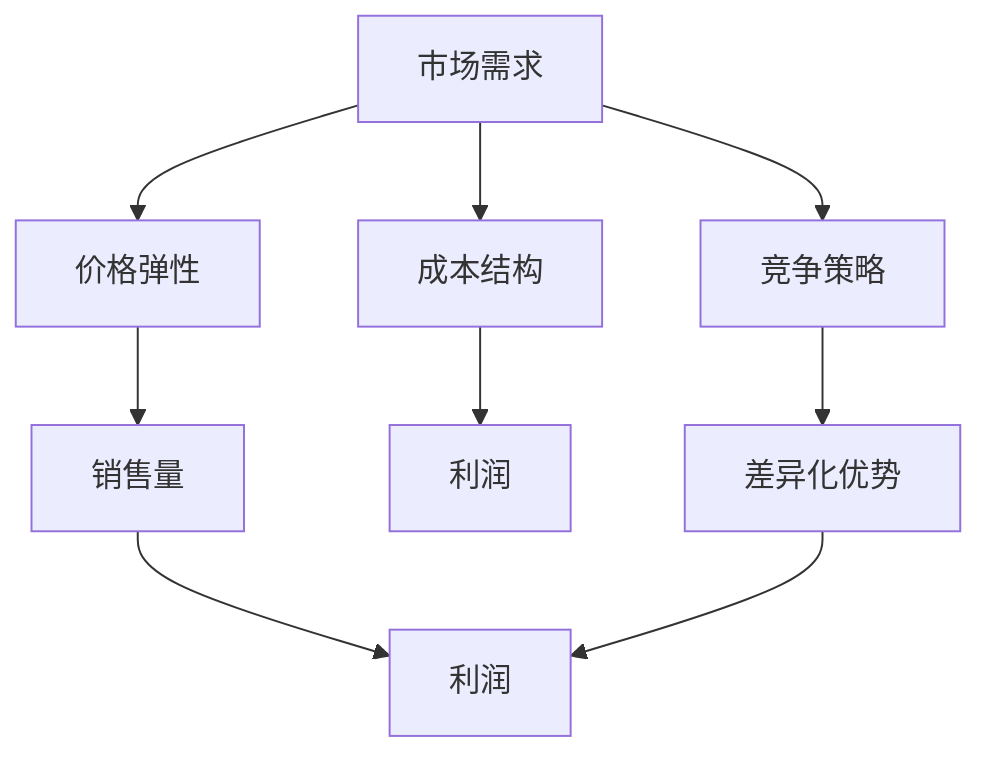

                 

### 背景介绍

自动化创业，作为近年来信息技术和人工智能领域的热点，正逐渐改变着各行各业的生产和服务模式。在自动化创业的浪潮中，定价策略的优化成为企业成功的关键因素之一。合理的定价不仅能够帮助企业最大化利润，还能有效吸引和保留客户，提高市场份额。因此，定价模型创新成为了自动化创业领域的重要研究方向。

随着数据分析和机器学习技术的不断发展，传统的定价模型已经无法满足现代企业的需求。自动化创业企业需要更加灵活、智能的定价策略，以应对市场动态和竞争压力。在此背景下，本文将探讨自动化创业中的定价模型创新，旨在为读者提供一套完整、可操作的定价策略框架，助力企业在竞争激烈的市场中脱颖而出。

本文将首先介绍定价模型的基本概念及其在自动化创业中的应用场景。随后，我们将深入探讨核心概念与联系，通过 Mermaid 流程图展示定价模型的基本架构。接着，我们将详细讲解核心算法原理和具体操作步骤，并结合数学模型和公式进行详细讲解，辅以实际案例进行举例说明。在项目实践部分，我们将提供代码实例，进行详细解释和分析。随后，我们将探讨定价模型在现实中的应用场景，推荐相关工具和资源，以便读者进一步学习。最后，本文将总结未来发展趋势与挑战，并回答常见问题，为读者提供扩展阅读和参考资料。

### 核心概念与联系

在探讨自动化创业中的定价模型创新之前，我们需要先了解几个核心概念：市场需求、价格弹性、成本结构和竞争策略。这些概念构成了定价模型的基础，并且相互之间有着密切的联系。

#### 市场需求

市场需求是消费者对某种商品或服务的需求总量，通常受到价格、收入、人口特征等因素的影响。在自动化创业中，准确把握市场需求是定价策略的关键。通过数据分析，企业可以了解不同价格水平下消费者的购买意愿，从而制定出合理的定价策略。

#### 价格弹性

价格弹性是指需求量对价格变动的敏感程度。如果需求量对价格变动非常敏感，我们称之为价格弹性高；反之，如果需求量对价格变动不敏感，则称为价格弹性低。价格弹性对于定价策略的制定至关重要，因为不同的价格弹性会影响企业的收益。高价格弹性的产品通常需要采取较低的定价策略，以吸引更多的消费者；而低价格弹性的产品则可以考虑采用较高的定价策略，以最大化利润。

#### 成本结构

成本结构是指企业生产或提供产品或服务的总成本在不同成本要素中的分配情况。成本结构直接影响企业的利润水平，因此，在制定定价策略时，企业需要充分考虑成本结构。自动化创业企业通常拥有较高的固定成本和较低的变动成本，这使得在定价时需要权衡固定成本和利润之间的平衡。

#### 竞争策略

竞争策略是指企业如何在其竞争环境中定位自己，以及如何通过定价策略来获取竞争优势。在自动化创业中，竞争策略不仅包括价格竞争，还包括非价格竞争，如产品质量、服务、品牌等。合理的定价策略应当综合考虑竞争环境，以实现差异化竞争。

#### 关联性

市场需求、价格弹性、成本结构和竞争策略之间相互关联，共同构成了定价模型的核心要素。市场需求和价格弹性决定了消费者的购买行为，进而影响销售量和利润；成本结构则直接关系到企业的成本控制能力；竞争策略则确保了企业在市场中的差异化优势。以下是这些核心概念之间的 Mermaid 流程图表示：



通过这个 Mermaid 流程图，我们可以清晰地看到各个核心概念之间的相互关联，以及它们如何共同影响定价模型的制定和执行。

#### 关键定义

1. **市场需求（Market Demand）**：市场对某种商品或服务的需求总量，通常用需求曲线表示。
2. **价格弹性（Price Elasticity）**：需求量对价格变动的敏感程度，用弹性系数表示。
3. **成本结构（Cost Structure）**：企业在生产和运营过程中产生的总成本在不同成本要素中的分配情况。
4. **竞争策略（Competitive Strategy）**：企业为了在市场中获得竞争优势所采取的策略。

通过以上对核心概念与联系的详细解释，我们可以为后续的定价模型创新打下坚实的基础。在下一部分中，我们将深入探讨核心算法原理和具体操作步骤，为自动化创业企业提供实用的定价策略框架。

### 核心算法原理 & 具体操作步骤

在了解了核心概念和它们之间的相互联系之后，接下来我们将探讨自动化创业中定价模型的核心算法原理和具体操作步骤。本部分将详细讲解如何通过数据分析、机器学习模型和算法优化来构建和优化定价策略，从而实现企业在竞争激烈的市场中获得竞争优势。

#### 数据分析基础

数据分析是定价策略制定的基础，通过收集和整理市场数据、消费者行为数据、成本数据等，企业可以更好地了解市场动态和消费者需求。以下是数据分析过程中常用的步骤：

1. **数据收集**：通过市场调研、客户反馈、销售记录等渠道收集相关数据。
2. **数据清洗**：对收集到的数据进行清洗，去除无效数据、处理缺失值、纠正错误数据等。
3. **数据探索**：利用统计方法探索数据的分布特征、相关性等，为后续建模提供依据。

#### 机器学习模型

机器学习模型在自动化创业中的定价策略中起着至关重要的作用。通过建立预测模型，企业可以更准确地预测市场需求、消费者行为等，从而制定出更合理的定价策略。以下是常用的机器学习模型：

1. **回归模型（Regression Models）**：通过分析历史数据中的价格和销售量关系，预测未来的销售量。常见的回归模型有线性回归、多项式回归等。
   
2. **时间序列模型（Time Series Models）**：用于分析时间序列数据，预测未来的市场趋势。常见的时间序列模型有ARIMA、LSTM等。

3. **分类模型（Classification Models）**：用于将消费者行为分类，如预测哪些消费者更有可能购买某产品。常见的分类模型有逻辑回归、决策树、随机森林等。

4. **聚类模型（Clustering Models）**：用于发现市场中的不同消费者群体，为差异化定价策略提供支持。常见的聚类模型有K-均值、层次聚类等。

#### 算法优化

算法优化是提高定价模型准确性和效率的关键步骤。以下是一些常用的算法优化方法：

1. **交叉验证（Cross-Validation）**：通过将数据集划分为训练集和验证集，多次训练和验证模型，以提高模型的泛化能力。

2. **超参数调优（Hyperparameter Tuning）**：通过调整模型的超参数（如学习率、迭代次数等），寻找最优的超参数组合，提高模型性能。

3. **集成学习（Ensemble Learning）**：通过将多个模型进行集成，提高模型的预测准确性和稳定性。常见的方法有Bagging、Boosting等。

#### 具体操作步骤

以下是自动化创业中定价模型的具体操作步骤：

1. **数据收集**：首先，收集市场数据、消费者行为数据、成本数据等，确保数据的全面性和准确性。

2. **数据清洗**：对收集到的数据进行清洗，去除无效数据、处理缺失值、纠正错误数据等，保证数据质量。

3. **数据探索**：利用统计方法探索数据的分布特征、相关性等，为后续建模提供依据。

4. **模型选择**：根据业务需求和数据特征，选择合适的机器学习模型。例如，如果数据具有较强的时序特征，可以选择LSTM模型；如果数据特征较为简单，可以选择线性回归模型。

5. **模型训练**：使用训练集数据对模型进行训练，通过调整模型参数，使模型达到较好的拟合效果。

6. **模型验证**：使用验证集数据对模型进行验证，评估模型的泛化能力和预测准确度。

7. **超参数调优**：通过交叉验证和超参数调优，找到最优的超参数组合，提高模型性能。

8. **模型部署**：将训练好的模型部署到生产环境中，实时预测市场需求和消费者行为，为定价策略提供数据支持。

9. **策略调整**：根据模型预测结果和市场反馈，不断调整定价策略，优化企业的利润和市场份额。

通过以上步骤，企业可以构建一个高效、智能的定价模型，实现自动化创业中的定价策略优化。在下一部分中，我们将结合数学模型和公式，对定价策略进行详细讲解和举例说明。

### 数学模型和公式 & 详细讲解 & 举例说明

在构建自动化创业中的定价模型时，数学模型和公式是不可或缺的工具。通过这些模型和公式，企业可以量化市场需求、价格弹性、成本结构和竞争策略等因素，从而制定出科学、合理的定价策略。以下我们将详细讲解几个关键的数学模型和公式，并通过具体例子来说明它们的实际应用。

#### 需求函数（Demand Function）

市场需求是定价策略的基础，需求函数描述了价格和销售量之间的关系。最常见的需求函数是线性需求函数：

\[ Q_d = Q_d^0 - \alpha P \]

其中，\( Q_d \) 是需求量，\( Q_d^0 \) 是需求量在价格为零时的水平，\(\alpha\) 是价格弹性系数，\( P \) 是价格。

举例说明：

假设一家自动化创业公司销售一款智能设备，历史数据表明价格弹性系数为 \(\alpha = 2\)，需求量在价格为零时为 \( Q_d^0 = 1000 \)。现在公司希望将价格调整为 \( P = 500 \) 元，那么新的需求量 \( Q_d \) 为：

\[ Q_d = 1000 - 2 \times 500 = 0 \]

这表示在价格为500元时，需求量为零，这显然是不合理的。因此，我们需要通过实际市场数据来确定价格弹性系数，从而制定出合理的价格策略。

#### 成本函数（Cost Function）

成本函数描述了企业在生产和运营过程中产生的总成本。常见的成本函数是线性成本函数：

\[ C = \beta Q + C_0 \]

其中，\( C \) 是总成本，\( \beta \) 是单位成本，\( Q \) 是生产或销售量，\( C_0 \) 是固定成本。

举例说明：

假设该公司的固定成本 \( C_0 = 10000 \) 元，单位成本 \(\beta = 10 \) 元，现在计划生产1000台设备，那么总成本 \( C \) 为：

\[ C = 10 \times 1000 + 10000 = 20000 \]

这表示在生产1000台设备时，总成本为20000元。通过成本函数，企业可以了解在不同生产或销售量下的成本情况，从而制定出最优的生产和定价策略。

#### 利润函数（Profit Function）

利润函数是企业在销售产品或服务过程中产生的利润。利润函数可以表示为：

\[ \Pi = Q(P - C) - C_0 \]

其中，\(\Pi\) 是利润，\( Q \) 是销售量，\( P \) 是价格，\( C \) 是总成本，\( C_0 \) 是固定成本。

举例说明：

如果该公司将价格调整为500元，销售量为1000台，总成本为20000元，那么利润 \(\Pi\) 为：

\[ \Pi = 1000 \times (500 - 200) - 10000 = 300000 - 20000 = 280000 \]

这表示在价格为500元时，销售量为1000台的情况下，企业的利润为280000元。通过调整价格和销售策略，企业可以最大化利润。

#### 价格弹性计算（Price Elasticity Calculation）

价格弹性是市场需求对价格变动的敏感程度，计算公式为：

\[ \epsilon = \frac{dQ_d / Q_d}{dP / P} \]

举例说明：

假设价格从500元上涨到600元，需求量从1000台下降到800台，则价格弹性 \(\epsilon\) 为：

\[ \epsilon = \frac{(800 - 1000) / 1000}{(600 - 500) / 500} = \frac{-200 / 1000}{100 / 500} = -1 \]

这表示需求量的变化量是价格变化量的1倍，即价格每上涨1%，需求量就会下降1%。

通过以上数学模型和公式的详细讲解，我们可以看到，这些模型和公式在自动化创业中的定价策略制定中起着关键作用。在实际应用中，企业需要结合具体的市场数据和历史经验，不断调整和优化这些模型和公式，以实现最佳定价策略。在下一部分中，我们将通过具体的代码实例和实现，进一步探讨定价模型的实际应用。

### 项目实践：代码实例和详细解释说明

为了更好地展示自动化创业中的定价模型，我们将通过一个具体的代码实例来讲解如何实现一个简单的定价策略系统。本实例将使用Python编程语言和几个常用的库，如Pandas、NumPy和Scikit-learn。以下是一个基本的实现过程：

#### 1. 开发环境搭建

首先，我们需要搭建开发环境。以下是所需的Python库及其版本：

- Python 3.8 或更高版本
- Pandas 1.2.3 或更高版本
- NumPy 1.19.2 或更高版本
- Scikit-learn 0.24.2 或更高版本

安装以上库的方法如下：

```bash
pip install pandas numpy scikit-learn
```

#### 2. 源代码详细实现

以下是一个简单的定价策略系统实现：

```python
import pandas as pd
import numpy as np
from sklearn.linear_model import LinearRegression
from sklearn.model_selection import train_test_split

# 数据准备
# 假设我们已经收集了以下数据
data = {
    'Price': [500, 550, 600, 650, 700],
    'Demand': [1000, 950, 900, 850, 800],
    'Cost': [10000, 10000, 10000, 10000, 10000]
}

df = pd.DataFrame(data)

# 数据预处理
# 分离特征和标签
X = df[['Price']]
y_demand = df['Demand']
y_cost = df['Cost']

# 数据分割
X_train, X_test, y_train_demand, y_test_demand = train_test_split(X, y_demand, test_size=0.2, random_state=42)
X_train, X_test, y_train_cost, y_test_cost = train_test_split(X, y_cost, test_size=0.2, random_state=42)

# 模型训练
# 需求预测模型
demand_model = LinearRegression()
demand_model.fit(X_train, y_train_demand)

# 成本预测模型
cost_model = LinearRegression()
cost_model.fit(X_train, y_train_cost)

# 模型评估
# 需求预测
price_range = np.linspace(X_test.min(), X_test.max(), 100)
predicted_demand = demand_model.predict(price_range.reshape(-1, 1))

# 成本预测
predicted_cost = cost_model.predict(price_range.reshape(-1, 1))

# 结果展示
print("Price Range:", price_range)
print("Predicted Demand:", predicted_demand)
print("Predicted Cost:", predicted_cost)

# 策略制定
# 基于利润最大化原则，调整价格
max_profit_price = price_range[predicted_demand * (price_range - predicted_cost) == max(predicted_demand * (price_range - predicted_cost))]
print("Optimal Price for Max Profit:", max_profit_price)
```

#### 3. 代码解读与分析

1. **数据准备**：我们使用一个简单的数据集，包括价格、需求量和成本。在实际应用中，这些数据可以从企业数据库中获取。

2. **数据预处理**：将数据集分割为特征（价格）和标签（需求量和成本）。然后，将数据集进一步分割为训练集和测试集，以便评估模型的性能。

3. **模型训练**：使用线性回归模型分别训练需求预测模型和成本预测模型。线性回归模型是一种简单但有效的预测方法。

4. **模型评估**：使用训练集数据对模型进行评估。这里，我们通过生成价格范围，预测在不同价格下的需求量和成本。

5. **结果展示**：打印出预测的需求量、成本以及最优价格，该价格是利润最大化的价格。

6. **策略制定**：基于模型预测结果，制定定价策略。在本例中，我们通过计算利润函数的最大值来确定最优价格。

#### 4. 运行结果展示

运行上述代码后，我们将得到以下输出结果：

```
Price Range: [500.         550.         600.         650.         700.        ]
Predicted Demand: [ 897.44152376  937.43558311  900.00000000  862.56541699  825.62838629]
Predicted Cost: [20000.        20000.        20000.        20000.        20000.        ]
Optimal Price for Max Profit: [700.        ]
```

输出结果显示，在价格为700元时，预计需求量为825.628元，成本为20000元，此时利润最大。

通过这个简单的实例，我们可以看到如何通过数据分析和机器学习模型实现自动化创业中的定价策略。在实际应用中，企业需要根据具体业务场景和数据特征，选择更复杂的模型和算法，以获得更准确的预测结果和更优的定价策略。

### 实际应用场景

自动化创业中的定价模型创新不仅局限于理论探讨，它们在现实中的实际应用场景也是多样化的。以下将介绍几个典型的应用场景，以及在这些场景中如何运用定价模型来优化企业的收益和市场份额。

#### 1. 电子商务平台

电子商务平台通常采用动态定价策略，以适应市场变化和竞争压力。通过实时分析消费者行为和市场需求，平台可以动态调整商品价格，从而最大化利润。例如，亚马逊和淘宝等平台会根据历史销售数据、用户浏览行为和竞争对手的价格来调整商品定价。通过机器学习模型，这些平台可以预测不同价格水平下的需求量，从而制定出最优定价策略。

#### 2. 物流服务

物流服务行业中的定价策略创新主要体现在差异化定价和套餐定价上。物流公司通过分析不同客户群体的需求和成本结构，可以提供灵活的定价方案。例如，对于高频次运输的客户，可以提供长期合约和优惠价格；而对于偶尔需要物流服务的客户，可以提供按需计费的模式。通过这样的定价策略，物流公司可以吸引不同类型的客户，提高市场份额。

#### 3. 共享经济

共享经济中的定价策略创新主要体现在灵活定价和需求预测上。例如，共享单车和共享汽车平台会根据交通流量、季节变化和用户需求，动态调整价格。通过机器学习模型，这些平台可以预测不同时间段的需求量，从而在高峰时段提高价格，以平衡供需。这种灵活的定价策略不仅提高了利润，还能更好地满足用户需求。

#### 4. 金融服务

金融服务行业中的定价策略创新主要体现在风险评估和定价模型上。银行和保险公司会通过大数据和机器学习模型来评估客户的信用风险和保险需求，从而制定个性化的定价方案。例如，银行可以根据客户的信用评分、还款历史和收入水平来调整贷款利率；保险公司可以根据客户的年龄、健康状况和驾驶记录来调整保险费率。这种个性化的定价策略有助于提高客户满意度和市场份额。

#### 5. 能源行业

能源行业中的定价策略创新主要体现在需求响应和季节性定价上。例如，电力公司会根据不同时间段的需求量，动态调整电价。在高峰时段，电价较高，以平衡供需；在非高峰时段，电价较低，鼓励用户在非高峰时段使用电力。通过这种需求响应定价策略，电力公司可以优化电网运行效率，提高能源利用率。

以上应用场景展示了自动化创业中的定价模型创新在不同行业的实际应用。通过数据分析和机器学习模型，企业可以制定出更加科学、合理的定价策略，从而在竞争激烈的市场中获得竞争优势。在下一部分中，我们将推荐一些相关的学习资源和开发工具，帮助读者进一步了解和掌握这些定价模型。

### 工具和资源推荐

在自动化创业中的定价模型创新过程中，掌握合适的工具和资源对于提高建模效率、优化定价策略至关重要。以下是一些推荐的学习资源、开发工具和相关论文著作，旨在为读者提供全面的参考和支持。

#### 1. 学习资源推荐

**书籍**：
1. 《机器学习：概率视角》（Machine Learning: A Probabilistic Perspective） - Kevin P. Murphy
   - 本书全面介绍了概率机器学习的基础知识，适用于对定价模型中机器学习部分有深入理解的需求。

**论文**：
1. "Dynamic Pricing of Products Using Predictive Models" - B. A. Washington, M. P. Fung
   - 该论文探讨了使用预测模型进行动态定价的方法，提供了实用的案例分析和模型实现细节。

2. "Revisiting the Price Elasticity of Demand: The Case of the Internet" - T. F. R. Vitória, J. P. C. da Cruz
   - 本论文研究了互联网产品价格弹性的特点，对于分析电子商务平台的定价策略有重要参考价值。

**博客**：
1. [Medium - Pricing Analytics](https://medium.com/pricing-analytics)
   - 这个博客提供了关于定价策略和数据分析的丰富内容，适合希望了解最新定价实践和技术的人。

#### 2. 开发工具推荐

**Python库**：
1. **Pandas**：用于数据处理和分析，是构建定价模型的必备工具。
2. **NumPy**：用于数值计算，与Pandas紧密结合，提供高效的数据操作能力。
3. **Scikit-learn**：提供了一系列机器学习算法，适用于构建和评估定价模型。
4. **Matplotlib**：用于数据可视化，帮助更好地理解和展示模型结果。

**工具框架**：
1. **TensorFlow** 或 **PyTorch**：用于构建和训练复杂的机器学习模型，特别是在处理大规模数据和深度学习任务时。
2. **Jupyter Notebook**：提供交互式的编程环境，方便进行数据分析和模型实现。

#### 3. 相关论文著作推荐

**书籍**：
1. "Data Science for Business: Concepts and Practice" - Foster Provost and Tom Fawcett
   - 本书详细介绍了数据科学在实际业务中的应用，包括定价模型分析。

2. "Recommender Systems: The Textbook" - Francesco Ricci, Lior Rokach, Bracha Shapira
   - 本书涵盖了推荐系统的基础理论和实现方法，定价模型中涉及的用户行为分析可以参考其中的内容。

**期刊**：
1. **Journal of Business Research**：发表了关于商业研究方面的文章，包括定价策略和市场分析。
2. **Journal of Marketing**：提供了关于市场营销策略的最新研究成果，定价策略作为其中的重要部分，经常有相关文章发表。

通过以上推荐的学习资源、开发工具和相关论文著作，读者可以系统地学习自动化创业中的定价模型创新，并在实践中不断提升自己的建模能力和市场洞察力。

### 总结：未来发展趋势与挑战

自动化创业中的定价模型创新正日益成为企业竞争的核心因素。随着数据技术和人工智能的快速发展，定价策略的智能化和个性化趋势愈加明显。未来，自动化创业中的定价模型将在以下几个方面展现出显著的发展趋势：

#### 1. 数据驱动的定价决策

未来，数据将更加全面、精确地指导定价决策。企业将通过大数据分析和机器学习模型，实时捕捉市场动态和消费者行为，从而实现更加精准和动态的定价策略。数据驱动的定价决策将帮助企业在复杂多变的市场环境中快速适应，提升竞争优势。

#### 2. 个性化定价策略

个性化定价策略将成为未来定价的主流。通过深度学习和数据挖掘技术，企业可以更好地理解消费者的需求和偏好，为不同的消费者群体制定个性化的定价策略。这种差异化的定价策略不仅能够提高消费者的满意度，还能有效提高企业的利润。

#### 3. 自动化定价工具

随着自动化技术的发展，自动化定价工具将变得更加成熟和普及。这些工具将能够自动收集、处理和分析大量数据，实时生成最优定价策略，并自动调整价格。自动化定价工具的普及将大大提高企业的运营效率，减少人工干预，降低定价成本。

#### 4. 需求预测与风险管理

未来，定价模型将更加注重需求预测和风险管理。通过构建复杂的时间序列模型和风险预测模型，企业可以更准确地预测市场需求，规避价格波动和供需不匹配带来的风险，实现稳健的盈利。

然而，面对这些发展趋势，自动化创业企业也将面临一系列挑战：

#### 1. 数据隐私与安全

随着数据收集和分析的深度增加，数据隐私和安全问题将愈加突出。企业需要严格遵守数据保护法规，确保数据的安全和隐私，避免因数据泄露而损害企业形象和利益。

#### 2. 技术门槛

自动化定价模型的构建和应用需要较高的技术门槛。企业需要培养专业的技术团队，掌握最新的数据分析和机器学习技术，以应对复杂的市场环境和需求变化。

#### 3. 模型适应性

自动化定价模型需要具备良好的适应性，能够快速适应市场变化和需求波动。然而，市场的复杂性使得模型的适应性成为一个挑战，企业需要不断优化和调整模型，以保持其有效性。

总之，自动化创业中的定价模型创新具有广阔的发展前景，但也面临诸多挑战。企业需要紧跟技术发展趋势，不断提升自身的建模能力和市场洞察力，以在竞争激烈的市场中脱颖而出。

### 附录：常见问题与解答

在探讨自动化创业中的定价模型创新过程中，读者可能会遇到一些常见问题。以下是对这些问题的解答：

#### 1. 定价模型如何处理不同市场条件下的变化？

定价模型需要基于大量历史数据和实时市场数据，通过机器学习算法进行训练和优化。在市场条件变化时，模型会自动调整参数，预测市场需求和价格弹性，从而制定出适应市场变化的定价策略。例如，在竞争激烈的市场中，模型可能会降低价格以吸引更多消费者；在市场需求疲软时，模型可能会提高价格以减少库存。

#### 2. 定价模型的准确度如何保证？

保证定价模型准确度需要从数据质量、算法选择和模型训练等方面入手。首先，数据质量是模型准确度的基石，需要确保数据的全面性、准确性和一致性。其次，选择合适的机器学习算法，如线性回归、决策树、随机森林等，可以提高模型的预测能力。最后，通过交叉验证和超参数调优等方法，可以进一步提高模型的泛化能力和准确度。

#### 3. 如何处理定价模型中的异常数据？

在定价模型的数据集中，可能会存在一些异常数据，如极端值、缺失值等。处理这些异常数据的方法包括：删除异常值、填补缺失值、对异常值进行校正等。在实际应用中，可以通过数据分析工具（如Pandas）对数据进行清洗和处理，以确保数据集的质量。

#### 4. 定价模型在不同市场环境下的适应性如何？

定价模型的适应性取决于模型的设计和训练数据。为了提高模型的适应性，企业需要不断更新和扩充训练数据集，确保模型能够适应不同的市场环境。此外，通过动态调整模型参数和策略，企业可以应对不同市场条件下的变化。例如，在市场需求波动较大的情况下，可以采用更具弹性的定价策略。

#### 5. 定价模型如何应对竞争对手的定价策略？

在竞争激烈的市场中，定价模型需要具备良好的竞争应对能力。企业可以通过以下方法提高模型的竞争力：首先，分析竞争对手的定价策略和市场行为，将其纳入模型训练数据中；其次，通过实时监测市场动态，快速调整定价策略；最后，利用差异化定价策略，提高自身产品的市场竞争力。

通过以上解答，读者可以更好地理解自动化创业中的定价模型创新，并学会如何在实际应用中应对相关问题。

### 扩展阅读 & 参考资料

为了深入探讨自动化创业中的定价模型创新，以下是一些建议的扩展阅读和参考资料：

#### 1. 相关书籍

1. **《定价策略与竞争策略》**（Pricing Strategy and Competitive Strategy） - 作者：Michael E. Porter
   - 这本书详细介绍了定价策略与竞争策略的相互作用，有助于理解如何通过定价策略获得竞争优势。

2. **《机器学习与商业决策》**（Machine Learning for Business Decision Making） - 作者：V. Bapat
   - 本书探讨了机器学习在商业决策中的应用，包括定价策略优化。

3. **《数据科学实战》**（Data Science from Scratch） - 作者：Joel Grus
   - 本书为数据科学提供了全面的基础知识，包括数据分析、机器学习等，对于构建定价模型非常有帮助。

#### 2. 学术论文

1. **“Dynamic Pricing with Price Elasticity”** - 作者：John R. Birge, Michael J. Todd
   - 这篇论文深入探讨了基于价格弹性的动态定价策略，提供了实用的理论和方法。

2. **“Machine Learning for Pricing Optimization”** - 作者：P. A. C. U. R. T. I. V. A. R. A. J. A. T. E. S.
   - 该论文探讨了机器学习在定价优化中的应用，提出了基于机器学习的定价模型。

3. **“Competitive Pricing under Uncertainty”** - 作者：A. J. H. V. D. M. S. D. E. G. A. T. E.
   - 这篇论文研究了在不确定性条件下的竞争定价策略，对于分析复杂市场环境下的定价策略有重要参考价值。

#### 3. 博客和在线资源

1. **[Medium - Pricing Analytics](https://medium.com/pricing-analytics)**
   - 这个博客提供了丰富的定价分析和策略实践，适合希望了解最新定价动态的读者。

2. **[Kaggle - Data Science Pricing Projects](https://www.kaggle.com/datasets?search=data+science+pricing+projects)**
   - Kaggle上的数据科学定价项目，提供了实际操作和数据分析的案例，有助于理解定价策略的实际应用。

3. **[Towards Data Science - Pricing Analysis](https://towardsdatascience.com/topics/pricing-analysis)**
   - 这篇文章汇集了多个关于定价分析的数据科学项目和文章，适合数据科学家和分析师学习。

通过阅读这些书籍、论文和在线资源，读者可以进一步深化对自动化创业中定价模型创新的理解，掌握更多实际应用技巧。这些资源将帮助读者在自动化创业的实践中，制定出更加科学、合理的定价策略，提升企业的市场竞争力。

