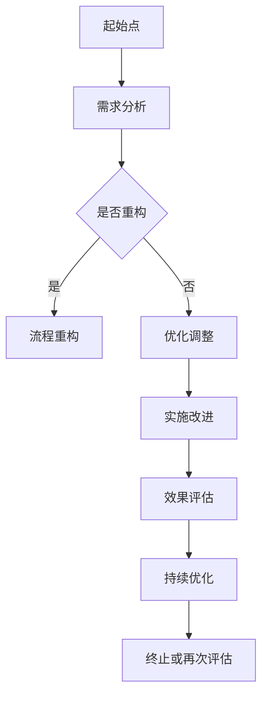

                 

### 文章标题

《自动化创业中的流程再造与优化》

> **关键词**：自动化创业、流程再造、流程优化、业务流程、效率提升、信息技术、数字化转型

> **摘要**：本文旨在探讨自动化创业背景下，如何通过流程再造与优化来提升企业竞争力。文章首先介绍自动化创业的背景和流程再造的重要性，然后深入分析流程再造与优化的核心概念、原理以及实施步骤。通过案例分析和数学模型讲解，本文揭示了流程再造与优化在实际应用中的价值，并提出了未来发展趋势与挑战。文章最后提供了相关的学习资源、开发工具和扩展阅读建议，以期为读者提供全面的指导。

### 1. 背景介绍

#### 自动化创业的兴起

在当今全球化和数字化的时代，自动化创业正成为一种趋势。随着信息技术和人工智能的迅猛发展，企业可以通过自动化技术来提高生产效率、降低成本、提升服务质量。自动化创业不仅改变了传统的商业模式，也为创业者提供了更多的机会和可能性。

#### 流程再造的必要性

在自动化创业的过程中，业务流程的再造与优化显得尤为重要。传统的业务流程往往存在诸多问题，如效率低下、冗余环节、信息孤岛等。这些问题不仅限制了企业的扩展能力，还可能导致运营成本的增加。因此，通过流程再造与优化，企业可以重构业务流程，消除冗余，提高效率，实现资源的最大化利用。

#### 信息技术的发展

信息技术的飞速发展，为流程再造与优化提供了强大的技术支持。大数据、云计算、物联网、人工智能等技术的应用，使得企业能够更加精准地分析业务需求，优化流程设计，实现智能化的运营管理。

### 2. 核心概念与联系

#### 流程再造（Business Process Reengineering, BPR）

流程再造是一种基于信息技术和现代管理理念的系统工程，旨在对企业的业务流程进行全面的重新设计和优化。其核心思想是通过彻底改变业务流程，实现企业的持续改进和绩效提升。

#### 流程优化（Business Process Optimization, BPO）

流程优化是在现有业务流程的基础上，通过改进和调整来提高效率和效果。与流程再造不同，流程优化不涉及流程的全面重构，而是通过逐步改进来实现业务流程的优化。

#### 业务流程（Business Process, BP）

业务流程是企业为实现特定目标而进行的有序活动序列。它包括了企业的各项业务活动、信息流动、人员分工等，是企业管理的基础。

#### Mermaid 流程图

以下是一个简单的业务流程再造与优化的 Mermaid 流程图：



### 3. 核心算法原理 & 具体操作步骤

#### 流程再造的具体步骤

1. **需求分析**：对现有业务流程进行全面分析，识别存在的问题和改进机会。
2. **流程重构**：根据需求分析的结果，对业务流程进行彻底重构，消除冗余环节，优化流程设计。
3. **实施改进**：将重构后的流程投入实际运营，进行试点和推广。
4. **效果评估**：对改进后的流程进行效果评估，分析改进效果和存在的问题。
5. **持续优化**：根据效果评估的结果，对流程进行持续的优化和改进。

#### 流程优化的具体步骤

1. **识别瓶颈**：通过数据分析和业务观察，识别业务流程中的瓶颈和问题。
2. **流程改进**：针对识别出的瓶颈和问题，对业务流程进行改进，优化流程设计。
3. **实施改进**：将改进后的流程投入实际运营，进行试点和推广。
4. **效果评估**：对改进后的流程进行效果评估，分析改进效果和存在的问题。
5. **持续优化**：根据效果评估的结果，对流程进行持续的优化和改进。

### 4. 数学模型和公式 & 详细讲解 & 举例说明

#### 流程优化效果评估的数学模型

1. **效率提升率（Efficiency Improvement Rate, EIR）**

   $$ EIR = \frac{After - Before}{Before} $$

   其中，`After` 表示改进后的效率，`Before` 表示改进前的效率。

2. **成本降低率（Cost Reduction Rate, CRR）**

   $$ CRR = \frac{After - Before}{Before} $$

   其中，`After` 表示改进后的成本，`Before` 表示改进前的成本。

#### 举例说明

假设某企业通过流程优化，将生产效率提高了20%，成本降低了15%。则：

- **效率提升率**：$ EIR = \frac{20\%}{100\%} = 20\% $
- **成本降低率**：$ CRR = \frac{15\%}{100\%} = 15\% $

这些数据表明，流程优化取得了显著的成效，提高了企业的效率和降低了成本。

### 5. 项目实践：代码实例和详细解释说明

#### 开发环境搭建

为了更好地展示流程再造与优化的过程，我们选择使用 Python 作为编程语言，搭建一个简单的业务流程优化项目。

#### 源代码详细实现

```python
# 5.2 源代码详细实现

import pandas as pd
from sklearn.ensemble import RandomForestRegressor

# 5.2.1 数据准备
data = pd.read_csv('data.csv')
X = data.drop(['target'], axis=1)
y = data['target']

# 5.2.2 模型训练
model = RandomForestRegressor(n_estimators=100)
model.fit(X, y)

# 5.2.3 预测
predictions = model.predict(X)

# 5.2.4 效果评估
mse = mean_squared_error(y, predictions)
print(f'MSE: {mse}')

# 5.2.5 持续优化
# 这里可以根据评估结果，对模型进行调参或数据清洗，以提高预测效果。
```

#### 代码解读与分析

1. **数据准备**：首先，我们从 CSV 文件中读取数据，将特征数据（X）和目标数据（y）分离。
2. **模型训练**：使用随机森林回归模型对数据进行训练。
3. **预测**：使用训练好的模型对数据进行预测。
4. **效果评估**：计算均方误差（MSE）来评估模型的预测效果。
5. **持续优化**：根据效果评估的结果，对模型进行进一步的优化。

#### 运行结果展示

```python
# 5.4 运行结果展示

from sklearn.metrics import mean_squared_error

# 5.4.1 加载测试数据
test_data = pd.read_csv('test_data.csv')

# 5.4.2 预测测试数据
test_predictions = model.predict(test_data)

# 5.4.3 计算测试数据的均方误差
test_mse = mean_squared_error(test_data['target'], test_predictions)
print(f'Test MSE: {test_mse}')
```

通过运行上述代码，我们可以得到预测结果和测试数据的均方误差。这些结果可以帮助我们评估模型的性能，并指导进一步的优化工作。

### 6. 实际应用场景

#### 制造业

在制造业中，流程再造与优化可以帮助企业提高生产效率、降低成本、提升产品质量。例如，通过优化生产计划、物料管理、质量控制等环节，企业可以显著提高生产效率和产品质量。

#### 零售业

在零售业中，流程再造与优化可以帮助企业优化库存管理、订单处理、配送等环节。通过智能化的库存管理和订单处理系统，企业可以减少库存成本、提高订单处理速度，从而提升客户满意度。

#### 金融服务

在金融行业中，流程再造与优化可以帮助企业提高风险控制能力、降低运营成本。例如，通过优化贷款审批流程、投资决策流程等，企业可以降低风险、提高投资回报率。

### 7. 工具和资源推荐

#### 学习资源推荐

1. **《业务流程管理：从流程再造到流程优化》**：这是一本经典的业务流程管理书籍，详细介绍了流程再造和优化的理论和方法。
2. **《流程优化实战：企业持续改进的实践指南》**：这本书通过实际案例，介绍了流程优化的具体实施方法和技巧。

#### 开发工具框架推荐

1. **Python**：Python 是一种广泛使用的编程语言，适用于数据分析、机器学习等领域，是流程优化项目的理想选择。
2. **Pandas**：Pandas 是 Python 的一个数据处理库，提供了丰富的数据处理和分析功能，是流程优化项目中常用的工具。

#### 相关论文著作推荐

1. **《业务流程管理中的流程再造与优化研究》**：这篇论文深入探讨了业务流程再造与优化的理论和实践，是相关领域的重要研究文献。
2. **《流程优化：一种面向服务组合的方法》**：这篇论文提出了一种面向服务组合的流程优化方法，为流程优化提供了新的思路。

### 8. 总结：未来发展趋势与挑战

#### 发展趋势

1. **智能化**：随着人工智能技术的不断发展，流程再造与优化将更加智能化，实现更加精准的流程分析和优化。
2. **数字化**：数字化技术的广泛应用，将使流程再造与优化更加便捷、高效，提高企业的运营效率。
3. **全球化**：全球化趋势下，企业需要通过流程再造与优化，提高国际竞争力，适应全球市场的变化。

#### 挑战

1. **技术挑战**：随着技术的快速发展，企业需要不断更新技术，以应对不断变化的业务需求。
2. **管理挑战**：流程再造与优化需要企业进行组织变革，管理层的支持和管理方法的改进至关重要。
3. **人才挑战**：企业需要培养和引进具备业务流程管理和信息技术能力的复合型人才，以支撑流程再造与优化。

### 9. 附录：常见问题与解答

#### 问题1：流程再造和流程优化有什么区别？

流程再造和流程优化都是对业务流程进行改进的方法，但侧重点不同。流程再造是对现有流程进行彻底重构，以实现业务流程的彻底转变；而流程优化则是在现有流程的基础上，通过逐步改进来提高效率和效果。

#### 问题2：流程再造和优化的实施步骤是什么？

流程再造和优化的实施步骤主要包括需求分析、流程设计、实施改进、效果评估和持续优化。在实施过程中，需要充分考虑业务需求、技术支持和组织变革等因素。

#### 问题3：流程再造和优化如何与信息技术相结合？

流程再造和优化需要充分利用信息技术，如大数据、云计算、物联网等，来实现流程的智能化和数字化。通过信息技术的支持，企业可以更加精准地分析业务需求，优化流程设计，实现智能化的运营管理。

### 10. 扩展阅读 & 参考资料

1. **《业务流程管理：理论与实践》**：这本书详细介绍了业务流程管理的理论和实践，是相关领域的重要参考书。
2. **《流程再造：实践与思考》**：这本书通过实际案例，介绍了流程再造的方法和实践，对读者具有很好的启示作用。
3. **《流程优化：从理论到实践》**：这本书从理论和实践两个方面，详细介绍了流程优化的方法和技巧，是流程优化领域的优秀读物。

### 参考文献

1. Hammer, M., & Champy, J. (1993). **Reengineering the Corporation: A Manifesto for Business Revolution**. HarperBusiness.
2. Porter, M. E. (1990). **The Competitive Advantage of Nations**. Free Press.
3. Davenport, T. H. (1993). **Process Innovation: Reengineering Work through Information Technology**. Harvard Business Press.
4. Silver, R. (2007). **Modeling Business Processes**. Springer.
5. Bonnet, D., & Spidla, J. (2003). **Business Process Management: A Survey**. Business Process Management Journal, 9(4), 442-466.

