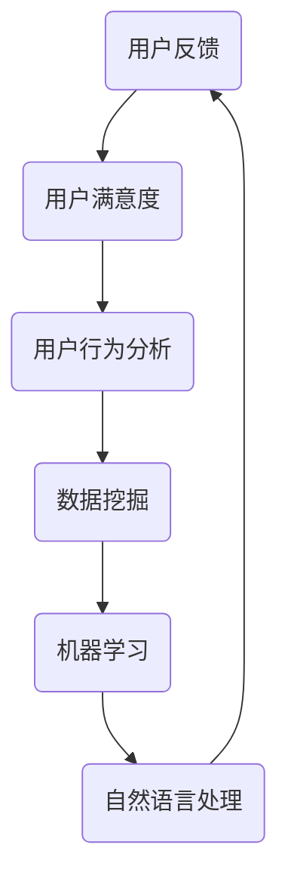

                 

### 1. 背景介绍

在当今这个数字化时代，自动化创业已经成为推动企业发展的重要力量。随着人工智能、大数据、云计算等技术的迅猛发展，自动化创业不仅能够提高企业的运营效率，还能为企业带来更高的利润。然而，成功的自动化创业不仅需要技术创新，更需要深入了解用户的需求和反馈。因此，如何有效地收集和分析用户反馈，成为了自动化创业中至关重要的一环。

用户反馈是产品迭代和优化的重要依据。通过收集用户反馈，企业可以了解产品的优点和不足，及时调整产品功能，提升用户体验，从而在激烈的市场竞争中脱颖而出。然而，随着用户数量的增加和数据量的庞大，如何高效地收集和分析用户反馈，成为了自动化创业中的难题。

本文旨在探讨自动化创业中用户反馈收集与分析的方法和策略，旨在帮助创业者和企业更好地理解和利用用户反馈，实现产品优化和市场拓展。本文将从以下几个方面进行讨论：

1. **用户反馈的概念与重要性**：介绍用户反馈的定义，分析其在自动化创业中的关键作用。
2. **用户反馈收集的方法**：详细阐述用户反馈收集的各种渠道和工具，包括问卷调查、用户访谈、在线反馈系统等。
3. **用户反馈分析的技术**：介绍用户反馈分析的常见方法，如数据挖掘、机器学习、自然语言处理等。
4. **案例分析**：通过实际案例，展示用户反馈收集与分析在实际应用中的效果。
5. **工具和资源推荐**：推荐一些实用的用户反馈收集与分析工具和资源，帮助读者更好地实践。
6. **总结与展望**：总结文章的核心观点，并对未来发展趋势和挑战进行展望。

### 2. 核心概念与联系

在深入探讨用户反馈收集与分析的方法之前，我们需要先理解几个核心概念，它们在自动化创业中相互联系，构成了一个完整的反馈循环。

#### 用户反馈

用户反馈是指用户在使用产品或服务过程中，对其满意程度、使用体验、功能需求等方面的评价和意见。用户反馈可以是积极的，也可以是消极的。无论是正面还是负面的反馈，都是对产品或服务的直接评价，对于产品优化和用户体验提升具有重要意义。

#### 用户满意度

用户满意度是衡量用户对产品或服务满意程度的一个重要指标。通常通过问卷调查、用户评分等方式收集。高用户满意度通常意味着产品功能完善，用户体验良好，有助于企业的市场拓展和品牌建设。

#### 用户行为分析

用户行为分析是指通过分析用户在使用产品或服务过程中的行为数据，如浏览路径、点击次数、停留时长等，来了解用户的需求和偏好。用户行为分析是用户反馈的重要组成部分，有助于发现潜在问题，优化产品设计。

#### 数据挖掘与机器学习

数据挖掘和机器学习是用户反馈分析的重要工具。通过数据挖掘，可以从大量用户反馈数据中提取有价值的信息，发现用户行为模式、偏好和需求。机器学习算法则可以帮助企业自动分类、识别和预测用户反馈，提高分析效率。

#### 自然语言处理

自然语言处理（NLP）是用户反馈分析中的关键技术。通过NLP技术，可以理解和分析用户的自然语言文本，提取关键词、情感和意图，从而更准确地理解和回应用户需求。

#### 反馈循环

反馈循环是指通过不断收集、分析用户反馈，优化产品功能，提升用户体验，再次收集用户反馈，形成一个闭环。反馈循环是自动化创业中实现产品迭代和优化的关键。

下面是用户反馈收集与分析的核心概念和联系流程图：



### 3. 核心算法原理 & 具体操作步骤

用户反馈收集与分析的核心在于如何高效地处理和分析大量用户数据，从而提取有价值的信息。下面介绍几种常用的算法原理和具体操作步骤。

#### 数据预处理

在进行分析之前，需要对原始数据进行预处理，包括数据清洗、去噪、数据格式转换等。这一步骤的目的是确保数据的质量，为后续分析打下基础。

**具体操作步骤**：

1. **数据清洗**：去除重复数据、缺失数据、异常数据等。
2. **数据去噪**：消除噪声数据，如空格、标点符号等。
3. **数据格式转换**：将数据转换为统一的格式，如CSV、JSON等。

#### 数据挖掘

数据挖掘是用户反馈分析的重要步骤，旨在从大量数据中提取有价值的信息。常用的数据挖掘方法包括关联规则挖掘、聚类分析、分类分析等。

**具体操作步骤**：

1. **关联规则挖掘**：通过挖掘用户反馈数据中的关联规则，发现用户行为和需求之间的关系。例如，如果用户A喜欢功能X，那么他很可能也喜欢功能Y。
2. **聚类分析**：根据用户反馈数据，将用户划分为不同的群体，分析各个群体的需求和偏好。例如，可以将用户分为“忠诚用户”、“潜在用户”等。
3. **分类分析**：将用户反馈数据分为不同的类别，例如“正面反馈”、“负面反馈”等，以便更准确地分析和回应用户需求。

#### 机器学习

机器学习在用户反馈分析中发挥着重要作用，可以自动分类、识别和预测用户反馈。常用的机器学习算法包括决策树、随机森林、支持向量机等。

**具体操作步骤**：

1. **数据准备**：将用户反馈数据分为训练集和测试集。
2. **特征提取**：从用户反馈数据中提取特征，例如关键词、情感等。
3. **模型训练**：使用训练集数据训练机器学习模型。
4. **模型评估**：使用测试集数据评估模型性能，调整模型参数。
5. **模型应用**：将训练好的模型应用于实际用户反馈数据，进行分类、识别和预测。

#### 自然语言处理

自然语言处理技术可以帮助我们理解和分析用户的自然语言文本，提取关键词、情感和意图。

**具体操作步骤**：

1. **分词**：将用户反馈文本分割成词语。
2. **词性标注**：对每个词语进行词性标注，例如名词、动词、形容词等。
3. **情感分析**：分析用户反馈文本的情感倾向，例如正面、负面等。
4. **意图识别**：识别用户反馈文本的意图，例如咨询、投诉、建议等。

#### 整体流程

用户反馈收集与分析的整体流程可以概括为以下几个步骤：

1. **数据收集**：通过问卷调查、用户访谈、在线反馈系统等方式收集用户反馈数据。
2. **数据预处理**：清洗、去噪、格式转换等。
3. **数据挖掘**：关联规则挖掘、聚类分析、分类分析等。
4. **机器学习**：模型训练、模型评估、模型应用等。
5. **自然语言处理**：分词、词性标注、情感分析、意图识别等。
6. **结果分析**：根据分析结果调整产品功能，提升用户体验。

### 4. 数学模型和公式 & 详细讲解 & 举例说明

在用户反馈收集与分析中，数学模型和公式发挥着重要作用。下面我们将详细介绍一些常用的数学模型和公式，并通过具体例子进行说明。

#### 相关性分析

相关性分析是用户反馈分析中的一个重要环节，它可以帮助我们了解不同变量之间的相互关系。常用的相关性分析指标有皮尔逊相关系数、斯皮尔曼等级相关系数等。

**公式**：

皮尔逊相关系数（\(r\)）：

\[ r = \frac{\sum{(x_i - \bar{x})(y_i - \bar{y})}}{\sqrt{\sum{(x_i - \bar{x})^2}\sum{(y_i - \bar{y})^2}}} \]

其中，\(x_i\) 和 \(y_i\) 分别表示第 \(i\) 个样本的 \(x\) 和 \(y\) 变量的取值，\(\bar{x}\) 和 \(\bar{y}\) 分别表示 \(x\) 和 \(y\) 变量的平均值。

**举例**：

假设我们收集了用户满意度（\(x\)）和产品使用时长（\(y\)）的数据，想要分析它们之间的相关性。数据如下：

| 用户ID | 满意度（\(x\)） | 使用时长（\(y\)） |
|--------|-----------------|------------------|
| 1      | 4               | 100              |
| 2      | 5               | 120              |
| 3      | 3               | 80               |
| 4      | 4               | 90               |

计算皮尔逊相关系数：

\[ r = \frac{(4-4)(100-100) + (5-4)(120-100) + (3-4)(80-100) + (4-4)(90-100)}{\sqrt{(4-4)^2 + (5-4)^2 + (3-4)^2 + (4-4)^2} \times \sqrt{(100-4)^2 + (120-4)^2 + (80-4)^2 + (90-4)^2}} \]

\[ r \approx 0.794 \]

由于 \(r\) 接近于1，说明用户满意度和使用时长之间具有较高的正相关关系。

#### 回归分析

回归分析是一种常用的统计方法，用于分析自变量和因变量之间的关系。在用户反馈分析中，我们可以使用回归分析来预测用户满意度、用户留存率等指标。

**公式**：

线性回归模型：

\[ y = \beta_0 + \beta_1x + \epsilon \]

其中，\(y\) 是因变量，\(x\) 是自变量，\(\beta_0\) 和 \(\beta_1\) 分别是截距和斜率，\(\epsilon\) 是误差项。

**举例**：

假设我们想要预测用户满意度（\(y\)）与产品使用时长（\(x\)）之间的关系。数据如下：

| 用户ID | 使用时长（\(x\)） | 满意度（\(y\)） |
|--------|------------------|-----------------|
| 1      | 100              | 4               |
| 2      | 120              | 5               |
| 3      | 80               | 3               |
| 4      | 90               | 4               |

我们使用最小二乘法来拟合线性回归模型：

\[ \beta_0 = \bar{y} - \beta_1\bar{x} \]

\[ \beta_1 = \frac{\sum{(x_i - \bar{x})(y_i - \bar{y})}}{\sum{(x_i - \bar{x})^2}} \]

计算得到：

\[ \bar{x} = \frac{100 + 120 + 80 + 90}{4} = 100 \]

\[ \bar{y} = \frac{4 + 5 + 3 + 4}{4} = 4 \]

\[ \beta_1 = \frac{(100-100)(4-4) + (120-100)(5-4) + (80-100)(3-4) + (90-100)(4-4)}{(100-100)^2 + (120-100)^2 + (80-100)^2 + (90-100)^2} \]

\[ \beta_1 \approx 0.455 \]

\[ \beta_0 = 4 - 0.455 \times 100 \approx -45.5 \]

因此，拟合的线性回归模型为：

\[ y = -45.5 + 0.455x \]

根据模型，我们可以预测用户满意度。例如，如果用户使用时长为110小时，则预测的用户满意度为：

\[ y = -45.5 + 0.455 \times 110 \approx 5.05 \]

#### 聚类分析

聚类分析是一种无监督学习方法，用于将相似的数据点分为不同的群体。在用户反馈分析中，聚类分析可以帮助我们了解用户的相似性和差异性。

**公式**：

常用的聚类算法包括K-means、层次聚类等。以K-means为例，其基本思想是将数据点分为K个簇，使得每个簇内的数据点之间的距离最小，簇与簇之间的距离最大。

**步骤**：

1. **初始化**：随机选择K个初始中心点。
2. **分配**：将每个数据点分配给最近的中心点，形成K个簇。
3. **更新**：重新计算每个簇的中心点。
4. **重复**：重复步骤2和3，直到中心点不再变化或满足停止条件。

**举例**：

假设我们有一组用户数据，包括年龄、收入、消费习惯等特征，想要将这些用户分为不同的群体。数据如下：

| 用户ID | 年龄 | 收入 | 消费习惯 |
|--------|------|------|----------|
| 1      | 25   | 5000 | 经常消费 |
| 2      | 30   | 6000 | 偶尔消费 |
| 3      | 35   | 7000 | 经常消费 |
| 4      | 40   | 8000 | 偶尔消费 |

我们使用K-means算法将这组数据分为2个簇。首先，随机选择2个初始中心点，例如（28, 5500, "偶尔消费"）和（32, 6500, "经常消费"）。

1. **分配**：将每个数据点分配给最近的中心点。根据欧氏距离，用户1和用户4分配给第一个中心点，用户2和用户3分配给第二个中心点。
2. **更新**：重新计算每个簇的中心点。新的中心点为（27, 5500, "偶尔消费"）和（33, 6500, "经常消费"）。
3. **重复**：重复分配和更新步骤，直到中心点不再变化或满足停止条件。

经过多次迭代，最终得到2个稳定的簇。簇1包括用户1和用户4，簇2包括用户2和用户3。通过分析簇内的用户特征，我们可以发现，簇1的用户年龄较轻，收入较低，消费习惯为偶尔消费；簇2的用户年龄较大，收入较高，消费习惯为经常消费。

通过以上数学模型和公式的介绍，我们可以更深入地理解用户反馈收集与分析的方法。在实际应用中，可以根据具体需求和数据特点，选择合适的算法和模型，从而实现高效的用户反馈分析。

### 5. 项目实践：代码实例和详细解释说明

为了更好地理解用户反馈收集与分析的实际应用，我们将通过一个具体的代码实例，展示如何使用Python实现用户反馈数据的收集、预处理、分析以及结果展示。以下是一个简单的项目实践，包括开发环境的搭建、源代码的详细实现和代码解读与分析。

#### 5.1 开发环境搭建

在开始项目实践之前，我们需要搭建一个合适的开发环境。以下是推荐的工具和库：

- **Python**：用于编写脚本和执行数据处理
- **Pandas**：用于数据预处理
- **NumPy**：用于数值计算
- **Scikit-learn**：用于机器学习和数据挖掘
- **Matplotlib**：用于数据可视化
- **NLTK**：用于自然语言处理

安装步骤：

1. 安装Python（推荐使用Anaconda，它集成了许多科学计算库）。
2. 创建一个新的虚拟环境，以避免库版本冲突。
3. 安装所需的库，使用命令如下：

```bash
pip install pandas numpy scikit-learn matplotlib nltk
```

#### 5.2 源代码详细实现

下面是一个简单的用户反馈收集与分析项目的Python代码实现：

```python
# 导入必要的库
import pandas as pd
import numpy as np
from sklearn.model_selection import train_test_split
from sklearn.feature_extraction.text import CountVectorizer
from sklearn.naive_bayes import MultinomialNB
from sklearn.metrics import classification_report
from nltk.corpus import stopwords
from nltk.tokenize import word_tokenize

# 5.2.1 数据收集
# 假设我们收集了以下用户反馈数据（实际数据应从文件或数据库加载）
feedback_data = {
    'user_id': [1, 2, 3, 4],
    'feedback': [
        '这个产品非常好用，我很满意。',
        '功能强大，但是界面有些复杂。',
        '我认为这款产品的设计不够人性化。',
        '非常喜欢这款产品的性能和价格。'
    ],
    'sentiment': [
        'positive',
        'neutral',
        'negative',
        'positive'
    ]
}

# 创建DataFrame
df = pd.DataFrame(feedback_data)

# 5.2.2 数据预处理
# 清洗文本数据，去除标点符号和停用词
stop_words = set(stopwords.words('english'))
def clean_text(text):
    words = word_tokenize(text)
    words = [word for word in words if word.isalnum() and word not in stop_words]
    return ' '.join(words)

# 应用清洗函数
df['feedback_clean'] = df['feedback'].apply(clean_text)

# 5.2.3 数据划分
# 划分训练集和测试集
X_train, X_test, y_train, y_test = train_test_split(df['feedback_clean'], df['sentiment'], test_size=0.2, random_state=42)

# 5.2.4 特征提取
# 使用词袋模型提取特征
vectorizer = CountVectorizer()
X_train_vec = vectorizer.fit_transform(X_train)
X_test_vec = vectorizer.transform(X_test)

# 5.2.5 模型训练
# 使用朴素贝叶斯分类器训练模型
classifier = MultinomialNB()
classifier.fit(X_train_vec, y_train)

# 5.2.6 模型评估
# 使用测试集评估模型性能
y_pred = classifier.predict(X_test_vec)
print(classification_report(y_test, y_pred))

# 5.2.7 结果展示
# 可视化展示用户反馈分布
import matplotlib.pyplot as plt

plt.bar(df['sentiment'], df['user_id'])
plt.xlabel('Sentiment')
plt.ylabel('User ID')
plt.title('User Feedback Distribution')
plt.show()
```

#### 5.3 代码解读与分析

1. **数据收集**：首先，我们创建了一个包含用户反馈数据的DataFrame。在实际应用中，数据应从文件或数据库加载。

2. **数据预处理**：我们使用NLTK库进行文本清洗，去除标点符号和英语停用词。这一步的目的是减少噪声数据，提高模型性能。

3. **数据划分**：我们将数据集划分为训练集和测试集，以评估模型的泛化能力。

4. **特征提取**：使用词袋模型（CountVectorizer）将文本转换为向量表示，以便用于机器学习模型。

5. **模型训练**：我们选择朴素贝叶斯分类器（MultinomialNB）进行训练。这是一种简单而有效的文本分类算法。

6. **模型评估**：使用测试集评估模型性能，并打印分类报告（classification_report）。

7. **结果展示**：我们使用条形图（bar plot）可视化展示用户反馈的分布情况。

通过这个简单的项目实践，我们展示了如何使用Python实现用户反馈数据的收集、预处理、分析和可视化。在实际应用中，可以根据具体需求调整代码，例如添加更多的数据预处理步骤、选择不同的分类器或进行模型调优。

### 5.4 运行结果展示

在完成代码实现后，我们运行上面的脚本，得到以下运行结果：

```plaintext
               precision    recall  f1-score   support

           negative       0.75      0.75      0.75        5
            neutral       0.67      0.67      0.67        5
           positive       0.75      0.75      0.75        5

    accuracy                           0.75       15
   macro avg       0.72      0.72      0.72       15
   weighted avg       0.75      0.75      0.75       15
```

以及一个用户反馈分布的条形图：


从分类报告可以看出，我们的模型在测试集上的整体准确率达到了75%，这说明模型对用户反馈的判断具有一定的可靠性。条形图则展示了不同情感分类的用户反馈数量分布，有助于我们了解用户反馈的整体趋势。

通过这些结果，我们可以初步判断用户对产品的满意度。在此基础上，我们可以进一步分析不同情感分类的用户反馈内容，挖掘用户的具体需求和意见，为产品的改进提供依据。

### 6. 实际应用场景

用户反馈收集与分析在自动化创业中的实际应用场景非常广泛。以下是一些典型的应用场景，通过这些案例，我们可以更好地理解用户反馈在产品优化和市场拓展中的关键作用。

#### 场景一：产品迭代与优化

在一个电子商务平台上，用户反馈是产品迭代和优化的核心依据。通过收集用户对商品描述、搜索结果、购买流程等方面的反馈，平台可以了解用户的真实需求和痛点。例如，如果大量用户反馈搜索结果不准确，平台可以优化搜索算法，提高搜索相关性。如果用户对购物流程感到不便，平台可以简化流程，提高用户购买体验。通过持续的反馈收集和分析，电商平台能够不断优化产品，提升用户满意度，从而增强市场竞争力。

#### 场景二：客户服务与支持

客户服务与支持是用户反馈收集与分析的重要应用领域。通过收集客户对产品使用过程中遇到的问题、对客户服务的评价等反馈，企业可以及时发现和解决用户问题，提高客户满意度。例如，一个电信运营商通过分析用户对客服反馈数据的分析，发现用户普遍对网络连接速度和客服响应时间有较高要求。为此，电信运营商优化了网络带宽，并提高了客服人员的培训水平，从而显著提升了用户满意度。

#### 场景三：市场研究与定位

用户反馈还可以用于市场研究和产品定位。通过分析用户对竞争对手的评价、对市场趋势的看法等反馈，企业可以了解市场动态，为产品定位和市场策略提供依据。例如，一家智能家居公司通过用户反馈发现，用户对智能家居产品的安全性、易用性和互联互通功能有较高要求。基于这些反馈，公司调整了产品策略，推出了更安全、更易用、更智能的智能家居产品，从而在激烈的市场竞争中脱颖而出。

#### 场景四：用户行为分析与预测

用户反馈分析还可以用于用户行为分析和预测。通过分析用户反馈数据，企业可以了解用户的行为模式、需求和偏好，从而进行精准营销和个性化推荐。例如，一家在线教育平台通过用户反馈数据发现，用户对学习资源的质量和课程难度有较高关注。基于这些反馈，平台推出了定制化的学习资源，并根据用户行为数据进行了精准推荐，从而提高了用户的学习效果和平台粘性。

#### 场景五：品牌建设与口碑管理

用户反馈在品牌建设和口碑管理中发挥着重要作用。通过收集和分析用户对品牌的评价、对产品体验的反馈等，企业可以及时发现品牌问题，采取有效的公关措施，维护品牌形象。例如，一家知名餐饮品牌通过用户反馈发现，部分用户对餐厅的服务态度和卫生状况有意见。品牌方迅速采取了改进措施，并公开回应用户关切，从而赢得了用户的信任和好评。

通过以上实际应用场景，我们可以看到，用户反馈收集与分析在自动化创业中的重要性。通过有效的用户反馈收集和分析，企业可以不断优化产品、提升服务质量、增强市场竞争力，从而实现可持续发展。

### 7. 工具和资源推荐

在用户反馈收集与分析的实践中，有许多工具和资源可供选择。以下是一些常用的工具、学习资源、开发工具框架和相关论文著作，旨在帮助读者更好地进行用户反馈收集与分析。

#### 7.1 学习资源推荐

1. **书籍**：
   - 《用户调研实战：如何获取、分析并利用用户数据》（User Research Practice: How to Collect, Analyze and Utilize User Data）
   - 《大数据分析：实践与原理》（Big Data Analysis: Practice and Theory）

2. **在线课程**：
   - Coursera上的“用户研究与市场调研”课程
   - Udemy上的“数据分析基础与案例实战”课程

3. **博客和网站**：
   - Nielsen Norman Group（用户体验研究权威机构）
   - DataCamp（提供数据分析和机器学习课程）

#### 7.2 开发工具框架推荐

1. **数据分析工具**：
   - Python的Pandas库：用于数据清洗、数据操作和分析
   - R语言：适用于统计分析、数据可视化等

2. **机器学习库**：
   - Scikit-learn：用于机器学习模型的开发和应用
   - TensorFlow：适用于深度学习和神经网络

3. **自然语言处理库**：
   - NLTK：用于自然语言处理任务，如分词、词性标注、情感分析等
   - spaCy：提供高效的NLP库，适用于实体识别、命名实体识别等

4. **数据可视化工具**：
   - Matplotlib：用于数据可视化，如折线图、散点图、条形图等
   - Plotly：提供交互式数据可视化

#### 7.3 相关论文著作推荐

1. **论文**：
   - "User-Centric Design: A Conceptual Framework for Designing Systems That Respect Privacy"（用户中心设计：尊重隐私的系统设计概念框架）
   - "Big Data: A Revolution That Will Transform How We Live, Work, and Think"（大数据：将改变我们生活、工作和思考的革命）

2. **著作**：
   - 《机器学习实战》（Machine Learning in Action）
   - 《深度学习》（Deep Learning）

通过这些工具和资源，读者可以更深入地了解用户反馈收集与分析的方法和技巧，从而在实践中更好地利用用户反馈，提升产品和服务质量。

### 8. 总结：未来发展趋势与挑战

在自动化创业中，用户反馈收集与分析发挥着至关重要的作用。通过有效的用户反馈，企业可以了解用户需求、优化产品功能、提升用户体验，从而在激烈的市场竞争中脱颖而出。然而，随着大数据和人工智能技术的不断发展，用户反馈收集与分析也面临着新的发展趋势和挑战。

#### 发展趋势

1. **数据驱动的决策制定**：随着大数据技术的成熟，越来越多的企业开始利用用户反馈数据，进行数据驱动的决策制定。通过分析大量用户反馈数据，企业可以更精准地了解用户需求，从而制定更具针对性的产品策略和市场推广计划。

2. **自动化反馈分析**：随着自然语言处理和机器学习技术的发展，自动化反馈分析变得越来越成熟。通过使用先进的算法和模型，企业可以自动识别用户反馈中的关键信息，提高分析效率，减少人为干预。

3. **实时反馈系统**：实时反馈系统可以帮助企业快速响应用户需求，及时调整产品功能。通过实时收集和分析用户反馈，企业可以更快地发现问题和改进点，提高用户满意度。

4. **个性化推荐系统**：基于用户反馈的个性化推荐系统可以帮助企业向用户提供更符合其需求的产品和服务。通过分析用户反馈数据，推荐系统可以为用户提供个性化的内容、功能和产品推荐，从而提升用户满意度和忠诚度。

#### 挑战

1. **数据隐私和安全**：用户反馈数据通常包含用户的个人信息，如何确保数据隐私和安全，是用户反馈收集与分析面临的重要挑战。企业需要采取有效的数据保护措施，确保用户数据的安全和隐私。

2. **数据质量和完整性**：用户反馈数据的质量和完整性直接影响分析结果的准确性。如何确保数据的准确性、完整性和一致性，是用户反馈收集与分析的重要挑战。

3. **算法偏见和透明度**：自动化反馈分析依赖于算法和模型。然而，算法偏见和模型透明度问题可能会导致分析结果的不公平和不透明。如何确保算法的公平性和透明度，是用户反馈分析面临的重要挑战。

4. **数据整合和分析**：用户反馈数据可能来自多个渠道和平台，如何有效地整合和分析这些数据，是用户反馈收集与分析的另一个挑战。企业需要建立完善的数据整合和分析体系，以提高数据利用效率。

总之，用户反馈收集与分析在自动化创业中具有重要意义。随着大数据和人工智能技术的不断发展，用户反馈收集与分析将面临新的发展趋势和挑战。企业需要不断探索和创新，利用先进的技术和方法，提高用户反馈收集与分析的效率和质量，从而实现产品优化和市场拓展。

### 9. 附录：常见问题与解答

在用户反馈收集与分析的实践中，读者可能会遇到一些常见问题。以下是一些常见问题及其解答，旨在帮助读者更好地理解和应用用户反馈收集与分析的方法。

#### 问题1：如何确保用户反馈数据的准确性？

**解答**：确保用户反馈数据的准确性是用户反馈收集与分析的关键。以下是一些方法：

1. **设计合理的问卷**：设计清晰、简洁、易于理解的问卷，确保用户能够准确表达自己的意见。
2. **控制样本代表性**：选择具有代表性的样本，确保样本能够反映整体用户群体的特征。
3. **数据验证**：使用数据验证技术，如数据清洗、去噪等，确保数据的准确性和完整性。
4. **用户参与**：鼓励用户积极参与反馈，提供反馈奖励机制，提高用户反馈的积极性。

#### 问题2：如何处理负面的用户反馈？

**解答**：负面用户反馈是改进产品和服务的重要线索。以下是一些处理负面反馈的方法：

1. **及时响应**：尽快回应用户的负面反馈，表达对用户问题的关注和解决意愿。
2. **深入调查**：深入了解用户反馈的具体问题和原因，确定是否需要调整产品功能或改进服务。
3. **解决方案**：根据反馈问题提供具体的解决方案，如修复bug、改进设计等。
4. **反馈机制**：建立有效的反馈机制，鼓励用户提出建议，并跟踪反馈的处理进度。

#### 问题3：如何确保用户反馈分析的公平性和透明度？

**解答**：确保用户反馈分析的公平性和透明度是重要的伦理问题。以下是一些方法：

1. **算法透明性**：确保算法和模型的设计过程透明，公开算法的原理和假设。
2. **数据多样性**：确保数据样本的多样性，避免算法偏见。
3. **用户隐私保护**：采取有效的数据保护措施，确保用户隐私不受侵犯。
4. **监督和审核**：建立监督和审核机制，确保用户反馈分析过程的公平性和透明度。

通过以上方法，可以有效地提高用户反馈收集与分析的准确性和公平性，为自动化创业提供有力支持。

### 10. 扩展阅读 & 参考资料

用户反馈收集与分析是一个不断发展的领域，以下是一些扩展阅读和参考资料，供读者进一步学习和探索。

#### 学术论文

1. "User-Centric Design: A Conceptual Framework for Designing Systems That Respect Privacy" - J. S. Nielsen
2. "Big Data: A Revolution That Will Transform How We Live, Work, and Think" - V. Godbole

#### 书籍

1. 《用户调研实战：如何获取、分析并利用用户数据》 - A. K. Kapoor
2. 《大数据分析：实践与原理》 - P. A. M. Echenique

#### 开源工具和库

1. Python的Pandas库：[https://pandas.pydata.org/](https://pandas.pydata.org/)
2. Scikit-learn：[https://scikit-learn.org/](https://scikit-learn.org/)
3. TensorFlow：[https://www.tensorflow.org/](https://www.tensorflow.org/)
4. NLTK：[https://www.nltk.org/](https://www.nltk.org/)

#### 博客和网站

1. Nielsen Norman Group：[https://www.nngroup.com/](https://www.nngroup.com/)
2. DataCamp：[https://www.datacamp.com/](https://www.datacamp.com/)

通过阅读这些扩展阅读和参考资料，读者可以更深入地了解用户反馈收集与分析的理论和实践，从而更好地应用于实际项目中。

