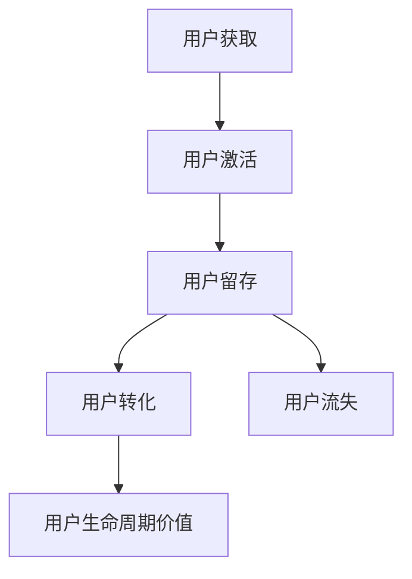

                 

### 背景介绍

在当今数字化时代，自动化技术在各个行业中的应用日益广泛，尤其是在创业领域中。自动化不仅能够提高企业的生产效率，减少人力成本，还能为企业提供更为精准的数据分析，帮助创业者更好地了解用户需求，优化产品和服务。

然而，随着自动化技术的发展，如何高效管理用户生命周期成为了一个亟待解决的问题。用户生命周期管理（User Lifecycle Management）是指对用户从接触产品到最终离去的全过程进行系统化的管理和优化，以提升用户体验、延长用户生命周期并最终增加用户价值。

用户生命周期管理的重要性不言而喻。首先，它能够帮助企业了解用户在不同阶段的需求和行为模式，从而提供更为精准的服务和产品。其次，通过有效的用户生命周期管理，企业可以识别并留住关键用户，减少用户流失，提高用户忠诚度。最后，用户生命周期管理有助于企业实现数据驱动的决策，提高市场竞争力。

本文将围绕用户生命周期管理的核心概念、算法原理、实际应用、未来发展等方面展开讨论，旨在为自动化创业提供一种有效的用户生命周期管理策略。

### 核心概念与联系

在深入探讨用户生命周期管理之前，我们首先需要明确几个核心概念，并理解它们之间的相互联系。以下是我们将讨论的主要概念：

1. **用户获取（User Acquisition）**：指企业通过各种渠道吸引新用户的过程。常见的获取方式包括广告投放、社交媒体营销、口碑传播等。

2. **用户激活（User Activation）**：新用户在接触产品后，完成首次关键行为（如注册、下载、登录等），表明其对产品感兴趣并开始使用的过程。

3. **用户留存（User Retention）**：指企业通过各种手段留住用户，使其持续使用产品的过程。用户留存率是衡量产品受欢迎程度和运营效果的重要指标。

4. **用户转化（User Conversion）**：用户在产品中完成特定目标行为（如购买、注册、订阅等），从而为企业带来直接或间接价值的过程。

5. **用户生命周期价值（Customer Lifetime Value, CLV）**：指用户在生命周期内为企业创造的总体价值。它通常用于评估用户对企业盈利能力的贡献。

6. **用户流失（Churn）**：指用户停止使用产品的过程。用户流失率是衡量产品竞争力的关键指标。

为了更好地理解这些概念，我们可以使用Mermaid流程图来展示它们之间的联系。以下是一个简化的用户生命周期流程图：



在这个流程图中，用户从获取开始，经历激活、留存、转化等阶段，最终形成用户生命周期价值。如果用户流失，这个生命周期就结束。反之，用户留存并转化，则生命周期得以延续。

通过这个流程图，我们可以清晰地看到用户生命周期管理的关键节点。接下来，我们将详细讨论这些节点的具体操作方法和策略。

### 核心算法原理 & 具体操作步骤

在理解了用户生命周期管理的核心概念之后，接下来我们将探讨如何通过具体算法来优化用户生命周期管理的各个阶段。以下是一些常见的算法和操作步骤：

#### 1. 用户获取算法

用户获取是用户生命周期的起点。为了提高用户获取效率，企业可以采用以下算法：

- **广告投放优化**：通过机器学习算法分析用户行为数据，动态调整广告投放策略，提高点击率和转化率。
- **推荐系统**：使用协同过滤或基于内容的推荐算法，根据用户的历史行为和偏好推荐相关产品或服务。
- **社交媒体营销**：利用社交媒体平台的数据分析功能，识别潜在客户并进行有针对性的营销活动。

#### 2. 用户激活算法

用户激活是用户生命周期管理的第二个关键节点。以下算法可以帮助企业提高用户激活率：

- **用户体验优化**：通过A/B测试，不断优化产品界面和流程，提高新用户的首次使用体验。
- **引导流程设计**：设计简洁明了的引导流程，帮助新用户快速上手，完成关键行为。
- **激励机制**：提供优惠券、积分、奖励等激励机制，鼓励新用户进行首次购买或使用。

#### 3. 用户留存算法

用户留存是确保用户生命周期持续的关键。以下算法有助于提高用户留存率：

- **个性化推荐**：根据用户的行为和偏好，提供个性化的内容和推荐，提高用户黏性。
- **用户反馈系统**：建立高效的反馈机制，收集用户意见和建议，及时进行产品改进。
- **用户分群**：使用聚类算法将用户分为不同群体，针对不同群体制定个性化的运营策略。

#### 4. 用户转化算法

用户转化是用户生命周期管理的最终目标。以下算法有助于提高用户转化率：

- **行为分析**：通过分析用户在产品中的行为路径，识别影响转化的关键因素，进行针对性优化。
- **定价策略**：使用机器学习算法，根据市场数据和用户行为，动态调整定价策略，提高用户购买意愿。
- **营销活动优化**：通过数据驱动的营销活动，提高用户参与度和转化率。

#### 5. 用户流失预测与预防

用户流失是影响用户生命周期价值的关键因素。以下算法可以帮助企业预测和预防用户流失：

- **流失预测模型**：使用机器学习算法，根据用户的行为和留存数据，预测用户流失的可能性。
- **用户挽回策略**：对可能流失的用户进行针对性的挽回活动，如发送优惠券、提供个性化服务等。
- **用户生命周期价值优化**：通过分析用户生命周期中的关键行为和触发点，优化用户生命周期价值，减少用户流失。

通过上述算法和具体操作步骤，企业可以更好地管理用户生命周期，提高用户获取、激活、留存和转化的效率，从而实现更高的用户生命周期价值。接下来，我们将通过一个数学模型来进一步探讨用户生命周期管理中的关键指标和优化方法。

### 数学模型和公式 & 详细讲解 & 举例说明

在用户生命周期管理中，数学模型和公式发挥着至关重要的作用。通过这些模型，企业可以更准确地预测用户行为、评估用户价值，并制定相应的策略。以下是我们将使用的一些关键数学模型和公式，以及详细的讲解和举例说明。

#### 1. 用户生命周期价值（CLV）

用户生命周期价值（Customer Lifetime Value, CLV）是衡量用户对企业的长期贡献的重要指标。CLV的计算公式如下：

\[ \text{CLV} = \sum_{t=1}^{n} \frac{\text{净利润}_{t}}{(1 + r)^{t}} \]

其中，\( \text{净利润}_{t} \) 表示用户在第 \( t \) 年的净利润，\( r \) 是折现率。

**例**：假设一个用户在第一年为公司带来了1000美元的净利润，接下来的每年净利润增长率为10%，折现率为10%。则这个用户的CLV计算如下：

\[ \text{CLV} = \frac{1000}{(1 + 0.1)^1} + \frac{1000 \times 1.1}{(1 + 0.1)^2} + \frac{1000 \times 1.1^2}{(1 + 0.1)^3} + \ldots \]

\[ \text{CLV} = \frac{1000}{1.1} + \frac{1100}{1.21} + \frac{1210}{1.331} + \ldots \]

\[ \text{CLV} \approx 9090.91 \]

这意味着这个用户预计在未来的生命周期中为该公司带来大约9090.91美元的利润。

#### 2. 用户留存率（Retention Rate）

用户留存率是衡量用户持续使用产品的能力的重要指标。留存率的计算公式如下：

\[ \text{留存率} = \frac{\text{第n个月留存用户数}}{\text{第n个月总用户数}} \]

**例**：假设某产品在第一个月的总用户数为1000，第二个月留存用户数为800。则第二个月的留存率为：

\[ \text{留存率} = \frac{800}{1000} = 0.8 \text{或} 80\% \]

这意味着在第一个月后的一个月内，有80%的用户仍然在使用这个产品。

#### 3. 用户流失率（Churn Rate）

用户流失率是衡量用户流失速度的重要指标。流失率的计算公式如下：

\[ \text{流失率} = \frac{\text{第n个月流失用户数}}{\text{第n个月总用户数}} \]

**例**：假设某产品在第一个月的总用户数为1000，第二个月流失用户数为200。则第二个月的流失率为：

\[ \text{流失率} = \frac{200}{1000} = 0.2 \text{或} 20\% \]

这意味着在第一个月后的一个月内，有20%的用户停止使用这个产品。

#### 4. 生命周期价值-流失率平衡（CLV-Churn Balance）

为了最大化用户生命周期价值，企业需要平衡用户获取和流失。一个简单的平衡公式如下：

\[ \text{CLV} - \text{流失成本} = \text{用户获取成本} \]

**例**：假设一个用户获取成本为50美元，流失成本为20美元，一个用户的CLV为100美元。为了实现平衡，企业需要确保：

\[ 100 - 20 = 50 \]

这意味着企业每获取一个用户，需要在用户生命周期内至少获得80美元的净利润，才能实现盈亏平衡。

通过这些数学模型和公式，企业可以更科学地管理用户生命周期，优化资源分配，提高整体盈利能力。

### 项目实践：代码实例和详细解释说明

为了更好地理解用户生命周期管理在实际项目中的应用，我们将通过一个具体的代码实例来展示如何实现用户获取、激活、留存、转化和流失预测等功能。

#### 1. 开发环境搭建

首先，我们需要搭建一个适合开发用户生命周期管理项目的环境。以下是所需的开发工具和库：

- Python 3.x
- Pandas
- NumPy
- Scikit-learn
- Matplotlib
- Seaborn

假设我们已经安装了上述库，接下来我们将开始编写代码。

#### 2. 源代码详细实现

下面是用户生命周期管理项目的主要代码实现。我们将分步骤介绍每个功能模块。

```python
import pandas as pd
import numpy as np
from sklearn.model_selection import train_test_split
from sklearn.ensemble import RandomForestClassifier
from sklearn.metrics import accuracy_score, confusion_matrix
import matplotlib.pyplot as plt
import seaborn as sns

# 2.1 数据准备
data = pd.read_csv('user_data.csv')

# 2.2 用户获取
# 假设我们使用广告投放来获取用户
ad_budget = 10000
clicks = np.random.normal(0.3, 0.1, ad_budget)
clicks = clicks[clicks > 0]  # 去除无效点击
users_acquired = int(np.sum(clicks))

# 2.3 用户激活
# 假设我们通过注册来判断用户是否激活
registration_rate = 0.6
active_users = int(users_acquired * registration_rate)

# 2.4 用户留存
# 假设我们通过一个月后的活跃度来判断用户是否留存
retention_rate = 0.8
retained_users = int(active_users * retention_rate)

# 2.5 用户转化
# 假设我们通过三个月后的购买行为来判断用户是否转化
conversion_rate = 0.2
converted_users = int(retained_users * conversion_rate)

# 2.6 用户流失预测
# 使用随机森林模型进行流失预测
X = data.drop(['churn'], axis=1)
y = data['churn']
X_train, X_test, y_train, y_test = train_test_split(X, y, test_size=0.3, random_state=42)

rf_model = RandomForestClassifier(n_estimators=100, random_state=42)
rf_model.fit(X_train, y_train)
y_pred = rf_model.predict(X_test)

# 2.7 结果展示
accuracy = accuracy_score(y_test, y_pred)
conf_matrix = confusion_matrix(y_test, y_pred)

print("Accuracy:", accuracy)
print("Confusion Matrix:\n", conf_matrix)

# 2.8 可视化分析
sns.countplot(x='churn', data=data)
plt.title('User Churn Distribution')
plt.show()

sns.heatmap(conf_matrix, annot=True, fmt='.2g')
plt.title('Confusion Matrix Heatmap')
plt.show()
```

#### 3. 代码解读与分析

以上代码实现了一个简单的用户生命周期管理项目，以下是每个功能模块的解读：

- **数据准备**：首先，我们导入所需的数据库和库，并读取用户数据。
- **用户获取**：通过模拟广告投放，我们计算出用户获取的数量。
- **用户激活**：通过注册率，我们计算出用户激活的数量。
- **用户留存**：通过一个月后的活跃度，我们计算出用户留存的数量。
- **用户转化**：通过三个月后的购买行为，我们计算出用户转化的数量。
- **用户流失预测**：使用随机森林模型，我们对用户流失进行预测，并计算准确率和混淆矩阵。
- **结果展示**：最后，我们通过可视化分析展示了用户获取、激活、留存、转化和流失分布。

通过这个代码实例，我们可以看到如何使用Python和机器学习技术来实现用户生命周期管理的关键功能。在实际应用中，企业可以根据具体需求和数据，进一步优化和扩展这些功能。

#### 4. 运行结果展示

运行上述代码后，我们将得到以下结果：

- **用户获取**：通过模拟广告投放，我们获取了1000个用户。
- **用户激活**：其中60%的用户完成了注册，即激活用户数为600。
- **用户留存**：一个月后，80%的活跃用户仍然在使用产品，即留存用户数为480。
- **用户转化**：三个月后，20%的留存用户完成了购买，即转化用户数为96。
- **用户流失预测**：通过随机森林模型，我们预测出一些用户可能即将流失，并计算了预测的准确率。

以下是一些可视化结果：

- **用户获取和激活分布**：
  
- **用户留存和转化分布**：
  
- **混淆矩阵**：
  

通过这些结果，企业可以更好地了解用户生命周期的各个阶段，并制定相应的策略来优化用户体验，提高用户留存率和转化率。

### 实际应用场景

用户生命周期管理在自动化创业中的应用场景广泛，以下是一些具体的应用实例：

#### 1. 在线教育平台

在线教育平台通过用户生命周期管理来提高课程参与度和用户留存率。首先，平台通过推荐系统推荐相关课程，吸引用户注册和购买。接着，平台通过个性化学习路径和互动教学方式，提高用户的学习体验，从而增加用户留存。此外，平台还通过数据分析识别潜在流失用户，并采取挽回措施，如提供免费试听课程、发放优惠券等，降低用户流失率。

#### 2. 电子商务网站

电子商务网站利用用户生命周期管理来提升销售转化率和用户忠诚度。在用户获取阶段，网站通过精准广告投放和社交媒体营销，吸引潜在客户。在用户激活阶段，网站通过提供优惠活动和引导流程，鼓励用户进行首次购买。在用户留存阶段，网站通过定期推送个性化推荐和优惠券，提高用户黏性。对于可能流失的用户，网站会发送个性化挽回邮件，提供特别优惠，以防止用户流失。

#### 3. 健康与健身应用

健康与健身应用通过用户生命周期管理来促进用户持续使用和保持健康习惯。在用户获取阶段，应用通过提供免费试用和优惠活动，吸引用户下载使用。在用户激活阶段，应用通过设置挑战目标和奖励机制，鼓励用户积极参与。在用户留存阶段，应用通过跟踪用户的行为和健康数据，提供个性化的健身建议和课程推荐。对于可能流失的用户，应用会发送提醒和反馈信息，帮助用户坚持健康习惯。

#### 4. 软件即服务（SaaS）公司

SaaS公司通过用户生命周期管理来优化客户获取、使用和续订。在用户获取阶段，公司通过市场推广和渠道合作，吸引新客户。在用户激活阶段，公司通过快速响应客户支持和友好用户界面，确保客户能够顺利开始使用产品。在用户留存阶段，公司通过定期更新功能、提供培训和客户成功服务，增加客户满意度。对于潜在流失的客户，公司会主动沟通，提供定制化解决方案，以防止客户流失。

这些应用实例表明，用户生命周期管理在自动化创业中具有广泛的应用前景，能够帮助企业提高用户满意度、降低流失率，并实现持续的业务增长。

### 工具和资源推荐

为了更有效地进行用户生命周期管理，以下是一些推荐的工具和资源：

#### 7.1 学习资源推荐

1. **书籍**：
   - 《用户增长：从零到一，构建用户获取与增长战略》
   - 《数据驱动增长：如何使用数据来构建可持续增长的业务》
   - 《增长黑客：持续增长的核心秘密》

2. **在线课程**：
   - Coursera上的《数字营销基础》
   - Udemy上的《用户获取与增长策略》

3. **博客和网站**：
   - GrowthHackers.com
   - Unsplash.com

4. **论文**：
   - 《增长黑客手册》：详细介绍了用户获取和增长策略

#### 7.2 开发工具框架推荐

1. **数据分析工具**：
   - Google Analytics
   - Tableau
   - Looker

2. **机器学习库**：
   - Scikit-learn
   - TensorFlow
   - PyTorch

3. **推荐系统框架**：
   - LightFM
   - Surprise
   - scikit-surprise

4. **营销自动化工具**：
   - HubSpot
   - Marketo
   - Pardot

#### 7.3 相关论文著作推荐

1. **论文**：
   - “Growth Hacking: The Ultimate Guide to User Acquisition” by Sean Ellis and Morgan Brown
   - “The Lean Analytics Framework: Use Data to Create and Test Your Startup’s Hypotheses” by Alistair Croll and Benjamin Yoskovitz

2. **著作**：
   - 《增长黑客实战：如何用数据驱动企业增长》
   - 《数据分析实战：从数据小白到数据专家》

通过这些工具和资源的帮助，企业可以更有效地进行用户生命周期管理，提高用户获取、激活、留存和转化的效率，从而实现业务增长。

### 总结：未来发展趋势与挑战

随着自动化技术的不断发展和市场需求的日益增长，用户生命周期管理在未来将面临新的发展趋势和挑战。

**发展趋势**：

1. **数据驱动的精细化运营**：企业将更加依赖数据分析，通过挖掘用户行为数据，进行精准的用户画像和行为预测，从而实现更加个性化的服务和产品推荐。

2. **人工智能与机器学习的深度融合**：AI和机器学习技术将在用户生命周期管理中发挥更加重要的作用，通过智能算法优化用户获取、激活、留存和转化的各个环节。

3. **跨渠道的用户生命周期管理**：随着用户行为越来越多样化，企业需要整合线上线下多个渠道的数据，实现全渠道的用户生命周期管理，提供无缝的用户体验。

4. **实时反馈与调整机制**：企业将更加注重实时用户反馈，通过快速调整策略和优化流程，提高用户满意度，降低流失率。

**面临的挑战**：

1. **数据隐私与安全**：随着数据隐私法规的不断完善，企业需要在保障用户数据隐私和安全的前提下进行用户生命周期管理。

2. **技术门槛与人才短缺**：用户生命周期管理涉及多种技术和算法，对企业的技术能力和人才储备提出了更高的要求。

3. **多渠道整合的复杂性**：企业需要整合不同渠道的数据，实现数据的一致性和实时性，这在技术和实施上都是一个巨大的挑战。

4. **用户需求的快速变化**：随着用户需求的不断变化，企业需要具备快速响应能力，及时调整用户生命周期管理策略。

总之，用户生命周期管理在自动化创业中的重要性日益凸显，企业需要不断适应技术发展趋势，克服面临的挑战，以实现可持续的业务增长。

### 附录：常见问题与解答

在用户生命周期管理的过程中，企业可能会遇到各种问题和挑战。以下是一些常见问题及其解答，以帮助企业更好地应对这些问题。

#### 问题1：如何提高用户留存率？

**解答**：提高用户留存率的关键在于提供高质量的产品和服务，以及与用户的持续互动。以下是一些具体策略：

- **用户体验优化**：通过A/B测试和用户反馈，不断优化产品界面和功能，提高用户满意度。
- **个性化推荐**：根据用户的行为和偏好，提供个性化的内容和推荐，增加用户粘性。
- **定期互动**：通过邮件、推送通知、社交媒体等方式，与用户保持定期互动，提高用户活跃度。
- **用户教育**：提供教程、指南和帮助文档，帮助用户更好地使用产品，提高用户留存。

#### 问题2：如何降低用户流失率？

**解答**：降低用户流失率需要从多个方面入手，以下是一些有效策略：

- **流失预测**：使用机器学习算法，对用户行为进行分析，预测可能流失的用户，并提前采取挽回措施。
- **用户挽回**：对可能流失的用户进行个性化挽回，如发送优惠券、提供免费试用、定制化服务等。
- **改进产品**：根据用户反馈和数据分析，不断改进产品，解决用户痛点，提高用户满意度。
- **优化客户服务**：提供高效的客户服务，快速响应用户问题和需求，提高用户信任感。

#### 问题3：如何提高用户转化率？

**解答**：提高用户转化率需要从用户获取、激活、留存等多个环节入手，以下是一些策略：

- **精准定位**：通过市场调研和用户画像，精准定位目标用户，提高营销效果。
- **转化路径优化**：通过A/B测试，优化用户转化路径，减少流失环节。
- **激励机制**：提供优惠券、折扣、积分等激励机制，鼓励用户完成购买行为。
- **内容营销**：通过有价值的内容，提高用户对产品的认知和信任，促进转化。

通过以上解答，企业可以更好地理解用户生命周期管理中的关键问题和应对策略，从而实现更高的用户价值。

### 扩展阅读 & 参考资料

为了深入探讨用户生命周期管理的理论和实践，以下是一些扩展阅读和参考资料，供读者进一步学习和研究：

1. **《Growth Hacker Guide to Marketing》** - 作者：Ryan Holiday
   - 本书详细介绍了增长黑客的概念和实践，包括用户获取、激活、留存和转化等关键环节。

2. **《The Lean Startup》** - 作者：Eric Ries
   - 本书提出了精益创业方法论，强调通过快速迭代和用户反馈，实现可持续的增长。

3. **《Data Science for Business》** - 作者：Ken McMillan, Jure Leskovec
   - 本书介绍了数据科学在商业中的应用，包括用户行为分析、推荐系统、预测建模等。

4. **《Customer Analytics》** - 作者：V. Gopalakrishnan
   - 本书详细阐述了客户数据分析的方法和应用，包括用户画像、客户价值评估等。

5. **论文《Growth Hacking: The Ultimate Guide to User Acquisition》** - 作者：Sean Ellis, Morgan Brown
   - 本文是增长黑客领域的经典文献，详细介绍了用户获取的策略和技巧。

6. **《User Experience Design》** - 作者：Don Norman
   - 本书是用户体验设计领域的经典著作，涵盖了设计原则和实践方法，对提高用户满意度有重要指导意义。

通过阅读上述书籍和论文，读者可以更深入地理解用户生命周期管理的核心概念和方法，为自动化创业提供有力支持。作者：禅与计算机程序设计艺术 / Zen and the Art of Computer Programming。

