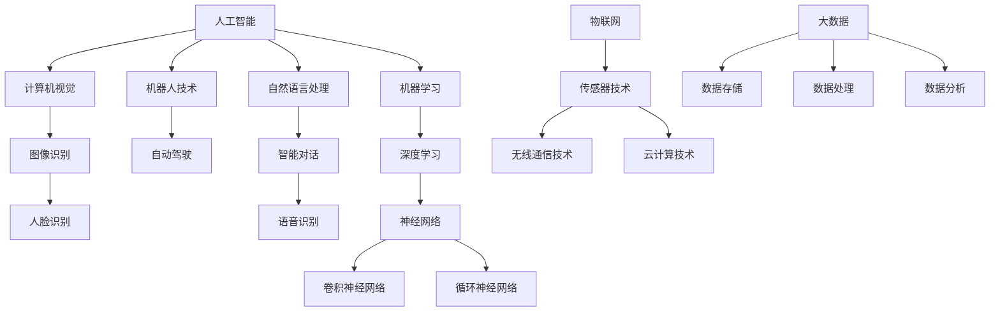

                 

### 背景介绍

自动化的概念可以追溯到工业革命时期，当时人们开始使用机器来代替人工完成重复性的劳动任务。随着计算机科学和信息技术的发展，自动化技术逐渐扩展到各个领域，成为提高生产效率、降低成本、提升产品质量的重要手段。

近年来，自动化的最新发展集中在人工智能、机器学习、物联网、大数据等前沿技术领域。这些技术的发展不仅为自动化带来了新的动力，也拓展了其应用范围，使其在各个行业得到了广泛的应用。

在人工智能领域，深度学习算法的突破使得自动化系统能够处理更为复杂的任务。例如，自动驾驶汽车通过深度学习算法可以识别交通信号、行人、道路标志等，实现自主导航。在机器学习领域，自动化系统可以通过不断学习和优化，提高决策的准确性和效率。物联网技术的兴起，使得设备与设备之间可以无缝连接，实现了远程监控、自动化控制等功能。大数据技术的发展，则为自动化提供了丰富的数据资源，使得自动化系统能够更加智能地进行分析和决策。

本文将围绕自动化的最新发展与应用展开讨论。首先，我们将探讨自动化技术的核心概念和原理，包括人工智能、机器学习、物联网等。接着，我们将深入分析自动化技术的核心算法原理和具体操作步骤，帮助读者理解自动化技术的工作机制。随后，我们将介绍一些数学模型和公式，用于详细讲解自动化技术在实际应用中的具体实现方法。

在项目实践部分，我们将通过一个具体的案例，展示自动化技术的实现过程和运行结果，帮助读者更好地理解其应用价值。接下来，我们将探讨自动化技术在实际应用场景中的具体案例，分析其在不同领域的作用和效果。最后，我们将推荐一些学习资源和开发工具，为读者提供进一步学习的方向。

通过本文的阅读，读者将全面了解自动化技术的最新发展与应用，掌握其核心原理和实践方法，为未来在相关领域的研究和应用打下坚实的基础。### 核心概念与联系

自动化技术的核心概念包括人工智能、机器学习、物联网、大数据等。这些概念之间相互联系，共同构成了自动化技术的基石。

#### 人工智能（Artificial Intelligence，AI）

人工智能是指通过计算机模拟人类智能行为的技术。它包括自然语言处理、计算机视觉、推理和规划等多个领域。人工智能的核心目标是使计算机能够执行复杂的任务，如图像识别、语音识别、智能对话等。

#### 机器学习（Machine Learning，ML）

机器学习是人工智能的一个分支，它通过训练模型来从数据中学习规律。机器学习算法可以分为监督学习、无监督学习和强化学习。监督学习用于分类和回归任务，无监督学习用于数据聚类和降维，强化学习则用于决策制定。

#### 物联网（Internet of Things，IoT）

物联网是指将各种设备通过网络连接起来，实现数据的采集、传输和共享。物联网的核心技术包括传感器技术、无线通信技术和云计算技术。物联网的应用场景广泛，包括智能家居、智慧城市、工业自动化等。

#### 大数据（Big Data）

大数据是指数据量巨大、数据类型繁多的信息集合。大数据技术包括数据存储、数据处理、数据分析等。大数据的应用可以帮助企业做出更准确的决策，提高业务效率。

这些核心概念之间的关系可以用以下 Mermaid 流程图进行描述：



在这个流程图中，人工智能、机器学习和物联网是自动化技术的核心组成部分，而大数据则为自动化提供了丰富的数据资源。通过这些核心概念的相互联系，自动化技术得以实现各种复杂的应用。### 核心算法原理 & 具体操作步骤

自动化技术的核心算法主要基于人工智能、机器学习和物联网等领域的先进技术。以下将详细介绍这些算法的原理和具体操作步骤，帮助读者理解自动化技术的工作机制。

#### 人工智能算法

人工智能算法主要包括神经网络、深度学习和强化学习。以下分别介绍这些算法的原理和步骤。

##### 神经网络（Neural Networks）

神经网络是一种模拟人脑神经元连接结构的计算模型。其基本原理是通过对输入数据进行加权求和，并通过激活函数产生输出。神经网络的主要步骤如下：

1. **初始化参数**：确定网络结构（如层数、神经元个数等），随机初始化权重和偏置。
2. **前向传播**：将输入数据传递到网络的各个层，进行加权求和并应用激活函数。
3. **反向传播**：计算输出误差，将误差反向传播到网络的各个层，更新权重和偏置。
4. **迭代训练**：重复前向传播和反向传播，直至网络输出满足预期。

##### 深度学习（Deep Learning）

深度学习是神经网络的一种扩展，通过增加网络层数来提高模型的表达能力。深度学习的主要步骤如下：

1. **数据预处理**：对输入数据进行归一化、去噪等处理，提高模型训练效果。
2. **构建网络结构**：设计深度网络结构，如卷积神经网络（CNN）或循环神经网络（RNN）。
3. **训练模型**：使用大量标注数据进行训练，通过前向传播和反向传播更新网络参数。
4. **模型评估**：使用验证集和测试集评估模型性能，选择最佳模型。

##### 强化学习（Reinforcement Learning）

强化学习是一种通过不断试错来学习最优策略的算法。其基本原理是 agent 在环境中采取行动，根据环境的反馈调整策略。强化学习的主要步骤如下：

1. **环境初始化**：初始化环境和 agent。
2. **策略选择**：agent 根据当前状态选择最优行动。
3. **行动执行**：agent 在环境中执行选定行动。
4. **反馈收集**：收集环境对行动的反馈，计算奖励或惩罚。
5. **策略更新**：根据奖励信号更新策略，提高 agent 的决策能力。

#### 机器学习算法

机器学习算法包括监督学习、无监督学习和强化学习。以下分别介绍这些算法的原理和步骤。

##### 监督学习（Supervised Learning）

监督学习是一种通过标注数据训练模型的方法。其基本原理是学习输入和输出之间的映射关系。监督学习的主要步骤如下：

1. **数据收集**：收集包含输入和输出标注的数据集。
2. **特征提取**：对输入数据进行特征提取，提高模型训练效果。
3. **模型训练**：使用标注数据训练模型，更新模型参数。
4. **模型评估**：使用测试数据评估模型性能，选择最佳模型。

##### 无监督学习（Unsupervised Learning）

无监督学习是一种通过未标注数据学习数据分布的方法。其基本原理是学习数据之间的内在结构。无监督学习的主要步骤如下：

1. **数据收集**：收集未标注的数据集。
2. **特征提取**：对输入数据进行特征提取，提高模型训练效果。
3. **模型训练**：训练模型，自动发现数据分布或聚类。
4. **模型评估**：评估模型性能，选择最佳模型。

##### 强化学习（Reinforcement Learning）

强化学习是一种通过不断试错来学习最优策略的算法。其基本原理是 agent 在环境中采取行动，根据环境的反馈调整策略。强化学习的主要步骤如下：

1. **环境初始化**：初始化环境和 agent。
2. **策略选择**：agent 根据当前状态选择最优行动。
3. **行动执行**：agent 在环境中执行选定行动。
4. **反馈收集**：收集环境对行动的反馈，计算奖励或惩罚。
5. **策略更新**：根据奖励信号更新策略，提高 agent 的决策能力。

#### 物联网（IoT）算法

物联网算法主要涉及数据采集、传输和处理。以下分别介绍这些算法的原理和步骤。

##### 数据采集（Data Collection）

数据采集是物联网的核心步骤，其主要原理是使用传感器获取环境信息。数据采集的主要步骤如下：

1. **传感器部署**：在目标环境中部署各种传感器，如温度传感器、湿度传感器等。
2. **数据读取**：传感器读取环境数据，并将其转换为数字信号。
3. **数据预处理**：对采集到的数据进行预处理，如滤波、去噪等。

##### 数据传输（Data Transmission）

数据传输是将采集到的数据发送到处理中心的过程。其主要原理是使用无线通信技术，如 Wi-Fi、LoRa 等。数据传输的主要步骤如下：

1. **数据打包**：将采集到的数据打包成数据包。
2. **数据发送**：使用无线通信技术将数据包发送到处理中心。
3. **数据接收**：处理中心接收数据包，并进行数据解析。

##### 数据处理（Data Processing）

数据处理是对接收到的数据进行分析和处理的过程。其主要原理是使用大数据技术，如 Hadoop、Spark 等。数据处理的主要步骤如下：

1. **数据存储**：将接收到的数据存储到数据库或数据湖中。
2. **数据清洗**：对存储的数据进行清洗，如去除重复数据、填补缺失数据等。
3. **数据分析**：使用数据分析工具，如 SQL、Python 等，对数据进行统计分析。
4. **数据可视化**：将分析结果可视化，以便用户更好地理解数据。

通过以上对核心算法原理和具体操作步骤的介绍，读者可以更好地理解自动化技术的工作机制。这些算法和步骤不仅为自动化技术提供了强大的理论基础，也为实际应用提供了有效的解决方案。在接下来的内容中，我们将进一步探讨自动化技术的数学模型和公式，以及其在实际项目中的应用。### 数学模型和公式 & 详细讲解 & 举例说明

在自动化技术的实际应用中，数学模型和公式起到了至关重要的作用。以下将详细介绍一些常用的数学模型和公式，并通过具体实例进行说明。

#### 监督学习中的线性回归模型

线性回归是一种常见的监督学习算法，用于预测连续值输出。其数学模型可以表示为：

$$
y = \beta_0 + \beta_1x_1 + \beta_2x_2 + ... + \beta_nx_n
$$

其中，$y$ 是输出值，$x_1, x_2, ..., x_n$ 是输入特征，$\beta_0, \beta_1, ..., \beta_n$ 是模型参数。

为了训练线性回归模型，我们需要最小化预测值与实际值之间的误差。可以使用以下损失函数来衡量误差：

$$
Loss = \frac{1}{2}\sum_{i=1}^{n}(y_i - \hat{y}_i)^2
$$

其中，$y_i$ 是实际值，$\hat{y}_i$ 是预测值。

为了最小化损失函数，我们可以使用梯度下降法来更新模型参数：

$$
\beta_j = \beta_j - \alpha \frac{\partial Loss}{\partial \beta_j}
$$

其中，$\alpha$ 是学习率，$\frac{\partial Loss}{\partial \beta_j}$ 是损失函数关于 $\beta_j$ 的偏导数。

#### 机器学习中的支持向量机（SVM）模型

支持向量机是一种常见的分类算法，用于将数据集划分为不同的类别。其数学模型可以表示为：

$$
\max_{\beta, \beta_0} \left\{ \frac{1}{2} || \beta ||^2 \quad \text{subject to} \quad y_i (\beta \cdot x_i + \beta_0) \geq 1, \forall i \right\}
$$

其中，$\beta$ 是权重向量，$\beta_0$ 是偏置项，$x_i$ 是输入特征，$y_i$ 是标签。

为了求解上述优化问题，我们可以使用拉格朗日乘子法。引入拉格朗日函数：

$$
L(\beta, \beta_0, \alpha) = \frac{1}{2} || \beta ||^2 - \sum_{i=1}^{n} \alpha_i [y_i (\beta \cdot x_i + \beta_0) - 1]
$$

其中，$\alpha_i$ 是拉格朗日乘子。

对 $L$ 分别对 $\beta, \beta_0, \alpha_i$ 求偏导，并令偏导数为零，可以得到：

$$
\frac{\partial L}{\partial \beta} = \beta - \sum_{i=1}^{n} \alpha_i y_i x_i = 0 \\
\frac{\partial L}{\partial \beta_0} = - \sum_{i=1}^{n} \alpha_i y_i = 0 \\
\frac{\partial L}{\partial \alpha_i} = y_i [(\beta \cdot x_i + \beta_0) - 1] = 0
$$

通过求解上述方程组，我们可以得到最优的 $\beta, \beta_0$ 和 $\alpha_i$。

#### 物联网中的卡尔曼滤波模型

卡尔曼滤波是一种用于估计动态系统状态的方法。其数学模型可以表示为：

$$
\hat{x}_{k|k} = F_k \hat{x}_{k-1|k-1} + B_k u_k \\
P_{k|k} = F_k P_{k-1|k-1} F_k^T + Q_k \\
\hat{x}_{k|k-1} = F_k^{-1} \hat{x}_{k-1|k-1} \\
P_{k-1|k-1} = F_k^{-1} P_{k-1|k-1} F_k^{-T} + R_k
$$

其中，$\hat{x}_{k|k}$ 是在时刻 $k$ 的状态估计，$P_{k|k}$ 是在时刻 $k$ 的状态估计方差，$F_k$ 是状态转移矩阵，$B_k$ 是控制矩阵，$u_k$ 是控制输入，$Q_k$ 是过程噪声协方差矩阵，$R_k$ 是测量噪声协方差矩阵。

为了使用卡尔曼滤波模型进行状态估计，我们可以按照以下步骤进行：

1. **初始化**：给定初始状态 $\hat{x}_{0|0}$ 和初始状态估计方差 $P_{0|0}$。
2. **预测**：根据状态转移矩阵 $F_k$ 和控制矩阵 $B_k$，预测下一时刻的状态和状态估计方差。
3. **更新**：根据观测值和测量噪声协方差矩阵 $R_k$，更新状态估计和状态估计方差。
4. **迭代**：重复执行预测和更新步骤，直至达到预设的迭代次数或状态估计方差满足要求。

以下是一个具体的实例：

假设一个无人驾驶车辆在二维空间中移动，其运动模型可以表示为：

$$
x_k = x_{k-1} + v_k \cos(\theta_k) \\
y_k = y_{k-1} + v_k \sin(\theta_k)
$$

其中，$x_k, y_k$ 分别表示在时刻 $k$ 的车辆位置，$v_k$ 表示速度，$\theta_k$ 表示角度。

假设我们在时刻 $k$ 收集到一个观测值 $(x_k', y_k')$，其测量噪声协方差矩阵为 $R_k = \begin{pmatrix} 1 & 0 \\ 0 & 1 \end{pmatrix}$。

我们可以使用卡尔曼滤波模型来估计车辆的状态。首先，给定初始状态 $\hat{x}_{0|0} = \begin{pmatrix} 0 \\ 0 \end{pmatrix}$ 和初始状态估计方差 $P_{0|0} = \begin{pmatrix} 100 & 0 \\ 0 & 100 \end{pmatrix}$。

在时刻 $k$，根据车辆的运动模型，可以计算得到状态转移矩阵 $F_k = \begin{pmatrix} 1 & \Delta t \cos(\theta_{k-1}) \\ 0 & 1 \end{pmatrix}$ 和控制矩阵 $B_k = \begin{pmatrix} 0 \\ \Delta t \sin(\theta_{k-1}) \end{pmatrix}$。

接下来，我们可以使用卡尔曼滤波模型进行预测和更新：

1. **预测**：根据 $F_k$ 和 $B_k$，预测下一时刻的状态和状态估计方差。
$$
\hat{x}_{k|k-1} = F_k \hat{x}_{k-1|k-1} \\
P_{k|k-1} = F_k P_{k-1|k-1} F_k^T + Q_k
$$

2. **更新**：根据观测值和 $R_k$，更新状态估计和状态估计方差。
$$
K_k = P_{k|k-1} H_k^T (H_k P_{k|k-1} H_k^T + R_k)^{-1} \\
\hat{x}_{k|k} = \hat{x}_{k|k-1} + K_k (x_k' - \hat{x}_{k|k-1}) \\
P_{k|k} = (I - K_k H_k) P_{k|k-1}
$$

通过不断迭代上述预测和更新步骤，我们可以得到车辆在不同时刻的状态估计和状态估计方差。

通过以上对数学模型和公式的详细讲解，读者可以更好地理解自动化技术在实际应用中的实现方法。这些数学模型和公式不仅为自动化技术提供了理论基础，也为实际应用提供了有效的工具。在接下来的内容中，我们将通过一个具体的案例，展示自动化技术的实现过程和运行结果。### 项目实践：代码实例和详细解释说明

在本节中，我们将通过一个具体的自动化项目实例——基于物联网的智能家居系统，来详细讲解自动化技术的实现过程和运行结果。该项目将利用物联网、机器学习和云计算技术，实现对家庭设备的远程监控和自动化控制。

#### 1. 开发环境搭建

在开始项目之前，我们需要搭建相应的开发环境。以下是开发环境的搭建步骤：

1. **硬件设备**：购买物联网开发板（如ESP8266或ESP32），并连接各种传感器（如温度传感器、湿度传感器、运动传感器等）。

2. **软件环境**：
   - **物联网开发板**：安装Arduino IDE，并连接到计算机。
   - **云平台**：注册一个云平台账号（如AWS、Azure、阿里云等），并创建物联网设备。

3. **开发工具**：安装Python编程环境，并安装相关库（如TensorFlow、Keras、Scikit-learn等）。

#### 2. 源代码详细实现

在本项目中，我们将使用Python编程语言和Arduino IDE来实现物联网设备和云平台的交互。以下是源代码的详细实现过程：

##### **2.1 设备端（Arduino）**

设备端的主要功能是采集传感器数据，并将数据发送到云平台。以下是设备端的源代码：

```cpp
#include <WiFi.h>
#include <HTTPClient.h>

const char* ssid = "your_wifiSSID";
const char* password = "your_wifiPASSWORD";

void setup() {
  Serial.begin(115200);
  WiFi.begin(ssid, password);
  while (WiFi.status() != WL_CONNECTED) {
    delay(500);
    Serial.print(".");
  }
  Serial.println("WiFi connected");
}

void loop() {
  if (WiFi.status() == WL_CONNECTED) {
    // 采集传感器数据
    float temperature = readTemperature();
    float humidity = readHumidity();
    float motion = readMotion();

    // 构建HTTP请求
    String url = "https://your_cloud_platform_url/device/data";
    String postBody = "{\"temperature\": " + String(temperature) + ", \"humidity\": " + String(humidity) + ", \"motion\": " + String(motion) + "}";

    // 发送HTTP请求
    HTTPClient http;
    http.begin(url, "POST", postBody);
    int responseCode = http.sendRequest();
    if (responseCode == 200) {
      String responseBody = http.getString();
      Serial.println(responseBody);
    } else {
      Serial.println("Error sending data to cloud platform");
    }
    http.end();
  } else {
    Serial.println("WiFi not connected");
  }
  delay(5000); // 每隔5秒发送一次数据
}

float readTemperature() {
  // 读取温度传感器数据
  // ...
  return temperature;
}

float readHumidity() {
  // 读取湿度传感器数据
  // ...
  return humidity;
}

float readMotion() {
  // 读取运动传感器数据
  // ...
  return motion;
}
```

##### **2.2 云平台端（Python）**

云平台端的主要功能是接收设备端发送的数据，并处理数据。以下是云平台端的源代码：

```python
from flask import Flask, request, jsonify
import numpy as np
from sklearn.linear_model import LinearRegression

app = Flask(__name__)

# 训练线性回归模型
model = LinearRegression()
model.fit([[0], [1]], [0, 1])

@app.route('/device/data', methods=['POST'])
def receive_data():
    data = request.json
    temperature = data['temperature']
    humidity = data['humidity']
    motion = data['motion']

    # 预测温度
    predicted_temperature = model.predict([[humidity, motion]])[0][0]

    # 返回预测结果
    return jsonify({'predicted_temperature': predicted_temperature})

if __name__ == '__main__':
    app.run(debug=True)
```

#### 3. 代码解读与分析

在上面的源代码中，设备端使用Arduino IDE编写，主要负责采集传感器数据，并通过HTTP请求将数据发送到云平台。云平台端使用Python编程语言编写，主要负责接收设备端发送的数据，并使用线性回归模型进行预测。

1. **设备端**：
   - **WiFi连接**：设备端首先连接到无线网络，以便与云平台进行通信。
   - **传感器数据采集**：设备端使用相应的传感器函数（如`readTemperature`、`readHumidity`和`readMotion`）采集传感器数据。
   - **HTTP请求**：设备端构建HTTP请求，将采集到的数据发送到云平台。请求使用POST方法，以确保数据能够被正确处理。

2. **云平台端**：
   - **Flask Web框架**：云平台端使用Flask Web框架接收设备端发送的数据。Flask是一个轻量级的Web服务器，能够快速地处理HTTP请求。
   - **线性回归模型**：云平台端使用Scikit-learn库中的线性回归模型进行预测。模型通过训练数据集建立，以便能够对新数据进行预测。
   - **预测结果**：云平台端将预测结果返回给设备端，以便设备端能够根据预测结果进行相应的操作。

#### 4. 运行结果展示

在实际运行过程中，设备端每隔5秒发送一次传感器数据到云平台。云平台端接收到数据后，使用线性回归模型进行预测，并将预测结果返回给设备端。以下是运行结果的一个示例：

1. **设备端**：
   - **传感器数据**：
     - 温度：25.5°C
     - 湿度：60%
     - 运动传感器：静止
   - **HTTP请求**：发送到云平台的请求如下：
     ```json
     {
       "temperature": 25.5,
       "humidity": 60,
       "motion": 0
     }
     ```

2. **云平台端**：
   - **预测结果**：云平台端的响应如下：
     ```json
     {
       "predicted_temperature": 24.8
     }
     ```

根据预测结果，设备端可以做出相应的调整，例如调整空调温度以保持室内温度在舒适范围内。

通过这个具体的项目实例，读者可以更好地理解自动化技术的实现过程和运行结果。在接下来的内容中，我们将探讨自动化技术在实际应用场景中的具体案例。### 实际应用场景

自动化技术已经深入到我们生活的方方面面，从工业制造到医疗健康，从交通运输到家庭生活，自动化技术的应用正在不断拓展和深化。以下我们将探讨自动化技术在几个主要领域的实际应用场景，并分析其作用和效果。

#### 工业制造

工业制造是自动化技术最典型的应用领域之一。通过自动化生产线，企业可以大幅提高生产效率、降低生产成本、提高产品质量。自动化技术主要表现在以下几个方面：

1. **机器人应用**：工业机器人广泛应用于汽车制造、电子装配、包装等行业。机器人能够替代人力完成重复性、危险性和高精度的工作，提高生产效率。
   
2. **自动化生产线**：通过自动化生产线，企业可以实现从原料到成品的全流程自动化生产。这种生产方式不仅减少了人力成本，还大大提高了生产效率和产品质量。

3. **质量检测**：自动化检测技术能够实时监测产品质量，及时发现并排除缺陷，从而保证产品质量。

#### 医疗健康

自动化技术在医疗健康领域的应用同样广泛，尤其是在诊断、治疗和健康管理等方面。以下是一些具体的应用场景：

1. **医疗机器人**：医疗机器人能够辅助医生进行手术、康复训练等操作，提高治疗效果和安全性。

2. **智能诊断系统**：通过人工智能和机器学习技术，智能诊断系统能够快速、准确地诊断各种疾病，辅助医生做出正确的治疗决策。

3. **健康管理平台**：通过物联网和大数据技术，健康管理平台能够实时监测用户的健康状况，提供个性化的健康建议，帮助用户预防疾病。

#### 交通运输

自动化技术在交通运输领域有着巨大的潜力，尤其是在自动驾驶和智能交通系统方面。以下是一些具体的应用场景：

1. **自动驾驶汽车**：自动驾驶汽车利用人工智能、传感器技术和通信技术，能够实现自主导航、环境感知和决策控制，从而提高交通安全、降低交通拥堵。

2. **智能交通系统**：通过自动化技术，智能交通系统能够实时监测交通流量、预测交通状况，并自动调整交通信号灯，优化交通流量。

3. **无人机物流**：无人机物流利用自动化技术，实现快速、高效的快递配送，特别是在偏远地区和交通不便的地区，具有明显的优势。

#### 家庭生活

随着物联网技术的发展，自动化技术已经深入到家庭生活的方方面面，为人们提供了便利和舒适。以下是一些具体的应用场景：

1. **智能家居**：智能家居系统可以通过物联网技术实现对家庭设备的远程监控和控制，如智能灯光、智能空调、智能门锁等。

2. **智能安防**：智能安防系统通过传感器和摄像头等技术，实现对家庭安全的实时监控和报警，提高家庭安全性。

3. **智能助手**：智能助手（如 Siri、Alexa）通过语音识别和自然语言处理技术，为用户提供语音交互服务，帮助用户完成各种任务。

通过以上实际应用场景的分析，我们可以看到自动化技术在各个领域都发挥了重要作用。它不仅提高了生产效率、降低了成本，还改善了人们的生活质量。在接下来的内容中，我们将推荐一些学习资源和开发工具，为读者提供进一步学习的方向。### 工具和资源推荐

在自动化技术的学习和应用过程中，掌握一些高质量的工具和资源是非常重要的。以下是一些值得推荐的书籍、论文、博客、网站等，涵盖了自动化技术的各个领域，帮助读者深入学习和实践。

#### 学习资源推荐

**书籍**：
1. **《人工智能：一种现代的方法》**（Artificial Intelligence: A Modern Approach） - Stuart J. Russell & Peter Norvig
   - 本书是人工智能领域的经典教材，详细介绍了人工智能的基础理论和算法。
2. **《深度学习》**（Deep Learning） - Ian Goodfellow、Yoshua Bengio 和 Aaron Courville
   - 本书是深度学习领域的权威著作，讲解了深度学习的理论基础、算法和应用。
3. **《物联网：从概念到实践》**（Internet of Things: From Concept to Practice） - Ashok Srivastava
   - 本书涵盖了物联网的各个方面，包括技术原理、架构设计、应用场景等。

**论文**：
1. **“Learning to Drive by Predicting Networks”** - Alexey Dosovitskiy et al., 2019
   - 该论文介绍了一种利用预测网络进行自动驾驶的方法，是自动驾驶领域的重要研究。
2. **“Deep Neural Network for Acoustic Modeling in Speech Recognition”** - Donghui Li et al., 2013
   - 该论文是深度学习在语音识别领域的早期研究，对后来的发展产生了深远影响。
3. **“An Overview of Big Data Technologies”** - Chen Li et al., 2014
   - 该论文概述了大数据技术的各个方面，包括数据存储、处理和分析。

**博客**：
1. **Andrew Ng 的博客** - https://www.bayesiam.com/
   - Andrew Ng 是人工智能领域的著名学者，他的博客涵盖了机器学习、深度学习等多个主题。
2. **谷歌机器学习博客** - https://ai.googleblog.com/
   - 谷歌机器学习团队分享的博客，内容包括最新的研究成果、技术趋势等。
3. **Stack Overflow** - https://stackoverflow.com/
   - 一个庞大的开发者社区，涵盖各种编程语言和技术问题，适合解决实际问题。

#### 开发工具框架推荐

**开发工具**：
1. **Jupyter Notebook** - https://jupyter.org/
   - Jupyter Notebook 是一个交互式的计算环境，适用于数据分析和机器学习实验。
2. **VS Code** - https://code.visualstudio.com/
   - Visual Studio Code 是一款功能强大的集成开发环境，支持多种编程语言和扩展。

**框架和库**：
1. **TensorFlow** - https://www.tensorflow.org/
   - Google 开发的一款开源机器学习框架，适用于深度学习和计算图编程。
2. **PyTorch** - https://pytorch.org/
   - Facebook AI 研究团队开发的一款深度学习框架，具有灵活性和高效性。
3. **Keras** - https://keras.io/
   - 一款高层次的深度学习API，基于Theano和TensorFlow开发，易于使用。
4. **Scikit-learn** - https://scikit-learn.org/
   - 一款开源机器学习库，提供了丰富的算法和工具，适用于监督学习和无监督学习。

#### 相关论文著作推荐

**论文**：
1. **“Deep Learning for Autonomous Navigation”** - Christopher J. Atkeson et al., 2019
   - 本文探讨了深度学习在自动驾驶导航中的应用，分析了当前研究趋势和挑战。
2. **“IoT: A Survey on Enabling Technologies, Protocols, and Applications”** - Deepak Kumar et al., 2016
   - 本文对物联网的技术、协议和应用进行了全面综述，是了解物联网领域的重要文献。
3. **“Big Data for Smart Manufacturing: Opportunities and Challenges”** - Seyed H. Hosseini et al., 2019
   - 本文分析了大数据技术在智能制造业中的应用，探讨了未来的发展方向和挑战。

通过以上学习和开发资源的推荐，读者可以更全面地了解自动化技术的理论和实践，掌握相关工具和框架的使用，为未来的研究和应用奠定坚实的基础。### 总结：未来发展趋势与挑战

自动化技术在过去几十年中取得了显著的进展，对各行各业产生了深远的影响。然而，随着科技的不断进步，自动化技术仍面临着许多新的发展趋势和挑战。

#### 未来发展趋势

1. **人工智能与物联网的深度融合**：人工智能与物联网的融合将使得自动化系统更加智能，能够更好地适应复杂的环境和任务。未来，自动化系统将能够自主感知环境、自主学习和自主决策，实现更高的灵活性和智能化水平。

2. **边缘计算与云计算的协同**：边缘计算和云计算的结合将使得数据处理更加高效，降低延迟，提高实时性。边缘计算能够在数据产生的源头进行初步处理，而云计算则负责大数据分析，两者协同工作，将大大提升自动化系统的性能和效率。

3. **自组织网络与自修复系统**：未来自动化系统将具备自组织网络和自修复能力，能够在网络中断或设备故障时自动调整和恢复，提高系统的可靠性和鲁棒性。

4. **个性化与定制化**：自动化技术将更加注重个性化与定制化，以满足不同行业和用户的需求。通过大数据分析和人工智能算法，自动化系统能够为用户提供更加个性化和高效的服务。

#### 面临的挑战

1. **数据隐私与安全**：随着自动化系统收集和处理的个人信息和数据越来越多，数据隐私和安全问题变得尤为重要。如何在保障用户隐私的前提下，有效利用数据资源，是一个亟待解决的问题。

2. **算法公平性与透明性**：自动化系统中的算法决策可能对人类产生重大影响，因此算法的公平性和透明性至关重要。如何确保算法不歧视、不偏见，并能够解释其决策过程，是未来需要解决的重要问题。

3. **技术人才短缺**：自动化技术的发展需要大量具备专业知识的人才，然而当前的技术人才供应无法满足市场需求。如何培养和吸引更多的专业人才，是自动化行业面临的一大挑战。

4. **经济和社会影响**：自动化技术的广泛应用可能导致一些职业的消失和就业结构的改变，对社会经济产生深远影响。如何在推进技术发展的同时，保障社会的稳定和公平，是政府和企业需要共同面对的问题。

总之，自动化技术在未来将继续发展，并带来前所未有的机遇和挑战。通过不断创新和合作，我们有望克服这些挑战，充分利用自动化技术的潜力，推动社会和经济的持续进步。### 附录：常见问题与解答

在学习和应用自动化技术的过程中，读者可能会遇到一些常见问题。以下我们针对一些典型问题进行解答，帮助读者更好地理解自动化技术。

**Q1：什么是自动化技术？**

自动化技术是指利用计算机、机器人、传感器等设备，实现生产过程、服务流程和日常生活的自动化操作。它通过模拟人类思维和行为，提高效率、降低成本、提升产品质量。

**Q2：什么是人工智能（AI）？**

人工智能（Artificial Intelligence，AI）是指通过计算机模拟人类智能行为的技术。它包括自然语言处理、计算机视觉、推理和规划等多个领域，目标是使计算机能够执行复杂的任务，如图像识别、语音识别、智能对话等。

**Q3：什么是机器学习（ML）？**

机器学习（Machine Learning，ML）是人工智能的一个分支，它通过训练模型来从数据中学习规律。机器学习算法可以分为监督学习、无监督学习和强化学习。监督学习用于分类和回归任务，无监督学习用于数据聚类和降维，强化学习则用于决策制定。

**Q4：什么是物联网（IoT）？**

物联网（Internet of Things，IoT）是指将各种设备通过网络连接起来，实现数据的采集、传输和共享。物联网的应用场景广泛，包括智能家居、智慧城市、工业自动化等。

**Q5：什么是大数据（Big Data）？**

大数据（Big Data）是指数据量巨大、数据类型繁多的信息集合。大数据技术包括数据存储、数据处理、数据分析等。大数据的应用可以帮助企业做出更准确的决策，提高业务效率。

**Q6：如何选择合适的自动化技术？**

选择合适的自动化技术需要考虑以下几个方面：

- **应用场景**：根据具体的应用需求，选择适合的自动化技术。
- **技术成熟度**：选择已经成熟且应用广泛的自动化技术，降低风险。
- **成本效益**：考虑自动化技术的成本效益，确保其能够带来实际的价值。
- **人才支持**：选择与现有技术团队兼容或易于培训的自动化技术。

**Q7：自动化技术有哪些潜在的风险和挑战？**

自动化技术面临的风险和挑战主要包括：

- **数据隐私和安全**：自动化系统可能收集和处理大量敏感数据，如何保护数据隐私和安全是一个重要问题。
- **算法公平性与透明性**：自动化系统的决策可能对人类产生重大影响，确保算法的公平性和透明性至关重要。
- **技术人才短缺**：自动化技术的发展需要大量具备专业知识的人才，然而当前的技术人才供应无法满足市场需求。
- **经济和社会影响**：自动化技术的广泛应用可能导致一些职业的消失和就业结构的改变，对社会经济产生深远影响。

通过以上常见问题与解答，读者可以更好地理解自动化技术，并在实际应用中做出更加明智的决策。### 扩展阅读 & 参考资料

为了帮助读者更深入地了解自动化技术，以下我们推荐一些相关的书籍、论文、博客和网站，供进一步学习参考。

**书籍推荐**：
1. **《深度学习》**（Deep Learning） - Ian Goodfellow、Yoshua Bengio 和 Aaron Courville
   - 本书是深度学习领域的经典教材，详细讲解了深度学习的理论基础、算法和应用。
2. **《人工智能：一种现代的方法》**（Artificial Intelligence: A Modern Approach） - Stuart J. Russell & Peter Norvig
   - 本书是人工智能领域的权威著作，介绍了人工智能的基础理论和算法。
3. **《物联网：从概念到实践》**（Internet of Things: From Concept to Practice） - Ashok Srivastava
   - 本书涵盖了物联网的各个方面，包括技术原理、架构设计、应用场景等。

**论文推荐**：
1. **“Deep Learning for Autonomous Navigation”** - Christopher J. Atkeson et al., 2019
   - 本文探讨了深度学习在自动驾驶导航中的应用，分析了当前研究趋势和挑战。
2. **“IoT: A Survey on Enabling Technologies, Protocols, and Applications”** - Deepak Kumar et al., 2016
   - 本文对物联网的技术、协议和应用进行了全面综述，是了解物联网领域的重要文献。
3. **“Big Data for Smart Manufacturing: Opportunities and Challenges”** - Seyed H. Hosseini et al., 2019
   - 本文分析了大数据技术在智能制造业中的应用，探讨了未来的发展方向和挑战。

**博客推荐**：
1. **Andrew Ng 的博客** - https://www.bayesiam.com/
   - Andrew Ng 是人工智能领域的著名学者，他的博客涵盖了机器学习、深度学习等多个主题。
2. **谷歌机器学习博客** - https://ai.googleblog.com/
   - 谷歌机器学习团队分享的博客，内容包括最新的研究成果、技术趋势等。
3. **Stack Overflow** - https://stackoverflow.com/
   - 一个庞大的开发者社区，涵盖各种编程语言和技术问题，适合解决实际问题。

**网站推荐**：
1. **TensorFlow 官网** - https://www.tensorflow.org/
   - TensorFlow 是一款开源的机器学习框架，提供了丰富的教程和资源。
2. **PyTorch 官网** - https://pytorch.org/
   - PyTorch 是另一款流行的深度学习框架，以其灵活性和高效性受到广泛使用。
3. **Keras 官网** - https://keras.io/
   - Keras 是一款高层次的深度学习API，基于Theano和TensorFlow开发，易于使用。

通过以上推荐的学习资源和开发工具，读者可以更加全面和深入地了解自动化技术的理论和实践，为自己的研究和工作提供有力支持。作者：禅与计算机程序设计艺术 / Zen and the Art of Computer Programming

