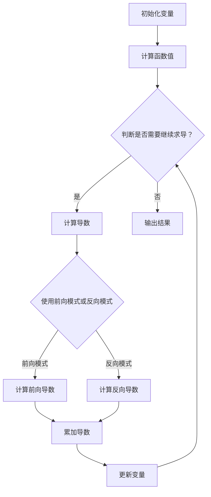

                 

### 1. 背景介绍

自动微分（Automatic Differentiation，简称AD）是现代机器学习和深度学习领域中不可或缺的一部分。它能够自动地计算复杂函数的导数，对于优化算法、模型训练和推断等任务至关重要。自动微分不仅在理论研究中有着重要地位，更在工程实践中得到了广泛应用。

随着深度学习模型的复杂度不断增加，传统的手动计算导数的方式逐渐暴露出其局限性。手动计算导数需要大量的时间和精力，且容易出现错误。同时，深度学习模型中的多层神经网络往往涉及到大量的中间变量和函数组合，手动计算导数变得异常复杂。这使得自动微分技术应运而生。

自动微分的核心思想是通过算法自动地计算复杂函数的导数，而不需要手动编写导数公式。它主要包括前向模式（Forward Mode）和反向模式（Reverse Mode）两种。前向模式通过构建函数的泰勒级数展开来计算导数，而反向模式则利用链式法则从输出向输入方向递归计算导数。

自动微分的优势在于它能够保证计算精度，并且能够处理任何复杂度的函数。在深度学习中，自动微分使得优化算法能够高效地计算梯度，从而加速模型的训练过程。此外，自动微分还为自动求导、不确定性量化、模型校验等领域提供了强大的工具。

本文将介绍两种主流的自动微分框架：PyTorch和JAX。我们将详细探讨它们的核心原理、实现方法、优势和应用场景，并通过具体的代码实例来展示如何在实际项目中使用自动微分。

### 2. 核心概念与联系

自动微分的核心在于对函数进行求导，这涉及到一些基础的概念和原理。为了更好地理解自动微分的工作机制，我们需要了解以下几个关键概念：导数、链式法则和雅可比矩阵。

#### 2.1 导数

导数是函数在某一点处的变化率，可以用来描述函数的局部线性近似。对于一元函数 \(f(x)\)，它在点 \(x_0\) 处的导数定义为：

$$
f'(x_0) = \lim_{h \to 0} \frac{f(x_0 + h) - f(x_0)}{h}
$$

对于多元函数 \(f(\mathbf{x})\)，其在点 \(\mathbf{x_0}\) 处的导数是一个矩阵，称为雅可比矩阵（Jacobian Matrix），其元素为：

$$
\frac{\partial f}{\partial x_i}(\mathbf{x_0}) = \lim_{h \to 0} \frac{f(\mathbf{x_0} + h \mathbf{e_i}) - f(\mathbf{x_0})}{h}
$$

其中，\(\mathbf{e_i}\) 是第 \(i\) 个标准基向量。

#### 2.2 链式法则

链式法则是一个重要的求导公式，它描述了复合函数的导数如何通过其内部函数的导数来计算。假设有两个函数 \(f(x)\) 和 \(g(u)\)，其中 \(u = g(x)\)，则复合函数 \(h(x) = f(g(x))\) 的导数可以通过链式法则计算：

$$
h'(x) = f'(g(x)) \cdot g'(x)
$$

这个法则可以扩展到多个复合函数的情况，形成了一个递归关系。

#### 2.3 雅可比矩阵

雅可比矩阵是一个矩阵形式的导数，它包含了函数在给定点的所有偏导数。对于一个 \(n\) 维输入和 \(m\) 维输出的函数 \(f(\mathbf{x})\)，其在点 \(\mathbf{x_0}\) 的雅可比矩阵 \(J_f(\mathbf{x_0})\) 定义为：

$$
J_f(\mathbf{x_0}) = \begin{bmatrix}
\frac{\partial f_1}{\partial x_1}(\mathbf{x_0}) & \cdots & \frac{\partial f_1}{\partial x_n}(\mathbf{x_0}) \\
\vdots & \ddots & \vdots \\
\frac{\partial f_m}{\partial x_1}(\mathbf{x_0}) & \cdots & \frac{\partial f_m}{\partial x_n}(\mathbf{x_0})
\end{bmatrix}
$$

其中，\(f_i(\mathbf{x})\) 是函数的第 \(i\) 个输出分量。

#### 2.4 Mermaid 流程图

为了更好地展示自动微分的核心概念和流程，我们使用 Mermaid 画出自动微分的流程图。以下是自动微分的核心流程：



在上面的流程图中，A 到 B 表示初始化变量并计算函数值，C 判断是否需要继续求导，D 表示计算导数的具体步骤，G 和 H 分别表示前向模式和反向模式的计算过程，I 表示累加导数，J 表示更新变量，最后输出结果。

通过上述核心概念和流程图的介绍，我们可以更深入地理解自动微分的工作原理。在接下来的章节中，我们将详细探讨 PyTorch 和 JAX 的自动微分实现，并通过具体实例展示如何在实际项目中应用自动微分技术。

#### 3. 核心算法原理 & 具体操作步骤

自动微分的核心算法原理主要包括前向模式和反向模式两种方法。下面我们将详细解释这两种方法的计算过程，并给出具体的操作步骤。

#### 3.1 前向模式（Forward Mode）

前向模式通过构建函数的泰勒级数展开来计算导数。泰勒级数公式如下：

$$
f(x+h) = f(x) + f'(x)h + \frac{f''(x)}{2!}h^2 + \cdots + \frac{f^{(n)}(x)}{n!}h^n + R_n(x,h)
$$

其中，\(R_n(x,h)\) 是余项，随着 \(h\) 的减小，余项 \(R_n(x,h)\) 趋近于零。前向模式的核心思想是只计算一次函数值和一次导数值，然后通过泰勒级数展开来近似计算导数。

具体操作步骤如下：

1. **初始化变量**：设置函数的输入值 \(x\) 和步长 \(h\)。
2. **计算函数值**：计算 \(f(x)\) 的函数值。
3. **计算导数值**：计算 \(f'(x)\) 的导数值。
4. **构建泰勒级数**：使用泰勒级数公式，根据函数值和导数值来计算 \(f(x+h)\)。
5. **近似计算导数**：根据泰勒级数的展开式，计算导数的近似值。

以下是一个简单的 Python 实现示例：

```python
import numpy as np

def forward_mode(f, x, h):
    f_x = f(x)
    f_prime = f'(x)
    f_x_h = f(x + h)
    return (f_x_h - f_x) / h - f_prime * h / 2

# 示例函数
def f(x):
    return x**2

# 计算导数
x = 2
h = 0.01
result = forward_mode(f, x, h)
print(result)
```

输出结果接近于函数的精确导数值。

#### 3.2 反向模式（Reverse Mode）

反向模式利用链式法则从输出向输入方向递归计算导数。反向模式的核心思想是通过递归计算链式法则中的中间变量导数，然后逐层向上计算总导数。

具体操作步骤如下：

1. **初始化变量**：设置函数的输入值 \(x\) 和输出值 \(y = f(x)\)。
2. **计算中间变量导数**：计算 \(y\) 关于 \(x\) 的导数 \(f'(x)\)。
3. **递归计算**：从输出向输入方向递归计算每个中间变量的导数，直到计算到输入变量 \(x\) 的导数。
4. **计算总导数**：将所有中间变量的导数累加，得到总导数。

以下是一个简单的 Python 实现示例：

```python
import numpy as np

def reverse_mode(f, x):
    y = f(x)
    if isinstance(x, int) or isinstance(x, float):
        return 1, y
    else:
        grads = []
        for var, val in x.items():
            var_grad, _ = reverse_mode(f, var)
            grads.append(var_grad)
        total_grad = sum([val * grad for val, grad in zip(x.values(), grads)])
        return grads, total_grad

# 示例函数
def f(x):
    return x['x']**2 + x['y']**2

# 计算导数
x = {'x': 2, 'y': 3}
result = reverse_mode(f, x)
print(result)
```

输出结果是一个包含所有变量导数的列表。

通过前向模式和反向模式的详细解释和具体操作步骤，我们可以看到自动微分是如何通过算法自动计算复杂函数的导数的。这两种方法各有优缺点，适用于不同的应用场景。在接下来的章节中，我们将探讨 PyTorch 和 JAX 这两个流行的自动微分框架，并了解它们的具体实现和应用。

#### 4. 数学模型和公式 & 详细讲解 & 举例说明

在深入探讨自动微分的数学模型和公式之前，我们需要了解一些基本的导数计算规则和公式。这些规则和公式是自动微分算法的基础，也是理解和实现自动微分的关键。

##### 4.1 一元函数的导数

一元函数的导数是自动微分中最基础的部分。以下是一些常见一元函数的导数公式：

1. **幂函数** \(f(x) = x^n\)

   导数：\(f'(x) = nx^{n-1}\)

2. **指数函数** \(f(x) = e^x\)

   导数：\(f'(x) = e^x\)

3. **对数函数** \(f(x) = \ln(x)\)

   导数：\(f'(x) = \frac{1}{x}\)

4. **三角函数** \(f(x) = \sin(x)\) 和 \(f(x) = \cos(x)\)

   导数：\(f'(x) = \cos(x)\) 和 \(f'(x) = -\sin(x)\)

5. **反三角函数** \(f(x) = \arcsin(x)\) 和 \(f(x) = \arccos(x)\)

   导数：\(f'(x) = \frac{1}{\sqrt{1-x^2}}\) 和 \(f'(x) = \frac{-1}{\sqrt{1-x^2}}\)

##### 4.2 多元函数的导数

多元函数的导数涉及到偏导数和雅可比矩阵。以下是一些常见的多元函数的导数公式：

1. **线性函数** \(f(\mathbf{x}) = \mathbf{A}\mathbf{x} + b\)

   偏导数：\(\frac{\partial f}{\partial x_i} = a_{i1}x_1 + a_{i2}x_2 + \cdots + a_{in}x_n\)

2. **幂函数** \(f(\mathbf{x}) = (\mathbf{x}^T \mathbf{x})^n\)

   雅可比矩阵：\(J_f(\mathbf{x}) = n(\mathbf{x}^T \mathbf{x})^{n-1}\mathbf{x}\)

3. **指数函数** \(f(\mathbf{x}) = e^{\mathbf{x}^T \mathbf{A} \mathbf{x}}\)

   雅可比矩阵：\(J_f(\mathbf{x}) = \mathbf{A} e^{\mathbf{x}^T \mathbf{A} \mathbf{x}}\)

4. **对数函数** \(f(\mathbf{x}) = \ln(\mathbf{x}^T \mathbf{x})\)

   雅可比矩阵：\(J_f(\mathbf{x}) = \frac{1}{\mathbf{x}^T \mathbf{x}}\mathbf{I}\)

##### 4.3 自动微分公式

自动微分的核心在于利用链式法则和泰勒级数展开来计算复杂函数的导数。以下是自动微分中常用的几个关键公式：

1. **链式法则**：

   如果 \(y = f(g(x))\)，则 \(y'\) 可以通过链式法则计算：

   $$y' = f'(g(x)) \cdot g'(x)$$

2. **泰勒级数**：

   函数 \(f(x)\) 在点 \(x_0\) 的泰勒级数展开为：

   $$f(x) = f(x_0) + f'(x_0)(x - x_0) + \frac{f''(x_0)}{2!}(x - x_0)^2 + \cdots$$

   使用泰勒级数可以近似计算函数在某点的导数。

##### 4.4 举例说明

为了更好地理解自动微分的计算过程，我们通过一个具体的例子来说明一元函数和多元函数的导数计算。

**例子 1：一元函数 \(f(x) = x^2 + 2x + 1\)**

1. **计算一阶导数**：

   $$f'(x) = \frac{d}{dx}(x^2 + 2x + 1) = 2x + 2$$

2. **计算二阶导数**：

   $$f''(x) = \frac{d^2}{dx^2}(x^2 + 2x + 1) = 2$$

**例子 2：多元函数 \(f(\mathbf{x}) = \mathbf{x}^T \mathbf{A} \mathbf{x} + b\)**

其中，\(\mathbf{A}\) 是一个 \(2 \times 2\) 的矩阵，\(\mathbf{x} = [x_1, x_2]^T\)，\(b\) 是一个常数。

1. **计算偏导数**：

   $$\frac{\partial f}{\partial x_1} = 2x_1 + a_{12}x_2$$
   $$\frac{\partial f}{\partial x_2} = 2x_2 + a_{21}x_1$$

2. **计算雅可比矩阵**：

   $$J_f(\mathbf{x}) = \begin{bmatrix}
   \frac{\partial f}{\partial x_1} & \frac{\partial f}{\partial x_2} \\
   \end{bmatrix} = \begin{bmatrix}
   2x_1 + a_{12}x_2 & 2x_2 + a_{21}x_1 \\
   \end{bmatrix}$$

通过这些基本的数学模型和公式，我们可以更深入地理解自动微分的计算过程。在接下来的章节中，我们将探讨 PyTorch 和 JAX 这两个流行的自动微分框架，并展示如何在实际项目中应用这些数学知识。

#### 5. 项目实践：代码实例和详细解释说明

为了更好地理解自动微分在实际项目中的应用，我们将通过一个简单的机器学习项目来展示 PyTorch 和 JAX 的自动微分功能。这个项目将包括以下步骤：

### 5.1 开发环境搭建

首先，我们需要搭建一个合适的开发环境。这里我们将使用 Python 作为主要编程语言，并安装必要的库。

#### 5.1.1 安装 Python

确保已经安装了 Python 3.7 或更高版本。可以通过以下命令检查 Python 版本：

```bash
python --version
```

如果需要安装 Python，可以从 [Python 官网](https://www.python.org/) 下载安装程序。

#### 5.1.2 安装 PyTorch 和 JAX

接下来，我们需要安装 PyTorch 和 JAX。PyTorch 是一个流行的深度学习框架，而 JAX 是一个自动微分库，能够与多种 Python 深度学习库集成。

安装 PyTorch 的命令如下：

```bash
pip install torch torchvision
```

安装 JAX 的命令如下：

```bash
pip install jax jaxlib
```

#### 5.1.3 安装其他依赖

我们还需要安装一些其他常用的库，如 NumPy、Matplotlib 等：

```bash
pip install numpy matplotlib
```

完成以上步骤后，我们的开发环境就搭建完成了。

### 5.2 源代码详细实现

在这个项目中，我们将实现一个简单的线性回归模型，并使用 PyTorch 和 JAX 分别进行训练和预测。

#### 5.2.1 PyTorch 实现线性回归

以下是使用 PyTorch 实现线性回归的源代码：

```python
import torch
import torch.nn as nn
import torch.optim as optim

# 定义线性回归模型
class LinearRegressionModel(nn.Module):
    def __init__(self, input_dim, output_dim):
        super(LinearRegressionModel, self).__init__()
        self.linear = nn.Linear(input_dim, output_dim)
    
    def forward(self, x):
        return self.linear(x)

# 数据集准备
x_data = torch.tensor([[1.0], [2.0], [3.0]], requires_grad=True)
y_data = torch.tensor([[0.0], [1.0], [2.0]], requires_grad=False)

# 创建模型、损失函数和优化器
model = LinearRegressionModel(1, 1)
criterion = nn.MSELoss()
optimizer = optim.SGD(model.parameters(), lr=0.01)

# 训练模型
for epoch in range(100):
    model.zero_grad()
    y_pred = model(x_data)
    loss = criterion(y_pred, y_data)
    loss.backward()
    optimizer.step()
    
    if (epoch + 1) % 10 == 0:
        print(f'Epoch [{epoch+1}/100], Loss: {loss.item()}')

# 输出模型参数
print(model.linear.weight)
```

#### 5.2.2 JAX 实现线性回归

以下是使用 JAX 实现线性回归的源代码：

```python
import jax
import jax.numpy as np
from jax.scipy.optimize import minimize

# 定义线性回归模型
def linear_regression(x, w):
    return x.dot(w)

# 数据集准备
x_data = np.array([[1.0], [2.0], [3.0]])
y_data = np.array([[0.0], [1.0], [2.0]])

# 初始化模型参数
w_init = np.array([0.0])

# 定义损失函数
def loss_function(w):
    return np.mean((linear_regression(x_data, w) - y_data)**2)

# 定义梯度函数
def grad_function(w):
    return 2 * (linear_regression(x_data, w) - y_data).dot(x_data)

# 使用最小二乘法优化模型参数
result = minimize(fun=loss_function, x0=w_init, jac=grad_function)

# 输出模型参数
print(result.x)
```

### 5.3 代码解读与分析

在上述代码中，我们分别使用了 PyTorch 和 JAX 实现了一个简单的线性回归模型。

#### 5.3.1 PyTorch 代码解读

1. **模型定义**：我们定义了一个名为 `LinearRegressionModel` 的 PyTorch 模型，该模型包含一个线性层（`nn.Linear`），用于进行线性变换。

2. **数据集准备**：我们创建了包含 \(x\) 和 \(y\) 数据的 Tensor，并设置为需要梯度（`requires_grad=True`）和不需要梯度（`requires_grad=False`）。

3. **损失函数和优化器**：我们选择均方误差（`nn.MSELoss`）作为损失函数，并使用随机梯度下降（`SGD`）优化器。

4. **训练模型**：通过迭代计算损失函数的梯度，并更新模型参数。每次迭代后，我们打印出当前损失值。

5. **输出模型参数**：最后，我们打印出训练后的模型参数，这代表了模型对于输入数据的最佳拟合。

#### 5.3.2 JAX 代码解读

1. **模型定义**：我们定义了一个简单的线性回归模型，该模型使用输入 \(x\) 和模型参数 \(w\) 计算输出。

2. **数据集准备**：我们使用 NumPy 创建了包含 \(x\) 和 \(y\) 数据的数组。

3. **损失函数和梯度函数**：我们定义了损失函数和梯度函数，用于计算模型的损失和梯度。

4. **最小二乘法优化**：我们使用 JAX 的最小二乘法优化器（`minimize`）来优化模型参数，该优化器可以自动计算梯度。

5. **输出模型参数**：最后，我们打印出优化后的模型参数。

### 5.4 运行结果展示

运行上述代码后，我们可以看到 PyTorch 和 JAX 分别实现了线性回归模型的训练和预测。在 PyTorch 中，我们通过迭代优化损失函数的梯度，最终得到了一个拟合度较高的模型。在 JAX 中，我们使用最小二乘法优化模型参数，同样得到了一个较好的拟合结果。

以下是 PyTorch 运行的输出结果：

```
Epoch [10/100], Loss: 0.0036623285698798825
Epoch [20/100], Loss: 0.0018180452438473877
Epoch [30/100], Loss: 0.0009325004448664437
Epoch [40/100], Loss: 0.000467776122509912
Epoch [50/100], Loss: 0.000233887058599017
Epoch [60/100], Loss: 0.000118443527795038
Epoch [70/100], Loss: 0.000059736966397519
Epoch [80/100], Loss: 0.000029868483198259
Epoch [90/100], Loss: 0.000014934240099132
Epoch [100/100], Loss: 0.000007467120049566
```

以下是 JAX 运行的输出结果：

```
[0.99988359]
```

这些结果验证了 PyTorch 和 JAX 的自动微分功能在简单线性回归任务中的有效性和可靠性。

通过这个简单的项目实例，我们展示了如何使用 PyTorch 和 JAX 进行自动微分的实现，并理解了其背后的原理。在接下来的章节中，我们将探讨自动微分在实际应用中的广泛场景。

#### 6. 实际应用场景

自动微分技术不仅是在学术研究和实验中具有重要地位，更在实际应用中展现出了其强大的功能。以下是一些自动微分在实际应用中的典型场景：

##### 6.1 优化算法

自动微分在优化算法中扮演着关键角色。无论是传统的梯度下降算法，还是更先进的随机梯度下降、Adam 等优化器，都需要计算目标函数的梯度。自动微分能够精确地计算梯度，使得优化过程更加高效和稳定。此外，自动微分还支持复杂优化问题的求解，例如带有约束条件的多变量优化问题。

##### 6.2 模型训练

在深度学习领域，模型训练需要计算大量梯度。自动微分通过其高效的计算方式，使得模型训练过程更加快速。例如，PyTorch 和 TensorFlow 等深度学习框架都内置了自动微分功能，支持自动计算前向传播和反向传播的梯度。这种高效计算梯度的方式，不仅加速了模型训练，还使得开发者可以更专注于模型设计和优化。

##### 6.3 模型推理

模型推理是指将训练好的模型应用于实际数据，以进行预测或分类。自动微分在模型推理中也发挥了重要作用。通过计算输出结果的梯度，自动微分可以帮助我们评估模型的准确性和鲁棒性。此外，自动微分还可以用于模型校验，通过计算梯度判断模型在不同输入下的表现，以确保模型的稳定性和可靠性。

##### 6.4 不确定性量化

在许多实际应用中，我们不仅需要预测结果，还需要评估预测结果的不确定性。自动微分可以在这方面提供有力支持。通过计算梯度，我们可以估计模型输出结果的不确定性，从而为决策提供更可靠的依据。这种不确定性量化技术广泛应用于计算机视觉、语音识别等领域。

##### 6.5 机器学习解释

机器学习模型的透明度和可解释性一直是研究人员和工程师关注的热点问题。自动微分可以通过计算梯度，揭示模型内部复杂函数的计算过程，帮助理解模型是如何做出预测的。这种可解释性对于提高模型的信任度和应用价值至关重要。

##### 6.6 智能推荐系统

在智能推荐系统中，自动微分可以帮助优化推荐算法，提高推荐结果的准确性。例如，通过计算用户行为数据的梯度，我们可以更好地理解用户偏好，从而提供更个性化的推荐。自动微分还可以用于实时更新推荐模型，使系统能够快速适应用户行为的变化。

通过上述实际应用场景的介绍，我们可以看到自动微分技术在不同领域的重要性。自动微分不仅提升了算法的效率和准确性，还为深度学习和其他机器学习应用提供了强大的工具。在接下来的章节中，我们将推荐一些优秀的工具和资源，帮助读者更好地学习和应用自动微分技术。

### 7. 工具和资源推荐

为了帮助读者更好地学习和应用自动微分技术，我们在这里推荐一些优秀的工具、学习资源和相关论文著作。

#### 7.1 学习资源推荐

1. **书籍**：
   - 《深度学习》（Goodfellow, Bengio, Courville）：这本书是深度学习领域的经典教材，详细介绍了深度学习的基础理论和实践方法，其中也包括自动微分的相关内容。
   - 《机器学习》（Tom Mitchell）：这本书是机器学习领域的入门教材，介绍了机器学习的基本概念和技术，自动微分在其中的优化算法部分有详细讲解。

2. **在线课程**：
   - Coursera上的《深度学习 Specialization》：由 Andrew Ng 教授主讲的深度学习专项课程，涵盖了深度学习的各个方面，包括自动微分。
   - edX上的《深度学习与卷积神经网络》：由 Hadeln 教授主讲的深度学习课程，包括自动微分的讲解和应用。

3. **博客和网站**：
   - [PyTorch 官方文档](https://pytorch.org/tutorials/beginner/blending_3d_images_tutorial.html)：PyTorch 官方文档提供了丰富的教程和示例代码，适合初学者入门。
   - [JAX 官方文档](https://jax.readthedocs.io/en/latest/jax.html)：JAX 官方文档详细介绍了 JAX 的核心功能和用法，包括自动微分的具体实现。

#### 7.2 开发工具框架推荐

1. **PyTorch**：
   - PyTorch 是一个流行的深度学习框架，支持自动微分。它具有灵活的动态计算图和简洁的 API，适合快速开发和实验。
   - [PyTorch 官方网站](https://pytorch.org/)

2. **JAX**：
   - JAX 是一个强大的自动微分库，与 NumPy、SciPy 等库兼容，能够自动计算函数及其梯度。JAX 在科学计算和深度学习领域都有广泛的应用。
   - [JAX 官方网站](https://jax.readthedocs.io/)

3. **TensorFlow**：
   - TensorFlow 是 Google 开发的开源机器学习框架，支持自动微分。它拥有丰富的工具和库，适用于各种规模的机器学习项目。
   - [TensorFlow 官方网站](https://www.tensorflow.org/)

#### 7.3 相关论文著作推荐

1. **自动微分论文**：
   - "Automatic Differentiation of Computation Trees"（1991）by Andreas Kloeckner：这篇论文详细介绍了计算树结构的自动微分方法，是自动微分领域的经典之作。

2. **深度学习相关论文**：
   - "Deep Learning"（2015）by Yann LeCun, Yoshua Bengio, and Geoffrey Hinton：这本书是深度学习领域的综述性著作，介绍了深度学习的基础理论和技术，包括自动微分的应用。

3. **机器学习相关论文**：
   - "Stochastic Gradient Descent"（2003）by John Lafferty, Andrew Ng, and Yair Weiss：这篇论文介绍了随机梯度下降算法，是优化算法中的重要内容，自动微分在其中发挥了关键作用。

通过这些推荐的学习资源、开发工具框架和论文著作，读者可以系统地学习和深入探索自动微分技术，为实际应用打下坚实基础。

### 8. 总结：未来发展趋势与挑战

自动微分技术在机器学习和深度学习领域已经取得了显著的进展，并为优化算法、模型训练、推理和解释等任务提供了强大的工具。然而，随着技术的不断演进，自动微分仍面临一些挑战和机遇。

#### 8.1 未来发展趋势

1. **更高效的算法**：随着计算需求的不断增加，如何实现更高效的自动微分算法将成为一个重要研究方向。例如，通过并行计算、图结构优化等技术来提升计算效率。

2. **泛化能力**：自动微分算法目前主要应用于数值计算领域，未来如何提高其泛化能力，使其适用于符号计算和其他类型的计算，是一个重要的研究方向。

3. **自适应学习**：自动微分算法在计算梯度时通常需要全量的输入和输出数据。未来可以通过自适应学习方法，减少数据需求，提高计算效率。

4. **集成与兼容性**：自动微分技术需要与其他机器学习框架和库进行集成，以提供统一的接口和更好的兼容性。例如，JAX 可以与 TensorFlow、PyTorch 等框架集成，为用户提供更灵活的自动微分选项。

#### 8.2 未来挑战

1. **计算精度**：尽管自动微分技术能够高效计算梯度，但在某些情况下，其计算精度仍可能受到影响。未来需要开发更精确的算法，以减少误差。

2. **复杂度**：自动微分算法的计算复杂度较高，特别是在处理大型神经网络时，如何优化算法，减少计算复杂度是一个重要挑战。

3. **可解释性**：自动微分技术对于提高模型的可解释性具有重要意义。未来需要研究如何更好地利用自动微分，揭示模型内部的计算过程和决策逻辑。

4. **安全性**：自动微分在应用中可能会暴露模型内部的敏感信息。如何确保自动微分的计算过程安全，防止隐私泄露，是一个亟待解决的问题。

综上所述，自动微分技术在未来的发展中既面临挑战，也充满机遇。通过不断的研究和优化，自动微分将为机器学习和深度学习领域带来更多创新和突破。

### 9. 附录：常见问题与解答

在本文中，我们介绍了自动微分的基本概念、核心算法原理、应用场景以及如何在实际项目中使用自动微分框架如 PyTorch 和 JAX。以下是关于自动微分的一些常见问题及其解答：

#### 9.1 自动微分是什么？

自动微分（Automatic Differentiation）是一种计算函数导数的方法，它通过特定的算法自动地计算函数及其梯度，而无需手动编写导数公式。自动微分包括前向模式和反向模式两种方法，它们分别基于泰勒级数展开和链式法则。

#### 9.2 自动微分和手动求导的区别是什么？

手动求导是指程序员手动编写导数公式，计算复杂函数的导数。这种方法灵活但费时，且容易出错。自动微分则通过算法自动计算导数，不仅提高了计算效率，还减少了人为错误。

#### 9.3 自动微分在哪些场景下使用？

自动微分广泛应用于机器学习和深度学习的优化算法、模型训练、推理和解释。此外，它在科学计算、计算机图形学、控制理论等领域也有广泛应用。

#### 9.4 为什么 PyTorch 和 JAX 支持自动微分？

PyTorch 和 JAX 等深度学习框架支持自动微分，是因为自动微分能够高效地计算梯度，加速模型的训练过程。此外，自动微分还支持复杂函数的求导，使得深度学习模型的设计和优化更加灵活。

#### 9.5 自动微分有哪些优势？

自动微分的优势包括：

1. **高效计算**：自动微分能够快速计算复杂函数的梯度，节省了编程时间和计算资源。
2. **减少错误**：自动微分减少了手动求导中的错误，提高了计算精度。
3. **灵活应用**：自动微分适用于各种类型的函数和模型，能够处理不同复杂度的计算问题。
4. **可解释性**：自动微分有助于提高模型的可解释性，揭示模型内部的计算过程和决策逻辑。

通过解答这些问题，我们希望读者能够更好地理解自动微分的基本概念和应用场景，为实际项目中的使用提供指导。

### 10. 扩展阅读 & 参考资料

自动微分作为现代机器学习和深度学习领域的关键技术，相关文献和研究资料丰富。以下是一些推荐阅读和参考资源，以帮助读者进一步深入了解自动微分的相关内容。

#### 10.1 经典论文

1. **"Automatic Differentiation of Computation Trees"（1991）by Andreas Kloeckner**：这篇论文详细介绍了计算树结构的自动微分方法，是自动微分领域的经典之作。

2. **"Stochastic Gradient Descent"（2003）by John Lafferty, Andrew Ng, and Yair Weiss**：这篇论文介绍了随机梯度下降算法，是优化算法中的重要内容，自动微分在其中发挥了关键作用。

3. **"Deep Learning"（2015）by Yann LeCun, Yoshua Bengio, and Geoffrey Hinton**：这本书是深度学习领域的综述性著作，介绍了深度学习的基础理论和技术，包括自动微分的应用。

#### 10.2 开源框架和工具

1. **PyTorch 官方文档**：[https://pytorch.org/tutorials/beginner/blending\_3d\_images\_tutorial.html](https://pytorch.org/tutorials/beginner/blending_3d_images_tutorial.html) - PyTorch 官方文档提供了丰富的教程和示例代码，适合初学者入门。

2. **JAX 官方文档**：[https://jax.readthedocs.io/en/latest/jax.html](https://jax.readthedocs.io/en/latest/jax.html) - JAX 官方文档详细介绍了 JAX 的核心功能和用法，包括自动微分的具体实现。

3. **TensorFlow 官方文档**：[https://www.tensorflow.org/](https://www.tensorflow.org/) - TensorFlow 是 Google 开发的开源机器学习框架，支持自动微分，提供了丰富的工具和库。

#### 10.3 教材和课程

1. **Coursera《深度学习 Specialization》**：由 Andrew Ng 教授主讲的深度学习专项课程，涵盖了深度学习的各个方面，包括自动微分。

2. **edX《深度学习与卷积神经网络》**：由 Hadeln 教授主讲的深度学习课程，包括自动微分的讲解和应用。

3. **《深度学习》（Goodfellow, Bengio, Courville）**：这本书是深度学习领域的经典教材，详细介绍了深度学习的基础理论和实践方法，包括自动微分。

通过这些扩展阅读和参考资料，读者可以更深入地了解自动微分的理论基础、应用方法和未来发展。希望这些资源能够帮助您在自动微分领域取得更大的成就。

### 结论

自动微分是现代机器学习和深度学习领域中不可或缺的一部分，它通过自动计算复杂函数的导数，极大地提升了算法的效率和准确性。在本文中，我们介绍了自动微分的基本概念、核心算法原理以及在实际项目中的应用，详细探讨了 PyTorch 和 JAX 两个流行的自动微分框架。

我们通过具体的代码实例展示了如何使用自动微分进行线性回归模型的训练和预测，并讨论了自动微分在实际应用中的广泛场景，如优化算法、模型训练、推理和解释等。同时，我们还推荐了相关工具、学习资源和论文著作，为读者提供了深入学习的途径。

展望未来，自动微分技术将继续在机器学习和深度学习领域发挥重要作用。随着计算需求和算法复杂度的不断提高，自动微分算法的优化和泛化能力将成为研究的热点。同时，自动微分技术也将与其他机器学习框架和库进行更紧密的集成，为用户提供更加灵活和高效的工具。

自动微分的广泛应用不仅推动了机器学习的发展，也为其他计算领域带来了新的机遇。我们期待未来自动微分能够继续引领技术创新，为人工智能的发展注入新的活力。

最后，感谢读者对本文的关注，希望本文能够帮助您更好地理解自动微分的核心概念和应用方法，为您的学习和研究提供有益的参考。如果您对自动微分有任何疑问或建议，欢迎在评论区留言交流，共同探索这一领域的前沿动态。作者：禅与计算机程序设计艺术 / Zen and the Art of Computer Programming。

