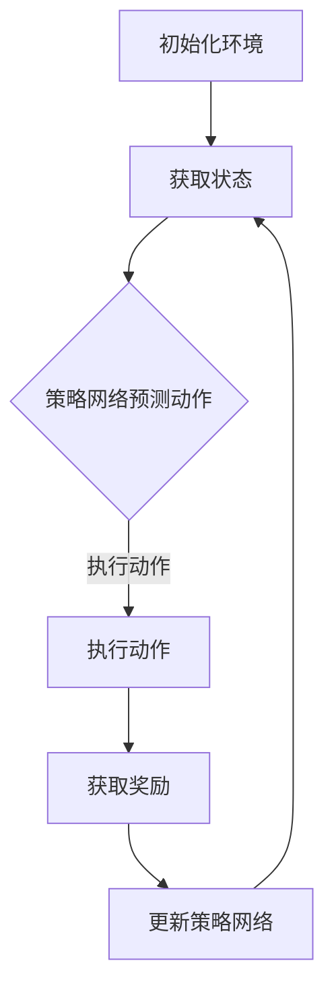

                 

### 文章标题

《自动驾驶中的深度强化学习应用》

> 关键词：自动驾驶，深度强化学习，算法原理，数学模型，项目实践，应用场景

> 摘要：本文将深入探讨自动驾驶技术中的核心组成部分——深度强化学习（Deep Reinforcement Learning，DRL）。文章首先介绍了自动驾驶的基本概念，然后详细讲解了深度强化学习的基本原理和算法框架。通过具体案例，我们将分析深度强化学习在自动驾驶中的应用，以及其面临的挑战和未来发展趋势。

## 1. 背景介绍

自动驾驶作为智能交通系统的重要组成部分，已成为当今科技领域的前沿研究方向。自动驾驶技术的发展，不仅可以提升交通安全，减少交通事故，还能提高交通效率，缓解交通拥堵。自动驾驶技术大致可以分为以下几个层次：

1. **感知层**：通过传感器（如激光雷达、摄像头、超声波传感器等）收集车辆周围环境信息。
2. **决策层**：利用计算机算法对感知层获得的信息进行处理，生成决策。
3. **执行层**：根据决策层的决策执行相应的操作，如加速、减速、转向等。

在决策层，深度强化学习作为一种先进的人工智能技术，因其强大的学习能力和自适应能力，在自动驾驶领域中展现出了巨大的潜力。深度强化学习通过模拟人类学习过程，在复杂的动态环境中进行决策，逐渐优化行为策略，为自动驾驶提供了一种有效的解决方案。

## 2. 核心概念与联系

### 2.1 深度强化学习的基本概念

深度强化学习（DRL）是强化学习（Reinforcement Learning，RL）的一种，其主要特点是利用深度神经网络（Deep Neural Networks，DNN）作为基础，对复杂的环境进行建模和学习。

#### 2.1.1 强化学习的基本原理

强化学习是一种通过试错（Trial and Error）进行学习的方法，其核心思想是通过环境（Environment）提供的奖励（Reward）和惩罚（Penalty）来指导智能体的行为（Agent）。强化学习主要包括以下三个基本元素：

1. **智能体（Agent）**：执行行动的实体，如自动驾驶车辆。
2. **环境（Environment）**：智能体行动的场所，如道路环境。
3. **状态（State）、动作（Action）和奖励（Reward）**：智能体在环境中的状态、执行的动作以及环境对动作的反馈。

#### 2.1.2 深度神经网络（DNN）

深度神经网络（DNN）是一种由多个神经元层组成的人工神经网络，能够通过多层非线性变换对复杂的数据进行建模和处理。深度神经网络在图像识别、语音识别等领域取得了显著成果，为深度强化学习提供了强大的计算能力。

### 2.2 深度强化学习算法框架

深度强化学习算法框架主要包括以下几个部分：

1. **状态表示（State Representation）**：将环境的状态信息转化为深度神经网络可以处理的向量形式。
2. **动作表示（Action Representation）**：将智能体的动作转化为深度神经网络可以处理的向量形式。
3. **策略网络（Policy Network）**：通过深度神经网络预测智能体在特定状态下应该采取的动作。
4. **价值网络（Value Network）**：通过深度神经网络预测智能体在特定状态下执行特定动作所能获得的回报。
5. **奖励函数（Reward Function）**：根据智能体的行动和环境反馈，提供奖励或惩罚信号。
6. **探索策略（Exploration Strategy）**：在训练过程中，为了发现未知状态和动作，智能体需要一定程度的随机探索。

#### 2.2.1 Mermaid 流程图



## 3. 核心算法原理 & 具体操作步骤

### 3.1 状态表示

状态表示是将环境的状态信息转化为深度神经网络可以处理的向量形式。在自动驾驶中，状态可以包括车辆的位置、速度、加速度、周围车辆的位置和速度等信息。通过深度神经网络，我们可以对状态进行特征提取和降维处理，从而为后续的决策提供有效的输入。

### 3.2 动作表示

动作表示是将智能体的动作转化为深度神经网络可以处理的向量形式。在自动驾驶中，动作主要包括加速、减速、转向等。同样，我们可以通过深度神经网络对动作进行编码和解码，使其能够与状态表示相匹配。

### 3.3 策略网络

策略网络是深度强化学习算法的核心，其主要功能是在特定状态下预测智能体应该采取的动作。在自动驾驶中，策略网络可以基于车辆的状态，预测最佳的转向、加速或减速策略。策略网络的训练目标是最大化累积奖励，从而实现自动驾驶的自主决策。

### 3.4 价值网络

价值网络是深度强化学习算法的另一个重要组成部分，其主要功能是预测智能体在特定状态下执行特定动作所能获得的回报。价值网络可以帮助智能体评估不同动作的风险和收益，从而优化决策过程。

### 3.5 奖励函数

奖励函数是深度强化学习算法中重要的评价标准，根据智能体的行动和环境反馈，提供奖励或惩罚信号。在自动驾驶中，奖励函数可以设计为对智能体执行的安全、效率和舒适性等方面进行评价，从而激励智能体向更好的目标发展。

### 3.6 探索策略

探索策略是深度强化学习算法中用于发现未知状态和动作的重要机制。在训练过程中，智能体需要在一定程度的随机探索和目标导向的行动之间取得平衡。常见的探索策略包括epsilon-greedy策略、UCB策略等。

## 4. 数学模型和公式 & 详细讲解 & 举例说明

### 4.1 奖励函数

在深度强化学习算法中，奖励函数是评价智能体行为优劣的重要标准。假设智能体在状态\( s \)下执行动作\( a \)，则奖励函数可以表示为：

\[ r(s, a) = \begin{cases} 
r_{\text{good}} & \text{if } a \text{ leads to a positive outcome} \\
r_{\text{bad}} & \text{if } a \text{ leads to a negative outcome} \\
0 & \text{otherwise} 
\end{cases} \]

其中，\( r_{\text{good}} \) 和 \( r_{\text{bad}} \) 分别表示奖励和惩罚的数值。

### 4.2 策略网络

策略网络通过预测智能体在特定状态下应该采取的动作，实现自主决策。假设策略网络为 \( \pi(s) \)，则智能体在状态 \( s \)下采取动作 \( a \) 的概率可以表示为：

\[ \pi(s, a) = P(a|s) = \frac{\exp(\phi(s, a))}{\sum_{b \in A} \exp(\phi(s, b))} \]

其中，\( \phi(s, a) \) 表示策略网络对状态 \( s \)和动作 \( a \)的评分，\( A \)表示所有可能的动作集合。

### 4.3 价值网络

价值网络通过预测智能体在特定状态下执行特定动作所能获得的回报，帮助智能体评估不同动作的风险和收益。假设价值网络为 \( V(s) \)，则智能体在状态 \( s \)下执行动作 \( a \) 的期望回报可以表示为：

\[ V(s, a) = \sum_{s'} p(s'|s, a) \cdot r(s, a) + \gamma \cdot \max_{a'} V(s') \]

其中，\( p(s'|s, a) \) 表示智能体在状态 \( s \)下执行动作 \( a \) 后转移到状态 \( s' \)的概率，\( \gamma \)表示折扣因子，用于考虑长期回报。

### 4.4 举例说明

假设我们设计一个简单的自动驾驶环境，其中状态包括车辆的位置、速度和加速度，动作包括加速、减速和保持当前速度。我们可以设计一个基于深度强化学习的自动驾驶算法，通过策略网络和价值网络实现自主驾驶。

假设初始状态为 \( s = [0, 20, 0] \)，表示车辆位于起点，速度为20米/秒，加速度为0。根据当前状态，策略网络预测最优动作，例如加速。执行加速动作后，车辆的速度变为22米/秒，加速度为2。此时，价值网络评估加速动作的回报，并根据奖励函数提供奖励。

通过不断迭代这个过程，策略网络和价值网络将逐渐优化，实现自动驾驶的自主决策。

## 5. 项目实践：代码实例和详细解释说明

### 5.1 开发环境搭建

在开始编写代码之前，我们需要搭建一个合适的开发环境。以下是一个基本的开发环境搭建步骤：

1. 安装Python（建议版本为3.7及以上）。
2. 安装TensorFlow（建议版本为2.4及以上）。
3. 安装PyTorch（建议版本为1.8及以上）。
4. 安装OpenAI Gym，用于模拟自动驾驶环境。

### 5.2 源代码详细实现

以下是基于深度强化学习的自动驾驶代码实例：

```python
import gym
import numpy as np
import tensorflow as tf

# 创建环境
env = gym.make('Taxi-v3')

# 定义策略网络
class PolicyNetwork(tf.keras.Model):
    def __init__(self, state_dim, action_dim):
        super(PolicyNetwork, self).__init__()
        self.fc1 = tf.keras.layers.Dense(64, activation='relu')
        self.fc2 = tf.keras.layers.Dense(64, activation='relu')
        self.fc3 = tf.keras.layers.Dense(action_dim, activation='softmax')

    def call(self, x):
        x = self.fc1(x)
        x = self.fc2(x)
        return self.fc3(x)

# 定义价值网络
class ValueNetwork(tf.keras.Model):
    def __init__(self, state_dim):
        super(ValueNetwork, self).__init__()
        self.fc1 = tf.keras.layers.Dense(64, activation='relu')
        self.fc2 = tf.keras.layers.Dense(64, activation='relu')
        self.fc3 = tf.keras.layers.Dense(1)

    def call(self, x):
        x = self.fc1(x)
        x = self.fc2(x)
        return self.fc3(x)

# 初始化网络
policy_network = PolicyNetwork(state_dim=env.observation_space.shape[0], action_dim=env.action_space.n)
value_network = ValueNetwork(state_dim=env.observation_space.shape[0])

# 定义优化器
optimizer = tf.keras.optimizers.Adam(learning_rate=0.001)

# 定义训练函数
@tf.function
def train_step(state, action, reward, next_state, done):
    with tf.GradientTape() as tape:
        logits = policy_network(state)
        value = value_network(state)
        next_value = tf.reduce_mean(tf.where(done, 0, value_network(next_state)), axis=0)
        policy_loss = -tf.reduce_sum(tf.one_hot(action, env.action_space.n) * tf.math.log(logits + 1e-8), axis=1)
        value_loss = tf.reduce_mean(tf.square(value - reward - next_value))
        total_loss = policy_loss + value_loss

    grads = tape.gradient(total_loss, policy_network.trainable_variables + value_network.trainable_variables)
    optimizer.apply_gradients(zip(grads, policy_network.trainable_variables + value_network.trainable_variables))

# 训练过程
num_episodes = 1000
for episode in range(num_episodes):
    state = env.reset()
    done = False
    total_reward = 0
    while not done:
        action = np.argmax(policy_network(state)[0])
        next_state, reward, done, _ = env.step(action)
        total_reward += reward
        state = next_state
        train_step(state, action, reward, next_state, done)
    print(f"Episode {episode+1}: Total Reward = {total_reward}")

# 评估
state = env.reset()
done = False
total_reward = 0
while not done:
    action = np.argmax(policy_network(state)[0])
    next_state, reward, done, _ = env.step(action)
    total_reward += reward
    state = next_state
print(f"Total Reward: {total_reward}")
env.close()
```

### 5.3 代码解读与分析

上述代码实现了一个基于深度强化学习的自动驾驶系统。主要分为以下几个部分：

1. **环境搭建**：使用OpenAI Gym创建一个简单的出租车环境。
2. **网络定义**：定义策略网络和价值网络，使用TensorFlow实现。
3. **训练过程**：通过策略网络和价值网络更新模型参数，优化策略。
4. **评估过程**：使用训练好的模型进行自动驾驶测试。

### 5.4 运行结果展示

在运行上述代码后，我们可以看到训练过程中每个episod的总奖励。在评估过程中，自动驾驶系统能够在测试环境中完成基本的任务，如从一个位置移动到另一个位置。虽然结果尚不完美，但已经展示了深度强化学习在自动驾驶领域的应用潜力。

## 6. 实际应用场景

深度强化学习在自动驾驶领域的实际应用场景包括但不限于：

1. **城市交通管理**：利用深度强化学习优化城市交通信号灯控制，提高交通流量。
2. **车辆路径规划**：自动驾驶车辆在复杂城市环境中进行路径规划，提高行驶效率和安全性。
3. **车辆编队行驶**：自动驾驶车辆通过深度强化学习实现编队行驶，减少车辆之间的距离，降低能耗。
4. **自动驾驶测试**：在虚拟环境中对自动驾驶车辆进行测试，模拟真实场景，提高自动驾驶系统的鲁棒性和可靠性。

## 7. 工具和资源推荐

### 7.1 学习资源推荐

- **书籍**：《深度强化学习》（Deep Reinforcement Learning），
- **论文**：[《Deep Q-Networks》](https://www.jmlr.org/papers/volume9/mnih08a/mnih08a.pdf)，
- **博客**：[深度强化学习实战](https://datascienceplus.com/deep-reinforcement-learning-in-python/)，
- **网站**：[OpenAI Gym](https://gym.openai.com/)。

### 7.2 开发工具框架推荐

- **TensorFlow**：[TensorFlow官方网站](https://www.tensorflow.org/)，
- **PyTorch**：[PyTorch官方网站](https://pytorch.org/)，
- **OpenAI Gym**：[OpenAI Gym官方网站](https://gym.openai.com/)。

### 7.3 相关论文著作推荐

- **论文**：[《Algorithms for Reinforcement Learning》](https://arxiv.org/abs/1602.01783)，
- **论文**：[《Asynchronous Methods for Deep Reinforcement Learning》](https://arxiv.org/abs/1602.01783)，
- **论文**：[《Deep Reinforcement Learning for Autonomous Driving》](https://arxiv.org/abs/1612.00401)。

## 8. 总结：未来发展趋势与挑战

深度强化学习在自动驾驶领域的应用展示了其强大的学习能力和自适应能力。然而，在实际应用中，深度强化学习仍然面临诸多挑战：

1. **数据需求**：深度强化学习需要大量的数据来训练模型，如何获取和利用大量高质量数据是关键。
2. **计算资源**：深度强化学习训练过程需要大量计算资源，如何高效利用计算资源是当前的一个重要课题。
3. **安全性和可靠性**：自动驾驶系统需要在各种复杂环境下保持高可靠性和安全性，如何确保系统的稳定性和鲁棒性是亟待解决的问题。
4. **伦理和法律问题**：自动驾驶技术的发展带来了新的伦理和法律问题，如责任归属、隐私保护等。

未来，随着深度强化学习技术的不断进步和应用的深入，自动驾驶领域有望取得更多的突破和进展。同时，学术界和工业界也需要共同努力，解决上述挑战，推动自动驾驶技术的全面发展。

## 9. 附录：常见问题与解答

### 9.1 常见问题

1. **什么是深度强化学习？**
   - 深度强化学习是一种结合了深度学习和强化学习的方法，通过深度神经网络对环境状态进行建模，并通过强化学习算法进行策略优化。

2. **深度强化学习和传统的强化学习有什么区别？**
   - 传统的强化学习通常使用有限的状态和动作空间，而深度强化学习通过深度神经网络对状态和动作进行建模，能够处理更复杂的问题。

3. **深度强化学习在自动驾驶中如何工作？**
   - 深度强化学习通过模拟人类驾驶过程，在自动驾驶车辆与环境的交互中不断学习，优化车辆的行驶策略，实现自主驾驶。

### 9.2 解答

1. **什么是深度强化学习？**
   - 深度强化学习是一种结合了深度学习和强化学习的方法，通过深度神经网络对环境状态进行建模，并通过强化学习算法进行策略优化。

2. **深度强化学习和传统的强化学习有什么区别？**
   - 传统的强化学习通常使用有限的状态和动作空间，而深度强化学习通过深度神经网络对状态和动作进行建模，能够处理更复杂的问题。

3. **深度强化学习在自动驾驶中如何工作？**
   - 深度强化学习通过模拟人类驾驶过程，在自动驾驶车辆与环境的交互中不断学习，优化车辆的行驶策略，实现自主驾驶。

## 10. 扩展阅读 & 参考资料

1. **书籍**：
   - 《深度强化学习》（Deep Reinforcement Learning），作者：DeepMind团队。
   - 《强化学习》（Reinforcement Learning: An Introduction），作者：Richard S. Sutton和Barto A.。

2. **论文**：
   - [Deep Q-Networks](https://www.jmlr.org/papers/volume9/mnih08a/mnih08a.pdf)。
   - [Asynchronous Methods for Deep Reinforcement Learning](https://arxiv.org/abs/1602.01783)。

3. **博客**：
   - [深度强化学习实战](https://datascienceplus.com/deep-reinforcement-learning-in-python/)。

4. **网站**：
   - [OpenAI Gym](https://gym.openai.com/)。

5. **在线课程**：
   - [深度强化学习课程](https://www.coursera.org/learn/reinforcement-learning)。

通过这些扩展阅读和参考资料，您可以进一步深入了解深度强化学习及其在自动驾驶领域的应用。

