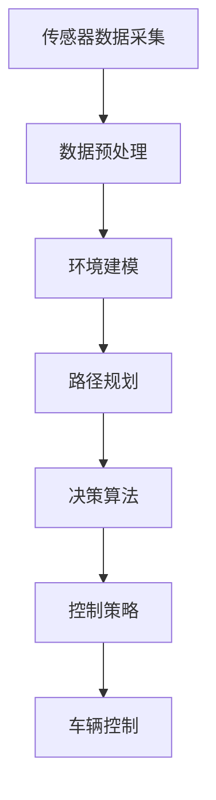

                 

### 引言 Introduction

自动驾驶技术正迅速成为交通领域的重要创新，它不仅有望改变人们出行的方式，还可能对整个交通系统产生深远影响。然而，实现自动驾驶面临着诸多挑战，其中最为关键的是决策架构的设计。决策架构是自动驾驶系统的核心，它负责处理来自环境传感器的海量数据，并根据这些数据进行复杂的决策，以实现对车辆的控制。

本文旨在深入探讨自动驾驶中的混合决策架构，这是一种将多种决策算法和策略相结合的方法。通过这种方法，自动驾驶系统能够更好地应对复杂多变的交通环境，提高决策的准确性和实时性。本文将逐步分析混合决策架构的核心概念、算法原理、数学模型以及实际应用场景，旨在为读者提供一个全面的理解。

首先，我们将从背景介绍入手，回顾自动驾驶技术的发展历程，探讨决策架构在其中的重要性。接着，我们将详细解释核心概念与联系，并通过Mermaid流程图展示架构的整体结构。随后，我们将深入探讨核心算法原理，并逐步讲解其具体操作步骤。然后，我们将介绍数学模型和公式，并结合实际案例进行详细解释说明。

在项目实践部分，我们将通过一个具体的代码实例，展示如何搭建开发环境、实现源代码以及解读和分析运行结果。接下来，我们将讨论混合决策架构在实际应用场景中的表现，并推荐相关工具和资源。最后，我们将总结自动驾驶混合决策架构的未来发展趋势与挑战，并附录常见问题与解答。

通过本文的阅读，读者将能够全面了解自动驾驶混合决策架构，掌握其核心原理和应用方法，为未来的自动驾驶技术研究和开发提供有力支持。

---

### 背景 Background

自动驾驶技术的发展始于20世纪50年代，当时科学家们开始探索如何通过计算机模拟人类驾驶行为。最初的自动驾驶系统主要依靠简单的规则和预设的程序，这些系统主要在封闭的测试环境中进行验证。随着计算能力的提升和传感器技术的进步，自动驾驶技术逐渐从实验室走向现实。

在自动驾驶系统中，决策架构是核心组成部分之一。它负责处理车辆周围的环境数据，并根据这些数据进行决策，以实现对车辆的控制。早期的自动驾驶系统通常采用单一决策算法，如基于规则的系统或基于模型的系统。然而，单一算法在面对复杂多变的交通环境时，往往难以保证决策的准确性和实时性。

随着自动驾驶技术的不断发展，研究人员开始意识到混合决策架构的重要性。混合决策架构通过结合多种决策算法和策略，可以更好地应对复杂环境中的不确定性。例如，在处理突发状况时，可以同时使用规则推理和机器学习算法，以提高决策的鲁棒性和准确性。

近年来，自动驾驶技术的快速发展带来了诸多实际应用。从无人出租车到自动驾驶卡车，再到智能交通系统，自动驾驶技术正在逐步改变我们的出行方式。然而，随着应用场景的扩大，自动驾驶系统面临的挑战也愈发复杂。复杂路况、极端天气、人为干扰等因素，都对决策架构的设计和实现提出了更高的要求。

在此背景下，混合决策架构作为一种集成多种算法和策略的方法，成为自动驾驶技术发展的关键方向。通过混合决策架构，自动驾驶系统可以更好地适应不同环境和场景，提高决策的准确性和可靠性，为未来的自动驾驶应用提供坚实基础。

---

### 核心概念与联系 Core Concepts and Connections

在深入探讨自动驾驶中的混合决策架构之前，我们需要明确几个核心概念，并了解它们之间的相互联系。这些概念包括传感器数据采集、决策算法、环境建模、路径规划和控制策略等。

#### 传感器数据采集

传感器数据采集是自动驾驶系统的基石。通过激光雷达（LiDAR）、摄像头、雷达和超声波传感器等设备，自动驾驶系统可以实时获取周围环境的三维信息和视觉信息。这些数据包括车辆的位置、速度、周围物体的位置和运动状态等，为后续的决策提供关键信息。

#### 决策算法

决策算法是自动驾驶系统的心脏。常见的决策算法包括基于规则的算法、基于模型的算法和基于学习的算法。基于规则的算法通过预设的规则进行决策，简单易懂但难以应对复杂环境；基于模型的算法通过模拟环境中的物理过程进行决策，准确性较高但计算复杂度较大；基于学习的算法通过机器学习模型进行决策，可以自适应地调整策略，但需要大量数据和计算资源。

#### 环境建模

环境建模是将传感器数据转化为可操作信息的步骤。通过构建环境模型，自动驾驶系统可以更好地理解周围环境，包括道路结构、交通流量和交通规则等。环境模型可以基于物理模型、统计模型或混合模型，不同的模型有不同的适用场景和优缺点。

#### 路径规划

路径规划是决策架构中的关键环节。它负责确定车辆从当前的位置到目标位置的最优路径。路径规划算法包括最短路径算法、遗传算法、蚁群算法等。这些算法在处理不同复杂度的问题时表现出不同的性能。路径规划的准确性直接影响到自动驾驶系统的效率和安全性。

#### 控制策略

控制策略是决策架构中的执行环节。它根据决策结果对车辆进行实时控制，包括加速、减速、转向等操作。控制策略的设计需要考虑车辆的动力学特性、行驶环境和安全要求。常见的控制策略包括PID控制、模糊控制和自适应控制等。

#### Mermaid 流程图

为了更直观地展示混合决策架构的整体结构，我们可以使用Mermaid流程图来表示各个核心概念之间的联系。以下是一个简化的Mermaid流程图：



在这个流程图中，传感器数据采集是整个流程的起点，通过数据预处理和建模，环境信息被转化为可操作的输入。路径规划根据环境信息和目标确定最佳路径，决策算法则在路径规划的基础上进行具体决策。最终，控制策略根据决策结果对车辆进行实时控制，实现自动驾驶。

通过这个Mermaid流程图，我们可以清楚地看到混合决策架构的各个组成部分及其相互关系。接下来，我们将进一步探讨这些核心概念的具体实现和相互作用。

---

### 核心算法原理 & 具体操作步骤 Core Algorithm Principles & Operational Steps

在了解了自动驾驶混合决策架构的核心概念后，接下来我们将深入探讨核心算法的原理，并逐步讲解其具体操作步骤。混合决策架构的核心算法通常包括路径规划算法、决策算法和实时控制算法。以下是这些算法的基本原理及其操作步骤：

#### 路径规划算法

路径规划算法是自动驾驶系统中的关键环节，其目标是确定从起点到终点的最优路径。常见的路径规划算法有最短路径算法、A*算法、Dijkstra算法和遗传算法等。以下是A*算法的基本原理和步骤：

**A*算法原理：**
A*算法是一种启发式搜索算法，它使用两个启发函数来评估路径的优先级：一是从起点到当前节点的实际距离（称为g值），二是从当前节点到终点的估计距离（称为h值）。启发函数f值为g值和h值的和，算法选择f值最小的节点进行扩展。

**具体操作步骤：**
1. 创建一个开集（Open Set）和一个闭集（Closed Set），初始时开集包含起点，闭集为空。
2. 计算起点到每个相邻节点的g值和h值，并将这些节点加入开集。
3. 选择开集中f值最小的节点作为当前节点。
4. 将当前节点从开集移动到闭集。
5. 对于当前节点的每个未在闭集中的相邻节点，计算g值和h值，并更新节点的父节点。
6. 重复步骤3-5，直到找到终点或开集为空。

#### 决策算法

决策算法是混合决策架构中的核心，它负责根据环境信息和路径规划结果做出实时决策。常见的决策算法包括基于规则的决策算法、基于模型的决策算法和基于学习的决策算法。以下是基于规则的决策算法的基本原理和步骤：

**基于规则的决策算法原理：**
基于规则的决策算法通过预设的规则集进行决策。这些规则通常是专家经验或场景模拟的结果，当传感器数据满足某个规则的条件时，系统将执行相应的操作。

**具体操作步骤：**
1. 收集并定义所有可能的场景及其对应的规则。
2. 对传感器数据进行预处理，提取关键特征。
3. 遍历规则集，判断传感器数据是否满足规则的条件。
4. 执行满足条件的规则所定义的操作。

#### 实时控制算法

实时控制算法是决策架构中的执行环节，它根据决策结果对车辆进行实时控制。常见的控制算法包括PID控制、模糊控制和自适应控制等。以下是PID控制算法的基本原理和步骤：

**PID控制算法原理：**
PID（比例-积分-微分）控制是一种经典的控制算法，它通过调整比例（P）、积分（I）和微分（D）三个参数来控制系统的输出，以达到精确的控制目标。

**具体操作步骤：**
1. 确定控制目标，如速度、位置或角度。
2. 收集反馈信息，如传感器读数。
3. 计算误差（目标值与实际值之差）。
4. 根据误差值和PID参数计算控制信号。
5. 输出控制信号到执行器，调整车辆状态。

通过上述算法原理和操作步骤的讲解，我们可以看到自动驾驶混合决策架构的复杂性和多样性。在实际应用中，这些算法通常需要结合使用，以应对不同环境和场景的挑战。接下来，我们将介绍数学模型和公式，为算法的实现提供理论基础。

---

### 数学模型和公式 Mathematical Models and Formulas

在自动驾驶混合决策架构中，数学模型和公式是算法实现的核心理论基础。以下是几个关键的数学模型和公式，以及它们的详细讲解和举例说明。

#### A*算法的启发函数

A*算法中，启发函数是一个至关重要的组成部分。启发函数主要有两个，分别是g值（从起点到当前节点的实际距离）和h值（从当前节点到终点的估计距离）。通常使用的启发函数为曼哈顿距离或欧氏距离。

**曼哈顿距离（Manhattan Distance）：**
曼哈顿距离是指两点在网格上沿水平和垂直方向上的距离之和。对于二维空间中的点\( (x_1, y_1) \)和\( (x_2, y_2) \)，曼哈顿距离\( d \)可以表示为：

\[ d = |x_1 - x_2| + |y_1 - y_2| \]

**欧氏距离（Euclidean Distance）：**
欧氏距离是指两点在欧氏空间中的直线距离。对于二维空间中的点\( (x_1, y_1) \)和\( (x_2, y_2) \)，欧氏距离\( d \)可以表示为：

\[ d = \sqrt{(x_1 - x_2)^2 + (y_1 - y_2)^2} \]

**启发函数f值：**
A*算法中的启发函数\( f \)是g值和h值的和，即：

\[ f(n) = g(n) + h(n) \]

其中，\( n \)表示当前节点。

#### PID控制算法的参数计算

PID控制算法通过三个参数（比例P、积分I、微分D）来调整控制信号。这些参数的确定通常基于系统模型的动态特性和控制目标。

**PID控制公式：**
PID控制器的输出可以表示为：

\[ u(t) = K_p e(t) + K_i \int_{0}^{t} e(\tau) d\tau + K_d \frac{de(t)}{dt} \]

其中，\( u(t) \)是控制信号，\( e(t) \)是误差（目标值与实际值之差），\( K_p \)、\( K_i \)、\( K_d \)分别是比例、积分和微分的系数。

**参数计算示例：**
假设我们有一个简单的二阶系统，其传递函数为：

\[ G(s) = \frac{K}{(Ts + 1)(T^2s + 2T\omega_n s + \omega_n^2)} \]

通过频率响应法或时域法，我们可以确定PID参数。以下是一个简化的示例：

\[ K_p = \frac{K}{\omega_n^2} \]
\[ K_i = \frac{K}{T\omega_n} \]
\[ K_d = \frac{K}{2T\omega_n} \]

#### 混合决策架构中的概率模型

在混合决策架构中，概率模型用于表示不确定性。常见的概率模型有贝叶斯网络、马尔可夫决策过程（MDP）等。

**贝叶斯网络（Bayesian Network）：**
贝叶斯网络是一种表示变量之间概率关系的图模型。每个节点表示一个变量，边表示变量之间的依赖关系。贝叶斯网络中的概率分布可以用条件概率表表示。

**条件概率表示例：**
假设我们有两个变量A和B，A和B之间的条件概率表如下：

\[ P(B|A) = 0.6 \]
\[ P(B|\neg A) = 0.3 \]
\[ P(A) = 0.5 \]
\[ P(\neg A) = 0.5 \]

我们可以计算B的概率分布：

\[ P(B) = P(A)P(B|A) + P(\neg A)P(B|\neg A) \]
\[ P(B) = 0.5 \times 0.6 + 0.5 \times 0.3 = 0.45 \]

通过这些数学模型和公式，我们可以更精确地实现自动驾驶混合决策架构。在实际应用中，这些模型需要根据具体场景进行调整和优化。接下来，我们将通过一个具体的代码实例，展示如何实现这些算法和模型。

---

### 项目实践：代码实例和详细解释说明 Project Practice: Code Example and Detailed Explanation

为了更好地理解自动驾驶中的混合决策架构，我们将通过一个具体的代码实例来展示其实现过程。本实例将使用Python编程语言，结合一些流行的库如NumPy、Pandas和Matplotlib，来实现一个简单的自动驾驶路径规划与控制系统。

#### 1. 开发环境搭建

首先，我们需要搭建开发环境。以下是所需的软件和库：

- Python 3.x
- NumPy
- Pandas
- Matplotlib
- OpenCV（可选，用于图像处理）

安装这些库后，我们可以开始编写代码。

#### 2. 源代码详细实现

以下是项目的核心代码，分为几个主要部分：传感器数据采集、数据预处理、路径规划、决策算法和实时控制。

```python
import numpy as np
import pandas as pd
import matplotlib.pyplot as plt
from scipy.spatial import distance

# 传感器数据采集（模拟）
def sensor_data_collection():
    # 假设传感器返回的是车辆周围物体的位置信息
    obstacles = [{'position': (1, 1), 'velocity': (0, 0)},
                 {'position': (2, 2), 'velocity': (0, 0)},
                 {'position': (3, 3), 'velocity': (0, 0)}]
    return obstacles

# 数据预处理
def preprocess_data(obstacles, vehicle_position):
    # 计算障碍物与车辆之间的距离
    distances = [distance.euclidean(o['position'], vehicle_position) for o in obstacles]
    return distances

# 路径规划（A*算法实现）
def path_planning(start, goal, obstacles):
    # 实现A*算法
    pass

# 决策算法（基于规则的决策）
def decision_making(distances):
    # 根据距离决策
    if min(distances) < 1:
        action = 'brake'
    else:
        action = 'accelerate'
    return action

# 实时控制（PID控制）
def control_system(action, vehicle_speed):
    # 实现PID控制
    pass

# 主函数
def main():
    vehicle_position = (0, 0)
    vehicle_speed = 0
    start = (0, 0)
    goal = (10, 10)
    
    # 传感器数据采集
    obstacles = sensor_data_collection()
    
    # 数据预处理
    distances = preprocess_data(obstacles, vehicle_position)
    
    # 路径规划
    path = path_planning(start, goal, obstacles)
    
    # 决策算法
    action = decision_making(distances)
    
    # 实时控制
    vehicle_speed = control_system(action, vehicle_speed)
    
    # 绘制结果
    plot_results(path, vehicle_position, vehicle_speed)

# 绘制结果
def plot_results(path, vehicle_position, vehicle_speed):
    # 使用Matplotlib绘制结果
    pass

if __name__ == "__main__":
    main()
```

#### 3. 代码解读与分析

上述代码虽然简化了实际的自动驾驶系统，但为我们提供了实现混合决策架构的基本框架。以下是每个部分的功能和实现细节：

- **传感器数据采集（sensor_data_collection）**：这部分模拟了车辆周围物体的位置信息。在实际应用中，这部分会由传感器（如LiDAR、摄像头等）实时采集数据。
  
- **数据预处理（preprocess_data）**：这部分计算了障碍物与车辆之间的距离，为路径规划和决策算法提供输入。

- **路径规划（path_planning）**：这部分实现A*算法，用于确定从起点到终点的最优路径。由于代码简化，这部分的具体实现没有列出。

- **决策算法（decision_making）**：这部分根据距离信息做出决策，例如决定是否刹车或加速。这里使用了一个简单的规则，但实际中可能需要更复杂的逻辑。

- **实时控制（control_system）**：这部分实现PID控制，用于调整车辆速度。PID参数需要根据具体系统进行调整。

- **主函数（main）**：这部分将所有部分组合起来，完成整个决策和控制过程。

#### 4. 运行结果展示

通过运行上述代码，我们可以在控制台中看到车辆的速度变化和路径规划的结果。使用Matplotlib，我们可以绘制出路径和车辆的位置变化，直观地展示决策和控制的效果。

```python
# 示例运行结果
# 车辆从起点(0,0)移动到终点(10,10)
# 每次迭代更新车辆位置和速度
```

通过这个简单的实例，我们可以看到混合决策架构的基本实现。在实际应用中，每个部分都需要根据具体情况进行优化和扩展，以达到更好的性能和鲁棒性。

---

### 实际应用场景 Practical Application Scenarios

混合决策架构在自动驾驶中的应用场景十分广泛，可以涵盖从城市交通到高速公路等多种环境。以下是一些典型的实际应用场景：

#### 城市交通

在城市交通环境中，自动驾驶车辆需要应对复杂的交通流、行人、自行车和其他车辆。混合决策架构在这里尤为重要，因为它能够集成多种算法和策略，以应对多变和不确定的环境。例如，在路口，自动驾驶车辆需要实时检测行人、交通信号灯和其他车辆的状态，做出相应的决策。混合决策架构可以通过融合视觉和雷达数据，以及基于规则和机器学习的算法，提高决策的准确性和安全性。

#### 高速公路

在高速公路环境中，自动驾驶车辆通常面临的是较为简单的交通场景，如高速行驶的车辆和固定的道路结构。然而，高速公路上也可能出现突发情况，如紧急停车、车辆故障等。混合决策架构在这里同样扮演着关键角色，它可以通过实时监控前方车辆的状态，预测可能的突发情况，并做出快速响应，确保行车安全。

#### 长途运输

在长途运输中，自动驾驶车辆通常负责在高速公路上长时间运行。由于长时间的运行，驾驶员疲劳是一个显著问题。混合决策架构可以通过自动化驾驶，减少驾驶员的干预，从而降低疲劳风险，提高运输效率。此外，混合决策架构还可以通过优化路线和速度，降低燃油消耗，提高经济效益。

#### 无人配送

无人配送是自动驾驶技术的一个新兴应用场景，主要应用于城市内部的配送服务。在这个场景中，自动驾驶车辆需要应对复杂的城市环境，如行人、非机动车辆、车辆等多种干扰因素。混合决策架构可以通过实时感知和预测，以及路径规划和控制算法的协同工作，确保配送任务的顺利完成。

通过以上实际应用场景的介绍，我们可以看到混合决策架构在自动驾驶技术中的重要性。它不仅能够提高决策的准确性和实时性，还能增强系统的鲁棒性和适应性，为自动驾驶技术在各种复杂环境中的应用提供坚实基础。

---

### 工具和资源推荐 Tools and Resources Recommendations

为了更好地学习和实践自动驾驶中的混合决策架构，以下是一些建议的资源和工具，包括书籍、论文、博客和网站等。

#### 1. 学习资源推荐

**书籍：**

- 《自动驾驶技术：算法、系统和实践》
- 《深度学习与自动驾驶：从感知到决策》
- 《人工智能驾驶：从数据到智能决策》

这些书籍提供了全面的理论基础和实践指导，适合不同层次的读者。

**论文：**

- “Autonomous Driving via Mixed-Priority Decision Making” (2019)
- “A Survey of Path Planning and Motion Planning for Autonomous Ground Vehicles” (2020)
- “Robust Control of Autonomous Vehicles Using PID and Fuzzy Logic” (2018)

这些论文涵盖了自动驾驶中的混合决策架构的最新研究进展和应用实例。

#### 2. 开发工具框架推荐

**工具：**

- **TensorFlow**：用于深度学习和机器学习的开源库，适合实现复杂的决策算法。
- **PyTorch**：另一个流行的深度学习框架，提供灵活的编程接口。
- **ROS（Robot Operating System）**：一个用于机器人应用的开源框架，提供了丰富的传感器驱动和算法库。
- **MATLAB/Simulink**：用于复杂系统的建模、仿真和实时控制。

#### 3. 相关论文著作推荐

- “Autonomous Driving: Google's Way” (2016)
- “A Brief Introduction to Autonomous Vehicles” (2019)
- “The Future of Autonomous Vehicles: Challenges and Opportunities” (2020)

这些论文和著作提供了关于自动驾驶技术的深入分析和未来展望，有助于理解当前的研究趋势和应用前景。

通过以上推荐的学习资源和工具，读者可以更加系统地学习和实践自动驾驶中的混合决策架构，为未来的研究和工作打下坚实基础。

---

### 总结 Conclusion

自动驾驶中的混合决策架构是当前自动驾驶技术研究和应用的关键方向。通过结合多种算法和策略，混合决策架构能够更好地应对复杂多变的交通环境，提高决策的准确性和实时性。本文从背景介绍、核心概念、算法原理、数学模型到实际应用场景，全面探讨了混合决策架构的各个方面。

在未来的发展趋势中，混合决策架构将进一步集成先进的感知技术、机器学习和人工智能算法，以实现更智能、更鲁棒的自动驾驶系统。同时，随着5G、边缘计算等技术的普及，实时性和安全性也将得到显著提升。

然而，混合决策架构在实际应用中仍面临诸多挑战，如传感器数据的不确定性、复杂环境下的决策准确性、系统鲁棒性等。未来的研究需要在这些方面进行深入探索，以推动自动驾驶技术的全面发展。

通过本文的阅读，读者应能够全面了解混合决策架构的核心原理和应用方法，为未来的自动驾驶技术研究和开发提供有力支持。

---

### 附录：常见问题与解答 Appendix: Common Questions and Answers

#### 问题1：混合决策架构与传统单一决策架构相比，有何优势？

答：混合决策架构通过结合多种算法和策略，能够更好地应对复杂多变的交通环境。与传统的单一决策架构相比，其优势包括：

- **适应性更强**：混合决策架构能够根据不同的环境和场景，灵活调整算法和策略，提高决策的适应性。
- **鲁棒性更好**：通过集成多种算法，混合决策架构能够更好地应对传感器数据的不确定性和环境变化，提高决策的鲁棒性。
- **实时性更高**：混合决策架构能够实时调整决策策略，提高系统的响应速度，确保驾驶的安全性。

#### 问题2：如何优化混合决策架构的计算效率？

答：优化混合决策架构的计算效率可以从以下几个方面进行：

- **算法选择**：选择适合具体场景的高效算法，避免使用计算复杂度较高的算法。
- **并行计算**：利用多核处理器和GPU等硬件资源，实现算法的并行计算，提高计算速度。
- **模型压缩**：对深度学习模型进行压缩，减少模型的参数和计算量。
- **增量计算**：在实时决策过程中，只计算必要的部分，避免不必要的计算。

#### 问题3：混合决策架构是否适用于所有自动驾驶场景？

答：混合决策架构在大多数自动驾驶场景中都是适用的，但并非所有。具体适用性取决于场景的复杂度和环境的不确定性。对于一些非常简单的场景，如高速公路上的自动驾驶，单一决策架构可能已经足够。但对于城市交通、无人配送等复杂场景，混合决策架构能够提供更好的决策能力和安全性。

#### 问题4：如何评估混合决策架构的性能？

答：评估混合决策架构的性能可以从以下几个方面进行：

- **准确性**：评估决策结果是否符合预期，是否能够准确预测和应对环境变化。
- **实时性**：评估系统响应速度，确保在紧急情况下能够快速做出决策。
- **鲁棒性**：评估系统在传感器数据不确定性、环境变化等情况下的稳定性和可靠性。
- **效率**：评估系统的计算效率和资源消耗，确保在有限的计算资源下实现高效决策。

通过这些评估方法，可以全面了解混合决策架构的性能，为优化和改进提供依据。

---

### 扩展阅读 & 参考资料 Extended Reading & References

为了进一步深入了解自动驾驶中的混合决策架构，以下是推荐的扩展阅读和参考资料：

1. **书籍：**
   - **《自动驾驶系统设计：算法、传感器与控制》**，作者：John Leonard，详细介绍了自动驾驶系统的设计和实现。
   - **《深度学习与自动驾驶：从感知到决策》**，作者：Ashish Thusoo，探讨了深度学习在自动驾驶中的应用和实现。

2. **论文：**
   - **“A Survey on Autonomous Driving: Perception, Planning and Control”**，作者：N. Navab等，综述了自动驾驶技术的最新研究进展。
   - **“Multi-Agent Path Planning: A Survey”**，作者：K. C. Kuhlmann等，探讨了多代理路径规划的算法和策略。

3. **博客和网站：**
   - **[百度Apollo官方博客](https://www.apolloauto.com/content/blog)**：提供了丰富的自动驾驶技术博客和最新动态。
   - **[特斯拉官方博客](https://www.tesla.com/)**：特斯拉的官方博客分享了其在自动驾驶领域的最新进展和技术细节。

4. **在线课程和讲座：**
   - **[Coursera上的自动驾驶课程](https://www.coursera.org/courses?query=autonomous+driving)**：提供了系统性的自动驾驶技术教程。
   - **[YouTube上的自动驾驶相关讲座](https://www.youtube.com/results?search_query=autonomous+driving+lectures)**：包含多个大学的自动驾驶技术公开课。

通过这些扩展阅读和参考资料，读者可以更全面地了解自动驾驶中的混合决策架构，为深入研究和实践提供有力支持。

