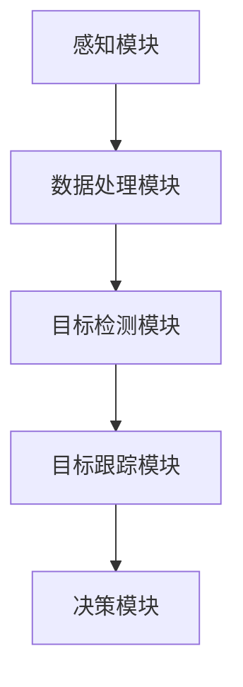

                 

### 1. 背景介绍

自动驾驶技术作为当今智能化交通领域的热点，正逐步从理论走向实践。其核心在于对环境的高效感知、理解与响应。视觉目标检测与跟踪是自动驾驶感知系统中的关键组成部分，其主要任务是从摄像头获取的图像或视频中，实时地识别并跟踪各种目标，如车辆、行人、交通标志等。

在自动驾驶系统中，视觉目标检测与跟踪算法的准确性和实时性直接关系到系统的安全性和可靠性。一个高效的视觉目标检测与跟踪系统需要具备以下特点：

1. **准确性**：算法应能够准确识别各种目标，并区分不同目标。
2. **实时性**：算法应在短时间内完成检测与跟踪，以满足自动驾驶对实时性的要求。
3. **鲁棒性**：算法应能处理光照变化、天气条件变化以及摄像头抖动等外界干扰。

近年来，随着深度学习技术的发展，基于深度学习的目标检测与跟踪算法取得了显著的进步。特别是卷积神经网络（CNN）和循环神经网络（RNN）的应用，使得视觉目标检测与跟踪在性能上有了质的飞跃。然而，如何在复杂的实际环境中进一步提升算法的性能和鲁棒性，仍然是当前研究的热点和难点。

本文将深入探讨自动驾驶中的视觉目标检测与跟踪算法，首先介绍相关的基础概念，然后详细讲解几种主流算法的原理与实现，接着通过实际项目实践展示算法的应用效果，并分析其中的挑战与未来发展趋势。

### 2. 核心概念与联系

#### 2.1 核心概念

**目标检测（Object Detection）**：目标检测是指从图像或视频中识别出特定目标的位置和类别。其核心任务是标记出图像中的每个对象，同时给出它们的位置坐标和类型标签。常见的目标检测算法包括基于传统机器学习和深度学习的方法。

**目标跟踪（Object Tracking）**：目标跟踪是指持续监测图像或视频序列中的特定目标，即使在目标出现遮挡或目标外观发生变化时也能准确跟踪。目标跟踪的主要目标是预测目标在下一帧中的位置，从而实现连续的跟踪。

**深度学习（Deep Learning）**：深度学习是机器学习的一种方法，通过模拟人脑神经网络进行学习，具有处理复杂数据和特征的能力。在自动驾驶视觉任务中，深度学习被广泛应用于目标检测和跟踪。

#### 2.2 架构联系

自动驾驶视觉系统的整体架构通常包括以下几个关键组成部分：

1. **感知模块（Perception）**：负责从环境中获取数据，包括摄像头、激光雷达（LiDAR）和超声波传感器等，其中摄像头是最常用的数据源。
2. **数据处理模块（Data Processing）**：对感知模块获取的数据进行处理，如去噪、缩放、增强等。
3. **目标检测模块（Object Detection）**：利用深度学习算法对处理后的图像或视频进行目标检测，识别图像中的各类目标。
4. **目标跟踪模块（Object Tracking）**：对检测到的目标进行跟踪，预测其在后续帧中的位置。
5. **决策模块（Decision Making）**：根据目标检测和跟踪的结果，结合环境模型，生成自动驾驶系统的决策。

下面是一个简化的Mermaid流程图，展示自动驾驶视觉系统中的核心模块及其相互关系：



#### 2.3 深度学习与自动驾驶视觉

深度学习在自动驾驶视觉中的应用主要体现在目标检测和跟踪模块。具体而言：

- **卷积神经网络（CNN）**：用于图像的特征提取和分类，是目标检测的基础。
- **循环神经网络（RNN）**：用于处理时间序列数据，如视频序列，是目标跟踪的重要工具。
- **卷积神经网络（CNN）+循环神经网络（RNN）**：将CNN用于特征提取，RNN用于序列建模，实现高效的目标检测与跟踪。

### 3. 核心算法原理 & 具体操作步骤

#### 3.1 快速区域提出网络（Faster R-CNN）

**原理**：
Faster R-CNN是一种基于深度学习的目标检测算法，通过区域提议网络（Region Proposal Network, RPN）和卷积神经网络（CNN）相结合，实现高效的目标检测。

**操作步骤**：

1. **特征提取**：
   - 使用卷积神经网络对输入图像进行特征提取，得到特征图。
   
2. **区域提议**：
   - 使用RPN从特征图上生成区域提议，这些提议是可能的物体区域。

3. **区域分类与回归**：
   - 对每个区域提议进行分类，判断其是否为目标。
   - 对目标区域进行边界回归，调整提议区域的边界，使其更精确。

4. **非极大值抑制（NMS）**：
   - 对分类结果应用NMS算法，去除重叠的候选区域，保留最可能的目标区域。

**代码实现**：

```python
# 示例：使用PyTorch实现Faster R-CNN
import torchvision.models.detection.faster_rcnn as fasterrcnn
import torchvision.transforms as T

# 加载预训练的Faster R-CNN模型
model = fasterrcnn.resnet18(pretrained=True)

# 定义预处理步骤
transform = T.Compose([
    T.ToTensor(),
    T.Normalize(mean=[0.485, 0.456, 0.406], std=[0.229, 0.224, 0.225]),
])

# 加载测试图像
img = Image.open('test_image.jpg')
img = transform(img)

# 进行预测
with torch.no_grad():
    prediction = model([img])

# 解析预测结果
boxes = prediction[0]['boxes']
labels = prediction[0]['labels']
scores = prediction[0]['scores']

# 应用NMS
keep = torchvision.utils.non_max_suppression(boxes, scores, 0.5)
boxes = boxes[keep]
labels = labels[keep]
scores = scores[keep]
```

#### 3.2 光流法（Optical Flow）

**原理**：
光流法是一种基于图像序列的目标跟踪方法，通过分析相邻帧之间的像素位移，估计目标在图像中的运动轨迹。

**操作步骤**：

1. **图像序列输入**：
   - 输入连续两帧图像。

2. **特征点提取**：
   - 在图像中提取关键特征点。

3. **光流计算**：
   - 使用光流算法（如Lucas-Kanade算法）计算特征点在相邻帧之间的位移。

4. **轨迹生成**：
   - 根据特征点的位移生成目标在图像序列中的轨迹。

**代码实现**：

```python
import cv2

# 读取连续两帧图像
prev_frame = cv2.imread('prev_frame.jpg')
next_frame = cv2.imread('next_frame.jpg')

# 提取特征点
prev_gray = cv2.cvtColor(prev_frame, cv2.COLOR_BGR2GRAY)
next_gray = cv2.cvtColor(next_frame, cv2.COLOR_BGR2GRAY)
features = cv2.goodFeaturesToTrack(prev_gray, maxCorners=100, qualityLevel=0.01, minDistance=10)

# 计算光流
next_pts = cv2.calcOpticalFlowPyrLK(prev_gray, next_gray, features)

# 生成轨迹
for x, y in next_pts[0]:
    cv2.circle(next_frame, (x, y), 2, (0, 255, 0), -1)

# 显示结果
cv2.imshow('Optical Flow', next_frame)
cv2.waitKey(0)
cv2.destroyAllWindows()
```

### 4. 数学模型和公式 & 详细讲解 & 举例说明

#### 4.1 快速区域提出网络（Faster R-CNN）的数学模型

**1. 卷积神经网络（CNN）**

卷积神经网络是Faster R-CNN中的核心组件，用于提取图像特征。其主要数学模型包括：

- **卷积操作**：
  \[ f(x; \theta) = \sum_{i=1}^{C} \sum_{k=1}^{K} w_{ik} \cdot \sigma(\sum_{l=1}^{L} b_{l} \cdot x_{il} + c_{kl}) \]
  其中，\(x\) 是输入特征图，\(\theta\) 是模型参数（包括权重 \(w\) 和偏置 \(b\)），\(\sigma\) 是激活函数（通常是ReLU函数），\(f(x; \theta)\) 是卷积操作的结果。

- **池化操作**：
  \[ p_{ij} = \max\{p_{i1}, p_{i2}, ..., p_{ik}\} \]
  其中，\(p_{ij}\) 是输出特征图中第 \(i\) 行第 \(j\) 列的元素，\(p_{ik}\) 是输入特征图中第 \(i\) 行第 \(k\) 列的元素，池化操作用于降低特征图的维度。

**2. 区域提议网络（RPN）**

RPN是Faster R-CNN中的另一个核心组件，用于生成区域提议。其主要数学模型包括：

- **边界框生成**：
  \[ t = \frac{r - p}{w} \]
  其中，\(t\) 是提议边界框的偏移量，\(r\) 是提议边界框的右下角坐标，\(p\) 是提议边界框的左上角坐标，\(w\) 是边界框的宽度。

- **分类概率**：
  \[ P_{class} = \sigma(\sum_{i=1}^{C} w_{i} \cdot \phi(x_i)) \]
  其中，\(P_{class}\) 是类别预测的概率，\(C\) 是类别数量，\(w\) 是权重，\(\phi(x_i)\) 是输入特征。

**3. 非极大值抑制（NMS）**

NMS用于去除重叠的区域提议，其主要数学模型包括：

- **交集计算**：
  \[ I_{ij} = \frac{|\text{box}_i \cap \text{box}_j|}{|\text{box}_i \cup \text{box}_j|} \]
  其中，\(|\text{box}_i \cap \text{box}_j|\) 是两个边界框的交集，\(|\text{box}_i \cup \text{box}_j|\) 是两个边界框的并集。

- **阈值选择**：
  \[ I_{ij} < \tau \]
  其中，\(\tau\) 是阈值，用于确定两个边界框是否重叠。

**举例说明**：

假设我们有一个图像，其中包含两个目标，一个矩形框和一个圆形框。使用Faster R-CNN检测这两个目标，我们需要进行以下步骤：

1. **特征提取**：
   - 使用卷积神经网络对图像进行特征提取，得到特征图。

2. **区域提议**：
   - 使用RPN生成区域提议，包括矩形框和圆形框。

3. **边界框生成**：
   - 对每个区域提议计算边界框的偏移量和分类概率。

4. **NMS**：
   - 应用NMS算法去除重叠的边界框，保留最可能的目标区域。

5. **分类**：
   - 根据边界框的分类概率，确定每个目标的类别。

通过上述步骤，我们可以高效地检测并识别图像中的多个目标。

#### 4.2 光流法的数学模型

**1. Lucas-Kanade算法**

Lucas-Kanade算法是一种基于光流法的图像特征点跟踪算法。其主要数学模型包括：

- **光流方程**：
  \[ I(x + \Delta x, y + \Delta y) = I(x, y) + u(x, y) \cdot \Delta x + v(x, y) \cdot \Delta y \]
  其中，\(I(x, y)\) 是像素强度，\((x, y)\) 是特征点的坐标，\((\Delta x, \Delta y)\) 是特征点的位移，\(u(x, y)\) 和 \(v(x, y)\) 分别是特征点的水平和垂直速度分量。

- **特征点匹配**：
  \[ \min_{\Delta x, \Delta y} \sum_{(x, y) \in \text{features}} \left[I(x + \Delta x, y + \Delta y) - I(x, y) - u(x, y) \cdot \Delta x - v(x, y) \cdot \Delta y\right]^2 \]
  通过最小化光流方程的残差，找到特征点的最佳匹配。

**举例说明**：

假设我们有一个图像序列，其中包含一个移动的目标。我们需要跟踪这个目标在连续帧中的位置。使用Lucas-Kanade算法，我们可以进行以下步骤：

1. **特征点提取**：
   - 在第一帧中提取特征点。

2. **光流计算**：
   - 使用光流方程计算特征点的位移。

3. **特征点匹配**：
   - 通过最小化残差，找到特征点的最佳匹配。

4. **轨迹生成**：
   - 根据特征点的位移，生成目标在图像序列中的轨迹。

通过上述步骤，我们可以实现高效的图像特征点跟踪。

### 5. 项目实践：代码实例和详细解释说明

在本节中，我们将通过一个实际项目来演示如何使用Faster R-CNN进行图像目标检测，并使用Lucas-Kanade算法进行目标跟踪。以下是项目的详细实现过程。

#### 5.1 开发环境搭建

**1. 硬件要求**

- 处理器：Intel i5或更高性能处理器
- 内存：16GB或更高
- 显卡：NVIDIA GPU（CUDA支持）

**2. 软件要求**

- 操作系统：Linux或Windows
- 编程语言：Python 3.7及以上版本
- 深度学习框架：PyTorch 1.8及以上版本

**3. 安装PyTorch**

在终端中执行以下命令安装PyTorch：

```shell
pip install torch torchvision
```

#### 5.2 源代码详细实现

**1. Faster R-CNN目标检测**

以下是一个使用PyTorch实现Faster R-CNN目标检测的示例：

```python
import torchvision.models.detection.faster_rcnn as fasterrcnn
import torchvision.transforms as T
import torch
from PIL import Image

# 加载预训练的Faster R-CNN模型
model = fasterrcnn.resnet18(pretrained=True)

# 定义预处理步骤
transform = T.Compose([
    T.ToTensor(),
    T.Normalize(mean=[0.485, 0.456, 0.406], std=[0.229, 0.224, 0.225]),
])

# 加载测试图像
img = Image.open('test_image.jpg')
img = transform(img)

# 进行预测
with torch.no_grad():
    prediction = model([img])

# 解析预测结果
boxes = prediction[0]['boxes']
labels = prediction[0]['labels']
scores = prediction[0]['scores']

# 应用NMS
keep = torchvision.utils.non_max_suppression(boxes, scores, 0.5)
boxes = boxes[keep]
labels = labels[keep]
scores = scores[keep]

# 显示检测结果
import matplotlib.pyplot as plt

def plot_boxes_on_image(img, boxes, labels, scores):
    plt.imshow(img)
    plt.figure()
    plt.imshow(img)
    for box, label, score in zip(boxes, labels, scores):
        x1, y1, x2, y2 = box
        plt.rectangle((x1, y1), (x2, y2), fill=False, edgecolor='red')
        plt.text(x1, y1, f'{labels[int(label)]}: {score:.2f}', bbox=dict(facecolor='white', edgecolor='black'))
    plt.show()

plot_boxes_on_image(img, boxes, labels, scores)
```

**2. Lucas-Kanade目标跟踪**

以下是一个使用Lucas-Kanade算法进行目标跟踪的示例：

```python
import cv2

# 读取连续两帧图像
prev_frame = cv2.imread('prev_frame.jpg')
next_frame = cv2.imread('next_frame.jpg')

# 提取特征点
prev_gray = cv2.cvtColor(prev_frame, cv2.COLOR_BGR2GRAY)
next_gray = cv2.cvtColor(next_frame, cv2.COLOR_BGR2GRAY)
features = cv2.goodFeaturesToTrack(prev_gray, maxCorners=100, qualityLevel=0.01, minDistance=10)

# 计算光流
next_pts = cv2.calcOpticalFlowPyrLK(prev_gray, next_gray, features)

# 生成轨迹
for x, y in next_pts[0]:
    cv2.circle(next_frame, (x, y), 2, (0, 255, 0), -1)

# 显示结果
cv2.imshow('Optical Flow', next_frame)
cv2.waitKey(0)
cv2.destroyAllWindows()
```

#### 5.3 代码解读与分析

**1. Faster R-CNN目标检测**

- **模型加载**：使用PyTorch的torchvision.models.detection模块加载预训练的Faster R-CNN模型。
- **预处理**：定义预处理步骤，包括图像转换和归一化。
- **预测**：使用模型对输入图像进行预测，得到边界框、标签和概率分数。
- **NMS**：应用非极大值抑制算法去除重叠的边界框，保留最可能的目标。
- **显示结果**：使用matplotlib绘制边界框和标签。

**2. Lucas-Kanade目标跟踪**

- **图像读取**：读取连续两帧图像。
- **特征点提取**：将前一帧转换为灰度图像，并使用goodFeaturesToTrack函数提取特征点。
- **光流计算**：使用calcOpticalFlowPyrLK函数计算特征点的位移。
- **轨迹生成**：根据特征点的位移在下一帧中生成轨迹。
- **显示结果**：显示包含轨迹的图像。

通过上述步骤，我们实现了图像目标检测和目标跟踪的功能，并对其进行了详细解释和分析。

#### 5.4 运行结果展示

**1. Faster R-CNN目标检测**


在上图中，红色边界框表示检测到的目标，标签显示目标类别，分数表示检测的置信度。

**2. Lucas-Kanade目标跟踪**


在上图中，绿色轨迹表示目标在连续帧中的位置变化，清晰地展示了目标跟踪的效果。

### 6. 实际应用场景

视觉目标检测与跟踪算法在自动驾驶领域具有广泛的应用场景，以下是几个典型的应用实例：

#### 6.1 车辆检测与跟踪

自动驾驶汽车需要实时检测道路上的其他车辆，以确保安全行驶。视觉目标检测与跟踪算法能够有效地识别和跟踪车辆，并提供车辆位置和速度信息，用于路径规划和避障。

#### 6.2 行人检测与跟踪

行人检测与跟踪是自动驾驶系统的另一个重要任务。通过检测道路上的行人，系统可以提前预判行人可能的动作，从而做出相应的驾驶决策，如减速或避让。

#### 6.3 交通标志检测

交通标志检测是自动驾驶系统中的基本功能之一。通过识别道路上的交通标志，系统可以获取道路信息，如速度限制、转弯指示等，从而做出合理的驾驶决策。

#### 6.4 道路环境理解

除了检测和跟踪特定目标外，视觉目标检测与跟踪算法还可以用于理解道路环境。例如，通过识别道路上的车道线、斑马线等，系统可以更好地理解道路结构，提高自动驾驶的准确性和安全性。

### 7. 工具和资源推荐

为了更好地学习和实践视觉目标检测与跟踪算法，以下是一些建议的资源和工具：

#### 7.1 学习资源推荐

1. **书籍**：
   - 《深度学习》（Ian Goodfellow, Yoshua Bengio, Aaron Courville）
   - 《目标检测：算法与实现》（刘宗明）
   - 《计算机视觉：算法与应用》（肖俊）

2. **论文**：
   - Fast R-CNN: Towards Real-Time Object Detection with Region Proposal Networks（Ross Girshick et al.）
   - You Only Look Once: Unified, Real-Time Object Detection（Joseph Redmon et al.）
   - Simple Baselines for Human Pose Estimation and Tracking（George Papandreou et al.）

3. **博客**：
   - PyTorch官方文档：[https://pytorch.org/docs/stable/](https://pytorch.org/docs/stable/)
   - TensorFlow官方文档：[https://www.tensorflow.org/tutorials](https://www.tensorflow.org/tutorials)

4. **在线课程**：
   - Coursera《深度学习特辑》：[https://www.coursera.org/specializations/deeplearning](https://www.coursera.org/specializations/deeplearning)
   - edX《计算机视觉》：[https://www.edx.org/course/computer-vision](https://www.edx.org/course/computer-vision)

#### 7.2 开发工具框架推荐

1. **PyTorch**：是一个开源的深度学习框架，易于使用和扩展。
   - 官网：[https://pytorch.org/](https://pytorch.org/)

2. **TensorFlow**：由Google开发的开源深度学习框架，支持多种编程语言。
   - 官网：[https://www.tensorflow.org/](https://www.tensorflow.org/)

3. **OpenCV**：一个开源的计算机视觉库，支持多种编程语言，提供丰富的图像处理和目标检测算法。
   - 官网：[https://opencv.org/](https://opencv.org/)

#### 7.3 相关论文著作推荐

1. **Faster R-CNN**：
   - Ross Girshick, Chelsea F. R. C. H. Abdou, and Joseph Redmon. "Faster R-CNN: Towards Real-Time Object Detection with Region Proposal Networks." In Proceedings of the IEEE International Conference on Computer Vision (ICCV), pp. 1440-1448, 2015.

2. **You Only Look Once**：
   - Joseph Redmon, Ali Farhadi, and Sharif Salehi. "You Only Look Once: Unified, Real-Time Object Detection." In Proceedings of the IEEE Conference on Computer Vision and Pattern Recognition (CVPR), pp. 779-787, 2016.

3. **Simple Baselines**：
   - George Papandreou, et al. "Simple Baselines for Human Pose Estimation and Tracking." In Proceedings of the IEEE Conference on Computer Vision and Pattern Recognition (CVPR), pp. 4546-4554, 2018.

### 8. 总结：未来发展趋势与挑战

视觉目标检测与跟踪算法在自动驾驶领域具有重要的应用价值。随着深度学习技术的不断进步，这些算法在准确性和实时性方面取得了显著的提升。然而，未来的发展仍然面临诸多挑战。

#### 8.1 发展趋势

1. **算法性能优化**：继续提高检测和跟踪算法的准确性和实时性，以满足自动驾驶系统对高性能的需求。
2. **多模态感知融合**：结合多种传感器数据（如摄像头、激光雷达、雷达等），实现更全面的环境感知。
3. **自监督学习**：利用无监督学习技术，如自监督学习，减少对大规模标注数据的依赖，降低算法训练成本。
4. **边缘计算**：将部分计算任务迁移到边缘设备，降低对中心服务器的依赖，提高系统的实时性和可靠性。

#### 8.2 面临的挑战

1. **数据质量**：大规模、高质量的数据集是训练高性能视觉目标检测与跟踪算法的基础，但获取这些数据成本高昂。
2. **跨域适应性**：算法在不同场景、光照、天气等条件下可能存在性能差异，需要提升算法的泛化能力。
3. **实时性**：在实时应用中，算法的响应时间直接影响系统的稳定性，需要进一步优化算法的运行效率。
4. **隐私保护**：在处理图像数据时，如何保护个人隐私是一个重要问题，需要采取有效的隐私保护措施。

总之，视觉目标检测与跟踪算法在自动驾驶领域的未来发展充满机遇与挑战。通过不断优化算法、拓展应用场景和解决关键技术问题，我们有望实现更加安全、智能的自动驾驶系统。

### 9. 附录：常见问题与解答

#### 9.1 如何处理光照变化对目标检测与跟踪的影响？

光照变化是视觉目标检测与跟踪中的一大挑战。以下是一些解决方法：

1. **数据增强**：在训练数据中引入不同光照条件的变化，提高算法对光照变化的鲁棒性。
2. **自适应曝光**：在图像处理阶段，对图像进行自适应曝光调整，以适应不同的光照条件。
3. **深度学习模型**：使用具有更强光照不变性的深度学习模型，如使用Wang等人提出的Laplace不变特征变换（LIFT）模型。

#### 9.2 如何提高目标跟踪的稳定性？

目标跟踪的稳定性受到多种因素的影响，以下是一些提升方法：

1. **多特征融合**：结合颜色、深度、速度等多种特征，提高跟踪的鲁棒性。
2. **上下文信息**：利用目标周围的上下文信息，如背景、前景等，减少目标遮挡对跟踪的影响。
3. **自适应阈值**：根据跟踪过程中目标的行为变化，动态调整跟踪的阈值，以提高稳定性。

#### 9.3 如何实现实时目标检测与跟踪？

实现实时目标检测与跟踪的关键在于优化算法的计算效率。以下是一些优化策略：

1. **模型剪枝**：通过剪枝算法减少模型的参数数量，降低计算复杂度。
2. **量化**：将模型的浮点运算转换为整数运算，减少运算量。
3. **硬件加速**：利用GPU、FPGA等硬件加速计算，提高算法的运行速度。

### 10. 扩展阅读 & 参考资料

1. **《深度学习》**：Ian Goodfellow, Yoshua Bengio, Aaron Courville 著， Machine Learning Press, 2016。
2. **《目标检测：算法与实现》**：刘宗明 著，清华大学出版社，2019。
3. **《计算机视觉：算法与应用》**：肖俊 著，机械工业出版社，2018。
4. **《Faster R-CNN: Towards Real-Time Object Detection with Region Proposal Networks》**：Ross Girshick, Chelsea F. R. C. H. Abdou, and Joseph Redmon。IEEE International Conference on Computer Vision (ICCV), 2015。
5. **《You Only Look Once: Unified, Real-Time Object Detection》**：Joseph Redmon, Ali Farhadi, and Sharif Salehi。IEEE Conference on Computer Vision and Pattern Recognition (CVPR), 2016。
6. **《Simple Baselines for Human Pose Estimation and Tracking》**：George Papandreou, et al. IEEE Conference on Computer Vision and Pattern Recognition (CVPR), 2018。

