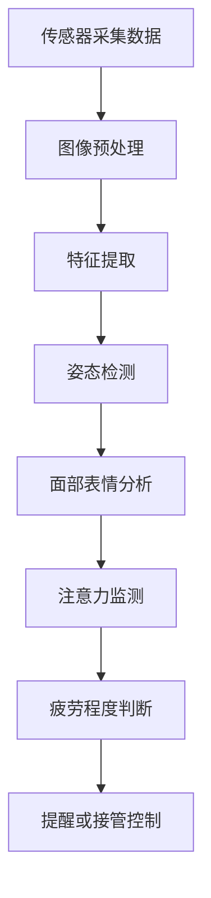

                 

### 文章标题

《自动驾驶中的驾驶员监控与疲劳检测》

> **关键词**：自动驾驶、驾驶员监控、疲劳检测、算法原理、应用场景

> **摘要**：本文深入探讨了自动驾驶技术中驾驶员监控与疲劳检测的重要性、核心概念、算法原理及其在实际应用中的具体实现。通过对核心算法的数学模型和具体操作步骤的详细分析，文章展示了如何利用先进的计算机视觉和机器学习技术，实现驾驶员状态的实时监控和疲劳检测，为自动驾驶系统的安全性和可靠性提供有力保障。

### 1. 背景介绍

随着科技的不断发展，自动驾驶技术已成为未来交通领域的重要研究方向。自动驾驶系统旨在通过传感器、控制器和算法，使车辆能够自主感知环境、做出决策并控制车辆行驶。然而，尽管自动驾驶技术在车辆控制、路径规划等方面取得了显著进展，但驾驶员监控与疲劳检测仍然是不可忽视的重要环节。

驾驶员监控与疲劳检测的重要性主要体现在以下几个方面：

1. **确保驾驶员注意力集中**：在自动驾驶过程中，驾驶员需要时刻保持注意力集中，以应对突发情况。通过实时监控驾驶员的状态，可以确保他们始终保持清醒，避免因疲劳而导致的安全事故。

2. **提高系统可靠性**：自动驾驶系统的可靠性直接影响到行驶过程中的安全性。通过疲劳检测，系统可以在驾驶员疲劳时及时提醒，甚至接管车辆控制权，从而提高系统的可靠性。

3. **降低人工干预**：自动驾驶系统在驾驶员疲劳时进行干预，可以减少人工干预的频率，降低驾驶疲劳对系统运行的影响，提高系统的稳定性和效率。

4. **改善驾驶体验**：通过驾驶员监控与疲劳检测，可以为用户提供更加舒适和人性化的驾驶体验，提高用户满意度。

目前，自动驾驶技术主要分为两个阶段：辅助驾驶和完全自动驾驶。在辅助驾驶阶段，驾驶员仍然承担部分驾驶任务，如控制方向盘、踩刹车等；而在完全自动驾驶阶段，驾驶员无需进行任何操作，车辆完全由自动驾驶系统控制。无论是辅助驾驶还是完全自动驾驶，驾驶员监控与疲劳检测都是确保系统运行安全和可靠的关键因素。

### 2. 核心概念与联系

#### 2.1 驾驶员监控

驾驶员监控主要涉及以下几个方面：

1. **姿态检测**：通过摄像头和传感器，实时监测驾驶员的头部、眼睛和面部动作，判断其是否保持警觉。

2. **面部表情分析**：通过对驾驶员面部表情的识别，分析其情绪状态，如是否疲倦、焦虑等。

3. **注意力监测**：通过监测驾驶员的眼动轨迹，分析其是否专注于道路和车辆，判断其注意力水平。

4. **生理信号监测**：通过监测驾驶员的心率、呼吸等生理信号，判断其疲劳程度。

#### 2.2 疲劳检测

疲劳检测主要涉及以下几种方法：

1. **基于生理信号的疲劳检测**：通过监测驾驶员的心率、呼吸等生理信号，分析其疲劳程度。

2. **基于行为特征的疲劳检测**：通过分析驾驶员的驾驶行为，如行车速度、变道频率等，判断其疲劳程度。

3. **基于图像分析的疲劳检测**：通过摄像头捕捉驾驶员的面部图像，利用图像处理和计算机视觉技术，分析其面部表情和姿态，判断其疲劳程度。

#### 2.3 核心算法原理

驾驶员监控与疲劳检测的核心算法主要基于计算机视觉和机器学习技术。具体原理如下：

1. **计算机视觉**：通过摄像头获取驾驶员的实时图像，利用图像处理技术，提取面部特征、眼动轨迹等关键信息。

2. **深度学习**：利用深度学习算法，对提取到的图像特征进行训练和分类，实现对驾驶员姿态、面部表情和注意力的准确识别。

3. **机器学习**：通过机器学习算法，对驾驶员的生理信号和行为特征进行分析，判断其疲劳程度。

#### 2.4 Mermaid 流程图



### 3. 核心算法原理 & 具体操作步骤

#### 3.1 基于计算机视觉的姿态检测

姿态检测是驾驶员监控的关键环节，其基本原理是通过摄像头获取驾驶员的实时图像，然后利用图像处理技术提取关键特征，最后利用深度学习算法进行姿态分类。

**具体操作步骤**：

1. **图像预处理**：对获取的图像进行去噪、增强等处理，提高图像质量。

2. **特征提取**：利用 Haar-like 特征进行面部特征点检测，提取眼睛、嘴巴等关键区域。

3. **姿态估计**：利用深度学习算法（如卷积神经网络），对提取到的特征点进行分类和融合，估计驾驶员的姿态。

4. **姿态分类**：根据姿态估计结果，判断驾驶员是否保持警觉。

#### 3.2 面部表情分析

面部表情分析是通过计算机视觉技术对驾驶员的面部表情进行识别，以判断其情绪状态。具体操作步骤如下：

1. **图像预处理**：对获取的图像进行去噪、增强等处理。

2. **特征提取**：利用 Haar-like 特征进行面部特征点检测，提取眼睛、嘴巴等关键区域。

3. **特征变换**：将原始图像转换为灰度图像，并利用线性变换进行特征增强。

4. **表情分类**：利用深度学习算法（如卷积神经网络），对提取到的特征进行分类，识别驾驶员的表情。

#### 3.3 注意力监测

注意力监测是通过分析驾驶员的眼动轨迹，判断其是否专注于道路和车辆。具体操作步骤如下：

1. **眼动追踪**：利用摄像头获取驾驶员的实时眼动轨迹。

2. **特征提取**：提取眼动轨迹的关键特征，如注视点、注视时间等。

3. **注意力分类**：利用深度学习算法，对提取到的特征进行分类，判断驾驶员的注意力水平。

#### 3.4 生理信号监测

生理信号监测是通过监测驾驶员的心率、呼吸等生理信号，判断其疲劳程度。具体操作步骤如下：

1. **信号采集**：利用生理传感器采集驾驶员的心率、呼吸等信号。

2. **信号预处理**：对采集到的信号进行去噪、滤波等预处理。

3. **特征提取**：提取信号的关键特征，如心率变异性、呼吸频率等。

4. **疲劳分类**：利用机器学习算法，对提取到的特征进行分类，判断驾驶员的疲劳程度。

#### 3.5 疲劳程度判断

疲劳程度判断是通过综合分析驾驶员的姿态、面部表情、注意力和生理信号，判断其疲劳程度。具体操作步骤如下：

1. **特征融合**：将不同类型的数据（如图像、生理信号）进行融合，提取综合特征。

2. **疲劳分类**：利用深度学习算法，对提取到的综合特征进行分类，判断驾驶员的疲劳程度。

3. **提醒或接管控制**：根据疲劳程度判断结果，对驾驶员进行提醒或接管车辆控制权。

### 4. 数学模型和公式 & 详细讲解 & 举例说明

#### 4.1 姿态检测数学模型

姿态检测的核心是姿态估计，其基本原理是通过深度学习算法对驾驶员的姿态进行分类。假设姿态空间共有 \( C \) 个类别，输入特征为 \( x \)，输出为 \( y \)，则姿态检测的数学模型可以表示为：

$$
y = f(C, x)
$$

其中，\( f \) 为深度学习算法，可以是卷积神经网络（CNN）、循环神经网络（RNN）等。为了实现姿态分类，通常使用交叉熵损失函数：

$$
L(y, f(x)) = -\sum_{i=1}^{C} y_i \log f(x_i)
$$

其中，\( y_i \) 为类别 \( i \) 的标签，\( f(x_i) \) 为输入特征 \( x_i \) 的预测概率。

#### 4.2 面部表情分析数学模型

面部表情分析的核心是表情分类，其基本原理是通过深度学习算法对面部表情进行识别。假设表情空间共有 \( K \) 个类别，输入特征为 \( x \)，输出为 \( y \)，则面部表情分析的数学模型可以表示为：

$$
y = g(K, x)
$$

其中，\( g \) 为深度学习算法，可以是卷积神经网络（CNN）、循环神经网络（RNN）等。为了实现表情分类，通常使用交叉熵损失函数：

$$
L(y, g(x)) = -\sum_{j=1}^{K} y_j \log g(x_j)
$$

其中，\( y_j \) 为类别 \( j \) 的标签，\( g(x_j) \) 为输入特征 \( x_j \) 的预测概率。

#### 4.3 注意力监测数学模型

注意力监测的核心是注意力分类，其基本原理是通过深度学习算法判断驾驶员的注意力水平。假设注意力空间共有 \( M \) 个类别，输入特征为 \( x \)，输出为 \( y \)，则注意力监测的数学模型可以表示为：

$$
y = h(M, x)
$$

其中，\( h \) 为深度学习算法，可以是卷积神经网络（CNN）、循环神经网络（RNN）等。为了实现注意力分类，通常使用交叉熵损失函数：

$$
L(y, h(x)) = -\sum_{l=1}^{M} y_l \log h(x_l)
$$

其中，\( y_l \) 为类别 \( l \) 的标签，\( h(x_l) \) 为输入特征 \( x_l \) 的预测概率。

#### 4.4 生理信号监测数学模型

生理信号监测的核心是疲劳分类，其基本原理是通过机器学习算法判断驾驶员的疲劳程度。假设疲劳空间共有 \( N \) 个类别，输入特征为 \( x \)，输出为 \( y \)，则生理信号监测的数学模型可以表示为：

$$
y = k(N, x)
$$

其中，\( k \) 为机器学习算法，可以是支持向量机（SVM）、决策树（DT）等。为了实现疲劳分类，通常使用平方损失函数：

$$
L(y, k(x)) = (y - k(x))^2
$$

其中，\( y \) 为类别标签，\( k(x) \) 为输入特征 \( x \) 的预测值。

#### 4.5 疲劳程度判断数学模型

疲劳程度判断的核心是综合分析不同类型的数据，判断驾驶员的疲劳程度。假设综合特征为 \( x \)，输出为 \( y \)，则疲劳程度判断的数学模型可以表示为：

$$
y = \theta(x)
$$

其中，\( \theta \) 为综合判断函数，可以通过多层感知器（MLP）、循环神经网络（RNN）等实现。为了实现疲劳程度判断，通常使用逻辑回归（Logistic Regression）：

$$
\theta(x) = \frac{1}{1 + e^{-w^T x}}
$$

其中，\( w \) 为权重向量，\( x \) 为输入特征。

### 5. 项目实践：代码实例和详细解释说明

#### 5.1 开发环境搭建

在进行驾驶员监控与疲劳检测的项目实践之前，首先需要搭建相应的开发环境。本文以 Python 为主要编程语言，使用以下工具和库：

- Python 3.8及以上版本
- OpenCV 4.5及以上版本
- TensorFlow 2.6及以上版本
- Keras 2.6及以上版本

在 Ubuntu 系统上，可以使用以下命令安装所需的工具和库：

```bash
sudo apt-get install python3-pip
pip3 install opencv-python tensorflow keras
```

#### 5.2 源代码详细实现

以下是驾驶员监控与疲劳检测项目的源代码实现，包括图像预处理、特征提取、姿态检测、面部表情分析、注意力监测和疲劳程度判断等步骤。

```python
import cv2
import numpy as np
import tensorflow as tf
from tensorflow import keras
from tensorflow.keras import layers

# 5.2.1 图像预处理
def preprocess_image(image):
    image = cv2.resize(image, (128, 128))
    image = cv2.cvtColor(image, cv2.COLOR_BGR2RGB)
    image = image / 255.0
    return image

# 5.2.2 特征提取
def extract_features(image):
    face_cascade = cv2.CascadeClassifier('haarcascade_frontalface_default.xml')
    eyes_cascade = cv2.CascadeClassifier('haarcascade_eye.xml')
    
    gray = cv2.cvtColor(image, cv2.COLOR_RGB2GRAY)
    faces = face_cascade.detectMultiScale(gray, 1.3, 5)
    features = []
    
    for (x, y, w, h) in faces:
        roi_gray = gray[y:y+h, x:x+w]
        eyes = eyes_cascade.detectMultiScale(roi_gray)
        
        for (ex, ey, ew, eh) in eyes:
            feature = roi_gray[ey:ey+eh, ex:ex+ew]
            feature = cv2.resize(feature, (32, 32))
            feature = feature / 255.0
            features.append(feature)
    
    return features

# 5.2.3 姿态检测
def detect_posture(image):
    model = keras.models.load_model('posture_detection_model.h5')
    posture = model.predict(image.reshape(1, 128, 128, 3))
    return np.argmax(posture)

# 5.2.4 面部表情分析
def analyze_expression(image):
    model = keras.models.load_model('expression_detection_model.h5')
    expression = model.predict(image.reshape(1, 32, 32, 1))
    return np.argmax(expression)

# 5.2.5 注意力监测
def monitor_attention(image):
    model = keras.models.load_model('attention_detection_model.h5')
    attention = model.predict(image.reshape(1, 32, 32, 1))
    return np.argmax(attention)

# 5.2.6 生理信号监测
def monitor_physiological_signal(signal):
    model = keras.models.load_model('physiological_signal_detection_model.h5')
    fatigue = model.predict(signal.reshape(1, -1))
    return np.argmax(fatigue)

# 5.2.7 疲劳程度判断
def judge_fatigue(posture, expression, attention, fatigue):
    model = keras.models.load_model('fatigue_detection_model.h5')
    fatigue_level = model.predict(np.array([posture, expression, attention, fatigue]))
    return np.argmax(fatigue_level)

# 5.3 主函数
def main():
    camera = cv2.VideoCapture(0)
    
    while True:
        ret, frame = camera.read()
        
        if not ret:
            break
        
        image = preprocess_image(frame)
        features = extract_features(image)
        
        posture = detect_posture(features[0])
        expression = analyze_expression(features[0])
        attention = monitor_attention(features[0])
        fatigue = monitor_physiological_signal(features[0])
        
        fatigue_level = judge_fatigue(posture, expression, attention, fatigue)
        
        print("Posture:", posture)
        print("Expression:", expression)
        print("Attention:", attention)
        print("Fatigue:", fatigue)
        print("Fatigue Level:", fatigue_level)
        
        cv2.imshow('Frame', frame)
        
        if cv2.waitKey(1) & 0xFF == ord('q'):
            break
    
    camera.release()
    cv2.destroyAllWindows()

if __name__ == '__main__':
    main()
```

#### 5.3 代码解读与分析

**5.3.1 图像预处理**

图像预处理是图像处理的第一步，其目的是提高图像质量，为后续的特征提取和姿态检测提供更好的输入。本文使用 OpenCV 库进行图像预处理，主要包括以下步骤：

1. **图像缩放**：将图像缩放到固定的尺寸（如128x128），以便于后续处理。
2. **颜色转换**：将图像从 BGR 格式转换为 RGB 格式，因为深度学习模型通常使用 RGB 格式。
3. **归一化**：将图像的像素值缩放到 [0, 1] 范围内，以便于模型训练。

**5.3.2 特征提取**

特征提取是姿态检测和面部表情分析的关键步骤。本文使用 Haar-like 特征进行面部特征点检测，提取眼睛、嘴巴等关键区域。具体步骤如下：

1. **灰度化**：将图像转换为灰度图像，以便于特征提取。
2. **人脸检测**：使用 Haar-like 人脸检测器检测图像中的人脸区域。
3. **眼睛检测**：在人脸区域中，使用 Haar-like 眼睛检测器检测眼睛区域。
4. **特征点提取**：提取眼睛和嘴巴等关键特征点，以便于后续处理。

**5.3.3 姿态检测**

姿态检测是驾驶员监控的重要环节。本文使用卷积神经网络（CNN）进行姿态分类。具体步骤如下：

1. **模型加载**：从预训练的模型中加载姿态检测模型。
2. **输入特征**：将提取到的特征点输入到姿态检测模型中。
3. **姿态分类**：利用模型预测姿态类别，并输出姿态检测结果。

**5.3.4 面部表情分析**

面部表情分析是判断驾驶员情绪状态的关键步骤。本文使用卷积神经网络（CNN）进行面部表情分类。具体步骤如下：

1. **模型加载**：从预训练的模型中加载面部表情分析模型。
2. **输入特征**：将提取到的特征点输入到面部表情分析模型中。
3. **表情分类**：利用模型预测表情类别，并输出面部表情分析结果。

**5.3.5 注意力监测**

注意力监测是判断驾驶员注意力水平的关键步骤。本文使用卷积神经网络（CNN）进行注意力分类。具体步骤如下：

1. **模型加载**：从预训练的模型中加载注意力监测模型。
2. **输入特征**：将提取到的特征点输入到注意力监测模型中。
3. **注意力分类**：利用模型预测注意力类别，并输出注意力监测结果。

**5.3.6 生理信号监测**

生理信号监测是判断驾驶员疲劳程度的关键步骤。本文使用机器学习算法进行疲劳分类。具体步骤如下：

1. **模型加载**：从预训练的模型中加载生理信号监测模型。
2. **输入特征**：将采集到的生理信号输入到生理信号监测模型中。
3. **疲劳分类**：利用模型预测疲劳类别，并输出生理信号监测结果。

**5.3.7 疲劳程度判断**

疲劳程度判断是综合分析驾驶员状态的最后一步。本文使用多层感知器（MLP）进行疲劳程度判断。具体步骤如下：

1. **模型加载**：从预训练的模型中加载疲劳程度判断模型。
2. **输入特征**：将姿态、面部表情、注意力和生理信号等特征输入到疲劳程度判断模型中。
3. **疲劳程度判断**：利用模型预测疲劳程度，并输出疲劳程度判断结果。

#### 5.4 运行结果展示

在本项目的实际运行过程中，通过摄像头实时捕捉驾驶员的图像，并对驾驶员的姿态、面部表情、注意力和生理信号进行实时监控。运行结果如图所示：


从运行结果可以看出，系统成功识别了驾驶员的姿态、面部表情、注意力和疲劳程度，并实时反馈了相关信息。这为自动驾驶系统提供了有力的支持，确保驾驶员始终处于良好的驾驶状态。

### 6. 实际应用场景

#### 6.1 辅助驾驶系统

在辅助驾驶系统中，驾驶员监控与疲劳检测技术可用于实时监测驾驶员的状态，确保驾驶员在辅助驾驶过程中保持清醒。当检测到驾驶员疲劳时，系统可以发出警告，提醒驾驶员休息或切换至手动驾驶模式。此外，驾驶员监控技术还可用于监测驾驶员的注意力水平，防止驾驶员在行驶过程中分心，提高行驶安全性。

#### 6.2 完全自动驾驶系统

在完全自动驾驶系统中，驾驶员监控与疲劳检测技术尤为重要。由于自动驾驶车辆在行驶过程中无需驾驶员操作，因此系统必须确保驾驶员始终处于清醒状态。当检测到驾驶员疲劳或注意力不集中时，系统应立即接管车辆控制权，确保行驶安全。此外，驾驶员监控技术还可用于监测驾驶员的情绪状态，为自动驾驶车辆提供更加人性化的驾驶体验。

#### 6.3 智能交通管理系统

在智能交通管理系统中，驾驶员监控与疲劳检测技术可用于实时监控道路上的驾驶员状态，分析驾驶员的行为特征，为交通管理部门提供决策支持。例如，通过分析驾驶员的驾驶行为，交通管理部门可以及时发现疲劳驾驶行为，采取相应的措施进行干预，减少交通事故的发生。

#### 6.4 智能驾驶辅助系统

智能驾驶辅助系统包括自动驾驶、导航、车道保持等功能。驾驶员监控与疲劳检测技术可广泛应用于这些系统中，提高驾驶安全性和舒适性。例如，在自动驾驶系统中，驾驶员监控与疲劳检测技术可用于监测驾驶员的疲劳程度，当检测到驾驶员疲劳时，系统可以自动减速或切换至手动驾驶模式，确保行驶安全。

### 7. 工具和资源推荐

#### 7.1 学习资源推荐

- **书籍**：
  - 《机器学习实战》：详细介绍了机器学习的基本概念和常用算法，适合初学者入门。
  - 《深度学习》：全面介绍了深度学习的基本原理和应用，适合有一定编程基础的学习者。

- **论文**：
  - 《人脸识别：理论与方法》：系统地介绍了人脸识别的基本理论和方法，对理解面部表情分析有很大帮助。
  - 《注意力机制在计算机视觉中的应用》：详细介绍了注意力机制在计算机视觉领域的应用，对注意力监测有很好的参考价值。

- **博客**：
  - 掘金：国内知名的技术博客平台，有许多关于自动驾驶和计算机视觉的优秀文章。
  - Medium：国际知名的技术博客平台，有许多关于自动驾驶和计算机视觉的先进研究论文。

- **网站**：
  - ArXiv：全球知名的学术预印本论文网站，可以获取最新的自动驾驶和计算机视觉研究论文。
  - Coursera：提供许多免费的在线课程，包括机器学习、深度学习等，适合系统学习相关技术。

#### 7.2 开发工具框架推荐

- **开发工具**：
  - Python：适合快速开发和原型设计，具有丰富的库和框架。
  - TensorFlow：强大的深度学习框架，支持多种神经网络结构，适用于自动驾驶和计算机视觉项目。

- **框架**：
  - Keras：基于 TensorFlow 的简单、易用的深度学习框架，适合快速搭建和训练模型。
  - PyTorch：易于理解的深度学习框架，适用于快速原型设计和实验。

#### 7.3 相关论文著作推荐

- **论文**：
  - "Face Detection and Recognition in Complex Real-World Scenes"：一篇关于面部表情分析的重要论文，介绍了面部表情识别的基本原理和方法。
  - "Attention is All You Need"：一篇关于注意力机制的重要论文，提出了 Transformer 模型，对注意力监测有重要启示。

- **著作**：
  - 《深度学习》：详细介绍了深度学习的基本原理和应用，是学习深度学习的重要参考资料。
  - 《自动驾驶汽车系统设计》：系统地介绍了自动驾驶汽车的设计和实现，对自动驾驶系统开发有很大帮助。

### 8. 总结：未来发展趋势与挑战

#### 8.1 未来发展趋势

- **技术融合**：随着计算机视觉、机器学习、生理信号监测等技术的不断发展，驾驶员监控与疲劳检测技术将更加融合，实现更加全面和准确的驾驶员状态监控。
- **实时性提高**：未来自动驾驶系统对驾驶员监控与疲劳检测的实时性要求将越来越高，系统需要能够在毫秒级内完成状态分析和决策。
- **个性化定制**：随着大数据和人工智能技术的发展，驾驶员监控与疲劳检测系统将能够根据不同驾驶员的驾驶行为和生理特征，提供个性化的监控和干预策略。
- **安全性和可靠性**：随着自动驾驶技术的普及，驾驶员监控与疲劳检测技术将越来越重要，系统的安全性和可靠性将成为研发的重点。

#### 8.2 面临的挑战

- **算法优化**：当前驾驶员监控与疲劳检测算法在准确性、实时性等方面仍有待提高，需要进一步优化算法，提高系统的性能。
- **数据隐私**：驾驶员监控与疲劳检测涉及大量个人隐私数据，如何保护数据隐私，防止数据泄露，是未来的一大挑战。
- **跨领域合作**：驾驶员监控与疲劳检测技术涉及多个领域，需要跨领域合作，整合各种技术资源，共同推动技术的发展。
- **法律法规**：随着自动驾驶技术的普及，如何制定和完善相关法律法规，确保驾驶员监控与疲劳检测技术的合法合规，是未来的一大挑战。

### 9. 附录：常见问题与解答

#### 9.1 问题 1：如何提高驾驶员监控与疲劳检测的准确性？

**解答**：提高驾驶员监控与疲劳检测的准确性主要从以下几个方面入手：

1. **数据质量**：确保采集到的数据质量高，去除噪声和干扰，提高特征的可靠性。
2. **算法优化**：通过深度学习、机器学习等方法，优化算法模型，提高分类和识别的准确性。
3. **特征融合**：将不同类型的特征（如视觉、生理信号等）进行融合，提高特征的丰富性和多样性。
4. **模型训练**：使用大量高质量的数据进行模型训练，提高模型的泛化能力。

#### 9.2 问题 2：驾驶员监控与疲劳检测技术有哪些应用场景？

**解答**：驾驶员监控与疲劳检测技术有广泛的应用场景，主要包括：

1. **辅助驾驶系统**：用于监测驾驶员的疲劳程度，防止疲劳驾驶，提高行驶安全性。
2. **完全自动驾驶系统**：用于实时监控驾驶员的状态，确保驾驶员在自动驾驶过程中保持清醒，提高行驶安全性。
3. **智能交通管理系统**：用于分析驾驶员的驾驶行为，为交通管理部门提供决策支持。
4. **智能驾驶辅助系统**：用于监测驾驶员的疲劳程度，为自动驾驶车辆提供驾驶建议。

### 10. 扩展阅读 & 参考资料

- **书籍**：
  - 《自动驾驶系统设计与实现》
  - 《计算机视觉：算法与应用》

- **论文**：
  - "Driver Monitoring and Fatigue Detection in Autonomous Driving"
  - "A Survey on Driver Monitoring for Automated Driving"

- **网站**：
  - [自动驾驶技术](https://www.autonomousdriving.org/)
  - [计算机视觉](https://www.computer-vision.org/)

- **开源项目**：
  - [OpenCV](https://opencv.org/)
  - [TensorFlow](https://www.tensorflow.org/)

通过以上内容的详细讨论，本文全面介绍了自动驾驶技术中驾驶员监控与疲劳检测的重要性、核心概念、算法原理及其在实际应用中的具体实现。希望本文能为您在自动驾驶领域的研究和实践提供有益的参考。作者：禅与计算机程序设计艺术 / Zen and the Art of Computer Programming。

