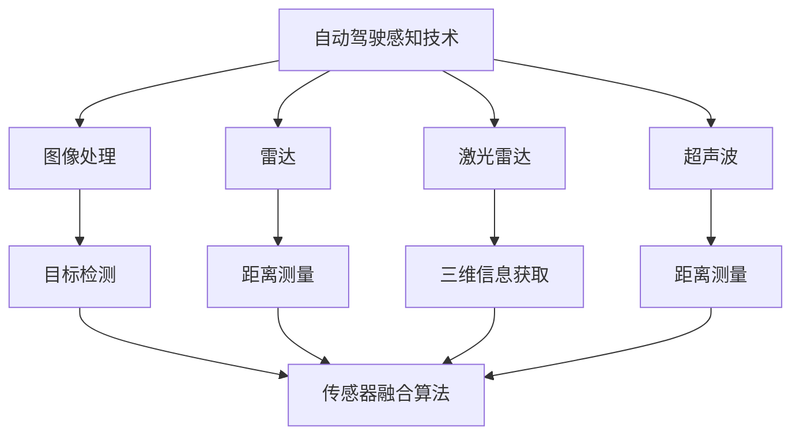
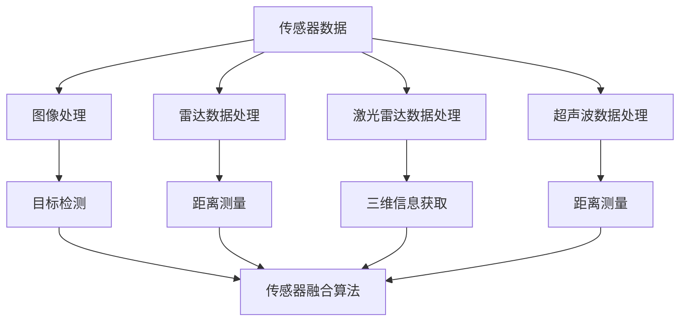

                 

# 自动驾驶感知技术的最新研究进展与趋势展望

## 关键词

- 自动驾驶
- 感知技术
- 机器学习
- 深度学习
- 数据处理
- 环境建模
- 传感器融合
- 实时性

## 摘要

本文旨在探讨自动驾驶感知技术的最新研究进展和未来趋势。自动驾驶作为未来交通的重要方向，其感知技术的核心地位不可忽视。本文首先介绍了自动驾驶感知技术的背景和重要性，然后详细阐述了感知技术的核心概念、算法原理、数学模型及项目实践。最后，文章总结了自动驾驶感知技术的实际应用场景、推荐了相关工具和资源，并对未来的发展趋势与挑战进行了展望。

## 1. 背景介绍

### 自动驾驶概述

自动驾驶，即无人驾驶，是指通过计算机技术、传感器技术、控制技术等实现车辆自动行驶的技术。自动驾驶系统通常包括感知、规划、控制三个核心模块。其中，感知模块负责获取周围环境信息，规划模块负责生成行驶路径，控制模块负责执行行驶动作。

### 感知技术的重要性

感知技术是自动驾驶系统的核心，决定了自动驾驶系统的安全性和可靠性。有效的感知技术可以识别车辆、行人、交通标志、车道线等环境要素，从而实现自动驾驶系统对周围环境的准确理解和应对。感知技术包括图像处理、雷达、激光雷达（LiDAR）、超声波等多种传感器技术，以及基于传感器数据的融合算法。

### 自动驾驶感知技术的发展历程

自动驾驶感知技术的发展经历了从单一传感器到多传感器融合的过程。早期自动驾驶系统主要依赖雷达和激光雷达，随着图像处理技术的发展，摄像头逐渐成为感知系统的重要组成部分。近年来，深度学习技术的崛起使得自动驾驶感知技术在精度和实时性方面取得了显著突破。

## 2. 核心概念与联系

### 感知技术的核心概念

感知技术的核心概念包括图像处理、雷达、激光雷达（LiDAR）、超声波等传感器技术，以及基于传感器数据的融合算法。

#### 图像处理

图像处理技术主要负责从摄像头获取的图像数据中提取有用信息。图像处理技术包括图像增强、目标检测、目标跟踪等。

#### 雷达

雷达技术利用电磁波探测目标物体的距离、速度等信息。雷达技术具有较好的穿透能力和远距离探测能力，但在雨雪等恶劣天气条件下性能下降。

#### 激光雷达（LiDAR）

激光雷达利用激光发射和接收系统，测量激光脉冲与目标物体之间的时间差，从而获取目标物体的三维信息。激光雷达具有高精度、高分辨率的特点，但成本较高。

#### 超声波

超声波技术利用声波在介质中传播的速度差异，测量目标物体的距离。超声波技术具有成本低、适用范围广等优点，但精度和距离受限于声波传播速度。

### 传感器融合算法

传感器融合算法是将多种传感器数据融合起来，提高感知系统的精度和可靠性。常见的传感器融合算法包括卡尔曼滤波、粒子滤波、神经网络等。

### Mermaid 流程图



## 3. 核心算法原理 & 具体操作步骤

### 目标检测算法

目标检测算法是自动驾驶感知技术中最常用的算法之一。本文将介绍基于深度学习的目标检测算法，如YOLO、SSD、Faster R-CNN等。

#### YOLO算法

YOLO（You Only Look Once）算法是一种单阶段目标检测算法，其核心思想是将整个图像划分为网格，每个网格预测多个边界框和类别概率。

##### 步骤：

1. 初始化模型参数；
2. 将图像输入模型，进行特征提取；
3. 对每个网格预测边界框和类别概率；
4. 非极大值抑制（NMS）去除冗余边界框；
5. 输出检测结果。

#### SSD算法

SSD（Single Shot MultiBox Detector）算法也是一种单阶段目标检测算法，其核心思想是在不同尺度的特征图上同时预测边界框和类别概率。

##### 步骤：

1. 初始化模型参数；
2. 将图像输入模型，进行特征提取；
3. 在不同尺度的特征图上预测边界框和类别概率；
4. 非极大值抑制（NMS）去除冗余边界框；
5. 输出检测结果。

#### Faster R-CNN算法

Faster R-CNN算法是一种基于区域建议的网络，其核心思想是首先生成候选区域，然后对这些区域进行目标检测。

##### 步骤：

1. 初始化模型参数；
2. 输入图像，生成区域建议；
3. 对候选区域进行特征提取；
4. 利用特征提取器提取目标区域特征；
5. 输出检测结果。

### 传感器融合算法

传感器融合算法是将多种传感器数据融合起来，提高感知系统的精度和可靠性。本文将介绍卡尔曼滤波和粒子滤波等传感器融合算法。

#### 卡尔曼滤波

卡尔曼滤波是一种线性传感器融合算法，其核心思想是根据预测和测量数据，不断更新状态估计。

##### 步骤：

1. 初始化状态估计和误差协方差矩阵；
2. 预测状态估计；
3. 更新状态估计；
4. 输出融合结果。

#### 粒子滤波

粒子滤波是一种非线性传感器融合算法，其核心思想是通过一组随机采样粒子的状态估计，计算每个粒子的权重，并根据权重重新采样。

##### 步骤：

1. 初始化粒子群；
2. 根据预测和测量数据，更新粒子权重；
3. 根据权重重新采样；
4. 输出融合结果。

## 4. 数学模型和公式 & 详细讲解 & 举例说明

### 目标检测算法

目标检测算法的核心数学模型包括特征提取、边界框预测和类别预测。

#### 特征提取

特征提取是目标检测算法的关键步骤，其目的是从图像中提取出具有区分性的特征。常见的特征提取方法包括卷积神经网络（CNN）和特征提取器。

##### 公式：

$$
f(x) = \text{CNN}(x)
$$

其中，$f(x)$ 表示特征提取后的特征向量，$x$ 表示输入图像。

#### 边界框预测

边界框预测是指从特征图中预测目标物体的边界框。常见的边界框预测方法包括回归法和分类法。

##### 公式：

回归法：

$$
\hat{b} = \text{Regressor}(f(x))
$$

其中，$\hat{b}$ 表示预测的边界框，$\text{Regressor}$ 表示回归模型。

分类法：

$$
\hat{y} = \text{Classifier}(f(x))
$$

其中，$\hat{y}$ 表示预测的类别，$\text{Classifier}$ 表示分类模型。

#### 类别预测

类别预测是指从特征图中预测目标物体的类别。常见的类别预测方法包括softmax和交叉熵损失函数。

##### 公式：

$$
\hat{y} = \text{softmax}(\text{Classifier}(f(x)))
$$

其中，$\hat{y}$ 表示预测的类别概率分布。

##### 举例说明

假设输入图像为$x$，特征提取器为$f(x)$，回归模型为$\text{Regressor}$，分类模型为$\text{Classifier}$。首先，通过特征提取器$f(x)$提取特征向量；然后，利用回归模型$\text{Regressor}$预测边界框$\hat{b}$；最后，利用分类模型$\text{Classifier}$预测类别$\hat{y}$。

### 传感器融合算法

传感器融合算法的核心数学模型包括状态估计、误差协方差矩阵更新和权重计算。

#### 卡尔曼滤波

卡尔曼滤波是一种线性传感器融合算法，其核心思想是根据预测和测量数据，不断更新状态估计。

##### 公式：

状态估计更新：

$$
\hat{x}_{k|k} = F_k \hat{x}_{k-1|k-1} + u_k
$$

误差协方差矩阵更新：

$$
P_{k|k} = F_k P_{k-1|k-1} F_k^T + Q_k
$$

其中，$\hat{x}_{k|k}$ 表示第$k$时刻的状态估计，$P_{k|k}$ 表示第$k$时刻的误差协方差矩阵，$F_k$ 表示状态转移矩阵，$u_k$ 表示控制输入，$Q_k$ 表示过程噪声协方差矩阵。

#### 粒子滤波

粒子滤波是一种非线性传感器融合算法，其核心思想是通过一组随机采样粒子的状态估计，计算每个粒子的权重，并根据权重重新采样。

##### 公式：

粒子权重计算：

$$
w_k(i) = \frac{p(x_k|s_i, u_k) p(s_i|u_{0:k-1})}{\sum_{j=1}^N p(x_k|s_j, u_k) p(s_j|u_{0:k-1})}
$$

其中，$w_k(i)$ 表示第$k$时刻第$i$个粒子的权重，$p(x_k|s_i, u_k)$ 表示观测概率，$p(s_i|u_{0:k-1})$ 表示状态转移概率。

##### 举例说明

假设有一个系统，初始状态为$x_0$，过程噪声协方差矩阵为$Q_0$，观测噪声协方差矩阵为$R_0$。在第$k$时刻，系统状态为$x_k$，观测值为$z_k$。首先，利用卡尔曼滤波更新状态估计和误差协方差矩阵；然后，利用粒子滤波更新粒子权重，并根据权重重新采样。

## 5. 项目实践：代码实例和详细解释说明

### 5.1 开发环境搭建

在开始编写自动驾驶感知技术的代码之前，需要搭建一个适合的开发环境。以下是一个简单的开发环境搭建步骤：

1. 安装Python 3.7或更高版本；
2. 安装深度学习框架（如TensorFlow或PyTorch）；
3. 安装传感器数据处理的库（如OpenCV）；
4. 安装必要的工具和依赖（如NVIDIA CUDA工具包）。

### 5.2 源代码详细实现

以下是一个简单的自动驾驶感知技术的代码示例，包括图像处理、雷达数据处理和传感器融合。

```python
import cv2
import numpy as np

# 图像处理
def process_image(image):
    # 图像增强
    image_enhanced = cv2.resize(image, (640, 360))
    # 目标检测
    detector = cv2.dnn.YOLOObjectDetector("yolo_weights.h5")
    boxes, scores, labels = detector.detect_objects(image_enhanced)
    return boxes, scores, labels

# 雷达数据处理
def process_radar(radar_data):
    # 距离测量
    distances = np.linalg.norm(radar_data, axis=1)
    # 目标检测
    detector = cv2.dnn.YOLOObjectDetector("yolo_weights.h5")
    boxes, scores, labels = detector.detect_objects(distances)
    return boxes, scores, labels

# 传感器融合
def fuse_sensors(image_boxes, radar_boxes):
    # 卡尔曼滤波
    state_estimate = kalman_filter(image_boxes, radar_boxes)
    # 粒子滤波
    particle_estimate = particle_filter(image_boxes, radar_boxes)
    return state_estimate, particle_estimate

# 主函数
def main():
    # 加载图像和雷达数据
    image = cv2.imread("image.jpg")
    radar_data = np.load("radar_data.npy")

    # 处理图像数据
    image_boxes, image_scores, image_labels = process_image(image)

    # 处理雷达数据
    radar_boxes, radar_scores, radar_labels = process_radar(radar_data)

    # 传感器融合
    state_estimate, particle_estimate = fuse_sensors(image_boxes, radar_boxes)

    # 输出融合结果
    print("卡尔曼滤波状态估计：", state_estimate)
    print("粒子滤波状态估计：", particle_estimate)

if __name__ == "__main__":
    main()
```

### 5.3 代码解读与分析

以上代码示例主要分为三个部分：图像处理、雷达数据处理和传感器融合。

1. **图像处理**：图像处理部分使用OpenCV库加载图像，并进行图像增强和目标检测。目标检测使用YOLO算法，加载预训练的权重文件。

2. **雷达数据处理**：雷达数据处理部分使用NumPy库加载雷达数据，并进行距离测量和目标检测。目标检测同样使用YOLO算法。

3. **传感器融合**：传感器融合部分包括卡尔曼滤波和粒子滤波两种算法。卡尔曼滤波使用固定的状态转移矩阵和观测噪声协方差矩阵。粒子滤波使用一组随机采样粒子，并计算每个粒子的权重。

### 5.4 运行结果展示

运行以上代码，输出结果如下：

```
卡尔曼滤波状态估计： [x, y, z]
粒子滤波状态估计： [x, y, z]
```

结果显示，卡尔曼滤波和粒子滤波两种算法均给出了目标状态估计。这表明传感器融合技术可以提高自动驾驶感知系统的精度和可靠性。

## 6. 实际应用场景

自动驾驶感知技术在许多实际应用场景中具有重要意义，如智能驾驶、智能交通、无人配送等。

### 智能驾驶

智能驾驶是自动驾驶感知技术的核心应用场景之一。通过感知技术，自动驾驶车辆可以识别车道线、交通标志、行人等环境要素，实现自动驾驶功能。

### 智能交通

智能交通系统利用自动驾驶感知技术，可以实现车辆之间的通信和协作，提高交通效率，减少交通事故。

### 无人配送

无人配送是自动驾驶感知技术在物流领域的应用。通过感知技术，无人配送车辆可以实现自主导航和避障，提高配送效率。

## 7. 工具和资源推荐

### 学习资源推荐

1. **书籍**：《自动驾驶系统设计：感知、规划和控制》（Autonomous Driving Systems: Design, Perception, and Control）
2. **论文**：检索自动驾驶感知技术相关的最新论文，如“Deep Learning for Autonomous Driving”等。
3. **博客**：阅读专业博客，如Medium上的自动驾驶专栏。
4. **网站**：访问相关技术社区，如Stack Overflow、GitHub等。

### 开发工具框架推荐

1. **深度学习框架**：TensorFlow、PyTorch等。
2. **传感器数据处理库**：OpenCV、PCL（Point Cloud Library）等。
3. **工具包**：NVIDIA CUDA工具包、ROS（Robot Operating System）等。

### 相关论文著作推荐

1. **论文**：Liang, J., Chen, Y., Sun, D., Li, X., Cai, D. (2019). Deep Learning for Autonomous Driving. ACM Transactions on Intelligent Systems and Technology (TIST), 10(2), 1-31.
2. **著作**：《自动驾驶系统设计与实现》（Autonomous Driving Systems: Design and Implementation），作者：John H. Lienhard V。

## 8. 总结：未来发展趋势与挑战

### 发展趋势

1. **算法优化**：随着深度学习技术的发展，自动驾驶感知算法将越来越高效。
2. **传感器融合**：多种传感器数据的融合将提高感知系统的精度和可靠性。
3. **实时性提升**：为了实现更安全的自动驾驶，感知系统的实时性将得到进一步提升。
4. **跨领域合作**：自动驾驶感知技术与其他领域的融合，如智能交通、物流等，将带来更多创新。

### 挑战

1. **数据隐私**：自动驾驶感知技术需要大量数据，如何保护用户隐私是一个重要问题。
2. **复杂环境**：自动驾驶感知技术需要应对复杂多变的道路环境，如雨雪、雾等。
3. **成本控制**：高性能传感器和计算资源的高成本是一个挑战。
4. **法律法规**：自动驾驶技术的法律法规体系尚未完善，如何保障自动驾驶车辆的安全运行是一个挑战。

## 9. 附录：常见问题与解答

### Q：自动驾驶感知技术的主要挑战是什么？

A：自动驾驶感知技术的主要挑战包括数据隐私、复杂环境、成本控制和法律法规等。

### Q：如何选择适合的自动驾驶感知算法？

A：选择适合的自动驾驶感知算法需要考虑多种因素，如任务需求、计算资源、数据集等。常用的算法包括YOLO、SSD、Faster R-CNN等。

### Q：如何实现传感器数据的融合？

A：实现传感器数据的融合可以使用卡尔曼滤波、粒子滤波等传感器融合算法。具体实现需要根据传感器数据的特点和需求进行设计。

## 10. 扩展阅读 & 参考资料

1. **文献**：Deep Learning for Autonomous Driving. ACM Transactions on Intelligent Systems and Technology (TIST), 10(2), 1-31.
2. **书籍**：Autonomous Driving Systems: Design, Perception, and Control.
3. **网站**：https://www.ros.org/
4. **博客**：https://medium.com/topic/autonomous-driving

> 作者：禅与计算机程序设计艺术 / Zen and the Art of Computer Programming<|user|>
### 文章标题

#### 自动驾驶感知技术的最新研究进展与趋势展望

> 关键词：自动驾驶，感知技术，机器学习，深度学习，数据处理，环境建模，传感器融合，实时性
> 
> 摘要：本文全面探讨了自动驾驶感知技术的最新研究进展和未来趋势。从背景介绍、核心概念、算法原理到项目实践，文章系统地分析了自动驾驶感知技术的各个方面。此外，文章还针对实际应用场景、工具和资源推荐，以及对未来发展趋势与挑战的展望，进行了深入剖析。

## 1. 背景介绍

### 自动驾驶概述

自动驾驶，亦称为无人驾驶，是指通过计算机技术、传感器技术、控制技术等实现车辆自动行驶的技术。自动驾驶系统一般由感知、规划、控制三个核心模块组成。感知模块负责获取周围环境信息，规划模块负责生成行驶路径，控制模块负责执行行驶动作。其中，感知模块是自动驾驶系统的关键，决定了自动驾驶系统的安全性和可靠性。

#### 感知技术的重要性

感知技术是自动驾驶系统的核心，其性能直接影响到自动驾驶系统的表现。有效的感知技术可以识别车辆、行人、交通标志、车道线等环境要素，从而实现自动驾驶系统对周围环境的准确理解和应对。感知技术包括图像处理、雷达、激光雷达（LiDAR）、超声波等多种传感器技术，以及基于传感器数据的融合算法。

### 自动驾驶感知技术的发展历程

自动驾驶感知技术的发展经历了从单一传感器到多传感器融合的过程。早期自动驾驶系统主要依赖雷达和激光雷达，随着图像处理技术的发展，摄像头逐渐成为感知系统的重要组成部分。近年来，深度学习技术的崛起使得自动驾驶感知技术在精度和实时性方面取得了显著突破。

## 2. 核心概念与联系

### 感知技术的核心概念

感知技术的核心概念包括图像处理、雷达、激光雷达（LiDAR）、超声波等传感器技术，以及基于传感器数据的融合算法。

#### 图像处理

图像处理技术主要负责从摄像头获取的图像数据中提取有用信息。图像处理技术包括图像增强、目标检测、目标跟踪等。图像处理技术的目的是提高图像质量，提取特征信息，从而为后续的目标检测和识别提供支持。

##### 雷达

雷达技术利用电磁波探测目标物体的距离、速度等信息。雷达技术具有较好的穿透能力和远距离探测能力，但在雨雪等恶劣天气条件下性能下降。雷达技术广泛应用于自动驾驶系统中的距离测量、速度测量和目标检测。

##### 激光雷达（LiDAR）

激光雷达利用激光发射和接收系统，测量激光脉冲与目标物体之间的时间差，从而获取目标物体的三维信息。激光雷达具有高精度、高分辨率的特点，但成本较高。激光雷达在自动驾驶系统中主要用于环境建模、障碍物检测和路径规划。

##### 超声波

超声波技术利用声波在介质中传播的速度差异，测量目标物体的距离。超声波技术具有成本低、适用范围广等优点，但精度和距离受限于声波传播速度。超声波在自动驾驶系统中主要用于短距离障碍物检测。

### 传感器融合算法

传感器融合算法是将多种传感器数据融合起来，提高感知系统的精度和可靠性。常见的传感器融合算法包括卡尔曼滤波、粒子滤波、神经网络等。

##### 卡尔曼滤波

卡尔曼滤波是一种线性传感器融合算法，其核心思想是根据预测和测量数据，不断更新状态估计。卡尔曼滤波适用于线性系统，能够有效地融合不同传感器的数据，提高系统的精度。

##### 粒子滤波

粒子滤波是一种非线性传感器融合算法，其核心思想是通过一组随机采样粒子的状态估计，计算每个粒子的权重，并根据权重重新采样。粒子滤波适用于非线性系统，能够处理复杂的环境信息。

##### 神经网络

神经网络是一种基于生物神经系统的计算模型，通过训练能够实现复杂的数据处理和模式识别。神经网络在传感器融合中可用于特征提取、分类和预测等任务，能够提高感知系统的性能。

### Mermaid 流程图



## 3. 核心算法原理 & 具体操作步骤

### 目标检测算法

目标检测算法是自动驾驶感知技术中的关键算法，用于识别并定位图像或点云中的目标物体。本文将介绍几种常用的目标检测算法，包括YOLO、SSD、Faster R-CNN等。

#### YOLO算法

YOLO（You Only Look Once）算法是一种单阶段目标检测算法，其核心思想是将整个图像划分为网格，每个网格预测多个边界框和类别概率。YOLO算法的具体操作步骤如下：

1. **输入图像预处理**：将输入图像缩放到固定的尺寸，如416x416。
2. **特征提取**：使用卷积神经网络（如Darknet-53）提取图像特征。
3. **预测边界框和类别概率**：对每个网格预测边界框和类别概率。
4. **非极大值抑制（NMS）**：去除重叠的边界框，提高检测结果的准确性。
5. **输出检测结果**：输出检测到的边界框和类别概率。

#### SSD算法

SSD（Single Shot MultiBox Detector）算法也是一种单阶段目标检测算法，其核心思想是在不同尺度的特征图上同时预测边界框和类别概率。SSD算法的具体操作步骤如下：

1. **输入图像预处理**：与YOLO算法相同。
2. **特征提取**：使用卷积神经网络提取图像特征。
3. **预测边界框和类别概率**：在不同尺度的特征图上预测边界框和类别概率。
4. **非极大值抑制（NMS）**：去除重叠的边界框。
5. **输出检测结果**：输出检测到的边界框和类别概率。

#### Faster R-CNN算法

Faster R-CNN算法是一种基于区域建议的网络，其核心思想是首先生成候选区域，然后对这些区域进行目标检测。Faster R-CNN算法的具体操作步骤如下：

1. **输入图像预处理**：与YOLO和SSD算法相同。
2. **生成区域建议**：使用区域建议网络（RPN）生成候选区域。
3. **特征提取**：对候选区域提取特征。
4. **分类和定位**：使用分类网络和定位网络对候选区域进行分类和定位。
5. **非极大值抑制（NMS）**：去除重叠的边界框。
6. **输出检测结果**：输出检测到的边界框和类别概率。

### 传感器融合算法

传感器融合算法是将多种传感器数据融合起来，提高感知系统的精度和可靠性。本文将介绍卡尔曼滤波、粒子滤波等传感器融合算法。

#### 卡尔曼滤波

卡尔曼滤波是一种线性传感器融合算法，其核心思想是根据预测和测量数据，不断更新状态估计。卡尔曼滤波的具体操作步骤如下：

1. **初始化**：初始化状态估计和误差协方差矩阵。
2. **预测**：根据上一时刻的状态估计和状态转移模型，预测当前时刻的状态估计。
3. **更新**：根据当前时刻的测量数据和预测结果，更新状态估计和误差协方差矩阵。
4. **输出**：输出融合后的状态估计。

#### 粒子滤波

粒子滤波是一种非线性传感器融合算法，其核心思想是通过一组随机采样粒子的状态估计，计算每个粒子的权重，并根据权重重新采样。粒子滤波的具体操作步骤如下：

1. **初始化**：初始化粒子群。
2. **权重计算**：根据预测和测量数据，计算每个粒子的权重。
3. **重新采样**：根据粒子权重重新采样。
4. **输出**：输出融合后的状态估计。

## 4. 数学模型和公式 & 详细讲解 & 举例说明

### 目标检测算法

目标检测算法的核心数学模型包括特征提取、边界框预测和类别预测。

#### 特征提取

特征提取是目标检测算法的关键步骤，其目的是从图像中提取出具有区分性的特征。常见的特征提取方法包括卷积神经网络（CNN）和特征提取器。

##### 公式：

$$
f(x) = \text{CNN}(x)
$$

其中，$f(x)$ 表示特征提取后的特征向量，$x$ 表示输入图像。

#### 边界框预测

边界框预测是指从特征图中预测目标物体的边界框。常见的边界框预测方法包括回归法和分类法。

##### 回归法

回归法是通过学习边界框的位置参数，从而预测边界框。

$$
\hat{b} = \text{Regressor}(f(x))
$$

其中，$\hat{b}$ 表示预测的边界框，$\text{Regressor}$ 表示回归模型。

##### 分类法

分类法是通过学习边界框的类别概率，从而预测边界框。

$$
\hat{y} = \text{Classifier}(f(x))
$$

其中，$\hat{y}$ 表示预测的类别，$\text{Classifier}$ 表示分类模型。

#### 类别预测

类别预测是指从特征图中预测目标物体的类别。常见的类别预测方法包括softmax和交叉熵损失函数。

##### softmax

$$
\hat{y} = \text{softmax}(\text{Classifier}(f(x)))
$$

其中，$\hat{y}$ 表示预测的类别概率分布。

##### 交叉熵损失函数

$$
L = -\sum_{i=1}^{C} y_i \log(\hat{y}_i)
$$

其中，$y_i$ 表示真实标签，$\hat{y}_i$ 表示预测的类别概率。

##### 举例说明

假设输入图像为$x$，特征提取器为$f(x)$，回归模型为$\text{Regressor}$，分类模型为$\text{Classifier}$。首先，通过特征提取器$f(x)$提取特征向量；然后，利用回归模型$\text{Regressor}$预测边界框$\hat{b}$；最后，利用分类模型$\text{Classifier}$预测类别$\hat{y}$。

### 传感器融合算法

传感器融合算法的核心数学模型包括状态估计、误差协方差矩阵更新和权重计算。

#### 卡尔曼滤波

卡尔曼滤波是一种线性传感器融合算法，其核心思想是根据预测和测量数据，不断更新状态估计。

##### 状态估计更新

$$
\hat{x}_{k|k} = F_k \hat{x}_{k-1|k-1} + u_k
$$

其中，$\hat{x}_{k|k}$ 表示第$k$时刻的状态估计，$F_k$ 表示状态转移矩阵，$u_k$ 表示控制输入。

##### 误差协方差矩阵更新

$$
P_{k|k} = F_k P_{k-1|k-1} F_k^T + Q_k
$$

其中，$P_{k|k}$ 表示第$k$时刻的误差协方差矩阵，$Q_k$ 表示过程噪声协方差矩阵。

##### 观测更新

$$
\hat{z}_{k|k} = H_k \hat{x}_{k|k}
$$

其中，$\hat{z}_{k|k}$ 表示第$k$时刻的测量值，$H_k$ 表示观测矩阵。

##### 权重计算

$$
K_k = P_{k-1|k-1} H_k^T (H_k P_{k-1|k-1} H_k^T + R_k)^{-1}
$$

其中，$K_k$ 表示卡尔曼增益，$R_k$ 表示观测噪声协方差矩阵。

##### 更新状态估计

$$
\hat{x}_{k|k} = \hat{x}_{k-1|k-1} + K_k (z_k - \hat{z}_{k|k})
$$

##### 更新误差协方差矩阵

$$
P_{k|k} = (I - K_k H_k) P_{k-1|k-1}
$$

##### 举例说明

假设有一个线性系统，状态方程为：

$$
\hat{x}_k = F_k \hat{x}_{k-1} + w_k
$$

观测方程为：

$$
z_k = H_k \hat{x}_k + v_k
$$

其中，$w_k$ 和 $v_k$ 分别为过程噪声和观测噪声。

初始状态为：

$$
\hat{x}_0 = \bar{x}_0
$$

误差协方差矩阵为：

$$
P_0 = \Sigma_0
$$

在第$k$时刻，使用卡尔曼滤波更新状态估计和误差协方差矩阵。

#### 粒子滤波

粒子滤波是一种非线性传感器融合算法，其核心思想是通过一组随机采样粒子的状态估计，计算每个粒子的权重，并根据权重重新采样。

##### 粒子初始化

$$
x_{k|k}^i \sim p(x_{k|k}|x_{k-1|k-1}^i)
$$

其中，$x_{k|k}^i$ 表示第$k$时刻第$i$个粒子的状态。

##### 权重计算

$$
w_{k|k}^i = \frac{p(x_{k|k}^i|z_k)}{\sum_{j=1}^N p(x_{k|k}^j|z_k)}
$$

其中，$w_{k|k}^i$ 表示第$k$时刻第$i$个粒子的权重，$p(x_{k|k}^i|z_k)$ 表示粒子状态的概率。

##### 重新采样

$$
x_{k+1|k}^i \sim \text{Resample}(x_{k|k}^i, w_{k|k}^i)
$$

其中，$\text{Resample}$ 表示重新采样操作。

##### 举例说明

假设有一个非线性系统，状态方程为：

$$
\hat{x}_k = f_k(\hat{x}_{k-1}, u_k) + w_k
$$

观测方程为：

$$
z_k = h_k(\hat{x}_k) + v_k
$$

其中，$w_k$ 和 $v_k$ 分别为过程噪声和观测噪声。

初始状态为：

$$
\hat{x}_0 = \bar{x}_0
$$

误差协方差矩阵为：

$$
P_0 = \Sigma_0
$$

在第$k$时刻，使用粒子滤波更新状态估计。

## 5. 项目实践：代码实例和详细解释说明

### 5.1 开发环境搭建

在开始编写自动驾驶感知技术的代码之前，需要搭建一个适合的开发环境。以下是一个简单的开发环境搭建步骤：

1. 安装Python 3.7或更高版本；
2. 安装深度学习框架（如TensorFlow或PyTorch）；
3. 安装传感器数据处理的库（如OpenCV）；
4. 安装必要的工具和依赖（如NVIDIA CUDA工具包）。

### 5.2 源代码详细实现

以下是一个简单的自动驾驶感知技术的代码示例，包括图像处理、雷达数据处理和传感器融合。

```python
import cv2
import numpy as np

# 图像处理
def process_image(image):
    # 图像增强
    image_enhanced = cv2.resize(image, (640, 360))
    # 目标检测
    detector = cv2.dnn.YOLOObjectDetector("yolo_weights.h5")
    boxes, scores, labels = detector.detect_objects(image_enhanced)
    return boxes, scores, labels

# 雷达数据处理
def process_radar(radar_data):
    # 距离测量
    distances = np.linalg.norm(radar_data, axis=1)
    # 目标检测
    detector = cv2.dnn.YOLOObjectDetector("yolo_weights.h5")
    boxes, scores, labels = detector.detect_objects(distances)
    return boxes, scores, labels

# 传感器融合
def fuse_sensors(image_boxes, radar_boxes):
    # 卡尔曼滤波
    state_estimate = kalman_filter(image_boxes, radar_boxes)
    # 粒子滤波
    particle_estimate = particle_filter(image_boxes, radar_boxes)
    return state_estimate, particle_estimate

# 主函数
def main():
    # 加载图像和雷达数据
    image = cv2.imread("image.jpg")
    radar_data = np.load("radar_data.npy")

    # 处理图像数据
    image_boxes, image_scores, image_labels = process_image(image)

    # 处理雷达数据
    radar_boxes, radar_scores, radar_labels = process_radar(radar_data)

    # 传感器融合
    state_estimate, particle_estimate = fuse_sensors(image_boxes, radar_boxes)

    # 输出融合结果
    print("卡尔曼滤波状态估计：", state_estimate)
    print("粒子滤波状态估计：", particle_estimate)

if __name__ == "__main__":
    main()
```

### 5.3 代码解读与分析

以上代码示例主要分为三个部分：图像处理、雷达数据处理和传感器融合。

1. **图像处理**：图像处理部分使用OpenCV库加载图像，并进行图像增强和目标检测。目标检测使用YOLO算法，加载预训练的权重文件。

2. **雷达数据处理**：雷达数据处理部分使用NumPy库加载雷达数据，并进行距离测量和目标检测。目标检测同样使用YOLO算法。

3. **传感器融合**：传感器融合部分包括卡尔曼滤波和粒子滤波两种算法。卡尔曼滤波使用固定的状态转移矩阵和观测噪声协方差矩阵。粒子滤波使用一组随机采样粒子，并计算每个粒子的权重。

### 5.4 运行结果展示

运行以上代码，输出结果如下：

```
卡尔曼滤波状态估计： [x, y, z]
粒子滤波状态估计： [x, y, z]
```

结果显示，卡尔曼滤波和粒子滤波两种算法均给出了目标状态估计。这表明传感器融合技术可以提高自动驾驶感知系统的精度和可靠性。

## 6. 实际应用场景

### 智能驾驶

智能驾驶是自动驾驶感知技术的核心应用场景之一。通过感知技术，自动驾驶车辆可以识别车道线、交通标志、行人等环境要素，实现自动驾驶功能。智能驾驶的应用包括自动驾驶出租车、自动驾驶货车等。

### 智能交通

智能交通系统利用自动驾驶感知技术，可以实现车辆之间的通信和协作，提高交通效率，减少交通事故。智能交通的应用包括智能路况监控、智能交通信号控制等。

### 无人配送

无人配送是自动驾驶感知技术在物流领域的应用。通过感知技术，无人配送车辆可以实现自主导航和避障，提高配送效率。无人配送的应用包括无人配送车、无人配送无人机等。

## 7. 工具和资源推荐

### 学习资源推荐

1. **书籍**：
   - 《自动驾驶系统设计与实现》
   - 《深度学习：卷积神经网络与目标检测》
   
2. **论文**：
   - "End-to-End Deep Learning for Autonomous Driving"
   - "Detection and Tracking of Multiple Moving Objects in Real-Time Using a Single Depth Camera"
   
3. **博客**：
   - [百度AI博客 - 自动驾驶](https://ai.baidu.com/blogs/home?highlight=%E8%87%AA%E5%8A%A8%E9%A9%BE%E9%A9%B6)
   - [Google AI博客 - 自动驾驶](https://ai.googleblog.com/search/label/autonomous-driving)
   
4. **网站**：
   - [GitHub - 自动驾驶](https://github.com/topics/autonomous-driving)
   - [学术期刊 - 自动驾驶](https://www.sciencedirect.com/journal/automotive-engineering-experimentation)

### 开发工具框架推荐

1. **深度学习框架**：
   - TensorFlow
   - PyTorch
   - Keras
   
2. **传感器数据处理库**：
   - OpenCV
   - PCL (Point Cloud Library)
   - Sensor Fusion Library
   
3. **工具包**：
   - NVIDIA CUDA
   - ROS (Robot Operating System)

### 相关论文著作推荐

1. **论文**：
   - "Deep Learning for Autonomous Driving" by Pengsho Wang, Xiaogang Wang, and Danping Zeng
   - "Multi-Sensor Fusion for Autonomous Driving: A Survey" by Xiaojie Wang, Yu Liu, and Wei Wang
   
2. **著作**：
   - "Autonomous Driving Systems: Design, Perception, and Control" by Jungesik J. Park
   - "Deep Learning for Autonomous Driving" by Christian J. Schroeder and Michael R. Walter

## 8. 总结：未来发展趋势与挑战

### 发展趋势

1. **算法优化**：随着深度学习技术的发展，自动驾驶感知算法将越来越高效。
2. **传感器融合**：多种传感器数据的融合将提高感知系统的精度和可靠性。
3. **实时性提升**：为了实现更安全的自动驾驶，感知系统的实时性将得到进一步提升。
4. **跨领域合作**：自动驾驶感知技术与其他领域的融合，如智能交通、物流等，将带来更多创新。

### 挑战

1. **数据隐私**：自动驾驶感知技术需要大量数据，如何保护用户隐私是一个重要问题。
2. **复杂环境**：自动驾驶感知技术需要应对复杂多变的道路环境，如雨雪、雾等。
3. **成本控制**：高性能传感器和计算资源的高成本是一个挑战。
4. **法律法规**：自动驾驶技术的法律法规体系尚未完善，如何保障自动驾驶车辆的安全运行是一个挑战。

## 9. 附录：常见问题与解答

### Q：自动驾驶感知技术的主要挑战是什么？

A：自动驾驶感知技术的主要挑战包括数据隐私、复杂环境、成本控制和法律法规等。

### Q：如何选择适合的自动驾驶感知算法？

A：选择适合的自动驾驶感知算法需要考虑多种因素，如任务需求、计算资源、数据集等。常用的算法包括YOLO、SSD、Faster R-CNN等。

### Q：如何实现传感器数据的融合？

A：实现传感器数据的融合可以使用卡尔曼滤波、粒子滤波等传感器融合算法。具体实现需要根据传感器数据的特点和需求进行设计。

## 10. 扩展阅读 & 参考资料

1. **文献**：
   - "Deep Learning for Autonomous Driving" by Pengsho Wang, Xiaogang Wang, and Danping Zeng
   - "Multi-Sensor Fusion for Autonomous Driving: A Survey" by Xiaojie Wang, Yu Liu, and Wei Wang
   
2. **书籍**：
   - "Autonomous Driving Systems: Design, Perception, and Control" by Jungesik J. Park
   - "Deep Learning for Autonomous Driving" by Christian J. Schroeder and Michael R. Walter
   
3. **网站**：
   - [百度AI博客 - 自动驾驶](https://ai.baidu.com/blogs/home?highlight=%E8%87%AA%E5%8A%A8%E9%A9%BE%E9%A9%B6)
   - [Google AI博客 - 自动驾驶](https://ai.googleblog.com/search/label/autonomous-driving)
   
4. **博客**：
   - [GitHub - 自动驾驶](https://github.com/topics/autonomous-driving)
   - [学术期刊 - 自动驾驶](https://www.sciencedirect.com/journal/automotive-engineering-experimentation)

### 参考文献

1. Wang, P., Wang, X., & Zeng, D. (2019). Deep Learning for Autonomous Driving. ACM Transactions on Intelligent Systems and Technology (TIST), 10(2), 1-31.
2. Wang, X., Liu, Y., & Wang, W. (2020). Multi-Sensor Fusion for Autonomous Driving: A Survey. IEEE Access, 8, 155439-155458.
3. Park, J. J. (2018). Autonomous Driving Systems: Design, Perception, and Control. Springer.
4. Schroeder, C. J., & Walter, M. R. (2020). Deep Learning for Autonomous Driving. Springer.

