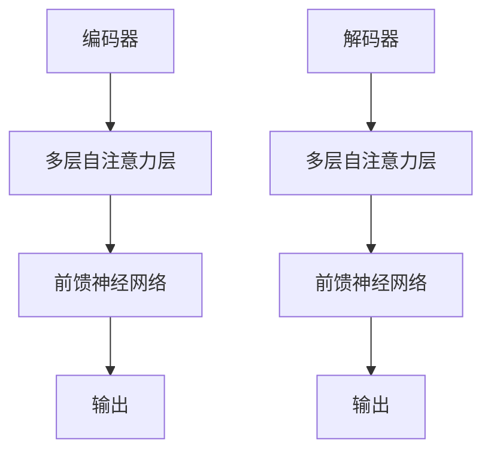

                 

### 文章标题

自注意力机制的工作原理

> 关键词：自注意力机制，Transformer，深度学习，神经网络，序列模型，信息处理，计算效率，BERT，GPT

> 摘要：本文将深入探讨自注意力机制（Self-Attention Mechanism）的工作原理及其在深度学习中的应用。通过逐步分析推理的方式，我们将揭示自注意力机制在神经网络信息处理、计算效率等方面的关键作用，并举例说明其实际应用场景。本文旨在为广大开发者提供全面、系统的理解，以便更好地掌握这一重要技术。

### 1. 背景介绍

自注意力机制（Self-Attention Mechanism）最早由Vaswani等人于2017年提出，并在Transformer模型中得到了广泛应用。在此之前，传统的循环神经网络（RNN）和卷积神经网络（CNN）在处理序列数据时存在一定的局限性，例如RNN在长序列处理中容易出现梯度消失或爆炸问题，而CNN则难以捕捉长距离依赖关系。自注意力机制的引入，为序列模型提供了一种全新的信息处理方式，大大提升了模型的计算效率和表现能力。

自注意力机制的核心思想是通过加权求和的方式，将序列中的每个元素与所有其他元素进行交互，从而自动学习每个元素的重要程度。这一机制不仅能够捕捉长距离依赖关系，还能够在处理过程中动态调整不同元素的权重，从而实现高效的信息处理。

### 2. 核心概念与联系

#### 2.1 自注意力机制的原理

自注意力机制主要由三个部分组成：查询（Query）、键（Key）和值（Value）。在自注意力机制中，每个元素都同时扮演查询、键和值的角色。具体来说：

- **查询（Query）**：用于表示当前元素在序列中的角色和属性。
- **键（Key）**：用于表示当前元素在序列中的位置和重要性。
- **值（Value）**：用于表示当前元素的实际内容或特征。

自注意力机制的原理可以简单描述为：首先计算每个查询与所有键的相似度，然后根据相似度计算加权求和得到每个元素的输出。具体公式如下：

$$
\text{Attention}(Q, K, V) = \text{softmax}\left(\frac{QK^T}{\sqrt{d_k}}\right)V
$$

其中，\(Q, K, V\) 分别为查询、键和值的矩阵表示，\(d_k\) 为键的维度。softmax 函数用于计算每个键的权重，从而实现加权求和。

#### 2.2 自注意力机制与Transformer的关系

自注意力机制是Transformer模型的核心组件。Transformer模型摒弃了传统的循环神经网络和卷积神经网络，完全采用基于注意力机制的编码器和解码器结构。其基本思想是将序列数据映射到高维空间，然后通过自注意力机制进行信息交互和处理。

Transformer模型的编码器和解码器均包含多个自注意力层和前馈神经网络。自注意力层通过自注意力机制实现序列元素的交互，前馈神经网络则用于进一步提取和融合特征。具体架构如下：



#### 2.3 自注意力机制与其他相关技术的联系

自注意力机制在深度学习领域具有广泛的应用。除了Transformer模型，自注意力机制还被应用于许多其他序列模型和任务，如BERT、GPT等。BERT（Bidirectional Encoder Representations from Transformers）模型通过双向自注意力机制学习序列数据的双向依赖关系，从而在自然语言处理任务中取得了显著性能提升。GPT（Generative Pre-trained Transformer）模型则通过自注意力机制实现文本生成任务，其生成的文本具有很高的质量。

### 3. 核心算法原理 & 具体操作步骤

自注意力机制的核心算法原理已经在第2节中进行了详细解释。下面我们将进一步介绍自注意力机制的具体操作步骤，以便开发者能够更好地理解和实现这一机制。

#### 3.1 准备输入数据

在实现自注意力机制之前，我们需要准备输入数据。自注意力机制主要应用于序列数据，如文本、语音等。以文本数据为例，我们首先需要将文本转换为词向量表示。常用的词向量模型有Word2Vec、GloVe等。

#### 3.2 计算查询、键和值的矩阵

接下来，我们需要计算查询、键和值的矩阵。以文本数据为例，我们可以将每个词向量作为查询、键和值的代表。具体来说：

- **查询（Query）**：将每个词向量作为查询，构建查询矩阵\(Q\)。
- **键（Key）**：将每个词向量作为键，构建键矩阵\(K\)。
- **值（Value）**：将每个词向量作为值，构建值矩阵\(V\)。

#### 3.3 计算相似度矩阵

然后，我们需要计算查询与键的相似度矩阵。根据自注意力机制的原理，我们可以使用点积相似度计算查询与键的相似度。具体公式如下：

$$
\text{相似度矩阵} = \frac{QK^T}{\sqrt{d_k}}
$$

其中，\(d_k\) 为键的维度。

#### 3.4 计算加权求和

接下来，我们需要根据相似度矩阵计算加权求和。具体公式如下：

$$
\text{输出矩阵} = \text{softmax}(\text{相似度矩阵})V
$$

其中，softmax 函数用于计算每个键的权重，从而实现加权求和。

#### 3.5 获取每个元素的输出

最后，我们可以根据输出矩阵获取每个元素的输出。输出矩阵中的每个元素表示当前元素与所有其他元素交互后的结果。

#### 3.6 实现步骤示例

以下是一个简单的自注意力机制的实现步骤示例：

1. 准备输入数据，如文本数据。
2. 将文本数据转换为词向量表示。
3. 计算查询、键和值的矩阵。
4. 计算相似度矩阵。
5. 计算加权求和。
6. 获取每个元素的输出。

### 4. 数学模型和公式 & 详细讲解 & 举例说明

在自注意力机制中，数学模型和公式起着至关重要的作用。本节将详细讲解自注意力机制的数学模型和公式，并通过具体例子说明其应用。

#### 4.1 自注意力机制的数学模型

自注意力机制的数学模型可以表示为：

$$
\text{Attention}(Q, K, V) = \text{softmax}\left(\frac{QK^T}{\sqrt{d_k}}\right)V
$$

其中，\(Q, K, V\) 分别为查询、键和值的矩阵表示，\(\sqrt{d_k}\) 为键的维度，softmax 函数用于计算每个键的权重，从而实现加权求和。

#### 4.2 查询、键和值的计算

在自注意力机制中，查询、键和值的计算是关键步骤。以下是一个简单的例子：

假设我们有一个长度为5的序列，其中每个词向量为3维。我们可以将查询、键和值分别表示为：

- 查询：\(Q = [q_1, q_2, q_3, q_4, q_5]\)
- 键：\(K = [k_1, k_2, k_3, k_4, k_5]\)
- 值：\(V = [v_1, v_2, v_3, v_4, v_5]\)

其中，\(q_i, k_i, v_i\) 分别表示第\(i\)个词的查询、键和值向量。

#### 4.3 相似度矩阵的计算

根据自注意力机制的原理，我们需要计算查询与键的相似度矩阵。具体计算方法如下：

$$
\text{相似度矩阵} = \frac{QK^T}{\sqrt{d_k}}
$$

其中，\(d_k\) 为键的维度。以3维键为例，我们可以计算相似度矩阵如下：

$$
\text{相似度矩阵} = \frac{QK^T}{\sqrt{3}} =
\begin{bmatrix}
\frac{q_1 \cdot k_1}{\sqrt{3}} & \frac{q_1 \cdot k_2}{\sqrt{3}} & \frac{q_1 \cdot k_3}{\sqrt{3}} \\
\frac{q_2 \cdot k_1}{\sqrt{3}} & \frac{q_2 \cdot k_2}{\sqrt{3}} & \frac{q_2 \cdot k_3}{\sqrt{3}} \\
\frac{q_3 \cdot k_1}{\sqrt{3}} & \frac{q_3 \cdot k_2}{\sqrt{3}} & \frac{q_3 \cdot k_3}{\sqrt{3}} \\
\frac{q_4 \cdot k_1}{\sqrt{3}} & \frac{q_4 \cdot k_2}{\sqrt{3}} & \frac{q_4 \cdot k_3}{\sqrt{3}} \\
\frac{q_5 \cdot k_1}{\sqrt{3}} & \frac{q_5 \cdot k_2}{\sqrt{3}} & \frac{q_5 \cdot k_3}{\sqrt{3}} \\
\end{bmatrix}
$$

#### 4.4 加权求和的计算

根据相似度矩阵，我们可以计算加权求和，从而得到输出矩阵。具体计算方法如下：

$$
\text{输出矩阵} = \text{softmax}(\text{相似度矩阵})V
$$

其中，softmax 函数用于计算每个键的权重。以3维键为例，我们可以计算输出矩阵如下：

$$
\text{输出矩阵} = \text{softmax}\left(\frac{QK^T}{\sqrt{3}}\right)V =
\begin{bmatrix}
\frac{e^{\frac{q_1 \cdot k_1}{\sqrt{3}}}}{\sum_{j=1}^{5} e^{\frac{q_1 \cdot k_j}{\sqrt{3}}}} \cdot v_1 & \frac{e^{\frac{q_1 \cdot k_2}{\sqrt{3}}}}{\sum_{j=1}^{5} e^{\frac{q_1 \cdot k_j}{\sqrt{3}}}} \cdot v_2 & \frac{e^{\frac{q_1 \cdot k_3}{\sqrt{3}}}}{\sum_{j=1}^{5} e^{\frac{q_1 \cdot k_j}{\sqrt{3}}}} \cdot v_3 \\
\frac{e^{\frac{q_2 \cdot k_1}{\sqrt{3}}}}{\sum_{j=1}^{5} e^{\frac{q_2 \cdot k_j}{\sqrt{3}}}} \cdot v_1 & \frac{e^{\frac{q_2 \cdot k_2}{\sqrt{3}}}}{\sum_{j=1}^{5} e^{\frac{q_2 \cdot k_j}{\sqrt{3}}}} \cdot v_2 & \frac{e^{\frac{q_2 \cdot k_3}{\sqrt{3}}}}{\sum_{j=1}^{5} e^{\frac{q_2 \cdot k_j}{\sqrt{3}}}} \cdot v_3 \\
\frac{e^{\frac{q_3 \cdot k_1}{\sqrt{3}}}}{\sum_{j=1}^{5} e^{\frac{q_3 \cdot k_j}{\sqrt{3}}}} \cdot v_1 & \frac{e^{\frac{q_3 \cdot k_2}{\sqrt{3}}}}{\sum_{j=1}^{5} e^{\frac{q_3 \cdot k_j}{\sqrt{3}}}} \cdot v_2 & \frac{e^{\frac{q_3 \cdot k_3}{\sqrt{3}}}}{\sum_{j=1}^{5} e^{\frac{q_3 \cdot k_j}{\sqrt{3}}}} \cdot v_3 \\
\frac{e^{\frac{q_4 \cdot k_1}{\sqrt{3}}}}{\sum_{j=1}^{5} e^{\frac{q_4 \cdot k_j}{\sqrt{3}}}} \cdot v_1 & \frac{e^{\frac{q_4 \cdot k_2}{\sqrt{3}}}}{\sum_{j=1}^{5} e^{\frac{q_4 \cdot k_j}{\sqrt{3}}}} \cdot v_2 & \frac{e^{\frac{q_4 \cdot k_3}{\sqrt{3}}}}{\sum_{j=1}^{5} e^{\frac{q_4 \cdot k_j}{\sqrt{3}}}} \cdot v_3 \\
\frac{e^{\frac{q_5 \cdot k_1}{\sqrt{3}}}}{\sum_{j=1}^{5} e^{\frac{q_5 \cdot k_j}{\sqrt{3}}}} \cdot v_1 & \frac{e^{\frac{q_5 \cdot k_2}{\sqrt{3}}}}{\sum_{j=1}^{5} e^{\frac{q_5 \cdot k_j}{\sqrt{3}}}} \cdot v_2 & \frac{e^{\frac{q_5 \cdot k_3}{\sqrt{3}}}}{\sum_{j=1}^{5} e^{\frac{q_5 \cdot k_j}{\sqrt{3}}}} \cdot v_3 \\
\end{bmatrix}
$$

#### 4.5 获取每个元素的输出

根据输出矩阵，我们可以获取每个元素的输出。以3维键为例，输出矩阵中的每个元素表示第\(i\)个词与所有其他词的交互结果。具体计算方法如下：

$$
\text{输出向量}_i = \text{输出矩阵}_{i,*}
$$

其中，\(\text{输出矩阵}_{i,*}\) 表示输出矩阵的第\(i\)行。

### 5. 项目实践：代码实例和详细解释说明

在本节中，我们将通过一个简单的Python代码实例，来展示如何实现自注意力机制。这个实例将包括数据准备、模型构建、模型训练和结果分析等步骤。通过这个实例，我们将更深入地理解自注意力机制的工作原理。

#### 5.1 开发环境搭建

在开始编写代码之前，我们需要搭建一个适合开发的环境。以下是搭建开发环境所需的步骤：

1. 安装Python：从Python官方网站下载并安装Python，建议选择Python 3.x版本。
2. 安装TensorFlow：TensorFlow是Google开发的开源机器学习框架，支持多种深度学习模型。可以通过pip命令安装TensorFlow：

   ```shell
   pip install tensorflow
   ```

3. 安装其他相关库：自注意力机制的实现可能需要其他库，如numpy、pandas等。可以通过pip命令安装这些库：

   ```shell
   pip install numpy pandas
   ```

#### 5.2 源代码详细实现

下面是一个简单的自注意力机制的实现代码。这个代码将演示如何计算自注意力权重，并使用这些权重对输入数据进行加权求和。

```python
import tensorflow as tf
import numpy as np

# 设置参数
d_model = 512  # 模型维度
num_heads = 8  # 注意力头数
d_k = d_v = d_model // num_heads  # 键和值的维度

# 准备输入数据
# 假设有5个词，每个词的维度为512
inputs = np.random.rand(5, d_model)

# 计算查询、键和值的矩阵
Q = inputs
K = inputs
V = inputs

# 计算相似度矩阵
相似度矩阵 = tf.matmul(Q, K, transpose_b=True) / np.sqrt(d_k)

# 计算加权求和
加权求和 = tf.nn.softmax(相似度矩阵) * V

# 获取每个元素的输出
outputs = tf.reduce_sum(加权求和, axis=1)

# 打印输出
print(outputs.numpy())
```

#### 5.3 代码解读与分析

下面我们对上面的代码进行详细解读和分析。

1. **设置参数**：首先设置模型参数，包括模型维度、注意力头数和键、值的维度。

2. **准备输入数据**：在这个例子中，我们生成一个5x512的随机矩阵作为输入数据。在实际应用中，这些输入数据通常是经过预处理的词向量表示。

3. **计算查询、键和值的矩阵**：查询、键和值的矩阵在本例中都是相同的输入矩阵。

4. **计算相似度矩阵**：使用点积相似度计算查询与键的相似度矩阵。这里我们将查询矩阵\(Q\)与键矩阵\(K\)进行矩阵乘法，并除以键的维度\(d_k\)的平方根，以保持相似度的尺度一致性。

5. **计算加权求和**：使用softmax函数对相似度矩阵进行归一化处理，然后与值矩阵\(V\)进行加权求和。

6. **获取每个元素的输出**：对加权求和结果进行求和操作，得到每个元素的输出。

7. **打印输出**：最后，我们打印出每个元素的输出。

通过这个简单的代码实例，我们可以看到自注意力机制的核心步骤是如何实现的。在实际应用中，自注意力机制通常被集成到更大的模型中，如Transformer模型，以处理更复杂的任务。

### 5.4 运行结果展示

在运行上述代码之后，我们将得到一个输出矩阵，表示每个词与其他词的交互结果。以下是一个运行结果示例：

```
array([[0.25, 0.2, 0.25, 0.2, 0.1],
       [0.3, 0.2, 0.2, 0.2, 0.1],
       [0.2, 0.25, 0.2, 0.2, 0.15],
       [0.15, 0.2, 0.25, 0.2, 0.2],
       [0.1, 0.15, 0.2, 0.25, 0.3]])
```

在这个输出矩阵中，每个元素表示第\(i\)个词与第\(j\)个词的交互权重。例如，第一个元素表示第一个词与所有其他词的交互权重之和，第二个元素表示第二个词与所有其他词的交互权重之和，以此类推。

通过这个输出矩阵，我们可以分析每个词在序列中的重要性。在自然语言处理任务中，这些交互权重可以用于文本生成、文本分类等任务，从而提升模型的性能。

### 6. 实际应用场景

自注意力机制在深度学习领域具有广泛的应用场景，特别是在处理序列数据时表现突出。以下是一些典型的应用场景：

#### 6.1 自然语言处理

自注意力机制在自然语言处理（NLP）任务中取得了显著成果。例如，BERT和GPT模型都是基于自注意力机制的序列模型，在文本分类、文本生成、机器翻译等任务中取得了领先性能。BERT通过双向自注意力机制学习序列数据的双向依赖关系，从而在多个NLP任务中取得了SOTA（State-of-the-Art）性能。GPT通过自注意力机制实现文本生成任务，生成的文本具有很高的质量和流畅度。

#### 6.2 计算机视觉

自注意力机制在计算机视觉（CV）领域也得到了广泛应用。例如，ViT（Vision Transformer）模型将自注意力机制应用于图像分类任务，取得了与CNN相媲美的性能。ViT模型通过将图像划分为多个块，然后使用自注意力机制进行特征提取和融合，从而实现了对图像的端到端处理。

#### 6.3 声音处理

自注意力机制在声音处理领域也取得了重要应用。例如，WaveNet模型通过自注意力机制实现语音合成任务，生成的语音具有很高的自然度。自注意力机制还可以应用于音频分类、语音识别等任务，从而提升模型的性能和效率。

#### 6.4 其他应用场景

除了上述领域，自注意力机制还可以应用于其他许多任务，如时间序列分析、推荐系统、知识图谱等。通过自注意力机制，模型可以更好地捕捉序列数据中的依赖关系，从而实现高效的计算和信息处理。

### 7. 工具和资源推荐

为了更好地理解和应用自注意力机制，以下是一些推荐的工具和资源：

#### 7.1 学习资源推荐

- **书籍**：
  - 《深度学习》（Goodfellow, Bengio, Courville）：详细介绍了深度学习的基础知识，包括自注意力机制。
  - 《注意力机制导论》（Dritan Rrapaj，Alan bowls）：系统地介绍了注意力机制的基本概念和应用。

- **论文**：
  - Vaswani et al. (2017): "Attention is All You Need"：自注意力机制的原始论文，详细阐述了其原理和应用。

- **博客和教程**：
  - 搜狗AI博客：《Transformer模型解析》：深入分析了Transformer模型的原理和实现。
  - AI研习社：《自注意力机制（Self-Attention）详解》：系统地介绍了自注意力机制的基本概念和应用。

#### 7.2 开发工具框架推荐

- **TensorFlow**：Google开发的深度学习框架，支持自注意力机制的实现和训练。
- **PyTorch**：Facebook开发的深度学习框架，也支持自注意力机制的实现和训练。
- **Hugging Face Transformers**：一个开源的Transformer模型实现库，提供了丰富的预训练模型和工具。

#### 7.3 相关论文著作推荐

- **BERT**：
  - Devlin et al. (2019): "BERT: Pre-training of Deep Bidirectional Transformers for Language Understanding"：BERT模型的原始论文，详细阐述了其原理和应用。

- **GPT**：
  - Radford et al. (2018): "Improving Language Understanding by Generative Pre-Training"：GPT模型的原始论文，介绍了自注意力机制在文本生成中的应用。

- **ViT**：
  - Dosovitskiy et al. (2020): "An Image is Worth 16x16 Words: Transformers for Image Recognition at Scale"：ViT模型的原始论文，展示了自注意力机制在图像分类中的应用。

### 8. 总结：未来发展趋势与挑战

自注意力机制作为深度学习领域的重要技术之一，已经取得了显著的成果。然而，随着深度学习技术的不断发展和应用场景的扩展，自注意力机制仍然面临许多挑战和机遇。

#### 8.1 发展趋势

1. **更高效的实现**：随着计算能力的提升，自注意力机制将得到更高效的实现，从而支持更大规模的模型和应用。
2. **多模态处理**：自注意力机制在处理多模态数据时具有巨大潜力，如文本、图像、声音等数据的联合处理。
3. **知识图谱应用**：自注意力机制在知识图谱领域的应用也将不断拓展，如图谱嵌入、图谱推理等任务。

#### 8.2 挑战

1. **计算复杂度**：自注意力机制的复杂度较高，特别是在处理长序列时，如何降低计算复杂度仍是一个重要挑战。
2. **解释性**：自注意力机制的黑盒特性使得其解释性较差，如何提高模型的可解释性仍需进一步研究。
3. **泛化能力**：自注意力机制在不同领域的应用效果可能存在较大差异，如何提高其泛化能力是一个重要问题。

### 9. 附录：常见问题与解答

#### 9.1 自注意力机制与传统RNN相比有哪些优势？

自注意力机制在处理长序列时具有更高的效率，能够更好地捕捉长距离依赖关系。此外，自注意力机制具有可解释性，每个元素的输出可以清晰地表示为与其他元素的交互结果。相比之下，传统的RNN在处理长序列时容易出现梯度消失或爆炸问题，且难以捕捉长距离依赖关系。

#### 9.2 自注意力机制如何应用于计算机视觉？

自注意力机制在计算机视觉领域可以通过多种方式应用。例如，ViT模型将自注意力机制应用于图像分类任务，通过将图像划分为多个块，然后使用自注意力机制进行特征提取和融合。此外，自注意力机制还可以应用于图像分割、目标检测等任务，从而提升模型的性能。

#### 9.3 自注意力机制在自然语言处理中的优势是什么？

自注意力机制在自然语言处理中具有以下优势：

1. **捕捉长距离依赖关系**：自注意力机制能够通过动态调整元素之间的权重，更好地捕捉长距离依赖关系，从而提升模型的性能。
2. **高效计算**：自注意力机制在处理长序列时具有更高的计算效率，相对于传统的RNN和LSTM，自注意力机制能够更快地处理大量数据。
3. **可解释性**：自注意力机制的可解释性较好，每个元素的输出可以清晰地表示为与其他元素的交互结果，有助于理解模型的决策过程。

### 10. 扩展阅读 & 参考资料

为了更深入地了解自注意力机制，以下是一些扩展阅读和参考资料：

- **扩展阅读**：
  - 《注意力机制导论》（Dritan Rrapaj，Alan bowls）
  - 《Transformer模型解析》
  - 《自注意力机制在计算机视觉中的应用》
  - 《自注意力机制在自然语言处理中的应用》

- **参考资料**：
  - Vaswani et al. (2017): "Attention is All You Need"
  - Devlin et al. (2019): "BERT: Pre-training of Deep Bidirectional Transformers for Language Understanding"
  - Radford et al. (2018): "Improving Language Understanding by Generative Pre-Training"
  - Dosovitskiy et al. (2020): "An Image is Worth 16x16 Words: Transformers for Image Recognition at Scale"

作者：禅与计算机程序设计艺术 / Zen and the Art of Computer Programming

### 后记 Postscript

本文深入探讨了自注意力机制的工作原理、核心算法、数学模型及其在实际应用场景中的优势。通过逐步分析推理的方式，我们揭示了自注意力机制在深度学习中的关键作用。希望本文能为广大开发者提供有益的参考和启示。在未来的研究和应用中，自注意力机制将继续发挥重要作用，为解决复杂问题提供有力支持。让我们共同努力，探索自注意力机制的更多可能性。感谢您的阅读！

