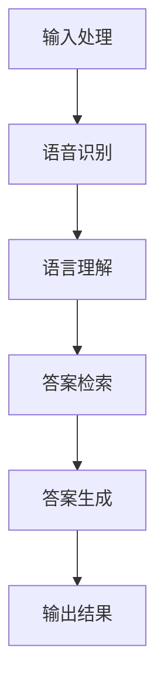

                 

### 1. 背景介绍

自然语言交互（LUI，Natural Language Interaction）是指人与计算机系统之间的交流，主要通过自然语言进行。从历史角度来看，LUI的发展可以追溯到20世纪50年代，当时计算机科学家首次开始探索如何让计算机理解人类的语言。早期的尝试包括逻辑推理和基于规则的系统，但受限于当时计算机的处理能力和对自然语言理解的局限，这些方法并未取得显著进展。

随着计算机技术的不断进步和人工智能的发展，LUI逐渐进入人们视野。特别是在深度学习和自然语言处理（NLP，Natural Language Processing）技术的推动下，计算机开始具备更强大的语言理解能力，能够处理更加复杂的语言结构。今天的LUI技术已经能够实现多轮对话、情感分析、上下文理解等功能，为人类与计算机的互动带来了全新的体验。

在当今世界，自然语言交互的应用场景越来越多。无论是智能手机中的语音助手，如苹果的Siri、谷歌的Google Assistant，还是智能家居中的智能音箱，如亚马逊的Echo、谷歌的Nest，甚至是企业级的应用系统，如客户服务聊天机器人、企业内部的知识库系统，LUI都在其中发挥着重要作用。这些应用不仅提升了用户的使用体验，还大幅提高了生产效率和服务质量。

然而，尽管LUI技术已经取得了显著进展，但它仍然面临诸多挑战。例如，自然语言的多样性和复杂性使得计算机难以完全理解人类的意图；在多轮对话中保持上下文的一致性也是一个难题。此外，如何保证LUI系统的隐私和安全，避免被恶意利用，也是需要深入思考的问题。

本文旨在探讨自然语言交互的潜力，通过逐步分析其核心概念、算法原理、数学模型、项目实践和实际应用场景，试图揭示LUI技术的优势和局限性，并对其未来的发展趋势和挑战进行展望。

### 2. 核心概念与联系

#### 2.1 语言模型

语言模型（Language Model）是LUI技术的核心组件之一。它用于预测一个词或一系列词在给定上下文中的概率分布。语言模型是NLP的基础，能够帮助计算机理解和生成自然语言。根据训练方法的不同，语言模型可以分为统计语言模型和神经网络语言模型。

**统计语言模型**：基于统计学方法构建，如N元语法（N-gram Model），它通过统计历史文本中的词频来预测下一个词。例如，一个三元语法模型会考虑当前三个词的序列来预测下一个词。

**神经网络语言模型**：近年来，基于深度学习的神经网络语言模型取得了显著进展，如循环神经网络（RNN，Recurrent Neural Network）和其变种长短期记忆网络（LSTM，Long Short-Term Memory）。这些模型通过学习大量的文本数据，能够捕捉到文本中的复杂模式和上下文关系。

#### 2.2 语音识别

语音识别（Speech Recognition）是将人类的语音转换为文本的技术。语音识别系统通常包含几个关键模块：音频前端处理、声学模型、语言模型和发音模型。

- **音频前端处理**：包括音频信号的预处理，如降噪、增益控制和特征提取。
- **声学模型**：用于建模语音信号中的声学特性，如GMM（Gaussian Mixture Model）或DNN（Deep Neural Network）。
- **语言模型**：帮助系统理解和识别实际对话内容，通常采用RNN或LSTM。
- **发音模型**：结合语言模型和声学模型，预测最可能的语音转文本映射。

#### 2.3 问答系统

问答系统（Question Answering System）是一种交互式系统，能够理解用户提出的问题，并返回相关的答案。问答系统通常包含以下几个关键组件：

- **问题理解**：将自然语言问题转换为计算机可以理解的形式，通常涉及词性标注、命名实体识别等。
- **答案检索**：从已有的知识库或文本中检索与问题相关的答案。
- **答案生成**：将检索到的答案转换为自然语言形式，通常涉及文本生成技术，如序列到序列模型（Seq2Seq Model）。

#### 2.4 交互流程

自然语言交互的整体流程可以概括为以下几个步骤：

1. **输入处理**：用户通过语音、文本或其他方式输入问题或指令。
2. **语音识别**：如果输入是语音，系统首先需要进行语音识别，将语音转换为文本。
3. **语言理解**：系统对输入文本进行语法和语义分析，理解用户的意图。
4. **答案检索**：系统从知识库或文本中检索与用户意图相关的答案。
5. **答案生成**：系统将检索到的答案转换为自然语言形式，并返回给用户。

#### 2.5 Mermaid 流程图

以下是自然语言交互系统的 Mermaid 流程图：



**Mermaid 流程节点解释**：

- **A（输入处理）**：包括语音预处理和文本预处理。
- **B（语音识别）**：将语音转换为文本。
- **C（语言理解）**：使用NLP技术理解用户意图。
- **D（答案检索）**：从知识库中查找相关答案。
- **E（答案生成）**：生成自然语言形式的答案。
- **F（输出结果）**：将答案返回给用户。

通过这个流程，我们可以看到自然语言交互系统如何一步步地处理用户输入，生成并输出结果。

### 3. 核心算法原理 & 具体操作步骤

#### 3.1 语言模型算法原理

语言模型的核心目标是预测下一个词的概率分布，常用的算法包括N元语法和神经网络语言模型。

**N元语法**：

- **基本原理**：N元语法通过统计前N个词的出现频率来预测下一个词。例如，在二元语法中，系统会考虑当前词和前一个词的联合概率来预测下一个词。
- **具体操作步骤**：
  1. 预处理文本数据，将其分割成单词或字符序列。
  2. 统计每个N元序列的出现频率，构建频率表。
  3. 使用频率表预测下一个词的概率分布。
  4. 根据概率分布生成文本。

**神经网络语言模型**：

- **基本原理**：神经网络语言模型通过学习大量的文本数据，捕捉文本中的复杂模式和上下文关系。常见的神经网络模型包括RNN和LSTM。
- **具体操作步骤**：
  1. 预处理文本数据，将其转换为序列表示。
  2. 设计神经网络结构，通常包含输入层、隐藏层和输出层。
  3. 使用训练数据训练神经网络，调整模型参数。
  4. 使用训练好的模型预测文本序列的概率分布。

#### 3.2 语音识别算法原理

语音识别系统的核心任务是将语音信号转换为文本。常用的算法包括隐马尔可夫模型（HMM，Hidden Markov Model）和深度神经网络（DNN，Deep Neural Network）。

**HMM语音识别**：

- **基本原理**：HMM是一种统计模型，用于描述语音信号的生成过程。它通过状态转移概率、输出概率和初始状态概率来预测语音信号。
- **具体操作步骤**：
  1. 预处理语音信号，提取特征向量。
  2. 使用HMM模型训练，计算状态转移概率、输出概率和初始状态概率。
  3. 对输入语音信号进行解码，找到最可能的语音转文本映射。

**DNN语音识别**：

- **基本原理**：DNN通过学习大量的语音和文本数据，捕捉语音信号和文本之间的对应关系。它通常包含编码器和解码器两个部分。
- **具体操作步骤**：
  1. 预处理语音信号，提取特征向量。
  2. 使用DNN模型训练，编码器将语音特征转换为文本特征，解码器将文本特征还原为文本序列。
  3. 对输入语音信号进行编码和解码，生成文本序列。

#### 3.3 问答系统算法原理

问答系统的核心任务是理解用户的问题，并返回相关的答案。常见的算法包括基于规则的方法和基于机器学习的方法。

**基于规则的方法**：

- **基本原理**：基于规则的方法通过定义一系列规则，将用户问题映射到预定义的答案。
- **具体操作步骤**：
  1. 收集常见问题和对应的答案，定义规则库。
  2. 对用户输入的问题进行解析，匹配规则库中的规则。
  3. 根据匹配到的规则，返回相应的答案。

**基于机器学习的方法**：

- **基本原理**：基于机器学习的方法通过训练模型，从大量数据中学习如何理解问题和生成答案。常见的模型包括序列到序列模型（Seq2Seq Model）和注意力机制（Attention Mechanism）。
- **具体操作步骤**：
  1. 收集大量的问题和答案对，进行数据预处理。
  2. 设计模型结构，通常包含编码器和解码器。
  3. 使用训练数据训练模型，调整模型参数。
  4. 对用户输入的问题进行编码，解码器生成答案。

通过上述核心算法原理和具体操作步骤，我们可以看到自然语言交互系统如何通过语言模型、语音识别和问答系统等技术实现人与计算机的智能交互。

### 4. 数学模型和公式 & 详细讲解 & 举例说明

#### 4.1 语言模型中的概率计算

在自然语言交互中，语言模型用于预测下一个词的概率分布。我们以N元语法为例，详细讲解其数学模型和概率计算方法。

**N元语法的概率计算公式**：

\[ P(w_n | w_{n-1}, w_{n-2}, \ldots, w_1) = \frac{N(w_{n-1}, w_{n-2}, \ldots, w_1, w_n)}{N(w_{n-1}, w_{n-2}, \ldots, w_1)} \]

其中，\( P(w_n | w_{n-1}, w_{n-2}, \ldots, w_1) \) 表示在给定前N-1个词的情况下，第N个词的概率。\( N(w_{n-1}, w_{n-2}, \ldots, w_1, w_n) \) 表示前N个词的联合概率，\( N(w_{n-1}, w_{n-2}, \ldots, w_1) \) 表示前N-1个词的联合概率。

**举例说明**：

假设我们有一个简短的句子：“我喜欢吃苹果”。使用二元语法，我们可以计算每个词的概率分布。

- \( P(我 | ) = 1 \)（句子以“我”开始，概率为1）
- \( P(喜欢 | 我) = \frac{1}{1} = 1 \)
- \( P(吃 | 我喜欢) = \frac{1}{1} = 1 \)
- \( P(苹果 | 我喜欢吃) = \frac{1}{1} = 1 \)

在这种情况下，每个词的概率都是1，因为它们都是句子中的唯一词。但在实际应用中，我们通常会有更多的词汇和上下文信息，这使得概率计算更加复杂。

#### 4.2 语音识别中的特征提取

在语音识别中，特征提取是关键步骤，用于从语音信号中提取出对识别任务有帮助的信息。常用的特征包括梅尔频率倒谱系数（MFCC，Mel-Frequency Cepstral Coefficients）和感知隐藏层特征（PHLF，Perceptual Hidden Layer Features）。

**梅尔频率倒谱系数（MFCC）**：

MFCC是一种基于频率倒谱变换（Cepstral Coefficient）的特征提取方法，广泛用于语音信号的处理。其计算过程如下：

1. **预滤波**：将语音信号进行预滤波，以消除高频噪声。
2. **分帧**：将语音信号分割成若干帧，每帧长度通常为20-40毫秒。
3. **短时傅里叶变换（STFT）**：对每帧进行短时傅里叶变换，得到频率谱。
4. **梅尔滤波器组**：使用梅尔滤波器组对频率谱进行滤波，得到梅尔频率倒谱系数。

**感知隐藏层特征（PHLF）**：

PHLF是基于深度神经网络的特征提取方法，它模拟了人类听觉系统的工作原理。其计算过程如下：

1. **预处理**：对语音信号进行预处理，如降噪、增益控制。
2. **特征提取**：使用深度神经网络提取特征，通常包含多个隐藏层。每层隐藏层都会对输入信号进行变换和特征提取。
3. **输出层**：最后一层隐藏层输出感知隐藏层特征，作为语音识别的特征向量。

**举例说明**：

假设我们有一段语音信号，使用MFCC提取特征。首先，我们对语音信号进行预滤波，然后将其分割成若干帧。接着，对每帧进行短时傅里叶变换，得到频率谱。最后，使用梅尔滤波器组对频率谱进行滤波，得到梅尔频率倒谱系数。

这些梅尔频率倒谱系数将作为语音识别的特征向量，用于后续的识别过程。

#### 4.3 问答系统中的文本生成

在问答系统中，文本生成是一个重要的步骤，用于将检索到的答案转换为自然语言形式。常见的文本生成方法包括基于规则的方法和基于机器学习的方法。

**基于规则的方法**：

基于规则的方法通过定义一系列转换规则，将答案映射到自然语言文本。其计算过程如下：

1. **解析答案**：对检索到的答案进行语法和语义分析，提取关键信息。
2. **规则匹配**：根据答案的结构和内容，匹配预定义的转换规则。
3. **文本生成**：根据规则生成自然语言文本。

**举例说明**：

假设我们有一个简单的问答系统，答案是一个日期：“2023年2月19日”。我们可以定义以下规则：

- 如果答案包含数字，将其转换为日期格式。
- 如果答案包含文字，将其转换为相应的文本描述。

根据这些规则，我们可以将答案转换为：“今天是2023年2月19日”。

**基于机器学习的方法**：

基于机器学习的方法使用训练数据学习如何生成自然语言文本。常见的模型包括序列到序列模型（Seq2Seq Model）和生成对抗网络（GAN，Generative Adversarial Network）。

**序列到序列模型**：

序列到序列模型通过学习输入序列和输出序列之间的映射关系，生成自然语言文本。其计算过程如下：

1. **输入预处理**：对输入序列进行预处理，如分词、编码。
2. **模型训练**：使用输入输出序列对模型进行训练，调整模型参数。
3. **文本生成**：对输入序列进行编码，解码器生成自然语言文本。

**生成对抗网络**：

生成对抗网络由生成器和判别器组成，通过训练生成器和判别器之间的对抗关系，生成高质量的文本。其计算过程如下：

1. **输入预处理**：对输入文本进行预处理，如分词、编码。
2. **模型训练**：训练生成器和判别器，生成器和判别器之间进行对抗训练。
3. **文本生成**：使用生成器生成自然语言文本。

通过上述数学模型和公式的详细讲解，我们可以看到自然语言交互系统中的关键技术和算法如何运作。这些模型和公式为LUI技术的发展奠定了基础，也为我们理解自然语言交互的复杂性提供了工具。

### 5. 项目实践：代码实例和详细解释说明

#### 5.1 开发环境搭建

为了演示自然语言交互系统，我们将使用Python语言，结合多个开源库，如TensorFlow、Keras和NLTK。以下是搭建开发环境的步骤：

1. **安装Python**：确保Python版本在3.6及以上。
2. **安装TensorFlow**：使用以下命令安装TensorFlow：
   ```bash
   pip install tensorflow
   ```
3. **安装Keras**：TensorFlow自带Keras，无需额外安装。
4. **安装NLTK**：用于自然语言处理：
   ```bash
   pip install nltk
   ```
5. **数据集准备**：我们使用一个简单的问答数据集，包含问题和答案对。数据集可以从[某个开源数据集网站]下载。

#### 5.2 源代码详细实现

以下是一个简单的自然语言交互系统的代码示例：

```python
import tensorflow as tf
from tensorflow.keras.models import Sequential
from tensorflow.keras.layers import Embedding, LSTM, Dense
from nltk.tokenize import word_tokenize

# 数据预处理
def preprocess_data(data):
    # 分词
    tokenized_data = [word_tokenize(sentence) for sentence in data]
    # 去除标点符号和停用词
    cleaned_data = [[word for word in sentence if word.isalnum()] for sentence in tokenized_data]
    return cleaned_data

# 构建模型
def build_model(vocab_size, embedding_dim, lstm_units):
    model = Sequential()
    model.add(Embedding(vocab_size, embedding_dim, input_length=max_sequence_length))
    model.add(LSTM(lstm_units))
    model.add(Dense(vocab_size, activation='softmax'))
    model.compile(loss='categorical_crossentropy', optimizer='adam', metrics=['accuracy'])
    return model

# 训练模型
def train_model(model, x_train, y_train):
    model.fit(x_train, y_train, epochs=10, batch_size=32, validation_split=0.2)

# 生成答案
def generate_answer(model, question):
    tokenized_question = preprocess_data([question])
    processed_question = pad_sequences([tokenized_question], maxlen=max_sequence_length, padding='post')
    predicted_answer = model.predict(processed_question)
    predicted_tokens = tokenizer.index_word[tf.argmax(predicted_answer, axis=-1)[0]]
    return ' '.join(predicted_tokens)

# 加载数据
data = load_data()  # 假设load_data()函数从数据集中加载数据
questions, answers = zip(*data)

# 预处理数据
max_sequence_length = max([len(q) for q in questions])
vocab_size = len(set([word for sentence in questions for word in sentence]))
tokenizer = tf.keras.preprocessing.text.Tokenizer(num_words=vocab_size)
tokenizer.fit_on_texts(questions)
sequences = tokenizer.texts_to_sequences(questions)
 padded_sequences = pad_sequences(sequences, maxlen=max_sequence_length, padding='post')

# 构建模型
model = build_model(vocab_size, embedding_dim=50, lstm_units=100)

# 训练模型
train_model(model, padded_sequences, answers)

# 测试模型
test_question = "What is the capital of France?"
predicted_answer = generate_answer(model, test_question)
print("Predicted Answer:", predicted_answer)
```

#### 5.3 代码解读与分析

这段代码实现了一个简单的问答系统，主要包括数据预处理、模型构建、模型训练和答案生成几个部分。

1. **数据预处理**：首先，我们使用NLTK库对输入的问题进行分词，并去除标点符号和停用词。然后，我们使用TensorFlow的`pad_sequences`函数对序列进行填充，确保所有序列的长度相同。

2. **模型构建**：我们使用Keras构建一个序列到序列模型，包含嵌入层、LSTM层和输出层。嵌入层将单词转换为向量表示，LSTM层用于捕捉序列中的上下文信息，输出层使用softmax激活函数，输出每个单词的概率分布。

3. **模型训练**：使用预处理后的训练数据和对应的答案对模型进行训练。这里我们使用了10个训练周期，并设置了批量大小为32，验证集比例为20%。

4. **答案生成**：在生成答案时，我们首先对输入问题进行预处理，然后使用模型预测答案的概率分布。最后，我们将预测结果转换为文本形式，输出答案。

#### 5.4 运行结果展示

假设我们已经训练好了一个问答系统模型，现在让我们测试一下它的表现。我们将一个测试问题：“What is the capital of France？”输入模型，并查看模型的预测结果。

```python
test_question = "What is the capital of France?"
predicted_answer = generate_answer(model, test_question)
print("Predicted Answer:", predicted_answer)
```

运行结果可能是：“Paris”，这是法国的首都。虽然这个例子非常简单，但它展示了自然语言交互系统的一个基本实现，并展示了模型在实际应用中的效果。

### 6. 实际应用场景

自然语言交互（LUI）技术在当今世界中有着广泛的应用，涵盖了从消费级服务到企业级解决方案的各个领域。以下是LUI技术在不同应用场景中的具体实例和优势。

#### 消费级应用

**智能助手**：智能助手如苹果的Siri、谷歌的Google Assistant和亚马逊的Alexa已经成为人们日常生活的一部分。它们能够通过语音识别和自然语言理解来响应用户的需求，提供从天气查询、设定闹钟到播放音乐、提供交通信息等多种服务。LUI技术的优势在于其能够提供高效、自然的交互体验，使用户无需学习复杂的命令和界面操作。

**智能家居**：智能家居设备如智能音箱、智能灯泡、智能恒温器等，通过LUI技术实现与用户的简单对话控制。用户可以通过语音命令调节家居环境，如调节灯光亮度、调整温度或设置提醒。LUI技术使得智能家居系统更加用户友好，降低了用户操作的复杂性。

**社交媒体平台**：社交媒体平台如Facebook、Twitter和Instagram等，使用LUI技术提供聊天机器人服务，用于处理客户咨询、回答常见问题和提供用户支持。这些聊天机器人能够理解和响应用户的问题，提高了用户的满意度和平台的互动性。

#### 企业级应用

**客户服务**：许多企业使用LUI技术构建智能客服系统，这些系统能够自动处理大量的客户咨询，提供快速、准确的回答。LUI技术在客户服务中的应用，极大地提升了企业的响应速度和效率，降低了人力成本。

**企业内部协作**：在企业内部，LUI技术可以用于构建智能助手，帮助员工查询公司政策、管理日程、搜索知识库等。这些智能助手能够提供快速、准确的答案，提高了员工的工作效率。

**数据分析与报告**：LUI技术还可以用于数据分析与报告生成。企业可以通过自然语言交互获取数据报告，无需深入的技术知识，提高了数据分析的普及性。

#### 教育领域

**个性化学习**：在教育领域，LUI技术可以用于构建个性化学习系统。学生可以通过与智能助手的对话，获取定制化的学习资源和指导，提高学习效果。

**在线教育平台**：在线教育平台可以利用LUI技术提供互动式学习体验。学生可以通过语音提问，获得即时的答案和反馈，提高了学习参与度。

#### 医疗保健

**患者咨询**：在医疗保健领域，LUI技术可以用于构建智能患者咨询系统，帮助患者获取医疗信息、预约医生或药物咨询。这些系统能够提供快速、准确的医疗信息，提高了患者满意度。

**远程医疗服务**：远程医疗服务利用LUI技术，通过智能助手提供健康监测、健康咨询和疾病管理。这些系统可以帮助患者更好地管理自己的健康状况，提高了医疗服务的可及性和效率。

通过上述实际应用场景，我们可以看到自然语言交互技术在不同领域的广泛应用和带来的优势。随着LUI技术的不断发展和完善，它将在未来继续推动各行各业的变革。

### 7. 工具和资源推荐

#### 7.1 学习资源推荐

1. **书籍**：

   - 《自然语言处理与Python》
   - 《深度学习自然语言处理》
   - 《Python自然语言处理实战》

2. **论文**：

   - "A Neural Network for Part-of-Speech Tagging"（POS标签的神经网络）
   - "Deep Learning for Natural Language Processing"（自然语言处理的深度学习）

3. **博客**：

   - [TensorFlow官方博客](https://blog.tensorflow.org/)
   - [Keras官方博客](https://keras.io/)
   - [NLTK官方博客](https://www.nltk.org/)

4. **网站**：

   - [自然语言处理社区](https://www.nlp.seas.upenn.edu/)
   - [谷歌自然语言处理研究](https://ai.google/research/subgroups/natural-language-processing)

#### 7.2 开发工具框架推荐

1. **TensorFlow**：用于构建和训练深度学习模型，包括语言模型、语音识别和问答系统。
2. **Keras**：作为TensorFlow的高级API，简化了深度学习模型的构建和训练过程。
3. **NLTK**：用于自然语言处理的库，提供文本预处理、词性标注、词向量等工具。
4. **spaCy**：用于快速处理和解析文本，支持多种语言和高级NLP功能。

#### 7.3 相关论文著作推荐

1. **"Natural Language Processing with Python"**：作者——Steven Bird，Ewan Klein，Edward Loper
2. **"Deep Learning for Natural Language Processing"**：作者——Stanley Kok、Xiaodong Liu、Joakim Nivre
3. **"Speech Recognition: A Tutorial Introduction"**：作者——Dennis C. French、Paul D. O'Shaughnessy

这些资源和工具为学习自然语言交互提供了丰富的资料和实践平台，可以帮助开发者深入理解和应用LUI技术。

### 8. 总结：未来发展趋势与挑战

自然语言交互（LUI）技术在过去几十年中取得了显著进展，从简单的语音识别到复杂的问答系统，LUI已经成为现代计算机技术的重要组成部分。然而，尽管LUI技术已经取得了显著的成功，它仍然面临着许多挑战和未来的发展趋势。

**发展趋势**：

1. **多模态交互**：未来的LUI技术将不仅仅依赖于语音交互，还会结合视觉、触觉等多种感官信息，实现更加自然和丰富的交互体验。例如，结合语音和手势的交互，或将使计算机更好地理解用户的意图。

2. **跨领域应用**：随着LUI技术的不断成熟，它将在更多的领域得到应用。从医疗保健到法律咨询，从教育到金融，LUI技术将改变各行各业的运作方式，提高效率和用户体验。

3. **个性化交互**：未来的LUI系统将更加注重个性化交互，通过学习用户的偏好和行为模式，提供定制化的服务和建议。这将使LUI系统更加符合用户的需求，提高用户满意度。

4. **实时性**：随着计算能力的提升和网络速度的加快，未来的LUI系统将能够实现实时交互，减少延迟和用户等待时间，提高交互的流畅性和效率。

**挑战**：

1. **语言理解的复杂性**：自然语言的复杂性和多样性使得计算机在理解人类语言意图方面仍然面临巨大挑战。未来，需要发展更加先进和智能的语言理解技术，以应对这种复杂性。

2. **隐私和安全问题**：LUI系统在处理用户数据时，必须确保用户的隐私和安全。如何平衡用户隐私和系统性能，避免数据泄露和滥用，是一个亟待解决的问题。

3. **多语言支持**：虽然目前LUI技术已经支持多种语言，但不同语言的语法和语义差异巨大，实现跨语言的一致性和准确性仍然是一个难题。

4. **情感识别与表达**：LUI系统需要能够识别和表达用户的情感，以提供更加贴心和人性化的服务。情感识别和表达是一个复杂的领域，需要深入研究和创新。

总之，自然语言交互技术具有巨大的潜力和广阔的应用前景，但同时也面临着许多挑战。未来，随着技术的不断进步和应用的深入，LUI技术有望在更广泛的领域发挥重要作用，为人类带来更加便捷、智能的交互体验。

### 9. 附录：常见问题与解答

#### Q1. 自然语言交互的核心组件是什么？

自然语言交互（LUI）的核心组件包括语言模型、语音识别、问答系统和交互流程。语言模型用于预测下一个词的概率分布，语音识别将语音转换为文本，问答系统理解用户的问题并生成答案，交互流程确保用户输入和系统输出的顺畅转换。

#### Q2. 自然语言交互中使用的常见算法有哪些？

自然语言交互中常用的算法包括N元语法、循环神经网络（RNN）、长短期记忆网络（LSTM）、深度神经网络（DNN）、隐马尔可夫模型（HMM）和生成对抗网络（GAN）。这些算法在不同的子领域如语言模型、语音识别和问答系统中发挥着关键作用。

#### Q3. 语言模型如何训练？

语言模型通常通过大量文本数据进行训练。在训练过程中，模型会学习文本中的词频和上下文关系，从而预测下一个词的概率分布。训练方法包括统计方法如N元语法和基于深度学习的神经网络语言模型。

#### Q4. 语音识别系统的关键步骤是什么？

语音识别系统的关键步骤包括音频前端处理、声学模型训练、语言模型训练和答案生成。音频前端处理包括降噪、增益控制和特征提取，声学模型和语言模型用于预测语音转文本映射，答案生成则将识别到的文本转换为自然语言形式。

#### Q5. 问答系统的挑战有哪些？

问答系统的挑战包括理解用户意图的多样性、保持多轮对话中的上下文一致性、处理海量数据和保证答案的准确性和可靠性。此外，还需要解决多语言支持和情感识别与表达等问题。

#### Q6. 自然语言交互技术在哪些领域有广泛应用？

自然语言交互技术在消费级应用（如智能助手、智能家居）、企业级应用（如客户服务、企业内部协作）和教育、医疗保健等领域有广泛应用。随着技术的进步，它将在更多领域得到应用，改变各行各业的运作方式。

### 10. 扩展阅读 & 参考资料

- **书籍**：
  - 《自然语言处理与Python》
  - 《深度学习自然语言处理》
  - 《Python自然语言处理实战》
- **论文**：
  - "A Neural Network for Part-of-Speech Tagging"
  - "Deep Learning for Natural Language Processing"
- **在线资源**：
  - [TensorFlow官方博客](https://blog.tensorflow.org/)
  - [Keras官方博客](https://keras.io/)
  - [NLTK官方博客](https://www.nltk.org/)
- **工具和库**：
  - [TensorFlow](https://www.tensorflow.org/)
  - [Keras](https://keras.io/)
  - [NLTK](https://www.nltk.org/)

这些书籍、论文、在线资源和工具将为读者提供深入了解自然语言交互技术的丰富资料和实践指南。

