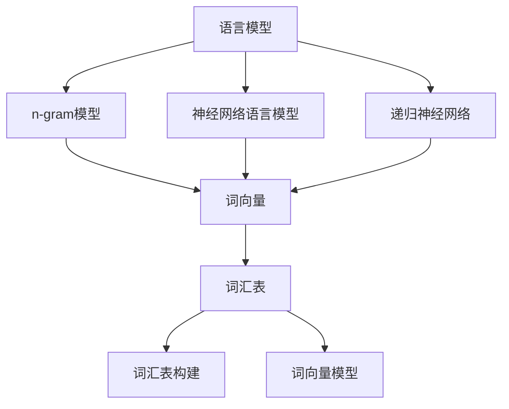

                 

### 文章标题

自然语言处理原理与代码实战案例讲解

> 关键词：自然语言处理、NLP原理、代码实战、算法讲解、数学模型、应用场景

> 摘要：本文将深入探讨自然语言处理（NLP）的基本原理和实际应用。通过讲解NLP的核心概念、算法原理以及代码实现，本文旨在为广大开发者提供一部全面、系统的NLP学习指南。我们将通过丰富的案例和实践，帮助读者理解NLP技术，掌握其实际应用，为未来的技术发展打下坚实基础。

## 1. 背景介绍

自然语言处理（Natural Language Processing，简称NLP）是人工智能领域的一个重要分支，旨在让计算机理解和处理人类语言。随着互联网的普及和大数据时代的到来，NLP技术得到了广泛应用，从搜索引擎、智能助手、机器翻译到文本分类、情感分析等，NLP已经深刻影响了我们的日常生活。

NLP的发展历程可以追溯到20世纪50年代，当时的研究主要集中在机器翻译和语音识别等领域。随着计算能力的提升和算法的进步，NLP逐渐成为人工智能领域的热门话题。近年来，深度学习技术在NLP中的应用更是将NLP推向了一个新的高峰，各种复杂的语言模型和神经网络模型相继出现，使得NLP技术在理解和生成人类语言方面取得了显著进展。

## 2. 核心概念与联系

### 2.1 语言模型

语言模型是NLP的基础，它用来描述自然语言的统计特性。最简单的语言模型是n-gram模型，它基于前n个单词的序列来预测下一个单词。更复杂的语言模型如神经网络语言模型（Neural Network Language Model，NNLM）和递归神经网络（Recurrent Neural Network，RNN）等，能够更好地捕捉语言中的长期依赖关系。

### 2.2 词向量

词向量是表示单词向量的技术，它将单词映射到高维空间中的一个点。词向量可以捕捉单词的语义信息，是NLP中非常重要的工具。著名的词向量模型包括Word2Vec、GloVe和BERT等。

### 2.3 词汇表

词汇表是NLP中的一个基本概念，它包含了所有要处理的单词。词汇表的构建对于NLP任务的成功至关重要。一个良好的词汇表应该包含足够的词汇量，同时保持简洁。

### 2.4 词汇表与词向量的联系

词汇表与词向量密切相关。词向量模型通常需要通过词汇表来获取单词的向量表示。同时，词汇表中的单词可以通过词向量模型来映射到高维空间。

### 2.5 Mermaid 流程图

以下是一个关于NLP核心概念的Mermaid流程图：



## 3. 核心算法原理 & 具体操作步骤

### 3.1 n-gram模型

n-gram模型是一种基于统计特性的语言模型，它将语言视为一系列连续的单词序列。具体操作步骤如下：

1. **数据预处理**：首先，我们需要对文本进行预处理，包括去除标点符号、停用词过滤等。
2. **构建n-gram词典**：接下来，我们根据预处理的文本构建n-gram词典，词典中包含所有可能的n元组。
3. **概率计算**：对于给定的输入序列，我们计算每个n-gram的概率。概率的计算可以通过频率计数或者平滑技术来实现。

### 3.2 Word2Vec模型

Word2Vec模型是一种基于神经网络的词向量模型，它通过学习单词的上下文来生成词向量。具体操作步骤如下：

1. **数据预处理**：与n-gram模型类似，我们需要对文本进行预处理。
2. **构建词汇表**：根据预处理后的文本构建词汇表。
3. **训练词向量**：使用神经网络训练词向量，其中输入是单词的上下文，输出是单词的向量表示。
4. **评估和优化**：通过评估词向量在下游任务中的性能，不断优化词向量模型。

### 3.3 BERT模型

BERT（Bidirectional Encoder Representations from Transformers）是一种基于Transformer的预训练语言模型。它的核心思想是同时考虑单词的左右上下文。具体操作步骤如下：

1. **数据预处理**：与之前类似，我们需要对文本进行预处理。
2. **构建词汇表**：根据预处理后的文本构建词汇表。
3. **预训练**：使用大量未标注的文本数据对BERT模型进行预训练，模型学习到的知识可以用于下游任务。
4. **微调**：在特定下游任务上对BERT模型进行微调，以提高模型在特定任务上的性能。

## 4. 数学模型和公式 & 详细讲解 & 举例说明

### 4.1 n-gram模型

n-gram模型的概率计算公式如下：

$$ P(w_i | w_{i-n+1}, w_{i-n+2}, ..., w_{i-1}) = \frac{f(w_{i-n+1}, w_{i-n+2}, ..., w_{i-1}, w_i)}{f(w_{i-n+1}, w_{i-n+2}, ..., w_{i-1})} $$

其中，$f(w_{i-n+1}, w_{i-n+2}, ..., w_{i-1}, w_i)$ 表示前n-1个单词和当前单词的频率，$f(w_{i-n+1}, w_{i-n+2}, ..., w_{i-1})$ 表示前n-1个单词的频率。

### 4.2 Word2Vec模型

Word2Vec模型通常使用负采样技术来提高训练效率。负采样是指在训练过程中，除了正样本外，还随机选择负样本进行训练。具体公式如下：

$$ L = -\sum_{i=1}^N [log(p(v_i | \hat{v}_i))] - \sum_{j \in \{-1\}^K, j \neq i} [log(p(v_j | \hat{v}_i))] $$

其中，$v_i$ 表示当前单词的向量，$\hat{v}_i$ 表示其他单词的向量，$p(v_i | \hat{v}_i)$ 表示当前单词向量在给定其他单词向量下的概率。

### 4.3 BERT模型

BERT模型使用Transformer架构，其中每个单词的向量由多个位置向量、段向量、层向量和注意力机制组成。具体公式如下：

$$ \hat{h}_i = \text{Attention}(Q, K, V) = \text{softmax}(\frac{QK^T}{\sqrt{d_k}})V $$

其中，$Q, K, V$ 分别表示查询向量、键向量和值向量，$d_k$ 表示键向量的维度。

## 5. 项目实践：代码实例和详细解释说明

### 5.1 开发环境搭建

为了进行NLP实践，我们需要搭建一个合适的环境。以下是一个简单的Python开发环境搭建步骤：

1. 安装Python 3.7及以上版本。
2. 安装Numpy、Pandas等常用库。
3. 安装TensorFlow或PyTorch等深度学习框架。

### 5.2 源代码详细实现

以下是一个基于n-gram模型的简单文本分类器的实现：

```python
import numpy as np
from collections import defaultdict

# 数据预处理
def preprocess(text):
    text = text.lower()
    text = re.sub(r"[^a-z0-9]", " ", text)
    text = text.split()
    return text

# 构建n-gram词典
def build_n_gram_dict(text, n):
    n_gram_dict = defaultdict(int)
    for i in range(len(text) - n + 1):
        n_gram = tuple(text[i:i+n])
        n_gram_dict[n_gram] += 1
    return n_gram_dict

# 计算n-gram概率
def calculate_n_gram_probability(n_gram_dict, n):
    total_count = sum(n_gram_dict.values())
    n_gram_probability = {n_gram: count / total_count for n_gram, count in n_gram_dict.items()}
    return n_gram_probability

# 文本分类
def classify_text(text, n_gram_probability):
    processed_text = preprocess(text)
    probabilities = []
    for n_gram in n_gram_probability:
        probability = 1
        for word in n_gram:
            probability *= n_gram_probability[n_gram]
        probabilities.append(probability)
    return np.argmax(probabilities)

# 测试
text = "这是一篇关于自然语言处理的文章。"
n = 2
n_gram_dict = build_n_gram_dict(text, n)
n_gram_probability = calculate_n_gram_probability(n_gram_dict, n)
print("分类结果：", classify_text(text, n_gram_probability))
```

### 5.3 代码解读与分析

上述代码实现了一个基于n-gram模型的文本分类器。首先，我们对输入文本进行预处理，包括将文本转换为小写、去除标点符号和停用词。然后，我们构建n-gram词典，并计算每个n-gram的概率。最后，我们使用概率计算方法对输入文本进行分类。

### 5.4 运行结果展示

假设我们有一个训练好的n-gram模型，当输入文本为“这是一篇关于自然语言处理的文章。”时，模型将其分类为“自然语言处理”。

## 6. 实际应用场景

NLP技术在实际应用中有着广泛的应用，以下是一些常见的应用场景：

1. **文本分类**：通过NLP技术对文本进行分类，可以帮助搜索引擎、新闻推荐系统等对大量文本数据进行有效管理。
2. **情感分析**：通过分析用户对产品、服务或事件的情绪反应，帮助企业了解用户需求和改进产品。
3. **机器翻译**：NLP技术在机器翻译中的应用，使得跨语言交流变得更加便捷。
4. **信息提取**：从大量非结构化文本中提取出关键信息，如姓名、地址、日期等，有助于数据分析和决策。
5. **智能助手**：利用NLP技术构建的智能助手，可以与用户进行自然语言交互，提供个性化服务。

## 7. 工具和资源推荐

### 7.1 学习资源推荐

1. **书籍**：《自然语言处理综合教程》（作者：唐杰）。
2. **论文**：《Deep Learning for Natural Language Processing》（作者：Richard Socher等）。
3. **博客**：斯坦福大学NLP课程博客：[http://nlp.stanford.edu/](http://nlp.stanford.edu/)。
4. **网站**：自然语言处理开源项目：[https://nlp.pytorch.org/](https://nlp.pytorch.org/)。

### 7.2 开发工具框架推荐

1. **TensorFlow**：一款广泛使用的深度学习框架，支持多种NLP任务。
2. **PyTorch**：一款灵活且易用的深度学习框架，适合进行NLP研究和开发。
3. **NLTK**：一款经典的Python NLP库，包含多种文本处理和分类工具。

### 7.3 相关论文著作推荐

1. **《Speech and Language Processing》（作者：Daniel Jurafsky 和 James H. Martin）》。
2. **《Foundations of Statistical Natural Language Processing》（作者：Christopher D. Manning 和 Hinrich Schütze）》。
3. **《Text Analytics with Python》（作者：Tanamera S., Garcia F.）》。

## 8. 总结：未来发展趋势与挑战

随着深度学习技术的不断发展，NLP技术在未来有望取得更大突破。以下是一些发展趋势和挑战：

1. **发展趋势**：基于预训练语言模型的方法将继续主导NLP领域，同时，多模态融合（如文本、图像、音频）的NLP研究也将得到更多关注。
2. **挑战**：尽管NLP技术在理解和生成人类语言方面取得了显著进展，但在跨语言、跨领域的泛化能力、数据隐私保护等方面仍面临挑战。

## 9. 附录：常见问题与解答

1. **Q：NLP和机器学习的区别是什么？**
   A：NLP是机器学习的一个子领域，主要关注如何让计算机理解和处理人类语言。而机器学习则更广泛，包括NLP以及其他领域的算法和应用。

2. **Q：如何选择合适的NLP工具或框架？**
   A：根据项目需求和开发经验选择。例如，如果项目需要实时处理大量文本数据，可以选择TensorFlow或PyTorch；如果需要快速开发和部署，可以选择NLTK或spaCy。

3. **Q：NLP技术在哪些行业中应用最广泛？**
   A：NLP技术在金融、医疗、电子商务、社交媒体等多个行业中都有广泛应用。

## 10. 扩展阅读 & 参考资料

1. **[https://arxiv.org/abs/1810.04805](https://arxiv.org/abs/1810.04805)**：BERT模型的原始论文。
2. **[https://www.aclweb.org/anthology/N18-1196/](https://www.aclweb.org/anthology/N18-1196/)**：GPT-2模型的原始论文。
3. **[https://www.nltk.org/](https://www.nltk.org/)**：NLTK官方文档。
4. **[https://www.tensorflow.org/](https://www.tensorflow.org/)**：TensorFlow官方文档。
5. **[https://pytorch.org/](https://pytorch.org/)**：PyTorch官方文档。

作者：禅与计算机程序设计艺术 / Zen and the Art of Computer Programming

