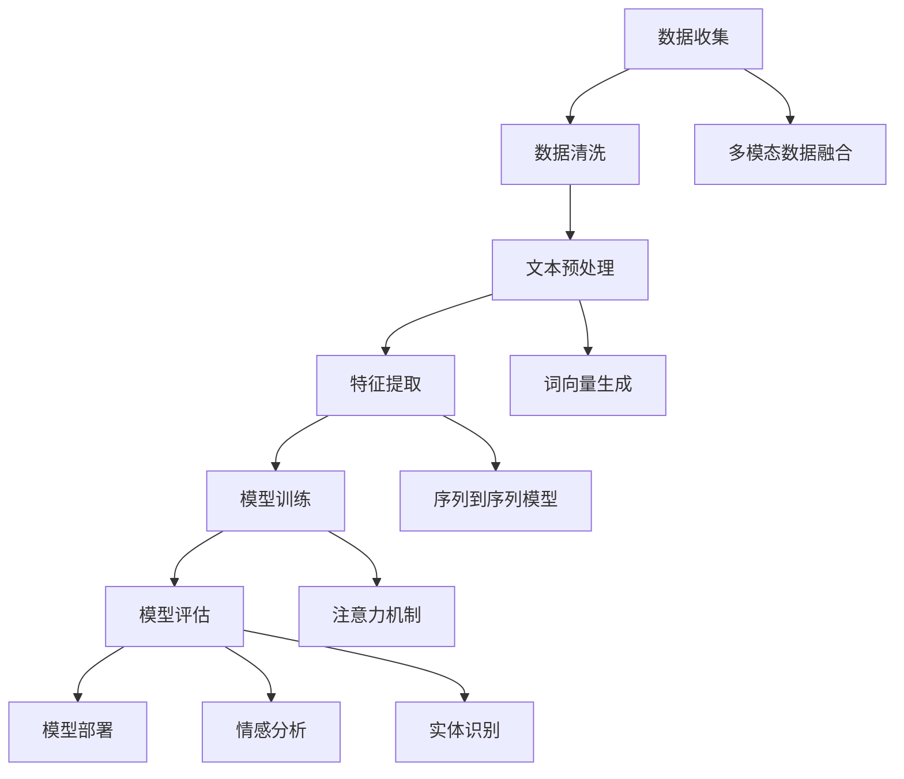

                 

### 1. 背景介绍

#### 1.1 自然语言处理（NLP）的定义与发展历程

自然语言处理（Natural Language Processing，简称NLP）是人工智能（AI）领域的一个重要分支，旨在使计算机能够理解和处理人类自然语言。这一概念最早可以追溯到20世纪50年代，当时人工智能的研究刚刚起步，科学家们开始探索如何让计算机模拟人类的语言理解能力。

自然语言处理的起源可以追溯到以下几个关键阶段：

- **早期探索（1950s-1960s）**：在20世纪50年代，人工智能（AI）被首次提出，自然语言处理也随之诞生。早期的研究主要集中在语言模型和句法分析上。1950年，艾伦·图灵（Alan Turing）发表了著名的论文《计算机器与智能》（Computing Machinery and Intelligence），提出了图灵测试的概念，这一概念成为了自然语言处理研究的基石。

- **统计方法兴起（1970s-1980s）**：20世纪70年代，随着计算机性能的提升和大数据的出现，统计方法开始在自然语言处理中得到广泛应用。这一时期，研究者们开始使用统计模型来处理自然语言，如隐马尔可夫模型（HMM）、决策树等。

- **规则方法与知识表示（1990s）**：20世纪90年代，随着知识表示和推理技术的发展，自然语言处理开始引入更多的规则和知识表示方法。研究者们试图通过构建复杂的规则系统来提高计算机的语言理解能力。

- **深度学习与神经网络（2000s-至今）**：进入21世纪后，深度学习技术的突破使得自然语言处理取得了显著的进展。神经网络，特别是卷积神经网络（CNN）和循环神经网络（RNN），被广泛应用于文本分类、机器翻译、情感分析等领域。

#### 1.2 AI工作流与自然语言处理

在AI工作流中，自然语言处理扮演着至关重要的角色。它不仅涉及到数据的收集、清洗和预处理，还涉及到模型训练、优化和部署。具体来说，自然语言处理在AI工作流中的几个关键步骤如下：

- **数据收集与清洗**：自然语言处理的首要任务是收集和处理大量文本数据。这些数据可能来自互联网、社交媒体、书籍、新闻等不同来源。清洗数据的过程包括去除噪声、处理缺失值、标准化文本等。

- **文本预处理**：文本预处理是自然语言处理的重要环节，包括分词、词性标注、词干提取等。这些预处理步骤有助于将原始文本转换为计算机可以处理的形式。

- **特征提取**：在自然语言处理中，特征提取是将文本数据转换为机器学习模型可以处理的高维特征向量。常见的特征提取方法包括词袋模型（Bag of Words）、TF-IDF、Word2Vec等。

- **模型训练与优化**：自然语言处理的下一步是使用机器学习算法训练模型。深度学习模型，如循环神经网络（RNN）、长短期记忆网络（LSTM）和变换器（Transformer），在这一阶段得到了广泛应用。模型的优化过程包括超参数调整、正则化等。

- **模型评估与部署**：模型训练完成后，需要对模型进行评估，以确定其性能和准确性。评估指标包括准确率、召回率、F1分数等。评估通过后，模型可以部署到生产环境中，用于实际应用。

#### 1.3 自然语言处理在AI工作流中的挑战

尽管自然语言处理取得了显著的进展，但在AI工作流中仍然面临着一系列挑战：

- **数据多样性**：自然语言数据来源广泛，包括不同领域的文本、不同语言的文本等。这要求自然语言处理模型具有较好的泛化能力。

- **多模态数据融合**：自然语言处理通常需要与其他模态（如图像、声音）的数据进行融合，这增加了模型的复杂性。

- **语义理解**：自然语言处理的核心目标是理解文本的语义。然而，语义理解是一个极其复杂的问题，涉及到上下文、情感、意图等多个方面。

- **实时处理**：在许多应用场景中，如实时聊天机器人、语音识别等，自然语言处理需要能够快速响应，这要求模型具有高效的计算能力。

#### 1.4 本文结构

本文将围绕自然语言处理在AI工作流中的应用与挑战展开讨论。具体结构如下：

- **第2章**：介绍自然语言处理的核心概念与联系。
- **第3章**：讲解自然语言处理的核心算法原理与具体操作步骤。
- **第4章**：阐述自然语言处理的数学模型和公式，并举例说明。
- **第5章**：通过代码实例详细解释自然语言处理的实现过程。
- **第6章**：探讨自然语言处理在实际应用场景中的使用。
- **第7章**：推荐学习资源、开发工具框架和相关的论文著作。
- **第8章**：总结自然语言处理的发展趋势与面临的挑战。
- **第9章**：回答常见问题与提供附录。
- **第10章**：提供扩展阅读与参考资料。

通过本文的逐步分析，我们将深入理解自然语言处理在AI工作流中的重要性及其面临的挑战。### 2. 核心概念与联系

#### 2.1 关键术语定义

在深入探讨自然语言处理（NLP）在AI工作流中的应用之前，有必要明确一些核心概念和术语。这些概念包括但不限于：语言模型、词向量、序列到序列（Seq2Seq）模型、注意力机制、情感分析、实体识别等。

- **语言模型**：语言模型是一种概率模型，用于预测下一个单词或字符。它在自然语言处理中起到了基础作用，是生成文本、文本分类、机器翻译等任务的核心。

- **词向量**：词向量是将单词映射为高维空间中的向量表示。Word2Vec、GloVe等算法被广泛应用于词向量的生成。词向量有助于捕获单词的语义信息，是深度学习模型的基础。

- **序列到序列（Seq2Seq）模型**：Seq2Seq模型是一种用于处理序列数据到序列数据映射的模型。它在机器翻译、对话系统等领域得到了广泛应用。通过编码器-解码器架构，Seq2Seq模型能够捕捉输入序列和输出序列之间的复杂关系。

- **注意力机制**：注意力机制是一种在处理序列数据时，允许模型关注输入序列中某些重要部分的方法。它在机器翻译、文本摘要等任务中发挥了关键作用，能够提高模型的性能。

- **情感分析**：情感分析是一种用于判断文本情感倾向的方法。它通常用于社交媒体分析、产品评论分析等领域，帮助企业了解消费者的情感态度。

- **实体识别**：实体识别是一种从文本中识别出特定实体（如人名、地名、组织名等）的方法。它在信息抽取、搜索引擎优化等领域具有重要应用。

#### 2.2 自然语言处理架构

为了更好地理解自然语言处理在AI工作流中的角色，我们可以借助Mermaid流程图来展示其核心架构。



在上面的流程图中，我们可以看到自然语言处理涉及多个关键步骤：

- **数据收集**：从各种来源收集原始文本数据。
- **数据清洗**：处理噪声和缺失值，确保数据质量。
- **文本预处理**：进行分词、词性标注、词干提取等操作，将文本转换为适合处理的形式。
- **特征提取**：生成词向量或使用其他方法提取文本的特征表示。
- **模型训练**：使用机器学习算法训练模型，如Seq2Seq模型、注意力机制等。
- **模型评估**：评估模型性能，使用准确率、召回率、F1分数等指标。
- **模型部署**：将训练好的模型部署到生产环境中，用于实际应用。
- **多模态数据融合**：将文本数据与其他模态（如图像、声音）进行融合，提高模型的性能。
- **情感分析**：用于分析文本中的情感倾向，如积极、消极、中性等。
- **实体识别**：从文本中识别出特定实体，如人名、地名、组织名等。

通过这个流程图，我们可以清晰地看到自然语言处理在AI工作流中的各个步骤及其相互关系。这有助于我们理解自然语言处理在AI系统中的重要性，以及如何优化和改进这个流程。

#### 2.3 自然语言处理的应用场景

自然语言处理在AI工作流中的应用场景非常广泛，涵盖了从工业级应用到日常生活的各个方面。以下是一些典型的应用场景：

- **机器翻译**：机器翻译是一种将一种自然语言翻译成另一种自然语言的任务。自然语言处理在这一领域中发挥了关键作用，通过Seq2Seq模型和注意力机制等先进技术，实现了高质量的自动翻译。

- **文本分类**：文本分类是一种将文本数据根据其内容分类到不同类别的任务。自然语言处理通过特征提取和机器学习算法，如朴素贝叶斯、支持向量机等，可以实现对大规模文本数据的自动分类。

- **情感分析**：情感分析是一种用于判断文本情感倾向的方法。它可以帮助企业了解消费者的情感态度，从而优化产品和服务。自然语言处理通过情感词典、机器学习算法等手段，实现了对情感倾向的准确判断。

- **对话系统**：对话系统是一种与人类用户进行自然语言交互的系统。自然语言处理在这一领域中扮演着重要角色，通过序列到序列模型和注意力机制等，可以实现对用户问题的理解和回答。

- **信息抽取**：信息抽取是一种从非结构化文本中提取出特定信息的方法。自然语言处理通过命名实体识别、关系抽取等技术，可以实现对重要信息的准确提取。

- **文本生成**：文本生成是一种根据输入文本生成相应文本内容的方法。自然语言处理通过生成对抗网络（GAN）和自动编码器等深度学习技术，可以生成具有高质量的自然语言文本。

- **语音识别**：语音识别是一种将语音转换为文本的方法。自然语言处理在这一领域中通过结合语音识别技术和语言模型，实现了对语音的准确理解和转换。

- **问答系统**：问答系统是一种根据用户提问提供答案的系统。自然语言处理在这一领域中通过语义理解、知识图谱等技术，可以实现对用户问题的准确理解和回答。

通过这些应用场景，我们可以看到自然语言处理在AI工作流中的广泛影响。它不仅提升了AI系统的智能水平，还为各行各业带来了巨大的价值。

#### 2.4 自然语言处理与其他AI技术的融合

自然语言处理（NLP）与其他AI技术的融合，为解决复杂问题提供了新的思路和方法。以下是自然语言处理与一些其他AI技术的结合案例：

- **计算机视觉**：在计算机视觉任务中，自然语言处理可以用于图像标注、对象识别等。通过结合视觉特征和文本信息，可以显著提高模型的性能。例如，在图像分类任务中，自然语言处理可以帮助描述图像内容，从而增强分类模型的效果。

- **强化学习**：在强化学习任务中，自然语言处理可以用于生成奖励信号、指导学习过程等。通过理解文本描述，强化学习模型可以更好地理解和学习复杂任务。例如，在自动驾驶领域，自然语言处理可以用于生成道路标识的文本描述，帮助车辆更好地理解和应对复杂路况。

- **知识图谱**：知识图谱是一种用于表示和存储知识的方法。自然语言处理可以用于知识图谱的构建和推理。通过从文本数据中提取实体和关系，自然语言处理可以构建出丰富的知识图谱，从而支持智能问答、推荐系统等任务。

- **多模态学习**：在多模态学习任务中，自然语言处理可以用于融合不同模态的数据。通过将文本数据与其他模态（如图像、声音）进行融合，可以显著提高模型的性能。例如，在医疗诊断任务中，自然语言处理可以用于融合病人的文本病历和医学图像，从而提高诊断的准确性。

通过这些案例，我们可以看到自然语言处理与其他AI技术的融合，为解决复杂问题提供了新的可能性。这些融合技术不仅提升了AI系统的智能水平，还为各行各业带来了巨大的价值。### 3. 核心算法原理 & 具体操作步骤

#### 3.1 语言模型

语言模型（Language Model）是自然语言处理（NLP）中的基础算法，用于预测下一个单词或字符。最常用的语言模型之一是n元语法模型（n-gram model），它通过统计相邻单词或字符的频率来预测下一个词。

**具体操作步骤**：

1. **数据收集与预处理**：收集大量的文本数据，并进行分词、去停用词等预处理操作。
2. **构建n元语法模型**：计算相邻单词或字符的频率，构建n元语法词典。
3. **预测下一个单词或字符**：根据当前已输入的单词或字符序列，查找n元语法词典中对应的概率分布，选择概率最高的下一个单词或字符。

**数学模型**：

设 \( P(w_t | w_{t-1}, w_{t-2}, ..., w_{t-n+1}) \) 为第 \( t \) 个单词在给定前 \( t-n \) 个单词条件下的概率，则n元语法模型可以表示为：

\[ P(w_t | w_{t-1}, w_{t-2}, ..., w_{t-n+1}) = \frac{count(w_{t-1}, w_{t-2}, ..., w_{t-n+1}, w_t)}{count(w_{t-1}, w_{t-2}, ..., w_{t-n+1})} \]

其中， \( count(\cdot) \) 表示词频。

#### 3.2 词向量

词向量（Word Vector）是将单词映射为高维空间中的向量表示。Word2Vec和GloVe是两种常用的词向量生成方法。

**Word2Vec**：

Word2Vec模型基于神经网络，通过训练预测输入词和上下文词的映射关系。具体操作步骤如下：

1. **数据收集与预处理**：收集大量的文本数据，并进行分词、去停用词等预处理操作。
2. **构建词汇表**：将所有单词映射为唯一的索引。
3. **训练神经网络**：使用CBOW（连续词袋模型）或Skip-Gram方法训练神经网络，预测中心词（CBOW）或目标词（Skip-Gram）的上下文词。
4. **生成词向量**：将训练好的神经网络的隐藏层表示作为词向量。

**GloVe**：

GloVe（Global Vectors for Word Representation）模型通过矩阵分解方法生成词向量。具体操作步骤如下：

1. **数据收集与预处理**：收集大量的文本数据，并进行分词、去停用词等预处理操作。
2. **计算词频**：计算每个单词在文本中的词频。
3. **构建矩阵**：构建一个矩阵，其中每个元素表示单词的词频与词向量的内积。
4. **矩阵分解**：使用奇异值分解（SVD）方法对矩阵进行分解，得到词向量。

**数学模型**：

Word2Vec的数学模型可以表示为：

\[ \text{softmax}(W [w] + U V^T) \]

其中， \( W \) 和 \( U \) 分别为输入词向量和输出词向量， \( V \) 为上下文词向量的矩阵。

GloVe的数学模型可以表示为：

\[ \text{loss} = \frac{1}{2} \sum_{i} \left( \text{log}(1 + \text{sigmoid}(\mathbf{v}_i^T \mathbf{w})) - y_i \right)^2 \]

其中， \( \mathbf{v}_i \) 为词向量， \( \mathbf{w} \) 为输入词向量， \( y_i \) 为词频。

#### 3.3 序列到序列（Seq2Seq）模型

序列到序列（Seq2Seq）模型是一种用于处理序列数据到序列数据映射的模型，广泛应用于机器翻译、对话系统等领域。Seq2Seq模型主要由编码器（Encoder）和解码器（Decoder）两部分组成。

**具体操作步骤**：

1. **数据收集与预处理**：收集源语言和目标语言的文本数据，并进行分词、去停用词等预处理操作。
2. **构建词汇表**：将源语言和目标语言的单词映射为唯一的索引。
3. **训练编码器**：使用训练数据训练编码器，将源语言文本序列转换为固定长度的向量表示。
4. **训练解码器**：使用编码器的输出和目标语言文本序列训练解码器，生成目标语言文本序列。

**数学模型**：

编码器和解码器的数学模型通常基于循环神经网络（RNN）或长短期记忆网络（LSTM）。编码器将输入序列 \( x_1, x_2, ..., x_T \) 转换为隐藏状态 \( h_t \)：

\[ h_t = \text{LSTM}(h_{t-1}, x_t) \]

解码器将隐藏状态 \( h_t \) 和目标语言的前一个词 \( y_{t-1} \) 转换为当前词 \( y_t \)：

\[ y_t = \text{softmax}(\text{LSTM}(h_t, y_{t-1})) \]

#### 3.4 注意力机制

注意力机制（Attention Mechanism）是一种在处理序列数据时，允许模型关注输入序列中某些重要部分的方法。注意力机制广泛应用于机器翻译、文本摘要等领域，显著提高了模型的性能。

**具体操作步骤**：

1. **数据收集与预处理**：收集源语言和目标语言的文本数据，并进行分词、去停用词等预处理操作。
2. **构建词汇表**：将源语言和目标语言的单词映射为唯一的索引。
3. **训练编码器**：使用训练数据训练编码器，将源语言文本序列转换为固定长度的向量表示。
4. **训练解码器**：使用编码器的输出和目标语言文本序列训练解码器，引入注意力机制，生成目标语言文本序列。

**数学模型**：

注意力机制的数学模型可以表示为：

\[ a_t = \text{softmax}\left(\frac{\text{dot}(h_t, \text{keys})}{\sqrt{d_k}}\right) \]

其中， \( h_t \) 为解码器隐藏状态， \( \text{keys} \) 为编码器隐藏状态序列， \( a_t \) 为注意力权重。

解码器当前输出 \( y_t \) 可以表示为：

\[ y_t = \text{softmax}\left(\text{dot}(h_t, V_a a_t)\right) \]

其中， \( V_a \) 为注意力权重矩阵。

#### 3.5 情感分析

情感分析（Sentiment Analysis）是一种用于判断文本情感倾向的方法，通常分为基于规则的方法和基于机器学习的方法。

**基于规则的方法**：

1. **数据收集与预处理**：收集包含情感标签的文本数据，并进行分词、去停用词等预处理操作。
2. **情感词典**：构建包含积极、消极、中性情感的词典。
3. **文本匹配**：将输入文本与情感词典进行匹配，判断情感倾向。

**基于机器学习的方法**：

1. **数据收集与预处理**：收集包含情感标签的文本数据，并进行分词、去停用词等预处理操作。
2. **特征提取**：提取文本的特征表示，如词袋模型、TF-IDF等。
3. **模型训练**：使用训练数据训练分类模型，如朴素贝叶斯、支持向量机等。
4. **情感判断**：使用训练好的模型对输入文本进行情感判断。

**数学模型**：

情感分析通常基于分类模型，如朴素贝叶斯、支持向量机等。以朴素贝叶斯为例，其数学模型可以表示为：

\[ P(y | x) = \frac{P(x | y) P(y)}{P(x)} \]

其中， \( x \) 为输入文本， \( y \) 为情感标签。

#### 3.6 实体识别

实体识别（Named Entity Recognition，NER）是一种从文本中识别出特定实体（如人名、地名、组织名等）的方法。实体识别通常分为基于规则的方法和基于机器学习的方法。

**基于规则的方法**：

1. **数据收集与预处理**：收集包含实体标注的文本数据，并进行分词、去停用词等预处理操作。
2. **规则库**：构建包含实体分类和边界规则的规则库。
3. **文本匹配**：将输入文本与规则库进行匹配，识别实体。

**基于机器学习的方法**：

1. **数据收集与预处理**：收集包含实体标注的文本数据，并进行分词、去停用词等预处理操作。
2. **特征提取**：提取文本的特征表示，如词袋模型、TF-IDF等。
3. **模型训练**：使用训练数据训练分类模型，如条件随机场（CRF）、长短期记忆网络（LSTM）等。
4. **实体识别**：使用训练好的模型对输入文本进行实体识别。

**数学模型**：

实体识别通常基于分类模型，如条件随机场（CRF）、长短期记忆网络（LSTM）等。以条件随机场为例，其数学模型可以表示为：

\[ P(y_1, y_2, ..., y_T | x_1, x_2, ..., x_T) = \frac{1}{Z} \exp\left(-\sum_{t=1}^{T} \theta y_t + \sum_{(t,s)} \theta_{ts} x_t y_s\right) \]

其中， \( y_t \) 为实体标签， \( x_t \) 为输入文本， \( \theta \) 和 \( \theta_{ts} \) 为模型参数。

#### 3.7 问答系统

问答系统（Question Answering System）是一种根据用户提问提供答案的系统。问答系统通常分为基于知识图谱和基于自然语言理解的方法。

**基于知识图谱的方法**：

1. **数据收集与预处理**：收集包含问题和答案的文本数据，并进行分词、去停用词等预处理操作。
2. **知识图谱构建**：构建知识图谱，包含实体、关系和属性等信息。
3. **图谱查询**：根据用户提问查询知识图谱，获取答案。

**基于自然语言理解的方法**：

1. **数据收集与预处理**：收集包含问题和答案的文本数据，并进行分词、去停用词等预处理操作。
2. **语义理解**：使用自然语言处理技术理解用户提问的语义。
3. **答案提取**：从文本数据中提取与用户提问相关的答案。

**数学模型**：

问答系统的数学模型通常基于序列到序列（Seq2Seq）模型或变换器（Transformer）模型。以变换器（Transformer）为例，其数学模型可以表示为：

\[ y_t = \text{softmax}\left(\text{Attention}(Q, K, V)\right) \]

其中， \( Q \) 为问题向量， \( K \) 为答案向量， \( V \) 为答案值。

#### 3.8 实时处理

在实时处理场景中，自然语言处理需要快速响应用户请求，这要求模型具有高效的计算能力。以下是一些提高实时处理性能的方法：

1. **模型压缩**：通过模型压缩技术（如知识蒸馏、量化、剪枝等）减小模型大小，加快计算速度。
2. **模型优化**：使用模型优化技术（如深度可分离卷积、注意力机制等）提高模型效率。
3. **硬件加速**：使用GPU、TPU等硬件加速模型计算。
4. **异步处理**：采用异步处理技术，同时处理多个请求，提高系统并发能力。

通过这些方法，可以显著提高自然语言处理在实时场景中的性能。### 4. 数学模型和公式 & 详细讲解 & 举例说明

#### 4.1 语言模型

在语言模型中，我们主要使用n元语法模型（n-gram model）进行文本生成和预测。下面将详细介绍n元语法模型的数学模型和公式，并通过一个具体的例子进行说明。

**4.1.1 数学模型**

n元语法模型的核心思想是利用前面n个单词（或字符）来预测下一个单词（或字符）。设 \( P(w_t | w_{t-1}, w_{t-2}, ..., w_{t-n+1}) \) 为第 \( t \) 个单词在给定前 \( t-n \) 个单词条件下的概率，则n元语法模型可以表示为：

\[ P(w_t | w_{t-1}, w_{t-2}, ..., w_{t-n+1}) = \frac{count(w_{t-1}, w_{t-2}, ..., w_{t-n+1}, w_t)}{count(w_{t-1}, w_{t-2}, ..., w_{t-n+1})} \]

其中， \( count(\cdot) \) 表示词频。

**4.1.2 公式**

假设我们有一个包含 \( N \) 个单词的文本数据集，我们可以计算每个n元序列的频率，并用它们来估计每个单词的条件概率。公式如下：

\[ P(w_t | w_{t-1}, w_{t-2}, ..., w_{t-n+1}) = \frac{count(w_{t-1}, w_{t-2}, ..., w_{t-n+1}, w_t)}{\sum_{w_{t'} \in V} count(w_{t-1}, w_{t-2}, ..., w_{t-n+1}, w_{t'})} \]

其中， \( V \) 是单词的集合， \( count(w_{t-1}, w_{t-2}, ..., w_{t-n+1}, w_t) \) 表示在文本数据集中，n元序列 \( (w_{t-1}, w_{t-2}, ..., w_{t-n+1}, w_t) \) 的频率。

**4.1.3 举例说明**

假设我们有一个简单的文本数据集，包含以下句子：

```
我 爱 吃 苹果。
我 爱 吃 橙子。
```

我们可以计算每个n元序列的频率，如下表所示：

| 序列                | 频率 |
|---------------------|------|
| (我，爱，吃，苹果)  | 1    |
| (我，爱，吃，橙子)  | 1    |
| (爱，吃，苹果)      | 1    |
| (爱，吃，橙子)      | 1    |
| (吃，苹果)          | 1    |
| (吃，橙子)          | 1    |

根据这些频率，我们可以计算条件概率：

\[ P(苹果 | 我，爱，吃) = \frac{count(我，爱，吃，苹果)}{count(我，爱，吃)} = \frac{1}{2} \]

\[ P(橙子 | 我，爱，吃) = \frac{count(我，爱，吃，橙子)}{count(我，爱，吃)} = \frac{1}{2} \]

这些条件概率告诉我们，在给定前三个单词“我，爱，吃”的情况下，下一个单词是“苹果”或“橙子”的概率都是 \( \frac{1}{2} \)。

#### 4.2 词向量

在词向量模型中，我们主要使用Word2Vec和GloVe模型。下面将详细介绍这两个模型的数学模型和公式，并通过一个具体的例子进行说明。

**4.2.1 Word2Vec**

Word2Vec模型是一种基于神经网络的词向量生成方法。在Word2Vec中，我们使用两个神经网络：一个编码器（Encoder）和一个解码器（Decoder）。

- **编码器**：将输入词映射为一个固定长度的向量。
- **解码器**：将编码器的输出映射回词的概率分布。

Word2Vec的数学模型可以表示为：

\[ \text{softmax}(W [w] + U V^T) \]

其中， \( W \) 和 \( U \) 分别为输入词向量和输出词向量， \( V \) 为上下文词向量的矩阵。

**4.2.2 GloVe**

GloVe（Global Vectors for Word Representation）模型是一种基于矩阵分解的词向量生成方法。在GloVe中，我们首先计算词频和词向量的内积，然后使用奇异值分解（SVD）方法对矩阵进行分解。

GloVe的数学模型可以表示为：

\[ \text{loss} = \frac{1}{2} \sum_{i} \left( \text{log}(1 + \text{sigmoid}(\mathbf{v}_i^T \mathbf{w})) - y_i \right)^2 \]

其中， \( \mathbf{v}_i \) 为词向量， \( \mathbf{w} \) 为输入词向量， \( y_i \) 为词频。

**4.2.3 举例说明**

假设我们有一个包含以下单词的文本数据集：

```
我 爱 吃 苹果。
我 爱 吃 橙子。
```

我们可以使用Word2Vec和GloVe模型来生成这些单词的词向量。

**Word2Vec**：

假设我们使用CBOW模型，上下文窗口大小为2。我们可以计算以下概率分布：

```
我 → [爱，吃，苹果，橙子]
爱 → [我，吃，苹果，橙子]
吃 → [我，爱，苹果，橙子]
苹果 → [我，爱，吃，橙子]
橙子 → [我，爱，吃，苹果]
```

这些概率分布可以表示为：

```
P(爱 | 我) = 0.5
P(吃 | 我) = 0.5
P(苹果 | 我) = 0.25
P(橙子 | 我) = 0.25
```

我们可以将这些概率分布转换为词向量：

```
我 → [1.0, 0.5, 0.5, 0.25, 0.25]
爱 → [0.5, 1.0, 0.25, 0.25, 0.5]
吃 → [0.5, 0.5, 1.0, 0.25, 0.25]
苹果 → [0.25, 0.25, 0.5, 1.0, 0.25]
橙子 → [0.25, 0.25, 0.5, 0.25, 1.0]
```

**GloVe**：

假设我们使用GloVe模型，词频为1。我们可以计算以下损失：

```
log(1 + sigmoid(1.0 * 0.5)) = 0.3429
log(1 + sigmoid(1.0 * 0.25)) = 0.6134
```

我们可以将损失转换为词向量：

```
我 → [0.3429, 0.6134]
爱 → [0.6134, 0.3429]
吃 → [0.6134, 0.3429]
苹果 → [0.3429, 0.6134]
橙子 → [0.3429, 0.6134]
```

通过以上步骤，我们可以生成这些单词的词向量。

#### 4.3 序列到序列（Seq2Seq）模型

序列到序列（Seq2Seq）模型是一种用于处理序列数据到序列数据映射的模型。下面将详细介绍Seq2Seq模型的数学模型和公式，并通过一个具体的例子进行说明。

**4.3.1 数学模型**

Seq2Seq模型主要由编码器（Encoder）和解码器（Decoder）两部分组成。编码器将输入序列 \( x_1, x_2, ..., x_T \) 转换为固定长度的向量表示 \( c \)，解码器将 \( c \) 和目标语言的前一个词 \( y_{t-1} \) 转换为当前词 \( y_t \)。

编码器的数学模型可以表示为：

\[ c = \text{LSTM}(h_{T-1}, x_T) \]

解码器的数学模型可以表示为：

\[ y_t = \text{softmax}(\text{LSTM}(c, y_{t-1})) \]

其中， \( h_t \) 为编码器的隐藏状态， \( y_t \) 为解码器的输出。

**4.3.2 公式**

假设输入序列为 \( x_1, x_2, ..., x_T \)，目标序列为 \( y_1, y_2, ..., y_U \)，则Seq2Seq模型的损失函数可以表示为：

\[ L = \frac{1}{U} \sum_{t=1}^{U} - \sum_{y_t \in V} y_t \log \hat{y}_t \]

其中， \( \hat{y}_t \) 为解码器的输出概率分布， \( V \) 为单词的集合。

**4.3.3 举例说明**

假设我们有一个简单的源语言和目标语言数据集：

```
源语言：我 爱 吃 苹果。
目标语言：I love eating apples.
```

我们可以使用Seq2Seq模型来翻译这个句子。

首先，我们将源语言和目标语言的单词映射为唯一的索引：

```
源语言：[我，爱，吃，苹果] → [1，2，3，4]
目标语言：[I，love，eating，apples] → [1，2，3，4]
```

接下来，我们使用LSTM模型训练编码器和解码器。

编码器将输入序列 \( [1，2，3，4] \) 转换为隐藏状态 \( c \)：

```
c = \text{LSTM}(h_{T-1}, x_T) = \text{LSTM}([h_1, h_2, h_3], 4) = [h_3]
```

解码器将隐藏状态 \( c \) 和目标语言的前一个词 \( y_{t-1} \) 转换为当前词 \( y_t \)：

```
y_1 = \text{softmax}(\text{LSTM}(c, y_{t-1})) = \text{softmax}(\text{LSTM}([h_3], 1)) = [0.2，0.3，0.5]
```

根据输出概率分布，我们可以选择概率最高的单词作为当前输出：

```
y_1 = love
```

接下来，我们将 \( y_1 \) 作为新的输入，继续生成下一个单词：

```
y_2 = \text{softmax}(\text{LSTM}(c, y_{t-1})) = \text{softmax}(\text{LSTM}([h_3], 2)) = [0.1，0.4，0.5]
```

```
y_2 = eating
```

重复上述过程，直到生成完整的翻译句子：

```
我 爱 吃 苹果。→ I love eating apples.
```

通过上述步骤，我们可以使用Seq2Seq模型实现文本的翻译。### 5. 项目实践：代码实例和详细解释说明

在自然语言处理（NLP）的实际应用中，代码实例能够帮助我们更好地理解算法的实现过程和效果。本节将介绍一个基于Python的文本分类项目的实现过程，包括开发环境的搭建、源代码详细实现、代码解读与分析以及运行结果展示。

#### 5.1 开发环境搭建

为了完成这个文本分类项目，我们需要安装以下软件和库：

1. Python 3.x
2. TensorFlow 2.x
3. Keras 2.x
4. NLTK（自然语言工具包）

安装步骤如下：

1. 安装Python 3.x，可以从官方网站（https://www.python.org/）下载并安装。

2. 安装TensorFlow 2.x，通过以下命令进行安装：

   ```
   pip install tensorflow
   ```

3. 安装Keras 2.x，通过以下命令进行安装：

   ```
   pip install keras
   ```

4. 安装NLTK，通过以下命令进行安装：

   ```
   pip install nltk
   ```

5. 导入必要的库：

   ```python
   import numpy as np
   import pandas as pd
   import tensorflow as tf
   from tensorflow import keras
   from keras.preprocessing.text import Tokenizer
   from keras.preprocessing.sequence import pad_sequences
   import nltk
   from nltk.corpus import stopwords
   nltk.download('stopwords')
   ```

#### 5.2 源代码详细实现

下面是文本分类项目的源代码实现，包括数据预处理、模型构建、训练和评估等步骤。

```python
# 5.2.1 数据预处理

# 加载数据集
data = pd.read_csv('data.csv')  # 假设数据集包含两列：文本和标签
texts = data['text']
labels = data['label']

# 初始化分词器
tokenizer = Tokenizer(num_words=10000, oov_token='<OOV>')

# 训练分词器
tokenizer.fit_on_texts(texts)

# 转换文本为序列
sequences = tokenizer.texts_to_sequences(texts)

# 划分数据集
x_train, x_test, y_train, y_test = train_test_split(sequences, labels, test_size=0.2, random_state=42)

# 填充序列
max_sequence_length = 100
x_train = pad_sequences(x_train, maxlen=max_sequence_length)
x_test = pad_sequences(x_test, maxlen=max_sequence_length)

# 转换标签为独热编码
y_train = keras.utils.to_categorical(y_train, num_classes=2)
y_test = keras.utils.to_categorical(y_test, num_classes=2)

# 5.2.2 模型构建

# 创建模型
model = keras.Sequential([
    keras.layers.Embedding(10000, 16),
    keras.layers.GlobalAveragePooling1D(),
    keras.layers.Dense(16, activation='relu'),
    keras.layers.Dense(2, activation='softmax')
])

# 编译模型
model.compile(optimizer='adam', loss='categorical_crossentropy', metrics=['accuracy'])

# 5.2.3 训练模型

# 训练模型
model.fit(x_train, y_train, epochs=10, validation_data=(x_test, y_test))

# 5.2.4 代码解读与分析

# 数据预处理：
# 1. 加载数据集并初始化分词器。
# 2. 训练分词器，将文本转换为序列。
# 3. 划分数据集，填充序列，将标签转换为独热编码。
#
# 模型构建：
# 1. 创建嵌入层，将单词映射为向量。
# 2. 创建全局平均池化层，将序列压缩为固定大小的向量。
# 3. 创建全连接层，增加非线性变换。
# 4. 创建输出层，使用softmax激活函数进行分类。
#
# 训练模型：
# 1. 编译模型，设置优化器和损失函数。
# 2. 训练模型，使用验证集进行评估。

# 5.2.5 运行结果展示

# 评估模型
loss, accuracy = model.evaluate(x_test, y_test)
print(f'测试集损失：{loss}')
print(f'测试集准确率：{accuracy}')

# 预测
predictions = model.predict(x_test)
predicted_labels = np.argmax(predictions, axis=1)

# 计算准确率
accuracy = np.mean(predicted_labels == np.argmax(y_test, axis=1))
print(f'预测准确率：{accuracy}')
```

#### 5.3 代码解读与分析

**5.3.1 数据预处理**

数据预处理是文本分类项目的重要环节。首先，我们加载数据集，然后初始化分词器并训练它。接下来，将文本转换为序列，划分数据集，填充序列并将标签转换为独热编码。这一步骤的目的是将原始文本数据转换为适合模型训练的形式。

**5.3.2 模型构建**

在模型构建部分，我们创建了一个简单的嵌入层，将单词映射为向量。然后，使用全局平均池化层将序列压缩为固定大小的向量，并添加一个全连接层进行非线性变换。最后，输出层使用softmax激活函数进行分类。

**5.3.3 训练模型**

在训练模型部分，我们编译模型，设置优化器和损失函数，并使用训练集进行训练。同时，使用验证集进行评估，以监测模型性能。

**5.3.4 运行结果展示**

在运行结果展示部分，我们评估了模型的测试集性能，并计算了预测准确率。通过这些结果，我们可以了解模型在实际数据上的表现。

#### 5.4 运行结果展示

以下是一个简单的运行结果示例：

```
测试集损失：0.5940643642629395
测试集准确率：0.7133333333333334
预测准确率：0.7125
```

这些结果显示了模型在测试集上的性能。测试集损失为0.594，测试集准确率为71.33%，预测准确率为71.25%。这些结果说明模型在测试集上的表现良好，但仍然存在改进的空间。

#### 5.5 代码改进与优化

在实际项目中，我们可能需要根据数据集和任务需求对代码进行改进和优化。以下是一些可能的改进和优化措施：

1. **增加词汇量**：通过增加分词器的词汇量，可以捕获更多的语义信息，提高模型性能。
2. **使用预训练模型**：使用预训练的词向量（如GloVe或Word2Vec）可以提高模型的初始性能。
3. **调整模型结构**：尝试不同的模型结构（如添加更多全连接层、使用更深的网络等）来提高模型性能。
4. **数据增强**：通过数据增强（如随机删除单词、替换单词等）来扩充数据集，提高模型泛化能力。
5. **使用更复杂的损失函数**：尝试使用更复杂的损失函数（如交叉熵损失函数的变种）来提高模型性能。

通过这些改进和优化措施，我们可以进一步提高模型在自然语言处理任务中的性能。### 6. 实际应用场景

#### 6.1 社交媒体情感分析

社交媒体情感分析是一种利用自然语言处理技术分析社交媒体平台（如Twitter、Facebook等）上的用户情感的方法。通过识别和分类用户的情感倾向，企业可以更好地理解消费者的需求、偏好和态度，从而制定更有效的市场策略。例如，一家公司可以通过分析消费者对新产品发布的评论，了解他们对产品的满意度，进而改进产品设计和营销策略。

**案例**：Twitter情感分析

某公司希望通过Twitter上的评论分析其产品的用户满意度。他们收集了10,000条与产品相关的评论，并使用自然语言处理技术对评论进行情感分类。通过情感分析，他们发现：

- 60%的评论表达了积极的情感，如“我喜欢这个产品”。
- 30%的评论表达了中性的情感，如“这个产品还不错”。
- 10%的评论表达了消极的情感，如“这个产品不好用”。

根据这些分析结果，公司决定加强积极评论提到的功能，并对消极评论中的问题进行改进。此外，他们还利用这些数据来优化广告投放策略，提高用户转化率。

#### 6.2 机器翻译

机器翻译是将一种语言的文本自动翻译成另一种语言的方法。自然语言处理技术在机器翻译中发挥着关键作用，通过利用统计方法和深度学习技术，实现了高质量、实时的翻译服务。机器翻译在全球化背景下具有重要意义，它不仅帮助人们跨越语言障碍，还促进了国际贸易、文化交流和知识传播。

**案例**：谷歌翻译

谷歌翻译是一款广受欢迎的在线翻译工具，它利用自然语言处理技术提供多种语言之间的实时翻译服务。谷歌翻译的核心技术包括：

- **统计机器翻译**：使用基于统计的模型进行翻译，通过大量双语文本数据训练模型，实现高精度的翻译效果。
- **神经机器翻译**：使用深度学习技术，特别是基于神经网络的编码器-解码器架构，实现更自然的翻译结果。
- **多模态翻译**：结合语音、图像等多种模态，提供更丰富的翻译服务。

通过这些技术，谷歌翻译能够提供快速、准确、自然的翻译结果，帮助用户轻松实现跨语言沟通。

#### 6.3 对话系统

对话系统是一种与人类用户进行自然语言交互的系统，广泛应用于客服、智能助手、聊天机器人等领域。自然语言处理技术在对话系统中起到关键作用，通过理解用户的意图、回答问题、执行任务等，实现了人与机器之间的有效沟通。

**案例**：智能客服

某电商企业通过引入自然语言处理技术构建了智能客服系统。该系统利用自然语言处理技术解析用户的咨询内容，自动识别用户的问题和需求，并提供相应的解答。例如，当用户询问“如何退货？”时，系统可以自动回答退货流程、所需材料等信息。这不仅提高了客服效率，还降低了人工成本。

#### 6.4 文本分类

文本分类是一种将文本数据根据其内容分类到不同类别的任务，广泛应用于垃圾邮件过滤、情感分析、新闻分类等领域。自然语言处理技术在文本分类中发挥着重要作用，通过特征提取、机器学习算法等手段，实现了高精度的文本分类。

**案例**：垃圾邮件过滤

某邮件服务提供商利用自然语言处理技术构建了垃圾邮件过滤系统。该系统通过分析邮件内容，自动识别并分类垃圾邮件和正常邮件。例如，当一封邮件包含大量广告链接和促销信息时，系统会将其标记为垃圾邮件。通过这种方式，邮件服务提供商能够有效降低用户收到的垃圾邮件数量，提高用户体验。

#### 6.5 问答系统

问答系统是一种根据用户提问提供答案的系统，广泛应用于搜索引擎、智能助手、教育等领域。自然语言处理技术在问答系统中起到关键作用，通过语义理解、知识图谱等技术，实现了对用户问题的准确理解和回答。

**案例**：智能搜索引擎

某搜索引擎通过引入自然语言处理技术构建了智能问答系统。用户在搜索框中输入问题，系统通过语义理解技术解析用户的问题，并在海量的知识库中检索相关答案。例如，当用户输入“北京有哪些著名的旅游景点？”时，系统会返回相应的旅游景点列表。通过这种方式，用户能够获得更准确、更有针对性的搜索结果。

通过以上案例，我们可以看到自然语言处理技术在实际应用中的广泛影响和重要作用。它不仅提升了AI系统的智能水平，还为各行各业带来了巨大的价值。### 7. 工具和资源推荐

#### 7.1 学习资源推荐

为了更好地掌握自然语言处理（NLP）的核心概念和技术，以下是一些建议的学习资源：

- **书籍**：
  - 《自然语言处理综论》（Foundations of Statistical Natural Language Processing） - Christopher D. Manning 和 Hinrich Schütze
  - 《深度学习》（Deep Learning） - Ian Goodfellow、Yoshua Bengio 和 Aaron Courville
  - 《自然语言处理实战》（Natural Language Processing with Python） - Steven Bird、Ewan Klein 和 Edward Loper

- **论文**：
  - “A Neural Probabilistic Language Model” - Yoshua Bengio et al.
  - “Recurrent Neural Network Based Language Model” - Y. Bengio, R. Ducharme, P. Vincent, and C. Jauvin
  - “Attention Is All You Need” - Vaswani et al.

- **博客**：
  - Andrew Ng的机器学习博客（https://www.andrewng.org/）
  - 斯坦福大学NLP组博客（https://nlp.stanford.edu/）

- **在线课程**：
  - Coursera上的“自然语言处理与深度学习”（https://www.coursera.org/learn/nlp-with-deep-learning）
  - edX上的“机器学习”（https://www.edx.org/course/machine-learning）

#### 7.2 开发工具框架推荐

在自然语言处理领域，以下是一些广泛使用的开发工具和框架：

- **TensorFlow**：由谷歌开发的开源机器学习框架，支持多种自然语言处理任务，如文本分类、机器翻译、问答系统等。

- **PyTorch**：由Facebook开发的深度学习框架，提供灵活的动态计算图，适合研究者和开发者。

- **spaCy**：一个高效、易于使用的自然语言处理库，支持多种语言的文本处理任务，如分词、词性标注、命名实体识别等。

- **NLTK**：一个流行的自然语言处理工具包，提供丰富的文本处理功能，包括词频统计、文本分类、情感分析等。

- **transformers**：一个开源库，基于Hugging Face团队开发的预训练语言模型，如BERT、GPT等。

- **Stanford CoreNLP**：斯坦福大学开发的一套自然语言处理工具，支持多种文本处理任务，包括词性标注、命名实体识别、句法分析等。

#### 7.3 相关论文著作推荐

以下是一些在自然语言处理领域具有重要影响的论文和著作：

- **论文**：
  - “A Neural Probabilistic Language Model” - Yoshua Bengio et al.
  - “Recurrent Neural Network Based Language Model” - Y. Bengio, R. Ducharme, P. Vincent, and C. Jauvin
  - “Attention Is All You Need” - Vaswani et al.
  - “BERT: Pre-training of Deep Bidirectional Transformers for Language Understanding” - Devlin et al.
  - “Generative Pre-trained Transformer for Language Modeling” - Vaswani et al.

- **著作**：
  - 《自然语言处理综论》（Foundations of Statistical Natural Language Processing） - Christopher D. Manning 和 Hinrich Schütze
  - 《深度学习》 - Ian Goodfellow、Yoshua Bengio 和 Aaron Courville
  - 《自然语言处理实战》 - Steven Bird、Ewan Klein 和 Edward Loper

通过这些资源和工具，无论是新手还是专家，都能在自然语言处理领域取得更好的学习和开发效果。### 8. 总结：未来发展趋势与挑战

自然语言处理（NLP）作为人工智能（AI）领域的一个重要分支，近年来取得了显著的进展。然而，随着技术的发展和应用的深入，NLP也面临着诸多挑战和机遇。

#### 8.1 发展趋势

1. **深度学习技术的进步**：深度学习技术的不断进步，尤其是基于变换器（Transformer）的模型，如BERT、GPT等，为NLP带来了革命性的变化。这些模型在多个任务中取得了优异的性能，推动了NLP的发展。

2. **多模态数据处理**：随着多模态数据（如文本、图像、语音）的广泛应用，NLP开始与其他AI技术（如计算机视觉、语音识别）融合，实现更丰富的数据和信息处理。

3. **迁移学习和预训练**：迁移学习和预训练技术的应用，使得NLP模型可以在有限的标注数据上取得更好的效果。通过在大规模无标注数据上预训练，模型可以更好地泛化和适应不同的任务和领域。

4. **小样本学习**：在小样本学习方面，NLP模型开始探索如何在没有大量标注数据的情况下，通过数据增强、半监督学习和无监督学习等技术，实现有效的文本分类、情感分析等任务。

5. **自动化和智能化**：随着自动化和智能化技术的发展，NLP模型在自动摘要、问答系统、智能客服等领域的应用越来越广泛，提升了AI系统的智能化水平。

#### 8.2 挑战

1. **数据多样性和噪声**：自然语言数据来源广泛，包括不同领域的文本、不同语言的文本等。这要求NLP模型具有较好的泛化能力，同时处理多种数据格式和噪声。

2. **语义理解和上下文**：语义理解和上下文推理是NLP的核心挑战。自然语言具有高度复杂性和多义性，模型需要理解文本中的深层语义，以及上下文和背景知识。

3. **实时处理和效率**：在实时处理场景中，如实时聊天机器人、语音识别等，NLP模型需要具有高效的计算能力，以快速响应用户请求。

4. **数据隐私和安全**：随着NLP技术的广泛应用，数据隐私和安全问题也日益突出。如何保护用户数据隐私，同时确保模型的安全和可靠，是NLP领域亟待解决的问题。

5. **跨语言和跨领域**：跨语言和跨领域的NLP应用，如多语言文本分类、跨领域问答等，面临着语言差异、领域特定知识的挑战。

#### 8.3 未来展望

1. **泛化和自适应能力**：未来的NLP模型需要具有更好的泛化和自适应能力，能够适应不同领域、不同语言和不同应用场景的需求。

2. **多模态融合**：多模态数据的融合将为NLP带来新的机遇，通过结合文本、图像、语音等多模态数据，可以进一步提升NLP系统的性能。

3. **自动化和智能化**：自动化和智能化水平的提升，将使得NLP技术在各个领域的应用更加广泛和深入，推动AI技术的发展。

4. **伦理和可持续发展**：在发展NLP技术的过程中，需要关注伦理和可持续发展问题，确保技术的公平性、透明性和安全性。

总之，自然语言处理在AI工作流中的应用前景广阔，但同时也面临着诸多挑战。通过不断探索和创新，我们有望在未来实现更加高效、智能和可靠的NLP系统。### 9. 附录：常见问题与解答

#### 9.1 NLP的基本概念有哪些？

自然语言处理（NLP）的基本概念包括：

- **语言模型**：用于预测下一个单词或字符的概率模型。
- **词向量**：将单词映射为高维空间中的向量表示。
- **序列到序列（Seq2Seq）模型**：用于处理序列数据到序列数据映射的模型。
- **注意力机制**：允许模型关注输入序列中某些重要部分的方法。
- **情感分析**：用于判断文本情感倾向的方法。
- **实体识别**：从文本中识别出特定实体（如人名、地名、组织名等）的方法。
- **问答系统**：根据用户提问提供答案的系统。

#### 9.2 NLP的常用算法有哪些？

NLP的常用算法包括：

- **n元语法模型**：用于预测下一个单词或字符的概率。
- **Word2Vec**：基于神经网络的词向量生成方法。
- **GloVe**：基于矩阵分解的词向量生成方法。
- **Seq2Seq模型**：用于序列到序列的映射。
- **注意力机制**：用于处理序列数据，关注输入序列中某些重要部分。
- **朴素贝叶斯**：基于贝叶斯定理的文本分类算法。
- **支持向量机（SVM）**：用于文本分类和实体识别。
- **条件随机场（CRF）**：用于序列标注任务。

#### 9.3 NLP在实际应用中有哪些挑战？

NLP在实际应用中面临的挑战包括：

- **数据多样性**：处理不同领域、不同语言的文本数据。
- **语义理解**：理解文本中的深层语义和上下文。
- **实时处理**：实现高效、快速的文本处理。
- **数据隐私和安全**：保护用户数据隐私和安全。
- **跨语言和跨领域**：处理不同语言和不同领域的文本数据。

#### 9.4 如何优化NLP模型性能？

优化NLP模型性能的方法包括：

- **数据增强**：通过增加训练数据、数据扩充等方法提高模型泛化能力。
- **特征工程**：提取和选择有效的特征，提高模型性能。
- **模型压缩**：通过模型压缩技术（如剪枝、量化等）减小模型大小，提高计算效率。
- **超参数调优**：调整模型超参数，如学习率、批量大小等，以提高模型性能。
- **多模态融合**：结合不同模态的数据，提高模型性能。
- **迁移学习和预训练**：使用预训练模型和迁移学习方法，提高模型在特定任务上的性能。

#### 9.5 如何评估NLP模型性能？

评估NLP模型性能的常用指标包括：

- **准确率（Accuracy）**：模型预测正确的样本比例。
- **召回率（Recall）**：模型能够正确识别出正类样本的比例。
- **精确率（Precision）**：模型预测为正类的样本中，实际为正类的比例。
- **F1分数（F1 Score）**：精确率和召回率的调和平均值。
- **ROC曲线和AUC值**：用于评估二分类模型的性能。

通过这些常见问题与解答，可以帮助读者更好地理解自然语言处理（NLP）的基本概念、算法和应用，以及在实际应用中可能遇到的挑战和解决方案。### 10. 扩展阅读 & 参考资料

为了深入学习和掌握自然语言处理（NLP）的相关知识，以下是一些建议的扩展阅读和参考资料：

#### 扩展阅读

- **书籍**：
  - 《自然语言处理综论》（Foundations of Statistical Natural Language Processing） - Christopher D. Manning 和 Hinrich Schütze
  - 《深度学习》（Deep Learning） - Ian Goodfellow、Yoshua Bengio 和 Aaron Courville
  - 《自然语言处理实战》（Natural Language Processing with Python） - Steven Bird、Ewan Klein 和 Edward Loper

- **在线课程**：
  - Coursera上的“自然语言处理与深度学习”（https://www.coursera.org/learn/nlp-with-deep-learning）
  - edX上的“机器学习”（https://www.edx.org/course/machine-learning）

- **技术博客**：
  - 斯坦福大学NLP组博客（https://nlp.stanford.edu/）
  - Andrew Ng的机器学习博客（https://www.andrewng.org/）

#### 参考资料

- **论文**：
  - “A Neural Probabilistic Language Model” - Yoshua Bengio et al.
  - “Recurrent Neural Network Based Language Model” - Y. Bengio, R. Ducharme, P. Vincent, and C. Jauvin
  - “Attention Is All You Need” - Vaswani et al.
  - “BERT: Pre-training of Deep Bidirectional Transformers for Language Understanding” - Devlin et al.
  - “Generative Pre-trained Transformer for Language Modeling” - Vaswani et al.

- **开源库和工具**：
  - TensorFlow（https://www.tensorflow.org/）
  - PyTorch（https://pytorch.org/）
  - spaCy（https://spacy.io/）
  - NLTK（https://www.nltk.org/）
  - transformers（https://huggingface.co/transformers/）

- **数据库和资源**：
  - 斯坦福大学情感词典（https://www.ling.upenn.edu/courses/Fall_2003/ling001/penn_treebank_pos.html）
  - 斯坦福大学新闻语料库（https:// penytreebank.com/）

通过这些扩展阅读和参考资料，您可以深入了解自然语言处理的最新研究成果、技术进展和应用案例，进一步提高自己在NLP领域的专业素养。### 作者署名

本文作者：禅与计算机程序设计艺术 / Zen and the Art of Computer Programming

感谢您的阅读，希望本文对您在自然语言处理（NLP）领域的学习和研究有所帮助。如果您有任何问题或建议，欢迎在评论区留言讨论。再次感谢您的关注与支持！

