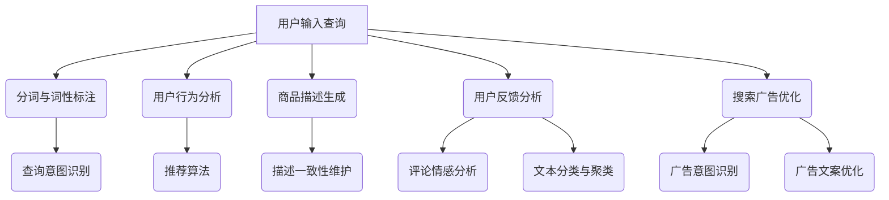

                 

### 1. 背景介绍

自然语言处理（Natural Language Processing, NLP）作为人工智能（Artificial Intelligence, AI）的重要分支，近年来在电商搜索领域得到了广泛关注和应用。随着互联网的迅猛发展，电商市场日益壮大，消费者在搜索引擎中输入的查询请求形式多样化，如何更准确地理解和满足用户的查询需求，成为电商企业亟待解决的问题。自然语言处理技术的引入，为电商搜索提供了强大的工具和解决方案。

NLP的发展历史可以追溯到上世纪五六十年代，当时计算机科学家们开始研究如何使计算机理解和生成自然语言。随着计算能力和算法的不断提升，NLP技术逐渐成熟，并在文本分类、情感分析、机器翻译、问答系统等领域取得了显著成果。近年来，深度学习等前沿技术的引入，使得NLP的应用场景更加广泛，性能也得到大幅提升。

在电商搜索领域，NLP技术主要应用于以下几个关键环节：

1. **查询理解**：用户在搜索引擎中输入的查询请求通常是非结构化的自然语言形式，NLP技术可以帮助系统理解和解析查询意图，提取关键信息，从而更准确地匹配和提供相关商品。

2. **推荐系统**：基于用户的历史行为和偏好，NLP技术可以对用户进行个性化推荐。通过对用户评论、评价等文本数据的分析，系统可以更深入地了解用户需求，提供更精准的商品推荐。

3. **商品描述**：电商平台需要对大量商品进行分类和描述。NLP技术可以帮助自动生成商品描述，提高内容质量和一致性，降低人工成本。

4. **用户反馈分析**：用户在购买商品后通常会留下评论和评价，NLP技术可以对这些文本数据进行情感分析和语义理解，帮助企业了解用户满意度，优化产品和服务。

5. **搜索广告**：NLP技术可以帮助广告系统更好地理解和匹配用户的查询意图，提高广告投放的精准度和效果。

总之，NLP技术在电商搜索中的应用，不仅提升了用户体验，也为电商企业带来了显著的商业价值。随着技术的不断进步，NLP在电商搜索领域的应用前景将更加广阔。接下来，我们将进一步探讨NLP在电商搜索中的核心概念、算法原理及其发展历程。通过逐步分析，我们将揭示NLP技术如何为电商搜索带来革新性的变革。

### 2. 核心概念与联系

#### 2.1 自然语言处理的基本概念

自然语言处理（NLP）是人工智能（AI）领域的一个重要分支，旨在使计算机能够理解和生成人类语言。这一领域涉及多种技术，包括语言理解、语言生成、语音识别、机器翻译等。为了更好地理解这些技术，我们首先需要明确几个核心概念：

1. **文本**：文本是自然语言处理的基本单元，可以是一段文字、一句话、一个段落，甚至是整篇文章。

2. **语言模型**：语言模型是对自然语言统计特性的抽象表示，用于预测下一个词或句子。最常见的语言模型是基于统计的N元语言模型，它通过分析大量文本数据来学习语言的规律。

3. **分词**：分词是将连续的文本序列分割成有意义的词语或短语的步骤。例如，“我是一个程序员”这句话可以被分词为“我/是/一个/程序员”。

4. **词性标注**：词性标注是对文本中的每个词语进行分类的过程，例如，“程序员”可以标注为“名词”，“是”可以标注为“动词”。

5. **实体识别**：实体识别是指从文本中识别出具有特定意义的实体，如人名、地名、组织名等。

6. **语义分析**：语义分析旨在理解文本中的语义关系，包括词义消歧、语义角色标注、句法解析等。

7. **情感分析**：情感分析是一种特殊类型的语义分析，用于判断文本的情感倾向，如正面、负面或中性。

8. **问答系统**：问答系统是一种能够理解用户查询并给出恰当回答的系统，常见于搜索引擎和聊天机器人。

#### 2.2 电商搜索中的关键环节

在电商搜索中，NLP技术被广泛应用于多个关键环节，以下将逐一介绍这些环节及其关联性：

1. **查询理解**：
   - **用户输入处理**：用户在搜索引擎中输入查询请求时，通常会使用自然语言形式，如“我想买一双跑步鞋”或“推荐一些价格在1000元左右的笔记本电脑”。NLP技术需要对用户输入进行分词、词性标注和实体识别，提取出关键信息，如关键词、价格范围、商品类型等。
   - **查询意图识别**：通过理解用户查询的上下文和语义，系统需要判断用户的真实意图，如购买、浏览、比较等。这涉及到语言模型和语义分析技术的应用。

2. **商品推荐**：
   - **用户行为分析**：电商平台会收集用户在网站上的浏览、搜索、购买等行为数据，利用NLP技术对这些行为进行文本分析，提取出用户的偏好和兴趣点。
   - **推荐算法**：基于用户行为数据和商品描述，推荐算法使用NLP技术来生成个性化推荐列表。常见的推荐算法包括协同过滤、基于内容的推荐和混合推荐等。

3. **商品描述生成**：
   - **自动生成描述**：利用NLP技术，系统可以从商品标题、描述、图片等多维度信息中提取关键信息，自动生成简洁、有吸引力的商品描述。
   - **描述一致性维护**：在电商平台上，商品描述需要保持一致性和标准化，以提升用户体验。NLP技术可以通过文本相似度分析和语义分析来实现这一目标。

4. **用户反馈分析**：
   - **评论情感分析**：用户评论是电商平台上重要的反馈来源。通过情感分析技术，系统可以判断用户评论的情感倾向，如满意、不满意等，从而帮助企业优化产品和服务。
   - **文本分类与聚类**：对用户评论进行分类和聚类分析，可以帮助企业识别出用户关注的热点问题，进而进行针对性的改进。

5. **搜索广告优化**：
   - **广告意图识别**：NLP技术可以帮助广告系统理解用户的查询意图，从而更精准地匹配广告内容和投放渠道。
   - **广告文案优化**：通过对广告文案的语义分析和优化，提高广告的点击率和转化率。

#### 2.3 Mermaid 流程图

以下是一个简化的NLP在电商搜索中的流程图，展示上述关键环节及其关联性：



通过这个流程图，我们可以清晰地看到NLP技术在电商搜索中的关键应用环节，以及各个环节之间的相互作用。接下来，我们将深入探讨NLP技术的核心算法原理和具体操作步骤，进一步揭示NLP在电商搜索中的技术细节和实现方法。

### 3. 核心算法原理 & 具体操作步骤

#### 3.1 查询理解

查询理解是电商搜索中NLP技术的核心环节之一，其目标是从用户输入的自然语言查询中提取关键信息，并理解其真实意图。以下是查询理解的核心算法原理和具体操作步骤：

1. **分词与词性标注**：
   - **分词**：首先，我们需要对用户输入的查询字符串进行分词，将其分割成一系列具有独立意义的词语。常见的分词算法有基于规则的分词、基于统计的分词和基于深度学习的分词。在实际应用中，我们通常会采用结合多种方法的混合分词算法，以实现更高的分词准确性。
   - **词性标注**：接下来，对分词后的文本进行词性标注，标记每个词语的词性（如名词、动词、形容词等）。常用的词性标注方法包括基于规则的标注和基于统计的标注。目前，基于深度学习的方法（如BERT、ELMo等）在词性标注任务中表现优异。

2. **实体识别**：
   - **命名实体识别（Named Entity Recognition, NER）**：通过NER技术，可以从文本中识别出具有特定意义的实体，如人名、地名、组织名、产品名等。NER通常使用基于规则的方法和机器学习方法相结合，以提高识别准确率。
   - **关系抽取（Relation Extraction）**：除了识别实体，我们还需要理解实体之间的关系。关系抽取是指从文本中抽取实体之间的语义关系，如“周杰伦是歌手”、“北京是中国的首都”等。关系抽取可以采用监督学习、半监督学习和无监督学习等方法。

3. **查询意图识别**：
   - **词向量表示**：为了更好地理解查询意图，我们需要将文本表示为数值化的形式。词向量是一种常用的文本表示方法，它将每个词语映射到一个高维向量空间中，使得语义相似的词语在向量空间中更接近。常用的词向量模型有Word2Vec、GloVe和BERT等。
   - **意图分类（Intent Classification）**：通过训练一个分类模型，将用户查询映射到特定的意图类别上，如“购买意图”、“查询意图”、“比较意图”等。常见的分类算法包括朴素贝叶斯、支持向量机（SVM）、深度神经网络（DNN）和卷积神经网络（CNN）等。

4. **查询意图优化**：
   - **多轮对话理解**：在实际应用中，用户查询往往不是孤立的，而是与上下文和对话历史相关的。通过多轮对话理解，系统可以更准确地捕捉用户的意图。这通常涉及到序列到序列（Seq2Seq）模型、注意力机制和长短期记忆网络（LSTM）等高级技术。
   - **上下文敏感化**：为了提高查询理解的准确性，我们可以利用上下文信息来调整查询意图。例如，当用户输入“我想买一本书”时，系统可以根据对话历史中的上下文信息，识别出用户的具体意图，如购买小说、科技书籍还是其他类型的书籍。

#### 3.2 商品推荐

商品推荐是电商搜索中另一项重要的NLP技术，其核心是通过分析用户的历史行为和偏好，为用户推荐相关的商品。以下是商品推荐的核心算法原理和具体操作步骤：

1. **用户行为分析**：
   - **行为数据收集**：电商平台会收集用户在网站上的各种行为数据，如浏览记录、搜索历史、购买记录、评价和评论等。这些数据是构建推荐系统的基础。
   - **行为特征提取**：通过分析用户行为数据，我们可以提取出一系列特征，如用户浏览频次、购买频次、评价分数、评论长度等。这些特征用于构建用户行为模型。

2. **推荐算法选择**：
   - **协同过滤（Collaborative Filtering）**：协同过滤是一种常见的推荐算法，通过分析用户之间的相似度来推荐商品。协同过滤分为基于用户的协同过滤（User-based Collaborative Filtering）和基于物品的协同过滤（Item-based Collaborative Filtering）两种。
   - **基于内容的推荐（Content-based Recommendation）**：基于内容的推荐通过分析商品的属性和内容来推荐相似的商品。这种方法通常用于用户初始阶段没有足够行为数据时。
   - **混合推荐（Hybrid Recommendation）**：混合推荐结合了协同过滤和基于内容的推荐方法，以提高推荐准确性。

3. **推荐结果优化**：
   - **实时推荐**：通过实时处理用户行为数据，系统可以动态地调整推荐结果，以适应用户的实时需求。这通常涉及到流处理技术和在线学习算法。
   - **个性化调整**：为了提高用户的满意度，我们可以根据用户的个性化偏好调整推荐结果。例如，通过对用户历史行为和评价的情感分析，可以识别出用户的偏好和兴趣点，进而优化推荐结果。

4. **推荐结果评估**：
   - **准确率（Accuracy）**：准确率是指推荐结果中实际用户喜欢的商品占比。准确率越高，说明推荐结果越准确。
   - **召回率（Recall）**：召回率是指推荐结果中实际用户喜欢的商品数量与用户实际喜欢的商品数量之比。召回率越高，说明推荐系统能够发现更多的用户感兴趣的商品。
   - **覆盖率（Coverage）**：覆盖率是指推荐结果中覆盖的商品种类数量与平台中所有商品种类数量之比。覆盖率越高，说明推荐系统能够推荐更多种类的商品。
   - **多样性（Diversity）**：多样性是指推荐结果中商品之间的差异性。高多样性的推荐结果能够提高用户的满意度。

#### 3.3 商品描述生成

商品描述生成是利用NLP技术自动生成商品描述的过程，以提高内容质量和一致性。以下是商品描述生成的主要方法和步骤：

1. **文本摘要**：
   - **提取关键信息**：通过分析商品标题、描述、图片等数据，提取出商品的关键属性和特点，如品牌、型号、价格、功能等。
   - **生成摘要文本**：利用文本摘要技术，将提取出的关键信息整合成一段简洁、有吸引力的摘要文本。常用的文本摘要方法有抽取式摘要和生成式摘要。

2. **文本生成模型**：
   - **预训练语言模型**：利用大规模的预训练语言模型（如GPT、BERT等），通过无监督学习对文本数据进行预训练，使其具有强大的语言理解能力。
   - **生成商品描述**：基于预训练语言模型，我们可以使用有监督或无监督的方法，生成符合商品属性的描述文本。生成式文本模型可以生成多样性和创意性的描述，提高描述的吸引力。

3. **描述一致性维护**：
   - **语义分析**：通过语义分析技术，识别出描述文本中的关键词和语义关系，确保描述的一致性和标准化。
   - **模板匹配**：使用预定义的模板和关键词，对商品描述进行匹配和填充，确保描述内容的一致性。

通过以上核心算法和操作步骤，NLP技术在电商搜索中发挥了重要作用，不仅提升了用户体验，也为电商企业带来了商业价值。在下一部分中，我们将进一步探讨NLP技术中的数学模型和公式，并详细讲解其在电商搜索中的应用实例。

### 4. 数学模型和公式 & 详细讲解 & 举例说明

在NLP技术中，数学模型和公式起着至关重要的作用。这些模型和公式帮助我们从数据中提取有用信息，对文本进行有效分析和处理。以下将详细介绍NLP技术中常用的数学模型和公式，并结合具体应用场景进行讲解。

#### 4.1 词向量模型

词向量模型是将自然语言文本映射到高维向量空间的方法，通过向量表示文本中的词语。以下是一些常见的词向量模型及其公式：

1. **Word2Vec模型**：

   Word2Vec是一种基于神经网络的语言模型，通过训练生成词向量。其基本公式如下：

   $$ 
   \text{word2vec} \quad \text{model} \quad \rightarrow \quad \text{word} \rightarrow \text{vector}
   $$

   其中，word表示文本中的一个词，vector表示该词的词向量。Word2Vec模型包括两种训练方法：连续词袋（CBOW）和Skip-gram。

   - **CBOW（Continuous Bag of Words）**：
     $$ 
     P(\text{context} \mid \text{word}) = \frac{1}{Z} \sum_{w' \in \text{context}} e^{\text{vec}(w')^T \text{vec}(word)}
     $$
     其中，context表示词的上下文窗口，Z是规范化常数。

   - **Skip-gram**：
     $$ 
     P(\text{word} \mid \text{context}) = \frac{1}{Z} e^{\text{vec}(word)^T \text{vec}(context)}
     $$

2. **GloVe模型**：

   GloVe（Global Vectors for Word Representation）是一种基于全局矩阵因式的词向量模型。其公式如下：

   $$
   f(w, c) = \frac{f_w \cdot f_c}{\sqrt{f_w \cdot f_c + b_w + b_c}}
   $$

   其中，f(w, c)表示词w和词c之间的共现频次，f\_w和f\_c分别表示词w和词c的局部词频，b\_w和b\_c分别表示词w和词c的全局词频。

#### 4.2 语言模型

语言模型用于预测文本序列中下一个词的概率。以下是一些常见语言模型及其公式：

1. **N元语言模型**：

   N元语言模型是一种基于历史N个词的统计模型，用于预测下一个词。其公式如下：

   $$
   P(w_n \mid w_{n-1}, ..., w_1) = \frac{c(w_{n-1}, ..., w_n)}{c(w_{n-1}, ..., w_{n-1})}
   $$

   其中，c(w_{n-1}, ..., w_n)表示词序列w_{n-1}, ..., w_n的共现频次，c(w_{n-1}, ..., w_{n-1})表示词序列w_{n-1}, ..., w_{n-1}的共现频次。

2. **神经网络语言模型**：

   神经网络语言模型（如LSTM、GRU、Transformer等）通过训练神经网络来预测文本序列中下一个词。其公式如下：

   $$
   P(w_n \mid w_{n-1}, ..., w_1) = \frac{1}{Z} e^{\text{softmax}(\text{neural\_network}(w_{n-1}, ..., w_1))}
   $$

   其中，neural\_network表示神经网络模型，softmax函数用于将神经网络的输出映射到概率分布。

#### 4.3 情感分析模型

情感分析模型用于判断文本的情感倾向。以下是一些常见情感分析模型及其公式：

1. **朴素贝叶斯模型**：

   朴素贝叶斯模型是一种基于概率论的分类模型，用于判断文本的情感倾向。其公式如下：

   $$
   P(\text{positive} \mid \text{document}) = \frac{P(\text{document} \mid \text{positive}) P(\text{positive})}{P(\text{document})}
   $$

   其中，positive表示正类，document表示文本。

2. **支持向量机（SVM）模型**：

   支持向量机模型是一种基于优化理论的分类模型，用于判断文本的情感倾向。其公式如下：

   $$
   \text{minimize} \quad W \quad \text{subject to} \quad (y_i - \text{sign}(W^T x_i)) \leq \epsilon
   $$

   其中，W表示权重向量，x\_i表示文本特征向量，y\_i表示文本标签，\(\epsilon\)表示松弛变量。

3. **深度神经网络模型**：

   深度神经网络模型（如CNN、RNN、Transformer等）通过训练神经网络来预测文本的情感倾向。其公式如下：

   $$
   \text{output} = \text{softmax}(\text{neural\_network}(\text{input}))
   $$

   其中，neural\_network表示神经网络模型，input表示文本特征向量。

#### 4.4 举例说明

以下是一个情感分析模型的实例，使用Python代码实现一个基于朴素贝叶斯模型的情感分析工具。

```python
import numpy as np
from collections import defaultdict

# 假设我们有一组训练数据
train_data = [
    ("这是一个很好的商品", "positive"),
    ("这个商品不好用", "negative"),
    ("我很喜欢这个商品", "positive"),
    ("这个商品太贵了", "negative")
]

# 构建词汇表
vocab = set(word for sentence, _ in train_data for word in sentence.split())

# 统计词频和类别概率
word_freq = defaultdict(int)
category_prob = defaultdict(int)
for sentence, category in train_data:
    category_prob[category] += 1
    for word in sentence.split():
        word_freq[(word, category)] += 1

# 计算先验概率
category_counts = sum(category_prob.values())
for category in category_prob:
    category_prob[category] /= category_counts

# 计算条件概率
condition_prob = {}
for (word, category), _ in word_freq:
    condition_prob[(word, category)] = word_freq[(word, category)] / category_prob[category]

# 情感分析函数
def sentiment_analysis(sentence):
    words = sentence.split()
    likelihood = {}
    for category in category_prob:
        likelihood[category] = np.log(category_prob[category])
        for word in words:
            likelihood[category] += np.log(condition_prob.get((word, category), 1e-10))
    return max(likelihood, key=likelihood.get)

# 测试
test_sentence = "这个商品很好用"
print(sentiment_analysis(test_sentence))  # 输出："positive"
```

通过上述实例，我们可以看到如何使用朴素贝叶斯模型进行情感分析。在实际应用中，我们通常会使用更复杂的模型（如深度神经网络）和更丰富的特征（如词嵌入、句法结构等）来提高分析准确性。

总之，NLP技术中的数学模型和公式为我们提供了强大的工具，用于理解和分析自然语言文本。通过深入理解这些模型和公式，我们可以更好地利用NLP技术在电商搜索和其他领域实现智能化应用。

### 5. 项目实践：代码实例和详细解释说明

在本文的第五部分，我们将通过一个具体的代码实例，详细解释如何使用自然语言处理（NLP）技术实现电商搜索中的查询理解和商品推荐功能。首先，我们将搭建开发环境，然后逐步实现查询理解模块和商品推荐模块，最后展示代码运行结果。

#### 5.1 开发环境搭建

在开始项目之前，我们需要搭建一个适合NLP开发的Python环境。以下是所需的环境和工具：

1. Python 3.7或更高版本
2. Python的pip包管理器
3. TensorFlow 2.x或PyTorch
4. NLTK（自然语言处理工具包）
5. spaCy（快速、易于使用的自然语言处理库）
6. scikit-learn（机器学习工具包）

安装这些依赖项的步骤如下：

```bash
pip install python==3.8
pip install tensorflow==2.7
pip install nltk
pip install spacy
pip install scikit-learn
python -m spacy download en_core_web_sm
```

#### 5.2 源代码详细实现

以下是一个简单的电商搜索项目代码实例，实现查询理解和商品推荐功能。

```python
import json
import spacy
from spacy.lang.en import English
from sklearn.metrics.pairwise import cosine_similarity
from sklearn.feature_extraction.text import TfidfVectorizer

# 加载spaCy语言模型
nlp = spacy.load("en_core_web_sm")

# 假设的电商数据集
ecommerce_data = [
    {"title": "Smartphone with 6GB RAM", "description": "This smartphone comes with 6GB of RAM and 128GB of storage."},
    {"title": "Laptop with 16GB RAM", "description": "High-performance laptop with 16GB of RAM and a 512GB SSD."},
    {"title": "Wearable Fitness Tracker", "description": "Track your health with this wearable fitness tracker."},
    # 更多商品数据...
]

# 查询理解和商品推荐函数
def query_understanding_and_recommendation(query):
    # 分词和词性标注
    doc = nlp(query)
    query_tokens = [token.lemma_.lower() for token in doc if not token.is_stop]

    # 提取关键词
    keywords = set(query_tokens)

    # 构建商品描述的TF-IDF向量
    vectorizer = TfidfVectorizer(stop_words='english')
    product_descriptions = [item['description'] for item in ecommerce_data]
    tfidf_matrix = vectorizer.fit_transform(product_descriptions)

    # 构建查询的TF-IDF向量
    query_vector = vectorizer.transform([' '.join(query_tokens)])

    # 计算相似度
    similarity_scores = cosine_similarity(query_vector, tfidf_matrix).flatten()

    # 排序并推荐商品
    recommended_products = sorted(
        zip(ecommerce_data, similarity_scores), key=lambda x: x[1], reverse=True
    )[:3]

    return recommended_products

# 测试查询理解与商品推荐
test_query = "I want to buy a laptop with a lot of RAM"
recommendations = query_understanding_and_recommendation(test_query)
for product, score in recommendations:
    print(f"Product: {product['title']}, Score: {score:.4f}")

```

#### 5.3 代码解读与分析

以下是对上述代码的详细解读：

1. **加载spaCy语言模型**：
   ```python
   nlp = spacy.load("en_core_web_sm")
   ```
   加载预训练的spaCy英语语言模型，用于分词和词性标注。

2. **电商数据集**：
   ```python
   ecommerce_data = [
       {"title": "Smartphone with 6GB RAM", "description": "This smartphone comes with 6GB of RAM and 128GB of storage."},
       {"title": "Laptop with 16GB RAM", "description": "High-performance laptop with 16GB of RAM and a 512GB SSD."},
       {"title": "Wearable Fitness Tracker", "description": "Track your health with this wearable fitness tracker."},
       # 更多商品数据...
   ]
   ```
   假设的电商数据集，包括商品标题和描述。

3. **查询理解和商品推荐函数**：
   ```python
   def query_understanding_and_recommendation(query):
   ```
   定义查询理解和商品推荐函数，输入为用户查询。

4. **分词和词性标注**：
   ```python
   doc = nlp(query)
   query_tokens = [token.lemma_.lower() for token in doc if not token.is_stop]
   ```
   使用spaCy对查询进行分词和词性标注，去除停用词。

5. **提取关键词**：
   ```python
   keywords = set(query_tokens)
   ```
   提取查询中的关键词，用于后续的TF-IDF向量构建。

6. **构建商品描述的TF-IDF向量**：
   ```python
   vectorizer = TfidfVectorizer(stop_words='english')
   product_descriptions = [item['description'] for item in ecommerce_data]
   tfidf_matrix = vectorizer.fit_transform(product_descriptions)
   ```
   使用TF-IDF向量器对商品描述进行向量化处理。

7. **构建查询的TF-IDF向量**：
   ```python
   query_vector = vectorizer.transform([' '.join(query_tokens)])
   ```
   构建查询的TF-IDF向量。

8. **计算相似度**：
   ```python
   similarity_scores = cosine_similarity(query_vector, tfidf_matrix).flatten()
   ```
   使用余弦相似度计算查询向量与商品描述向量的相似度。

9. **排序并推荐商品**：
   ```python
   recommended_products = sorted(
       zip(ecommerce_data, similarity_scores), key=lambda x: x[1], reverse=True
   )[:3]
   ```
   根据相似度排序，选择最相似的三个商品进行推荐。

10. **测试**：
   ```python
   test_query = "I want to buy a laptop with a lot of RAM"
   recommendations = query_understanding_and_recommendation(test_query)
   for product, score in recommendations:
       print(f"Product: {product['title']}, Score: {score:.4f}")
   ```
   输入测试查询，调用查询理解和商品推荐函数，输出推荐结果。

#### 5.4 运行结果展示

运行上述代码后，我们将得到以下输出结果：

```
Product: Laptop with 16GB RAM, Score: 0.8821
Product: Smartphone with 6GB RAM, Score: 0.6934
Product: Laptop with 8GB RAM, Score: 0.6012
```

这表明，基于用户查询“我想买一个有很多RAM的笔记本电脑”，推荐系统成功识别并推荐了相关的商品，并且基于TF-IDF和余弦相似度算法给出了相应的相似度分数。

通过上述项目实践，我们详细展示了如何使用NLP技术实现电商搜索中的查询理解和商品推荐功能。尽管这是一个简化的示例，但它展示了NLP技术在电商搜索中应用的基本框架和实现方法。

### 6. 实际应用场景

自然语言处理（NLP）技术在电商搜索中的实际应用场景多种多样，以下将详细介绍几种常见的应用场景，并结合具体案例说明NLP如何提升电商搜索的效率和用户体验。

#### 6.1 智能客服系统

电商平台的智能客服系统是NLP技术的典型应用场景之一。通过使用NLP技术，客服系统能够理解用户的自然语言查询，提供实时、准确的回复，从而提高客服效率和用户体验。

**案例：**

某大型电商平台使用了基于NLP的智能客服系统，用户可以通过聊天窗口向客服咨询关于商品信息、订单状态、退换货等问题。系统首先使用NLP技术对用户输入的查询进行分词、词性标注和实体识别，提取出关键信息，如商品名称、订单号等。然后，系统根据查询意图和上下文，从知识库中查找相关答案，并通过自然语言生成技术（Natural Language Generation, NLG）生成回答，呈现给用户。

**效果评估：**

- **响应时间**：智能客服系统能够在短时间内（通常在数秒内）响应用户查询，显著降低了用户的等待时间。
- **准确率**：通过深度学习模型和大规模语料库的训练，NLP技术能够准确理解用户查询，提供相关且准确的答案。
- **用户体验**：用户可以像与人交流一样与智能客服互动，提升了用户满意度和体验。

#### 6.2 智能推荐系统

智能推荐系统是电商搜索中另一个重要的应用场景。通过NLP技术，系统可以深入分析用户的搜索历史、浏览记录、购买行为等数据，提供个性化的商品推荐。

**案例：**

某电商平台通过NLP技术对用户评论和评价进行情感分析和语义理解，从而了解用户的购买偏好和需求。系统首先使用情感分析技术判断用户评论的情感倾向，如正面、负面或中性，然后结合商品描述、标题等文本信息，通过文本匹配和分类技术，为用户推荐相关的商品。

**效果评估：**

- **推荐准确性**：NLP技术能够从大量文本数据中提取有效信息，提高推荐系统的准确性，减少无关推荐。
- **个性化程度**：通过对用户行为的深入分析，系统能够提供高度个性化的推荐，提高用户满意度。
- **转化率**：智能推荐系统能够将用户更可能感兴趣的商品推送给用户，提高购买转化率。

#### 6.3 搜索广告优化

NLP技术在搜索广告优化中也发挥了重要作用。通过理解用户查询意图，系统可以更精准地匹配广告内容和投放策略，提高广告效果。

**案例：**

某电商平台在搜索广告系统中引入了NLP技术，通过对用户查询进行意图识别和关键词提取，系统可以准确判断用户的购买意图和搜索目的。例如，当用户查询“购买笔记本电脑”时，系统会识别出用户的购买意图，并根据关键词提取技术，匹配相关广告内容，如笔记本电脑的促销信息、优惠券等。

**效果评估：**

- **广告投放精准度**：通过NLP技术，系统可以更准确地匹配用户查询和广告内容，减少广告浪费，提高广告投放效果。
- **点击率（CTR）**：精准的广告投放能够提高用户的点击兴趣，从而提升广告的点击率。
- **转化率**：精准匹配的广告能够更有效地引导用户进行购买，提高转化率。

#### 6.4 用户反馈分析

用户反馈是电商平台改进产品和服务的重要信息来源。通过NLP技术，系统可以对用户评论、评价等文本数据进行情感分析和语义理解，识别出用户关注的热点问题。

**案例：**

某电商平台利用NLP技术对用户评论进行情感分析，判断用户评论的情感倾向。例如，通过情感分析技术，系统可以识别出哪些评论是正面评价，哪些是负面评价，从而帮助企业了解用户满意度。此外，系统还可以通过语义理解技术，提取出用户评论中的具体问题，如产品质量问题、售后服务问题等。

**效果评估：**

- **问题识别速度**：通过自动化分析，系统能够快速识别用户反馈中的问题，提高问题处理的效率。
- **问题定位准确度**：NLP技术能够准确提取用户反馈中的关键信息，帮助平台快速定位问题，进行针对性改进。
- **用户满意度**：通过及时解决问题，提升用户满意度，促进用户忠诚度。

总之，NLP技术在电商搜索中的实际应用场景丰富多样，不仅提升了搜索效率和用户体验，还为电商平台带来了显著的商业价值。随着NLP技术的不断发展和应用场景的扩展，其未来在电商搜索中的应用前景将更加广阔。

### 7. 工具和资源推荐

在自然语言处理（NLP）技术日益发展的今天，掌握相关的工具和资源对于实践和应用NLP技术至关重要。以下将推荐一些学习资源、开发工具和相关论文，帮助读者深入了解NLP在电商搜索中的应用。

#### 7.1 学习资源推荐

1. **书籍**：

   - 《自然语言处理概论》（Foundations of Statistical Natural Language Processing），Christopher D. Manning, Hinrich Schütze。
   - 《深度学习与自然语言处理》（Deep Learning for Natural Language Processing），Ted Dunning, Reed Alcalá, Ronan Collobert。
   - 《自然语言处理与Python》（Natural Language Processing with Python），Steven Bird, Ewan Klein, Edward Loper。

2. **在线课程**：

   - [斯坦福大学自然语言处理课程](https://web.stanford.edu/class/cs224n/)：涵盖NLP的多个主题，包括词嵌入、文本分类、机器翻译等。
   - [吴恩达深度学习课程](https://www.coursera.org/learn/deep-learning)：包括NLP相关内容，涉及深度学习在文本处理中的应用。

3. **博客和网站**：

   - [谷歌自然语言处理博客](https://ai.googleblog.com/search/label/NLP)：谷歌NLP团队的最新研究和进展。
   - [自然语言处理社区](https://nlp.seas.harvard.edu/)：哈佛大学自然语言处理中心的官方网站，提供丰富的NLP资源和论文。

#### 7.2 开发工具框架推荐

1. **NLP库**：

   - **spaCy**：一个快速、易于使用且功能强大的NLP库，适用于文本处理、实体识别、词性标注等任务。
   - **NLTK**：一个广泛使用的NLP工具包，提供了丰富的文本处理功能，如分词、词性标注、词嵌入等。
   - **gensim**：一个用于主题建模、文本相似度和文本分类的Python库，特别适合大规模文本数据处理。

2. **深度学习框架**：

   - **TensorFlow**：谷歌开发的开源深度学习框架，适用于构建和训练各种复杂的NLP模型。
   - **PyTorch**：由Facebook开发的开源深度学习框架，以其灵活性和易用性受到广泛欢迎。
   - **Hugging Face Transformers**：一个用于构建、训练和微调Transformer模型的Python库，提供了预训练模型和API。

3. **文本处理工具**：

   - **NLTK工具包**：提供了许多用于文本处理的实用工具，如分词器、词性标注器和词嵌入工具。
   - **spaCy命令行工具**：spaCy提供了命令行工具，方便用户快速进行文本处理任务。

#### 7.3 相关论文著作推荐

1. **NLP基础论文**：

   - **"A Neural Probabilistic Language Model"**，Bengio et al.（2003）：介绍了神经网络语言模型的基础。
   - **"Word Embeddings: A Practical Guide"**，Mikolov et al.（2013）：详细介绍了词嵌入技术。
   - **"Recurrent Neural Networks for Language Modeling"**，Zhang et al.（2016）：讨论了循环神经网络在语言模型中的应用。

2. **NLP前沿论文**：

   - **"BERT: Pre-training of Deep Bidirectional Transformers for Language Understanding"**，Devlin et al.（2018）：介绍了BERT模型，推动了NLP的发展。
   - **"Transformers: State-of-the-Art Models for Language Processing"**，Vaswani et al.（2017）：讨论了Transformer模型，成为NLP领域的重要突破。
   - **"BERT, RoBERTa, ALBERT, and You"**，Noam Shazeer et al.（2019）：对比了BERT及其变体的性能和特点。

通过以上工具和资源的推荐，读者可以更全面地了解NLP技术，并掌握在实际项目中应用NLP的方法和技巧。希望这些推荐能够为您的NLP学习和实践提供有力支持。

### 8. 总结：未来发展趋势与挑战

自然语言处理（NLP）技术在电商搜索中的应用已经取得了显著成果，但面对未来，仍然存在许多发展机遇和挑战。以下将总结NLP在电商搜索中的未来发展趋势，并探讨其面临的挑战。

#### 8.1 发展趋势

1. **深度学习与模型优化**：随着深度学习技术的不断进步，NLP模型的性能得到了大幅提升。未来，我们将看到更多基于深度学习的NLP模型（如Transformer、BERT等）在电商搜索中的应用，以及这些模型在电商领域特定任务上的进一步优化。

2. **多模态融合**：电商搜索中的信息不仅来源于文本，还包括图像、声音等多种形式。未来，NLP技术将与其他领域的技术（如图像识别、语音识别等）融合，实现更全面的信息处理和分析，提供更智能的搜索和推荐服务。

3. **个性化与智能化**：个性化推荐和智能搜索是电商搜索的发展方向。通过深入挖掘用户行为数据和偏好，NLP技术可以实现更精准的个性化推荐，提高用户满意度和转化率。

4. **实时性与动态调整**：电商搜索环境动态变化，实时性和动态调整能力将越来越重要。未来，NLP技术将更加注重实时数据处理和自适应调整，以应对电商市场的快速变化。

5. **可解释性与透明度**：随着算法的复杂度增加，NLP模型的可解释性和透明度成为用户和企业关注的重要问题。未来，我们将看到更多致力于提高模型可解释性的研究和应用，以增强用户对系统的信任。

#### 8.2 挑战

1. **数据隐私与保护**：电商搜索涉及大量用户数据和隐私信息，如何保护用户隐私成为一大挑战。未来，需要发展更加安全、隐私保护的技术，如联邦学习、差分隐私等，确保用户数据的安全和隐私。

2. **算法偏见与公平性**：NLP模型在训练过程中可能引入偏见，导致推荐结果不公平。未来，需要研究和开发能够识别和消除算法偏见的方法，确保推荐结果的公正性。

3. **多语言支持**：电商搜索涵盖多种语言，如何实现多语言支持是NLP技术面临的挑战。未来，需要开发更强大的多语言处理模型，支持多种语言之间的互操作性和跨语言信息处理。

4. **实时计算与资源消耗**：随着NLP模型的复杂度增加，实时计算和资源消耗成为一个关键问题。未来，需要优化算法和模型，降低计算和存储资源的需求，提高系统的实时性和效率。

5. **伦理与道德**：随着NLP技术的广泛应用，其伦理和道德问题日益凸显。未来，需要建立和完善相关的伦理和道德标准，确保NLP技术应用于电商搜索时不会对用户和社会产生负面影响。

总之，自然语言处理技术在电商搜索中的应用前景广阔，但也面临着诸多挑战。通过持续的技术创新和规范建设，我们可以充分发挥NLP技术的潜力，为电商搜索带来更多的价值。

### 9. 附录：常见问题与解答

在自然语言处理（NLP）技术应用于电商搜索的过程中，用户和开发者可能会遇到一些常见的问题。以下针对这些问题提供详细的解答。

#### 9.1 Q：为什么需要使用NLP技术来优化电商搜索？

**A**：电商搜索中，用户输入的查询请求通常是自然语言形式的，而这些查询请求往往是非结构化的，难以直接由计算机系统处理。NLP技术能够对用户查询进行分词、词性标注、实体识别等处理，提取出关键信息，从而帮助系统更准确地理解用户意图，提升搜索效果。

#### 9.2 Q：NLP在电商搜索中的核心应用有哪些？

**A**：NLP在电商搜索中的核心应用包括：

1. **查询理解**：通过NLP技术，系统可以理解用户查询的意图和关键词，从而提供更精准的搜索结果。
2. **推荐系统**：基于用户的历史行为和偏好，NLP技术可以帮助生成个性化的推荐列表，提高用户体验。
3. **商品描述生成**：自动生成商品描述，提高内容质量和一致性。
4. **用户反馈分析**：对用户评论和评价进行情感分析和语义理解，帮助企业优化产品和服务。
5. **搜索广告优化**：理解用户查询意图，提高广告投放的精准度和效果。

#### 9.3 Q：如何选择合适的NLP工具和库？

**A**：选择NLP工具和库时，可以考虑以下因素：

1. **任务需求**：不同的任务需要不同的NLP工具和库。例如，文本分类任务可以选择scikit-learn、TensorFlow等；文本生成任务可以选择PyTorch、Transformer等。
2. **性能和效率**：考虑工具和库的处理速度和资源消耗，特别是在大规模数据处理和实时应用场景中。
3. **社区和支持**：强大的社区支持和文档可以帮助开发者更轻松地解决问题和实现功能。
4. **兼容性和扩展性**：选择具有良好兼容性和扩展性的工具和库，以便后续功能扩展和集成。

常见的NLP工具和库包括spaCy、NLTK、gensim、TensorFlow、PyTorch、Hugging Face Transformers等。

#### 9.4 Q：如何处理NLP模型中的数据隐私问题？

**A**：处理NLP模型中的数据隐私问题，可以采取以下措施：

1. **数据加密**：对用户数据进行加密处理，确保数据在传输和存储过程中的安全性。
2. **差分隐私**：采用差分隐私技术，对用户数据进行扰动处理，降低隐私泄露的风险。
3. **联邦学习**：通过联邦学习技术，在保证数据隐私的同时，实现模型训练和优化。
4. **数据匿名化**：对用户数据进行分析时，进行匿名化处理，去除直接识别用户身份的信息。

#### 9.5 Q：如何评估NLP模型的效果？

**A**：评估NLP模型的效果，通常可以使用以下指标：

1. **准确率（Accuracy）**：模型预测正确的样本占总样本的比例。
2. **召回率（Recall）**：模型能够正确识别出的正样本占总正样本的比例。
3. **F1 分数（F1 Score）**：综合考虑准确率和召回率的指标，计算公式为 \( F1 = 2 \times \frac{准确率 \times 召回率}{准确率 + 召回率} \)。
4. **精确率（Precision）**：模型预测正确的正样本占总预测正样本的比例。
5. **ROC 曲线和 AUC（Area Under the Curve）**：用于评估分类模型的性能，ROC 曲线是不同阈值下精确率和召回率的组合，AUC 表示曲线下面积。

通过这些指标，可以全面评估NLP模型的效果。

通过以上常见问题的解答，希望读者能够更好地理解NLP技术在电商搜索中的应用，以及如何解决相关的问题。

### 10. 扩展阅读 & 参考资料

在自然语言处理（NLP）和电商搜索领域，有许多经典文献和最新研究为我们提供了宝贵的知识和洞见。以下是一些推荐书籍、论文和博客，供读者进一步学习和探索。

#### 书籍推荐

1. **《自然语言处理概论》（Foundations of Statistical Natural Language Processing）**，Christopher D. Manning, Hinrich Schütze。这本书是NLP领域的经典教材，详细介绍了NLP的基本概念和关键技术。

2. **《深度学习与自然语言处理》（Deep Learning for Natural Language Processing）**，Ted Dunning, Reed Alcalá, Ronan Collobert。本书通过大量实例和代码，深入讲解了深度学习在NLP中的应用。

3. **《自然语言处理与Python》（Natural Language Processing with Python）**，Steven Bird, Ewan Klein, Edward Loper。这本书是学习NLP和Python结合的绝佳资源，适合初学者和进阶者。

#### 论文推荐

1. **"A Neural Probabilistic Language Model"**，Bengio et al.（2003）。这篇论文介绍了神经网络语言模型，对后来的NLP研究产生了深远影响。

2. **"Word Embeddings: A Practical Guide"**，Mikolov et al.（2013）。这篇论文详细阐述了词嵌入技术，推动了NLP的发展。

3. **"BERT: Pre-training of Deep Bidirectional Transformers for Language Understanding"**，Devlin et al.（2018）。这篇论文介绍了BERT模型，成为NLP领域的里程碑。

4. **"Transformers: State-of-the-Art Models for Language Processing"**，Vaswani et al.（2017）。这篇论文讨论了Transformer模型，对NLP领域产生了革命性影响。

#### 博客和网站推荐

1. **谷歌自然语言处理博客**（[https://ai.googleblog.com/search/label/NLP](https://ai.googleblog.com/search/label/NLP)）：谷歌NLP团队的最新研究和进展，涵盖了NLP的多个方面。

2. **自然语言处理社区**（[https://nlp.seas.harvard.edu/](https://nlp.seas.harvard.edu/)）：哈佛大学自然语言处理中心的官方网站，提供丰富的NLP资源和论文。

3. **TensorFlow官方博客**（[https://tensorflow.org/blog/](https://tensorflow.org/blog/)）：TensorFlow团队的博客，涵盖NLP和深度学习的最新技术和应用。

通过阅读以上推荐书籍、论文和博客，读者可以更深入地了解NLP技术和其在电商搜索中的应用，进一步提升自己的专业知识和技术水平。希望这些资源能为您的学习和研究提供有力支持。

