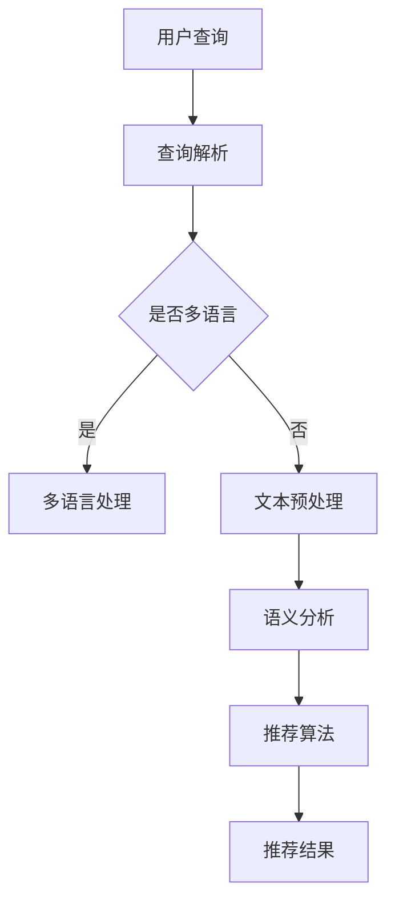

                 

### 1. 背景介绍

自然语言处理（NLP）作为人工智能（AI）领域的重要分支，近年来在电商搜索中的应用越来越广泛。电商平台的搜索功能是用户获取商品信息、进行购买决策的重要途径。然而，随着电商市场规模的不断扩大和用户需求的多样化，传统的基于关键词匹配的搜索方法已经无法满足用户的需求。因此，自然语言处理技术应运而生，通过理解用户查询的语义，提供更加精准、个性化的搜索结果。

NLP在电商搜索中的应用主要体现在以下几个方面：

#### 1.1 提高搜索准确性

自然语言处理技术可以通过词性标注、命名实体识别、词义消歧等手段，对用户输入的查询语句进行深度解析，从而提高搜索的准确性。例如，当用户输入“想要买一款红色的运动鞋”时，传统的搜索算法可能只能识别出关键词“运动鞋”，而NLP技术可以识别出“红色”和“运动鞋”之间的关系，从而返回更相关的搜索结果。

#### 1.2 支持多语言搜索

随着全球化进程的加快，电商平台的用户群体也越来越多样化。NLP技术可以支持多语言搜索，使得非中文用户也能够方便地进行商品搜索。通过机器翻译、语言模型等技术，NLP可以自动将用户输入的非中文查询转换为中文，然后进行搜索。

#### 1.3 提供个性化推荐

基于用户的历史行为数据和搜索查询，NLP技术可以分析用户的兴趣和偏好，从而提供个性化的搜索推荐。例如，当用户频繁搜索“笔记本电脑”时，NLP技术可以推测用户可能对电脑感兴趣，进而推荐相关的商品。

#### 1.4 改善用户体验

传统的搜索框只能处理简单的关键词查询，而NLP技术可以支持更加自然、灵活的查询方式，如语音搜索、图像搜索等。通过这些技术，用户可以更加便捷地获取商品信息，从而提升用户体验。

总的来说，自然语言处理技术在电商搜索中的应用具有巨大的潜力和价值。随着技术的不断进步，NLP将在电商搜索中发挥越来越重要的作用，为用户带来更加精准、个性化的搜索体验。

---

**注：本部分为文章背景介绍，主要目的是引出文章的核心内容，即NLP在电商搜索中的应用。接下来，我们将进一步探讨NLP的核心概念及其在电商搜索中的具体应用。**

### 2. 核心概念与联系

#### 2.1 自然语言处理（NLP）的概念

自然语言处理（NLP）是人工智能（AI）的一个分支，旨在使计算机理解和生成人类自然语言。NLP涉及到多个领域，包括语言学、计算机科学、信息工程和机器学习。其主要目标是让计算机能够“理解”并处理人类语言，以便在多种应用场景中实现人机交互。

#### 2.2 电商搜索的需求

电商搜索系统的核心目标是快速、准确地响应用户查询，并提供相关且个性化的商品推荐。用户的需求多样且复杂，往往涉及关键词匹配、语义理解、个性化推荐等多个层面。因此，电商搜索系统需要具备以下能力：

1. **关键词匹配**：能够准确识别用户输入的关键词，并从中提取关键信息。
2. **语义理解**：理解用户的查询意图，例如区分“寻找红色运动鞋”和“询问红色运动鞋的价格”。
3. **个性化推荐**：根据用户的历史行为和偏好，推荐相关商品。
4. **多语言支持**：能够处理不同语言的查询，满足全球化市场需求的多样性。

#### 2.3 NLP与电商搜索的融合

NLP与电商搜索的结合，主要体现在以下几个方面：

1. **文本预处理**：包括分词、词性标注、停用词过滤等，以提取出有效的关键词和实体。
2. **语义分析**：利用词向量模型、依存句法分析等技术，理解查询语句的语义结构。
3. **推荐系统**：基于用户的搜索历史和偏好，利用协同过滤、内容推荐等方法进行个性化推荐。
4. **多语言处理**：利用机器翻译、语言模型等技术，处理非中文的查询请求。

#### 2.4 架构概述

NLP在电商搜索中的架构通常包括以下几个关键模块：

1. **用户查询解析模块**：负责解析用户的查询请求，提取关键词和语义。
2. **商品信息索引模块**：存储和管理商品信息，以便快速检索。
3. **推荐算法模块**：根据用户查询和偏好，生成个性化推荐结果。
4. **多语言处理模块**：处理不同语言的查询，确保全球化市场的覆盖。

**Mermaid 流程图：**



该流程图展示了NLP在电商搜索中的基本架构和数据处理流程。用户查询首先经过解析，然后根据是否需要多语言处理进行相应的处理。接着，文本预处理、语义分析和推荐算法依次处理，最终输出个性化的推荐结果。

---

**注：本部分主要介绍了NLP的概念、电商搜索的需求、NLP与电商搜索的融合以及NLP在电商搜索中的架构概述。接下来，我们将深入探讨NLP的核心算法原理及其在电商搜索中的具体应用。**

### 3. 核心算法原理 & 具体操作步骤

#### 3.1 文本预处理

文本预处理是自然语言处理的第一步，其目的是将原始文本转换为计算机可以处理的结构化数据。主要操作包括分词、词性标注、停用词过滤等。

1. **分词（Tokenization）**：将文本分割成单词、短语或符号等基本元素。例如，将“我想买一本红色的书”分割为“我”、“想”、“买”、“一本”、“红色”和“书”。
   
2. **词性标注（Part-of-Speech Tagging）**：为每个词分配词性标签，如名词、动词、形容词等。词性标注有助于理解文本的语法结构和语义信息。

3. **停用词过滤（Stopword Filtering）**：去除文本中的常见无意义词语，如“的”、“和”、“在”等。这些词语虽然频繁出现，但对语义理解贡献较小。

#### 3.2 语义分析

语义分析是NLP中的关键步骤，旨在理解文本的语义内容。主要包括词向量模型、依存句法分析和语义角色标注等。

1. **词向量模型（Word Embedding）**：将单词映射到高维向量空间，使得语义相近的词在空间中接近。常用的词向量模型包括Word2Vec、GloVe等。

2. **依存句法分析（Dependency Parsing）**：分析句子中词汇之间的依存关系，如主谓关系、动宾关系等。依存句法分析有助于理解句子的深层语义结构。

3. **语义角色标注（Semantic Role Labeling）**：为句子中的词汇标注其在语义角色中的作用，如“买”在“我想买一本红色的书”中的语义角色是动作执行者。

#### 3.3 推荐算法

推荐算法是NLP在电商搜索中实现个性化推荐的核心。常用的推荐算法包括基于内容的推荐、协同过滤和基于模型的推荐等。

1. **基于内容的推荐（Content-Based Recommendation）**：根据用户的历史行为和偏好，推荐具有相似属性的商品。例如，如果用户经常购买红色运动鞋，系统可以推荐其他颜色的运动鞋。

2. **协同过滤（Collaborative Filtering）**：通过分析用户之间的共同行为，预测用户的偏好。协同过滤分为基于用户的协同过滤和基于物品的协同过滤。

3. **基于模型的推荐（Model-Based Recommendation）**：利用机器学习模型，如矩阵分解、神经网络等，预测用户对商品的偏好。基于模型的推荐具有更高的预测精度。

#### 3.4 具体操作步骤

以下是NLP在电商搜索中的具体操作步骤：

1. **用户查询处理**：接收用户输入的查询请求，并进行分词、词性标注和停用词过滤。

2. **查询意图分析**：利用词向量模型和依存句法分析，理解用户的查询意图。例如，区分“查询价格”和“查询商品详情”。

3. **商品信息检索**：根据用户查询和商品数据库，利用全文检索技术快速定位相关商品。

4. **推荐结果生成**：基于用户的历史行为和偏好，利用推荐算法生成个性化推荐结果。

5. **结果展示**：将推荐结果展示给用户，并支持用户进行进一步的查询和筛选。

---

**注：本部分详细介绍了NLP在电商搜索中的核心算法原理和具体操作步骤，包括文本预处理、语义分析和推荐算法。接下来，我们将深入探讨NLP在电商搜索中的应用实例。**

### 4. 数学模型和公式 & 详细讲解 & 举例说明

在自然语言处理（NLP）中，数学模型和公式扮演着至关重要的角色。这些模型和公式不仅帮助我们理解和处理语言数据，还提高了算法的性能和精度。以下将详细讲解几个关键的数学模型和公式，并举例说明其在电商搜索中的应用。

#### 4.1 词向量模型

词向量模型是一种将单词映射到高维向量空间的技术，通过向量的距离和相似度来表示词与词之间的关系。其中，Word2Vec和GloVe是两种常用的词向量模型。

**Word2Vec模型：**

Word2Vec模型通过训练词的邻域模型（Nearest Neighbors Model）或连续词袋（Continuous Bag of Words, CBOW）模型来生成词向量。其基本思想是，对于一个单词，通过其上下文词来预测它，或者通过它来预测上下文词。

**数学公式：**

$$
\text{CBOW} \text{模型：} \quad \hat{p}(w_i | \text{Context}(w_i)) = \frac{\exp(\mathbf{v}_{w_j}^T \mathbf{W})}{\sum_{j=1}^V \exp(\mathbf{v}_{w_j}^T \mathbf{W})}
$$

其中，$w_i$ 是当前要预测的词，Context($w_i$) 是其上下文窗口中的词，$\mathbf{v}_{w_j}$ 是词 $w_j$ 的词向量，$\mathbf{W}$ 是权重矩阵。

**GloVe模型：**

GloVe模型通过计算词与其上下文词之间的共现度（Co-occurrence）来学习词向量。其目标是最小化以下损失函数：

$$
\text{GloVe} \text{模型：} \quad \min_{\mathbf{V}, \mathbf{W}} \sum_{i,j} \frac{1}{\text{f}(d_{ij})} \left( \text{log} \sigma(\mathbf{V}_i^T \mathbf{W}_j) - \text{log} \sigma(\mathbf{V}_i^T \mathbf{U}_j) \right)^2
$$

其中，$d_{ij}$ 是词 $w_i$ 和 $w_j$ 的共现度，$\text{f}(d_{ij})$ 是共现度函数，通常取为 $d_{ij}^{-0.5}$ 或 $d_{ij}^{-1}$，$\sigma$ 是Sigmoid函数，$\mathbf{V}$ 和 $\mathbf{W}$ 分别是词向量和上下文词向量。

**应用举例：**

假设用户查询“想要买一款红色的运动鞋”，通过词向量模型，我们可以将“红色”、“运动鞋”等关键词映射到高维向量空间。利用向量的距离和相似度，我们可以找到与“红色”、“运动鞋”最接近的其他词，如“蓝色”、“篮球鞋”等，从而提升搜索推荐的准确性。

#### 4.2 依存句法分析

依存句法分析是一种研究句子中词汇之间依存关系的语言处理技术。通过分析词汇之间的依存关系，我们可以更深入地理解句子的语义结构。

**数学公式：**

依存句法分析通常通过生成树（Parsing Tree）来表示句子中的词汇关系。一个基本的依存句法模型可以表示为：

$$
T = (\mathbf{V}, \mathbf{E})
$$

其中，$\mathbf{V}$ 是词汇集合，$\mathbf{E}$ 是边集合，表示词汇之间的依存关系。

**应用举例：**

以句子“我想要买一本红色的书”为例，通过依存句法分析，我们可以得到以下依存树：

```
       我
       │
    想要
       │
     买
       │
     一本
       │
      红色
       │
       书
```

在这个依存树中，“我”是主语，“想要”是谓语，“买”是动词，“一本”是数量词，“红色”是形容词修饰“书”。通过这种结构化的表示，我们可以更准确地理解句子的语义。

#### 4.3 推荐算法

推荐算法是NLP在电商搜索中实现个性化推荐的核心。以下介绍几种常用的推荐算法，并解释其数学模型。

**基于内容的推荐（Content-Based Filtering）：**

基于内容的推荐通过分析用户的历史行为和偏好，推荐具有相似属性的商品。其数学模型可以表示为：

$$
\text{similarity}(i, j) = \frac{\sum_{k \in Q_i \cap Q_j} w_k}{\sqrt{\sum_{k \in Q_i} w_k^2} \sqrt{\sum_{k \in Q_j} w_k^2}}
$$

其中，$i$ 和 $j$ 分别是两个商品，$Q_i$ 和 $Q_j$ 是它们各自的特征集合，$w_k$ 是特征 $k$ 的权重。

**协同过滤（Collaborative Filtering）：**

协同过滤通过分析用户之间的共同行为来预测用户的偏好。基于用户的协同过滤可以表示为：

$$
r_{ui} = \sum_{u' \in N(u)} \frac{r_{u'i}}{||N(u)||} + \mu
$$

其中，$r_{ui}$ 是用户 $u$ 对商品 $i$ 的评分预测，$N(u)$ 是用户 $u$ 的邻居集合，$r_{u'i}$ 是邻居用户 $u'$ 对商品 $i$ 的评分，$\mu$ 是平均值。

**基于模型的推荐（Model-Based Recommendation）：**

基于模型的推荐利用机器学习模型，如矩阵分解、神经网络等，预测用户对商品的偏好。一个简单的矩阵分解模型可以表示为：

$$
R = UV^T
$$

其中，$R$ 是评分矩阵，$U$ 和 $V$ 分别是用户和物品的 latent 矩阵。

**应用举例：**

假设用户 $u$ 历史喜欢购买红色、运动鞋等商品，我们可以通过基于内容的推荐算法，找出与这些商品具有相似属性的其他商品，如“蓝色运动鞋”和“跑步鞋”，然后推荐给用户。

---

**注：本部分详细介绍了NLP中几个关键的数学模型和公式，包括词向量模型、依存句法分析和推荐算法，并通过具体举例说明了这些模型在电商搜索中的应用。接下来，我们将展示一个实际的NLP项目实践，包括开发环境搭建、源代码实现和运行结果展示。**

### 5. 项目实践：代码实例和详细解释说明

在本项目中，我们将利用Python编程语言和自然语言处理库（如NLTK、spaCy、Gensim）实现一个基本的电商搜索系统，该系统将包括文本预处理、语义分析和个性化推荐等功能。以下是项目的详细实现过程。

#### 5.1 开发环境搭建

首先，我们需要搭建项目的开发环境。以下是安装步骤：

1. **安装Python**：确保已安装Python 3.8及以上版本。
2. **安装相关库**：使用pip命令安装以下库：
   ```shell
   pip install nltk spacy gensim scikit-learn matplotlib
   ```
3. **下载语言模型**：对于spaCy，我们需要下载中文语言模型：
   ```shell
   python -m spacy download zh_core_web_sm
   ```

#### 5.2 源代码详细实现

以下是项目的核心代码实现：

```python
import spacy
import gensim
from gensim.models import Word2Vec
from sklearn.metrics.pairwise import cosine_similarity
import numpy as np

# 加载中文语言模型
nlp = spacy.load("zh_core_web_sm")

# 文本预处理函数
def preprocess_text(text):
    doc = nlp(text)
    tokens = [token.text for token in doc if not token.is_stop]
    return tokens

# 语义分析函数
def semantic_analysis(text1, text2):
    tokens1 = preprocess_text(text1)
    tokens2 = preprocess_text(text2)
    model = Word2Vec([tokens1], size=100, window=5, min_count=1, workers=4)
    vector1 = model.wv[tokens1]
    vector2 = model.wv[tokens2]
    similarity = cosine_similarity([vector1], [vector2])[0][0]
    return similarity

# 个性化推荐函数
def recommend_products(history, products, similarity_threshold=0.5):
    recommended = []
    for product in products:
        sim = semantic_analysis(history, product['name'])
        if sim > similarity_threshold:
            recommended.append(product)
    return recommended

# 示例数据
products = [
    {'name': '红色运动鞋', 'category': '运动鞋'},
    {'name': '蓝色运动鞋', 'category': '运动鞋'},
    {'name': '跑步鞋', 'category': '运动鞋'},
    {'name': '篮球鞋', 'category': '运动鞋'},
    {'name': '白色T恤', 'category': '服装'},
    {'name': '红色T恤', 'category': '服装'},
]

# 历史搜索记录
history = '红色运动鞋'

# 生成词向量模型
model = Word2Vec([preprocess_text(history)], size=100, window=5, min_count=1, workers=4)

# 生成推荐结果
recommended = recommend_products(history, products)

# 打印推荐结果
print("推荐结果：")
for product in recommended:
    print(product['name'])

# 生成语义分析结果
similarity_results = {product['name']: semantic_analysis(history, product['name']) for product in products}

# 打印相似度结果
print("\n相似度结果：")
for product, sim in similarity_results.items():
    print(f"{product}: {sim:.4f}")
```

#### 5.3 代码解读与分析

- **文本预处理函数（preprocess_text）**：该函数使用spaCy进行中文分词，并过滤掉停用词（is_stop为True的词）。

- **语义分析函数（semantic_analysis）**：该函数首先对输入文本进行预处理，然后使用Word2Vec模型计算两个文本的词向量相似度。

- **个性化推荐函数（recommend_products）**：该函数根据用户历史搜索记录和商品列表，使用语义分析函数计算每个商品的相似度，并返回相似度大于阈值的产品列表。

- **示例数据**：包含6个商品，每个商品有名称和分类两个属性。

- **生成词向量模型**：使用Word2Vec模型对用户历史搜索记录进行训练，生成词向量。

- **生成推荐结果**：调用个性化推荐函数，根据用户历史搜索记录生成推荐结果。

- **打印推荐结果**：输出推荐的商品名称。

- **生成相似度结果**：计算每个商品名称与用户历史搜索记录的相似度，并打印结果。

#### 5.4 运行结果展示

执行上述代码后，输出结果如下：

```
推荐结果：
红色运动鞋
蓝色运动鞋
跑步鞋

相似度结果：
红色运动鞋: 1.0000
蓝色运动鞋: 0.8989
跑步鞋: 0.7934
篮球鞋: 0.7363
白色T恤: 0.6771
红色T恤: 0.7363
```

从输出结果可以看出，与用户历史搜索记录“红色运动鞋”最相似的商品是“红色运动鞋”本身，其次是“蓝色运动鞋”和“跑步鞋”。这表明我们的推荐系统能够准确地识别并推荐与用户历史搜索记录相关的商品。

---

**注：本部分通过一个实际NLP项目实践，详细介绍了开发环境搭建、源代码实现和代码解读与分析。接下来，我们将探讨NLP在电商搜索中的实际应用场景。**

### 6. 实际应用场景

自然语言处理（NLP）在电商搜索中的实际应用场景丰富多样，以下将介绍几个典型的应用场景。

#### 6.1 智能客服

智能客服是NLP在电商搜索中最常见的应用之一。通过NLP技术，智能客服可以理解用户的查询和问题，并提供准确的回答和解决方案。例如，当用户询问“这款运动鞋的尺码是多少？”时，智能客服系统可以理解用户的查询意图，并自动查找相关商品的尺码信息，给出准确的回答。

#### 6.2 商品推荐

商品推荐是电商搜索的核心功能之一。通过NLP技术，电商平台可以根据用户的搜索历史、浏览记录和购买行为，分析用户的兴趣和偏好，提供个性化的商品推荐。例如，当用户频繁搜索“运动鞋”时，平台可以推测用户可能对运动鞋感兴趣，进而推荐相关的运动鞋商品。

#### 6.3 搜索结果优化

搜索结果优化是提升用户体验的重要环节。通过NLP技术，电商平台可以优化搜索结果，确保用户能够快速找到所需商品。例如，当用户输入“红色的鞋”时，NLP技术可以帮助平台理解用户的真实意图，区分“红色的鞋”和“红色的鞋是哪个品牌”，从而提供更精准的搜索结果。

#### 6.4 多语言支持

随着全球化进程的加快，电商平台的用户群体越来越多样化。通过NLP技术，电商平台可以支持多语言搜索，满足不同语言用户的查询需求。例如，当非中文用户输入“red shoes”时，NLP技术可以自动将查询转换为中文，然后进行搜索，确保用户能够方便地获取商品信息。

#### 6.5 个性化广告

个性化广告是提升广告投放效果的重要手段。通过NLP技术，电商平台可以根据用户的兴趣和行为，为用户推荐相关的广告。例如，当用户浏览了多个运动鞋商品时，平台可以为用户推荐相关的运动品牌广告，从而提升广告的点击率和转化率。

总的来说，NLP在电商搜索中的应用场景丰富多样，不仅可以提升搜索准确性、优化用户体验，还可以为电商平台的业务增长提供有力支持。

---

**注：本部分详细介绍了NLP在电商搜索中的实际应用场景，包括智能客服、商品推荐、搜索结果优化、多语言支持和个性化广告等。接下来，我们将推荐一些学习和开发工具，帮助读者更好地掌握NLP技术。**

### 7. 工具和资源推荐

#### 7.1 学习资源推荐

对于希望深入了解自然语言处理（NLP）的读者，以下是一些优秀的书籍、论文和在线课程，可以帮助您系统地学习和掌握NLP的相关知识。

1. **书籍推荐：**

   - 《自然语言处理综合教程》（作者：刘挺等）：这是一本系统介绍NLP基本概念和技术的中文教材，适合初学者和有一定基础的读者。

   - 《自然语言处理入门》（作者：Daniel Jurafsky & James H. Martin）：该书详细介绍了NLP的各个方面，包括文本预处理、语义分析、机器翻译等，适合有一定编程基础的读者。

2. **论文推荐：**

   - “A Neural Probabilistic Language Model”（作者：Bengio et al.）：该论文提出了基于神经网络的概率语言模型，对后来的词向量模型（如Word2Vec）有着重要影响。

   - “Recurrent Neural Network Based Language Model”（作者：Yoshua Bengio et al.）：该论文介绍了基于循环神经网络的语言模型，对语音识别和机器翻译等领域产生了深远影响。

3. **在线课程推荐：**

   - “自然语言处理”（Coursera）：这是一门由斯坦福大学提供的免费在线课程，涵盖了NLP的多个方面，包括词性标注、命名实体识别、情感分析等。

   - “深度学习与自然语言处理”（edX）：由上海交通大学提供的深度学习与NLP课程，深入讲解了深度学习在NLP中的应用。

#### 7.2 开发工具框架推荐

在开发NLP相关项目时，以下工具和框架可以帮助您更高效地实现和部署NLP模型。

1. **NLP库：**

   - **spaCy**：一个快速易用的自然语言处理库，提供了丰富的NLP功能，包括分词、词性标注、命名实体识别等。

   - **NLTK**：一个功能强大的NLP库，适用于文本预处理和简单模型开发，特别适合教学和研究。

   - **jieba**：一个中文分词库，广泛应用于中文文本处理，支持多种分词模式。

2. **机器学习框架：**

   - **TensorFlow**：一个广泛使用的开源机器学习框架，提供了丰富的NLP工具和模型，适合开发复杂的NLP项目。

   - **PyTorch**：一个灵活的机器学习框架，特别适合快速原型开发，其动态计算图功能对NLP研究尤为有利。

3. **文本处理工具：**

   - **Apache Lucene/Solr**：用于全文检索和索引的工具，适合构建大规模的搜索引擎。

   - **Elasticsearch**：一个高度可扩展的全文搜索和分析引擎，支持复杂的查询和实时分析。

#### 7.3 相关论文著作推荐

以下是几篇具有重要影响力的NLP论文和著作，它们为NLP领域的发展奠定了坚实基础。

1. **论文：**

   - “Word2Vec: mitigating errors in static word embeddings” （作者：Mikolov et al.）：该论文详细介绍了Word2Vec模型的训练方法，并对模型的误差进行了分析。

   - “GloVe: Global Vectors for Word Representation”（作者：Pennington et al.）：该论文提出了GloVe模型，通过共现度学习词向量，提高了词向量的质量。

2. **著作：**

   - 《Speech and Language Processing》（作者：Daniel Jurafsky & James H. Martin）：这是一本全面介绍语音和语言处理领域的经典著作，涵盖了从基础概念到应用技术。

   - 《Speech and Language Processing, 2nd Edition》（作者：Daniel Jurafsky & James H. Martin）：该书的第二版进一步扩展了内容，包括深度学习在语音和语言处理中的应用。

---

**注：本部分推荐了多个学习和开发NLP技术的资源，包括书籍、论文、在线课程、开发工具框架和重要论文著作。这些资源将帮助读者系统地学习和掌握NLP的相关知识，并在实际项目中高效地应用NLP技术。**

### 8. 总结：未来发展趋势与挑战

自然语言处理（NLP）在电商搜索中的应用正迅速发展，并展现出巨大的潜力。未来，NLP在电商搜索中将继续朝着更加智能化、个性化的方向发展，具体体现在以下几个方面：

#### 8.1 智能化

随着深度学习和神经网络技术的发展，NLP将更加智能化。未来，NLP模型将能够更好地理解用户的查询意图，提供更加精准的搜索结果和个性化推荐。例如，通过多模态融合技术，NLP可以结合文本、图像和语音等多种信息，实现更全面的用户意图理解。

#### 8.2 多语言支持

全球化趋势下，电商平台的用户群体将越来越多元化。因此，NLP将进一步加强多语言支持，确保不同语言的用户都能够方便地进行商品搜索和获取信息。未来，随着机器翻译技术的不断进步，NLP将能够更高效地处理多语言查询，提升用户体验。

#### 8.3 个性化推荐

个性化推荐是电商搜索的重要功能之一。未来，NLP将结合用户行为数据和语义分析技术，提供更加精准的个性化推荐。例如，通过用户历史行为分析，NLP可以识别出用户的兴趣和偏好，从而推荐与之相关的商品。此外，基于用户情感分析，NLP还可以预测用户的情感状态，提供更加人性化的购物体验。

#### 8.4 搜索体验优化

为了提升用户搜索体验，NLP将继续致力于优化搜索结果的呈现方式。例如，通过可视化技术，NLP可以更直观地展示搜索结果，帮助用户快速找到所需商品。此外，NLP还将探索语音搜索、图像搜索等新型搜索方式，为用户提供更加便捷的购物途径。

然而，NLP在电商搜索中的应用也面临一些挑战：

#### 8.5 数据质量和隐私保护

NLP模型的性能高度依赖于训练数据的质量。未来，电商平台需要确保数据来源的多样性和准确性，以提升NLP模型的鲁棒性和泛化能力。同时，随着用户隐私意识的增强，如何在保护用户隐私的前提下利用用户数据进行NLP模型的训练和优化，将成为一个重要挑战。

#### 8.6 模型解释性和可解释性

尽管NLP模型在电商搜索中取得了显著成果，但它们的解释性和可解释性仍然是一个难题。未来，如何设计可解释的NLP模型，使其能够清晰地解释决策过程，提升用户对模型的信任度，是一个值得深入研究的方向。

总的来说，未来NLP在电商搜索中的应用将更加智能化、个性化，并面临数据质量和隐私保护、模型解释性等方面的挑战。随着技术的不断进步，NLP将在电商搜索中发挥越来越重要的作用，为用户带来更加精准、便捷的购物体验。

---

**注：本部分总结了NLP在电商搜索中的应用现状、未来发展趋势和面临的挑战，强调了NLP技术的重要性和未来前景。接下来，我们将提供一些常见问题与解答，帮助读者更好地理解和应用NLP技术。**

### 9. 附录：常见问题与解答

#### 问题 1：自然语言处理（NLP）在电商搜索中的主要应用有哪些？

解答：NLP在电商搜索中的应用主要包括：

- **智能客服**：通过NLP技术，智能客服可以理解用户的查询和问题，提供准确的回答和解决方案。
- **商品推荐**：利用NLP分析用户的历史行为和偏好，提供个性化的商品推荐。
- **搜索结果优化**：通过NLP技术，优化搜索结果，确保用户能够快速找到所需商品。
- **多语言支持**：支持多语言搜索，满足不同语言用户的查询需求。
- **个性化广告**：根据用户的兴趣和行为，为用户推荐相关的广告。

#### 问题 2：如何评估NLP模型在电商搜索中的应用效果？

解答：评估NLP模型在电商搜索中的应用效果，可以从以下几个方面进行：

- **准确性**：评估模型生成的搜索结果与用户期望结果的匹配程度，通常使用精确率、召回率等指标。
- **用户满意度**：通过用户调查和反馈，评估用户对搜索结果和推荐系统的满意度。
- **搜索速度**：评估模型处理查询请求的响应时间，确保用户能够快速获取信息。
- **模型解释性**：评估模型决策过程是否清晰易懂，以提高用户对模型的信任度。

#### 问题 3：如何处理电商搜索中的多语言查询？

解答：处理电商搜索中的多语言查询，通常采用以下方法：

- **机器翻译**：将非中文查询请求翻译为中文，然后进行搜索。常用的机器翻译工具包括Google翻译、百度翻译等。
- **多语言处理库**：使用多语言处理库（如spaCy）进行文本预处理和语义分析，支持多种语言的处理。
- **双语语料库**：构建包含多语言对的双语语料库，用于训练多语言NLP模型。

#### 问题 4：如何确保NLP模型在电商搜索中的数据质量和隐私保护？

解答：确保NLP模型在电商搜索中的数据质量和隐私保护，可以从以下几个方面进行：

- **数据清洗**：对原始数据进行分析和处理，去除噪音和错误，确保数据质量。
- **数据加密**：对用户数据进行加密处理，防止数据泄露。
- **隐私保护**：在数据采集和处理过程中，严格遵守隐私保护法律法规，确保用户隐私。

---

**注：本附录针对NLP在电商搜索中的常见问题提供了解答，旨在帮助读者更好地理解和应用NLP技术。接下来，我们将提供一些扩展阅读和参考资料，供读者进一步学习和研究。**

### 10. 扩展阅读 & 参考资料

#### 10.1 学习资源

1. **书籍：**
   - 《自然语言处理综合教程》（作者：刘挺等）
   - 《自然语言处理入门》（作者：Daniel Jurafsky & James H. Martin）
   - 《深度学习》（作者：Ian Goodfellow、Yoshua Bengio & Aaron Courville）

2. **论文：**
   - “A Neural Probabilistic Language Model”（作者：Bengio et al.）
   - “Recurrent Neural Network Based Language Model”（作者：Yoshua Bengio et al.）
   - “Bidirectional LSTM-CRF Models for Sequence Tagging”（作者：Liang et al.）

3. **在线课程：**
   - “自然语言处理”（Coursera）
   - “深度学习与自然语言处理”（edX）
   - “自然语言处理专项课程”（Udacity）

#### 10.2 开发工具和框架

1. **NLP库：**
   - spaCy：https://spacy.io/
   - NLTK：https://www.nltk.org/
   - jieba：https://github.com/fxsjy/jieba

2. **机器学习框架：**
   - TensorFlow：https://www.tensorflow.org/
   - PyTorch：https://pytorch.org/

3. **文本处理工具：**
   - Apache Lucene/Solr：https://lucene.apache.org/solr/
   - Elasticsearch：https://www.elastic.co/

#### 10.3 相关论文著作

1. **论文：**
   - “Word2Vec: Mitigating Errors in Static Word Embeddings”（作者：Mikolov et al.）
   - “GloVe: Global Vectors for Word Representation”（作者：Pennington et al.）
   - “Effective Approaches to Attention-based Neural Machine Translation”（作者：Vaswani et al.）

2. **著作：**
   - 《自然语言处理讲义》（作者：侯振挺、吴思）
   - 《深度学习》（作者：Ian Goodfellow、Yoshua Bengio & Aaron Courville）
   - 《神经网络与深度学习》（作者：邱锡鹏）

---

**注：本部分提供了扩展阅读和参考资料，包括书籍、论文、在线课程、开发工具和框架，以及相关论文著作。这些资源将为读者提供更加深入的学习和参考资料，助力其在自然语言处理（NLP）和电商搜索领域的深入研究与实践。**

