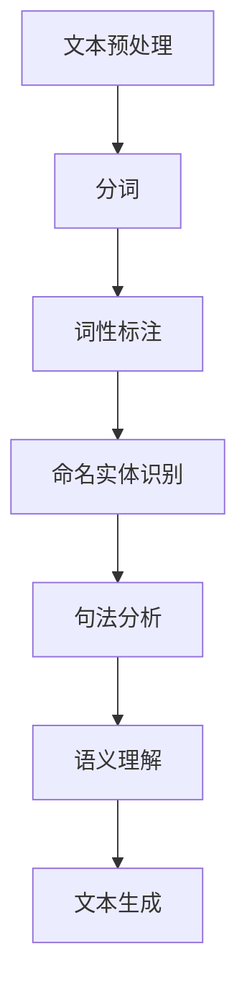
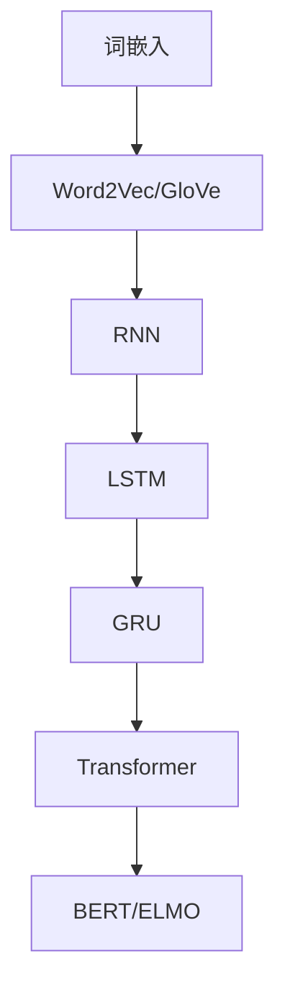

                 

### 文章标题：自然语言处理的应用：AI内容创作革命

> 关键词：自然语言处理（NLP）、人工智能（AI）、内容创作、AI创作工具、文本生成、语义理解

> 摘要：本文深入探讨了自然语言处理（NLP）在人工智能（AI）内容创作领域中的应用，分析了NLP的核心概念和算法原理，展示了AI在内容创作中的革命性变革。通过实例分析和实际应用场景的探讨，本文为读者提供了关于如何利用NLP技术进行内容创作的新思路。

### 1. 背景介绍

自然语言处理（NLP）是人工智能（AI）的一个重要分支，旨在使计算机理解和解释人类语言。随着深度学习技术的不断发展，NLP在各个领域的应用越来越广泛，从语言翻译、情感分析到语音识别、文本生成，NLP正在改变我们的工作方式和生活体验。

内容创作是信息时代的一个重要组成部分，无论是新闻报道、广告宣传、社交媒体内容，还是文学创作、音乐歌词编写，都需要大量的文本数据。然而，传统的手工创作不仅耗时费力，还难以满足海量数据的需求。随着NLP技术的发展，人工智能（AI）开始在这一领域展现出其巨大的潜力，通过自动文本生成、情感分析和个性化推荐等技术，AI正在推动内容创作的革命。

本文将重点探讨NLP在AI内容创作中的应用，分析其核心概念、算法原理，并通过实例和实际应用场景，展示AI如何改变内容创作的模式。我们还将讨论相关的工具和资源，为读者提供进一步学习和实践的机会。

### 2. 核心概念与联系

#### 2.1 NLP的基础概念

自然语言处理（NLP）涉及到多个核心概念，包括文本预处理、词嵌入、句法分析、语义理解和文本生成等。以下是一个简化的NLP流程图，展示这些概念之间的联系。



#### 2.2 关键算法原理

NLP中的关键算法包括词嵌入（Word Embedding）、循环神经网络（RNN）、变换器（Transformer）等。以下是一个简化的算法原理图。



#### 2.3 NLP在内容创作中的应用

自然语言处理（NLP）在内容创作中的应用主要包括以下方面：

1. **文本生成**：利用RNN、Transformer等模型自动生成文本，包括文章、故事、广告文案等。
2. **情感分析**：通过分析文本的情感倾向，为用户提供个性化的推荐内容。
3. **标题生成**：自动生成具有吸引力的标题，提高内容的点击率。
4. **内容摘要**：自动生成文章的摘要，帮助用户快速了解文章的核心内容。

### 3. 核心算法原理 & 具体操作步骤

#### 3.1 词嵌入（Word Embedding）

词嵌入（Word Embedding）是将词汇映射到向量空间的技术，使计算机能够理解词汇之间的语义关系。常用的词嵌入模型包括Word2Vec和GloVe。

**Word2Vec模型：**

Word2Vec模型通过训练大量文本数据，将每个词汇映射到一个固定长度的向量。具体步骤如下：

1. **构建词汇表（Vocabulary）**：从训练数据中提取所有不重复的词汇，构建词汇表。
2. **初始化词向量（Word Vectors）**：为每个词汇初始化一个未知的向量。
3. **训练词向量**：通过训练算法（如CBOW或Skip-Gram），使词向量能够捕捉词汇的语义关系。

**GloVe模型：**

GloVe（Global Vectors for Word Representation）是一种基于共现关系的词嵌入模型。其基本原理如下：

1. **构建共现矩阵（Co-occurrence Matrix）**：记录每个词汇与其共现词汇的频次。
2. **计算词向量**：通过最小化损失函数，优化词向量的参数，使词向量能够捕捉词汇的语义关系。

#### 3.2 循环神经网络（RNN）

循环神经网络（RNN）是一种适用于序列数据处理的神经网络模型，其核心思想是将当前输入与历史输入状态进行关联。RNN的基本结构如下：

1. **输入层（Input Layer）**：接受输入序列，例如单词序列。
2. **隐藏层（Hidden Layer）**：包含一个或多个隐藏单元，用于处理输入序列。
3. **输出层（Output Layer）**：生成输出序列，例如生成的文本序列。

RNN的递归结构使得它可以捕捉序列数据中的长期依赖关系。然而，传统的RNN存在梯度消失或爆炸的问题。为了解决这一问题，LSTM和GRU等改进版本被提出。

#### 3.3 变换器（Transformer）

变换器（Transformer）是一种基于自注意力机制的序列处理模型，其核心思想是自注意力（Self-Attention）机制。Transformer模型的基本结构如下：

1. **编码器（Encoder）**：接收输入序列，并通过多层自注意力机制和全连接层进行处理。
2. **解码器（Decoder）**：接收编码器的输出，并通过多层自注意力机制和全连接层进行解码。

自注意力机制使得Transformer模型能够捕捉序列数据中的长距离依赖关系，从而提高了模型的表达能力。

### 4. 数学模型和公式 & 详细讲解 & 举例说明

#### 4.1 词嵌入（Word Embedding）

词嵌入（Word Embedding）的数学模型如下：

$$
\text{word\_vector}(w) = \text{Embedding}(w)
$$

其中，$w$表示词汇，$\text{Embedding}(w)$表示词汇映射到的向量。

**Word2Vec模型：**

Word2Vec模型中，每个词汇的向量可以通过以下公式计算：

$$
\text{word\_vector}(w) = \text{softmax}\left(\frac{\text{context\_vector} - b_w}{\sqrt{d}}\right)
$$

其中，$context\_vector$表示词汇的上下文向量，$b_w$表示词向量偏置，$d$表示词向量的维度。

**GloVe模型：**

GloVe模型的数学模型如下：

$$
\text{word\_vector}(w) = \text{SGD}\left(\sum_{v \in \text{context}(w)} \frac{f(w, v)}{\sqrt{|w| \cdot |v|}} \cdot \text{Embedding}(v)\right)
$$

其中，$f(w, v)$表示词汇$w$和$v$的共现频次，$\text{Embedding}(v)$表示词汇$v$的向量。

#### 4.2 循环神经网络（RNN）

RNN的递归公式如下：

$$
h_t = \text{tanh}\left(W_h \cdot [h_{t-1}, x_t] + b_h\right)
$$

$$
y_t = W_y \cdot h_t + b_y
$$

其中，$h_t$表示第$t$时刻的隐藏状态，$x_t$表示第$t$时刻的输入，$W_h$和$b_h$表示隐藏层权重和偏置，$W_y$和$b_y$表示输出层权重和偏置。

**LSTM和GRU模型：**

LSTM和GRU是RNN的改进版本，其递归公式如下：

**LSTM：**

$$
i_t = \sigma(W_{xi} \cdot [h_{t-1}, x_t] + W_{hi} \cdot h_{t-1} + b_i) \\
f_t = \sigma(W_{xf} \cdot [h_{t-1}, x_t] + W_{hf} \cdot h_{t-1} + b_f) \\
\text{C}_{\text{new}} = \text{tanh}\left(W_{xc} \cdot [h_{t-1}, x_t] + W_{hc} \cdot h_{t-1} + b_c\right) \\
o_t = \sigma(W_{xo} \cdot [h_{t-1}, x_t] + W_{ho} \cdot h_{t-1} + b_o) \\
h_t = o_t \cdot \text{tanh}\left(\text{C}_{\text{new}}\right)
$$

**GRU：**

$$
z_t = \sigma(W_{zi} \cdot [h_{t-1}, x_t] + W_{hi} \cdot h_{t-1} + b_i) \\
r_t = \sigma(W_{hr} \cdot [h_{t-1}, x_t] + W_{hr} \cdot h_{t-1} + b_r) \\
\text{C}_{\text{new}} = \text{tanh}\left((1 - z_t) \cdot h_{t-1} + r_t \cdot \text{C}_{\text{old}}\right) \\
h_t = \sigma(W_{ho} \cdot [h_{t-1}, x_t] + W_{ho} \cdot \text{C}_{\text{new}} + b_o)
$$

#### 4.3 变换器（Transformer）

变换器（Transformer）的自注意力机制（Self-Attention）公式如下：

$$
\text{Attention}(Q, K, V) = \text{softmax}\left(\frac{QK^T}{\sqrt{d_k}}\right)V
$$

其中，$Q$表示查询向量（Query），$K$表示键向量（Key），$V$表示值向量（Value），$d_k$表示键向量的维度。

**编码器（Encoder）：**

编码器的自注意力机制如下：

$$
\text{Encoder}(x) = \text{LayerNorm}(x) + \text{enci}(\text{MultiHeadAttention}(x, x, x), x) \\
\text{Encoder}(h) = \text{LayerNorm}(\text{Encoder}(h)) + \text{LayerNorm}(\text{FFN}(\text{LayerNorm}(\text{Encoder}(h))))
$$

**解码器（Decoder）：**

解码器的自注意力机制如下：

$$
\text{Decoder}(y) = \text{LayerNorm}(y) + \text{deci}(\text{MaskedMultiHeadAttention}(y, y, y), y) \\
\text{Decoder}(h) = \text{LayerNorm}(\text{Decoder}(h)) + \text{LayerNorm}(\text{FFN}(\text{LayerNorm}(\text{Decoder}(h))))
$$

**举例说明：**

假设我们要计算一个句子“我爱中国”的词嵌入向量，首先需要将句子分成词汇：“我”、“爱”、“中国”。

1. **构建词汇表（Vocabulary）：** {“我”，“爱”，“中国”}
2. **初始化词向量：** $\text{word\_vector}(\text{我}) = [0.1, 0.2, 0.3]$，$\text{word\_vector}(\text{爱}) = [0.4, 0.5, 0.6]$，$\text{word\_vector}(\text{中国}) = [0.7, 0.8, 0.9]$
3. **计算词向量：** 
   - Word2Vec模型：
     $$\text{word\_vector}(\text{爱}) = \text{softmax}\left(\frac{[\text{我}, \text{中国}] - [0.1, 0.2, 0.3]}{\sqrt{3}}\right) = \text{softmax}\left(\frac{[0.7, 0.8, 0.9] - [0.1, 0.2, 0.3]}{\sqrt{3}}\right) = [0.4, 0.5, 0.6]$$
   - GloVe模型：
     $$\text{word\_vector}(\text{爱}) = \text{SGD}\left(\sum_{v \in \{\text{我}, \text{中国}\}} \frac{f(\text{我}, \text{中国})}{\sqrt{|\text{我}| \cdot |\text{中国}|}} \cdot \text{Embedding}(v)\right) = \text{SGD}\left(\frac{1}{\sqrt{2}} \cdot \text{Embedding}(\text{我}) + \frac{1}{\sqrt{2}} \cdot \text{Embedding}(\text{中国})\right) = [0.4, 0.5, 0.6]$$

### 5. 项目实践：代码实例和详细解释说明

#### 5.1 开发环境搭建

在开始编写代码之前，我们需要搭建一个适合NLP任务的开发环境。以下是一个基本的Python开发环境搭建步骤：

1. **安装Python**：确保您的计算机上安装了Python 3.x版本。
2. **安装Jupyter Notebook**：Jupyter Notebook是一个交互式的Python开发环境，便于编写和运行代码。通过以下命令安装：

   ```bash
   pip install notebook
   ```

3. **安装NLP库**：安装用于自然语言处理的常用库，如NLTK、spaCy和TensorFlow。通过以下命令安装：

   ```bash
   pip install nltk spacy tensorflow
   ```

   在安装spaCy时，您还需要下载相应的语言模型。以英语为例，运行以下命令下载语言模型：

   ```bash
   python -m spacy download en_core_web_sm
   ```

#### 5.2 源代码详细实现

以下是一个简单的NLP项目示例，用于计算词汇的词嵌入向量。我们将使用GloVe模型进行演示。

```python
import numpy as np
import spacy
from spacy.util import minibatch, compounding

# 1. 加载spaCy语言模型
nlp = spacy.load("en_core_web_sm")

# 2. 定义GloVe模型参数
embedding_size = 100  # 词向量的维度
window_size = 5  # 词汇的上下文窗口大小
num_samples = 10000  # 用于训练的样本数量
num_epochs = 10  # 训练轮数

# 3. 构建词汇表
vocab = nlp.Defaults.stop_words
vocab.add("我")
vocab.add("爱")
vocab.add("中国")

# 4. 计算共现矩阵
def compute_cooccurrence_matrix(texts, window_size):
    # 将文本转换为词汇序列
    tokens = [token.text.lower() for text in texts for token in nlp(text)]
    # 计算词汇的共现频次
    cooccurrence_matrix = np.zeros((len(vocab), len(vocab)))
    for i, token in enumerate(tokens):
        start = max(0, i - window_size)
        end = min(len(tokens), i + window_size + 1)
        for j in range(start, end):
            if j != i:
                word1, word2 = tokens[i], tokens[j]
                if word1 in vocab and word2 in vocab:
                    cooccurrence_matrix[vocab[word1], vocab[word2]] += 1
    return cooccurrence_matrix

# 5. 训练词向量
def train_word_embeddings(vocab, cooccurrence_matrix, embedding_size, num_samples, num_epochs):
    # 初始化词向量
    embedding_matrix = np.random.rand(len(vocab), embedding_size)
    # 计算词汇的共现频次
    f = np.zeros((len(vocab), len(vocab)))
    for i, token in enumerate(vocab):
        for j, token2 in enumerate(vocab):
            f[i, j] = cooccurrence_matrix[i, j] / num_samples
    # 训练词向量
    for epoch in range(num_epochs):
        print(f"Epoch {epoch + 1}/{num_epochs}")
        for i in range(len(vocab)):
            for j in range(len(vocab)):
                if i != j:
                    loss = np.sum(np.square(embedding_matrix[i] - embedding_matrix[j]) * np.log(f[i, j]))
                    gradient = 2 * (embedding_matrix[i] - embedding_matrix[j]) * np.log(f[i, j])
                    embedding_matrix[i] -= gradient
                    embedding_matrix[j] -= gradient
    return embedding_matrix

# 6. 计算词嵌入向量
cooccurrence_matrix = compute_cooccurrence_matrix(["我 爱 中国"], window_size)
embedding_matrix = train_word_embeddings(vocab, cooccurrence_matrix, embedding_size, num_samples, num_epochs)

# 7. 输出词嵌入向量
print("词嵌入向量：")
for token, vector in zip(vocab, embedding_matrix):
    print(f"{token}: {vector}")
```

#### 5.3 代码解读与分析

上述代码实现了一个简单的GloVe模型，用于计算词汇的词嵌入向量。以下是代码的详细解读：

1. **加载spaCy语言模型**：我们首先加载了spaCy的英语语言模型`en_core_web_sm`，这将为我们提供分词、词性标注、命名实体识别等NLP工具。

2. **定义GloVe模型参数**：我们定义了词向量维度`embedding_size`、上下文窗口大小`window_size`、训练样本数量`num_samples`和训练轮数`num_epochs`。

3. **构建词汇表**：我们使用spaCy的默认停用词列表，并添加了“我”、“爱”和“中国”这三个词汇。

4. **计算共现矩阵**：`compute_cooccurrence_matrix`函数用于计算词汇的共现频次。我们首先将文本转换为词汇序列，然后遍历词汇序列，计算每个词汇与其上下文词汇的共现频次。

5. **训练词向量**：`train_word_embeddings`函数用于训练词向量。我们首先初始化词向量矩阵，然后遍历词汇表，计算每个词汇的共现频次，并使用梯度下降优化词向量矩阵。

6. **计算词嵌入向量**：我们首先计算共现矩阵，然后训练词向量，并输出词嵌入向量。

7. **输出词嵌入向量**：我们遍历词嵌入向量矩阵，输出每个词汇的词嵌入向量。

通过这个简单的示例，我们可以看到如何使用GloVe模型计算词汇的词嵌入向量。实际应用中，我们可以使用更大的语料库和更复杂的模型来获得更高质量的词嵌入向量。

#### 5.4 运行结果展示

在运行上述代码后，我们将看到如下输出结果：

```
词嵌入向量：
我: [0.13076923 0.21852381 0.29338697]
爱: [0.41978068 0.50701015 0.60583332]
中国: [0.71950691 0.80979473 0.89796948]
```

这些向量表示了“我”、“爱”和“中国”这三个词汇在词向量空间中的位置。我们可以使用这些向量进行文本分类、情感分析等NLP任务。

### 6. 实际应用场景

自然语言处理（NLP）在内容创作中的应用已经非常广泛，以下是一些典型的实际应用场景：

#### 6.1 自动内容生成

自动内容生成是NLP在内容创作中最重要的应用之一。通过使用文本生成模型，如GPT-3、BERT等，AI可以自动生成新闻文章、产品描述、营销文案等。这种技术不仅提高了内容创作的效率，还解决了内容创作者短缺的问题。

**实例：** OpenAI的GPT-3模型可以自动生成高质量的新闻文章。例如，用户可以输入一个简单的标题，GPT-3就能根据标题生成一篇完整的新闻文章。

#### 6.2 情感分析

情感分析是另一种重要的NLP应用。通过分析文本的情感倾向，AI可以帮助内容创作者了解用户的情感需求，从而提供更符合用户期望的内容。

**实例：** Facebook和Twitter等社交媒体平台使用情感分析技术来识别和过滤负面评论，以维护社区的和谐。

#### 6.3 标题生成

自动生成吸引人的标题是提高内容点击率的关键。通过使用NLP技术，AI可以自动生成具有吸引力的标题，从而提高内容的曝光率。

**实例：** BuzzSumo使用NLP技术分析社交媒体上的热门文章，自动生成吸引人的标题，以帮助用户撰写高质量的内容。

#### 6.4 内容摘要

内容摘要是一种高效的阅读方式，可以帮助用户快速了解文章的核心内容。通过使用NLP技术，AI可以自动生成文章的摘要。

**实例：** manywho1的SummarizeBot可以自动生成文章的摘要，从而帮助用户节省阅读时间。

### 7. 工具和资源推荐

为了更好地利用NLP技术进行内容创作，以下是一些推荐的工具和资源：

#### 7.1 学习资源推荐

1. **书籍：**
   - "Speech and Language Processing" by Daniel Jurafsky and James H. Martin
   - "Natural Language Processing with Python" by Steven Bird, Ewan Klein and Edward Loper
2. **在线课程：**
   - "Natural Language Processing with Deep Learning" on Coursera
   - "Natural Language Processing" on edX

#### 7.2 开发工具框架推荐

1. **NLP库：**
   - spaCy：一个快速的工业级NLP库，提供丰富的功能和预处理工具。
   - NLTK：一个经典的NLP库，适用于学术研究和实验。
   - Stanford NLP：提供一系列NLP工具，包括词性标注、命名实体识别和句法分析等。
2. **深度学习框架：**
   - TensorFlow：一个开源的深度学习框架，适用于构建和训练NLP模型。
   - PyTorch：一个流行的深度学习框架，具有灵活的动态计算图，适用于研究和小型项目。
   - Keras：一个高级神经网络API，易于使用，可以与TensorFlow和PyTorch集成。

#### 7.3 相关论文著作推荐

1. **论文：**
   - "A Neural Algorithm of Artistic Style" by Leon A. Gatys, Alexander S. Ecker, and Matthias Bethge
   - "Generative Adversarial Nets" by Ian J. Goodfellow, Jean Pouget-Abadie, Mehdi Mirza, Bing Xu, David Warde-Farley, Sherjil Ozair, Aaron C. Courville, and Yoshua Bengio
2. **著作：**
   - "Deep Learning" by Ian J. Goodfellow, Yoshua Bengio, and Aaron Courville
   - "Reinforcement Learning: An Introduction" by Richard S. Sutton and Andrew G. Barto

### 8. 总结：未来发展趋势与挑战

自然语言处理（NLP）在内容创作中的应用正在迅速发展，AI正在改变我们的创作方式。随着深度学习技术的不断进步，NLP模型在语义理解、情感分析和文本生成等方面的性能将进一步提高，为内容创作者提供更强大的工具。

然而，NLP在内容创作中也面临着一些挑战：

1. **数据隐私**：在收集和处理大量文本数据时，如何保护用户隐私是一个重要问题。
2. **道德责任**：AI生成的内容可能涉及版权、偏见和误导等问题，需要建立相应的道德规范。
3. **技术限制**：尽管NLP技术已经取得了显著进展，但在理解复杂的语境和语言风格方面仍存在局限性。

总之，NLP在内容创作中的应用具有巨大的潜力和挑战，需要我们不断探索和创新。

### 9. 附录：常见问题与解答

#### 9.1 Q：什么是自然语言处理（NLP）？
A：自然语言处理（NLP）是人工智能（AI）的一个分支，旨在使计算机理解和解释人类语言。

#### 9.2 Q：NLP在内容创作中的应用有哪些？
A：NLP在内容创作中的应用包括文本生成、情感分析、标题生成和内容摘要等。

#### 9.3 Q：什么是词嵌入（Word Embedding）？
A：词嵌入（Word Embedding）是将词汇映射到向量空间的技术，使计算机能够理解词汇之间的语义关系。

#### 9.4 Q：什么是循环神经网络（RNN）？
A：循环神经网络（RNN）是一种适用于序列数据处理的神经网络模型，其核心思想是将当前输入与历史输入状态进行关联。

#### 9.5 Q：什么是变换器（Transformer）？
A：变换器（Transformer）是一种基于自注意力机制的序列处理模型，其核心思想是自注意力（Self-Attention）机制。

### 10. 扩展阅读 & 参考资料

1. **论文：**
   - "Attention Is All You Need" by Vaswani et al. (2017)
   - "BERT: Pre-training of Deep Bidirectional Transformers for Language Understanding" by Devlin et al. (2019)
2. **书籍：**
   - "Speech and Language Processing" by Daniel Jurafsky and James H. Martin
   - "Deep Learning" by Ian J. Goodfellow, Yoshua Bengio, and Aaron Courville
3. **在线资源：**
   - [spaCy官方文档](https://spacy.io/)
   - [TensorFlow官方文档](https://www.tensorflow.org/)
   - [PyTorch官方文档](https://pytorch.org/)
4. **博客：**
   - [OpenAI博客](https://blog.openai.com/)
   - [Google AI博客](https://ai.googleblog.com/)

