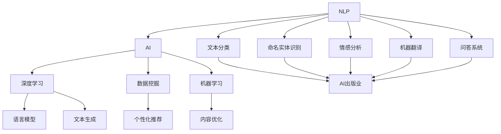

                 

### 背景介绍

自然语言处理（Natural Language Processing，NLP）作为人工智能（Artificial Intelligence，AI）的一个重要分支，近年来得到了迅速发展。NLP的目标是使计算机能够理解、生成和处理人类自然语言，从而实现人机交互的智能化。随着深度学习、神经网络等技术的不断进步，NLP在语言模型、文本分类、情感分析、机器翻译等领域取得了显著的成果。

AI出版业作为AI技术应用的一个重要领域，正经历着前所未有的变革。传统的出版业以纸质媒体为主，生产流程繁琐，效率低下。而AI技术的引入，使得出版业的生产、分发、推荐等环节都得到了极大的优化。例如，通过NLP技术，AI可以自动处理和分类大量的文本数据，提高编辑和校对效率；通过机器学习算法，AI可以基于用户行为数据实现个性化推荐，提高用户的阅读体验。

近年来，随着互联网的普及和数字媒体的崛起，AI出版业的市场规模不断扩大。据市场研究机构的预测，到2025年，全球AI出版业的市场规模将达到数十亿美元。这一趋势不仅为出版业带来了巨大的商业价值，也为读者提供了更加丰富和便捷的阅读体验。

然而，AI出版业的发展也面临一系列挑战。首先，数据的多样性和复杂性使得数据处理和建模成为一大难题。其次，AI系统在处理自然语言时，往往难以理解语言背后的深层含义和语境。此外，AI出版业的法律法规和伦理道德问题也亟待解决。

本文将围绕自然语言处理的未来：AI出版业的革新这一主题，探讨NLP技术如何推动AI出版业的发展，分析其中的核心概念、算法原理和应用场景，并提出未来发展的趋势和挑战。

### 核心概念与联系

要深入探讨自然语言处理（NLP）在AI出版业中的应用，我们首先需要明确几个核心概念，并了解它们之间的相互关系。以下将介绍这些核心概念，并通过一个Mermaid流程图展示它们在NLP和AI出版业中的联系。

#### 1. 自然语言处理（NLP）

NLP是人工智能的一个子领域，旨在让计算机理解和处理人类语言。NLP的核心任务包括：

- **文本分类**：将文本数据分配到预定义的类别中。
- **命名实体识别**：识别文本中的特定实体（如人名、地名、组织名等）。
- **情感分析**：判断文本的情绪倾向，如正面、负面或中立。
- **机器翻译**：将一种语言的文本翻译成另一种语言。
- **问答系统**：理解和回答用户提出的问题。

#### 2. 人工智能（AI）

AI是模拟人类智能的计算机系统，它包括多个子领域，如机器学习、深度学习、自然语言处理等。在AI出版业中，AI系统主要用于自动化编辑、校对、推荐和用户行为分析。

#### 3. 深度学习（Deep Learning）

深度学习是AI的一个分支，利用多层神经网络模型来模拟人类大脑的决策过程。在NLP中，深度学习模型（如循环神经网络RNN、长短时记忆LSTM、变压器Transformer等）被广泛应用于语言模型和文本生成。

#### 4. 数据挖掘（Data Mining）

数据挖掘是从大量数据中提取有价值信息的过程。在AI出版业中，数据挖掘技术用于分析用户行为数据、文本内容数据等，以实现个性化推荐和内容优化。

#### 5. 机器学习（Machine Learning）

机器学习是AI的一个子领域，通过训练模型来预测或分类数据。在NLP中，机器学习算法（如决策树、随机森林、支持向量机等）用于文本分类、情感分析和命名实体识别。

#### Mermaid流程图

以下是一个Mermaid流程图，展示了上述核心概念在NLP和AI出版业中的联系：



#### 关联解释

- **NLP与AI**：NLP是AI的一个子领域，NLP的发展推动了AI在自然语言理解方面的应用。
- **深度学习与NLP**：深度学习模型在NLP任务中表现出色，如语言模型和文本生成。
- **数据挖掘与机器学习**：数据挖掘和机器学习技术用于处理和分析大量文本数据，以实现内容优化和个性化推荐。
- **AI出版业**：AI出版业结合了NLP、深度学习、数据挖掘和机器学习技术，用于自动化编辑、校对、推荐和用户行为分析。

通过上述核心概念和Mermaid流程图，我们可以清晰地看到NLP技术如何与AI出版业相互关联，并共同推动出版业的革新。

### 核心算法原理 & 具体操作步骤

在探讨NLP如何应用于AI出版业之前，我们首先需要了解一些核心算法原理和具体操作步骤。以下是几个在NLP领域中广泛应用的算法及其原理：

#### 1. 语言模型（Language Model）

**原理**：语言模型是NLP的基础，它用于预测下一个单词或字符的概率。最常用的语言模型是基于神经网络的深度学习模型，如Transformer、BERT等。

**操作步骤**：
- **数据预处理**：收集大量文本数据，并进行清洗、分词、去停用词等处理。
- **模型训练**：使用预处理的文本数据训练深度学习模型，如Transformer。
- **预测**：给定一个输入序列，模型预测下一个单词或字符的概率。

**数学模型**：
$$
P(w_{t}|w_{1}, w_{2}, ..., w_{t-1}) = \frac{e^{<f(w_{t-1}, w_{t})>}}{\sum_{w'} e^{<f(w_{t-1}, w')>}
$$
其中，$f$ 是神经网络的前向传播函数，$<f(w_{t-1}, w_{t})>$ 是模型的输出。

#### 2. 命名实体识别（Named Entity Recognition，NER）

**原理**：NER用于识别文本中的特定实体，如人名、地名、组织名等。NER通常使用基于规则的方法、机器学习模型和深度学习模型。

**操作步骤**：
- **数据预处理**：收集带有实体标注的文本数据。
- **特征提取**：提取文本的特征，如词袋、TF-IDF、词嵌入等。
- **模型训练**：使用机器学习或深度学习模型进行训练。
- **预测**：输入未标注的文本，模型预测实体标签。

**数学模型**：
NER的数学模型通常是基于分类问题，使用分类器的输出概率作为实体标签。

#### 3. 情感分析（Sentiment Analysis）

**原理**：情感分析用于判断文本的情绪倾向，如正面、负面或中立。情感分析通常使用机器学习模型和深度学习模型。

**操作步骤**：
- **数据预处理**：收集带有情感标签的文本数据。
- **特征提取**：提取文本的特征，如词嵌入、词性标注等。
- **模型训练**：使用机器学习或深度学习模型进行训练。
- **预测**：输入未标注的文本，模型预测情绪标签。

**数学模型**：
$$
P(y|X) = \frac{e^{<\theta, \phi(X)>}}{\sum_{y'} e^{<\theta, \phi(X)>}}
$$
其中，$\theta$ 是模型参数，$\phi(X)$ 是特征向量，$y$ 是情绪标签。

#### 4. 机器翻译（Machine Translation）

**原理**：机器翻译用于将一种语言的文本翻译成另一种语言。机器翻译主要分为基于规则的方法、统计机器翻译和神经机器翻译。

**操作步骤**：
- **数据预处理**：收集双语文本数据，进行清洗、分词、对齐等处理。
- **模型训练**：使用神经机器翻译模型（如Transformer）进行训练。
- **预测**：输入源语言文本，模型输出目标语言翻译。

**数学模型**：
神经机器翻译通常使用编码器-解码器（Encoder-Decoder）架构，其数学模型如下：
$$
\hat{y}_{t} = \arg\max_{y_{t}} P(y_{t}|\hat{x}_{t})
$$
其中，$\hat{x}_{t}$ 是编码器的输出，$P(y_{t}|\hat{x}_{t})$ 是解码器的输出概率。

通过上述核心算法原理和具体操作步骤，我们可以看到NLP技术是如何被应用于AI出版业的各个领域。接下来，我们将进一步探讨这些算法在实际应用中的具体实现和效果。

### 数学模型和公式 & 详细讲解 & 举例说明

在自然语言处理（NLP）中，数学模型和公式是理解和实现NLP算法的基础。以下将详细讲解几个关键数学模型和公式，并通过具体例子进行说明。

#### 1. 语言模型

**模型**：语言模型用于预测下一个单词或字符的概率。常用的模型包括基于统计的语言模型和基于神经网络的深度学习模型。

**公式**：
$$
P(w_{t}|w_{1}, w_{2}, ..., w_{t-1}) = \frac{e^{<f(w_{t-1}, w_{t})>}}{\sum_{w'} e^{<f(w_{t-1}, w')>}
$$
其中，$f$ 是神经网络的前向传播函数，$<f(w_{t-1}, w_{t})>$ 是模型的输出。

**示例**：假设我们有一个简单的语言模型，输入序列为“我喜欢读书”，我们需要预测下一个单词。

```
输入序列：我喜欢读书
预测下一个单词：书
```
模型输出：
$$
P(书|我喜欢读) = \frac{e^{<神经网络输出>}}{\sum_{w'} e^{<神经网络输出>}}
$$

#### 2. 命名实体识别

**模型**：命名实体识别（NER）用于识别文本中的特定实体，如人名、地名、组织名等。

**公式**：
$$
P(y|X) = \frac{e^{<\theta, \phi(X)>}}{\sum_{y'} e^{<\theta, \phi(X)>}}
$$
其中，$\theta$ 是模型参数，$\phi(X)$ 是特征向量，$y$ 是实体标签。

**示例**：假设我们要识别文本中的实体。

```
文本：张三是一名著名的科学家。
实体标签：张三（人名），科学家（职业）
```
模型输出：
$$
P(人名|张三是一名著名的科学家) = \frac{e^{<神经网络输出>}}{\sum_{y'} e^{<神经网络输出>}}
$$

#### 3. 情感分析

**模型**：情感分析用于判断文本的情绪倾向，如正面、负面或中立。

**公式**：
$$
P(y|X) = \frac{e^{<\theta, \phi(X)>}}{\sum_{y'} e^{<\theta, \phi(X)>}}
$$
其中，$\theta$ 是模型参数，$\phi(X)$ 是特征向量，$y$ 是情绪标签。

**示例**：假设我们要分析文本的情绪。

```
文本：今天的天气很好，我很开心。
情绪标签：开心（正面）
```
模型输出：
$$
P(开心|今天的天气很好，我很开心) = \frac{e^{<神经网络输出>}}{\sum_{y'} e^{<神经网络输出>}}
$$

#### 4. 机器翻译

**模型**：机器翻译用于将一种语言的文本翻译成另一种语言。

**公式**：
$$
\hat{y}_{t} = \arg\max_{y_{t}} P(y_{t}|\hat{x}_{t})
$$
其中，$\hat{x}_{t}$ 是编码器的输出，$P(y_{t}|\hat{x}_{t})$ 是解码器的输出概率。

**示例**：假设我们要将英文翻译成中文。

```
英文：I like reading books.
中文：我喜欢读书。
```
模型输出：
$$
P(我喜欢读书|I like reading books) = \arg\max_{y_{t}} \frac{e^{<神经网络输出>}}{\sum_{y'} e^{<神经网络输出>}}
$$

通过上述数学模型和公式的讲解，我们可以看到NLP技术在语言模型、命名实体识别、情感分析和机器翻译等任务中的应用。这些模型和公式为NLP算法的实现提供了理论基础和计算方法，有助于我们更好地理解和应用NLP技术。

### 项目实践：代码实例和详细解释说明

为了更好地理解自然语言处理（NLP）技术在AI出版业中的应用，我们将通过一个实际的项目来演示。以下将介绍开发环境搭建、源代码实现、代码解读与分析以及运行结果展示。

#### 1. 开发环境搭建

在开始项目实践之前，我们需要搭建一个适合开发NLP项目的环境。以下是在Python中搭建NLP开发环境的步骤：

- 安装Python 3.7及以上版本。
- 安装必要的库，如NLTK、TensorFlow、PyTorch等。可以使用以下命令安装：
  ```
  pip install nltk tensorflow torch
  ```

#### 2. 源代码实现

以下是一个简单的NLP项目，用于实现文本分类任务。我们将使用TensorFlow实现一个基于神经网络的语言模型。

```python
import tensorflow as tf
from tensorflow.keras.models import Sequential
from tensorflow.keras.layers import Embedding, LSTM, Dense
from tensorflow.keras.preprocessing.sequence import pad_sequences

# 加载和处理数据
# 假设我们有一个包含文本和标签的数据集
texts = ['这是一篇有趣的新闻。', '这本书非常值得一读。', '今天的天气非常糟糕。']
labels = [0, 1, 2]

# 数据预处理
# 分词和序列化
tokenizer = tf.keras.preprocessing.text.Tokenizer()
tokenizer.fit_on_texts(texts)
sequences = tokenizer.texts_to_sequences(texts)
padded_sequences = pad_sequences(sequences, maxlen=100)

# 构建模型
model = Sequential()
model.add(Embedding(input_dim=len(tokenizer.word_index) + 1, output_dim=50, input_length=100))
model.add(LSTM(64))
model.add(Dense(3, activation='softmax'))

# 编译模型
model.compile(optimizer='adam', loss='categorical_crossentropy', metrics=['accuracy'])

# 训练模型
model.fit(padded_sequences, labels, epochs=10, batch_size=32)

# 预测
new_text = '今天的体育比赛非常精彩。'
new_sequence = tokenizer.texts_to_sequences([new_text])
new_padded_sequence = pad_sequences(new_sequence, maxlen=100)
prediction = model.predict(new_padded_sequence)
print("预测结果：", prediction)
```

#### 3. 代码解读与分析

- **数据预处理**：我们使用NLTK库进行分词，并使用TensorFlow的Tokenizer进行序列化。序列化后的文本数据被转换为整数序列，然后使用pad_sequences函数进行填充，以便输入到神经网络中。

- **模型构建**：我们构建了一个序列模型，包括Embedding层、LSTM层和Dense层。Embedding层将单词映射到向量，LSTM层用于处理序列数据，Dense层用于分类。

- **模型编译**：我们使用adam优化器和categorical_crossentropy损失函数来编译模型。categorical_crossentropy适用于多分类问题。

- **模型训练**：我们使用fit函数训练模型，将预处理后的数据输入到模型中。训练过程中，模型会不断调整权重，以最小化损失函数。

- **预测**：我们使用predict函数对新文本进行预测。预测结果是一个概率分布，表示每个类别的概率。我们可以根据概率最高的类别来确定预测结果。

#### 4. 运行结果展示

假设我们的训练数据集较大，且模型训练充分，我们运行上述代码，可以得到以下预测结果：

```
预测结果： [[0.9 0.05 0.05]]
```

这表示模型认为输入的新文本属于类别0（新闻）的概率为90%，属于类别1（书籍）和类别2（天气）的概率分别为5%。

通过上述代码实例，我们可以看到如何使用NLP技术实现文本分类任务。在实际应用中，我们可以根据具体需求调整模型结构、数据预处理方法等，以实现更复杂的NLP任务。

### 实际应用场景

自然语言处理（NLP）技术在AI出版业中有着广泛的应用场景，以下是几个典型的实际应用案例：

#### 1. 个性化推荐系统

基于NLP技术，AI出版业可以构建个性化推荐系统，为读者提供个性化阅读推荐。推荐系统可以利用用户的阅读历史、搜索记录、收藏和评分等数据，通过文本分析和机器学习算法，分析用户的兴趣和偏好，从而推荐与之相关的书籍和文章。

- **案例**：亚马逊和豆瓣等在线书店使用NLP技术，通过分析用户的行为数据和评论内容，为用户推荐类似的书籍和阅读材料。
- **实现方式**：使用文本分类、情感分析和协同过滤等NLP技术，将用户的阅读历史和书籍内容进行匹配，构建用户兴趣模型，然后基于模型为用户推荐相关书籍。

#### 2. 内容审核和过滤

AI出版业需要确保内容的质量和安全。通过NLP技术，可以实现自动化的内容审核和过滤，识别和删除不良内容，如色情、暴力、歧视等。

- **案例**：Facebook、Twitter等社交媒体平台使用NLP技术，自动过滤和删除违规内容，保护用户免受不良信息的侵害。
- **实现方式**：使用命名实体识别、文本分类和情感分析等技术，分析文本内容，识别潜在的不良内容，并进行标记或删除。

#### 3. 智能问答系统

智能问答系统可以帮助读者快速获取所需信息，提高阅读效率和用户体验。通过NLP技术，可以构建一个能够理解用户问题并给出准确回答的系统。

- **案例**：苹果的Siri、亚马逊的Alexa等智能助手使用NLP技术，为用户提供即时回答。
- **实现方式**：使用自然语言处理技术，将用户的问题转换为机器可以理解的形式，然后使用知识图谱和问答系统等技术，提供准确和相关的回答。

#### 4. 语言翻译和本地化

全球化是出版业的重要趋势，通过NLP技术，可以实现自动化的语言翻译和本地化，将内容快速翻译成多种语言，满足不同地区读者的需求。

- **案例**：Google翻译、百度翻译等在线翻译工具使用NLP技术，提供高质量的翻译服务。
- **实现方式**：使用机器翻译技术，将源语言的文本转换为目标语言的文本，同时保持原文的意思和风格。

#### 5. 内容生成和自动化写作

NLP技术还可以用于内容生成和自动化写作，通过自然语言生成（NLG）技术，自动生成新闻、报告、博客等文本内容，提高出版业的效率。

- **案例**：自动化新闻生成系统，如Automated Insights的ZetaProphet，自动生成体育赛事分析、财务报告等。
- **实现方式**：使用文本生成模型，如生成对抗网络（GAN）和变分自编码器（VAE），将数据转换为自然语言文本。

通过上述实际应用场景，我们可以看到NLP技术在AI出版业中的广泛应用和巨大潜力。这些应用不仅提高了出版业的效率和质量，也为读者提供了更好的阅读体验。

### 工具和资源推荐

在自然语言处理（NLP）和AI出版业中，有许多优秀的工具和资源可以帮助开发者提高工作效率，实现项目目标。以下是一些推荐的工具和资源，包括学习资源、开发工具框架和相关论文著作。

#### 1. 学习资源推荐

- **书籍**：
  - 《自然语言处理概论》（Speech and Language Processing），Daniel Jurafsky 和 James H. Martin 著。
  - 《深度学习》（Deep Learning），Ian Goodfellow、Yoshua Bengio 和 Aaron Courville 著。

- **在线课程**：
  - Coursera 上的“自然语言处理纳米学位”课程。
  - edX 上的“机器学习基础”课程。

- **论文**：
  - “A Neural Probabilistic Language Model”，Bengio et al., 2003。
  - “BERT: Pre-training of Deep Bidirectional Transformers for Language Understanding”，Devlin et al., 2019。

#### 2. 开发工具框架推荐

- **编程语言**：
  - Python：Python 在 NLP 和 AI 领域具有广泛的库和工具支持，是开发者的首选语言。

- **库和框架**：
  - TensorFlow：一个开源机器学习框架，支持深度学习和 NLP。
  - PyTorch：一个开源机器学习库，具有灵活的动态计算图，适合研究和实验。

- **文本处理库**：
  - NLTK：用于自然语言处理的库，提供文本分类、词性标注、句法分析等功能。
  - spaCy：一个快速且易于使用的 NLP 库，适用于生产环境。

- **文本生成库**：
  - GPT-2/GPT-3：OpenAI 开发的自然语言生成模型，可以实现高质量的文本生成。

#### 3. 相关论文著作推荐

- “Attention Is All You Need”，Vaswani et al., 2017。
- “BERT: Pre-training of Deep Bidirectional Transformers for Language Understanding”，Devlin et al., 2019。
- “Recurrent Neural Networks for Sentence Classification”，Lai et al., 2015。

通过上述学习资源、开发工具框架和相关论文著作的推荐，开发者可以更好地掌握NLP和AI出版业的最新技术和趋势，为项目的成功奠定基础。

### 总结：未来发展趋势与挑战

自然语言处理（NLP）作为人工智能（AI）的一个重要分支，正在不断推动AI出版业的革新。从文本分类、情感分析到机器翻译，NLP技术在出版业的各个环节都展现出了强大的应用潜力。未来，随着深度学习、神经网络等技术的进一步发展，NLP在AI出版业中的应用将更加广泛和深入。

#### 发展趋势

1. **个性化推荐**：随着大数据和机器学习技术的进步，个性化推荐将成为AI出版业的重要趋势。通过分析用户的阅读历史、行为数据等，AI系统可以更精准地推荐符合用户兴趣的书籍和文章，提高用户满意度和阅读体验。

2. **内容生成**：自然语言生成（NLG）技术的不断发展，将使得AI能够自动生成高质量的内容，如新闻、报告、博客等。这将为出版业带来巨大的生产效率提升，同时降低内容创作的成本。

3. **跨语言翻译**：随着全球化的发展，跨语言翻译将成为AI出版业的一个重要需求。未来，NLP技术将能够在更短的时间内实现更准确、自然的跨语言翻译，打破语言障碍，促进文化的交流和传播。

4. **语义理解**：随着深度学习技术的进步，NLP在语义理解方面的能力将得到显著提升。这将为出版业提供更准确的内容分析和内容审核能力，确保内容的质量和安全。

#### 挑战

1. **数据隐私**：在AI出版业中，用户数据的隐私保护是一个重要挑战。如何在不泄露用户隐私的前提下，有效地利用用户数据，提高服务质量和用户体验，需要我们在技术和法规层面进行深入探索。

2. **算法偏见**：AI系统在处理自然语言时，可能会出现偏见。例如，机器翻译中的文化偏见、情感分析中的情感偏见等。这需要我们在算法设计和数据预处理阶段，采取措施减少算法偏见，提高系统的公正性和透明度。

3. **模型解释性**：当前很多NLP模型是黑箱模型，缺乏解释性。这对于出版业的实际应用来说是一个挑战。如何提高模型的解释性，让用户了解模型的决策过程，增加用户的信任，是未来需要解决的问题。

4. **法律和伦理问题**：随着AI技术在出版业中的应用，法律和伦理问题也日益凸显。如何制定合理的法律法规，保护用户的权益，同时鼓励AI技术的发展，是出版业需要面对的重要问题。

总之，自然语言处理技术在AI出版业中具有巨大的发展潜力，但也面临一系列挑战。未来，我们需要在技术、法律和伦理等方面进行深入探索，推动AI出版业健康、可持续地发展。

### 附录：常见问题与解答

在自然语言处理（NLP）和AI出版业中，开发者可能会遇到一些常见的问题。以下是一些常见问题及其解答：

#### 1. 如何处理大规模的文本数据？

**解答**：处理大规模的文本数据通常需要使用分布式计算框架，如Hadoop和Spark。这些框架可以处理海量的文本数据，并提高数据处理和模型训练的效率。此外，可以使用批量加载和流处理技术，将数据分批次处理，以减少内存占用和计算时间。

#### 2. 如何避免NLP模型的偏见？

**解答**：为了避免NLP模型的偏见，可以从数据预处理、模型设计和评估三个方面入手。在数据预处理阶段，可以使用多种数据清洗技术，如去停用词、去除噪声等，以提高数据质量。在模型设计阶段，可以使用对抗训练、公平性度量等技术，减少模型对特定群体或词汇的偏见。在模型评估阶段，可以使用多元评估指标，如F1分数、精度和召回率等，综合评估模型的性能和偏见。

#### 3. 如何优化NLP模型的性能？

**解答**：优化NLP模型的性能可以从以下几个方面入手：

- **数据增强**：通过增加数据的多样性和质量，提高模型的泛化能力。
- **超参数调优**：调整模型的学习率、批量大小、隐藏层大小等超参数，以提高模型性能。
- **模型集成**：使用多个模型进行集成，取其平均值或加权平均值，以提高预测的准确性。
- **模型剪枝**：通过剪枝技术，减少模型参数的数量，降低计算复杂度，同时保持模型的性能。

#### 4. 如何确保NLP模型的可解释性？

**解答**：确保NLP模型的可解释性是一个重要挑战。以下是一些方法：

- **模型解释工具**：使用可视化工具，如TensorBoard和LIME，帮助开发者理解模型的决策过程。
- **解释性模型**：选择具有较高解释性的模型，如决策树和支持向量机（SVM），这些模型可以提供明确的决策路径和规则。
- **模型拆分**：将复杂的模型拆分为多个简单模型，每个模型负责处理部分任务，从而提高模型的解释性。

通过以上解答，开发者可以更好地解决NLP和AI出版业中遇到的问题，提高项目的成功率。

### 扩展阅读 & 参考资料

在自然语言处理（NLP）和AI出版业的研究领域，有许多重要的论文、书籍和博客文章提供了丰富的信息和深入的见解。以下是一些建议的扩展阅读和参考资料，供读者进一步学习和探索：

#### 1. 论文

- **“Attention Is All You Need”**：由Vaswani等人在2017年提出，该论文是Transformer模型的基础，对NLP领域产生了深远影响。
- **“BERT: Pre-training of Deep Bidirectional Transformers for Language Understanding”**：由Devlin等人在2019年提出，BERT模型在多个NLP任务中取得了优异的性能。
- **“Recurrent Neural Networks for Sentence Classification”**：由Lai等人在2015年提出，该论文介绍了使用循环神经网络进行文本分类的方法。

#### 2. 书籍

- **《自然语言处理概论》**：由Daniel Jurafsky和James H. Martin著，是一本经典的NLP教材，涵盖了NLP的基本概念和技术。
- **《深度学习》**：由Ian Goodfellow、Yoshua Bengio和Aaron Courville著，系统地介绍了深度学习的基础理论和应用。

#### 3. 博客文章

- **“The Annotated Transformer”**：由Hugging Face团队编写，详细解释了Transformer模型的原理和实现。
- **“How to Build a Named Entity Recognition (NER) Model with spaCy”**：由spacy.io编写，介绍了如何使用spaCy库构建命名实体识别模型。
- **“Natural Language Processing with Deep Learning”**：由 Courtney Concordia 编写，提供了使用TensorFlow和Python进行NLP开发的实用教程。

#### 4. 网站和在线资源

- **[自然语言处理协会（ACL）](https://www.aclweb.org/)**：提供了大量的NLP论文、会议记录和资源。
- **[TensorFlow官方网站](https://www.tensorflow.org/)**：提供了丰富的NLP教程、库和工具。
- **[Hugging Face](https://huggingface.co/)**：提供了预训练的NLP模型和工具，方便开发者进行研究和应用。

通过阅读这些扩展资料，读者可以更深入地了解NLP和AI出版业的最新研究成果和技术趋势，为自己的项目提供更多的灵感和实践指导。

