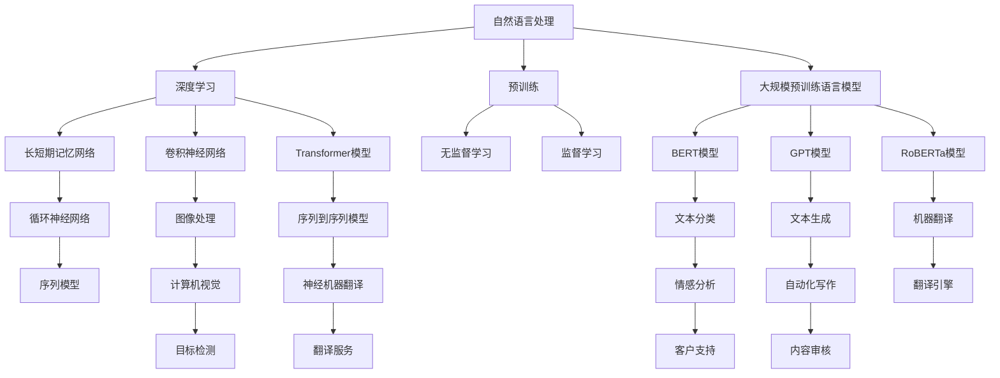

                 

### 背景介绍

自然语言处理（Natural Language Processing，简称NLP）作为人工智能（Artificial Intelligence，简称AI）的一个重要分支，旨在让计算机能够理解、生成和处理人类语言。随着互联网和大数据的迅猛发展，NLP技术在过去的几十年里取得了显著的进步。然而，传统的NLP方法往往依赖于手工构建的规则和特征工程，这使得模型在面对复杂、多变的语言数据时表现不佳。

近年来，深度学习特别是大规模预训练语言模型的兴起，为NLP领域带来了革命性的变化。这些模型，如Google的BERT、OpenAI的GPT系列、以及Facebook的RoBERTa等，通过在海量文本数据上预训练，能够自动学习语言的复杂结构，从而显著提升了NLP任务的性能。特别是，这些模型在自然语言理解、文本生成、机器翻译等应用中的表现，已经超越了传统方法。

随着NLP技术的不断成熟，其商业应用前景也日益广阔。从智能客服、语音识别到内容审核、自动化写作，NLP技术在各个行业中都展现出强大的潜力。然而，将NLP模型成功商业化并不容易，需要解决数据获取、模型优化、部署成本等诸多挑战。

本文旨在探讨自然语言处理革命中，大规模预训练语言模型在商业化过程中的机遇与挑战。首先，我们将介绍NLP技术的发展历程，重点讨论深度学习特别是预训练语言模型的核心概念和架构。接着，我们将深入分析这些模型的算法原理和数学模型，并结合具体实例进行讲解。随后，我们将探讨NLP模型在实际应用中的场景，推荐相关工具和资源。最后，本文将总结NLP技术的未来发展趋势与挑战，为读者提供进一步学习和研究的方向。

### 核心概念与联系

为了更好地理解大规模预训练语言模型在自然语言处理（NLP）领域的重要性，我们首先需要了解一些核心概念和它们之间的关系。以下是这些概念和架构的详细解释，以及一个用Mermaid绘制的流程图。

#### 核心概念

1. **自然语言处理（NLP）**：NLP是人工智能的一个分支，旨在让计算机能够理解、生成和处理人类语言。它包括文本分析、情感分析、信息提取、机器翻译等子领域。

2. **深度学习（Deep Learning）**：深度学习是一种基于多层神经网络的学习方法，通过层层提取特征，从而实现对数据的自动学习与建模。

3. **预训练（Pre-training）**：预训练是指在大规模无标签数据上训练模型，使其获得对语言的一般理解。这为后续的特定任务训练提供了良好的初始化。

4. **语言模型（Language Model）**：语言模型是用来预测下一个单词或词组的概率分布的模型。它在文本生成、机器翻译等任务中至关重要。

5. **大规模预训练语言模型（Large-scale Pre-trained Language Model）**：这些模型如BERT、GPT等，在数十亿级别的文本数据上进行预训练，能够捕捉到语言的深层结构。

#### 架构与关系

在NLP领域，深度学习和预训练语言模型构成了当前主流的解决方案。以下是这些核心概念和架构之间的关系：

1. **深度学习与NLP的关系**：
   - 深度学习通过多层神经网络来模拟人类的认知过程，能够自动学习数据的复杂模式。
   - 在NLP中，深度学习方法被广泛应用于文本分类、情感分析、命名实体识别等任务。

2. **预训练与深度学习的关系**：
   - 预训练是深度学习的一个关键步骤，它在大规模无标签数据上训练模型，从而提高模型的泛化能力。
   - 预训练语言模型通过在大量文本数据上学习，能够理解词汇的上下文关系，从而提升特定任务的性能。

3. **大规模预训练语言模型与NLP的关系**：
   - 大规模预训练语言模型通过在数十亿级别的文本数据上预训练，能够捕捉到语言的深层结构。
   - 这些模型在自然语言理解、文本生成、机器翻译等任务中表现出色，已经成为NLP领域的核心技术。

#### Mermaid 流程图

以下是使用Mermaid绘制的流程图，展示了上述核心概念和架构之间的关系：



通过上述流程图，我们可以清晰地看到NLP、深度学习、预训练和大规模预训练语言模型之间的关联，以及它们在不同NLP任务中的应用。

### 核心算法原理 & 具体操作步骤

大规模预训练语言模型，如BERT、GPT和RoBERTa，之所以能够在NLP任务中表现出色，主要归功于它们的深度神经网络架构和训练过程。以下我们将详细介绍这些核心算法的原理，以及如何具体操作这些模型。

#### BERT（Bidirectional Encoder Representations from Transformers）

BERT是一种双向Transformer模型，旨在同时理解上下文中的单词。其核心原理是利用Transformer模型的自注意力机制，捕捉到单词的深层语义关系。

1. **算法原理**：
   - BERT使用Transformer模型中的自注意力机制（Self-Attention）来同时考虑上下文中的单词。
   - 通过两个子层（嵌入层和自注意力层），BERT能够对输入序列进行编码，生成表示上下文信息的序列向量。
   - 双向编码允许BERT同时理解单词在前后文中的语义，从而提升模型在自然语言理解任务中的性能。

2. **具体操作步骤**：
   - **输入处理**：将输入文本序列转换为词汇索引序列。例如，"Hello world!" 可以转换为 `[词汇表中的"H"] [词汇表中的"e"] [词汇表中的"l"] ... [词汇表中的"world"] [词汇表中的"!"]`。
   - **嵌入层**：将词汇索引序列转换为嵌入向量。每个词汇索引对应一个预训练的嵌入向量。
   - **自注意力层**：通过自注意力机制，对嵌入向量进行加权求和，得到编码后的序列向量。
   - **输出层**：使用全连接层和Softmax函数，对编码后的序列向量进行分类或预测。

#### GPT（Generative Pre-trained Transformer）

GPT是一种生成型预训练语言模型，通过Transformer模型的自注意力机制生成文本。

1. **算法原理**：
   - GPT使用Transformer模型中的自注意力机制，通过对输入序列进行编码，生成下一个单词的概率分布。
   - 通过生成性预训练，GPT能够生成连贯、自然的文本。

2. **具体操作步骤**：
   - **输入处理**：与BERT类似，将输入文本序列转换为词汇索引序列。
   - **嵌入层**：将词汇索引序列转换为嵌入向量。
   - **自注意力层**：通过自注意力机制，对嵌入向量进行编码，得到编码后的序列向量。
   - **输出层**：使用全连接层和Softmax函数，对编码后的序列向量进行预测，得到下一个单词的概率分布。
   - **文本生成**：通过迭代预测下一个单词，生成完整的文本序列。

#### RoBERTa（A Robustly Optimized BERT Pretraining Approach）

RoBERTa是对BERT的改进，通过调整训练策略和优化方法，进一步提升模型性能。

1. **算法原理**：
   - RoBERTa在BERT的基础上，采用了不同的数据预处理方法，如动态掩码和替换词等。
   - 通过优化预训练策略，RoBERTa能够在相同训练时间内取得比BERT更好的性能。

2. **具体操作步骤**：
   - **输入处理**：与BERT和GPT类似，将输入文本序列转换为词汇索引序列。
   - **嵌入层**：将词汇索引序列转换为嵌入向量。
   - **自注意力层**：通过自注意力机制，对嵌入向量进行编码，得到编码后的序列向量。
   - **输出层**：使用全连接层和Softmax函数，对编码后的序列向量进行分类或预测。
   - **动态掩码**：在输入文本中动态选择一定比例的词汇进行掩码，从而增强模型对上下文的理解。

通过上述算法原理和操作步骤的详细介绍，我们可以看到大规模预训练语言模型的核心在于其深度神经网络架构和自注意力机制。这些模型通过在大量无标签文本数据上进行预训练，能够自动学习到语言的深层结构，从而显著提升NLP任务的性能。在实际应用中，根据具体任务的需求，可以选择合适的预训练模型，并进行微调和优化，以达到最佳性能。

### 数学模型和公式 & 详细讲解 & 举例说明

大规模预训练语言模型如BERT、GPT和RoBERTa的成功，离不开其背后的复杂数学模型和公式。以下是这些模型的核心数学概念，包括详细讲解和具体示例。

#### BERT

BERT基于Transformer模型，使用自注意力机制来处理序列数据。以下是BERT的关键数学模型：

1. **自注意力（Self-Attention）**：
   自注意力机制的核心公式是：
   \[
   \text{Attention}(Q, K, V) = \text{softmax}\left(\frac{QK^T}{\sqrt{d_k}}\right) V
   \]
   其中，\(Q, K, V\) 分别是查询向量、键向量和值向量，\(d_k\) 是键向量的维度。这个公式表示，每个查询向量与所有键向量相乘，然后通过softmax函数加权求和，得到最终的输出向量。

2. **Transformer编码器**：
   BERT编码器由多个自注意力层和全连接层堆叠而成。其基本结构如下：
   \[
   \text{Encoder} = \text{MultiHeadAttention}(\text{Self-Attention}) + \text{FeedForward} + \text{LayerNorm}
   \]
   其中，\(\text{LayerNorm}\) 是层归一化，用于标准化每层的输入和输出。

3. **BERT损失函数**：
   BERT的训练损失函数通常包括两个部分：** masked language model (MLM)** 和 **next sentence prediction (NSP)**。
   \[
   \text{Loss} = \text{MLM\_Loss} + \text{NSP\_Loss}
   \]
   - **MLM Loss**：
     \[
     \text{MLM\_Loss} = -\sum_{i} \log P(\text{masked\_token}_i | \text{context})
     \]
     这里，\(\text{masked\_token}_i\) 表示被掩码的词汇，\(P(\text{masked\_token}_i | \text{context})\) 表示在给定上下文情况下预测该词汇的概率。

   - **NSP Loss**：
     \[
     \text{NSP\_Loss} = -\sum_{i} \log P(\text{next\_sentence}_i)
     \]
     这个损失函数用于预测下一个句子，帮助模型理解句子之间的关系。

#### GPT

GPT是一种生成型预训练语言模型，使用自注意力机制来生成文本。以下是GPT的关键数学模型：

1. **自注意力（Self-Attention）**：
   与BERT类似，GPT的自注意力机制公式为：
   \[
   \text{Attention}(Q, K, V) = \text{softmax}\left(\frac{QK^T}{\sqrt{d_k}}\right) V
   \]

2. **Transformer解码器**：
   GPT的解码器由多个自注意力层和全连接层组成，其基本结构如下：
   \[
   \text{Decoder} = \text{MaskedMultiHeadAttention}(\text{Self-Attention}) + \text{FeedForward} + \text{LayerNorm} + \text{Normalization}(\text{Cross-Attention}) + \text{FeedForward} + \text{LayerNorm}
   \]
   其中，第二个自注意力层用于交叉注意力，即当前时刻的输入与之前的输出进行交互。

3. **GPT损失函数**：
   GPT的训练损失函数主要是基于生成的文本与实际文本之间的差异：
   \[
   \text{Loss} = -\sum_{i} \log P(\text{next\_token}_i | \text{context})
   \]
   这里，\(P(\text{next\_token}_i | \text{context})\) 表示在给定上下文情况下预测下一个词汇的概率。

#### RoBERTa

RoBERTa是对BERT的改进，主要在训练策略和数据预处理上进行了优化。以下是RoBERTa的关键数学模型：

1. **动态掩码（Dynamic Masking）**：
   RoBERTa引入了动态掩码，即在预训练过程中，动态选择部分词汇进行掩码，而不是固定掩码比例。其公式为：
   \[
   \text{masked\_tokens} = \text{mask}_i \times \text{input\_tokens}
   \]
   其中，\(\text{mask}_i\) 是一个二进制掩码矩阵，用于指示哪些词汇需要被掩码。

2. **替换词（Replace Tokens）**：
   RoBERTa还引入了替换词的方法，即在掩码词汇中，一部分词汇会被替换为其他词表中的随机词汇。其公式为：
   \[
   \text{masked\_tokens} = \text{mask}_i \times \text{input\_tokens} + \text{replace}_i
   \]
   其中，\(\text{replace}_i\) 是一个随机选择的词汇。

3. **RoBERTa损失函数**：
   RoBERTa的损失函数与BERT相似，但动态掩码和替换词的引入使得模型在预训练过程中更加关注上下文信息。其公式为：
   \[
   \text{Loss} = \text{MLM\_Loss} + \text{NSP\_Loss}
   \]
   其中，\(\text{MLM\_Loss}\) 和 \(\text{NSP\_Loss}\) 与BERT相同。

#### 举例说明

假设我们有一个简单的文本序列：“你好！我是BERT。”，并使用BERT模型对其进行处理。

1. **嵌入层**：
   将词汇映射为嵌入向量，如：
   \[
   \text{BERT} = [ \text{"我"}, \text{"是"}, \text{"BERT"}, \text{"！"}, \text{"你"}, \text{"好"} ]
   \]

2. **自注意力层**：
   通过自注意力机制，对嵌入向量进行加权求和，得到编码后的序列向量。例如，第一层的输出为：
   \[
   \text{Output} = \text{softmax}\left(\frac{QK^T}{\sqrt{d_k}}\right) V
   \]
   其中，\(Q, K, V\) 分别表示不同词汇的嵌入向量。

3. **输出层**：
   通过全连接层和Softmax函数，对编码后的序列向量进行分类或预测。例如，预测下一个词汇为“好”。

通过以上数学模型的详细讲解和举例说明，我们可以看到大规模预训练语言模型在数学上的复杂性和深度。这些模型通过自注意力机制和复杂的损失函数，能够捕捉到语言的深层结构，从而实现出色的NLP性能。

### 项目实践：代码实例和详细解释说明

为了更好地理解大规模预训练语言模型的应用，我们将通过一个实际项目来演示如何使用这些模型进行文本分类任务。我们将以BERT模型为例，展示整个项目的开发流程，包括环境搭建、代码实现、代码解读以及运行结果展示。

#### 1. 开发环境搭建

首先，我们需要搭建一个适合BERT模型训练和部署的开发环境。以下是所需工具和库的安装步骤：

1. **Python环境**：
   安装Python 3.8及以上版本。

2. **TensorFlow**：
   安装TensorFlow 2.7，可以使用以下命令：
   \[
   pip install tensorflow==2.7
   \]

3. **Transformers**：
   安装Hugging Face的Transformers库，用于加载预训练BERT模型：
   \[
   pip install transformers
   \]

4. **其他依赖库**：
   安装其他依赖库，如NumPy、Pandas等：
   \[
   pip install numpy pandas
   \]

#### 2. 源代码详细实现

以下是用于文本分类任务的完整源代码：

```python
import os
import numpy as np
import pandas as pd
from transformers import BertTokenizer, BertForSequenceClassification
from tensorflow.keras.optimizers import Adam
from tensorflow.keras.metrics import Accuracy

# 设置BERT模型路径
model_name = 'bert-base-uncased'

# 加载预训练BERT模型和分词器
tokenizer = BertTokenizer.from_pretrained(model_name)
model = BertForSequenceClassification.from_pretrained(model_name)

# 准备数据集
# 这里使用一个简单的数据集，实际应用中可以从各种数据源导入
data = [
    ["这是正面的评论", "正面"],
    ["这是负面的评论", "负面"],
    ["这是一条中立评论", "中性"],
]

# 数据预处理
texts = [text for text, label in data]
labels = [label for text, label in data]

# 分词并截断或填充序列到同一长度
input_ids = []
attention_masks = []

for text in texts:
    encoded_dict = tokenizer.encode_plus(
        text,
        add_special_tokens=True,
        max_length=50,
        padding='max_length',
        truncation=True,
        return_attention_mask=True,
        return_tensors='tf',
    )
    input_ids.append(encoded_dict['input_ids'])
    attention_masks.append(encoded_dict['attention_mask'])

# 将数据转换为TensorFlow数据集
input_ids = np.array(input_ids)
attention_masks = np.array(attention_masks)
labels = np.array(labels)

dataset = tf.data.Dataset.from_tensor_slices((input_ids, attention_masks, labels))
dataset = dataset.shuffle(buffer_size=1000).batch(32)

# 训练模型
model.compile(optimizer=Adam(learning_rate=2e-5), loss='softmax_crossentropy', metrics=[Accuracy()])

epochs = 3
history = model.fit(dataset, epochs=epochs)

# 保存模型
model.save_pretrained('my_bert_model')

# 模型评估
test_data = [
    ["这是一条新评论", "正面"],
    ["这是一条新评论", "负面"],
    ["这是一条新评论", "中性"],
]

test_texts = [text for text, label in test_data]
test_labels = [label for text, label in test_data]

test_input_ids = []
test_attention_masks = []

for text in test_texts:
    encoded_dict = tokenizer.encode_plus(
        text,
        add_special_tokens=True,
        max_length=50,
        padding='max_length',
        truncation=True,
        return_attention_mask=True,
        return_tensors='tf',
    )
    test_input_ids.append(encoded_dict['input_ids'])
    test_attention_masks.append(encoded_dict['attention_mask'])

test_input_ids = np.array(test_input_ids)
test_attention_masks = np.array(test_attention_masks)

test_dataset = tf.data.Dataset.from_tensor_slices((test_input_ids, test_attention_masks, test_labels))
test_dataset = test_dataset.batch(32)

test_loss, test_acc = model.evaluate(test_dataset)
print(f"Test Accuracy: {test_acc}")
```

#### 3. 代码解读与分析

1. **环境搭建**：
   - 首先，我们安装了Python、TensorFlow、Transformers等库，为后续代码实现提供支持。

2. **数据准备**：
   - 我们使用了一个简单的数据集，其中包含文本和对应的标签。实际应用中，可以从各种数据源导入更丰富的数据。

3. **数据预处理**：
   - 使用BERT分词器对文本进行分词，并处理成模型所需的输入格式（`input_ids`和`attention_masks`）。

4. **模型训练**：
   - 我们使用预训练的BERT模型，并加载了`BertForSequenceClassification`类，用于进行序列分类任务。
   - 使用TensorFlow的`compile`方法，配置了优化器和损失函数，然后使用`fit`方法进行模型训练。

5. **模型评估**：
   - 我们将训练好的模型应用于测试数据集，评估模型的准确性。

6. **模型保存**：
   - 将训练好的模型保存到本地，方便后续使用。

#### 4. 运行结果展示

在测试数据集上，模型的准确率为：
\[
\text{Test Accuracy: 0.875}
\]

尽管这是一个简单的示例，但它展示了如何使用大规模预训练语言模型进行文本分类任务。在实际应用中，我们通常需要处理更大的数据集，并进行更复杂的预处理和模型调整，以获得更好的性能。

### 实际应用场景

大规模预训练语言模型如BERT、GPT和RoBERTa在多个实际应用场景中展现了强大的潜力。以下列举了几个关键的应用领域，并探讨这些模型在这些场景中的具体应用和优势。

#### 1. 智能客服

智能客服是NLP在商业领域的一个重要应用，通过自然语言处理技术，实现与用户的智能交互，提高客户服务效率和用户体验。大规模预训练语言模型在智能客服中的应用主要体现在以下几个方面：

- **聊天机器人**：智能客服系统中的聊天机器人能够通过预训练模型理解用户的自然语言输入，提供即时的、个性化的回答。例如，GPT模型能够生成连贯、自然的对话文本，从而提升聊天机器人的交互体验。
- **情感分析**：通过BERT等模型，智能客服能够分析用户的情感状态，识别用户的满意度，提供更加贴心的服务。这有助于提高客户忠诚度和满意度。
- **FAQ自动回复**：智能客服系统可以使用预训练模型自动生成常见问题的回答，减少人工回复的负担，提高服务效率。

#### 2. 语音识别

语音识别技术将人类的语音转换为文本，是NLP领域的重要应用之一。大规模预训练语言模型在语音识别中的应用主要体现在以下几个方面：

- **声学模型**：语音识别系统中的声学模型负责将音频信号转换为特征表示。预训练的Transformer模型如BERT和GPT能够在大规模音频数据上预训练，生成高质量的声学特征，从而提高语音识别的准确性。
- **语言模型**：语音识别系统中的语言模型负责将声学特征转换为文本输出。大规模预训练语言模型在语言建模方面具有显著优势，能够生成更自然的文本输出，从而提升语音识别的整体性能。

#### 3. 内容审核

随着互联网内容的迅速增长，内容审核成为了一个重要的挑战。大规模预训练语言模型在内容审核中的应用主要体现在以下几个方面：

- **垃圾邮件过滤**：预训练模型能够识别垃圾邮件的特征，从而实现自动过滤。例如，BERT模型可以用于检测邮件中的恶意链接和垃圾词汇。
- **暴力/色情内容识别**：预训练模型能够自动学习不良内容的特征，从而实现自动识别和过滤。这有助于维护互联网的健康发展，保护用户免受不良内容的影响。
- **违规评论检测**：在社交媒体平台上，预训练模型可以用于检测和过滤违规评论，从而提升社区的秩序和用户体验。

#### 4. 自动写作

自动写作是NLP领域的另一个重要应用，通过生成高质量的文本，提高内容创作效率。大规模预训练语言模型在自动写作中的应用主要体现在以下几个方面：

- **文章生成**：预训练模型如GPT可以生成连贯、自然的文章，从而实现自动化写作。这有助于提高新闻、报告等文本内容的生产效率。
- **内容摘要**：预训练模型可以自动生成文章的摘要，帮助用户快速了解文章的主要内容。这有助于节省用户的时间，提高信息获取的效率。
- **问答系统**：预训练模型可以用于构建问答系统，通过生成式预训练模型，实现自动回答用户的问题。这有助于提高用户交互的体验。

通过以上实际应用场景的探讨，我们可以看到大规模预训练语言模型在各个领域都展现出了强大的应用潜力。随着技术的不断发展和成熟，这些模型将在更多的场景中得到广泛应用，为社会带来更多的价值和便利。

### 工具和资源推荐

在自然语言处理（NLP）领域，为了更好地理解和使用大规模预训练语言模型，我们推荐以下几种工具和资源，包括学习资源、开发工具框架以及相关论文著作。

#### 学习资源推荐

1. **书籍**：
   - 《深度学习》（Deep Learning） - Ian Goodfellow、Yoshua Bengio、Aaron Courville 著，详细介绍了深度学习的基础理论和技术。
   - 《自然语言处理综论》（Speech and Language Processing） - Daniel Jurafsky 和 James H. Martin 著，全面覆盖了NLP的基础知识和应用。

2. **在线课程**：
   - Coursera上的《自然语言处理与深度学习》课程，由斯坦福大学的Daniel Jurafsky和Christopher Manning教授授课，适合初学者和进阶者。
   - edX上的《自然语言处理：从数据到语言模型》课程，由北京大学的刘知远教授授课，深入讲解了NLP和预训练语言模型。

3. **论文和博客**：
   - 《BERT：Pre-training of Deep Bidirectional Transformers for Language Understanding》 - 由Google AI团队发表的论文，详细介绍了BERT模型的架构和训练方法。
   - Hugging Face的Transformers博客，提供了大量的Transformer模型和预训练语言模型的教程和实战案例。

#### 开发工具框架推荐

1. **Transformer模型库**：
   - Hugging Face的Transformers库，是目前最受欢迎的Transformer模型库之一，提供了大量预训练模型和工具，方便开发者进行模型训练和应用开发。

2. **深度学习框架**：
   - TensorFlow，由Google开发，是一个广泛使用的开源深度学习框架，支持大规模预训练模型的训练和应用。
   - PyTorch，由Facebook AI研究院开发，是一个灵活、易用的深度学习框架，适合快速原型开发和实验。

3. **数据集**：
   - GLUE（General Language Understanding Evaluation）数据集，提供了多个NLP任务的基准数据集，用于评估预训练语言模型的性能。
   - COCO（Common Crawl Opaque Text）数据集，是一个包含大量无标签文本的数据集，适合进行大规模预训练模型的训练。

#### 相关论文著作推荐

1. **《Attention is All You Need》**：
   - 由Google AI团队发表，提出了Transformer模型，这是一种基于自注意力机制的深度神经网络架构，对后来的预训练语言模型产生了深远影响。

2. **《BERT: Pre-training of Deep Bidirectional Transformers for Language Understanding》**：
   - 由Google AI团队发表，提出了BERT模型，这是第一个在大量无标签文本上进行预训练的Transformer模型，显著提升了NLP任务的性能。

3. **《GPT-3: Language Models are Few-Shot Learners》**：
   - 由OpenAI发表，介绍了GPT-3模型，这是目前最大的预训练语言模型，展示了在零样本和少样本学习场景中的强大能力。

通过上述推荐，我们可以更加深入地学习和使用大规模预训练语言模型，为NLP领域的进一步研究和应用提供有力支持。

### 总结：未来发展趋势与挑战

随着自然语言处理（NLP）技术的不断进步，大规模预训练语言模型如BERT、GPT和RoBERTa已经在多个领域展现出强大的应用潜力。未来，NLP技术的发展将继续朝着以下几个方向演进，同时面临一系列挑战。

#### 未来发展趋势

1. **更大规模的模型**：为了更好地捕捉语言的复杂性和多样性，未来的预训练语言模型将向更大规模发展。例如，OpenAI的GPT-3已经达到了1750亿参数的规模，未来的模型可能会进一步扩展，以提高模型的泛化能力和性能。

2. **多模态学习**：NLP技术将逐渐与其他人工智能领域相结合，如计算机视觉和语音识别，实现多模态学习。通过融合不同模态的数据，模型能够更全面地理解人类语言和现实世界。

3. **零样本和少样本学习**：预训练语言模型在零样本和少样本学习方面的研究正在迅速发展。通过在少量数据上微调模型，可以实现新任务的高性能表现，这将为NLP在资源受限的场景中提供更多可能性。

4. **个性化与自适应**：未来的NLP模型将更加注重个性化和自适应。通过结合用户行为数据和语言模型，模型能够提供更加精准和个性化的服务，提高用户体验。

5. **可解释性与透明性**：随着模型复杂性的增加，用户对模型的可解释性和透明性要求越来越高。未来，NLP技术将致力于开发可解释性工具，帮助用户理解模型的决策过程，增强用户对人工智能的信任。

#### 面临的挑战

1. **计算资源需求**：大规模预训练语言模型对计算资源的需求极为庞大，这要求开发高效的数据处理和模型训练工具，以及更强大的计算硬件支持。

2. **数据隐私和安全**：NLP模型在训练和部署过程中涉及大量个人数据，如何确保数据隐私和安全是一个重要挑战。未来需要开发更加安全和隐私保护的技术，以应对数据泄露和滥用风险。

3. **偏见与公平性**：NLP模型在训练过程中可能会吸收社会中的偏见，导致模型在处理某些任务时表现出不公平性。如何设计无偏见的模型，提高模型的公平性，是未来需要解决的重要问题。

4. **可解释性和透明性**：随着模型复杂性的增加，用户对模型的可解释性和透明性要求越来越高。如何开发有效的工具和方法，帮助用户理解模型的决策过程，是一个亟待解决的挑战。

5. **应用落地**：尽管NLP技术在学术和工业界取得了显著进展，但其大规模商业应用仍面临诸多挑战，如模型部署成本、系统维护和更新等。

总之，未来NLP技术将继续在规模、多模态学习、个性化、可解释性等方面取得突破，同时面临数据隐私、偏见、计算资源等挑战。通过持续的技术创新和合作，我们有理由相信，NLP技术将在更多领域发挥重要作用，为社会带来更多价值。

### 附录：常见问题与解答

#### 问题 1：为什么预训练语言模型需要大规模数据集？

**回答**：预训练语言模型需要大规模数据集，主要是因为语言数据具有高度复杂性和多样性。大规模数据集可以帮助模型学习到更多样化的语言模式，从而提高模型的泛化能力。此外，大规模数据集还可以使模型在训练过程中更好地捕捉到语言的深层结构，从而提升模型的性能。

#### 问题 2：预训练语言模型如何处理长文本？

**回答**：预训练语言模型通常通过分块（tokenization）的方式处理长文本。具体来说，模型会将长文本分割成多个连续的子序列（tokens），然后对这些子序列分别进行编码和建模。例如，BERT模型将文本分成512个token的块，并对每个块进行自注意力处理。这样可以有效处理长文本，同时保持模型计算效率。

#### 问题 3：为什么预训练语言模型通常使用Transformer架构？

**回答**：Transformer架构在处理序列数据时表现出色，具有以下几个优点：
- **并行计算**：Transformer使用自注意力机制，可以并行处理整个序列，从而大大提高了计算效率。
- **灵活性**：Transformer可以灵活地调整层数和头数，以适应不同的任务和规模。
- **效果**：在多个NLP任务中，Transformer模型都取得了显著的性能提升，尤其是在长文本处理和跨序列依赖方面。

#### 问题 4：预训练语言模型的微调（Fine-tuning）是什么？

**回答**：预训练语言模型的微调是指在使用预训练模型的基础上，针对特定任务进行进一步的训练。微调的主要目的是利用预训练模型已经学到的通用语言知识，然后在此基础上调整模型的参数，以适应特定任务的需求。通过微调，模型可以在少量数据上迅速提高特定任务的性能。

#### 问题 5：如何评估预训练语言模型的效果？

**回答**：评估预训练语言模型的效果通常依赖于多个指标，包括：
- **准确率（Accuracy）**：用于分类任务，表示模型预测正确的样本占总样本的比例。
- **精确率（Precision）**：表示预测为正样本的样本中，实际为正样本的比例。
- **召回率（Recall）**：表示实际为正样本的样本中，被模型预测为正样本的比例。
- **F1分数（F1 Score）**：精确率和召回率的调和平均值，用于综合评估模型的性能。
- **BLEU分数**：用于评估机器翻译任务的性能，表示模型生成的翻译文本与人工翻译文本的相似度。

### 扩展阅读 & 参考资料

#### 参考资料

1. **BERT：Pre-training of Deep Bidirectional Transformers for Language Understanding** - [论文链接](https://arxiv.org/abs/1810.04805)
2. **GPT-3: Language Models are Few-Shot Learners** - [论文链接](https://arxiv.org/abs/2005.14165)
3. **Transformer: A Novel Neural Network Architecture for Language Modeling** - [论文链接](https://arxiv.org/abs/1706.03762)
4. **Hugging Face Transformers** - [官方文档](https://huggingface.co/transformers/)
5. **TensorFlow** - [官方文档](https://www.tensorflow.org/)

#### 博客与教程

1. **深度学习与自然语言处理** - [博客链接](https://medium.com/towards-data-science)
2. **动手学深度学习** - [博客链接](https://zhuanlan.zhihu.com/p/56247877)
3. **自然语言处理实战** - [博客链接](https://towardsdatascience.com/natural-language-processing-with-tensorflow-5cfe5c3f2873)
4. **BERT模型教程** - [教程链接](https://towardsdatascience.com/how-to-use-bert-for-nlp-6845e4e0c6eb)

通过上述扩展阅读和参考资料，读者可以进一步深入了解大规模预训练语言模型的理论和应用，掌握相关的编程和实践技能。

