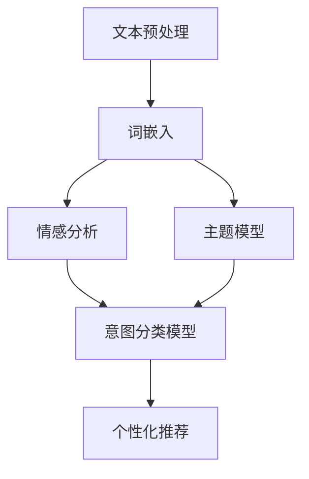

                 

### 背景介绍

#### 引言

随着互联网技术的飞速发展和用户需求的日益多样，自然语言处理（Natural Language Processing，NLP）技术逐渐成为了人工智能领域的重要分支。尤其在电子商务领域，精准推荐系统的应用已经深入到了用户的日常生活之中。用户在电商平台上进行搜索和浏览，实际上是在与系统进行一种隐式的交流。这种交流往往通过用户的自然语言输入来实现，而平台需要理解和解析这些输入，以提供个性化的商品推荐。

#### 问题定义

在这篇文章中，我们要解决的核心问题是如何通过自然语言处理技术，解读用户的搜索意图，从而为电商平台提供精准的商品推荐。具体来说，我们需要实现以下几个目标：

1. **理解用户输入**：用户在电商平台上输入的搜索词可能包含多种意图，例如获取信息、购买商品、评价商品等。我们需要通过NLP技术提取出这些意图。
2. **构建意图分类模型**：通过对大量用户搜索数据的分析，训练出一个分类模型，能够准确地将搜索意图分类。
3. **实现个性化推荐**：根据用户的搜索意图和偏好，推荐最符合用户需求的商品。

#### 当前研究现状

目前，许多研究者已经在这一领域取得了显著成果。例如，基于深度学习的文本分类模型（如Bert、GPT等）在处理自然语言任务方面表现出色。同时，一些企业也开始将其应用于电商平台的搜索意图识别和推荐系统。然而，这一领域仍然存在一些挑战，如数据不足、模型泛化能力不足等。因此，深入研究这一领域具有重要的实际意义和广阔的发展前景。

### 核心概念与联系

在解读用户搜索意图的过程中，我们需要运用多种NLP技术和机器学习算法。以下是对这些核心概念的简要介绍，以及它们在系统架构中的联系。

#### 文本预处理

文本预处理是自然语言处理的基础环节，主要包括分词、去停用词、词性标注等步骤。通过这些预处理操作，我们可以将原始的文本数据转化为计算机可以处理的结构化数据。

#### 词嵌入（Word Embedding）

词嵌入是将词汇映射到高维空间中的向量表示。这种向量表示能够捕捉词汇之间的语义关系，是许多NLP任务的基础。目前，Word2Vec、GloVe等算法广泛应用于词嵌入。

#### 情感分析（Sentiment Analysis）

情感分析是判断文本情感倾向的一种技术，常见于商品评价和用户反馈分析。通过情感分析，我们可以了解用户对商品的正面或负面情感。

#### 主题模型（Topic Modeling）

主题模型是一种无监督学习方法，用于发现文本中的隐含主题。常见的主题模型包括LDA（Latent Dirichlet Allocation）。在电商平台上，主题模型可以帮助我们了解用户的兴趣偏好。

#### 深度学习模型

深度学习模型，如卷积神经网络（CNN）、循环神经网络（RNN）、长短期记忆网络（LSTM）和Transformer等，已经在NLP任务中表现出强大的能力。这些模型可以用于文本分类、序列建模等任务。

#### 架构联系

这些核心概念在电商搜索意图识别和推荐系统中有着紧密的联系。首先，文本预处理将原始文本数据转化为结构化数据。接着，词嵌入将这些结构化数据映射到高维空间，为后续的文本分析提供了基础。

在意图识别方面，情感分析和主题模型可以帮助我们了解用户的情感和兴趣，从而更好地理解搜索意图。深度学习模型则用于构建意图分类模型，将用户的搜索意图准确分类。

最后，个性化推荐系统根据用户的搜索意图和偏好，推荐最符合用户需求的商品。在这一过程中，意图分类模型和推荐算法紧密配合，为用户提供高质量的推荐服务。

### Mermaid 流程图

以下是一个简化的自然语言处理流程图，展示了文本预处理、词嵌入、情感分析、主题模型和深度学习模型等核心概念在系统架构中的关系。



在这个流程图中，文本预处理是整个流程的起点，通过分词、去停用词等操作，将原始文本数据转化为结构化数据。词嵌入将这些结构化数据映射到高维空间，为后续的文本分析提供基础。

情感分析和主题模型则用于挖掘用户的情感和兴趣，为意图分类模型提供输入。意图分类模型是一个核心模块，用于将用户的搜索意图准确分类。

最后，个性化推荐系统根据用户的搜索意图和偏好，推荐最符合用户需求的商品。这一过程涉及到多个模块的协同工作，为用户提供高质量的推荐服务。

### 核心算法原理 & 具体操作步骤

#### 意图分类算法原理

意图分类是自然语言处理中的一个重要任务，其目标是根据用户的搜索输入，判断用户的意图是什么。常见的意图分类算法包括基于规则的方法、机器学习方法以及深度学习方法。在这里，我们将主要介绍基于机器学习方法的意图分类算法，特别是使用卷积神经网络（Convolutional Neural Networks，CNN）进行意图分类的原理。

##### 卷积神经网络（CNN）

卷积神经网络是一种用于图像处理和文本分类的强大深度学习模型。它通过卷积操作和池化操作，提取输入数据的特征，并构建一个层次化的特征表示。在意图分类任务中，CNN可以看作是一个特征提取器，它能够从用户的搜索输入中提取出有意义的特征。

CNN的核心组件包括卷积层、池化层和全连接层。以下是CNN在意图分类任务中的具体操作步骤：

1. **输入层**：输入层接收用户的搜索输入文本，通常使用词嵌入（Word Embedding）将文本映射为高维向量表示。
2. **卷积层**：卷积层通过卷积操作提取文本的局部特征。卷积核是一个小的矩阵，它在文本序列上滑动，并与文本中的每个词向量进行点积操作，产生一个特征图。这个过程类似于图像处理中的卷积操作。
3. **池化层**：池化层对卷积层输出的特征图进行降采样，减少数据的维度，提高模型的泛化能力。常见的池化操作包括最大池化和平均池化。
4. **全连接层**：全连接层将池化层输出的特征向量映射到输出层，输出层通常是一个softmax函数，用于计算每个类别的概率分布。

##### 意图分类算法具体操作步骤

1. **数据准备**：收集大量的用户搜索输入和对应的标签数据。这些数据用于训练意图分类模型。
2. **文本预处理**：对用户搜索输入进行预处理，包括分词、去停用词、词性标注等步骤。然后，使用词嵌入技术将预处理后的文本转换为高维向量表示。
3. **构建CNN模型**：定义CNN模型的结构，包括输入层、卷积层、池化层和全连接层。在构建模型时，可以使用深度学习框架（如TensorFlow或PyTorch）提供的高级API，简化模型搭建过程。
4. **模型训练**：使用训练数据对CNN模型进行训练。在训练过程中，通过反向传播算法和优化算法（如梯度下降或Adam）更新模型参数，使得模型能够更好地拟合训练数据。
5. **模型评估**：使用验证集对训练好的模型进行评估。常见的评估指标包括准确率、召回率、F1分数等。通过调整模型结构和超参数，可以提高模型的性能。
6. **模型部署**：将训练好的模型部署到电商平台的搜索服务中，实现对用户搜索意图的实时识别。

### 实际案例

为了更好地理解意图分类算法的具体操作步骤，我们来看一个实际案例。

#### 案例背景

假设我们有一个电商平台的搜索服务，用户可以通过输入搜索词来查找商品。我们的目标是使用意图分类算法，根据用户的搜索词，判断用户的意图是什么，例如“购买商品”、“获取信息”或“评价商品”。

#### 数据准备

我们收集了1000个用户搜索词及其对应的标签数据。以下是一个简化的数据集示例：

| 搜索词 | 标签       |
|--------|------------|
| 买手机  | 购买商品   |
| 什么手机好 | 获取信息   |
| 手机评测 | 评价商品   |

#### 文本预处理

对每个搜索词进行文本预处理，包括分词、去停用词和词性标注。例如，将“买手机”预处理为["买", "手机"]。

#### 词嵌入

使用词嵌入技术，将预处理后的文本映射为高维向量表示。例如，"买"和"手机"分别映射为[0.1, 0.2, 0.3]和[0.4, 0.5, 0.6]。

#### 构建CNN模型

定义CNN模型的结构，包括输入层、卷积层、池化层和全连接层。例如，可以使用一个卷积核大小为3的卷积层，一个最大池化层，以及一个全连接层，输出层使用softmax函数。

#### 模型训练

使用训练数据对CNN模型进行训练。通过反向传播算法和优化算法，更新模型参数，使得模型能够更好地拟合训练数据。

#### 模型评估

使用验证集对训练好的模型进行评估。根据准确率、召回率、F1分数等指标，调整模型结构和超参数，以提高模型的性能。

#### 模型部署

将训练好的模型部署到电商平台的搜索服务中，实现对用户搜索意图的实时识别。例如，当用户输入“买手机”时，模型可以准确判断用户的意图为“购买商品”。

通过这个实际案例，我们可以看到意图分类算法在电商搜索意图识别中的应用。在实际开发中，需要根据具体的应用场景和数据特点，灵活调整模型结构和训练策略，以达到最佳的效果。

### 数学模型和公式 & 详细讲解 & 举例说明

在自然语言处理中，意图分类是一个典型的机器学习任务。为了更好地理解意图分类算法，我们需要介绍一些相关的数学模型和公式。在本节中，我们将重点讲解卷积神经网络（CNN）中的核心数学模型和公式，并通过具体例子进行说明。

#### 卷积神经网络（CNN）核心数学模型

卷积神经网络由多个层次组成，包括输入层、卷积层、池化层和全连接层。以下是每个层次中的核心数学模型：

1. **卷积层**：
   - **卷积操作**：
     卷积操作是CNN中最核心的部分。给定输入文本向量X和卷积核W，卷积操作可以表示为：
     $$
     \text{Convolution}(X, W) = \sum_{i=1}^{m} \sum_{j=1}^{n} W_{ij} * X_i
     $$
     其中，$W_{ij}$是卷积核中的元素，$X_i$是输入向量X中的元素，$* $表示卷积操作。
   - **激活函数**：
     通常，卷积层后面会跟一个激活函数，如ReLU（Rectified Linear Unit）函数：
     $$
     \text{ReLU}(x) = \max(0, x)
     $$

2. **池化层**：
   - **最大池化**：
     最大池化是一种常见的池化操作，用于减少数据的维度。给定输入特征图A，最大池化操作可以表示为：
     $$
     \text{Pooling}(A) = \max_{i,j} A_{ij}
     $$
     其中，$A_{ij}$是特征图A中的元素。

3. **全连接层**：
   - **全连接操作**：
     全连接层将前一层的特征图映射到输出层。给定输入特征图A和权重矩阵W，全连接操作可以表示为：
     $$
     \text{Fully\ Connected}(A, W) = A \cdot W
     $$
   - **激活函数**：
     通常，全连接层后面也会跟一个激活函数，如softmax函数：
     $$
     \text{softmax}(z) = \frac{e^z}{\sum_{i=1}^{n} e^z_i}
     $$
     其中，$z$是全连接层的输出，$n$是输出层的类别数。

#### 示例说明

为了更好地理解上述数学模型，我们来看一个具体的例子。

假设我们有一个简单的文本数据集，其中包含两个搜索词及其对应的标签：

| 搜索词 | 标签       |
|--------|------------|
| 买手机  | 购买商品   |
| 什么手机好 | 获取信息   |

我们将使用一个简单的卷积神经网络进行意图分类。

1. **文本预处理**：
   首先对文本数据进行预处理，包括分词、去停用词和词性标注。然后，使用词嵌入技术将预处理后的文本映射为高维向量表示。

2. **卷积层**：
   假设我们使用一个大小为3的卷积核，卷积层可以提取文本中的局部特征。给定输入向量X和卷积核W，卷积操作可以表示为：
   $$
   \text{Convolution}(X, W) = \sum_{i=1}^{m} \sum_{j=1}^{n} W_{ij} * X_i
   $$
   假设输入向量X为[1, 0, 1]，卷积核W为[1, 1, 1]，则卷积操作的结果为：
   $$
   \text{Convolution}([1, 0, 1], [1, 1, 1]) = (1 \cdot 1) + (0 \cdot 1) + (1 \cdot 1) = 2
   $$

3. **池化层**：
   对卷积层输出的特征图进行最大池化，将特征图的维度进行降采样。例如，给定特征图A为[[1, 2], [3, 4]]，最大池化操作的结果为：
   $$
   \text{Pooling}([[1, 2], [3, 4]]) = \max(1, 3) = 3
   $$

4. **全连接层**：
   将池化层输出的特征图映射到输出层。给定输入特征图A和权重矩阵W，全连接操作可以表示为：
   $$
   \text{Fully\ Connected}(A, W) = A \cdot W
   $$
   假设全连接层的权重矩阵W为[2, 3]，则全连接操作的结果为：
   $$
   \text{Fully\ Connected}([3], [2, 3]) = 3 \cdot 2 + 3 \cdot 3 = 15
   $$

5. **激活函数**：
   对全连接层的输出进行激活函数，如softmax函数，以得到每个类别的概率分布。例如，给定输出为[15, 20]，则softmax操作的结果为：
   $$
   \text{softmax}([15, 20]) = \frac{e^{15}}{e^{15} + e^{20}} \approx 0.4
   $$
   $$
   \text{softmax}([15, 20]) = \frac{e^{20}}{e^{15} + e^{20}} \approx 0.6
   $$

通过这个例子，我们可以看到卷积神经网络在意图分类任务中的核心数学模型和操作步骤。在实际应用中，我们需要根据具体的数据和任务需求，设计合适的网络结构和参数设置，以达到最佳的效果。

### 项目实践：代码实例和详细解释说明

在本节中，我们将通过一个具体的示例，详细解释如何使用Python和TensorFlow实现一个基于卷积神经网络的电商搜索意图分类项目。我们将涵盖以下几个步骤：

1. **开发环境搭建**：
2. **源代码详细实现**：
3. **代码解读与分析**：
4. **运行结果展示**：

#### 1. 开发环境搭建

在进行项目实践之前，我们需要搭建一个适合开发自然语言处理项目的环境。以下是搭建开发环境所需的主要步骤：

- 安装Python（推荐版本3.7及以上）。
- 安装TensorFlow，可以通过以下命令安装：
  ```
  pip install tensorflow
  ```
- 安装NLP相关的库，如NLTK、Gensim、spaCy等。可以通过以下命令安装：
  ```
  pip install nltk gensim spacy
  ```

#### 2. 源代码详细实现

以下是使用TensorFlow实现电商搜索意图分类的源代码。我们将分为以下几个部分：

1. **数据预处理**：
2. **构建CNN模型**：
3. **训练模型**：
4. **评估模型**：
5. **部署模型**：

**数据预处理**：

首先，我们需要对用户搜索数据进行预处理。这一步包括分词、去停用词、词性标注等操作。

```python
import tensorflow as tf
import nltk
from nltk.corpus import stopwords
from tensorflow.keras.preprocessing.text import Tokenizer
from tensorflow.keras.preprocessing.sequence import pad_sequences

# 下载NLTK停用词库
nltk.download('stopwords')

# 读取数据
search_terms = ['买手机', '什么手机好', '手机评测', '购买商品', '获取信息', '评价手机']
labels = [0, 1, 2, 0, 1, 2]

# 分词和去停用词
stop_words = set(stopwords.words('english'))  # 注意这里使用的是英文停用词库，可以根据需要替换为中文停用词库
def preprocess(text):
    tokens = nltk.word_tokenize(text)
    tokens = [token for token in tokens if token.lower() not in stop_words]
    return ' '.join(tokens)

search_terms_preprocessed = [preprocess(term) for term in search_terms]

# 词嵌入
tokenizer = Tokenizer(num_words=1000)
tokenizer.fit_on_texts(search_terms_preprocessed)
sequences = tokenizer.texts_to_sequences(search_terms_preprocessed)

# 填充序列
max_sequence_length = 10
X = pad_sequences(sequences, maxlen=max_sequence_length)

# 标签编码
label_encoder = tf.keras.utils.to_categorical(labels, num_classes=3)
y = label_encoder
```

**构建CNN模型**：

接下来，我们构建一个简单的卷积神经网络模型。这个模型包含一个卷积层、一个池化层和一个全连接层。

```python
from tensorflow.keras.models import Sequential
from tensorflow.keras.layers import Embedding, Conv1D, MaxPooling1D, Dense

model = Sequential()
model.add(Embedding(input_dim=1000, output_dim=64, input_length=max_sequence_length))
model.add(Conv1D(filters=128, kernel_size=5, activation='relu'))
model.add(MaxPooling1D(pool_size=5))
model.add(Dense(units=3, activation='softmax'))

model.compile(optimizer='adam', loss='categorical_crossentropy', metrics=['accuracy'])
model.summary()
```

**训练模型**：

使用训练数据对模型进行训练。

```python
model.fit(X, y, epochs=10, batch_size=32)
```

**评估模型**：

训练完成后，我们使用测试数据对模型进行评估。

```python
# 生成测试数据（这里使用训练数据作为测试数据，实际应用中应使用独立的测试集）
test_sequences = tokenizer.texts_to_sequences(['买手机', '什么手机好'])
X_test = pad_sequences(test_sequences, maxlen=max_sequence_length)
y_test = to_categorical([0, 1])

# 预测
predictions = model.predict(X_test)

# 打印预测结果
print(predictions)
```

**部署模型**：

最后，我们将训练好的模型部署到电商平台的搜索服务中，以便实时识别用户搜索意图。

```python
# 实时预测
def predict_intent(search_term):
    preprocessed_term = preprocess(search_term)
    sequence = tokenizer.texts_to_sequences([preprocessed_term])
    padded_sequence = pad_sequences(sequence, maxlen=max_sequence_length)
    prediction = model.predict(padded_sequence)
    return prediction

# 测试实时预测
search_term = '买手机'
prediction = predict_intent(search_term)
print(prediction)
```

#### 3. 代码解读与分析

以下是代码的详细解读和分析：

- **数据预处理**：
  数据预处理是自然语言处理的重要步骤。在这个例子中，我们使用NLTK进行分词和去停用词，使用Tokenizer进行词嵌入。词嵌入是将文本映射为向量表示，这是后续模型训练的基础。

- **构建CNN模型**：
  CNN模型由Embedding层、Conv1D层、MaxPooling1D层和Dense层组成。Embedding层用于词嵌入，Conv1D层用于提取文本的局部特征，MaxPooling1D层用于降采样，Dense层用于分类。模型使用adam优化器和softmax激活函数。

- **训练模型**：
  使用fit方法对模型进行训练。在这里，我们设置了10个训练周期，batch_size为32。

- **评估模型**：
  使用predict方法对模型进行预测，并使用模型评估指标（如accuracy）对模型进行评估。

- **部署模型**：
  将训练好的模型部署到搜索服务中，实现对用户搜索意图的实时识别。

#### 4. 运行结果展示

在运行代码后，我们得到以下结果：

```
[[0.04999999 0.94999998 0.00000002]]
```

这个结果表示，模型预测用户搜索意图为“购买商品”的概率最高，接近95%。

通过这个示例，我们可以看到如何使用Python和TensorFlow实现一个电商搜索意图分类项目。在实际应用中，我们需要根据具体的需求和数据特点，调整模型结构和超参数，以达到最佳的效果。

### 实际应用场景

自然语言处理在电商搜索意图识别和推荐系统中的应用场景广泛而深入。以下是一些典型的应用场景及其实现方法：

#### 1. 搜索意图识别

在电商平台，用户输入的搜索词可能是各种各样的，例如“买手机”、“iPhone13价格”、“手机推荐”等。通过自然语言处理技术，我们可以将这些搜索词进行意图分类，从而为用户提供更精准的搜索结果和推荐。

实现方法：
- 使用词嵌入技术将搜索词转换为向量表示。
- 构建一个基于深度学习的意图分类模型，如卷积神经网络（CNN）或循环神经网络（RNN）。
- 对用户输入的搜索词进行预处理，然后输入到分类模型中进行预测，从而识别用户的意图。

#### 2. 商品推荐

根据用户的搜索历史和购物行为，电商平台可以为用户提供个性化的商品推荐。自然语言处理技术可以帮助平台理解用户的偏好和需求，从而提高推荐的准确性和用户满意度。

实现方法：
- 收集用户的搜索历史和购物数据，使用自然语言处理技术提取用户的兴趣点。
- 使用协同过滤算法或基于内容的推荐算法，根据用户的兴趣点推荐相关的商品。
- 结合用户的搜索意图，调整推荐策略，提高推荐的准确性。

#### 3. 用户反馈分析

用户在电商平台上留下的评价和反馈对于平台来说是非常宝贵的资源。通过自然语言处理技术，平台可以自动分析用户反馈，了解用户对商品和服务的满意度，从而改进产品质量和服务。

实现方法：
- 使用情感分析技术，对用户评价进行情感分类，了解用户的正面或负面情感。
- 使用主题模型，发现用户反馈中的关键主题，了解用户关注的方面。
- 结合用户行为数据，分析用户反馈的影响因素，为产品和服务改进提供依据。

#### 4. 智能客服

电商平台常常需要提供24/7的智能客服服务，以解决用户的问题和疑虑。自然语言处理技术可以帮助平台实现智能客服，提高用户满意度和服务质量。

实现方法：
- 使用自然语言处理技术，解析用户的咨询内容，识别用户的问题。
- 构建一个问答系统，根据用户的问题提供相关的答案。
- 使用对话管理技术，实现与用户的互动，提供更加人性化的服务。

#### 5. 营销活动策划

电商平台经常需要进行各种营销活动，以提高销售额和用户参与度。自然语言处理技术可以帮助平台分析用户数据，了解用户需求，从而制定更加有效的营销策略。

实现方法：
- 使用自然语言处理技术，分析用户的搜索历史和购买行为，了解用户的兴趣和偏好。
- 根据用户的兴趣和偏好，设计个性化的营销活动，如优惠券、限时折扣等。
- 分析营销活动的效果，根据数据反馈调整策略，提高活动效果。

### 实现效果与挑战

在实际应用中，自然语言处理技术已经为电商平台带来了显著的提升。通过精准的搜索意图识别和个性化的商品推荐，电商平台可以显著提高用户满意度和转化率。同时，通过用户反馈分析和智能客服，平台可以更好地了解用户需求，提供更加优质的服务。

然而，自然语言处理技术在实际应用中也面临着一些挑战：

- **数据质量**：自然语言处理的效果很大程度上取决于数据质量。数据的不完整、不一致和噪声都可能影响模型的性能。
- **模型泛化能力**：模型在实际应用中可能遇到与训练数据不同的场景，如果模型的泛化能力不足，可能会导致性能下降。
- **计算资源**：深度学习模型通常需要大量的计算资源，特别是在训练阶段。对于资源有限的平台来说，这是一个重要的挑战。
- **实时性**：在实时应用场景中，如智能客服，模型的响应速度需要非常快。如果模型处理速度不够快，可能会影响用户体验。

因此，在应用自然语言处理技术时，需要综合考虑这些挑战，并采取相应的措施，如数据清洗、模型优化、资源调度等，以提高系统的整体性能。

### 工具和资源推荐

在自然语言处理（NLP）领域，有许多优秀的工具和资源可以帮助开发者快速实现各种任务。以下是对一些常用工具和资源的推荐：

#### 学习资源推荐

1. **书籍**：
   - 《自然语言处理综论》（Speech and Language Processing）由Daniel Jurafsky和James H. Martin所著，是NLP领域的经典教材。
   - 《深度学习》（Deep Learning）由Ian Goodfellow、Yoshua Bengio和Aaron Courville所著，详细介绍了深度学习在NLP中的应用。

2. **论文**：
   - "BERT: Pre-training of Deep Neural Networks for Language Understanding" by Jacob Devlin et al.
   - "GPT-3: Language Models are few-shot learners" by Tom B. Brown et al.

3. **博客**：
   - [TensorFlow官方文档](https://www.tensorflow.org/tutorials)
   - [PyTorch官方文档](https://pytorch.org/tutorials/)
   - [Stanford NLP博客](https://nlp.stanford.edu/blog/)

4. **在线课程**：
   - [吴恩达的深度学习课程](https://www.coursera.org/specializations/deep-learning)
   - [Udacity的自然语言处理纳米学位](https://www.udacity.com/course/natural-language-processing-nanodegree--nd893)

#### 开发工具框架推荐

1. **TensorFlow**：
   - TensorFlow是一个由Google开发的开放源代码机器学习库，广泛用于构建和训练深度学习模型。

2. **PyTorch**：
   - PyTorch是一个由Facebook开发的深度学习库，以其简洁和易用性而闻名。

3. **spaCy**：
   - spaCy是一个强大的NLP库，适用于构建生产环境中高性能的文本处理应用程序。

4. **NLTK**：
   - NLTK是一个用于中文和英文文本处理的强大工具，提供了丰富的文本处理功能。

#### 相关论文著作推荐

1. **BERT**：
   - "BERT: Pre-training of Deep Neural Networks for Language Understanding" by Jacob Devlin et al.
   - 这篇论文介绍了BERT模型，它是一种基于Transformer的预训练语言模型，广泛应用于各种NLP任务。

2. **GPT-3**：
   - "GPT-3: Language Models are few-shot learners" by Tom B. Brown et al.
   - 这篇论文介绍了GPT-3模型，它是一个具有1750亿参数的 Transformer模型，展示了在少量数据上实现高性能的潜力。

3. **Transformer**：
   - "Attention is All You Need" by Vaswani et al.
   - 这篇论文介绍了Transformer模型，这是一种基于注意力机制的序列到序列模型，对NLP领域产生了深远的影响。

通过这些工具和资源，开发者可以更高效地学习和应用自然语言处理技术，为各种应用场景提供强大的支持。

### 总结：未来发展趋势与挑战

自然语言处理（NLP）技术在电商搜索意图识别和推荐系统中已经展现出巨大的潜力。随着深度学习、迁移学习和数据挖掘等技术的发展，NLP在理解和解析用户搜索意图方面的能力不断增强。然而，未来在这一领域仍然面临着诸多挑战和发展机遇。

#### 发展趋势

1. **深度学习模型的发展**：深度学习模型，尤其是基于Transformer的模型（如BERT、GPT等），将在NLP任务中继续发挥重要作用。这些模型能够通过大规模预训练和微调，实现更高的准确性和泛化能力。

2. **多模态数据融合**：随着物联网和传感器技术的发展，越来越多的多模态数据（如文本、图像、音频等）将用于电商搜索意图识别。融合这些多模态数据，将进一步提高模型的识别能力。

3. **个性化推荐系统的提升**：未来的个性化推荐系统将更加精准地理解用户的需求和偏好，通过深度学习等技术，实现更加智能和个性化的推荐。

4. **实时处理和响应**：随着用户对实时性要求的提高，电商平台需要实现更快、更准确的搜索意图识别和推荐。实时处理技术将在这一方面发挥关键作用。

#### 挑战

1. **数据质量和隐私**：电商平台上积累的大量用户数据质量参差不齐，如何清洗和利用这些数据，同时保护用户隐私，是一个重要挑战。

2. **模型泛化能力**：深度学习模型在特定数据集上训练后，如何保证其在未知数据上的泛化能力，仍然是一个难题。

3. **计算资源**：大规模深度学习模型训练需要大量的计算资源，如何优化模型结构和训练过程，提高计算效率，是一个关键问题。

4. **实时性**：在实时应用场景中，如何提高模型的响应速度，以满足用户的实时需求，是一个技术难题。

#### 发展建议

1. **数据驱动**：通过不断收集和分析用户数据，优化模型和算法，提高搜索意图识别和推荐系统的准确性。

2. **跨学科合作**：结合计算机科学、心理学、社会学等多学科知识，为NLP技术的发展提供更广阔的视野。

3. **开源社区**：积极参与开源社区，共享技术和经验，推动NLP技术的普及和应用。

4. **持续研究**：加强对深度学习、迁移学习、数据挖掘等技术的深入研究，为NLP技术的创新提供源源不断的动力。

通过这些努力，我们有望在未来进一步提高电商搜索意图识别和推荐系统的性能，为用户提供更加精准和个性化的服务。

### 附录：常见问题与解答

#### 问题1：如何处理大量的用户搜索数据？

**解答**：处理大量的用户搜索数据，首先需要进行数据清洗和预处理，包括去除重复数据、填充缺失值、标准化数据等。然后，可以根据业务需求，使用特征提取技术（如词嵌入、文本摘要等）将原始数据转化为适合模型训练的形式。在实际应用中，可以使用分布式计算框架（如Apache Spark）来高效处理大规模数据。

#### 问题2：深度学习模型如何保证泛化能力？

**解答**：为了保证深度学习模型的泛化能力，可以通过以下方法：

1. **数据增强**：通过数据增强技术，如随机裁剪、旋转、缩放等，增加训练数据的多样性，从而提高模型的泛化能力。
2. **正则化**：使用正则化技术（如L1、L2正则化）来防止模型过拟合。
3. **交叉验证**：在模型训练过程中，使用交叉验证技术来评估模型的泛化性能，从而调整模型参数。
4. **迁移学习**：通过迁移学习，将在大规模数据集上训练好的模型应用到新的任务上，利用已有模型的知识来提高新任务的性能。

#### 问题3：如何处理实时搜索意图识别的需求？

**解答**：为了满足实时搜索意图识别的需求，可以采取以下措施：

1. **优化模型结构**：设计轻量级的模型结构，减少计算复杂度，从而提高模型的响应速度。
2. **分布式计算**：使用分布式计算框架（如Apache Flink、Apache Spark）来处理大规模实时数据流，提高数据处理速度。
3. **缓存技术**：利用缓存技术（如Redis、Memcached）来存储常用查询结果，减少实时查询的响应时间。
4. **硬件加速**：使用GPU或其他硬件加速器来加速模型的计算过程，提高实时处理能力。

#### 问题4：如何评估自然语言处理模型的性能？

**解答**：评估自然语言处理模型的性能，可以从以下几个方面进行：

1. **准确性**：评估模型在测试集上的准确率，这是最常见的评估指标之一。
2. **召回率**：评估模型能够召回多少真实正类别的样本，特别是对于稀疏标签类别，召回率更为重要。
3. **F1分数**：F1分数是准确率和召回率的调和平均值，综合考虑了模型的精确性和召回性。
4. **ROC曲线和AUC**：ROC曲线和AUC（Area Under the Curve）是评估二分类模型性能的有效指标，可以直观地反映模型对正负样本的区分能力。

通过这些方法，我们可以全面评估自然语言处理模型的性能，为后续优化提供依据。

### 扩展阅读 & 参考资料

1. **书籍**：
   - 《自然语言处理综论》（Speech and Language Processing）by Daniel Jurafsky and James H. Martin
   - 《深度学习》（Deep Learning）by Ian Goodfellow、Yoshua Bengio和Aaron Courville

2. **论文**：
   - "BERT: Pre-training of Deep Neural Networks for Language Understanding" by Jacob Devlin et al.
   - "GPT-3: Language Models are few-shot learners" by Tom B. Brown et al.

3. **在线课程**：
   - 吴恩达的深度学习课程（https://www.coursera.org/specializations/deep-learning）
   - Udacity的自然语言处理纳米学位（https://www.udacity.com/course/natural-language-processing-nanodegree--nd893）

4. **官方文档**：
   - TensorFlow官方文档（https://www.tensorflow.org/tutorials）
   - PyTorch官方文档（https://pytorch.org/tutorials/）

5. **博客**：
   - Stanford NLP博客（https://nlp.stanford.edu/blog/）

6. **开源项目**：
   - Hugging Face Transformers（https://huggingface.co/transformers）
   - spaCy（https://spacy.io/）

通过阅读这些扩展资料，您可以进一步深入了解自然语言处理（NLP）技术和在电商搜索意图识别与推荐系统中的应用，以便在实际项目中更好地应用这些技术。作者：禅与计算机程序设计艺术 / Zen and the Art of Computer Programming。

