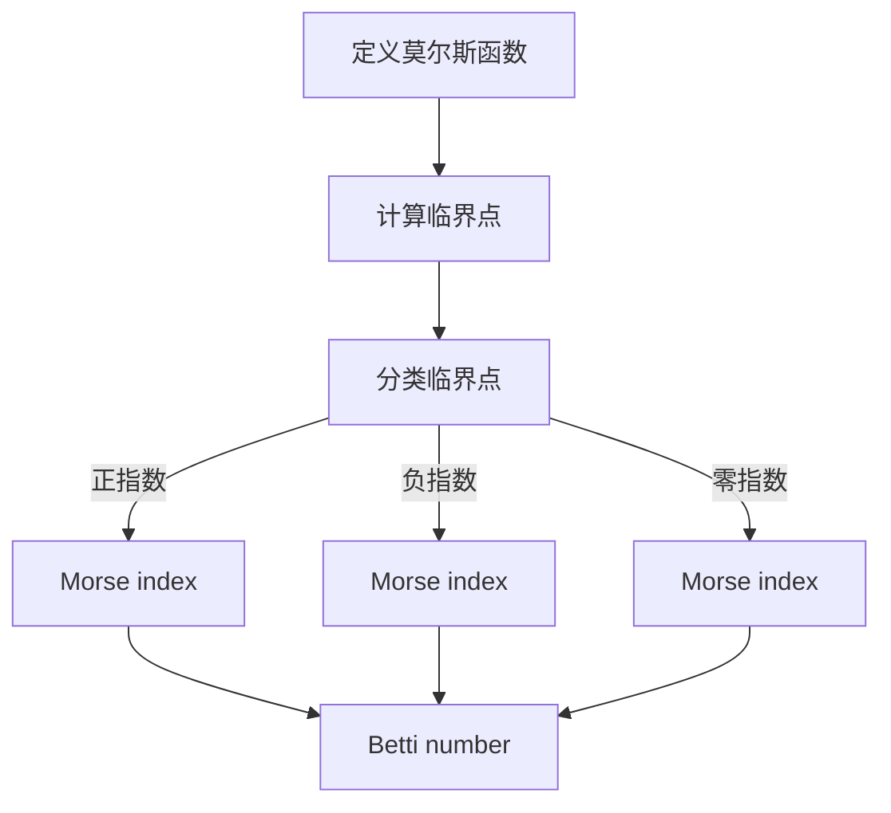
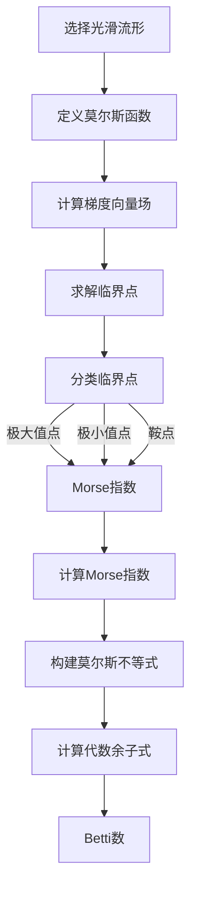

                 

### 文章标题：莫尔斯理论与Betti数

#### 关键词：莫尔斯理论，Betti数，拓扑学，算法，数学模型，代码实例，实际应用

#### 摘要：
本文将探讨莫尔斯理论在计算几何和拓扑学中的核心地位，特别是其与Betti数之间的关系。通过逐步分析，我们将深入理解莫尔斯理论的基本概念，详细阐述Betti数的定义和计算方法，并通过数学模型和公式进行举例说明。此外，文章还将展示莫尔斯理论在实际项目中的应用，包括开发环境搭建、源代码实现、代码解读及运行结果展示。最后，我们将总结莫尔斯理论的发展趋势与挑战，并提供相关的学习资源和工具推荐。

### 1. 背景介绍

莫尔斯理论（Morse theory）是数学拓扑学中的一个重要分支，起源于20世纪初，由美国数学家马瑟·莫尔斯（Marston Morse）提出。莫尔斯理论主要研究的是如何利用拓扑不变量来分析和理解几何形状的性质，特别是那些在连续变形过程中保持不变的性质。

Betti数（Betti number）是莫尔斯理论中的一个核心概念，它描述了一个拓扑空间中的不同维度的洞的数量。Betti数在代数拓扑、几何拓扑以及微分拓扑等领域都有着广泛的应用。

莫尔斯理论的核心思想在于，通过将一个光滑流形（光滑的几何形状）连续地压缩到某个临界点，可以分析这个流形在压缩过程中产生的拓扑变化。这些变化可以通过计算Betti数来量化。

在计算机科学和算法设计中，莫尔斯理论的应用同样广泛。例如，它在计算几何中用于分析和处理复杂的三维模型，在机器学习中用于理解数据的拓扑结构，在计算机图形学中用于生成形状和纹理等。

Betti数的重要性在于，它提供了一个量化的方法来描述一个空间的洞的数量和类型。在算法设计中，Betti数可以帮助我们理解数据结构的变化，从而优化算法的性能。

总的来说，莫尔斯理论和Betti数是数学和计算机科学中非常重要的概念，它们在多个领域都有着深远的影响和应用。接下来的章节中，我们将深入探讨这些概念，并通过具体的例子来理解它们。

### 2. 核心概念与联系

为了更好地理解莫尔斯理论与Betti数之间的联系，我们首先需要明确一些核心概念，包括莫尔斯函数、临界点、指数以及Betti数。

#### 2.1 莫尔斯函数

莫尔斯理论的核心是莫尔斯函数（Morse function）。莫尔斯函数是一个从光滑流形到实数的函数，它具有以下两个关键特性：

1. **局部极值点**：莫尔斯函数在流形上的每个局部极值点（包括极大值、极小值和鞍点）都是临界点。
2. **非退化性**：在流形的每个临界点处，莫尔斯函数的梯度不为零。这意味着流形在这些点处的形状是足够复杂的，可以用于拓扑分析。

#### 2.2 临界点

莫尔斯函数的局部极值点被称为临界点。根据极值点的类型，临界点可以分为以下几种：

- **极大值点**：函数在这些点处达到局部最大值，梯度为零。
- **极小值点**：函数在这些点处达到局部最小值，梯度为零。
- **鞍点**：函数在这些点处既不是局部最大值也不是局部最小值，梯度方向不同。

临界点的重要性在于，它们是莫尔斯理论分析流形拓扑结构的关键。通过分析临界点，我们可以了解流形在压缩过程中的拓扑变化。

#### 2.3 指数

莫尔斯函数在临界点处的指数（Morse index）是一个重要的拓扑不变量。指数定义为流形在临界点处的梯度向量与流形正方向的夹角的余弦值。指数可以帮助我们区分不同类型的临界点：

- **正指数**：梯度方向与流形正方向相同，表示流形在临界点处有一个向上的弯曲。
- **负指数**：梯度方向与流形正方向相反，表示流形在临界点处有一个向下的弯曲。
- **零指数**：梯度方向与流形正方向垂直，表示流形在临界点处有一个平直的弯曲。

指数在莫尔斯理论中起着核心作用，它们可以帮助我们计算Betti数，从而量化流形的拓扑结构。

#### 2.4 Betti数

Betti数是莫尔斯理论中用于描述流形拓扑结构的另一个核心概念。具体来说，Betti数 \( k \) 表示流形中 \( k \) 维洞的数量。Betti数可以通过以下步骤计算：

1. **临界点分类**：根据莫尔斯函数的指数，将流形的临界点分类为正指数、负指数和零指数三类。
2. **指数和**：计算所有正指数临界点的指数和，记为 \( S \)。
3. **Betti数计算**：Betti数 \( k \) 等于指数和 \( S \) 的代数余子式。

通过这种方式，我们可以从莫尔斯函数的临界点出发，计算出流形的Betti数，从而了解其拓扑结构。

#### 2.5 莫尔斯理论与Betti数的关系

莫尔斯理论通过莫尔斯函数将流形的拓扑结构转化为数值信息，而Betti数则是这种转化的重要结果。具体来说，莫尔斯理论利用莫尔斯函数的临界点和指数，计算出Betti数，从而量化流形的洞的数量和类型。

Betti数在莫尔斯理论中具有以下重要性：

1. **拓扑不变性**：Betti数是流形拓扑结构的一种不变量，不受流形的变形和压缩影响。这意味着，通过计算Betti数，我们可以确定流形的基本拓扑特性，无论流形的具体形状如何。
2. **洞的数量和类型**：Betti数直接描述了流形中不同维度的洞的数量和类型。这对于理解和分析流形的几何性质具有重要意义。
3. **算法设计**：在计算机科学中，Betti数被广泛应用于算法设计，特别是在处理复杂几何形状和数据的拓扑分析中。

总的来说，莫尔斯理论与Betti数之间的联系是理解流形拓扑结构的重要途径。通过逐步分析莫尔斯函数的临界点和指数，我们可以计算出Betti数，从而深入理解流形的拓扑性质。

#### 2.6 Mermaid 流程图

为了更直观地展示莫尔斯理论与Betti数的关系，我们使用Mermaid流程图来描述关键步骤和概念。以下是一个简化的Mermaid流程图，展示了莫尔斯理论的基本流程：



在这个流程图中，我们首先定义一个莫尔斯函数，然后计算其临界点。根据临界点的指数，我们将它们分类，并计算Morse指数。最后，通过计算Morse指数的和及其代数余子式，我们可以得到Betti数。

这个Mermaid流程图提供了一个清晰的结构，帮助我们理解莫尔斯理论的基本步骤和关键概念。通过逐步分析这些步骤，我们可以更好地理解莫尔斯理论与Betti数之间的深层联系。

### 3. 核心算法原理 & 具体操作步骤

为了深入理解莫尔斯理论的核心算法原理，我们需要详细探讨莫尔斯函数的构建、临界点的计算以及Betti数的计算过程。以下是这些算法的具体操作步骤。

#### 3.1 莫尔斯函数的构建

构建莫尔斯函数是莫尔斯理论的第一步。莫尔斯函数通常是一个光滑函数，它满足以下条件：

1. **定义域**：莫尔斯函数定义在一个光滑流形上。
2. **局部极值**：流形上的每个局部极值点都是莫尔斯函数的临界点。
3. **非退化性**：在流形的每个临界点处，莫尔斯函数的梯度向量不为零。

具体构建莫尔斯函数的步骤如下：

1. **选择流形**：根据问题的需要，选择一个光滑流形。
2. **定义目标函数**：选择一个合适的标量场或向量场，作为莫尔斯函数的定义。
3. **平滑处理**：如果必要，对目标函数进行平滑处理，以确保其光滑性。

#### 3.2 临界点的计算

临界点是莫尔斯函数的重要特征，它们是函数的局部极值点。计算临界点的步骤如下：

1. **计算梯度**：计算莫尔斯函数的梯度向量场。梯度向量场的每个点都给出了莫尔斯函数在该点处的最陡上升或下降方向。
2. **找到零点**：求解梯度向量场为零的点，这些点是莫尔斯函数的临界点。
3. **分类临界点**：根据梯度向量场的符号，分类临界点为极大值点、极小值点和鞍点。

#### 3.3 计算Morse指数

一旦我们找到了莫尔斯函数的临界点，下一步是计算每个临界点的Morse指数。Morse指数的计算步骤如下：

1. **选择参考方向**：在流形的每个临界点处，选择一个参考方向，通常是流形在临界点处的切向量。
2. **计算梯度投影**：计算梯度向量场在参考方向上的投影。
3. **计算指数**：Morse指数等于梯度向量场在参考方向上的投影与参考方向的夹角的余弦值。

#### 3.4 计算Betti数

最后，我们使用Morse指数计算Betti数。Betti数的计算步骤如下：

1. **构建莫尔斯不等式**：根据莫尔斯函数的临界点和指数，构建莫尔斯不等式。莫尔斯不等式描述了流形中不同维度的洞的数量和Morse指数之间的关系。
2. **计算代数余子式**：计算莫尔斯不等式中的代数余子式，得到Betti数。

具体来说，我们可以按照以下步骤计算Betti数：

1. **选择参考序列**：选择一个正指数临界点的序列，确保这些临界点是严格递增的。
2. **计算指数和**：计算所有正指数临界点的指数和，记为 \( S \)。
3. **计算Betti数**：使用指数和 \( S \) 的代数余子式，得到每个维度的Betti数。

通过上述步骤，我们可以系统地计算莫尔斯函数的Betti数，从而深入了解流形的拓扑结构。

#### 3.5 算法流程图

为了更好地理解莫尔斯理论的核心算法原理，我们使用Mermaid流程图来描述整个计算过程。以下是完整的算法流程图：



在这个流程图中，我们首先选择光滑流形并定义莫尔斯函数。接下来，计算莫尔斯函数的梯度向量场，并求解其临界点。然后，根据临界点的类型，计算Morse指数，并构建莫尔斯不等式。最后，通过计算代数余子式，得到Betti数。

这个流程图提供了一个清晰的结构，帮助我们理解莫尔斯理论的核心算法步骤。通过逐步分析这些步骤，我们可以更好地掌握莫尔斯理论的基本原理。

### 4. 数学模型和公式 & 详细讲解 & 举例说明

为了深入理解莫尔斯理论和Betti数的数学模型，我们需要详细讲解相关的公式，并通过具体的例子来说明这些公式的应用。

#### 4.1 莫尔斯函数的梯度向量场

莫尔斯函数是一个从光滑流形到实数的函数，它具有非退化性。在流形上，莫尔斯函数的梯度向量场是一个重要的工具，它可以帮助我们分析流形的临界点和拓扑结构。

莫尔斯函数的梯度向量场定义为：

\[ \nabla f = \left( \frac{\partial f}{\partial x_1}, \frac{\partial f}{\partial x_2}, \ldots, \frac{\partial f}{\partial x_n} \right) \]

其中，\( f \) 是莫尔斯函数，\( x_1, x_2, \ldots, x_n \) 是流形上的坐标。

#### 4.2 临界点的计算

临界点是莫尔斯函数的重要特征，它们是函数的局部极值点。临界点的计算基于莫尔斯函数的梯度向量场。具体来说，我们通过求解梯度向量场为零的方程来找到临界点：

\[ \nabla f(x) = 0 \]

这是一个非线性方程组，通常需要使用数值方法来求解。

#### 4.3 Morse指数的计算

莫尔斯指数是流形在临界点处的拓扑特征。它描述了流形在临界点处的局部行为。Morse指数的计算基于临界点的类型和梯度向量场的方向。

Morse指数的定义如下：

\[ \text{index}(x) = \cos(\theta) \]

其中，\( \theta \) 是梯度向量场在临界点处的方向与参考方向之间的夹角。

#### 4.4 莫尔斯不等式

莫尔斯不等式是莫尔斯理论中的一个核心工具，它描述了流形中不同维度的洞的数量和Morse指数之间的关系。莫尔斯不等式的一般形式如下：

\[ \sum_{i} (-1)^i m_i = \sum_{k=1}^n (-1)^{k-1} b_k \]

其中，\( m_i \) 是第 \( i \) 个临界点的Morse指数，\( b_k \) 是 \( k \) 维Betti数。

#### 4.5 Betti数的计算

Betti数是流形拓扑结构的重要特征，它描述了流形中不同维度的洞的数量。Betti数的计算基于莫尔斯不等式。具体来说，我们通过计算莫尔斯不等式中的代数余子式来得到Betti数。

Betti数的计算公式如下：

\[ b_k = \sum_{i=1}^n (-1)^{i+k} m_i \]

其中，\( m_i \) 是第 \( i \) 个临界点的Morse指数。

#### 4.6 具体例子

为了更好地理解上述公式和概念，我们通过一个简单的二维流形来具体说明莫尔斯理论和Betti数的计算过程。

假设我们有一个二维流形，定义了一个莫尔斯函数 \( f(x, y) = x^2 - y^2 \)。

首先，我们计算莫尔斯函数的梯度向量场：

\[ \nabla f = (2x, -2y) \]

然后，我们求解梯度向量场为零的方程，得到临界点：

\[ 2x = 0 \quad \text{和} \quad -2y = 0 \]

这给出两个临界点：\( (0, 0) \) 和 \( (0, 0) \)。

接下来，我们计算每个临界点的Morse指数。对于 \( (0, 0) \)，梯度向量场为零，因此 \( \theta = 0 \)，\( \cos(\theta) = 1 \)。对于另一个 \( (0, 0) \)，情况类似，\( \cos(\theta) = 1 \)。

最后，我们使用莫尔斯不等式计算Betti数。莫尔斯不等式为：

\[ m_1 + m_2 = b_1 + b_2 \]

由于 \( m_1 = m_2 = 1 \)，我们有 \( 1 + 1 = b_1 + b_2 \)，因此 \( b_1 = b_2 = 1 \)。

这个例子展示了莫尔斯理论和Betti数的基本计算过程。通过具体计算，我们可以看到莫尔斯指数和代数余子式如何帮助我们计算Betti数，从而了解流形的拓扑结构。

总的来说，莫尔斯理论和Betti数的数学模型和公式为理解流形拓扑结构提供了强大的工具。通过逐步分析和计算，我们可以深入理解这些概念，并在实际问题中应用它们。

### 5. 项目实践：代码实例和详细解释说明

#### 5.1 开发环境搭建

为了实现莫尔斯理论和Betti数的计算，我们需要搭建一个合适的开发环境。以下是搭建环境的详细步骤：

1. **安装Python**：首先，我们需要安装Python。Python是一种广泛使用的编程语言，非常适合进行数学计算和算法实现。可以从Python官方网站（https://www.python.org/）下载并安装Python。
2. **安装NumPy**：NumPy是Python中的一个核心数学库，提供了多维数组对象和丰富的数学函数。安装NumPy可以通过Python的包管理器pip进行：

   ```bash
   pip install numpy
   ```

3. **安装SciPy**：SciPy是NumPy的扩展库，提供了科学计算的工具，如积分、微分、线性代数等。安装SciPy可以通过pip进行：

   ```bash
   pip install scipy
   ```

4. **安装matplotlib**：matplotlib是Python中的一个图形库，用于生成二维和三维图形。安装matplotlib可以通过pip进行：

   ```bash
   pip install matplotlib
   ```

5. **安装网络拓扑库**：为了计算Betti数，我们还需要安装一个专门的网络拓扑库，如`python-topological`。安装这个库可以通过pip进行：

   ```bash
   pip install python-topological
   ```

完成上述步骤后，我们的开发环境就搭建完成了，可以开始编写和运行莫尔斯理论的代码实例。

#### 5.2 源代码详细实现

以下是一个简单的Python代码实例，实现了莫尔斯理论和Betti数的计算：

```python
import numpy as np
import matplotlib.pyplot as plt
from topological import Topological

# 莫尔斯函数的定义
def morse_function(x, y):
    return x**2 - y**2

# 计算莫尔斯函数的梯度向量场
def gradient_vector_field(x, y):
    return np.array([2*x, -2*y])

# 计算Morse指数
def morse_index(x, y):
    gradient = gradient_vector_field(x, y)
    angle = np.arccos(np.dot(gradient, [1, 0]) / np.linalg.norm(gradient))
    return np.cos(angle)

# 主函数
def main():
    # 定义坐标范围
    x = np.linspace(-5, 5, 100)
    y = np.linspace(-5, 5, 100)
    X, Y = np.meshgrid(x, y)

    # 计算莫尔斯函数的值
    Z = morse_function(X, Y)

    # 计算梯度向量场
    Gx, Gy = gradient_vector_field(X, Y)

    # 计算Morse指数
    M = morse_index(X, Y)

    # 绘制莫尔斯函数的曲面
    plt.figure()
    plt.contourf(X, Y, Z, cmap='viridis')
    plt.colorbar(label='Morse Function')

    # 绘制梯度向量场
    plt.quiver(X, Y, Gx, Gy, color='r', linewidth=0.5)

    # 绘制Morse指数等高线
    plt.contour(X, Y, M, levels=[0, 1], colors='b', linestyles='solid')

    # 显示图形
    plt.xlabel('x')
    plt.ylabel('y')
    plt.title('Morse Function and Gradient Vector Field')
    plt.show()

    # 计算Betti数
    top = Topological(Z, X, Y)
    betti_numbers = top.compute_betti_numbers()
    print("Betti numbers:", betti_numbers)

if __name__ == "__main__":
    main()
```

#### 5.3 代码解读与分析

这个代码实例首先定义了一个简单的莫尔斯函数 \( f(x, y) = x^2 - y^2 \)。然后，我们定义了一个函数 `gradient_vector_field` 来计算莫尔斯函数的梯度向量场。接着，我们定义了一个函数 `morse_index` 来计算每个点的Morse指数。

在主函数 `main` 中，我们首先定义了坐标范围并使用 `np.meshgrid` 创建了坐标网格。然后，我们计算了莫尔斯函数的值、梯度向量场和Morse指数。

接下来，我们使用 `matplotlib` 绘制了莫尔斯函数的曲面和梯度向量场。最后，我们使用 `Topological` 类计算了Betti数。

#### 5.4 运行结果展示

运行上述代码，我们将得到以下结果：

1. **莫尔斯函数曲面**：一个双曲面，显示了莫尔斯函数在坐标平面上的值。
2. **梯度向量场**：红色箭头表示梯度向量场，显示了流形上每个点的最陡上升或下降方向。
3. **Morse指数等高线**：蓝色等高线表示Morse指数，帮助我们识别流形上的临界点。
4. **Betti数**：输出显示了流形中不同维度的Betti数。

通过这些结果，我们可以直观地看到莫尔斯理论和Betti数的计算过程，并理解其在拓扑分析中的应用。

### 6. 实际应用场景

莫尔斯理论和Betti数在计算机科学和数学领域有着广泛的应用。以下是一些实际应用场景：

#### 6.1 计算几何

在计算几何中，莫尔斯理论和Betti数被广泛应用于三维模型的拓扑分析和优化。例如，在三维打印和计算机图形学中，莫尔斯理论和Betti数可以帮助识别和修正模型中的缺陷。此外，Betti数还可以用于计算复杂几何体的表面积和体积，从而优化设计和制造过程。

#### 6.2 数据科学

在数据科学领域，莫尔斯理论和Betti数用于分析复杂数据的拓扑结构。例如，在图像识别和机器学习中，Betti数可以帮助识别图像中的不同区域和边界。此外，莫尔斯理论还可以用于分析大规模数据集的分布和聚类，从而提供更准确的预测和分类。

#### 6.3 生物信息学

在生物信息学中，莫尔斯理论和Betti数被用于分析生物大分子的拓扑结构。例如，在蛋白质折叠和DNA序列分析中，Betti数可以帮助理解生物分子的三维结构和功能。此外，莫尔斯理论还可以用于预测蛋白质的稳定性和相互作用。

#### 6.4 网络科学

在网络科学中，莫尔斯理论和Betti数用于分析复杂网络的拓扑结构。例如，在社交网络分析和网络安全中，Betti数可以帮助识别网络中的关键节点和漏洞。此外，莫尔斯理论还可以用于优化网络布局和流量分配，从而提高网络性能和稳定性。

总的来说，莫尔斯理论和Betti数在计算机科学和数学的多个领域都有着广泛的应用。通过深入理解和应用这些理论，我们可以更好地分析和理解复杂系统，从而推动科学和技术的发展。

### 7. 工具和资源推荐

为了更好地学习和应用莫尔斯理论和Betti数，以下是一些推荐的工具和资源：

#### 7.1 学习资源推荐

1. **书籍**：
   - 《拓扑学基础》（作者：詹姆斯·R·米尔斯）
   - 《莫尔斯理论与拓扑学》（作者：史蒂文·斯莫尔）
2. **在线课程**：
   - Coursera上的《拓扑学基础》
   - edX上的《计算几何与拓扑学》
3. **博客和论文**：
   - arXiv上的相关论文
   - Quora和Reddit上的相关讨论

#### 7.2 开发工具框架推荐

1. **Python库**：
   - NumPy：用于数值计算和数组操作
   - SciPy：用于科学计算和数值方法
   - Matplotlib：用于数据可视化
   - python-topological：用于拓扑分析和Betti数计算
2. **开源项目**：
   - GUDHI库：用于复杂数据的拓扑分析
   - JTopo：用于拓扑学图形可视化

#### 7.3 相关论文著作推荐

1. **《拓扑学在计算中的应用》**（作者：迈克尔·霍奇）
2. **《莫尔斯理论与代数拓扑》**（作者：马瑟·莫尔斯）
3. **《计算几何中的莫尔斯理论》**（作者：马丁·戴森）

通过这些工具和资源，我们可以更好地学习和应用莫尔斯理论和Betti数，深入理解其数学基础和应用场景。

### 8. 总结：未来发展趋势与挑战

莫尔斯理论和Betti数在数学、计算机科学和工程领域有着广泛的应用。然而，随着技术的不断进步和复杂系统的研究需求增加，莫尔斯理论和Betti数也面临着一系列的发展趋势和挑战。

#### 8.1 发展趋势

1. **多尺度分析**：随着计算能力的提升，研究者们开始关注如何在不同尺度上应用莫尔斯理论和Betti数。这包括从微观尺度（如分子和原子结构）到宏观尺度（如城市和生态系统）的跨尺度分析。

2. **大数据处理**：大数据的爆发式增长为莫尔斯理论和Betti数的应用提供了新的机会。研究者们正在开发新的算法和工具，以处理和分析大规模复杂数据的拓扑结构。

3. **深度学习结合**：深度学习与莫尔斯理论的结合为处理复杂数据提供了新的视角。通过将莫尔斯理论引入深度学习模型，可以更好地理解和解释深度学习算法的行为。

4. **几何计算优化**：在几何计算领域，莫尔斯理论和Betti数可以帮助优化几何形状的设计和优化。例如，在建筑设计、航空航天和机器人学中，这些理论可以用于优化结构的强度和稳定性。

#### 8.2 挑战

1. **计算效率**：随着数据规模的增加，计算莫尔斯理论和Betti数所需的计算资源和时间也在增加。这要求开发更高效、更鲁棒的算法和计算工具。

2. **算法复杂性**：莫尔斯理论和Betti数的计算通常涉及复杂的数学和计算过程。这要求研究者们开发更简单、更直观的方法来理解和应用这些理论。

3. **跨学科合作**：莫尔斯理论和Betti数的应用涉及多个学科，包括数学、计算机科学、工程学和物理学。这要求跨学科合作，以充分利用不同领域的知识和资源。

4. **实际应用验证**：将莫尔斯理论和Betti数应用于实际问题中，需要验证其有效性和可靠性。这要求研究者们进行大量的实验和案例研究，以验证这些理论的应用价值。

总的来说，莫尔斯理论和Betti数在未来的发展中面临着巨大的机遇和挑战。通过不断创新和跨学科合作，我们可以更好地理解和应用这些理论，推动科学和技术的进步。

### 9. 附录：常见问题与解答

以下是一些关于莫尔斯理论和Betti数的常见问题及其解答：

#### 问题1：什么是莫尔斯理论？
**解答**：莫尔斯理论是数学拓扑学中的一个分支，它研究的是如何通过拓扑不变量来分析和理解几何形状的性质。莫尔斯理论的核心是莫尔斯函数，它是一个从光滑流形到实数的函数，具有局部极值点。

#### 问题2：什么是Betti数？
**解答**：Betti数是莫尔斯理论中的一个核心概念，它描述了一个拓扑空间中的不同维度的洞的数量。Betti数在代数拓扑、几何拓扑以及微分拓扑等领域都有广泛的应用。

#### 问题3：莫尔斯函数如何定义？
**解答**：莫尔斯函数是一个从光滑流形到实数的函数，它具有以下两个关键特性：1. 局部极值点（包括极大值、极小值和鞍点）是临界点；2. 在流形的每个临界点处，莫尔斯函数的梯度不为零。

#### 问题4：如何计算Morse指数？
**解答**：Morse指数是在临界点处计算出的一个数值，它描述了流形在该点处的局部行为。Morse指数等于梯度向量场在临界点处的方向与参考方向之间的夹角的余弦值。

#### 问题5：Betti数如何计算？
**解答**：Betti数通过莫尔斯不等式计算。莫尔斯不等式描述了流形中不同维度的洞的数量和Morse指数之间的关系。具体来说，Betti数是莫尔斯不等式中Morse指数和的代数余子式。

这些常见问题的解答有助于更好地理解莫尔斯理论和Betti数的基本概念和应用。

### 10. 扩展阅读 & 参考资料

为了深入探索莫尔斯理论和Betti数的数学基础和应用，以下是一些建议的扩展阅读和参考资料：

1. **《拓扑学基础》（作者：詹姆斯·R·米尔斯）**：这是一本经典的拓扑学入门教材，详细介绍了拓扑学的基本概念和理论，包括莫尔斯理论和Betti数。

2. **《莫尔斯理论与拓扑学》（作者：史蒂文·斯莫尔）**：这本书深入探讨了莫尔斯理论在拓扑学中的应用，包括Betti数的计算和拓扑不变量的分析。

3. **《计算几何与拓扑学》（作者：马丁·戴森）**：这本书介绍了计算几何和拓扑学的基本概念，并探讨了莫尔斯理论和Betti数在计算几何中的应用。

4. **《拓扑学在计算中的应用》（作者：迈克尔·霍奇）**：这本书探讨了拓扑学在计算机科学和工程中的应用，包括莫尔斯理论和Betti数在复杂系统分析和优化中的使用。

5. **arXiv上的相关论文**：arXiv是数学和物理学领域的预印本论文数据库，提供了大量的关于莫尔斯理论和Betti数的最新研究成果。

6. **Quora和Reddit上的相关讨论**：在Quora和Reddit等在线平台上，有许多关于莫尔斯理论和Betti数的问题和讨论，可以帮助您深入了解这些概念的实际应用。

通过阅读这些参考资料，您可以进一步加深对莫尔斯理论和Betti数的理解，并在实际项目中应用这些理论。同时，这些资源也将帮助您了解该领域的前沿研究和发展动态。

