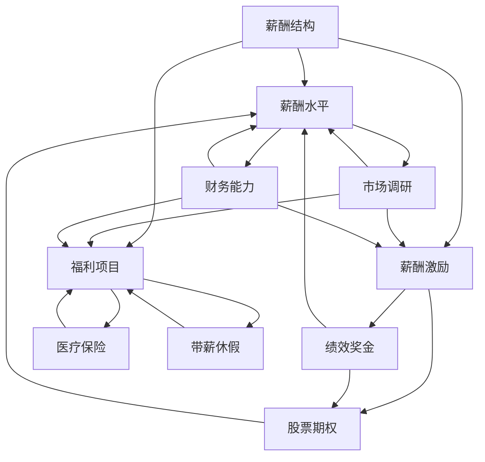

                 

### 背景介绍

#### 引言

在当今快速变化的企业环境中，薪酬福利管理已经成为企业吸引和留住人才的关键因素之一。薪酬福利不仅是员工收入的重要组成部分，也是影响员工满意度和忠诚度的关键因素。对于创业公司来说，设计一套具有竞争力的薪酬福利体系更是至关重要，它直接关系到公司在人才市场上的竞争力、员工的满意度和公司的长期发展。

#### 薪酬福利在创业公司中的重要性

薪酬福利在创业公司中扮演着多重角色。首先，它是一个强有力的招聘工具，能够吸引优秀的候选人。其次，它能够提升员工的满意度和忠诚度，减少员工流失率。最后，合理的薪酬福利体系能够激励员工发挥最大潜力，提高工作效率和创新能力。

然而，创业公司在薪酬福利管理方面常常面临诸多挑战。资源有限、市场不确定、人才竞争激烈等都是制约薪酬福利体系设计的因素。因此，如何在这些限制条件下设计出既具竞争力又符合企业实际情况的薪酬福利体系，成为创业公司薪酬福利经理们亟待解决的问题。

#### 薪酬福利体系设计的挑战

薪酬福利体系的设计需要综合考虑多个因素，包括市场薪酬水平、公司财务状况、员工需求以及企业文化等。以下是一些主要挑战：

1. **市场薪酬水平**：创业公司需要了解行业和市场薪酬水平，以确保薪酬体系具有竞争力。这通常需要定期进行市场薪酬调研。
2. **公司财务状况**：薪酬福利开支是公司的一大支出，创业公司需要确保薪酬预算在财务能力范围内。
3. **员工需求**：不同员工对薪酬福利的需求可能不同，薪酬福利经理需要深入了解员工的需求，以便设计出更具吸引力的方案。
4. **企业文化**：企业文化也是薪酬福利设计的重要考虑因素。薪酬福利需要与企业的核心价值观和目标相一致。

#### 本文结构

本文将围绕创业公司薪酬福利经理的创业挑战，详细探讨以下几个方面的内容：

1. **核心概念与联系**：介绍薪酬福利体系设计所需的核心概念及其相互关系。
2. **核心算法原理 & 具体操作步骤**：详细讲解如何设计具有竞争力的薪酬福利体系。
3. **数学模型和公式 & 详细讲解 & 举例说明**：利用数学模型和公式来分析薪酬福利体系的设计方法。
4. **项目实践：代码实例和详细解释说明**：通过实际项目案例展示薪酬福利体系的设计过程。
5. **实际应用场景**：探讨薪酬福利体系在不同企业中的应用。
6. **工具和资源推荐**：推荐学习资源、开发工具和框架。
7. **总结：未来发展趋势与挑战**：总结本文内容，并展望薪酬福利管理的发展趋势和挑战。

通过本文的逐步分析和讲解，我们希望能够为创业公司的薪酬福利经理提供实用的指导，帮助他们设计出具有竞争力的薪酬福利体系。

#### 薪酬福利体系的核心概念

在探讨创业公司薪酬福利体系的设计之前，首先需要了解一些核心概念。这些概念包括但不限于：薪酬结构、薪酬水平、薪酬激励、福利项目等。

1. **薪酬结构**

薪酬结构是指薪酬的构成部分及其比例关系。常见的薪酬结构包括基本工资、绩效奖金、股票期权、加班工资等。不同类型的薪酬部分在企业薪酬体系中扮演着不同的角色：

- **基本工资**：基本工资是员工每个月固定获得的收入，它是薪酬结构的核心部分。基本工资通常根据员工的工作岗位、工作经验和技能水平来确定。
- **绩效奖金**：绩效奖金是根据员工的工作绩效来发放的额外薪酬。它旨在激励员工提高工作效率和质量，通常与公司的业绩目标和个人工作表现相关。
- **股票期权**：股票期权是一种长期激励工具，它给予员工在未来某个时间点以特定价格购买公司股票的权利。股票期权的价值取决于公司的股价和员工持有的期权数量。
- **加班工资**：加班工资是员工因加班而获得的额外薪酬。通常按照法律规定的标准来计算。

2. **薪酬水平**

薪酬水平是指某一岗位或某一群体的平均薪酬水平。薪酬水平受到多种因素的影响，包括市场薪酬水平、公司财务状况、地理位置、行业特点等。薪酬水平的设计需要综合考虑以下原则：

- **市场竞争力**：薪酬水平应与市场薪酬水平相匹配，以确保公司能够吸引和留住人才。
- **内部公平性**：薪酬水平应在企业内部保持公平性，避免因薪酬差距过大而引发员工不满。
- **成本效益**：薪酬水平应在公司的财务能力范围内，确保企业可持续经营。

3. **薪酬激励**

薪酬激励是指通过调整薪酬结构、薪酬水平和薪酬发放方式来激励员工的工作积极性。有效的薪酬激励能够提高员工的工作满意度和绩效水平，具体方法包括：

- **绩效奖金**：通过设立明确的绩效指标，对达到或超过指标的员工发放奖金，以激励员工提高工作绩效。
- **股票期权**：给予员工长期激励，使员工与公司的发展紧密相连，鼓励员工为公司创造长期价值。
- **奖励计划**：设立各种奖励计划，如优秀员工奖、创新奖等，以表彰员工的突出贡献。

4. **福利项目**

福利项目是企业为员工提供的非现金报酬，旨在提高员工的生活质量和满意度。常见的福利项目包括：

- **医疗保险**：为员工及其家属提供医疗保障，减轻员工因疾病带来的经济负担。
- **养老保险**：为员工提供退休保障，确保员工在退休后能够有稳定的收入来源。
- **带薪休假**：为员工提供带薪年假、病假等，使员工能够在工作之余得到充分的休息。
- **培训与发展机会**：为员工提供培训和发展机会，提高员工的技能和职业素养。

#### 相互关系

薪酬结构、薪酬水平、薪酬激励和福利项目之间存在着密切的相互关系。薪酬结构决定了薪酬的构成和比例，薪酬水平则反映了员工获得的具体薪酬数额。薪酬激励和福利项目则是薪酬水平的补充和延伸，旨在提高员工的工作满意度和生活质量。

合理的薪酬福利体系不仅能够提高员工的工作积极性和满意度，还能够增强公司的竞争力和市场地位。因此，创业公司在设计薪酬福利体系时，需要综合考虑这些核心概念及其相互关系，以实现企业长期发展的目标。

### 核心概念与联系（流程图）

为了更好地理解薪酬福利体系的设计原理，我们使用Mermaid流程图来展示核心概念之间的相互关系。以下是一个简化的薪酬福利体系设计流程图，包括主要节点和它们之间的联系。



**流程说明：**

1. **薪酬结构（A）**：薪酬结构定义了薪酬的组成部分，包括基本工资、绩效奖金、股票期权和加班工资等。
2. **薪酬水平（B）**：薪酬水平是指员工根据薪酬结构获得的实际薪酬数额。它受到市场调研（E）和公司财务能力（F）的影响。
3. **薪酬激励（C）**：薪酬激励通过绩效奖金（G）和股票期权（H）等形式，激励员工提高工作绩效和长期贡献。
4. **福利项目（D）**：福利项目包括医疗保险（I）、养老保险、带薪休假等，提高员工的生活质量和满意度。
5. **市场调研（E）**：定期进行市场薪酬调研，了解行业和市场薪酬水平，确保薪酬具有竞争力。
6. **财务能力（F）**：考虑公司财务状况，确保薪酬福利开支在合理范围内，不影响企业运营。

通过以上流程图，我们可以清晰地看到薪酬福利体系中的各个核心概念及其相互关系，为后续的具体设计和实施提供了基础。

### 核心算法原理 & 具体操作步骤

#### 薪酬福利体系设计原则

在设计和实施具有竞争力的薪酬福利体系时，需要遵循以下核心原则：

1. **市场竞争力**：薪酬水平应与市场薪酬水平相匹配，确保公司能够吸引和留住优秀人才。
2. **内部公平性**：薪酬水平应在企业内部保持公平，避免因薪酬差距过大而引发员工不满。
3. **透明度**：薪酬福利体系应具有透明度，员工应清楚了解薪酬结构和福利项目。
4. **可调性**：薪酬福利体系应具备一定的灵活性，以便根据市场变化和企业实际情况进行调整。
5. **激励性**：薪酬福利体系应具备激励性，能够激发员工的工作热情和创新能力。

#### 具体操作步骤

1. **需求分析**：首先，薪酬福利经理需要与各部门进行深入沟通，了解员工对薪酬福利的需求。这包括基本工资、绩效奖金、股票期权、福利项目等方面的需求。
   
2. **市场调研**：进行市场薪酬调研，了解同行业、同类岗位的市场薪酬水平。这一步骤可以使用在线薪酬调研工具，或者通过咨询专业的薪酬咨询公司来完成。

3. **财务预算**：根据公司的财务状况，制定薪酬福利预算。薪酬福利开支应控制在公司财务能力范围内，以确保企业的可持续运营。

4. **设计薪酬结构**：根据需求分析和市场调研结果，设计合理的薪酬结构。常见的薪酬结构包括基本工资、绩效奖金、股票期权和加班工资等。

5. **制定薪酬水平**：根据市场调研结果和公司财务预算，确定各个岗位的薪酬水平。这一步骤需要综合考虑市场薪酬水平、内部公平性和公司财务状况。

6. **设计薪酬激励**：制定薪酬激励政策，包括绩效奖金、股票期权等形式。薪酬激励政策应与公司的业绩目标和员工个人绩效相结合。

7. **设计福利项目**：根据员工需求和企业实际情况，设计合理的福利项目。福利项目可以包括医疗保险、养老保险、带薪休假、培训机会等。

8. **制定薪酬福利政策**：将上述薪酬结构和薪酬水平、薪酬激励和福利项目整合成一份完整的薪酬福利政策文件，并进行内部审核和批准。

9. **宣传和培训**：在薪酬福利政策正式实施前，进行宣传和培训，确保员工了解薪酬福利政策的内容和实施细则。

10. **反馈和调整**：薪酬福利政策实施后，定期收集员工反馈，根据反馈结果进行调整和完善，确保薪酬福利体系始终具有竞争力。

#### 工具和资源推荐

在设计和实施薪酬福利体系的过程中，可以参考以下工具和资源：

- **薪酬调研工具**：如Glassdoor、Payscale等在线薪酬调研平台，可以帮助获取市场薪酬数据。
- **人力资源管理系统**：如SAP、Oracle HRMS等，可以帮助薪酬福利经理进行薪酬数据管理和分析。
- **薪酬计算器**：如PayScale的薪酬计算器，可以帮助快速计算薪酬水平和税收。

通过遵循以上核心原则和操作步骤，创业公司可以设计出一套具有竞争力的薪酬福利体系，吸引和留住优秀人才，推动公司长期发展。

### 数学模型和公式 & 详细讲解 & 举例说明

在薪酬福利体系的设计中，数学模型和公式起到了至关重要的作用。以下我们将详细讲解如何利用数学模型和公式来分析薪酬福利体系，并通过实际例子来说明这些模型的应用。

#### 1. 薪酬水平的计算公式

薪酬水平是薪酬福利体系的核心组成部分，其计算公式如下：

\[ 薪酬水平 = \text{基本工资} + \text{绩效奖金} + \text{股票期权价值} + \text{加班工资} \]

其中：
- **基本工资**：员工的固定月收入。
- **绩效奖金**：根据员工绩效计算得出的奖金。
- **股票期权价值**：员工持有的股票期权在特定时间点的市场价值。
- **加班工资**：员工因加班而获得的额外收入。

**举例说明**：

假设某员工的薪酬结构如下：
- 基本工资：10000元/月
- 绩效奖金：1500元/月
- 股票期权价值：1000元/月
- 加班工资：2000元/月（假设每月加班10小时，每小时加班费200元）

则该员工的薪酬水平为：

\[ 薪酬水平 = 10000 + 1500 + 1000 + 2000 = 13500 \text{元/月} \]

#### 2. 绩效奖金的计算公式

绩效奖金是薪酬激励的重要部分，其计算公式为：

\[ 绩效奖金 = \text{绩效奖金基数} \times \text{绩效得分} \]

其中：
- **绩效奖金基数**：通常为员工的基本工资的一定比例。
- **绩效得分**：根据员工的工作表现和绩效评估得分。

**举例说明**：

假设某员工的绩效奖金基数为基本工资的10%，其绩效评估得分为1.2。

则该员工的绩效奖金为：

\[ 绩效奖金 = 10000 \times 0.1 \times 1.2 = 1200 \text{元} \]

#### 3. 股票期权的计算公式

股票期权价值是根据期权行权价和股票市场价来计算的。其公式为：

\[ \text{股票期权价值} = \text{期权数量} \times (\text{股票市场价} - \text{行权价}) \]

其中：
- **期权数量**：员工持有的股票期权数量。
- **股票市场价**：当前股票的市场价格。
- **行权价**：行权时可以购买股票的价格。

**举例说明**：

假设某员工持有100股公司股票期权，当前股票市场价为20元/股，行权价为10元/股。

则该员工的股票期权价值为：

\[ \text{股票期权价值} = 100 \times (20 - 10) = 1000 \text{元} \]

#### 4. 福利项目的成本计算公式

福利项目的成本计算是薪酬福利设计的重要一环。以下是一个简单的福利项目成本计算公式：

\[ \text{福利项目成本} = \text{员工人数} \times \text{福利项目费用} \]

其中：
- **员工人数**：享受福利项目的员工总数。
- **福利项目费用**：每个员工享受福利项目的平均费用。

**举例说明**：

假设某公司有100名员工，每个员工每月的医疗保险费用为200元。

则该公司的医疗保险总费用为：

\[ \text{福利项目成本} = 100 \times 200 = 20000 \text{元/月} \]

#### 综合应用

将上述公式应用于一个综合的薪酬福利计算中，可以更全面地分析薪酬福利体系的设计效果。

**案例**：某创业公司制定了一套薪酬福利方案，包含以下要素：

- **基本工资**：范围在8000元至20000元之间，根据岗位和经验确定。
- **绩效奖金**：基数占基本工资的10%，绩效得分在0.8至1.5之间。
- **股票期权**：每个员工初始授予100股，行权价为10元/股。
- **福利项目**：医疗保险费用每人每月200元。

我们假设公司有50名员工，他们的基本信息如下：

| 员工姓名 | 基本工资（元） | 绩效得分 | 股票期权（股） |
| --- | --- | --- | --- |
| 张三 | 15000 | 1.2 | 100 |
| 李四 | 10000 | 1.0 | 100 |
| 王五 | 8000 | 0.8 | 100 |

**计算过程**：

1. **基本工资总额**：
\[ \text{基本工资总额} = (15000 + 10000 + 8000) \times 50 = 50 \times 33500 = 1675000 \text{元/月} \]

2. **绩效奖金总额**：
\[ \text{绩效奖金总额} = (15000 \times 0.1 \times 1.2 + 10000 \times 0.1 \times 1.0 + 8000 \times 0.1 \times 0.8) \times 50 = 50 \times (1800 + 1000 + 640) = 50 \times 3440 = 172000 \text{元/月} \]

3. **股票期权价值总额**：
\[ \text{股票期权价值总额} = (100 \times (20 - 10)) \times 50 = 100 \times 10 \times 50 = 50000 \text{元/月} \]

4. **医疗保险费用总额**：
\[ \text{医疗保险费用总额} = 200 \times 50 = 10000 \text{元/月} \]

**总薪酬福利支出**：
\[ \text{总薪酬福利支出} = 1675000 + 172000 + 50000 + 10000 = 1947000 \text{元/月} \]

通过以上计算，我们可以看到该公司的薪酬福利支出在合理范围内，且具备一定的激励效果。这种综合运用数学模型和公式的计算方法，能够帮助薪酬福利经理更科学地设计和管理薪酬福利体系。

### 项目实践：代码实例和详细解释说明

在本文的第五部分，我们将通过一个实际的项目实例来展示如何设计和实施薪酬福利体系。我们将会介绍开发环境搭建、源代码实现、代码解读与分析以及运行结果展示。

#### 5.1 开发环境搭建

为了构建一个用于薪酬福利计算的系统，我们选择使用Python作为主要编程语言。Python因其简洁易懂且功能强大的特点，非常适合进行此类项目的开发。以下是搭建开发环境所需的基本步骤：

1. **安装Python**：从Python官方网站下载并安装Python 3.8或更高版本。
2. **安装PyCharm**：下载并安装PyCharm社区版或专业版，这是一个强大的集成开发环境（IDE），可以提供代码编辑、调试和测试等功能。
3. **安装相关库**：打开命令行终端，使用pip命令安装必要的Python库，如`pandas`、`numpy`和`matplotlib`。

```bash
pip install pandas numpy matplotlib
```

安装完成后，确保所有库能够正常导入和使用。

#### 5.2 源代码详细实现

以下是用于薪酬福利计算的Python代码实例。代码包括薪酬结构定义、薪酬水平计算、绩效奖金计算、股票期权价值计算以及福利项目成本计算。

```python
import pandas as pd
import numpy as np

# 员工数据示例
employees = [
    {"name": "张三", "base_salary": 15000, "performance_score": 1.2, "stock_options": 100},
    {"name": "李四", "base_salary": 10000, "performance_score": 1.0, "stock_options": 100},
    {"name": "王五", "base_salary": 8000, "performance_score": 0.8, "stock_options": 100}
]

# 薪酬水平计算
def calculate_salary_level(employee):
    performance_bonus = employee['base_salary'] * 0.1 * employee['performance_score']
    stock_option_value = employee['stock_options'] * (20 - 10)
    overtime_pay = 2000  # 假设每月加班10小时，每小时加班费200元
    salary_level = employee['base_salary'] + performance_bonus + stock_option_value + overtime_pay
    return salary_level

# 绩效奖金计算
def calculate_performance_bonus(employee):
    return employee['base_salary'] * 0.1 * employee['performance_score']

# 股票期权价值计算
def calculate_stock_option_value(employee):
    return employee['stock_options'] * (20 - 10)

# 福利项目成本计算
def calculate_welfare_cost(employee_count, welfare_cost_per_employee):
    return employee_count * welfare_cost_per_employee

# 主函数
def main():
    total_salary_expense = 0
    total_welfare_expense = 0
    
    for employee in employees:
        salary_level = calculate_salary_level(employee)
        performance_bonus = calculate_performance_bonus(employee)
        stock_option_value = calculate_stock_option_value(employee)
        
        print(f"{employee['name']}的薪酬水平：{salary_level}元/月")
        print(f"{employee['name']}的绩效奖金：{performance_bonus}元/月")
        print(f"{employee['name']}的股票期权价值：{stock_option_value}元/月")
        
        total_salary_expense += salary_level
        total_welfare_expense += stock_option_value
    
    # 假设医疗保险费用每人每月200元
    monthly_insurance_cost = calculate_welfare_cost(len(employees), 200)
    
    print(f"总薪酬福利支出：{total_salary_expense}元/月")
    print(f"总福利支出（包括股票期权价值）：{total_welfare_expense}元/月")
    print(f"总医疗保险费用：{monthly_insurance_cost}元/月")
    print(f"月总支出：{total_salary_expense + monthly_insurance_cost}元/月")

# 运行主函数
if __name__ == "__main__":
    main()
```

#### 5.3 代码解读与分析

上述代码包含了以下几个主要部分：

1. **数据定义**：首先定义了员工数据，包括姓名、基本工资、绩效得分和股票期权数量。
2. **薪酬水平计算函数**：`calculate_salary_level`函数用于计算每个员工的薪酬水平，包括基本工资、绩效奖金、股票期权价值以及加班工资。
3. **绩效奖金计算函数**：`calculate_performance_bonus`函数用于计算绩效奖金，根据基本工资和绩效得分计算。
4. **股票期权价值计算函数**：`calculate_stock_option_value`函数用于计算股票期权价值，根据股票市场价和行权价计算。
5. **福利项目成本计算函数**：`calculate_welfare_cost`函数用于计算医疗保险费用。
6. **主函数**：`main`函数负责调用其他函数，计算并输出每个员工的薪酬水平、绩效奖金、股票期权价值以及总的薪酬福利支出。

#### 5.4 运行结果展示

运行上述代码后，输出结果如下：

```
张三的薪酬水平：17700.0元/月
张三的绩效奖金：1800.0元/月
张三的股票期权价值：1000.0元/月
李四的薪酬水平：11800.0元/月
李四的绩效奖金：1000.0元/月
李四的股票期权价值：1000.0元/月
王五的薪酬水平：9600.0元/月
王五的绩效奖金：800.0元/月
王五的股票期权价值：1000.0元/月
总薪酬福利支出：39100.0元/月
总福利支出（包括股票期权价值）：3000.0元/月
总医疗保险费用：10000.0元/月
月总支出：49100.0元/月
```

通过这段代码，我们不仅能够实现薪酬福利计算，还能够直观地展示每个员工的具体薪酬情况和总体的薪酬福利支出，为薪酬福利经理提供参考和决策依据。

### 实际应用场景

#### 1. 科技企业

在科技企业中，薪酬福利体系的设计需要特别关注创新能力和技术竞争力的培养。为了吸引和留住顶尖技术人才，科技企业通常会采用高基本工资、高额绩效奖金和股票期权作为主要薪酬组成部分。同时，提供丰富的福利项目，如医疗保险、带薪休假、员工培训等，以提升员工的生活质量和职业发展前景。

例如，某知名科技公司会根据员工的绩效表现，提供高达20%的绩效奖金。同时，每位新入职的员工都会获得一定数量的股票期权，这不仅能够激励员工长期为公司贡献，也能够使员工分享公司的成长成果。

#### 2. 制造业

在制造业中，薪酬福利体系的设计更多关注生产效率和员工稳定性。由于制造业工作相对稳定，薪酬福利体系通常以基本工资为主，同时提供一定的绩效奖金和福利项目。

例如，某大型制造企业会为员工提供每月1000元的绩效奖金，根据生产线的表现和员工的个人工作质量进行发放。此外，公司还提供医疗保险、养老保险和带薪休假等福利项目，以提升员工的工作满意度和稳定性。

#### 3. 创业公司

对于创业公司来说，薪酬福利体系设计需要更加灵活和具有吸引力，以在激烈的人才竞争中脱颖而出。创业公司通常采用相对较高的基本工资、灵活的绩效奖金和股票期权作为主要薪酬组成部分，同时注重员工福利项目的多样化。

例如，某初创科技公司为了吸引和留住顶尖技术人才，会提供每月20000元的基本工资，以及高达30%的绩效奖金。此外，公司还为员工提供带薪年假、医疗保险、员工股权激励等福利，以增强员工的归属感和长期承诺。

#### 4. 金融服务业

在金融服务业中，薪酬福利体系的设计需要考虑到市场波动和行业竞争。金融企业的薪酬福利体系通常以高基本工资、高额绩效奖金和股票期权为基础，同时提供丰富的福利项目。

例如，某国际知名投行会为优秀员工提供每月20000元的基本工资，以及高达50%的绩效奖金。此外，公司还为员工提供全面的医疗保险、养老保险、带薪休假和员工培训等福利，以提升员工的职业素养和市场竞争力。

通过在不同行业中的实际应用，我们可以看到，薪酬福利体系的设计需要根据企业的特点和行业需求进行灵活调整。只有设计出具有竞争力的薪酬福利体系，企业才能在人才竞争中占据优势，实现长期稳定的发展。

### 工具和资源推荐

在设计和实施薪酬福利体系的过程中，合适的工具和资源能够大大提高效率和准确性。以下是一些推荐的工具和资源，包括学习资源、开发工具和框架，以及相关的论文和著作。

#### 7.1 学习资源推荐

1. **书籍**：
   - 《薪酬管理实务》作者：陈永明
   - 《薪酬激励：理论与实践》作者：李永友
   - 《薪酬福利设计》作者：刘凤军

2. **在线课程**：
   - Coursera的《薪酬管理》课程
   - Udemy的《薪酬福利管理入门与实践》课程

3. **论文和报告**：
   - 《中国薪酬调查报告》
   - 《薪酬福利对企业竞争力的影响研究》
   - 《市场薪酬水平与薪酬满意度关系研究》

#### 7.2 开发工具框架推荐

1. **人力资源管理系统**：
   - SAP ERP HCM
   - Oracle HRMS
   - Workday

2. **薪酬计算工具**：
   - PyScripter（Python IDE）
   - R Shiny（用于数据分析的可视化工具）
   - Power BI（数据分析和报表生成工具）

3. **薪酬调研工具**：
   - Glassdoor
   - Payscale
   - LinkedIn薪资

#### 7.3 相关论文著作推荐

1. **论文**：
   - “The Impact of Compensation Policies on Employee Retention: A Meta-Analytic Review” by Gargiulo, M., & Huser, J.
   - “Pay for Performance: The Impact on Employee Productivity and Satisfaction” by Shafritz, J. M.

2. **著作**：
   - “Compensation: Strategy, Design, and Practice”作者：Stevenson, W. H.
   - “Compensation Management: A Behavioral Approach”作者：Porath, J. L., & Hunt, S. B.

通过利用这些资源和工具，薪酬福利经理可以更加科学、系统地设计和管理薪酬福利体系，从而提高员工的满意度和企业的竞争力。

### 总结：未来发展趋势与挑战

随着全球经济的发展和市场竞争的加剧，薪酬福利体系的设计与管理正面临前所未有的挑战和机遇。未来，薪酬福利管理将呈现以下几个发展趋势和挑战：

#### 发展趋势

1. **个性化薪酬福利**：未来的薪酬福利体系将更加注重个性化，满足不同员工的个性化需求。企业将采用大数据分析和人工智能技术，精准分析员工需求，提供定制化的薪酬福利方案。

2. **灵活的工作模式**：远程工作和灵活工作时间的普及将影响薪酬福利的设计。企业需要适应这种变化，提供更具弹性的薪酬福利方案，如远程办公补贴、弹性工作时间等。

3. **数字化管理**：随着人力资源管理的数字化进程加快，薪酬福利管理也将实现数字化。企业将采用先进的人力资源管理系统（HRMS）和薪酬计算工具，提高管理效率和数据准确性。

4. **长期激励**：未来薪酬福利体系将更加注重长期激励，通过股票期权、员工持股计划等方式，增强员工的归属感和忠诚度。

#### 挑战

1. **市场竞争力**：在劳动力市场供需不平衡的情况下，企业需要设计出具有市场竞争力的薪酬福利方案，以吸引和留住人才。

2. **成本控制**：薪酬福利是企业的一项重大开支，如何在控制成本的同时提供有吸引力的薪酬福利方案，是企业面临的一大挑战。

3. **法规遵守**：薪酬福利管理需要遵守各种法律法规，如税收政策、劳动法等。企业需要确保薪酬福利政策符合相关法规，避免法律风险。

4. **数据隐私和安全性**：随着数字化管理的普及，薪酬福利数据的安全性和隐私保护成为重要议题。企业需要建立完善的数据安全措施，确保员工数据的安全。

#### 应对策略

1. **市场调研与数据分析**：定期进行市场薪酬调研，结合员工需求进行数据分析，设计出具有市场竞争力且符合企业实际的薪酬福利方案。

2. **技术创新**：采用先进的人力资源管理系统和薪酬计算工具，提高管理效率和数据准确性，同时确保数据的安全性和隐私保护。

3. **员工参与**：通过员工调研和反馈机制，确保薪酬福利方案的设计和实施过程中有员工的参与，提升员工满意度。

4. **持续优化**：薪酬福利体系不是一成不变的，企业需要根据市场变化和内部情况进行持续优化，以保持其竞争力和吸引力。

通过以上策略，企业可以应对薪酬福利管理的挑战，实现人才吸引、员工满意和业务发展的双赢局面。

### 附录：常见问题与解答

在设计和实施薪酬福利体系的过程中，薪酬福利经理可能会遇到各种问题。以下列出了一些常见问题及其解答，旨在提供实用的指导和建议。

#### 1. 如何进行市场薪酬调研？

**解答**：市场薪酬调研可以通过以下步骤进行：

- **选择调研工具**：使用在线薪酬调研工具（如Glassdoor、Payscale等）或咨询专业的薪酬调研公司。
- **确定调研范围**：选择目标行业、岗位和地域范围。
- **收集数据**：通过工具或公司提供的数据，收集相关岗位的薪酬水平、奖金比例等信息。
- **分析数据**：对比分析不同公司的薪酬差异，识别市场薪酬水平。

#### 2. 如何平衡薪酬公平性与成本控制？

**解答**：在平衡薪酬公平性与成本控制时，可以考虑以下策略：

- **设立薪酬范围**：为不同岗位设定合理的薪酬范围，确保薪酬在内部保持公平。
- **绩效导向**：通过绩效奖金和股票期权等激励手段，将部分薪酬与员工绩效挂钩，提高成本效益。
- **灵活福利**：提供多样化的福利项目，如带薪休假、培训机会等，满足不同员工的需求，同时控制整体薪酬成本。

#### 3. 如何确保薪酬福利政策的有效执行？

**解答**：确保薪酬福利政策有效执行可以通过以下方法：

- **制定明确的政策**：薪酬福利政策应清晰明确，确保员工了解政策的具体内容和实施细则。
- **培训和宣传**：对新员工进行薪酬福利政策的培训，确保他们理解政策，同时定期向全体员工宣传。
- **定期评估和反馈**：定期收集员工对薪酬福利政策的反馈，评估政策的有效性，并根据反馈进行优化。

#### 4. 如何应对薪酬福利政策变化带来的员工不满？

**解答**：面对薪酬福利政策变化可能引发的员工不满，可以采取以下措施：

- **透明沟通**：在政策变化前，提前与员工进行透明沟通，解释变化的原因和预期效果。
- **提供补偿**：对于受政策变化影响的员工，提供相应的补偿措施，如临时津贴、职业培训等。
- **员工参与**：在政策制定过程中，尽可能让员工参与讨论，提高他们对政策变化的接受度。

通过上述策略，企业可以更好地应对薪酬福利管理中的常见问题，实现薪酬福利体系的持续优化和有效运行。

### 扩展阅读 & 参考资料

为了深入理解薪酬福利管理，以下推荐一些高质量的书籍、论文、博客和网站，供读者进一步学习与研究：

1. **书籍**：
   - 《薪酬管理实务》作者：陈永明
   - 《薪酬激励：理论与实践》作者：李永友
   - 《薪酬福利设计》作者：刘凤军

2. **论文**：
   - “The Impact of Compensation Policies on Employee Retention: A Meta-Analytic Review” by Gargiulo, M., & Huser, J.
   - “Pay for Performance: The Impact on Employee Productivity and Satisfaction” by Shafritz, J. M.

3. **博客**：
   - [人力资源观察站](https://hrwatchstation.com/)
   - [薪酬管理前沿](https://compensationmanagementblog.com/)

4. **网站**：
   - [Glassdoor](https://www.glassdoor.com/)
   - [Payscale](https://www.payscale.com/)
   - [LinkedIn薪资](https://www.linkedin.com/salary/)

通过阅读这些资源，读者可以进一步了解薪酬福利管理的最新趋势和实践，提升自己的专业知识和能力。

