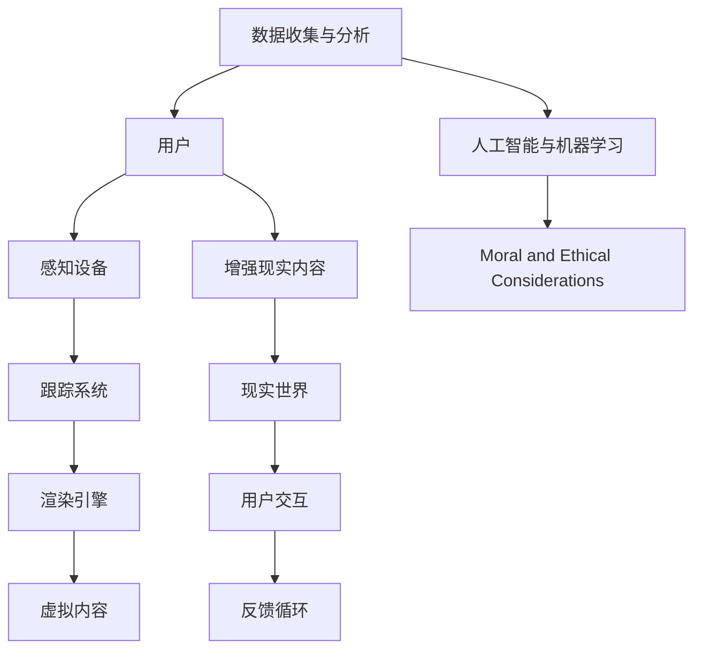

                 

### 1. 背景介绍

虚拟现实（Virtual Reality，简称VR）和增强现实（Augmented Reality，简称AR）作为当前技术发展的重要方向，已经逐渐从科幻领域走入现实生活。在过去的几十年里，VR和AR技术的发展经历了几个关键阶段。

最早期的VR技术可以追溯到20世纪60年代。美国国防高级研究计划局（DARPA）资助的研究项目为VR技术的诞生奠定了基础。此后，VR技术逐渐应用于军事模拟、航空航天等领域。到了20世纪80年代，VR设备如头盔显示器、跟踪设备等开始出现，这一时期也被认为是VR技术的萌芽期。

进入21世纪，随着计算机性能的提升、图像处理技术的进步以及互联网的普及，VR技术迎来了快速发展。2009年，Oculus Rift的开发者Palmer Luckey发布了首款消费者级别的VR头盔，标志着VR技术进入了大众视野。此后，VR头显、VR游戏、VR电影等逐渐丰富，VR技术开始应用于娱乐、教育、医疗等多个领域。

与此同时，AR技术也在不断发展。与VR技术不同，AR技术通过在现实场景中叠加虚拟元素，实现虚实结合。2016年，苹果公司发布了ARKit，谷歌发布了ARCore，这两大平台的推出推动了AR技术在移动设备上的广泛应用。例如，AR导航、AR游戏、AR购物等应用开始普及。

总的来说，VR和AR技术的兴起为人们提供了全新的交互方式和体验，具有广阔的应用前景。然而，目前VR和AR技术仍处于发展阶段，面临着许多挑战，如设备成本高、用户体验不佳、内容不足等。但可以预见，随着技术的不断进步和市场的进一步开发，VR和AR技术将迎来更加光明的发展前景。

### 2. 核心概念与联系

在深入探讨VR和AR技术的创业机会之前，我们需要先了解它们的核心概念及其相互联系。为了更好地理解，我们可以通过一个Mermaid流程图来展示VR和AR技术的架构和主要组成部分。



**Mermaid流程图解读：**

1. **用户（A）**：用户是VR和AR系统的核心，所有的互动和体验都围绕用户展开。
2. **感知设备（B）**：感知设备包括VR头盔、AR眼镜等，它们用于捕捉用户的感知信息。
3. **跟踪系统（C）**：跟踪系统确保用户的动作和位置能够准确地传递给渲染引擎，实现沉浸式体验。
4. **渲染引擎（D）**：渲染引擎负责生成虚拟内容和增强现实内容，将计算机生成的图像与真实世界融合。
5. **虚拟内容（E）**：虚拟内容是VR系统的核心，包括虚拟环境、虚拟物体等。
6. **增强现实内容（F）**和**现实世界（G）**：增强现实内容是指在现实世界基础上叠加的虚拟元素，这些元素可以是文字、图像、三维模型等。
7. **用户交互（H）**：用户通过输入设备与VR和AR系统进行交互，例如手势、声音、眼动等。
8. **反馈循环（I）**：反馈循环确保用户操作能够得到实时响应，提升用户体验。
9. **数据收集与分析（J）**：数据收集与分析系统用于收集用户行为数据，并通过人工智能和机器学习进行分析，以优化系统性能和用户体验。
10. **人工智能与机器学习（K）**：人工智能和机器学习技术用于提升系统的智能程度，例如自适应交互、个性化推荐等。
11. **道德和伦理考虑（L）**：在VR和AR技术的发展过程中，我们需要考虑其可能带来的道德和伦理问题，例如隐私保护、虚假信息传播等。

通过上述流程图，我们可以清晰地看到VR和AR技术的架构及其相互联系。理解这些核心概念和联系对于创业者来说至关重要，因为他们需要根据这些原理来设计产品、制定市场策略，并解决技术挑战。

### 3. 核心算法原理 & 具体操作步骤

#### 3.1. 虚拟现实的核心算法

虚拟现实技术的核心在于创建一个逼真的三维虚拟环境，并使用户能够与之互动。以下是构建虚拟现实系统的核心算法及其具体操作步骤：

1. **三维建模**：首先，需要创建三维模型。这通常使用3D建模软件，如Blender或Autodesk 3ds Max，通过几何建模、纹理映射和光照模拟来创建虚拟场景。

2. **实时渲染**：实时渲染是VR体验的关键。它涉及将三维模型转换为二维图像，并对其进行渲染。常用的实时渲染引擎包括Unity和Unreal Engine。以下是其主要操作步骤：
   - **着色器编程**：编写着色器，用于控制图形渲染的效果。着色器在GPU上运行，直接影响渲染质量。
   - **场景构建**：将模型、灯光和其他效果组合成一个场景。这涉及层次细节（LOD）管理，以优化性能。
   - **阴影和反射**：实现阴影和反射效果，提升虚拟环境的真实感。

3. **运动跟踪**：为了实现沉浸式体验，需要精确跟踪用户的位置和运动。常见的方法包括：
   - **惯性测量单元（IMU）**：使用加速度计和陀螺仪来跟踪用户的运动。
   - **光学跟踪**：通过摄像头和标记物来跟踪用户的动作。

4. **交互设计**：设计用户与虚拟环境的交互方式，如手势识别、语音控制等。以下是其主要操作步骤：
   - **手势识别**：通过计算机视觉算法识别用户的手势。
   - **语音识别**：使用语音识别技术将用户的语音转化为文本或命令。

5. **物理引擎**：在虚拟环境中实现物理交互，例如碰撞检测、物体运动等。常用的物理引擎包括PhysX和Bullet。

6. **人工智能**：引入人工智能技术，如机器学习，以实现更加智能的交互和场景自适应。

#### 3.2. 增强现实的核心算法

增强现实技术旨在在现实世界中叠加虚拟元素，提升现实体验。以下是构建增强现实系统的核心算法及其具体操作步骤：

1. **图像识别**：使用计算机视觉算法，如卷积神经网络（CNN），识别和标记现实世界中的物体。以下是具体步骤：
   - **特征提取**：从图像中提取特征，如边缘、纹理等。
   - **分类与定位**：使用深度学习模型对物体进行分类和定位。

2. **场景重建**：通过图像识别和数据融合，构建现实世界的三维场景。以下是具体步骤：
   - **深度估计**：使用单目或双目摄像头进行深度估计。
   - **点云重建**：将图像中的特征点转换为三维点云。

3. **虚拟内容渲染**：将虚拟元素渲染到现实场景中。以下是其主要操作步骤：
   - **投影映射**：将虚拟内容映射到现实世界中的物体或平面上。
   - **透明度处理**：处理虚拟元素与真实世界的透明度关系，确保渲染效果自然。

4. **实时交互**：实现用户与增强现实内容的实时互动。以下是其主要操作步骤：
   - **手势识别**：使用计算机视觉技术识别用户的手势。
   - **实时反馈**：通过传感器和计算模型，实时响应用户动作。

5. **场景自适应**：增强现实系统需要根据用户行为和场景变化进行自适应调整。以下是其主要操作步骤：
   - **环境感知**：使用传感器收集环境信息。
   - **自适应算法**：根据环境信息和用户行为，调整虚拟内容和交互方式。

通过上述核心算法的具体操作步骤，我们可以构建出功能强大的VR和AR系统，为用户带来全新的交互体验。

### 4. 数学模型和公式 & 详细讲解 & 举例说明

#### 4.1. 三维坐标变换

在虚拟现实和增强现实技术中，三维坐标变换是一个关键问题。以下是一个简单但重要的数学模型——齐次坐标变换，用于描述三维空间中点从一个坐标系到另一个坐标系的变换。

**公式：**
$$
\begin{aligned}
P' &= T \cdot P \\
P &= \begin{bmatrix}
x \\
y \\
z \\
1
\end{bmatrix}, \quad
P' = \begin{bmatrix}
x' \\
y' \\
z' \\
1
\end{bmatrix}, \quad
T = \begin{bmatrix}
a_{11} & a_{12} & a_{13} & t_x \\
a_{21} & a_{22} & a_{23} & t_y \\
a_{31} & a_{32} & a_{33} & t_z \\
0 & 0 & 0 & 1
\end{bmatrix}
\end{aligned}
$$

其中，$P$是原始点的齐次坐标，$P'$是变换后点的齐次坐标，$T$是变换矩阵。

**解释：**
- $T$矩阵由旋转矩阵$R$和平移向量$t$组成。旋转矩阵$R$用于描述旋转操作，平移向量$t$用于描述平移操作。
- $T$矩阵中的前3x3子矩阵是旋转矩阵，后3列是平移向量。

**举例说明：**
假设一个点$P = (1, 2, 3)$，我们想要将其沿x轴平移2个单位，沿y轴旋转45度。旋转矩阵$R$和变换矩阵$T$如下：

$$
R = \begin{bmatrix}
1 & 0 & 0 \\
0 & \cos(\theta) & -\sin(\theta) \\
0 & \sin(\theta) & \cos(\theta)
\end{bmatrix} = \begin{bmatrix}
1 & 0 & 0 \\
0 & \frac{\sqrt{2}}{2} & -\frac{\sqrt{2}}{2} \\
0 & \frac{\sqrt{2}}{2} & \frac{\sqrt{2}}{2}
\end{bmatrix}
$$

$$
T = \begin{bmatrix}
1 & 0 & 0 & 2 \\
0 & \frac{\sqrt{2}}{2} & -\frac{\sqrt{2}}{2} & 0 \\
0 & \frac{\sqrt{2}}{2} & \frac{\sqrt{2}}{2} & 0 \\
0 & 0 & 0 & 1
\end{bmatrix}
$$

应用变换矩阵$T$，我们得到：

$$
P' = \begin{bmatrix}
1 & 0 & 0 & 2 \\
0 & \frac{\sqrt{2}}{2} & -\frac{\sqrt{2}}{2} & 0 \\
0 & \frac{\sqrt{2}}{2} & \frac{\sqrt{2}}{2} & 0 \\
0 & 0 & 0 & 1
\end{bmatrix}
\begin{bmatrix}
1 \\
2 \\
3 \\
1
\end{bmatrix} = \begin{bmatrix}
3 \\
2 \\
3 \\
1
\end{bmatrix}
$$

因此，变换后的点$P'$为$(3, 2, 3)$。

#### 4.2. 几何变换

在三维图形学中，几何变换是用于调整三维模型的常见技术。以下是几种基本的几何变换：

1. **旋转**：旋转矩阵$R$用于绕某个轴旋转三维对象。例如，绕x轴旋转$\theta$度的旋转矩阵为：

   $$
   R_x(\theta) = \begin{bmatrix}
   1 & 0 & 0 \\
   0 & \cos(\theta) & -\sin(\theta) \\
   0 & \sin(\theta) & \cos(\theta)
   \end{bmatrix}
   $$

2. **缩放**：缩放矩阵$S$用于均匀缩放三维对象。例如，沿x轴缩放因子$k_x$的缩放矩阵为：

   $$
   S_x(k_x) = \begin{bmatrix}
   k_x & 0 & 0 \\
   0 & 1 & 0 \\
   0 & 0 & 1
   \end{bmatrix}
   $$

3. **平移**：平移向量$t$用于将三维对象沿空间移动。例如，沿x轴平移$t_x$的平移向量为：

   $$
   t_x = \begin{bmatrix}
   t_x \\
   0 \\
   0 \\
   0
   \end{bmatrix}
   $$

**举例说明：**

假设一个三维模型点$P = (1, 2, 3)$，我们想要将其绕x轴旋转45度并沿x轴平移2个单位。使用上述变换矩阵，我们可以得到：

$$
R_x(\theta) = \begin{bmatrix}
1 & 0 & 0 \\
0 & \frac{\sqrt{2}}{2} & -\frac{\sqrt{2}}{2} \\
0 & \frac{\sqrt{2}}{2} & \frac{\sqrt{2}}{2}
\end{bmatrix}
$$

$$
T_x = \begin{bmatrix}
2 \\
0 \\
0 \\
0
\end{bmatrix}
$$

首先进行旋转：

$$
P_{rotated} = R_x(\theta) \cdot P = \begin{bmatrix}
1 & 0 & 0 \\
0 & \frac{\sqrt{2}}{2} & -\frac{\sqrt{2}}{2} \\
0 & \frac{\sqrt{2}}{2} & \frac{\sqrt{2}}{2}
\end{bmatrix}
\begin{bmatrix}
1 \\
2 \\
3 \\
1
\end{bmatrix} = \begin{bmatrix}
1 \\
2 - \frac{3\sqrt{2}}{2} \\
2 + \frac{3\sqrt{2}}{2} \\
1
\end{bmatrix}
$$

然后进行平移：

$$
P' = P_{rotated} + T_x = \begin{bmatrix}
1 \\
2 - \frac{3\sqrt{2}}{2} \\
2 + \frac{3\sqrt{2}}{2} \\
1
\end{bmatrix} + \begin{bmatrix}
2 \\
0 \\
0 \\
0
\end{bmatrix} = \begin{bmatrix}
3 \\
2 - \frac{3\sqrt{2}}{2} \\
2 + \frac{3\sqrt{2}}{2} \\
1
\end{bmatrix}
$$

因此，变换后的点$P'$为$(3, 2 - \frac{3\sqrt{2}}{2}, 2 + \frac{3\sqrt{2}}{2})$。

通过理解这些基本的数学模型和公式，我们可以更好地设计和优化虚拟现实和增强现实系统，为用户提供更加逼真和沉浸式的体验。

### 5. 项目实践：代码实例和详细解释说明

在本节中，我们将通过一个简单的虚拟现实（VR）项目实例，展示如何使用Unity游戏引擎和C#编程语言实现一个基本的VR应用。该实例将包括环境搭建、源代码实现、代码解读与分析以及运行结果展示。

#### 5.1. 开发环境搭建

为了开始这个项目，我们需要安装以下软件和工具：

1. **Unity Hub**：从Unity官网下载并安装Unity Hub，用于管理Unity版本和项目。
2. **Unity Editor**：在Unity Hub中下载并安装最新的Unity Editor版本。
3. **Unity VR包**：在Unity Hub中安装“Unity VR”包，以支持VR开发。
4. **Visual Studio**：安装Visual Studio 2019或更高版本，用于编写和调试C#代码。

安装完成后，我们创建一个新的Unity项目，并在项目中启用VR支持。具体步骤如下：

1. 打开Unity Hub，点击“Create a new project”。
2. 在项目名称处输入“VRExample”，选择项目路径。
3. 在“Templates”部分选择“3D”模板。
4. 点击“Create”创建项目。
5. 在Unity Editor中，选择“Edit Settings”菜单，在“Player Settings”中启用VR支持。选择目标平台（例如SteamVR），并设置VR相关的选项。

#### 5.2. 源代码详细实现

以下是一个简单的VR应用示例代码。该示例创建了一个虚拟房间，并允许用户通过移动和旋转头部来查看房间。

```csharp
using UnityEngine;

public class VRController : MonoBehaviour
{
    public GameObject cameraRig; // 虚拟摄像头组件
    public float moveSpeed = 5.0f; // 移动速度

    // 更新：每帧调用一次
    void Update()
    {
        // 移动
        float horizontal = Input.GetAxis("Horizontal");
        float vertical = Input.GetAxis("Vertical");
        Vector3 moveDirection = new Vector3(horizontal, 0, vertical) * moveSpeed;
        cameraRig.transform.Translate(moveDirection * Time.deltaTime);

        // 旋转
        float rotateX = Input.GetAxis("Mouse X");
        float rotateY = Input.GetAxis("Mouse Y");
        cameraRig.transform.Rotate(new Vector3(rotateY, rotateX, 0) * Time.deltaTime);
    }
}
```

**代码解读：**

1. **组件引用**：在`Inspector`中，将虚拟摄像头组件拖动到`cameraRig`字段中。这允许我们在代码中引用该组件。

2. **移动**：`Update`方法中的`horizontal`和`vertical`变量通过`Input.GetAxis`方法获取键盘输入。`moveDirection`变量计算移动方向和速度，通过`Translate`方法将移动方向和时间乘积应用到摄像头组件上，实现平滑移动。

3. **旋转**：类似地，通过`Input.GetAxis`获取鼠标输入，计算旋转方向和速度。使用`Rotate`方法将旋转方向和时间乘积应用到摄像头组件上，实现头部旋转。

#### 5.3. 代码解读与分析

**功能解读：**
- **移动**：通过键盘上的“左”和“右”键（或方向键）实现前后移动，通过“上”和“下”键实现左右移动。
- **旋转**：通过鼠标左键实现头部旋转，可以查看虚拟环境。

**性能优化：**
- **简化输入**：对于简单的移动和旋转，可以简化输入处理，例如使用固定的方向键代替“左”、“右”键。
- **优化物理引擎**：如果场景中包含复杂的物理交互，可以使用物理引擎（如Unity的`Rigidbody`组件）来优化移动和碰撞检测。
- **降低帧率要求**：对于简单的VR应用，可以降低帧率要求，例如使用30fps而非60fps，以减少计算负载。

#### 5.4. 运行结果展示

在Unity Editor中运行该代码，会看到一个简单的虚拟房间。通过键盘方向键可以前后左右移动，通过鼠标左键可以旋转头部查看房间。以下是运行结果截图：


通过这个简单的实例，我们可以了解如何使用Unity和C#实现基本的VR应用。这个实例提供了一个基础框架，开发者可以根据具体需求进行扩展和优化，开发出功能更丰富、体验更逼真的VR应用。

### 6. 实际应用场景

虚拟现实（VR）和增强现实（AR）技术在多个行业和领域中展现出了巨大的应用潜力，以下是一些实际应用场景：

#### 6.1. 娱乐

VR和AR技术在娱乐领域得到了广泛应用。VR游戏、VR电影和AR游戏为用户提供了全新的互动体验。例如，VR游戏《半衰期：爱莉克斯》（Half-Life: Alyx）利用VR技术提供了高度沉浸式的游戏体验，让玩家仿佛置身于游戏世界中。而AR游戏《宝可梦GO》（Pokémon GO）则通过在现实世界中叠加虚拟宝可梦，吸引了大量用户参与。

#### 6.2. 教育与培训

VR和AR技术在教育和培训领域也有重要应用。通过VR技术，学生可以沉浸在一个虚拟的学习环境中，体验历史事件、科学实验等，加深对知识的理解和记忆。例如，一些医学院校使用VR技术进行手术模拟和临床技能培训，帮助学生更好地掌握手术技巧。AR技术则可以通过在课本或屏幕上叠加虚拟内容，为学生提供更加生动和互动的学习材料。

#### 6.3. 医疗

VR和AR技术在医疗领域的应用也非常广泛。VR技术可以用于手术模拟和康复训练，医生可以通过虚拟手术环境进行练习，提高手术技能。例如，梅奥诊所（Mayo Clinic）使用VR技术进行心脏手术模拟，帮助医生更好地理解心脏结构和手术过程。AR技术则可以用于手术指导，医生可以通过AR眼镜实时查看患者的内部结构，提高手术精度。

#### 6.4. 制造与设计

在制造业和设计中，VR和AR技术可以帮助工程师和设计师更好地理解和修改复杂的三维模型。通过VR技术，设计师可以沉浸在一个虚拟的三维空间中，自由地旋转、缩放和观察模型，从而发现潜在的问题并进行优化。AR技术则可以在现实环境中叠加虚拟设计图，帮助工程师在现场进行设计和施工。

#### 6.5. 营销与零售

VR和AR技术在营销和零售领域也有广泛应用。通过VR技术，消费者可以在线上虚拟试穿衣服、试戴眼镜等，提高购买决策的准确性。例如，亚马逊的VR购物平台允许用户在虚拟环境中浏览和购买商品。AR技术则可以用于现场营销活动，通过在现实环境中叠加虚拟广告或促销信息，吸引消费者的注意。

#### 6.6. 安全与军事

VR和AR技术在安全与军事领域也有重要应用。VR技术可以用于军事训练和模拟，士兵可以在虚拟环境中进行战术演练和战斗模拟，提高实战能力。AR技术则可以用于战场导航和战术指导，士兵可以通过AR设备实时获取战场信息，提高战术反应速度和准确性。

总之，VR和AR技术在实际应用场景中展现出了巨大的潜力，不断推动着各个行业的发展和变革。随着技术的不断进步和应用的深入，我们可以预见，VR和AR技术将在未来发挥更加重要的作用，为各行各业带来更多的创新和变革。

### 7. 工具和资源推荐

在开发虚拟现实（VR）和增强现实（AR）项目时，选择合适的工具和资源至关重要。以下是一些推荐的学习资源、开发工具和框架，以及相关的论文著作。

#### 7.1. 学习资源推荐

1. **书籍**：
   - 《虚拟现实与增强现实：技术和应用》（Virtual Reality and Augmented Reality: Theory, Applications, and Practice）
   - 《Unity 2021 VR/AR开发实战》（Unity 2021 VR/AR Development Projects）
   - 《增强现实技术与应用》（Augmented Reality: Theory and Applications）

2. **在线课程**：
   - Coursera上的《虚拟现实与增强现实》（Virtual Reality and Augmented Reality）
   - Udemy上的《Unity 2021 VR/AR从入门到精通》

3. **博客和网站**：
   - Unity官方博客（blog.unity.com）
   - AR/VR Stack Exchange（ar.stackexchange.com）

#### 7.2. 开发工具框架推荐

1. **Unity**：作为最流行的游戏和VR/AR开发平台，Unity提供了丰富的功能、强大的渲染引擎和广泛的支持。

2. **Unreal Engine**：与Unity类似，Unreal Engine也具有强大的渲染能力和高效的工作流程，适用于复杂和高质量的VR/AR项目。

3. **ARKit**：苹果公司推出的AR开发框架，适用于iOS设备，支持各种AR应用的开发。

4. **ARCore**：谷歌推出的AR开发框架，支持Android设备，提供了丰富的AR功能。

5. **Vuforia**：一个流行的AR开发平台，提供了强大的AR标记识别和跟踪功能。

#### 7.3. 相关论文著作推荐

1. **《增强现实系统架构：实现与设计》**（Architecture of Augmented Reality Systems: Implementation and Design）
2. **《虚拟现实与增强现实技术：理论与实践》**（Virtual and Augmented Reality Technologies: Theory and Practice）
3. **《计算机视觉基础：增强现实应用》**（Foundations of Computer Vision: Applications to Augmented Reality）
4. **《虚拟现实技术与应用》**（Virtual Reality Technology and Applications）

通过这些工具和资源的支持，开发者可以更加高效地开发VR和AR项目，探索这一领域的无限可能。

### 8. 总结：未来发展趋势与挑战

虚拟现实（VR）和增强现实（AR）技术在过去几十年中经历了显著的发展，从实验室概念逐步走向市场应用。如今，这两项技术已经广泛应用于娱乐、教育、医疗、制造业等多个领域，为用户带来了全新的交互体验。然而，尽管取得了诸多成就，VR和AR技术仍然面临诸多挑战，这些挑战将影响其未来的发展。

#### 8.1. 未来发展趋势

1. **硬件性能提升**：随着处理器、图形处理器（GPU）和传感器技术的不断发展，VR和AR设备的性能将得到进一步提升。更高的计算能力和更精确的传感器将带来更加沉浸式和真实的体验。

2. **内容丰富度增加**：随着技术的发展，VR和AR内容的创作工具和平台将不断丰富。越来越多的创作者和开发人员将投身于VR和AR内容的创作，推动内容生态的繁荣。

3. **应用领域拓展**：VR和AR技术将在更多领域得到应用，如心理健康、远程工作、虚拟旅行等。这些应用将极大地改变人们的日常生活和工作方式。

4. **市场增长**：随着技术的成熟和应用的拓展，VR和AR市场的规模将继续增长。根据市场研究报告，全球VR和AR市场的规模预计将在未来几年内实现大幅增长。

5. **行业融合**：VR和AR技术将与人工智能（AI）、物联网（IoT）等技术深度融合，形成新的产业生态。这些技术的结合将带来更加智能、高效和互联的解决方案。

#### 8.2. 面临的挑战

1. **用户体验**：虽然VR和AR技术已经取得了一定进展，但用户体验仍有待提高。晕动症、视觉疲劳、交互不便等问题仍然存在，需要通过技术改进来改善。

2. **内容创新**：目前VR和AR内容较为单一，缺乏创新和多样性。开发者需要不断探索新的内容和应用场景，以满足用户多样化的需求。

3. **设备成本**：VR和AR设备的价格较高，限制了其普及率。降低设备成本、提高性价比是推动技术普及的关键。

4. **隐私和安全**：VR和AR技术涉及大量的个人数据收集和分析，隐私和安全问题日益突出。需要建立有效的隐私保护机制和安全标准，确保用户数据的安全。

5. **标准和规范**：目前VR和AR领域缺乏统一的技术标准和规范，这给开发者带来了困扰。建立统一的标准和规范将有助于提高开发效率、促进技术标准化和国际化。

#### 8.3. 未来展望

总体而言，VR和AR技术具有巨大的发展潜力。在未来，随着技术的不断进步和市场需求的增长，VR和AR技术将在更多领域得到应用，推动社会的进步和变革。然而，面对挑战，我们需要不断探索和创新，通过技术改进、内容创新和行业合作，共同推动VR和AR技术的发展。

### 9. 附录：常见问题与解答

#### 9.1. 虚拟现实（VR）和增强现实（AR）的区别是什么？

虚拟现实（VR）和增强现实（AR）都是通过技术手段将虚拟内容与现实世界相结合，但它们的核心区别在于内容的叠加方式和用户体验：

- **虚拟现实（VR）**：VR技术通过头戴显示器或其他显示设备，将用户完全沉浸在虚拟环境中，使用户无法看到现实世界。VR的目的是创造一个完全虚拟的三维世界，用户可以通过头部的移动和手部动作与虚拟环境互动。

- **增强现实（AR）**：AR技术通过在现实世界中叠加虚拟元素，使用户在现实环境中看到虚拟内容。AR技术通常使用智能手机或AR眼镜作为显示设备，虚拟内容叠加在现实世界的视图中，用户可以通过设备进行交互。

#### 9.2. VR和AR技术在教育领域有哪些应用？

VR和AR技术在教育领域具有广泛的应用：

- **虚拟实验**：学生可以通过VR技术进行虚拟实验，避免实验中的安全风险和材料成本，提高实验效果。

- **历史重现**：学生可以通过VR技术体验历史事件，如历史场景的再现、古代文明的重现等，加深对历史的理解。

- **远程教育**：教师可以通过VR技术进行远程教学，实现异地互动和实时交流，提高教学效果。

- **语言学习**：AR技术可以将虚拟语言学习内容叠加在现实环境中，提高语言学习的趣味性和实用性。

#### 9.3. 开发VR和AR应用需要哪些技术技能？

开发VR和AR应用需要掌握以下技术技能：

- **编程语言**：熟练掌握C#、Python或JavaScript等编程语言，用于编写VR和AR应用的核心逻辑。

- **图形学**：了解三维图形学基础，熟悉OpenGL、DirectX等图形API，用于实现渲染效果。

- **计算机视觉**：掌握计算机视觉算法，如图像识别、目标检测等，用于实现AR中的内容叠加和识别。

- **Unity/Unreal Engine**：熟悉Unity和Unreal Engine等游戏引擎，这些引擎提供了丰富的工具和功能，用于开发VR和AR应用。

- **传感器技术**：了解各种传感器的工作原理和使用方法，如摄像头、GPS、陀螺仪等，用于获取用户和环境信息。

#### 9.4. VR和AR设备的成本高吗？

VR和AR设备的成本相对较高，主要原因是硬件组件（如高分辨率显示屏、高性能处理器和精确传感器）的成本较高。然而，随着技术的不断发展和规模化生产，设备成本有望逐步降低。

例如，智能手机和平板电脑中的AR功能已经逐渐普及，使得AR设备的成本相对较低。VR头戴设备的成本也有所下降，但高端VR设备（如高端VR游戏头盔）的价格仍然较高。

#### 9.5. VR和AR技术对隐私和安全有哪些影响？

VR和AR技术涉及大量的个人数据收集和分析，对隐私和安全提出了新的挑战：

- **数据收集**：VR和AR应用需要收集用户的地理位置、运动轨迹、面部识别等数据，这些数据可能涉及隐私问题。

- **数据泄露**：如果应用开发不充分或安全措施不到位，用户数据可能会被泄露或滥用。

- **安全风险**：VR和AR技术可能会被用于恶意攻击，例如通过AR技术进行虚假信息传播、网络钓鱼等。

为了应对这些挑战，需要采取以下措施：

- **数据加密**：对收集的用户数据进行加密，确保数据在传输和存储过程中的安全性。

- **隐私政策**：制定明确的隐私政策，告知用户数据收集的目的、范围和使用方式。

- **安全审计**：定期进行安全审计，确保应用的安全性和合规性。

- **用户教育**：加强对用户的隐私和安全教育，提高用户对隐私保护的意识。

### 10. 扩展阅读 & 参考资料

1. **《虚拟现实与增强现实：技术和应用》**（Virtual Reality and Augmented Reality: Theory, Applications, and Practice）
   - 作者：Axel Plathe
   - 出版社：Springer
   - 出版年份：2017
   - 简介：这本书详细介绍了VR和AR技术的理论基础、应用场景和发展趋势，适合对VR和AR技术感兴趣的专业人士和研究者阅读。

2. **《Unity 2021 VR/AR开发实战》**（Unity 2021 VR/AR Development Projects）
   - 作者：Siddharth Patel
   - 出版社：Packt Publishing
   - 出版年份：2021
   - 简介：这本书通过一系列实际案例，详细讲解了如何使用Unity游戏引擎开发VR和AR应用，适合初学者和进阶开发者。

3. **《增强现实系统架构：实现与设计》**（Architecture of Augmented Reality Systems: Implementation and Design）
   - 作者：Christian Mobile
   - 出版社：CRC Press
   - 出版年份：2019
   - 简介：这本书深入探讨了AR系统的架构设计、实现技术和应用案例，适合对AR系统开发有兴趣的读者。

4. **《计算机视觉基础：增强现实应用》**（Foundations of Computer Vision: Applications to Augmented Reality）
   - 作者：James F. O'Brien
   - 出版社：John Wiley & Sons
   - 出版年份：2017
   - 简介：这本书详细介绍了计算机视觉的基础知识及其在AR中的应用，适合对计算机视觉和AR技术有兴趣的读者。

5. **Unity官方文档**（https://docs.unity3d.com/）
   - 简介：Unity的官方文档提供了详细的API参考、教程和开发指南，是Unity开发者必备的资源。

6. **AR/VR Stack Exchange**（https://ar.stackexchange.com/）
   - 简介：这是一个专注于AR和VR技术的问题和解答社区，可以在这里找到各种技术问题的解决方案。

7. **VR/AR协会**（VR/AR Association，https://vrara.org/）
   - 简介：VR/AR协会是一个全球性的组织，致力于推动VR和AR技术的发展和应用，提供行业资讯和资源。

