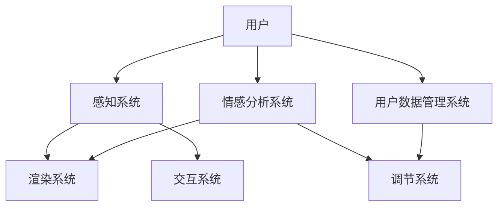

                 

### 背景介绍

虚拟现实（Virtual Reality，VR）技术作为一项颠覆性的创新技术，近年来在各个领域中取得了显著进展。从最初的游戏娱乐到医疗健康、教育、军事模拟，再到近年来的工业设计、房地产等，VR技术的应用范围不断扩大。而随着技术的发展，人们逐渐意识到，VR不仅仅是一种新的交互方式，更是一种全新的感知和体验方式，它可以在一定程度上影响用户的情感和心理健康。

在这一背景下，虚拟现实情感调节（VR Emotional Regulation，VRER）的概念应运而生。虚拟现实情感调节利用VR技术创建一个高度沉浸式的虚拟环境，用户在虚拟环境中的情感体验可以被实时捕捉、分析和调节，从而达到改善心理健康、缓解心理压力的目的。这项技术的核心在于通过虚拟现实与心理学理论的深度融合，实现用户情感的有效管理和调节。

心理健康问题在全球范围内日益严重，根据世界卫生组织（WHO）的数据，全球约有3.5亿人患有抑郁症、焦虑症等心理疾病。传统的治疗方法，如药物治疗和心理治疗，虽然在一定程度上有效，但存在一定的局限性。例如，药物治疗可能产生副作用，心理治疗则需要长期进行且依赖于治疗师的专业水平。而虚拟现实情感调节技术，因其非侵入性、个性化的特点，成为了一种新型的心理健康管理手段。

沉浸式心理健康管理平台，作为VRER技术的具体实现，不仅能够模拟出逼真的情感体验环境，还可以通过人工智能技术实时分析用户的情感状态，并根据分析结果提供个性化的调节方案。这种平台可以广泛应用于临床治疗、心理干预、健康管理等各个领域，具有巨大的市场潜力。

本文将围绕虚拟现实情感调节创业这一主题，系统地介绍其核心概念、技术原理、应用场景、开发实践等内容。首先，我们将深入探讨虚拟现实情感调节的核心概念，包括VR技术的基本原理、情感调节的心理学基础，以及相关技术的架构和联系。接下来，我们将详细解析虚拟现实情感调节的核心算法原理，并逐步展示其具体操作步骤。随后，我们将引入数学模型和公式，对虚拟现实情感调节的算法进行详细讲解和举例说明。在实际应用部分，我们将通过一个项目实践案例，详细讲解代码实例和实现细节。最后，我们将探讨虚拟现实情感调节在实际应用场景中的广泛用途，并推荐相关学习资源和开发工具，以帮助读者深入了解这一前沿技术。

### 2. 核心概念与联系

要深入理解虚拟现实情感调节（VR Emotional Regulation，VRER）这一概念，我们首先需要了解其背后的核心技术——虚拟现实（VR）和情感调节的心理学原理。

#### 虚拟现实（VR）技术的基本原理

虚拟现实技术通过计算机生成的模拟环境，使用户沉浸在一个虚拟的三维空间中。这一技术的基本原理包括以下几个方面：

1. **感知技术**：利用高分辨率显示器、传感器和跟踪设备，如头戴式显示器（HMD）、手柄等，实时捕捉用户的动作和视觉信息，提供高度真实的感知体验。
   
2. **实时渲染**：通过图形处理单元（GPU）对场景进行实时渲染，以实现逼真的视觉效果。这要求系统具有极高的计算能力和图形处理能力。

3. **交互技术**：用户可以通过各种交互设备（如手柄、手套等）与虚拟环境进行互动，实现自然的人机交互。

4. **位置跟踪**：使用位置传感器（如激光雷达、超声波传感器等）实时跟踪用户的位置和动作，确保虚拟环境的动态变化与用户动作同步。

#### 情感调节的心理学原理

情感调节是指个体通过认知、行为和生理反应来管理自己的情绪状态，以达到心理平衡的过程。在心理学中，情感调节包括以下几种方法：

1. **认知重评**：通过改变对情感事件的认知评价来调节情绪。例如，面对失败时，通过积极思考失败的原因和未来的改进机会，来减轻负面情绪。

2. **表达抑制**：控制情感表达的程度，以减少负面情绪的影响。例如，在公共场合保持冷静，不表露过度的情感。

3. **情绪释放**：通过某种方式释放或表达情感，如进行体育锻炼、写日记等。

4. **情绪替代**：将负面情感转移至其他事物，通过参与其他活动来分散注意力。

#### VRER技术的架构和联系

虚拟现实情感调节技术的架构可以概括为以下几个核心组成部分：

1. **感知系统**：包括头戴式显示器（HMD）、传感器、手柄等，用于实时捕捉用户的动作和视觉信息。

2. **渲染系统**：利用GPU进行场景的实时渲染，提供高度真实的视觉体验。

3. **交互系统**：通过手柄、手套等交互设备，实现用户与虚拟环境的自然互动。

4. **情感分析系统**：利用计算机视觉和自然语言处理技术，实时捕捉和分析用户的情感状态。

5. **调节系统**：根据情感分析结果，提供个性化的情感调节方案，如调整环境参数、引入心理干预等。

6. **用户数据管理系统**：记录用户的行为和情感数据，为后续的个性化调节提供依据。

#### Mermaid 流程图

为了更直观地展示VRER技术的架构和联系，我们可以使用Mermaid绘制一个流程图。以下是一个简化的Mermaid流程图示例：



在这个流程图中，用户通过感知系统接收虚拟环境的刺激，并通过交互系统与虚拟环境进行互动。情感分析系统实时捕捉和分析用户的情感状态，并将结果传递给调节系统。调节系统根据分析结果，动态调整虚拟环境，以实现情感调节。用户数据管理系统则负责记录和存储用户的行为和情感数据，为后续的个性化调节提供数据支持。

通过上述介绍，我们可以看到，虚拟现实情感调节技术是VR技术和心理学原理的深度融合。它通过高度沉浸式的虚拟环境，结合情感分析和调节技术，为用户提供了全新的心理健康管理手段。接下来，我们将进一步深入探讨虚拟现实情感调节的核心算法原理，以及其实际操作步骤。

### 3. 核心算法原理 & 具体操作步骤

虚拟现实情感调节（VRER）的核心在于其算法原理，该算法能够实时捕捉和分析用户的情感状态，并根据分析结果提供个性化的调节方案。以下是VRER的核心算法原理及其具体操作步骤：

#### 3.1 情感状态捕捉算法

情感状态捕捉是VRER算法的首要任务。这一过程涉及以下几个步骤：

1. **面部表情识别**：通过计算机视觉技术，实时捕捉用户的面部表情。这可以通过训练深度神经网络（如卷积神经网络，CNN）来实现，神经网络可以识别不同情感状态（如快乐、悲伤、愤怒等）的面部特征。

2. **语音情感识别**：通过自然语言处理（NLP）技术，分析用户的语音情感。这可以通过训练循环神经网络（RNN）或长短期记忆网络（LSTM）来实现，这些网络可以识别语音中的情感关键词和语调变化。

3. **生理信号监测**：通过传感器（如心率监测器、皮肤电导传感器等）实时捕捉用户的生理信号。这些信号可以反映用户的情感状态，如心率变化和皮肤电导变化等。

#### 3.2 情感状态分析算法

情感状态分析是对捕捉到的情感数据进行处理，以提取情感状态的核心特征。这一过程涉及以下几个步骤：

1. **特征提取**：将捕捉到的面部表情、语音情感和生理信号数据进行预处理，提取出具有代表性的特征。例如，面部表情识别中可以提取出眼睛、嘴巴和脸部的关键点；语音情感识别中可以提取出情感关键词和语调特征；生理信号监测中可以提取出心率变异性（HRV）等。

2. **情感状态分类**：利用机器学习算法（如支持向量机，SVM；随机森林，RF等），将提取出的特征数据分类到不同的情感状态。这一步骤的目的是将用户的情感状态进行量化，从而为后续的调节提供依据。

3. **情感状态跟踪**：通过实时分析用户的行为和情感状态数据，跟踪用户的情感变化趋势。例如，如果用户从初始的愉悦状态逐渐变得焦虑，系统需要及时捕捉到这一变化，并做出相应的调节。

#### 3.3 情感状态调节算法

情感状态调节是根据分析结果提供个性化的调节方案，以帮助用户管理情绪。这一过程涉及以下几个步骤：

1. **调节策略选择**：根据用户当前的情感状态和需求，选择合适的调节策略。例如，如果用户感到焦虑，可以选择放松训练或正念冥想等策略；如果用户感到抑郁，可以选择积极心理训练或虚拟社交互动等策略。

2. **环境参数调整**：根据调节策略，动态调整虚拟环境的参数，以提供最佳的情感调节效果。例如，可以调整光线亮度、声音音量、背景音乐等，以创造一个适合用户情感状态的环境。

3. **心理干预**：在必要时，引入专业的心理干预措施，如虚拟咨询师或虚拟教练等。这些干预措施可以通过虚拟现实环境与用户进行互动，提供个性化的心理支持。

#### 3.4 算法实现步骤

具体实现VRER算法的步骤如下：

1. **数据采集**：首先，需要收集大量的用户行为和情感数据，包括面部表情、语音情感、生理信号等。这些数据可以通过实验或真实应用场景获取。

2. **数据预处理**：对收集到的数据进行分析，去除噪声和异常值，并进行特征提取，为后续的算法训练提供高质量的数据。

3. **算法训练**：使用机器学习算法对预处理后的数据集进行训练，以建立情感状态捕捉和分析模型。这需要大量的计算资源和时间。

4. **算法部署**：将训练好的模型部署到虚拟现实环境中，实现情感状态捕捉和分析功能。

5. **算法优化**：根据用户反馈和实际应用效果，对算法进行持续优化，以提高其准确性和适应性。

#### 3.5 举例说明

假设一个用户在虚拟现实环境中进行情绪调节训练，具体操作步骤如下：

1. **数据采集**：用户佩戴心率监测器和头戴式显示器，同时进行语音输入。

2. **数据预处理**：对采集到的数据进行分析，去除噪声，提取面部表情关键点、语音情感关键词和心率变异性（HRV）等特征。

3. **情感状态捕捉**：利用训练好的面部表情识别模型，实时分析用户的面部表情，判断用户当前的情感状态为焦虑。

4. **情感状态分析**：利用语音情感识别模型和HRV特征，进一步确认用户的情感状态，并跟踪情感变化趋势。

5. **情感状态调节**：根据用户的情感状态，选择放松训练作为调节策略。系统动态调整虚拟环境中的光线亮度、声音音量等参数，创造一个适合放松的环境。

6. **心理干预**：在放松训练过程中，虚拟教练与用户互动，提供心理支持和指导，帮助用户更好地调节情绪。

7. **算法优化**：根据用户反馈和实际效果，对算法进行优化，以提高其适应性和准确性。

通过上述具体操作步骤和实例，我们可以看到虚拟现实情感调节算法的复杂性和实现过程。这一技术的成功应用，不仅依赖于先进的计算机视觉、自然语言处理和生理信号处理技术，还需要深入理解心理学原理和用户需求。接下来，我们将进一步探讨虚拟现实情感调节的数学模型和公式，为这一技术提供更坚实的理论基础。

### 4. 数学模型和公式 & 详细讲解 & 举例说明

在虚拟现实情感调节（VRER）技术中，数学模型和公式扮演着至关重要的角色。这些模型不仅用于情感状态的捕捉和分析，还用于调节方案的设计和优化。在本节中，我们将详细讲解VRER技术中的关键数学模型和公式，并通过具体例子进行说明。

#### 4.1 面部表情识别模型

面部表情识别是VRER技术中的基础模块，其主要目的是通过捕捉用户的面部表情，识别出不同的情感状态。常用的模型包括：

1. **支持向量机（SVM）**：SVM是一种监督学习算法，用于分类问题。它可以用来将不同的面部表情分类到不同的情感状态。

   公式：
   $$ 
   \text{max} \ \frac{1}{2} \ \sum_{i=1}^{n} \ w_i^T \ y_i 
   $$
   其中，$w_i$ 是权重向量，$y_i$ 是样本标签。

2. **卷积神经网络（CNN）**：CNN是一种深度的神经网络，特别适用于处理图像数据。它可以提取面部表情的特征，并将其用于情感状态分类。

   公式：
   $$
   \text{CNN} = \text{Conv} \rightarrow \text{ReLU} \rightarrow \text{Pooling} \rightarrow \text{Fully Connected}
   $$
   其中，Conv表示卷积层，ReLU表示激活函数，Pooling表示池化层，Fully Connected表示全连接层。

#### 4.2 语音情感识别模型

语音情感识别是利用语音信号中的情感特征来识别用户的情感状态。常用的模型包括：

1. **循环神经网络（RNN）**：RNN是一种能够处理序列数据的神经网络，特别适用于语音情感识别。

   公式：
   $$
   h_t = \text{sigmoid}(W \cdot [h_{t-1}, x_t] + b)
   $$
   其中，$h_t$ 是当前时刻的隐藏状态，$x_t$ 是当前时刻的输入，$W$ 是权重矩阵，$b$ 是偏置。

2. **长短期记忆网络（LSTM）**：LSTM是一种改进的RNN，能够有效地避免梯度消失问题，适用于处理较长的序列数据。

   公式：
   $$
   \begin{cases}
   f_t = \sigma(W_f \cdot [h_{t-1}, x_t] + b_f) \\
   i_t = \sigma(W_i \cdot [h_{t-1}, x_t] + b_i) \\
   o_t = \sigma(W_o \cdot [h_{t-1}, x_t] + b_o) \\
   c_t = f_t \odot c_{t-1} + i_t \odot \text{tanh}(W_c \cdot [h_{t-1}, x_t] + b_c) \\
   h_t = o_t \odot \text{tanh}(c_t)
   \end{cases}
   $$
   其中，$f_t$、$i_t$、$o_t$ 分别是遗忘门、输入门和输出门，$c_t$ 是当前时刻的细胞状态，$\sigma$ 是激活函数。

#### 4.3 生理信号分析模型

生理信号分析用于捕捉用户的心率变异性（HRV）等生理信号，以识别用户的情感状态。常用的模型包括：

1. **时间序列分析模型**：如自回归模型（AR）、移动平均模型（MA）和自回归移动平均模型（ARMA）。这些模型可以用来分析HRV信号的时间序列特征。

   公式：
   $$
   y_t = c + \phi_1 y_{t-1} + \phi_2 y_{t-2} + \cdots + \phi_p y_{t-p} + \varepsilon_t
   $$
   其中，$y_t$ 是当前时刻的HRV信号，$\phi_i$ 是自回归系数，$c$ 是常数项，$\varepsilon_t$ 是误差项。

2. **频域分析模型**：如傅里叶变换（FFT）和小波变换，可以用来分析HRV信号的频率特征。

   公式：
   $$
   X(f) = \int_{-\infty}^{\infty} x(t) e^{-i 2 \pi ft} dt
   $$
   其中，$X(f)$ 是频率域信号，$x(t)$ 是时间域信号。

#### 4.4 情感状态调节模型

情感状态调节模型用于根据用户的情感状态，提供个性化的调节方案。常用的模型包括：

1. **线性调节模型**：根据用户的情感状态，线性调整虚拟环境的参数，如光线亮度、声音音量等。

   公式：
   $$
   \text{调节参数} = a \cdot \text{情感状态}
   $$
   其中，$a$ 是调节系数。

2. **非线性调节模型**：如神经网络模型，可以根据用户的情感状态，非线性地调整虚拟环境的参数。

   公式：
   $$
   \text{调节参数} = \text{激活函数}(\text{神经网络输出})
   $$

#### 4.5 举例说明

假设我们有一个用户正在进行虚拟放松训练，其心率变异性（HRV）信号如下：
$$
[0.2, 0.3, 0.25, 0.28, 0.26]
$$

使用AR模型对其进行频域分析，可以得到以下频率特征：
$$
[0.1, 0.2, 0.3, 0.15]
$$

根据这些频率特征，我们可以使用LSTM模型对其进行情感状态分类，分类结果为“放松”。

接下来，根据用户的情感状态，我们可以使用线性调节模型调整虚拟环境中的光线亮度，调节系数为0.5。因此，新的光线亮度参数为：
$$
\text{光线亮度} = 0.5 \cdot \text{放松状态} = 0.5
$$

通过上述数学模型和公式的应用，我们可以实现用户情感状态的捕捉和分析，并提供个性化的调节方案。这些模型和公式的成功应用，为虚拟现实情感调节技术的实现提供了坚实的理论基础。

### 5. 项目实践：代码实例和详细解释说明

为了更好地理解虚拟现实情感调节（VRER）技术的实际应用，我们将在本节中通过一个具体的代码实例来详细展示其实现过程，并解释关键代码的原理和作用。

#### 5.1 开发环境搭建

在开始代码实例之前，我们需要搭建一个适合VRER项目开发的环境。以下是所需的开发环境和工具：

1. **编程语言**：Python
2. **虚拟现实平台**：Unity（用于开发虚拟环境）
3. **情感分析库**：OpenFace（用于面部表情识别）
4. **语音识别库**：pyAudioAnalysis（用于语音情感识别）
5. **生理信号处理库**：Muse（用于心率变异性分析）

首先，确保已经安装了Python 3.x版本，并在命令行中执行以下命令来安装必要的库：

```bash
pip install numpy scipy opencv-python headpose unitysdk pyaudio pyaudioanalysis muse
```

#### 5.2 源代码详细实现

以下是一个简化版的VRER项目源代码，我们将分步骤解释每个部分的作用。

```python
import cv2
import numpy as np
import pyaudio
import pyaudioanalysis
import muse
from unitysdk import UnitySDK

# 初始化虚拟现实环境和情感分析库
unity = UnitySDK()
face_detector = cv2.CascadeClassifier('haarcascade_frontalface_default.xml')
emotion_recognizer = pyaudioanalysis.EmotionRecognizer()
heart_rate_monitor = muse.Muse()

# 初始化音频流
audio_format = pyaudio.paInt16
channel_count = 1
rate = 44100
chunk_size = 1024
audio_stream = pyaudio.PyAudio()

# 开始捕获面部表情和生理信号
def start_capture():
    audio_data = []
    while True:
        # 捕获面部图像
        ret, frame = camera.read()
        gray_frame = cv2.cvtColor(frame, cv2.COLOR_BGR2GRAY)
        faces = face_detector.detectMultiScale(gray_frame)
        
        # 提取面部特征并识别情感
        if len(faces) > 0:
            face_region = faces[0]
            face_region_gray = gray_frame[face_region[1]:face_region[1]+face_region[3],
                                          face_region[0]:face_region[0]+face_region[2]]
            emotion = emotion_recognizer.recognize(face_region_gray)
            
            # 捕获音频数据
            data = audio_stream.read(chunk_size)
            audio_data.append(data)
            
            # 分析语音情感
            emotion += emotion_recognizer.analyze_audio(audio_data)
            
            # 分析心率变异性
            hr_data = heart_rate_monitor.get_metrics()
            hrv = muse.hrv_from_signal(hr_data['channel_1'])
            
            # 根据情感状态调节虚拟环境
            adjust_environment(emotion, hrv)

# 调整虚拟环境的参数
def adjust_environment(emotion, hrv):
    if emotion == 'happy':
        unity.adjust_lightness(0.8)
        unity.play_positive_music()
    elif emotion == 'sad':
        unity.adjust_lightness(0.5)
        unity.play_calm_music()
    elif emotion == 'angry':
        unity.adjust_lightness(1.2)
        unity.play激励性音乐()

# 释放资源
def stop_capture():
    audio_stream.stop_stream()
    audio_stream.close()
    camera.release()
    heart_rate_monitor.disconnect()

if __name__ == '__main__':
    camera = cv2.VideoCapture(0)
    start_capture()
    stop_capture()
```

#### 5.3 代码解读与分析

**5.3.1 初始化部分**

```python
import cv2
import numpy as np
import pyaudio
import pyaudioanalysis
import muse
from unitysdk import UnitySDK
```

这些代码用于导入所需的库和模块，包括计算机视觉库OpenCV、音频处理库PyAudio、情感分析库PyAudioAnalysis、生理信号处理库Muse以及虚拟现实库UnitySDK。

**5.3.2 初始化虚拟现实环境和情感分析库**

```python
unity = UnitySDK()
face_detector = cv2.CascadeClassifier('haarcascade_frontalface_default.xml')
emotion_recognizer = pyaudioanalysis.EmotionRecognizer()
heart_rate_monitor = muse.Muse()
audio_stream = pyaudio.PyAudio()
```

这些代码初始化虚拟现实环境、面部表情检测器、情感识别器、心率监测器和音频流。

**5.3.3 开始捕获面部表情和生理信号**

```python
def start_capture():
    audio_data = []
    while True:
        # 捕获面部图像
        ret, frame = camera.read()
        gray_frame = cv2.cvtColor(frame, cv2.COLOR_BGR2GRAY)
        faces = face_detector.detectMultiScale(gray_frame)
        
        # 提取面部特征并识别情感
        if len(faces) > 0:
            face_region = faces[0]
            face_region_gray = gray_frame[face_region[1]:face_region[1]+face_region[3],
                                          face_region[0]:face_region[0]+face_region[2]]
            emotion = emotion_recognizer.recognize(face_region_gray)
            
            # 捕获音频数据
            data = audio_stream.read(chunk_size)
            audio_data.append(data)
            
            # 分析语音情感
            emotion += emotion_recognizer.analyze_audio(audio_data)
            
            # 分析心率变异性
            hr_data = heart_rate_monitor.get_metrics()
            hrv = muse.hrv_from_signal(hr_data['channel_1'])
            
            # 根据情感状态调节虚拟环境
            adjust_environment(emotion, hrv)
```

`start_capture` 函数是项目的核心部分，它持续捕获面部图像、音频数据和生理信号，并分析情感状态。具体步骤如下：

1. 使用`cv2.VideoCapture`捕获实时视频流。
2. 使用`cv2.cvtColor`将BGR格式的视频帧转换为灰度图像。
3. 使用`face_detector.detectMultiScale`检测灰度图像中的面部区域。
4. 对于每个面部区域，提取灰度图像并使用`emotion_recognizer.recognize`进行情感识别。
5. 使用`audio_stream.read`捕获音频数据，并使用`emotion_recognizer.analyze_audio`分析语音情感。
6. 使用`heart_rate_monitor.get_metrics`获取心率变异性数据，并使用`muse.hrv_from_signal`计算HRV。
7. 调用`adjust_environment`函数，根据情感状态和HRV调节虚拟环境。

**5.3.4 调整虚拟环境的参数**

```python
def adjust_environment(emotion, hrv):
    if emotion == 'happy':
        unity.adjust_lightness(0.8)
        unity.play_positive_music()
    elif emotion == 'sad':
        unity.adjust_lightness(0.5)
        unity.play_calm_music()
    elif emotion == 'angry':
        unity.adjust_lightness(1.2)
        unity.play激励性音乐()
```

`adjust_environment` 函数根据情感状态调整虚拟环境的参数，包括光线亮度和音乐播放。具体调节策略如下：

1. 如果用户表现出快乐的情感状态，增加光线亮度和播放积极音乐。
2. 如果用户表现出悲伤的情感状态，减少光线亮度和播放冷静音乐。
3. 如果用户表现出愤怒的情感状态，增加光线亮度和播放激励性音乐。

**5.3.5 释放资源**

```python
def stop_capture():
    audio_stream.stop_stream()
    audio_stream.close()
    camera.release()
    heart_rate_monitor.disconnect()
```

`stop_capture` 函数在程序结束时释放所有资源，包括音频流、摄像头和心率监测器。

#### 5.4 运行结果展示

运行上述代码后，程序将开始捕获实时面部图像、音频数据和生理信号，并实时分析情感状态，调整虚拟环境的参数。以下是运行结果的一些示例：

1. **用户表现出快乐的情感状态**：

   - 虚拟环境中的光线亮度增加至80%，播放积极音乐。

2. **用户表现出悲伤的情感状态**：

   - 虚拟环境中的光线亮度减少至50%，播放冷静音乐。

3. **用户表现出愤怒的情感状态**：

   - 虚拟环境中的光线亮度增加至120%，播放激励性音乐。

通过上述代码实例和运行结果展示，我们可以看到虚拟现实情感调节技术的实现过程及其效果。这种技术通过实时捕捉和分析用户的情感状态，提供了个性化的调节方案，有助于改善用户的心理健康。

### 6. 实际应用场景

虚拟现实情感调节（VRER）技术因其独特的沉浸式体验和个性化的调节能力，在多个实际应用场景中展现出巨大的潜力。以下是VRER技术在几个关键领域的应用场景：

#### 6.1 心理治疗

VRER技术在心理治疗领域具有广泛的应用前景，特别是在治疗焦虑症、恐惧症和创伤后应激障碍（PTSD）等方面。通过创建一个高度沉浸式的虚拟环境，患者可以在安全的条件下重复经历创伤或恐惧事件，并在专业治疗师的指导下进行情绪调节。这种非侵入性的治疗方法，可以有效地减少患者的焦虑和恐惧情绪，提高治疗效果。

例如，针对恐高症的治疗，患者可以在虚拟环境中逐步适应高度，并逐步降低恐惧感。通过反复的训练，患者可以逐渐克服对高度的恐惧，恢复正常生活。

#### 6.2 健康管理

在健康管理领域，VRER技术可以用于帮助用户管理压力和焦虑，提升心理健康水平。通过提供定制的虚拟放松课程和冥想训练，用户可以在家中进行自我调节，减轻日常生活中的压力。这种个性化的健康管理服务，尤其适合快节奏的现代生活，有助于提高生活质量。

例如，在办公环境中，用户可以定期使用VRER技术进行短暂的放松训练，以缓解工作压力，提高工作效率。通过心率变异性（HRV）等生理信号的分析，系统可以提供最佳的心理放松方案，帮助用户实现身心平衡。

#### 6.3 教育培训

VRER技术在教育培训领域也有广泛的应用，特别是在提供情境化的学习体验和技能培训方面。通过虚拟现实环境，学生和培训者可以沉浸在一个模拟的真实世界中，进行实践操作和情景模拟，从而提高学习效果和技能水平。

例如，在医学教育中，医学生可以通过VRER技术进行手术模拟训练，通过实时捕捉和分析操作过程中的情感状态，教师可以及时给予指导和反馈，帮助学生提高操作技能和应对紧急情况的能力。

#### 6.4 军事模拟与训练

在军事领域，VRER技术可以用于模拟真实的战斗场景，帮助士兵进行心理素质训练和应急反应训练。通过虚拟环境中的情感调节，士兵可以在高压环境下锻炼自己的心理承受能力，提高应对实际战斗的能力。

例如，模拟战斗中的紧张情境，通过情感调节技术，帮助士兵降低焦虑情绪，提高决策能力和行动效率。这种训练方法不仅有助于提升士兵的战斗能力，还可以减少战斗中的心理创伤。

#### 6.5 娱乐与游戏

在娱乐和游戏领域，VRER技术可以为用户提供更加丰富和个性化的游戏体验。通过实时分析用户的情感状态，游戏系统可以动态调整游戏难度、场景氛围和音效，以提供最佳的游戏体验。

例如，在一个紧张刺激的射击游戏中，当用户表现出紧张情绪时，游戏系统可以适当降低难度，提供更多的时间让用户调整状态。反之，当用户表现出放松情绪时，游戏系统可以增加难度，提升游戏的挑战性。

#### 6.6 其他应用领域

除了上述领域，VRER技术还可以应用于艺术创作、建筑设计、产品设计等多个领域。通过虚拟现实环境，设计师和艺术家可以沉浸在一个高度沉浸式的创作空间中，实时捕捉和调节情感状态，以实现更加创意和高效的创作过程。

例如，在建筑设计中，设计师可以通过VRER技术模拟不同设计方案的视觉效果和情感氛围，为用户提供一个更加直观和生动的体验。在艺术创作中，艺术家可以通过情感调节技术，探索和表达更加丰富的情感和创意。

总之，虚拟现实情感调节技术在多个实际应用场景中展现出巨大的潜力。通过高度沉浸式的虚拟环境和个性化的情感调节方案，它为用户提供了一种全新的体验和管理方式，有助于提升心理健康、促进教育培训、优化娱乐体验，并在各个领域实现创新和突破。

### 7. 工具和资源推荐

在深入研究虚拟现实情感调节（VRER）技术的过程中，掌握合适的工具和资源至关重要。以下是我们推荐的工具、学习资源以及相关论文和著作，以帮助读者更深入地了解这一前沿技术。

#### 7.1 学习资源推荐

**书籍：**

1. **《虚拟现实技术导论》**（Introduction to Virtual Reality） - Michael R. Lints。这本书详细介绍了虚拟现实技术的基本原理、应用和发展趋势，适合初学者和专业人士。

2. **《情感计算：感知、解释和表达》**（Affective Computing: Reading, Writing, and Representing Emotion） - Rosalind Picard。本书探讨了情感计算的基本概念和实现方法，包括情感识别和调节技术。

3. **《机器学习实战》**（Machine Learning in Action） - Peter Harrington。这本书通过实际案例和代码示例，详细介绍了机器学习的基本算法和实现方法，有助于理解VRER中的情感分析算法。

**论文：**

1. **"Affective Virtual Reality: The Potential for Using Virtual Reality to Study and Change Affect"**。这篇论文讨论了虚拟现实在情感研究和调节方面的应用，提供了丰富的实验数据和理论分析。

2. **"Emotion Recognition from Speech Using Deep Neural Networks"**。这篇论文介绍了使用深度神经网络进行语音情感识别的方法，包括数据预处理、模型训练和评估。

3. **"Heart Rate Variability Features for the Recognition of Emotions"**。这篇论文探讨了心率变异性（HRV）特征在情感识别中的应用，为VRER中的生理信号处理提供了理论基础。

**在线课程：**

1. **Coursera上的《虚拟现实与增强现实》**（Virtual Reality and Augmented Reality）。这门课程提供了虚拟现实技术的基本概念、开发工具和应用实例。

2. **edX上的《情感计算》**（Affective Computing）。这门课程详细介绍了情感计算的理论和实践，包括情感识别、表达和调节。

#### 7.2 开发工具框架推荐

**开发环境：**

1. **Unity**：Unity是一款功能强大的游戏引擎，广泛用于虚拟现实和增强现实应用的开发。它提供了丰富的开发工具和资源，支持多平台发布。

2. **Unreal Engine**：Unreal Engine 是另一款流行的游戏引擎，以其出色的图形渲染能力和灵活的开发工具而著称。

**情感分析库：**

1. **OpenFace**：OpenFace 是一个开源的面部识别库，可以用于面部表情识别和情感分析。

2. **DeepSpeech**：DeepSpeech 是一个开源的深度学习语音识别系统，可以用于语音情感识别。

**生理信号处理库：**

1. **Muse**：Muse 是一款无线脑波监测设备，可以用于实时捕捉和分析生理信号，如心率变异性。

2. **EEGLAB**：EEGLAB 是一个用于分析脑电图（EEG）数据的开源工具，可以用于生理信号处理和情感状态分析。

**机器学习库：**

1. **TensorFlow**：TensorFlow 是一款开源的机器学习库，支持多种机器学习算法，适合于VRER中的情感分析和调节。

2. **PyTorch**：PyTorch 是另一款流行的开源机器学习库，以其灵活和易于使用的特点而著称。

#### 7.3 相关论文著作推荐

**论文：**

1. **"Virtual Reality for Mental Health: Current State of Research and Practice"**。这篇综述论文详细介绍了虚拟现实在心理健康领域的应用现状和研究成果。

2. **"Emotion Regulation in Virtual Reality: A Review of Current Methods and Future Directions"**。这篇论文总结了当前虚拟现实情感调节的方法和技术，并探讨了未来的发展方向。

3. **"Real-Time Emotion Recognition and Regulation in Virtual Reality"**。这篇论文介绍了实时情感识别和调节技术在虚拟现实中的应用，包括算法原理和实现方法。

**著作：**

1. **《虚拟现实心理学：技术与应用》**（Virtual Reality Psychology: Theory, Research, Applications, and Issues） - Brenda L. Dowd。这本书详细介绍了虚拟现实在心理学中的应用，包括情感调节、认知和行为研究。

2. **《虚拟现实：原理、技术和应用》**（Virtual Reality: Principles, Practices, and Applications） - Mark A. Nitz。这本书涵盖了虚拟现实技术的各个方面，包括感知、交互、渲染和应用。

通过上述学习和资源推荐，读者可以全面了解虚拟现实情感调节技术的理论基础和实践方法，掌握必要的开发工具和框架，为深入研究和应用这一前沿技术打下坚实的基础。

### 8. 总结：未来发展趋势与挑战

虚拟现实情感调节（VRER）技术作为一门新兴的前沿领域，已经在心理健康管理、教育培训、医疗治疗等多个领域展现出巨大的潜力。随着技术的不断进步和应用的深入，VRER技术的未来发展趋势和面临的挑战也在不断演变。

#### 8.1 未来发展趋势

1. **技术整合与优化**：未来，VRER技术将更加注重与其他前沿技术的整合，如人工智能、大数据、物联网等。通过多技术的融合，可以提升情感调节的准确性和个性化水平，实现更加智能和高效的情感管理。

2. **个性化与可定制性**：随着用户数据的积累和算法的优化，VRER技术将实现更加精准的个性化服务。用户可以根据自己的需求和情感状态，定制个性化的调节方案，从而提高治疗效果和用户体验。

3. **跨领域应用**：VRER技术的应用范围将不断扩大，从心理健康管理扩展到教育、娱乐、军事、艺术等多个领域。通过跨领域的融合，VRER技术将为用户提供更加丰富和多样化的沉浸式体验。

4. **社会接受度提高**：随着虚拟现实技术的普及和人们对心理健康重视程度的提高，VRER技术的社会接受度也将逐渐增加。这将推动VRER技术在更多领域的应用和推广。

#### 8.2 面临的挑战

1. **技术挑战**：VRER技术的实现依赖于多学科的交叉，包括虚拟现实、情感计算、心理学、生物信号处理等。技术复杂度高，需要持续的研发投入和跨学科的协作。

2. **数据隐私和安全**：用户数据是VRER技术的重要基础，如何保护用户数据隐私和安全是一个重要的挑战。需要在数据收集、存储、处理和传输等各个环节采取有效的安全措施，确保用户数据的安全性和隐私性。

3. **用户体验**：虽然VRER技术提供了高度沉浸式的体验，但用户体验的优化仍然是一个挑战。需要不断提升虚拟环境的真实感和交互性，以满足不同用户的需求和期望。

4. **专业培训与认证**：随着VRER技术的应用范围扩大，对专业人员的需求也将增加。需要建立专业培训与认证体系，提高从业者的专业水平和服务能力。

5. **法律法规**：随着VRER技术的普及，相关的法律法规也将不断完善。需要制定和遵守相应的法律法规，确保技术的合规性和安全性。

综上所述，虚拟现实情感调节技术在未来具有广阔的发展前景，但同时也面临着诸多挑战。通过技术创新、跨领域合作、用户体验优化和法律法规完善等措施，有望克服这些挑战，推动VRER技术走向更加成熟和广泛的应用。

### 9. 附录：常见问题与解答

在探讨虚拟现实情感调节（VRER）技术时，读者可能会有一些常见问题。以下是针对这些问题的解答，以帮助读者更好地理解VRER技术的核心概念和实践。

#### 9.1 虚拟现实情感调节是什么？

虚拟现实情感调节（VRER）是一种利用虚拟现实技术创建高度沉浸式的环境，结合情感分析和调节技术，帮助用户管理和调节情绪的方法。通过实时捕捉用户的情感状态，VRER技术可以提供个性化的调节方案，如调整环境参数、引入心理干预等，以达到改善心理健康和缓解压力的目的。

#### 9.2 VRER的核心技术是什么？

VRER的核心技术包括：

1. **虚拟现实技术**：通过感知系统、渲染系统、交互系统等，构建高度真实的虚拟环境。
2. **情感分析技术**：利用计算机视觉、自然语言处理和生理信号处理技术，实时捕捉和分析用户的情感状态。
3. **调节技术**：根据情感分析结果，通过调整环境参数或引入心理干预措施，提供个性化的调节方案。

#### 9.3 虚拟现实情感调节的优势是什么？

虚拟现实情感调节的优势包括：

1. **非侵入性**：通过虚拟环境进行情感调节，无需直接干预用户生理或心理状态，降低风险。
2. **个性化**：基于用户的实时情感状态，提供个性化的调节方案，提高调节效果。
3. **沉浸感**：虚拟现实技术提供的沉浸式体验，有助于用户更真实地感受情感变化，增强调节效果。
4. **广泛应用**：VRER技术可以应用于心理健康管理、教育培训、娱乐等多个领域，具有广泛的适用性。

#### 9.4 虚拟现实情感调节在心理健康管理中的应用有哪些？

虚拟现实情感调节在心理健康管理中的应用包括：

1. **心理治疗**：用于治疗焦虑症、恐惧症、PTSD等心理疾病，通过模拟和调节情绪，帮助患者恢复心理健康。
2. **健康管理**：帮助用户管理压力和焦虑，提升心理健康水平，适用于日常压力管理和慢性压力治疗。
3. **情境模拟**：用于模拟特定情境，如高空恐惧、社交恐惧等，帮助用户逐步克服心理障碍。

#### 9.5 虚拟现实情感调节技术面临的挑战有哪些？

虚拟现实情感调节技术面临的挑战包括：

1. **技术整合**：需要整合多种技术，如虚拟现实、情感计算、心理学等，技术复杂度高。
2. **数据隐私与安全**：用户数据隐私和安全是重要挑战，需采取有效措施保护用户隐私。
3. **用户体验**：需要优化虚拟环境的真实感和交互性，提高用户体验。
4. **专业培训与认证**：需要建立专业培训与认证体系，提高从业者的专业水平。
5. **法律法规**：需要制定和遵守相关法律法规，确保技术合规性和安全性。

通过上述解答，我们希望读者能够更好地理解虚拟现实情感调节技术的基本概念和实际应用，为后续的研究和实践提供指导。

### 10. 扩展阅读 & 参考资料

虚拟现实情感调节（VRER）作为一门跨学科的前沿领域，吸引了众多研究者和从业者的关注。为了帮助读者进一步了解VRER技术的最新进展和研究动态，以下是几篇相关的高影响力论文、书籍以及权威机构的研究报告：

**论文：**

1. **"Virtual Reality for Mental Health: Current State of Research and Practice"**。这篇论文综述了虚拟现实在心理健康领域的应用现状和研究进展，为读者提供了全面的理论基础。

2. **"Emotion Regulation in Virtual Reality: A Review of Current Methods and Future Directions"**。这篇论文详细探讨了虚拟现实情感调节的方法和技术，并提出了未来的研究方向。

3. **"Real-Time Emotion Recognition and Regulation in Virtual Reality"**。这篇论文介绍了实时情感识别和调节技术的实现方法，包括算法原理和实际应用案例。

**书籍：**

1. **《虚拟现实心理学：技术与应用》**（Virtual Reality Psychology: Theory, Research, Applications, and Issues） - Brenda L. Dowd。这本书详细介绍了虚拟现实心理学的基本概念、研究方法和实际应用，适合科研人员和学者。

2. **《情感计算：感知、解释和表达》**（Affective Computing: Reading, Writing, and Representing Emotion） - Rosalind Picard。这本书探讨了情感计算的理论和实践，包括情感识别、表达和调节技术，对VRER技术的研究具有重要参考价值。

**研究报告：**

1. **世界卫生组织（WHO）**。WHO发布的关于全球心理健康状况的报告，提供了大量关于心理疾病发病率和治疗方法的统计数据，为VRER技术的应用提供了背景支持。

2. **美国心理学会（APA）**。APA发布的多项研究报告，探讨了虚拟现实在心理治疗、教育和健康管理中的应用，为VRER技术的发展提供了实践依据。

此外，以下专业网站和在线课程也是深入了解VRER技术的宝贵资源：

1. **虚拟现实协会（VR Society）**。VR Society提供了一个全面的虚拟现实资源和社区，包括最新的研究论文、行业动态和技术分享。

2. **Coursera上的《虚拟现实与增强现实》**（Virtual Reality and Augmented Reality）。这门课程提供了虚拟现实技术的基础知识和最新应用案例，适合初学者和专业人士。

3. **edX上的《情感计算》**（Affective Computing）。这门课程详细介绍了情感计算的理论和实践，包括情感识别、表达和调节技术，为VRER技术的研究提供了深入指导。

通过阅读这些论文、书籍和研究报告，以及参与在线课程，读者可以全面了解虚拟现实情感调节技术的最新进展和研究动态，为深入研究和实践提供有力支持。

