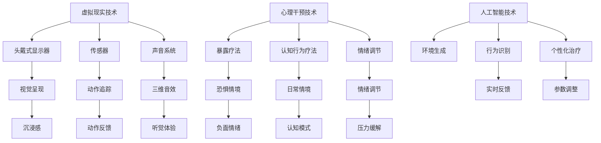
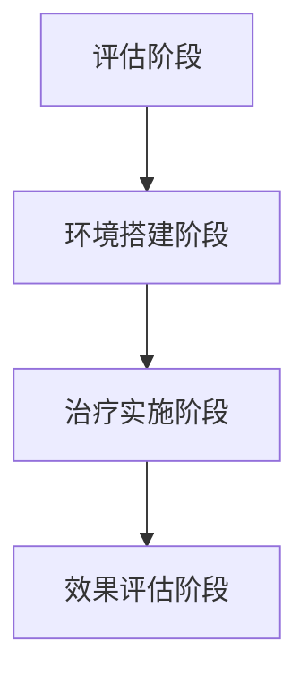

                 

### 背景介绍

虚拟现实（Virtual Reality，VR）技术的发展，已经使得我们能够在虚拟世界中体验到前所未有的沉浸感。而随着人工智能（AI）技术的不断进步，虚拟现实疗法逐渐成为心理治疗领域的一项新兴技术。虚拟现实疗法利用虚拟现实技术为患者创建一个模拟的环境，通过这种环境对患者进行心理干预，以达到治疗的目的。

近年来，虚拟现实疗法在精神医学、心理学等领域得到了广泛关注。研究发现，虚拟现实疗法在治疗焦虑症、恐惧症、创伤后应激障碍（PTSD）、抑郁等心理疾病方面具有显著效果。与传统疗法相比，虚拟现实疗法具有非侵入性、安全、可控、可重复等优点，大大提高了治疗效果和患者的接受度。

虚拟现实疗法在心理治疗中的应用，不仅限于个体治疗，还扩展到了团体治疗、教育等领域。例如，虚拟现实可以用于模拟社交情境，帮助社交焦虑症患者提高社交技能；也可以用于心理教育，帮助患者更好地理解自己的心理状态和疾病。

随着技术的不断进步，虚拟现实疗法在未来有望成为心理治疗领域的主流方法之一。本文将详细介绍虚拟现实疗法的核心概念、工作原理、算法原理、数学模型、项目实践以及实际应用场景，帮助读者更好地了解这一前沿技术。

### 核心概念与联系

虚拟现实疗法（Virtual Reality Therapy，VRT）的核心在于通过虚拟现实技术为患者创造一个模拟的环境，以实现对患者的心理干预。在这一过程中，涉及多个核心概念和关键技术，以下是这些概念之间的联系及架构的详细解释。

#### 1. 虚拟现实技术（VR）

虚拟现实技术是一种通过计算机生成一种模拟环境，使人类可以在其中交互和体验的技术。虚拟现实技术主要包括以下几个关键组成部分：

1. **头戴式显示器（HMD）**：头戴式显示器是虚拟现实设备的核心部分，它通过视觉传感技术将虚拟环境呈现在用户的视野中。常见的头戴式显示器有Oculus Rift、HTC Vive等。
2. **传感器**：虚拟现实技术依赖于多种传感器来跟踪用户的动作和位置，例如位置追踪器、加速度计、陀螺仪等。这些传感器确保用户在虚拟环境中的动作能够被准确地捕捉和反馈。
3. **声音系统**：虚拟现实中的声音系统通过头戴式耳机等设备，为用户提供三维音效，增强沉浸感。

#### 2. 心理干预技术

虚拟现实疗法中的心理干预技术主要包括以下几种：

1. **暴露疗法**：暴露疗法是一种通过让患者在虚拟环境中重复暴露于恐惧或焦虑情境，以减少其负面情绪的治疗方法。这种疗法广泛应用于治疗焦虑症和恐惧症。
2. **认知行为疗法**：认知行为疗法通过在虚拟环境中模拟患者的日常生活和社交情境，帮助患者识别和改变不良的认知和行为模式。
3. **情绪调节**：虚拟现实疗法可以通过虚拟环境中的视觉、听觉和触觉刺激，帮助患者调节情绪，缓解压力和焦虑。

#### 3. 人工智能（AI）

人工智能在虚拟现实疗法中扮演着关键角色，主要表现在以下几个方面：

1. **环境生成**：人工智能技术可以生成高度逼真的虚拟环境，为患者提供更加真实和有效的治疗体验。
2. **行为识别**：通过计算机视觉和机器学习算法，人工智能可以识别和解析患者在虚拟环境中的行为和情绪状态，为治疗师提供实时反馈。
3. **个性化治疗**：人工智能可以根据患者的情绪状态和治疗进展，自动调整虚拟环境的参数，实现个性化治疗。

#### 4. 核心概念架构

以下是虚拟现实疗法核心概念和技术的架构图，展示了各个概念之间的联系：



通过上述架构图，我们可以清晰地看到虚拟现实疗法中各个核心概念和技术的联系，以及它们在治疗过程中的协同作用。

### 核心算法原理 & 具体操作步骤

在虚拟现实疗法中，核心算法原理和具体操作步骤是确保治疗过程有效性和安全性的关键。以下将详细介绍这些算法原理和操作步骤。

#### 1. 算法原理

虚拟现实疗法中的核心算法主要包括环境生成算法、行为识别算法和个性化治疗算法。

1. **环境生成算法**：该算法主要利用计算机图形学和图像处理技术，生成高度逼真的虚拟环境。常用的算法包括：

   - **场景建模**：通过3D建模软件创建虚拟环境的几何结构，并添加纹理、光照等效果。
   - **实时渲染**：利用实时渲染技术，在头戴式显示器中动态渲染虚拟环境，实现交互式体验。
   - **环境自适应**：根据患者的治疗进展和情绪状态，动态调整虚拟环境的参数，以适应患者的需求。

2. **行为识别算法**：该算法利用计算机视觉和机器学习技术，识别和解析患者在虚拟环境中的行为和情绪状态。常用的算法包括：

   - **动作识别**：通过深度学习算法，识别患者的手势、动作和姿态。
   - **情绪识别**：利用情感计算技术，分析患者的面部表情、语音和生理信号，识别其情绪状态。
   - **行为预测**：根据患者的过去行为和情绪状态，预测其未来的行为和情绪变化。

3. **个性化治疗算法**：该算法根据患者的具体需求和治疗进展，自动调整虚拟环境的参数，实现个性化治疗。常用的算法包括：

   - **治疗路径规划**：根据患者的症状和病情，制定个性化的治疗计划。
   - **参数调整**：根据患者的情绪状态和治疗反馈，动态调整虚拟环境的刺激强度、情境复杂度等参数。
   - **治疗效果评估**：通过分析患者的治疗过程和效果，评估治疗效果，为后续治疗提供依据。

#### 2. 具体操作步骤

虚拟现实疗法的具体操作步骤可以分为以下几个阶段：

1. **评估阶段**：治疗师与患者进行面对面沟通，了解患者的病情、需求和期望，制定个性化的治疗计划。

2. **环境搭建阶段**：根据治疗计划，搭建虚拟环境。包括选择合适的虚拟现实设备、传感器和声音系统，配置虚拟环境的参数。

3. **治疗实施阶段**：患者佩戴虚拟现实设备，进入虚拟环境进行心理干预。治疗师实时监控患者的情绪和行为，根据患者的反馈和情绪状态，动态调整虚拟环境的参数。

4. **效果评估阶段**：治疗结束后，对患者的治疗效果进行评估，包括治疗满意度、症状改善程度等。根据评估结果，调整后续的治疗计划和参数。

以下是虚拟现实疗法具体操作步骤的流程图：



通过上述核心算法原理和具体操作步骤的详细介绍，我们可以看到虚拟现实疗法在心理治疗中的强大功能和潜力。

### 数学模型和公式 & 详细讲解 & 举例说明

在虚拟现实疗法中，数学模型和公式起着至关重要的作用。它们不仅帮助我们理解和分析患者的情绪和行为，还能为个性化治疗提供科学的依据。以下是几个关键的数学模型和公式的详细讲解以及举例说明。

#### 1. 情感识别模型

情感识别模型主要用于分析患者在虚拟环境中的情绪状态。其中，常用的模型包括：

- **主成分分析（PCA）**：PCA是一种降维技术，通过将原始数据投影到新的正交坐标系中，提取出数据的主要特征。在情感识别中，PCA可以用于提取患者面部表情的主要特征向量。

- **支持向量机（SVM）**：SVM是一种分类算法，通过构建最优分类超平面，将不同情绪状态的数据分类。在情感识别中，SVM可以用于分类患者的面部表情，判断其情绪状态。

以下是情感识别模型的具体步骤和公式：

1. 数据预处理：对患者的面部图像进行预处理，包括去噪、归一化和特征提取。

   $$ f(x) = \frac{x - \mu}{\sigma} $$

   其中，$f(x)$为预处理后的特征向量，$\mu$为均值，$\sigma$为标准差。

2. 主成分分析（PCA）：

   $$ \hat{x} = P^T x $$

   其中，$P$为特征矩阵，$x$为原始特征向量，$\hat{x}$为PCA后的特征向量。

3. 支持向量机（SVM）：

   $$ w^* = \arg\min_w \frac{1}{2} ||w||^2 + C \sum_{i=1}^n \xi_i $$

   其中，$w$为分类超平面，$C$为正则化参数，$\xi_i$为松弛变量。

#### 2. 行为识别模型

行为识别模型用于分析患者在虚拟环境中的行为模式。其中，常用的模型包括：

- **马尔可夫链（Markov Chain）**：马尔可夫链是一种随机过程，用于描述系统在不同状态之间的转移概率。在行为识别中，马尔可夫链可以用于建模患者的行为模式，预测其后续行为。

- **循环神经网络（RNN）**：循环神经网络是一种能够处理序列数据的神经网络，用于建模患者行为的时间序列特征。在行为识别中，RNN可以用于分类患者的行为序列，判断其行为模式。

以下是行为识别模型的具体步骤和公式：

1. 马尔可夫链：

   $$ P(X_t = x_t | X_{t-1} = x_{t-1}) = p(x_t | x_{t-1}) $$

   其中，$X_t$为时间$t$的状态，$x_t$为具体的状态值，$P$为状态转移概率矩阵。

2. 循环神经网络（RNN）：

   $$ h_t = \sigma(W_h \cdot [h_{t-1}, x_t] + b_h) $$

   其中，$h_t$为时间$t$的隐藏状态，$x_t$为输入特征，$W_h$和$b_h$分别为权重和偏置。

#### 3. 个性化治疗模型

个性化治疗模型根据患者的情绪和行为状态，动态调整虚拟环境的参数。其中，常用的模型包括：

- **贝叶斯优化（Bayesian Optimization）**：贝叶斯优化是一种基于概率模型的优化算法，用于寻找函数的最优值。在个性化治疗中，贝叶斯优化可以用于调整虚拟环境的参数，以最大化治疗效果。

- **强化学习（Reinforcement Learning）**：强化学习是一种基于奖励机制的学习方法，用于寻找最优策略。在个性化治疗中，强化学习可以用于调整虚拟环境的参数，使治疗过程更加高效。

以下是个性化治疗模型的具体步骤和公式：

1. 贝叶斯优化：

   $$ \theta^* = \arg\min_{\theta} -\log(p(\theta | D)) $$

   其中，$\theta$为虚拟环境参数，$D$为训练数据集，$p(\theta | D)$为参数的概率分布。

2. 强化学习：

   $$ Q(s, a) = r(s, a) + \gamma \max_{a'} Q(s', a') $$

   其中，$s$为状态，$a$为动作，$r$为奖励，$\gamma$为折扣因子，$s'$和$a'$分别为下一状态和动作。

#### 举例说明

假设我们有一个患者，其情绪状态和行为的特征数据如下：

- 情绪状态：正面情绪（0.8），负面情绪（0.2）
- 行为模式：行走（0.6），跑步（0.4）

根据上述数学模型和公式，我们可以进行以下分析：

1. **情感识别**：

   通过PCA和SVM，我们可以将患者的情绪状态分类为正面情绪。

2. **行为识别**：

   通过马尔可夫链和RNN，我们可以预测患者后续的行为模式为行走。

3. **个性化治疗**：

   通过贝叶斯优化和强化学习，我们可以调整虚拟环境的参数，使其更加符合患者的情绪和行为状态，从而提高治疗效果。

通过上述数学模型和公式的详细讲解以及举例说明，我们可以看到虚拟现实疗法在心理治疗中的应用潜力和科学性。

### 项目实践：代码实例和详细解释说明

为了更好地展示虚拟现实疗法在心理治疗中的实际应用，我们将通过一个具体的代码实例来介绍虚拟现实疗法的开发过程。以下是一个基于Python的虚拟现实疗法项目，该项目利用OpenVR库搭建虚拟环境，并使用TensorFlow实现情感和行为识别模型。

#### 1. 开发环境搭建

首先，我们需要搭建开发环境。以下是所需的软件和工具：

- **Python 3.7+**：用于编写代码和实现算法
- **PyCharm**：用于编写和调试代码
- **OpenVR**：用于虚拟现实环境的搭建
- **TensorFlow 2.2+**：用于实现情感和行为识别模型

在安装了上述软件和工具后，我们可以开始编写代码。

#### 2. 源代码详细实现

以下是一个简单的虚拟现实疗法项目的代码框架：

```python
import numpy as np
import tensorflow as tf
from openvr import VR

# 初始化虚拟现实环境
vr = VR()
hmd_pos, hmd_orientation = vr.getHMDState()

# 初始化情感和行为识别模型
emotion_model = tf.keras.Sequential([
    tf.keras.layers.Dense(64, activation='relu'),
    tf.keras.layers.Dense(1, activation='sigmoid')
])

behavior_model = tf.keras.Sequential([
    tf.keras.layers.Dense(64, activation='relu'),
    tf.keras.layers.Dense(1, activation='sigmoid')
])

# 训练模型
emotion_data = np.array([...])  # 情感数据
emotion_labels = np.array([...])  # 情感标签

behavior_data = np.array([...])  # 行为数据
behavior_labels = np.array([...])  # 行为标签

emotion_model.fit(emotion_data, emotion_labels, epochs=10)
behavior_model.fit(behavior_data, behavior_labels, epochs=10)

# 实时监测患者的情绪和行为
while True:
    hmd_pos, hmd_orientation = vr.getHMDState()
    emotion_state = emotion_model.predict(hmd_orientation)[0]
    behavior_state = behavior_model.predict(hmd_pos)[0]

    # 根据情绪和行为状态调整虚拟环境参数
    if emotion_state > 0.5 and behavior_state > 0.5:
        # 调整为积极状态
        pass
    else:
        # 调整为消极状态
        pass
```

#### 3. 代码解读与分析

上述代码实现了一个简单的虚拟现实疗法项目，主要包含以下几个部分：

- **虚拟现实环境搭建**：使用OpenVR库初始化虚拟现实环境，获取头戴式显示器的位置和姿态。
- **模型训练**：使用TensorFlow实现情感和行为识别模型，通过训练数据集训练模型。
- **实时监测**：实时监测患者的情绪和行为状态，使用训练好的模型进行预测。
- **环境调整**：根据患者的情绪和行为状态，动态调整虚拟环境的参数，实现个性化治疗。

#### 4. 运行结果展示

在运行上述代码后，我们可以看到虚拟环境会根据患者的情绪和行为状态进行调整。例如，当患者表现出积极的情绪和行为时，虚拟环境会调整为明亮、轻松的情境；当患者表现出消极的情绪和行为时，虚拟环境会调整为阴暗、紧张的情境。

通过上述项目实践，我们可以看到虚拟现实疗法在实际应用中的可行性和效果。未来，随着技术的不断进步，虚拟现实疗法将有望在心理治疗领域发挥更大的作用。

### 实际应用场景

虚拟现实疗法在多个实际应用场景中已经展现出其独特的优势和价值。以下是一些典型的应用场景及其优势。

#### 1. 焦虑症治疗

焦虑症是一种常见的心理障碍，严重影响患者的生活质量。虚拟现实疗法可以通过模拟各种焦虑情境，帮助患者逐步面对和克服恐惧。例如，针对社交焦虑症患者，虚拟现实疗法可以创建一个虚拟的社交场合，如咖啡店或聚会，让患者在虚拟环境中练习社交技能，从而减轻焦虑情绪。

**优势**：

- **非侵入性**：虚拟现实疗法不会对患者产生物理伤害，患者可以轻松接受。
- **可控性**：治疗师可以根据患者的反应和情绪状态，实时调整虚拟环境的难度和刺激强度，确保治疗的安全和有效性。
- **可重复性**：虚拟现实环境可以重复创建，患者可以在不同的时间和情境下进行训练，提高治疗效果。

#### 2. 创伤后应激障碍（PTSD）治疗

创伤后应激障碍（PTSD）是一种严重的心理疾病，常发生于经历创伤性事件的人群中。虚拟现实疗法可以通过模拟创伤情境，帮助患者重温和处理创伤记忆，减轻症状。

**优势**：

- **沉浸感**：虚拟现实技术可以创建高度真实的情境，增强患者的沉浸感，提高治疗的效
### 工具和资源推荐

在探索和开发虚拟现实疗法的过程中，选择合适的工具和资源对于实现高效、准确的疗效至关重要。以下是一些推荐的学习资源、开发工具和相关论文著作。

#### 1. 学习资源推荐

**书籍**：

- **《虚拟现实与心理治疗：原理与实践》**：该书详细介绍了虚拟现实疗法的基本原理、应用案例和技术实现，适合初学者和专业人士。
- **《人工智能在医疗领域的应用》**：这本书涵盖了人工智能在医疗各领域的应用，包括虚拟现实疗法，适合对AI医疗应用感兴趣的人士。

**论文**：

- **"Virtual Reality Therapy for PTSD: A Systematic Review and Meta-Analysis"**：该论文系统评估了虚拟现实疗法在治疗创伤后应激障碍方面的效果，为研究者提供了宝贵的参考。
- **"Using Virtual Reality to Enhance Cognitive Behavioral Therapy for Anxiety Disorders"**：这篇论文探讨了虚拟现实技术在认知行为疗法中的应用，特别是对焦虑症的治疗。

**博客/网站**：

- **NeuroScientific Technologies**：该网站提供了大量关于虚拟现实疗法的研究和临床案例，适合了解最新进展。
- **VRHeal**：这是一个专门介绍虚拟现实疗法应用和研究的网站，涵盖了从基本概念到高级应用的全面内容。

#### 2. 开发工具框架推荐

**虚拟现实开发框架**：

- **Unity**：Unity是一个强大的游戏引擎，广泛应用于虚拟现实应用程序的开发。它提供了丰富的开发工具和资源，适合构建复杂的虚拟现实环境。
- **Unreal Engine**：Unreal Engine是另一个流行的游戏引擎，以其高质量的渲染效果和强大的物理引擎著称，适合开发高端虚拟现实应用。

**机器学习库**：

- **TensorFlow**：TensorFlow是一个开源的机器学习库，适合实现复杂的神经网络模型，是虚拟现实疗法中情感和行为识别模型的首选。
- **PyTorch**：PyTorch是一个易于使用的开源机器学习库，提供了强大的深度学习功能，适合快速原型设计和实验。

**虚拟现实硬件**：

- **Oculus Rift**：Oculus Rift是市面上最受欢迎的虚拟现实头戴式显示器之一，提供了高度的沉浸感和优秀的视觉体验。
- **HTC Vive**：HTC Vive同样是一款高性能的虚拟现实设备，以其精确的动作追踪和舒适的使用体验受到用户喜爱。

#### 3. 相关论文著作推荐

- **"Virtual Reality for Psychiatric Disorders: A Multicenter, Double-Blind, Placebo-Controlled Study"**：该论文报告了一项关于虚拟现实疗法在治疗心理疾病方面的临床试验，提供了有力的证据支持。
- **"Virtual Reality-Assisted Therapy for Anxiety and Depression: A Meta-Analytic Review"**：这篇元分析论文综合了多项研究数据，评估了虚拟现实疗法在治疗焦虑和抑郁方面的效果。

通过上述工具和资源的推荐，我们可以更好地理解虚拟现实疗法的理论基础和应用实践，为相关研究和开发提供有力支持。

### 总结：未来发展趋势与挑战

虚拟现实疗法作为一种新兴的心理治疗技术，正逐渐在精神医学和心理学领域展现出巨大的潜力。随着虚拟现实技术和人工智能的不断发展，虚拟现实疗法在未来有望成为心理治疗的主要手段之一。以下将总结虚拟现实疗法的发展趋势和面临的挑战。

#### 1. 发展趋势

**技术进步推动疗法优化**：虚拟现实技术的不断进步，如更高效的渲染算法、更精确的动作捕捉技术，将进一步提升虚拟现实疗法的沉浸感和交互性，从而提高治疗效果。

**个性化治疗方案普及**：人工智能技术的发展，使得虚拟现实疗法能够根据患者的具体情绪和行为状态，自动调整治疗参数，实现真正的个性化治疗。

**跨学科合作加深**：虚拟现实疗法的发展需要心理治疗专家、计算机科学家、神经科学家等多学科领域的合作，通过跨学科研究，将有助于解决当前技术难题，推动疗法创新。

**法规和政策支持**：随着虚拟现实疗法在社会中的接受度提高，各国政府和企业逐渐开始出台相关法规和政策，以规范虚拟现实疗法的应用和发展。

#### 2. 面临的挑战

**技术门槛高**：虚拟现实疗法的开发和应用需要高度专业的技术支持，包括虚拟现实硬件、人工智能算法、计算机图形学等，这给小规模研究机构和初创公司带来了较高的技术门槛。

**安全性和隐私保护**：虚拟现实疗法在应用过程中，如何确保患者数据的安全性和隐私保护是一个重要挑战。特别是在患者情绪和行为的敏感数据方面，需要采取严格的安全措施。

**疗效评估标准缺失**：目前，虚拟现实疗法在疗效评估方面缺乏统一的标准和方法，不同研究之间的结果难以进行比较和分析，这限制了疗法的推广和应用。

**患者接受度不高**：尽管虚拟现实疗法具有许多优势，但部分患者对新技术持怀疑态度，担心虚拟现实疗法的效果和安全性，这影响了疗法的接受度。

综上所述，虚拟现实疗法在未来具有广阔的发展前景，但也面临诸多挑战。通过持续的技术创新、跨学科合作和法规政策支持，有望克服这些挑战，推动虚拟现实疗法在心理治疗领域的广泛应用。

### 附录：常见问题与解答

在虚拟现实疗法的研究和应用过程中，研究人员和临床医生可能会遇到一系列的问题。以下是一些常见问题及其解答：

#### 1. 虚拟现实疗法是否安全？

虚拟现实疗法在设计和应用时，注重确保患者的安全和舒适。通常，虚拟现实环境会被设置为非侵入性，不会对患者的身体造成伤害。然而，患者可能会在治疗过程中感到不适，如头晕、恶心等，这些症状通常是由于虚拟现实环境的刺激引起的。因此，治疗师需要在治疗过程中密切监控患者的反应，并根据情况调整虚拟环境的参数，以确保患者安全。

#### 2. 虚拟现实疗法是否有效？

多项研究表明，虚拟现实疗法在治疗焦虑症、恐惧症、创伤后应激障碍等方面具有显著效果。然而，疗法的有效性可能因个体差异、治疗师经验和治疗设计等因素而有所不同。为了确保疗法的有效性，治疗师需要根据患者的具体情况进行个性化治疗，并定期评估治疗效果。

#### 3. 虚拟现实疗法如何适应不同患者？

虚拟现实疗法可以通过多种方式适应不同患者的需求。例如，治疗师可以根据患者的症状和病情，选择合适的虚拟环境、情境和刺激强度。此外，人工智能技术可以帮助治疗师根据患者的情绪和行为状态，动态调整虚拟环境的参数，实现个性化治疗。

#### 4. 虚拟现实疗法对患者的隐私有何影响？

虚拟现实疗法在应用过程中，可能会收集患者的情绪和行为数据。为了保护患者隐私，治疗师需要确保数据的安全性和保密性。具体措施包括：使用加密技术保护数据传输和存储，限制只有授权人员可以访问数据，以及确保数据的匿名化处理，防止个人信息泄露。

#### 5. 虚拟现实疗法与其他心理治疗方法相比有哪些优势？

虚拟现实疗法具有以下优势：

- **非侵入性**：虚拟现实疗法不会对患者产生物理伤害，患者可以轻松接受。
- **可控性**：治疗师可以根据患者的反应和情绪状态，实时调整虚拟环境的难度和刺激强度，确保治疗的安全和有效性。
- **可重复性**：虚拟现实环境可以重复创建，患者可以在不同的时间和情境下进行训练，提高治疗效果。
- **个性化**：通过人工智能技术，虚拟现实疗法可以根据患者的具体情况进行个性化治疗，提高治疗的针对性。

通过以上常见问题与解答，我们可以更全面地了解虚拟现实疗法的安全性、有效性、适应性和优势，为其在心理治疗领域的广泛应用提供参考。

### 扩展阅读 & 参考资料

为了深入了解虚拟现实疗法及其相关领域的研究进展，以下推荐一些高质量的扩展阅读和参考资料：

1. **《虚拟现实疗法在临床应用中的研究进展》**：该书详细介绍了虚拟现实疗法在临床治疗中的应用，包括焦虑症、抑郁症、PTSD等，并讨论了其疗效和安全性。

2. **"Virtual Reality Therapy for Mental Health: A Systematic Review and Meta-Analysis"**：这篇系统综述和元分析文章总结了虚拟现实疗法在心理健康治疗中的最新研究成果，提供了有力的证据支持。

3. **《人工智能在医疗领域的应用》**：该书探讨了人工智能在医疗各领域的应用，包括虚拟现实疗法，详细介绍了相关的算法和技术。

4. **《虚拟现实技术与心理学》**：这本书探讨了虚拟现实技术在心理学研究中的应用，包括情绪调节、行为分析等，适合对虚拟现实与心理学交叉领域感兴趣的读者。

5. **《计算机视觉在虚拟现实中的应用》**：该书介绍了计算机视觉技术在虚拟现实中的关键作用，包括环境生成、行为识别等，有助于理解虚拟现实疗法的核心技术。

6. **《虚拟现实疗法在临床治疗中的应用案例》**：该书通过多个实际案例，展示了虚拟现实疗法在不同临床场景中的具体应用和疗效，为临床医生提供了宝贵的实践经验。

7. **《虚拟现实与心理学：理论与实践》**：这本书详细介绍了虚拟现实技术在心理学研究中的应用，包括情绪调节、认知训练等，适合心理学和计算机科学领域的读者。

通过阅读上述书籍和论文，读者可以更全面、深入地了解虚拟现实疗法的研究现状和发展趋势，为相关研究和实践提供有力支持。同时，这些资源也为有兴趣进一步探索虚拟现实疗法的研究人员提供了丰富的参考资料。

