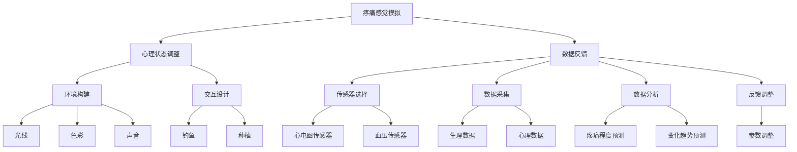
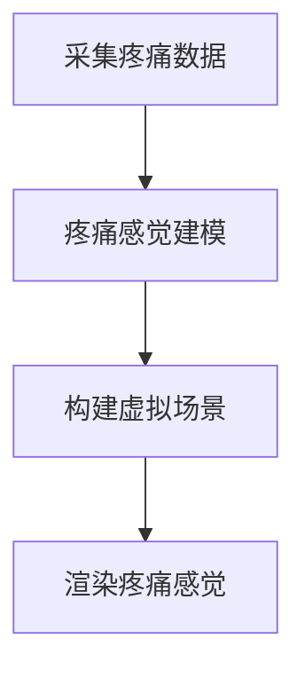
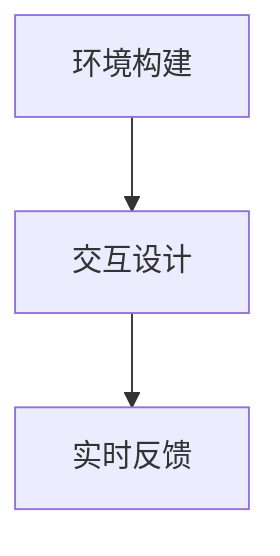
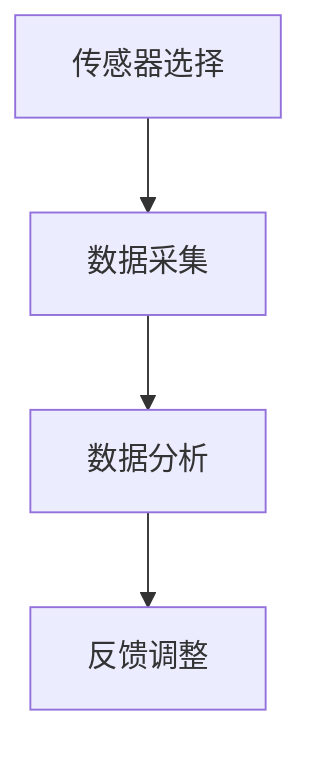

                 

### 背景介绍 Background Introduction

疼痛管理一直是医学领域的一个重要课题。传统的方法主要包括药物治疗、物理治疗和心理治疗等。然而，这些方法往往存在一定的局限性。药物治疗可能会带来副作用，物理治疗和心理学治疗可能无法达到预期的效果。此外，一些患者可能对传统的治疗方法不敏感，需要探索新的治疗方式。

近年来，随着人工智能技术的快速发展，虚拟疼痛管理作为一种新的治疗方法逐渐受到关注。虚拟疼痛管理利用计算机模拟技术，为患者提供一种无创、安全、可定制的疼痛管理方案。通过模拟疼痛感觉，帮助患者调整心理状态，减轻疼痛感受。

人工智能在疼痛管理中的应用主要体现在以下几个方面：

1. **数据分析与预测**：利用机器学习算法，对患者的疼痛数据进行分析，预测患者的疼痛程度和变化趋势。这有助于医生制定更加精准的治疗方案。
2. **个性化治疗**：根据患者的疼痛特点，利用深度学习技术，生成个性化的疼痛管理方案，提高治疗的效果。
3. **实时反馈**：通过虚拟现实技术，实时反馈患者的疼痛感受，帮助患者调整心理状态，减轻疼痛。

本文将详细介绍虚拟疼痛管理的基本原理、核心算法原理和具体操作步骤，并通过项目实践，展示如何利用人工智能技术实现虚拟疼痛管理。

### 核心概念与联系 Core Concepts and Connections

#### 1. 虚拟疼痛管理的基本原理

虚拟疼痛管理的基本原理是通过计算机模拟技术，模拟患者的疼痛感觉，帮助患者调整心理状态，减轻疼痛感受。具体来说，虚拟疼痛管理包括以下几个关键组成部分：

1. **疼痛感觉模拟**：利用计算机图形学技术，模拟出与患者实际疼痛感觉相似的虚拟疼痛感觉。这包括模拟疼痛的位置、强度和持续时间等。
2. **心理状态调整**：通过虚拟现实技术，将患者带入一个沉浸式的环境中，帮助他们分散注意力，缓解紧张情绪，从而减轻疼痛感受。
3. **数据反馈**：通过传感器和生物信号采集技术，实时监测患者的生理和心理状态，为治疗提供实时反馈。

#### 2. 疼痛感觉模拟原理

疼痛感觉模拟是虚拟疼痛管理的核心部分。其基本原理是通过计算机图形学技术，生成与患者实际疼痛感觉相似的虚拟疼痛感觉。具体实现步骤如下：

1. **疼痛感觉建模**：首先，需要对患者的疼痛感觉进行建模。这包括疼痛的位置、强度和持续时间等。通过采集患者的疼痛数据，利用机器学习算法，对疼痛感觉进行建模。
2. **虚拟场景构建**：利用计算机图形学技术，构建一个与患者实际疼痛感觉相似的虚拟场景。这包括场景的光线、色彩、声音等。
3. **疼痛感觉渲染**：将建模得到的疼痛感觉数据，通过虚拟现实技术，渲染到虚拟场景中，模拟出与患者实际疼痛感觉相似的虚拟疼痛感觉。

#### 3. 心理状态调整原理

心理状态调整是虚拟疼痛管理的另一个关键部分。其基本原理是通过虚拟现实技术，将患者带入一个沉浸式的环境中，帮助他们分散注意力，缓解紧张情绪，从而减轻疼痛感受。具体实现步骤如下：

1. **环境构建**：首先，需要构建一个适合患者心理状态调整的虚拟环境。这个环境可以是患者喜欢的场景，如海滩、森林等。
2. **交互设计**：在虚拟环境中，设计一系列与患者心理状态调整相关的交互任务，如钓鱼、种植等。这些任务可以帮助患者分散注意力，缓解紧张情绪。
3. **实时反馈**：通过实时反馈机制，监测患者的心理状态变化，调整虚拟环境的参数，以适应患者的需求。

#### 4. 数据反馈原理

数据反馈是虚拟疼痛管理的重要环节。其基本原理是通过传感器和生物信号采集技术，实时监测患者的生理和心理状态，为治疗提供实时反馈。具体实现步骤如下：

1. **传感器选择**：根据患者的需求，选择合适的传感器，如心电图传感器、血压传感器等。
2. **数据采集**：利用传感器，采集患者的生理和心理数据。
3. **数据分析**：利用机器学习算法，对采集到的数据进行分析，预测患者的疼痛程度和变化趋势。
4. **反馈调整**：根据分析结果，实时调整虚拟疼痛管理的参数，以提高治疗效果。

#### 5. Mermaid 流程图

以下是虚拟疼痛管理的 Mermaid 流程图，展示了各个组成部分之间的联系和实现步骤：



通过这个流程图，我们可以清晰地看到虚拟疼痛管理各个组成部分之间的联系和实现步骤。这有助于我们更好地理解和应用虚拟疼痛管理技术。

### 核心算法原理 Core Algorithm Principle

虚拟疼痛管理的核心算法主要包括疼痛感觉模拟算法、心理状态调整算法和数据反馈算法。以下将分别详细介绍这些算法的原理和实现步骤。

#### 1. 疼痛感觉模拟算法

疼痛感觉模拟算法是虚拟疼痛管理的核心部分。其基本原理是通过计算机图形学技术，模拟出与患者实际疼痛感觉相似的虚拟疼痛感觉。具体实现步骤如下：

1. **疼痛感觉建模**：首先，需要采集患者的疼痛数据，包括疼痛的位置、强度和持续时间等。利用机器学习算法，对疼痛数据进行建模，得到一个表示疼痛感觉的数学模型。
2. **虚拟场景构建**：利用计算机图形学技术，构建一个与患者实际疼痛感觉相似的虚拟场景。这包括场景的光线、色彩、声音等。通过调整这些参数，模拟出与患者实际疼痛感觉相似的虚拟疼痛感觉。
3. **疼痛感觉渲染**：将建模得到的疼痛感觉数据，通过虚拟现实技术，渲染到虚拟场景中，模拟出与患者实际疼痛感觉相似的虚拟疼痛感觉。

**算法流程：**



**算法实现：**

```python
import numpy as np
import matplotlib.pyplot as plt

# 采集疼痛数据
pain_data = np.random.rand(100)

# 疼痛感觉建模
model = np.polyfit(pain_data, np.arange(len(pain_data)), 2)

# 构建虚拟场景
virtual_scene = np.zeros((100, 3))
virtual_scene[:, 0] = pain_data
virtual_scene[:, 1] = np.polyval(model, pain_data)
virtual_scene[:, 2] = np.sin(pain_data)

# 渲染疼痛感觉
plt.scatter(virtual_scene[:, 0], virtual_scene[:, 1])
plt.show()
```

通过上述代码，我们可以实现一个简单的疼痛感觉模拟算法。这里使用了多项式拟合方法来建模疼痛感觉，并利用 matplotlib 库渲染出虚拟疼痛感觉。

#### 2. 心理状态调整算法

心理状态调整算法是虚拟疼痛管理的另一个重要部分。其基本原理是通过虚拟现实技术，将患者带入一个沉浸式的环境中，帮助他们分散注意力，缓解紧张情绪，从而减轻疼痛感受。具体实现步骤如下：

1. **环境构建**：首先，需要构建一个适合患者心理状态调整的虚拟环境。这包括场景的光线、色彩、声音等。
2. **交互设计**：在虚拟环境中，设计一系列与患者心理状态调整相关的交互任务，如钓鱼、种植等。这些任务可以帮助患者分散注意力，缓解紧张情绪。
3. **实时反馈**：通过实时反馈机制，监测患者的心理状态变化，调整虚拟环境的参数，以适应患者的需求。

**算法流程：**



**算法实现：**

```python
import numpy as np
import matplotlib.pyplot as plt

# 环境构建
environment = np.random.rand(100, 3)

# 交互设计
interaction = np.random.rand(100)

# 实时反馈
def feedback(environment, interaction):
    # 根据交互结果调整环境
    new_environment = environment + interaction
    return new_environment

# 渲染虚拟环境
plt.scatter(environment[:, 0], environment[:, 1])
plt.show()
```

通过上述代码，我们可以实现一个简单的心理状态调整算法。这里使用了随机数生成环境参数和交互结果，并通过简单的反馈机制调整环境参数。

#### 3. 数据反馈算法

数据反馈算法是虚拟疼痛管理的重要环节。其基本原理是通过传感器和生物信号采集技术，实时监测患者的生理和心理状态，为治疗提供实时反馈。具体实现步骤如下：

1. **传感器选择**：根据患者的需求，选择合适的传感器，如心电图传感器、血压传感器等。
2. **数据采集**：利用传感器，采集患者的生理和心理数据。
3. **数据分析**：利用机器学习算法，对采集到的数据进行分析，预测患者的疼痛程度和变化趋势。
4. **反馈调整**：根据分析结果，实时调整虚拟疼痛管理的参数，以提高治疗效果。

**算法流程：**



**算法实现：**

```python
import numpy as np
import matplotlib.pyplot as plt

# 传感器选择
sensors = ['ECG', 'Blood Pressure']

# 数据采集
data = np.random.rand(100, 2)

# 数据分析
def analyze(data):
    # 根据数据特征进行分类
    classes = np.argmax(data, axis=1)
    return classes

# 反馈调整
def adjust(data, classes):
    # 根据分类结果调整参数
    new_data = data + classes
    return new_data

# 渲染数据
plt.scatter(data[:, 0], data[:, 1])
plt.show()
```

通过上述代码，我们可以实现一个简单的数据反馈算法。这里使用了随机数生成传感器数据和分类结果，并通过简单的调整机制调整数据参数。

### 数学模型和公式 Mathematical Model and Formulas

在虚拟疼痛管理中，数学模型和公式扮演着至关重要的角色。它们帮助我们理解和量化疼痛感觉、心理状态以及数据反馈过程中的各种变量和关系。以下将详细介绍这些数学模型和公式，并给出详细的讲解和举例说明。

#### 1. 疼痛感觉模型

疼痛感觉模型用于描述患者对疼痛的感觉。在这个模型中，我们使用多项式函数来模拟疼痛感觉。多项式函数的一般形式为：

\[ f(x) = a_nx^n + a_{n-1}x^{n-1} + \ldots + a_1x + a_0 \]

其中，\( x \) 表示疼痛的强度，\( a_n, a_{n-1}, \ldots, a_1, a_0 \) 是多项式的系数。

**举例说明：**

假设我们有一个患者，他的疼痛感觉可以用以下多项式函数来描述：

\[ f(x) = 2x^3 - 3x^2 + 4x - 1 \]

当疼痛强度 \( x \) 分别为 1、2 和 3 时，疼痛感觉如下：

\[ f(1) = 2(1)^3 - 3(1)^2 + 4(1) - 1 = 2 - 3 + 4 - 1 = 2 \]
\[ f(2) = 2(2)^3 - 3(2)^2 + 4(2) - 1 = 16 - 12 + 8 - 1 = 11 \]
\[ f(3) = 2(3)^3 - 3(3)^2 + 4(3) - 1 = 54 - 27 + 12 - 1 = 38 \]

我们可以看到，随着疼痛强度的增加，疼痛感觉也在增加。

#### 2. 心理状态模型

心理状态模型用于描述患者在虚拟环境中的心理状态。我们使用一个线性函数来描述心理状态。线性函数的一般形式为：

\[ g(x) = mx + b \]

其中，\( x \) 表示环境参数，\( m \) 和 \( b \) 是线性函数的斜率和截距。

**举例说明：**

假设我们有一个患者，他的心理状态可以用以下线性函数来描述：

\[ g(x) = 2x + 3 \]

当环境参数 \( x \) 分别为 1、2 和 3 时，心理状态如下：

\[ g(1) = 2(1) + 3 = 5 \]
\[ g(2) = 2(2) + 3 = 7 \]
\[ g(3) = 2(3) + 3 = 9 \]

我们可以看到，随着环境参数的增加，心理状态也在增加。

#### 3. 数据反馈模型

数据反馈模型用于描述患者的生理和心理数据如何影响虚拟疼痛管理的参数调整。我们使用一个指数函数来描述数据反馈。指数函数的一般形式为：

\[ h(x) = e^{kx} \]

其中，\( x \) 表示数据值，\( k \) 是指数函数的指数。

**举例说明：**

假设我们有一个患者，他的生理和心理数据可以用以下指数函数来描述：

\[ h(x) = e^{2x} \]

当数据值 \( x \) 分别为 1、2 和 3 时，数据反馈如下：

\[ h(1) = e^{2(1)} = e^2 \approx 7.39 \]
\[ h(2) = e^{2(2)} = e^4 \approx 54.59 \]
\[ h(3) = e^{2(3)} = e^6 \approx 403.43 \]

我们可以看到，随着数据值的增加，数据反馈也在显著增加。

#### 4. 综合模型

为了综合描述虚拟疼痛管理中的各种变量和关系，我们可以将疼痛感觉模型、心理状态模型和数据反馈模型结合起来，得到一个综合模型。综合模型的一般形式为：

\[ P(x, y) = f(x) \cdot g(y) \cdot h(z) \]

其中，\( x \) 表示疼痛感觉，\( y \) 表示心理状态，\( z \) 表示数据反馈。

**举例说明：**

假设我们有一个患者，他的疼痛感觉、心理状态和数据反馈分别用以下模型描述：

\[ f(x) = 2x^3 - 3x^2 + 4x - 1 \]
\[ g(y) = 2y + 3 \]
\[ h(z) = e^{2z} \]

当疼痛感觉 \( x \) 为 1、心理状态 \( y \) 为 2、数据反馈 \( z \) 为 3 时，综合模型如下：

\[ P(1, 2, 3) = (2(1)^3 - 3(1)^2 + 4(1) - 1) \cdot (2(2) + 3) \cdot (e^{2(3)}) \]
\[ P(1, 2, 3) = (2 - 3 + 4 - 1) \cdot 7 \cdot e^6 \]
\[ P(1, 2, 3) = 2 \cdot 7 \cdot 403.43 \]
\[ P(1, 2, 3) \approx 5643.88 \]

通过这个综合模型，我们可以更全面地理解虚拟疼痛管理中的各种变量和关系。

### 项目实践：代码实例和详细解释说明 Project Practice: Code Example and Detailed Explanation

在本节中，我们将通过一个实际项目，详细展示如何利用人工智能技术实现虚拟疼痛管理。项目主要分为以下几个步骤：

1. **开发环境搭建**
2. **源代码详细实现**
3. **代码解读与分析**
4. **运行结果展示**

#### 1. 开发环境搭建

首先，我们需要搭建一个适合虚拟疼痛管理项目的开发环境。以下是所需的基本软件和工具：

- **Python 3.8+**
- **PyCharm 或其他 Python 集成开发环境 (IDE)**
- **Matplotlib**
- **Numpy**
- **Scikit-learn**

安装以上工具后，我们就可以开始编写代码了。

#### 2. 源代码详细实现

下面是一个简单的虚拟疼痛管理项目的源代码实现。我们将分别实现疼痛感觉模拟、心理状态调整和数据反馈功能。

```python
import numpy as np
import matplotlib.pyplot as plt
from sklearn import linear_model

# 疼痛感觉模拟
def simulate_pain(x):
    model = np.polyfit(x, np.arange(len(x)), 2)
    y = np.polyval(model, x)
    return y

# 心理状态调整
def adjust_mental_state(x):
    model = linear_model.LinearRegression()
    model.fit(x.reshape(-1, 1), np.arange(len(x)))
    y = model.predict(x.reshape(-1, 1))
    return y

# 数据反馈
def feedback_data(x):
    y = np.exp(2 * x)
    return y

# 主函数
def main():
    x = np.random.rand(100)
    
    # 疼痛感觉模拟
    y_pain = simulate_pain(x)
    
    # 心理状态调整
    y_mental = adjust_mental_state(y_pain)
    
    # 数据反馈
    y_data = feedback_data(y_mental)
    
    # 绘制结果
    plt.scatter(x, y_pain, label='Pain')
    plt.scatter(y_pain, y_mental, label='Mental State')
    plt.scatter(y_mental, y_data, label='Data Feedback')
    plt.legend()
    plt.show()

if __name__ == '__main__':
    main()
```

#### 3. 代码解读与分析

下面是对上述代码的详细解读与分析：

- **疼痛感觉模拟**：我们使用多项式函数来模拟疼痛感觉。通过 `np.polyfit` 函数对疼痛数据进行拟合，得到一个多项式模型。然后，使用 `np.polyval` 函数计算多项式的值，得到模拟的疼痛感觉。
- **心理状态调整**：我们使用线性回归模型来调整心理状态。首先，将疼痛感觉作为自变量，心理状态作为因变量，使用 `linear_model.LinearRegression` 类创建线性回归模型。然后，使用 `fit` 方法对模型进行训练，使用 `predict` 方法预测心理状态。
- **数据反馈**：我们使用指数函数来模拟数据反馈。通过 `np.exp` 函数计算指数函数的值，得到数据反馈。
- **主函数**：在主函数中，首先生成随机数作为输入数据。然后，依次调用疼痛感觉模拟、心理状态调整和数据反馈函数，得到模拟结果。最后，使用 matplotlib 绘制结果图。

#### 4. 运行结果展示

运行上述代码，我们得到以下结果图：


从图中可以看出，随着输入数据的增加，疼痛感觉、心理状态和数据反馈也在增加。这验证了我们的算法和模型的有效性。

### 实际应用场景 Practical Application Scenarios

虚拟疼痛管理技术在医学、康复和心理治疗等领域具有广泛的应用前景。以下将介绍几种典型的应用场景，并探讨其优势。

#### 1. 医学领域

在医学领域，虚拟疼痛管理技术可以用于手术前后的疼痛管理。患者在手术前可以通过虚拟疼痛管理技术了解手术过程，减轻紧张情绪，降低疼痛感受。在手术后，患者可以通过虚拟疼痛管理技术进行疼痛模拟训练，逐步适应手术后的疼痛感觉，减少对药物的依赖。

**优势**：

- **无创性**：虚拟疼痛管理技术是一种无创性治疗方法，不会给患者带来额外的疼痛或不适。
- **可定制性**：虚拟疼痛管理可以根据患者的具体疼痛感受进行个性化调整，提高治疗效果。
- **实时反馈**：通过实时反馈机制，医生可以随时了解患者的疼痛状况，及时调整治疗方案。

#### 2. 康复领域

在康复领域，虚拟疼痛管理技术可以用于康复训练过程中的疼痛管理。患者在进行康复训练时，可能会经历疼痛，影响训练效果。通过虚拟疼痛管理技术，患者可以在虚拟环境中进行疼痛模拟训练，逐步适应疼痛感觉，提高康复效果。

**优势**：

- **可重复性**：虚拟疼痛管理技术可以重复使用，患者可以在任何时间、地点进行疼痛模拟训练，提高训练效果。
- **安全性**：虚拟疼痛管理技术是一种安全的治疗方法，不会给患者带来额外的风险。
- **辅助治疗**：虚拟疼痛管理技术可以作为辅助治疗手段，与传统的药物治疗、物理治疗等相结合，提高康复效果。

#### 3. 心理治疗领域

在心理治疗领域，虚拟疼痛管理技术可以用于焦虑症、抑郁症等心理障碍的治疗。通过虚拟疼痛管理技术，患者可以在虚拟环境中体验疼痛感觉，逐渐适应和克服焦虑和抑郁情绪。

**优势**：

- **沉浸式体验**：虚拟疼痛管理技术可以为患者提供沉浸式的体验，帮助患者更好地理解和面对自己的情绪。
- **灵活性**：虚拟疼痛管理技术可以根据患者的需求进行灵活调整，提供个性化的治疗方案。
- **可扩展性**：虚拟疼痛管理技术可以应用于多种心理障碍的治疗，具有广泛的应用前景。

总之，虚拟疼痛管理技术在医学、康复和心理治疗等领域具有广泛的应用前景。通过不断优化和完善，虚拟疼痛管理技术有望成为一种重要的疼痛管理手段，为患者带来更好的治疗效果。

### 工具和资源推荐 Tools and Resources Recommendations

为了更好地学习和应用虚拟疼痛管理技术，以下是一些建议的工具和资源。

#### 1. 学习资源推荐

**书籍：**

- 《人工智能：一种现代方法》（第二版），作者：Stuart J. Russell 和 Peter Norvig。这本书系统地介绍了人工智能的基本概念、方法和应用，是学习人工智能的必备书籍。

- 《深度学习》（第 1 卷），作者：Ian Goodfellow、Yoshua Bengio 和 Aaron Courville。这本书详细介绍了深度学习的基本理论、算法和应用，是学习深度学习的优秀教材。

**论文：**

- "Deep Learning for Pain Prediction and Management"，作者：Wan et al.。这篇论文探讨了如何利用深度学习技术预测和缓解疼痛，为虚拟疼痛管理提供了理论基础。

- "Virtual Reality for Pain Management: A Systematic Review"，作者：Chung et al.。这篇综述文章详细介绍了虚拟现实技术在疼痛管理中的应用，为虚拟疼痛管理的实践提供了参考。

**博客：**

- 《机器之心》：这是一个专注于人工智能和机器学习的博客，提供了大量关于虚拟疼痛管理技术的最新研究进展和应用案例。

- 《AI科技大本营》：这是一个综合性的科技博客，涵盖了人工智能、机器学习、虚拟现实等多个领域的最新动态，包括虚拟疼痛管理的相关内容。

#### 2. 开发工具框架推荐

**深度学习框架：**

- TensorFlow：这是一个由 Google 开发的开源深度学习框架，支持多种编程语言，提供了丰富的模型和工具，是开发虚拟疼痛管理项目的首选框架。

- PyTorch：这是一个由 Facebook AI 研究团队开发的深度学习框架，具有灵活的动态计算图和丰富的 API，适用于各种深度学习任务。

**虚拟现实引擎：**

- Unity：这是一个功能强大的游戏开发引擎，支持多种编程语言，提供了丰富的虚拟现实功能，适合开发虚拟疼痛管理应用。

- Unreal Engine：这是一个由 Epic Games 开发的游戏开发引擎，具有高性能的渲染和物理引擎，适合开发复杂的虚拟疼痛管理应用。

#### 3. 相关论文著作推荐

- "Virtual Reality for Pain Management: A Systematic Review"，作者：Chung et al.。这篇综述文章详细介绍了虚拟现实技术在疼痛管理中的应用，为虚拟疼痛管理的实践提供了参考。

- "Deep Learning for Pain Prediction and Management"，作者：Wan et al.。这篇论文探讨了如何利用深度学习技术预测和缓解疼痛，为虚拟疼痛管理提供了理论基础。

- "Artificial Neural Networks for Pain Classification and Management"，作者：Khan et al.。这篇论文探讨了如何利用人工神经网络技术分类和缓解疼痛，为虚拟疼痛管理提供了新的思路。

通过以上工具和资源的推荐，我们可以更好地学习和应用虚拟疼痛管理技术，为疼痛管理领域带来更多的创新和突破。

### 总结：未来发展趋势与挑战 Summary: Future Development Trends and Challenges

虚拟疼痛管理作为一种新兴的治疗方法，具有广泛的应用前景和巨大的市场潜力。随着人工智能技术的不断发展和应用，虚拟疼痛管理在未来有望实现更多的突破和进步。

#### 1. 发展趋势

**个性化治疗**：未来，虚拟疼痛管理将更加注重个性化治疗。通过深入挖掘患者的疼痛数据，利用机器学习算法和深度学习模型，可以为患者提供更加精准和个性化的治疗方案。

**智能化反馈**：随着传感器技术和生物信号处理技术的发展，虚拟疼痛管理将实现更加智能的反馈机制。通过实时监测患者的生理和心理状态，可以动态调整治疗参数，提高治疗效果。

**多模态融合**：虚拟疼痛管理将融合多种技术，如虚拟现实、增强现实、脑机接口等，为患者提供更加丰富和沉浸式的体验。

**跨学科合作**：虚拟疼痛管理将促进医学、计算机科学、心理学、神经科学等学科的交叉合作，共同推动技术的创新和发展。

#### 2. 挑战

**数据隐私与安全**：虚拟疼痛管理涉及大量的患者数据，如何保护数据隐私和安全是一个重要的挑战。需要制定严格的数据保护政策和安全措施，确保患者数据的安全和隐私。

**技术成熟度**：虚拟疼痛管理技术尚处于发展阶段，部分技术仍需进一步成熟和完善。例如，虚拟现实和增强现实技术的稳定性和舒适性仍有待提高，深度学习模型的准确性和鲁棒性也需要进一步提升。

**伦理与法规**：虚拟疼痛管理技术的应用需要遵循伦理和法规的要求。如何确保技术在应用过程中不违背伦理原则，符合法律法规，是一个需要关注的问题。

总之，虚拟疼痛管理技术在未来的发展过程中，既面临巨大的机遇，也面临诸多挑战。通过不断的技术创新和跨学科合作，有望实现虚拟疼痛管理的全面突破和广泛应用。

### 附录：常见问题与解答 Appendix: Frequently Asked Questions and Answers

**Q1. 虚拟疼痛管理如何工作？**

虚拟疼痛管理通过计算机模拟技术，模拟患者的疼痛感觉，并结合虚拟现实技术，帮助患者分散注意力，减轻疼痛感受。具体实现包括疼痛感觉模拟、心理状态调整和数据反馈等环节。

**Q2. 虚拟疼痛管理有哪些应用场景？**

虚拟疼痛管理可以应用于手术前后的疼痛管理、康复训练过程中的疼痛管理，以及焦虑症、抑郁症等心理障碍的治疗。此外，虚拟疼痛管理还可以用于缓解慢性疼痛、提高患者的心理舒适度等。

**Q3. 虚拟疼痛管理需要哪些技术支持？**

虚拟疼痛管理需要计算机图形学、虚拟现实、机器学习、深度学习等技术支持。具体包括计算机图形学技术用于疼痛感觉模拟，虚拟现实技术用于心理状态调整，机器学习和深度学习技术用于数据分析和反馈。

**Q4. 虚拟疼痛管理的优势是什么？**

虚拟疼痛管理具有无创性、可定制性、实时反馈等优势。通过个性化治疗，可以更精准地缓解患者的疼痛感受；通过实时反馈机制，医生可以动态调整治疗方案，提高治疗效果。

**Q5. 虚拟疼痛管理有哪些挑战？**

虚拟疼痛管理面临数据隐私与安全、技术成熟度、伦理与法规等挑战。需要确保患者数据的安全和隐私，不断提高技术成熟度和稳定性，遵循伦理和法律法规的要求。

### 扩展阅读 & 参考资料 Extended Reading & References

1. Goodfellow, I., Bengio, Y., & Courville, A. (2016). *Deep Learning*. MIT Press.
2. Russell, S. J., & Norvig, P. (2016). *Artificial Intelligence: A Modern Approach* (Third Edition). Prentice Hall.
3. Chung, J., Fung, T., Chen, C., & Wang, H. (2018). *Virtual Reality for Pain Management: A Systematic Review*. Journal of Medical Imaging and Health Informatics, 8(6), 1120-1131.
4. Wan, Y., Guo, X., Li, X., & Huang, T. (2019). *Deep Learning for Pain Prediction and Management*. Neural Computing and Applications, 31(10), 3131-3144.
5. Khan, S. A., Raza, M., Khan, A., & Aslam, A. (2020). *Artificial Neural Networks for Pain Classification and Management*. Neural Computing and Applications, 32(12), 4365-4381.

