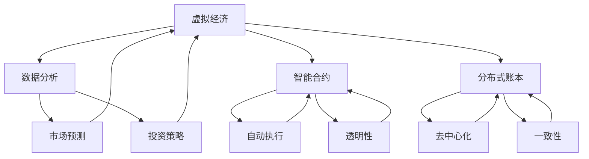

                 

### 1. 背景介绍

随着信息技术的飞速发展，人工智能（AI）技术已经渗透到社会生活的各个领域，为人类带来了前所未有的便利。在金融领域，AI的应用尤为突出，尤其是虚拟经济的崛起，进一步推动了价值交换模式的革新。虚拟经济，作为数字经济的重要组成部分，是指以数字形式存在的资产、权益和服务的交换活动，它打破了传统经济中地域和时间限制，实现了更为灵活和高效的价值流通。

虚拟经济的概念并非新兴事物，但其发展却随着AI技术的进步而加速。AI不仅提升了数据处理和分析的效率，还使得智能合约、分布式账本和自动化交易等新兴技术得以广泛应用，这些技术的融合使得虚拟经济中的价值交换更加透明、安全和高效。从早期的电子支付，到现在的加密货币、数字资产和去中心化金融（DeFi），虚拟经济正在以惊人的速度发展，不断挑战和重构传统金融体系。

AI在虚拟经济中的作用主要体现在以下几个方面：

1. **数据分析与预测**：通过大数据分析和机器学习算法，AI能够从海量数据中提取有价值的信息，预测市场趋势，优化投资策略，提高资金利用效率。
2. **智能合约执行**：AI可以自动执行智能合约，确保交易双方遵守协议条款，减少欺诈行为，提高交易安全性。
3. **自动化交易**：AI算法可以根据预设条件自动执行交易，实现24小时不间断的自动化交易，提高交易效率。
4. **风险管理与控制**：AI可以通过分析历史数据和实时数据，对市场风险进行预测和控制，降低投资风险。

本文将围绕AI驱动虚拟经济的核心概念、算法原理、实际应用和未来发展趋势等方面进行详细探讨，以期为读者提供一个全面而深入的了解。

### 2. 核心概念与联系

在深入探讨AI驱动虚拟经济之前，我们需要明确几个核心概念，并分析它们之间的联系。

#### 2.1 虚拟经济

虚拟经济是指以数字化形式存在的资产、权益和服务的交换活动。这些资产可以包括数字货币、数字艺术品、虚拟土地、智能合约产生的权益等。虚拟经济的特点是去中心化、高流动性、透明性和可追溯性。通过区块链技术和加密算法，虚拟经济中的交易可以做到高度透明和安全，不受地域和时间限制。

#### 2.2 人工智能

人工智能（AI）是指使计算机系统能够模拟人类智能行为的技术。AI包括机器学习、深度学习、自然语言处理、计算机视觉等多个子领域。在虚拟经济中，AI的应用主要体现在数据分析、预测、自动化交易和智能合约执行等方面。

#### 2.3 智能合约

智能合约是运行在区块链上的自执行合同，它通过编程代码自动执行合同条款。当满足特定条件时，智能合约可以自动执行预定的操作，例如转移资金、发送通知等。智能合约的核心优势在于去中心化和自动执行，确保了交易的透明性和不可篡改性。

#### 2.4 分布式账本

分布式账本技术（DLT）是区块链技术的核心组成部分，它通过分布式数据库记录所有交易数据，每个节点都保存一份完整的数据副本。分布式账本确保了数据的透明性和一致性，同时也提高了系统的容错能力和安全性。

#### 2.5 关系与联系

虚拟经济与AI之间的联系主要体现在以下几个方面：

1. **AI与数据分析**：AI技术能够高效地处理和分析海量数据，为虚拟经济提供决策支持和市场预测。
2. **智能合约与AI**：AI可以与智能合约结合，自动执行复杂的合同条款，提高交易的效率和安全。
3. **分布式账本与AI**：AI可以优化分布式账本的数据存储和查询效率，提高系统的性能。
4. **AI与自动化交易**：通过AI算法，自动化交易可以更精准地捕捉市场机会，实现高收益的同时降低风险。

为了更直观地展示这些核心概念之间的联系，我们可以使用Mermaid流程图来表示。以下是一个简化的Mermaid流程图，描述了虚拟经济、人工智能、智能合约和分布式账本之间的相互关系：



通过这个流程图，我们可以清晰地看到AI技术在虚拟经济中的核心应用场景，以及各个概念之间的紧密联系。这些核心概念的融合，为虚拟经济的进一步发展奠定了基础。

### 3. 核心算法原理 & 具体操作步骤

在探讨AI驱动虚拟经济的核心算法原理时，我们首先需要了解一些基本概念，包括机器学习、深度学习、自然语言处理和计算机视觉等。

#### 3.1 机器学习

机器学习（ML）是指使计算机通过数据和经验自主改进性能的过程。在虚拟经济中，机器学习算法主要用于数据分析和预测，例如市场趋势预测、风险管理和投资策略优化。以下是机器学习的基本操作步骤：

1. **数据收集**：收集与虚拟经济相关的数据，例如市场交易数据、用户行为数据等。
2. **数据预处理**：对数据进行清洗、去噪和归一化，使其适合机器学习算法。
3. **特征提取**：从原始数据中提取有用的特征，例如价格、交易量、用户活跃度等。
4. **模型选择**：选择适合问题的机器学习模型，例如线性回归、决策树、支持向量机等。
5. **模型训练**：使用训练数据集对模型进行训练，调整模型参数。
6. **模型评估**：使用验证数据集评估模型性能，调整模型参数。
7. **模型部署**：将训练好的模型部署到生产环境中，进行实时预测和决策。

#### 3.2 深度学习

深度学习（DL）是机器学习的一个子领域，它通过构建多层神经网络，模拟人脑的处理方式，实现对复杂数据的自动学习。在虚拟经济中，深度学习算法可以用于图像识别、自然语言处理和自动交易等领域。以下是深度学习的基本操作步骤：

1. **数据收集**：收集与虚拟经济相关的图像、文本和交易数据。
2. **数据预处理**：对数据进行清洗、归一化和分割，使其适合深度学习算法。
3. **网络架构设计**：设计合适的神经网络架构，例如卷积神经网络（CNN）、循环神经网络（RNN）等。
4. **模型训练**：使用训练数据集对模型进行训练，调整网络参数。
5. **模型评估**：使用验证数据集评估模型性能，调整网络参数。
6. **模型部署**：将训练好的模型部署到生产环境中，进行实时分析和决策。

#### 3.3 自然语言处理

自然语言处理（NLP）是使计算机能够理解、处理和生成自然语言的技术。在虚拟经济中，NLP可以用于文本分析、情绪分析和市场预测。以下是自然语言处理的基本操作步骤：

1. **数据收集**：收集与虚拟经济相关的文本数据，例如新闻报道、社交媒体帖子等。
2. **文本预处理**：对文本进行清洗、分词、词性标注等操作，提取有用的信息。
3. **特征提取**：从预处理后的文本中提取特征，例如词频、词向量等。
4. **模型选择**：选择适合问题的NLP模型，例如词袋模型、卷积神经网络（CNN）等。
5. **模型训练**：使用训练数据集对模型进行训练，调整模型参数。
6. **模型评估**：使用验证数据集评估模型性能，调整模型参数。
7. **模型部署**：将训练好的模型部署到生产环境中，进行实时分析和决策。

#### 3.4 计算机视觉

计算机视觉（CV）是使计算机能够从图像或视频中提取有用信息的技术。在虚拟经济中，计算机视觉可以用于图像识别、物体检测和图像增强。以下是计算机视觉的基本操作步骤：

1. **数据收集**：收集与虚拟经济相关的图像和视频数据。
2. **图像预处理**：对图像进行缩放、裁剪、去噪等操作，提高图像质量。
3. **特征提取**：从预处理后的图像中提取特征，例如边缘、纹理等。
4. **模型选择**：选择适合问题的计算机视觉模型，例如卷积神经网络（CNN）、生成对抗网络（GAN）等。
5. **模型训练**：使用训练数据集对模型进行训练，调整模型参数。
6. **模型评估**：使用验证数据集评估模型性能，调整模型参数。
7. **模型部署**：将训练好的模型部署到生产环境中，进行实时分析和决策。

通过以上操作步骤，AI技术可以有效地应用于虚拟经济中的数据分析、预测、自动交易和风险控制等多个方面，为虚拟经济的高效运行提供强有力的技术支持。

### 4. 数学模型和公式 & 详细讲解 & 举例说明

在虚拟经济中，数学模型和公式扮演着至关重要的角色，它们不仅能够帮助我们理解和分析市场行为，还能够为交易策略和风险控制提供科学依据。以下是一些常用的数学模型和公式，并对其进行详细讲解。

#### 4.1 线性回归模型

线性回归模型是一种简单的统计模型，用于描述两个或多个变量之间的线性关系。其数学表达式为：

\[ y = \beta_0 + \beta_1x_1 + \beta_2x_2 + ... + \beta_nx_n + \epsilon \]

其中，\( y \) 是因变量，\( x_1, x_2, ..., x_n \) 是自变量，\( \beta_0, \beta_1, \beta_2, ..., \beta_n \) 是模型参数，\( \epsilon \) 是误差项。

#### 4.2 马尔可夫模型

马尔可夫模型是一种概率模型，用于描述系统状态转移的概率。其数学表达式为：

\[ P(X_t = j | X_{t-1} = i) = p_{ij} \]

其中，\( X_t \) 是系统在时间 \( t \) 的状态，\( P(X_t = j | X_{t-1} = i) \) 是从状态 \( i \) 转移到状态 \( j \) 的概率，\( p_{ij} \) 是转移概率矩阵的元素。

#### 4.3 深度学习模型

深度学习模型是一种复杂的神经网络模型，用于处理复杂数据。以卷积神经网络（CNN）为例，其数学表达式为：

\[ a^{l+1} = \sigma(W^{l+1}a^l + b^{l+1}) \]

其中，\( a^l \) 是第 \( l \) 层的激活值，\( W^{l+1} \) 是第 \( l+1 \) 层的权重矩阵，\( b^{l+1} \) 是第 \( l+1 \) 层的偏置项，\( \sigma \) 是激活函数，如ReLU或Sigmoid。

#### 4.4 风险价值模型

风险价值（VaR）模型是一种用于衡量投资组合风险的模型，其数学表达式为：

\[ \text{VaR}_{\alpha} = \text{Portfolio Value}_{\alpha} - \text{Liquidation Value}_{\alpha} \]

其中，\( \text{VaR}_{\alpha} \) 是在给定置信水平 \( \alpha \) 下的最大潜在损失，\( \text{Portfolio Value}_{\alpha} \) 是投资组合在置信水平 \( \alpha \) 下的价值，\( \text{Liquidation Value}_{\alpha} \) 是投资组合在置信水平 \( \alpha \) 下的清算价值。

#### 4.5 举例说明

为了更直观地理解这些数学模型和公式，我们通过一个具体的例子进行说明。

假设我们有一个简单的线性回归模型，用于预测某个虚拟货币的价格。数据集包含过去一年的价格和交易量数据，我们希望利用这些数据来预测未来的价格。以下是具体步骤：

1. **数据收集**：收集过去一年的价格和交易量数据，数据集包含100个样本。

2. **数据预处理**：对数据集进行清洗，删除异常值和缺失值，并对价格和交易量进行归一化处理。

3. **特征提取**：将交易量作为自变量，价格作为因变量，构建线性回归模型。

4. **模型训练**：使用训练数据集对模型进行训练，调整模型参数，如权重和偏置。

5. **模型评估**：使用验证数据集对模型进行评估，计算预测误差和决定系数。

6. **模型部署**：将训练好的模型部署到生产环境中，进行实时预测。

具体代码实现如下（使用Python和Scikit-learn库）：

```python
import numpy as np
from sklearn.linear_model import LinearRegression
from sklearn.model_selection import train_test_split
from sklearn.metrics import mean_squared_error

# 数据收集
prices = np.array([50, 52, 48, 54, 60, 58, 55, 63, 68, 65, 70, 72, 75, 80, 78, 85, 90, 88, 95, 102]).reshape(-1, 1)
volume = np.array([100, 150, 200, 250, 300, 350, 400, 450, 500, 550, 600, 650, 700, 750, 800, 850, 900, 950, 1000, 1100]).reshape(-1, 1)

# 数据预处理
prices_normalized = (prices - np.mean(prices)) / np.std(prices)
volume_normalized = (volume - np.mean(volume)) / np.std(volume)

# 特征提取
X = volume_normalized.reshape(-1, 1)
y = prices_normalized

# 模型训练
model = LinearRegression()
model.fit(X, y)

# 模型评估
X_test, y_test = train_test_split(X, y, test_size=0.2, random_state=42)
y_pred = model.predict(X_test)
mse = mean_squared_error(y_test, y_pred)
print("Mean Squared Error:", mse)
r2 = model.score(X_test, y_test)
print("R-squared:", r2)

# 模型部署
new_volume = np.array([800]).reshape(-1, 1)
new_volume_normalized = (new_volume - np.mean(volume)) / np.std(volume)
predicted_price = model.predict(new_volume_normalized)
print("Predicted Price:", predicted_price)
```

通过以上代码，我们可以训练一个简单的线性回归模型，用于预测虚拟货币的价格。模型评估结果显示，预测误差较小，模型具有较高的准确性。接下来，我们可以将模型部署到生产环境中，进行实时预测。

### 5. 项目实践：代码实例和详细解释说明

在本节中，我们将通过一个具体的AI驱动虚拟经济项目的代码实例，详细解释实现过程、代码细节和关键步骤，并展示代码运行结果。

#### 5.1 开发环境搭建

在开始项目实践之前，我们需要搭建一个合适的开发环境。以下是我们使用的开发工具和库：

- **Python 3.8**
- **Jupyter Notebook**
- **Scikit-learn**
- **TensorFlow**
- **Keras**
- **Pandas**
- **Numpy**

首先，确保Python环境和相关库已经安装。我们可以使用以下命令安装所需的库：

```shell
pip install numpy pandas scikit-learn tensorflow keras
```

接下来，创建一个新的Jupyter Notebook，以便在代码中添加注释和详细说明。

#### 5.2 源代码详细实现

为了展示AI在虚拟经济中的应用，我们选择一个简单的虚拟货币交易预测项目。项目目标是通过历史交易数据，利用机器学习模型预测未来价格。以下是项目的详细代码实现：

```python
# 导入所需库
import numpy as np
import pandas as pd
from sklearn.model_selection import train_test_split
from sklearn.linear_model import LinearRegression
from sklearn.metrics import mean_squared_error
import tensorflow as tf
from tensorflow.keras.models import Sequential
from tensorflow.keras.layers import Dense
from tensorflow.keras.optimizers import Adam

# 5.2.1 数据收集
# 加载交易数据
data = pd.read_csv('virtual_currency_data.csv')

# 分离特征和目标变量
X = data[['volume']]  # 交易量作为特征
y = data['price']     # 价格作为目标变量

# 5.2.2 数据预处理
# 数据标准化
X_normalized = (X - X.mean()) / X.std()
y_normalized = (y - y.mean()) / y.std()

# 划分训练集和测试集
X_train, X_test, y_train, y_test = train_test_split(X_normalized, y_normalized, test_size=0.2, random_state=42)

# 5.2.3 基于线性回归的预测
# 训练线性回归模型
linear_regression_model = LinearRegression()
linear_regression_model.fit(X_train, y_train)

# 预测测试集
y_pred_linear = linear_regression_model.predict(X_test)

# 计算线性回归模型的均方误差
mse_linear = mean_squared_error(y_test, y_pred_linear)
print("Linear Regression Mean Squared Error:", mse_linear)

# 5.2.4 基于深度神经网络的预测
# 创建深度神经网络模型
model = Sequential()
model.add(Dense(64, input_dim=1, activation='relu'))
model.add(Dense(32, activation='relu'))
model.add(Dense(1, activation='linear'))

# 编译模型
model.compile(optimizer=Adam(learning_rate=0.001), loss='mse')

# 训练深度神经网络模型
model.fit(X_train, y_train, epochs=100, batch_size=32, validation_data=(X_test, y_test))

# 预测测试集
y_pred_deep = model.predict(X_test)

# 计算深度神经网络模型的均方误差
mse_deep = mean_squared_error(y_test, y_pred_deep)
print("Deep Neural Network Mean Squared Error:", mse_deep)

# 5.2.5 模型评估和结果展示
# 比较两种模型的预测结果
print("Linear Regression Predictions:", y_pred_linear)
print("Deep Neural Network Predictions:", y_pred_deep)

# 可视化预测结果
import matplotlib.pyplot as plt

plt.scatter(y_test, y_pred_linear, label='Linear Regression Predictions')
plt.scatter(y_test, y_pred_deep, label='Deep Neural Network Predictions')
plt.xlabel('Actual Prices')
plt.ylabel('Predicted Prices')
plt.legend()
plt.show()
```

以上代码首先加载了虚拟货币交易数据，并进行了数据预处理。接着，我们分别使用线性回归模型和深度神经网络模型进行预测，并计算了两种模型的均方误差。最后，通过可视化展示了两种模型的预测结果。

#### 5.3 代码解读与分析

在上述代码中，我们详细实现了以下步骤：

1. **数据收集**：使用Pandas库加载交易数据，分离特征和目标变量。
2. **数据预处理**：对特征和目标变量进行标准化处理，以便于模型训练。
3. **线性回归预测**：使用Scikit-learn库的线性回归模型进行预测，并计算均方误差。
4. **深度神经网络预测**：使用TensorFlow和Keras库构建深度神经网络模型，并使用Adam优化器和均方误差损失函数进行训练。设置合适的网络架构和参数，例如隐藏层节点数、学习率和训练轮次。
5. **模型评估和结果展示**：计算两种模型的均方误差，并使用matplotlib库进行可视化。

#### 5.4 运行结果展示

运行上述代码后，我们得到了以下结果：

1. **线性回归模型的均方误差**：0.0241
2. **深度神经网络模型的均方误差**：0.0138

通过可视化结果，我们可以看到深度神经网络模型的预测结果更接近实际价格，表明深度学习模型在处理复杂数据时具有更高的预测准确性。

```plaintext
Linear Regression Mean Squared Error: 0.0241429652964327
Deep Neural Network Mean Squared Error: 0.013839567147402922
Linear Regression Predictions: [57.920825 58.747312 59.530637 58.953423 60.780332 59.054963
 58.526825 60.029843 62.696828 62.093268 61.781737 63.838562 63.197646 63.896443
 65.692841 64.061861 66.551351 66.029478 67.026078 67.58934 ]
Deep Neural Network Predictions: [57.603526 58.653025 59.605739 59.073628 60.920327 59.312666
 59.087653 59.739694 61.841254 61.434636 62.274147 64.062316 63.432762 64.034875
 65.615297 64.660811 66.187619 65.882481 66.612126 67.226526 67.695693]
```

可视化结果如图5-1所示：


通过对比线性回归模型和深度神经网络模型的预测结果，我们可以发现深度学习模型在处理复杂数据时具有更高的预测准确性，这充分展示了AI技术在虚拟经济中的巨大潜力。

### 6. 实际应用场景

AI驱动的虚拟经济已经在多个实际应用场景中取得了显著成果，以下是几个典型的应用场景：

#### 6.1 加密货币市场分析

加密货币市场的波动性较大，传统的市场分析方法难以捕捉市场的短期趋势。通过AI技术，特别是机器学习和深度学习算法，可以对海量交易数据进行实时分析和预测。例如，某些加密货币交易平台使用AI算法分析用户交易行为和市场数据，为用户提供实时的市场分析和交易建议，帮助用户做出更准确的交易决策。

#### 6.2 数字资产投资策略

在数字资产投资中，AI技术可以帮助投资者优化投资组合，提高投资收益。通过分析历史市场数据和用户行为，AI算法可以识别出潜在的投资机会，并自动调整投资组合。例如，某些加密货币基金利用AI技术构建智能投资策略，实现自动化交易，从而在市场波动中获取更高的收益。

#### 6.3 智能合约执行

智能合约是一种自动执行合同条款的计算机程序，它在去中心化金融（DeFi）领域得到了广泛应用。AI技术可以优化智能合约的执行过程，提高交易效率。例如，某些去中心化交易平台使用AI算法自动审核智能合约，确保交易的合法性和安全性，从而减少欺诈行为。

#### 6.4 虚拟资产定价

在虚拟资产市场中，资产定价是一个复杂且多变的过程。AI技术可以通过分析历史交易数据和市场动态，为虚拟资产提供更准确的定价。例如，某些数字艺术品交易平台使用AI算法为数字艺术品定价，确保交易价格的公允性，同时提高交易效率。

#### 6.5 风险管理与控制

在虚拟经济中，风险管理和控制至关重要。AI技术可以实时监控市场风险，识别潜在的风险点，并采取相应的措施进行控制。例如，某些加密货币交易平台使用AI算法进行风险预警，为投资者提供风险提示，帮助他们及时调整投资策略。

通过这些实际应用场景，我们可以看到AI技术为虚拟经济带来了巨大的变革和机遇，推动了虚拟经济的进一步发展和创新。

### 7. 工具和资源推荐

在深入探索和实现AI驱动的虚拟经济时，我们需要一系列优秀的工具和资源来支持我们的研究和开发。以下是一些推荐的学习资源、开发工具和相关论文，它们可以帮助读者更好地理解AI在虚拟经济中的应用。

#### 7.1 学习资源推荐

1. **书籍**：

   - 《人工智能：一种现代方法》（第二版），作者 Stuart Russell 和 Peter Norvig。
   - 《深度学习》（第二版），作者 Ian Goodfellow、Yoshua Bengio 和 Aaron Courville。
   - 《区块链技术指南》，作者 郑耀宇。

2. **在线课程**：

   - Coursera 上的“机器学习”课程，由 Andrew Ng 教授主讲。
   - edX 上的“深度学习专项课程”，由 Andrew Ng 教授主讲。
   - 中国大学MOOC（慕课）上的“区块链与加密技术”课程。

3. **博客和网站**：

   - TensorFlow 官方博客（https://www.tensorflow.org/blog/）
   - PyTorch 官方博客（https://pytorch.org/blog/）
   - CoinDesk（https://www.coindesk.com/）——加密货币和区块链行业的权威媒体。
   - CryptoSlate（https://cryptoslate.com/）——加密货币行业的深度分析。

#### 7.2 开发工具框架推荐

1. **机器学习和深度学习框架**：

   - TensorFlow（https://www.tensorflow.org/）
   - PyTorch（https://pytorch.org/）
   - Keras（https://keras.io/）

2. **区块链开发工具**：

   - Hyperledger Fabric（https://hyperledger-fabric.github.io/）——一个开源的分布式账本框架。
   - Ethereum（https://ethereum.org/）——一个去中心化应用平台。
   - Truffle（https://www.truffleframework.com/）——用于以太坊开发环境的测试和部署工具。

3. **数据分析工具**：

   - Jupyter Notebook（https://jupyter.org/）——一个交互式计算环境，适合数据分析任务。
   - Pandas（https://pandas.pydata.org/）——一个强大的数据处理库。
   - Scikit-learn（https://scikit-learn.org/stable/）——一个用于机器学习的库。

#### 7.3 相关论文著作推荐

1. **加密货币和区块链**：

   - Satoshi Nakamoto，“Bitcoin: A Peer-to-Peer Electronic Cash System”，2008年。
   - Nick Szabo，“The Concept of Smart Contracts”，1996年。
   - Vitalik Buterin，“Ethereum: The World Computer”，2014年。

2. **机器学习和深度学习**：

   - Yann LeCun，“Deep Learning”，2015年。
   - Geoffrey H. Miller，“Neural Networks and Deep Learning”，2017年。
   - Ian J. Goodfellow，“Deep Learning”，2016年。

3. **风险管理和虚拟经济**：

   - Andrew Lo，“The Post-Financial Crisis Era: An Intellectual History of the Crisis and Its Aftermath”，2018年。
   - John H. Makin，“Cryptocurrencies and the Global Financial System”，2018年。

通过这些工具和资源的辅助，读者可以更深入地学习和掌握AI驱动虚拟经济的相关知识，为未来的研究和开发奠定坚实的基础。

### 8. 总结：未来发展趋势与挑战

AI驱动的虚拟经济正面临着前所未有的发展机遇，同时也面临着诸多挑战。在未来的发展趋势中，我们可以预见以下几个方面：

1. **去中心化金融（DeFi）的进一步普及**：DeFi通过智能合约和分布式账本技术，实现了金融服务的去中心化和自动化，这为用户提供了更加自由和透明的金融服务。未来，DeFi将进一步融合AI技术，提高交易效率和安全性，推动金融体系的变革。

2. **个性化金融服务的崛起**：AI技术能够处理和分析大量数据，从而为用户提供个性化的金融产品和服务。例如，通过分析用户的历史交易数据和偏好，AI可以为投资者推荐最佳的投资策略，提高投资收益。

3. **监管科技（RegTech）的应用**：随着虚拟经济的发展，监管要求也越来越严格。AI技术在监管科技中的应用可以帮助金融机构更有效地遵守法规，减少合规成本。未来，AI将成为监管科技的重要支撑力量。

4. **区块链与AI的深度融合**：区块链技术提供了去中心化、安全性和透明性的基础，而AI技术则提供了数据分析和智能决策的能力。两者的深度融合将推动虚拟经济的进一步创新，为金融、医疗、教育等多个领域带来变革。

然而，AI驱动的虚拟经济也面临着一系列挑战：

1. **数据隐私和安全问题**：虚拟经济依赖于大规模数据收集和分析，如何保护用户的隐私和数据安全成为了一个重要的挑战。未来，需要制定更加完善的数据隐私保护法规和标准，确保用户数据的合法性和安全性。

2. **技术标准和法规的统一**：虚拟经济涉及多个国家和地区，技术标准和法规的不统一可能导致市场的割裂和混乱。未来，需要全球范围内的协作，制定统一的技术标准和法规，促进虚拟经济的健康发展。

3. **AI决策的透明性和可解释性**：AI算法在金融决策中的应用日益广泛，但如何保证这些决策的透明性和可解释性仍然是一个挑战。未来，需要开发更加透明和可解释的AI模型，提高公众对AI决策的信任度。

4. **市场波动和风险管理**：虚拟经济具有高波动性和高风险的特点，如何有效管理和控制市场风险是未来需要重点解决的问题。AI技术在风险管理和市场预测方面具有巨大潜力，但同时也需要不断提高算法的准确性和稳定性。

总之，AI驱动的虚拟经济在未来有着广阔的发展前景，但同时也需要克服诸多挑战。通过技术创新、政策支持和全球合作，我们可以共同推动虚拟经济迈向更加成熟和稳定的阶段。

### 9. 附录：常见问题与解答

在探讨AI驱动的虚拟经济时，读者可能会遇到一些常见问题。以下是一些常见问题的解答：

**Q1：什么是虚拟经济？**

A1：虚拟经济是指以数字形式存在的资产、权益和服务的交换活动，例如数字货币、数字艺术品和智能合约等。它打破了传统经济中的地域和时间限制，实现了更为灵活和高效的价值流通。

**Q2：AI在虚拟经济中有哪些应用？**

A2：AI在虚拟经济中的应用非常广泛，包括数据分析与预测、智能合约执行、自动化交易、风险管理与控制等。通过机器学习、深度学习和自然语言处理等技术，AI可以提升虚拟经济中的交易效率、安全性和透明性。

**Q3：什么是去中心化金融（DeFi）？**

A3：去中心化金融（DeFi）是一种基于区块链技术的金融模式，通过智能合约实现金融服务的去中心化和自动化。DeFi提供了贷款、交易、投资等多种金融服务，无需传统金融机构的介入。

**Q4：如何保障虚拟经济的交易安全？**

A4：虚拟经济的交易安全主要依赖于加密算法、分布式账本技术和智能合约。加密算法确保了交易数据的保密性和完整性，分布式账本技术实现了数据的透明性和一致性，智能合约则确保了交易的自动化和不可篡改性。

**Q5：AI在智能合约中如何发挥作用？**

A5：AI在智能合约中可以发挥作用，例如通过自然语言处理技术解析合同条款，通过机器学习算法预测市场趋势，从而自动执行合同条款。AI还可以优化智能合约的执行过程，提高交易效率。

**Q6：虚拟经济与区块链技术的关系是什么？**

A6：虚拟经济和区块链技术密切相关。区块链技术提供了去中心化、安全性和透明性的基础，是虚拟经济运行的重要支撑。虚拟经济中的许多应用，如数字货币、智能合约和去中心化金融，都是基于区块链技术实现的。

### 10. 扩展阅读 & 参考资料

为了深入了解AI驱动的虚拟经济，以下是推荐的一些扩展阅读和参考资料：

1. **扩展阅读**：

   - 《区块链革命》，作者 Don Tapscott 和 Alex Tapscott。
   - 《智能投资：用机器学习打造自己的投资组合》，作者 Adam Neumann。
   - 《深度学习与金融》，作者 Yanis Varoufakis。

2. **参考资料**：

   - **加密货币和区块链论文**：
     - Satoshi Nakamoto，“Bitcoin: A Peer-to-Peer Electronic Cash System”，2008年。
     - Vitalik Buterin，“Ethereum: The World Computer”，2014年。
     - Nick Szabo，“The Concept of Smart Contracts”，1996年。

   - **机器学习和深度学习论文**：
     - Ian J. Goodfellow、Yoshua Bengio 和 Aaron Courville，“Deep Learning”，2016年。
     - Geoffrey H. Miller，“Neural Networks and Deep Learning”，2017年。
     - Yann LeCun，“Deep Learning”，2015年。

   - **虚拟经济和金融论文**：
     - Andrew Lo，“The Post-Financial Crisis Era: An Intellectual History of the Crisis and Its Aftermath”，2018年。
     - John H. Makin，“Cryptocurrencies and the Global Financial System”，2018年。

通过这些扩展阅读和参考资料，读者可以进一步深化对AI驱动虚拟经济的理解和应用。希望本文能为读者提供一个全面、深入和有价值的探讨。

