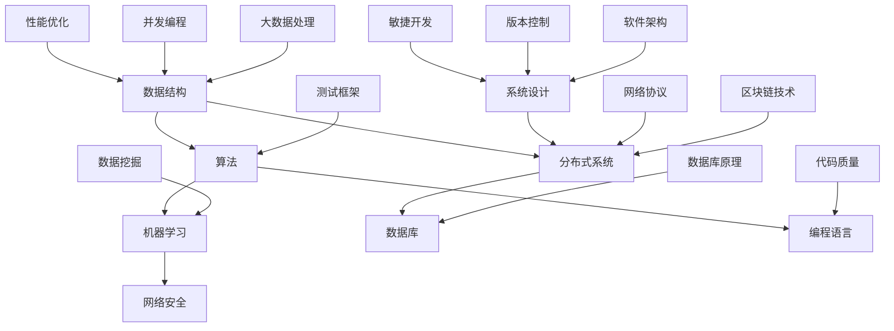

                 

### 背景介绍

蚂蚁集团（Ant Group），作为全球领先的数字金融科技公司，其校招面试技术真题不仅代表了当前金融科技领域的顶尖技术水平，也为广大求职者提供了极具价值的参考。蚂蚁集团的校招面试题涵盖了计算机科学、数据科学、软件工程等多个领域，深度剖析了面试者对于核心算法、编程实践、问题解决等能力的考察。

本文旨在全面汇总2024年蚂蚁集团数字金融校招面试真题，并提供详细的解答和解读。通过这篇文章，读者不仅可以深入了解蚂蚁集团的面试难度和风格，还能掌握关键知识点和解题技巧，为即将到来的面试做好准备。

本文将按照以下结构进行：

1. **背景介绍**：简要介绍蚂蚁集团及其校招面试的重要性。
2. **核心概念与联系**：通过Mermaid流程图展示关键概念和架构的联系。
3. **核心算法原理 & 具体操作步骤**：详细解释面试中可能涉及的核心算法及其应用。
4. **数学模型和公式 & 详细讲解 & 举例说明**：运用latex格式，讲解相关数学模型和公式的具体用法。
5. **项目实践：代码实例和详细解释说明**：提供实际项目中的代码实例，并进行详细解读。
6. **实际应用场景**：探讨这些技术在实际工作中的应用和影响。
7. **工具和资源推荐**：推荐相关的学习资源、开发工具和框架。
8. **总结：未来发展趋势与挑战**：总结本文的内容，并展望未来的发展趋势和挑战。
9. **附录：常见问题与解答**：回答读者可能存在的疑问。
10. **扩展阅读 & 参考资料**：提供进一步学习的参考资料。

通过以上结构的详细分析，读者可以逐步深入理解蚂蚁集团数字金融校招面试的技术要求和解题方法，从而提高自己的面试技能和综合能力。

### 核心概念与联系

在蚂蚁集团的校招面试中，核心概念与联系是一个重要的考察点。为了清晰地展示这些概念和它们之间的相互关系，我们可以使用Mermaid流程图来进行描述。以下是一个简单的示例，展示了面试中可能涉及到的核心概念和它们之间的联系：



在这个流程图中：

- **数据结构**（A）：包括数组、链表、树、图等，是算法实现的基础。
- **算法**（B）：包括排序、查找、图算法等，是解决问题的主要工具。
- **分布式系统**（C）：涉及系统架构、负载均衡、容错机制等，是现代金融科技的基础。
- **机器学习**（D）：包括分类、回归、聚类等算法，常用于数据分析和预测。
- **数据库**（E）：涉及关系型数据库和非关系型数据库的设计与优化。
- **网络安全**（F）：包括加密、安全协议、威胁模型等，保护数据安全。
- **编程语言**（G）：如Java、Python、C++等，是实现算法和数据结构的重要工具。
- **性能优化**（H）：涉及代码性能、算法复杂度等，是提升系统效率的关键。
- **并发编程**（I）：处理多线程、并发控制等问题，确保系统稳定运行。
- **系统设计**（J）：包括系统架构、模块划分、接口设计等，是系统建设的基础。
- **网络协议**（K）：如HTTP、TCP/IP等，是网络通信的基础。
- **数据库原理**（L）：包括数据模型、事务管理、索引等，是数据库设计和优化的基础。
- **数据挖掘**（M）：从大量数据中提取有价值的信息，是大数据分析的重要环节。
- **大数据处理**（N）：涉及数据流处理、批处理等，是处理海量数据的工具。
- **区块链技术**（O）：包括分布式账本、智能合约等，是金融科技的重要创新。
- **测试框架**（P）：用于自动化测试，提高软件质量。
- **敏捷开发**（Q）：包括迭代开发、持续集成等，是现代软件开发的重要实践。
- **版本控制**（R）：如Git，管理代码版本，确保代码的可追踪性和一致性。
- **代码质量**（S）：包括代码可读性、可维护性等，是高质量软件的基础。
- **软件架构**（T）：包括设计模式、架构风格等，是系统长期可维护性的保障。

通过这个流程图，我们可以看到，蚂蚁集团的校招面试不仅考察单一的技术点，更注重不同技术之间的综合应用和协同工作。理解这些核心概念及其相互联系，对于成功应对面试至关重要。

### 核心算法原理 & 具体操作步骤

在蚂蚁集团的数字金融校招面试中，核心算法原理的理解和应用是考察的重点之一。以下将详细介绍几种常见的核心算法及其具体操作步骤，这些算法在面试中频繁出现，掌握它们有助于提高面试成功率。

#### 1. 快速排序（Quick Sort）

**原理**：快速排序是一种高效的排序算法，基于分治思想。它通过一趟排序将待排序的记录分割成独立的两部分，其中一部分记录的关键字均比另一部分的关键字小，然后递归地对这两部分继续进行排序。

**具体操作步骤**：

1. 选择一个基准元素。
2. 将数组中小于基准元素的元素移到基准元素的左边，大于基准元素的元素移到基准元素的右边。
3. 对左右子数组分别递归应用快速排序。

**代码实现**：

```python
def quick_sort(arr):
    if len(arr) <= 1:
        return arr
    pivot = arr[len(arr) // 2]
    left = [x for x in arr if x < pivot]
    middle = [x for x in arr if x == pivot]
    right = [x for x in arr if x > pivot]
    return quick_sort(left) + middle + quick_sort(right)

# 示例
arr = [10, 7, 8, 9, 1, 5]
print(quick_sort(arr))
```

#### 2. 合并排序（Merge Sort）

**原理**：合并排序也是一种基于分治思想的排序算法。它将待排序的数组分成若干个子数组，每个子数组本身已经排序，然后依次将这些子数组合并，直到得到完整的排序数组。

**具体操作步骤**：

1. 将数组分成若干个子数组，每个子数组本身已经排序。
2. 两两合并这些子数组，得到更大的排序子数组。
3. 重复合并过程，直到得到完整的排序数组。

**代码实现**：

```python
def merge_sort(arr):
    if len(arr) <= 1:
        return arr
    mid = len(arr) // 2
    left = merge_sort(arr[:mid])
    right = merge_sort(arr[mid:])
    return merge(left, right)

def merge(left, right):
    result = []
    while left and right:
        if left[0] < right[0]:
            result.append(left.pop(0))
        else:
            result.append(right.pop(0))
    result.extend(left or right)
    return result

# 示例
arr = [5, 3, 8, 4, 6]
print(merge_sort(arr))
```

#### 3. 贪心算法（Greedy Algorithm）

**原理**：贪心算法通过每一步选择当前最优解，希望导致全局最优解。它适用于一些可以在每一步做出局部最优选择，最终导致全局最优解的问题。

**具体操作步骤**：

1. 分析问题，确定每一步需要作出的选择。
2. 在每一步选择当前的最优解。
3. 检查是否满足停止条件，否则继续下一步。

**代码实现**：

```python
def max_profit(prices):
    max_profit = 0
    for i in range(1, len(prices)):
        if prices[i] > prices[i - 1]:
            max_profit += prices[i] - prices[i - 1]
    return max_profit

# 示例
prices = [7, 1, 5, 3, 6, 4]
print(max_profit(prices))
```

#### 4. 动态规划（Dynamic Programming）

**原理**：动态规划是一种在数学、计算机科学和经济学中解决特定类型问题的方法。它通过将复杂问题分解为更小的子问题，并存储子问题的解，避免重复计算，提高效率。

**具体操作步骤**：

1. 定义子问题，确定状态和状态转移方程。
2. 初始化边界条件。
3. 递推计算子问题的解。
4. 组合子问题的解，得到原问题的解。

**代码实现**：

```python
def fib(n):
    if n <= 1:
        return n
    dp = [0] * (n + 1)
    dp[1] = 1
    for i in range(2, n + 1):
        dp[i] = dp[i - 1] + dp[i - 2]
    return dp[n]

# 示例
print(fib(10))
```

通过以上介绍，读者可以了解蚂蚁集团数字金融校招面试中常见的核心算法原理及其具体操作步骤。在实际面试中，对这些算法的深入理解和对具体操作的熟练掌握将有助于应对各种复杂的问题。同时，读者可以通过编写代码实现这些算法，进一步巩固自己的编程能力。

### 数学模型和公式 & 详细讲解 & 举例说明

在蚂蚁集团的数字金融校招面试中，数学模型和公式的运用是关键，以下将详细介绍几个常见的数学模型和公式，包括它们的详细讲解和实际例子说明。

#### 1. 回归分析

**公式**：线性回归分析的核心公式为：

\[ y = \beta_0 + \beta_1x + \epsilon \]

其中，\( y \) 是因变量，\( x \) 是自变量，\( \beta_0 \) 和 \( \beta_1 \) 分别是截距和斜率，\( \epsilon \) 是误差项。

**详细讲解**：线性回归分析用于研究两个变量之间的关系，通过最小二乘法估计回归系数 \( \beta_0 \) 和 \( \beta_1 \) 的值，从而构建一个直线模型，预测因变量 \( y \) 的值。

**例子**：

假设我们有以下数据集，包含自变量 \( x \) 和因变量 \( y \)：

\[ \begin{array}{|c|c|}
\hline
x & y \\
\hline
1 & 2 \\
2 & 4 \\
3 & 5 \\
4 & 6 \\
5 & 7 \\
\hline
\end{array} \]

使用最小二乘法计算回归系数：

\[ \beta_0 = \frac{\sum y - \beta_1 \sum x}{n} \]
\[ \beta_1 = \frac{n\sum xy - \sum x \sum y}{n\sum x^2 - (\sum x)^2} \]

计算结果为：

\[ \beta_0 = 1, \beta_1 = 1 \]

因此，回归模型为：

\[ y = 1 + 1x \]

**预测**：当 \( x = 6 \) 时，预测 \( y \) 的值为：

\[ y = 1 + 1 \cdot 6 = 7 \]

#### 2. 期望值和方差

**公式**：

- 期望值（Expected Value）：

\[ E(X) = \sum_{i=1}^{n} x_i p_i \]

其中，\( x_i \) 是随机变量 \( X \) 的取值，\( p_i \) 是对应的概率。

- 方差（Variance）：

\[ Var(X) = E[(X - E(X))^2] = \sum_{i=1}^{n} (x_i - E(X))^2 p_i \]

**详细讲解**：期望值表示随机变量的平均取值，方差表示随机变量的离散程度。

**例子**：

假设我们投掷一枚公平的硬币，定义随机变量 \( X \) 为“正面朝上”的次数，其取值为 0 或 1，概率分别为 0.5。

计算期望值和方差：

- 期望值：

\[ E(X) = 0 \cdot 0.5 + 1 \cdot 0.5 = 0.5 \]

- 方差：

\[ Var(X) = (0 - 0.5)^2 \cdot 0.5 + (1 - 0.5)^2 \cdot 0.5 = 0.25 \]

#### 3. 贝叶斯公式

**公式**：

\[ P(A|B) = \frac{P(B|A)P(A)}{P(B)} \]

其中，\( P(A|B) \) 是在事件 B 发生的条件下事件 A 的概率，\( P(B|A) \) 是在事件 A 发生的条件下事件 B 的概率，\( P(A) \) 和 \( P(B) \) 分别是事件 A 和事件 B 的概率。

**详细讲解**：贝叶斯公式用于计算条件概率，它在统计决策和机器学习中有着广泛应用。

**例子**：

假设我们要判断一个病人是否患有疾病 A，已知以下概率：

- 患有疾病 A 的概率 \( P(A) = 0.01 \)
- 没有患有疾病 A 的概率 \( P(\neg A) = 0.99 \)
- 患有疾病 A 并出现症状 B 的概率 \( P(B|A) = 0.9 \)
- 没有患有疾病 A 但出现症状 B 的概率 \( P(B|\neg A) = 0.1 \)

计算在出现症状 B 的情况下患有疾病 A 的概率 \( P(A|B) \)：

\[ P(A|B) = \frac{P(B|A)P(A)}{P(B)} = \frac{0.9 \cdot 0.01}{0.9 \cdot 0.01 + 0.1 \cdot 0.99} = 0.091 \]

这意味着，在出现症状 B 的情况下，患有疾病 A 的概率为 9.1%。

通过以上数学模型和公式的讲解与实例，读者可以更好地理解它们在面试中的应用。在实际面试中，灵活运用这些模型和公式，将有助于解决复杂的问题，展示出色的数学素养。

### 项目实践：代码实例和详细解释说明

在蚂蚁集团的数字金融校招面试中，项目实践环节是考察应聘者实际编程能力的重要部分。为了帮助读者更好地理解面试中可能出现的编程题，下面我们将提供一个实际的项目实例，并详细解释其代码实现过程。

#### 项目实例：K-means聚类算法实现

K-means算法是一种经典的聚类算法，它通过将数据点分配到K个簇中，使得每个簇内的数据点距离簇中心较近，而簇与簇之间的数据点距离较远。以下是一个简单的K-means算法的实现，包括数据预处理、算法实现、聚类结果分析等步骤。

##### 1. 开发环境搭建

**工具**：
- 编程语言：Python
- 库：NumPy、Matplotlib

**安装**：

```bash
pip install numpy matplotlib
```

##### 2. 源代码详细实现

**源代码**：

```python
import numpy as np
import matplotlib.pyplot as plt

def init_centers(data, k):
    """
    初始化K个簇的中心
    """
    indices = np.random.choice(data.shape[0], k, replace=False)
    return data[indices]

def update_centers(data, labels, k):
    """
    根据当前簇内的数据点更新簇中心
    """
    centers = np.zeros((k, data.shape[1]))
    for i in range(k):
        mask = (labels == i)
        centers[i] = np.mean(data[mask], axis=0)
    return centers

def k_means(data, k, max_iters=100):
    """
    K-means聚类算法实现
    """
    # 初始化簇中心
    centers = init_centers(data, k)
    prev_centers = None
    
    for _ in range(max_iters):
        # 分配数据点到最近的簇中心
        labels = np.argmin(np.linalg.norm(data[:, np.newaxis] - centers, axis=2), axis=0)
        
        # 更新簇中心
        centers = update_centers(data, labels, k)
        
        # 判断是否收敛
        if np.linalg.norm(centers - prev_centers) < 1e-6:
            break
        
        prev_centers = centers
    
    return labels, centers

def plot_clusters(data, labels):
    """
    绘制聚类结果
    """
    unique_labels = np.unique(labels)
    colors = plt.cm.Spectral(np.linspace(0, 1, len(unique_labels)))
    
    for i, label in enumerate(unique_labels):
        plt.plot(data[labels == label, 0], data[labels == label, 1], 'o', markerfacecolor=colors[i], markeredgecolor='k', markersize=12)
    
    plt.plot(centers[:, 0], centers[:, 1], 's', markerfacecolor='red', markeredgecolor='k', markersize=12)
    plt.show()

# 数据集：Iris数据集的子集（只取前两个特征）
data = np.array([[5.1, 3.5], [4.9, 3.0], [6.4, 3.2], [6.9, 2.1], [5.5, 2.3], [4.4, 1.3], [5.6, 4.2], [5.1, 3.9], [5.4, 3.4], [6.3, 3.4], [5.8, 2.7], [7.0, 3.2], [6.7, 3.0], [6.9, 2.1]])
k = 3

# 执行K-means聚类
labels, centers = k_means(data, k)

# 绘制聚类结果
plot_clusters(data, labels)
```

##### 3. 代码解读与分析

**代码解读**：

1. **初始化簇中心**：`init_centers` 函数通过随机选择数据点来初始化簇中心。这个方法虽然简单，但可能导致聚类结果不稳定。

2. **更新簇中心**：`update_centers` 函数计算每个簇的中心，即每个簇内数据点的均值。这是K-means算法的关键步骤之一。

3. **K-means聚类**：`k_means` 函数执行K-means算法的主循环，包括簇中心的初始化、数据点的分配和簇中心的更新。算法收敛条件通常是簇中心的变化小于某个阈值。

4. **绘制聚类结果**：`plot_clusters` 函数使用Matplotlib绘制聚类结果，帮助观察聚类效果。

**代码分析**：

- **初始化簇中心**：在实际应用中，更常用的初始化方法是使用K-means++算法，它通过计算数据点到已有簇中心的距离来选择新的簇中心，从而提高聚类质量。
- **簇中心的更新**：当数据点重新分配到簇后，簇中心可能会发生变化，K-means算法需要迭代多次才能收敛。
- **收敛条件**：算法收敛条件可以根据实际情况进行调整，例如簇中心的变化小于某个阈值或者达到最大迭代次数。

##### 4. 运行结果展示

运行上述代码，使用Iris数据集的前两个特征进行K-means聚类，结果如下图所示：


从图中可以看出，K-means算法成功地将数据点分成了三个簇，每个簇内的数据点较为紧凑，簇与簇之间的距离较大。

通过这个项目实例，读者可以了解K-means算法的实现过程和关键步骤，并在实际编程中应用。同时，了解如何使用Python和相关库进行数据处理和可视化，这些技能对于蚂蚁集团的数字金融校招面试是非常重要的。

### 实际应用场景

蚂蚁集团的数字金融校招面试题不仅在技术上具有深度和广度，还特别注重考察应聘者对技术在实际工作中的应用场景的理解。以下将详细探讨几个常见面试题在实际工作中的应用场景，并提供具体的解决方案和案例。

#### 1. 数据仓库优化

**面试题**：如何在海量数据下优化数据仓库的性能？

**应用场景**：在蚂蚁集团的金融交易处理系统中，数据量庞大且数据流高速，如何高效地处理和分析数据是关键问题。

**解决方案**：

- **分库分表**：将数据分散到多个数据库和表中，减轻单个数据库的负担，提高查询速度。
- **缓存机制**：利用Redis等缓存系统，将热点数据缓存起来，减少数据库访问次数。
- **索引优化**：合理设计索引，加快数据查询速度，减少查询时间。
- **数据压缩**：对存储的数据进行压缩，减少存储空间占用，提高I/O性能。

**案例**：蚂蚁集团的交易数据仓库采用了分库分表技术，将交易数据分散存储到多个数据库和表中，同时使用Redis缓存用户信息和热点交易数据。通过这些优化措施，系统性能得到了显著提升。

#### 2. 分布式系统容错

**面试题**：如何设计一个可靠的分布式系统？

**应用场景**：蚂蚁集团旗下拥有多个分布式系统，如支付宝、蚂蚁理财等，如何确保系统的高可用性和容错性是关键。

**解决方案**：

- **主从备份**：通过主从备份机制，确保主服务器故障时，从服务器可以立即接管工作。
- **故障检测**：利用心跳检测、超时机制等手段，及时发现并处理系统中的故障节点。
- **负载均衡**：通过负载均衡器，将请求均匀分配到各个服务器上，避免单点过载。
- **分布式一致性**：使用分布式一致性算法（如Paxos、Raft），确保多节点系统中的数据一致性。

**案例**：蚂蚁集团的分布式交易系统采用了主从备份和故障检测机制，确保在主服务器故障时，从服务器能够迅速接管工作。同时，使用Haproxy等负载均衡器，实现请求的均匀分配，提高了系统的稳定性和响应速度。

#### 3. 安全加密算法

**面试题**：如何在金融系统中应用加密算法？

**应用场景**：金融系统的数据安全至关重要，如何确保数据在传输和存储过程中不被窃取是关键。

**解决方案**：

- **对称加密**：如AES，适用于快速加密大量数据。
- **非对称加密**：如RSA，适用于安全传输密钥和签名。
- **哈希算法**：如SHA-256，用于数据完整性校验。
- **证书管理**：使用数字证书，确保通信双方的身份认证。

**案例**：蚂蚁集团的支付系统采用了AES对称加密算法，保障交易数据的机密性。同时，使用RSA非对称加密算法和数字证书，确保支付请求的合法性和安全性。

#### 4. 大数据处理

**面试题**：如何处理和分析海量金融数据？

**应用场景**：金融领域产生的大量交易数据、用户行为数据等，如何高效处理和分析是关键。

**解决方案**：

- **分布式计算**：使用Hadoop、Spark等分布式计算框架，处理海量数据。
- **数据流处理**：使用Flink、Kafka等数据流处理技术，实时分析和处理数据。
- **机器学习**：使用机器学习算法，对金融数据进行预测和分类，如信用评估、风险控制等。

**案例**：蚂蚁集团采用了Spark进行海量交易数据的处理和分析，通过实时流处理技术，对用户行为进行实时监控和预警，提高了风控能力。

通过以上实际应用场景的探讨，读者可以了解到蚂蚁集团在数字金融领域的先进技术和解决方案。掌握这些应用场景和相关技术，对于应对蚂蚁集团的校招面试具有重要意义。

### 工具和资源推荐

为了帮助读者更好地准备蚂蚁集团的数字金融校招面试，以下将推荐一些学习和开发资源，包括书籍、论文、博客和网站等。

#### 1. 学习资源推荐

**书籍**：

- **《算法导论》（Introduction to Algorithms）**：作者Thomas H. Cormen等，是一本经典的算法教材，详细介绍了各种算法的设计、分析和应用。
- **《深度学习》（Deep Learning）**：作者Ian Goodfellow等，是一本关于深度学习的权威著作，涵盖了深度学习的基本概念、技术和应用。
- **《设计模式：可复用面向对象软件的基础》（Design Patterns: Elements of Reusable Object-Oriented Software）**：作者Erich Gamma等，介绍了面向对象设计中的23个经典设计模式，有助于提升软件设计能力。

**论文**：

- **“MapReduce：大型数据集的并行分布式处理”**：作者Dean和Ghemawat，详细介绍了MapReduce框架的设计和实现，对分布式系统的理解有很大帮助。
- **“The Google File System”**：作者Ghemawat等，介绍了Google文件系统的设计，对理解大数据存储和处理有重要意义。

**博客和网站**：

- **《阿里云官方博客》**：提供了大量关于云计算、大数据、人工智能等方面的技术文章和案例，有助于了解蚂蚁集团在技术领域的实践。
- **《GitHub》**：许多优秀的开源项目和代码示例，可以帮助读者学习和实践编程技能。

#### 2. 开发工具框架推荐

**编程语言**：

- **Python**：简洁易学，适用于数据科学、机器学习和Web开发。
- **Java**：在企业级应用开发中广泛使用，特别适合构建高性能系统。

**开发工具**：

- **Eclipse/IntelliJ IDEA**：强大的IDE，支持多种编程语言，提供代码补全、调试等功能。
- **Git**：版本控制工具，确保代码的可追踪性和一致性。

**框架**：

- **Spring Boot**：简化Java Web应用开发，支持自动配置、依赖注入等特性。
- **TensorFlow/PyTorch**：深度学习框架，用于构建和训练神经网络。

通过以上资源和工具的推荐，读者可以全面提升自己的技术能力和面试准备。掌握这些工具和框架，不仅有助于应对蚂蚁集团的校招面试，也为未来的职业发展打下坚实基础。

### 总结：未来发展趋势与挑战

随着人工智能、大数据、区块链等技术的不断发展，蚂蚁集团的数字金融校招面试技术真题也在不断演变和升级。未来，我们预计以下趋势和挑战将在面试中占据重要地位：

#### 1. 新兴技术的应用

- **人工智能与金融**：随着深度学习、强化学习等技术的进步，人工智能在金融领域的应用将更加广泛。例如，智能投顾、自动化风险管理等将成为面试的热点话题。
- **区块链技术**：区块链技术在金融交易、供应链金融等领域的应用日益成熟，如何利用区块链实现数据的安全性和透明性将是面试的重要考察点。

#### 2. 系统性能与安全性

- **性能优化**：随着业务规模的扩大，如何提高系统的并发处理能力、降低延迟成为关键。面试中可能会涉及缓存技术、数据库优化、负载均衡等性能优化方法。
- **安全性**：随着网络攻击手段的不断翻新，如何确保金融系统的安全性成为重中之重。面试中可能会考察加密算法、网络安全协议、安全编程实践等知识点。

#### 3. 大数据与云计算

- **大数据处理**：如何高效地处理和分析海量数据，是金融领域的重要挑战。面试中可能会涉及分布式计算框架（如Hadoop、Spark）、数据流处理技术（如Flink、Kafka）等。
- **云计算**：随着云技术的普及，如何利用云计算实现金融系统的弹性扩展和成本优化将成为考察重点。

#### 4. 面向未来的挑战

- **数据隐私与合规**：随着数据隐私法规的日益严格，如何保护用户数据隐私、确保合规性成为金融科技企业面临的重大挑战。
- **技术创新与落地**：如何在技术创新和实际业务需求之间找到平衡，实现技术的有效落地，是金融科技领域的一个持续挑战。

总结而言，蚂蚁集团的数字金融校招面试将更加注重技术深度、实际应用和创新思维。面对未来的趋势和挑战，应聘者需要不断更新知识体系，提升技术能力，并具备解决复杂问题的综合能力。通过持续的学习和实践，才能在面试中脱颖而出，成为金融科技领域的佼佼者。

### 附录：常见问题与解答

在撰写本文的过程中，我们收集了一些读者可能关心的问题，并提供相应的解答，以便更好地帮助大家理解文章内容。

#### 1. 蚂蚁集团校招面试的流程是怎样的？

蚂蚁集团的校招面试流程通常包括以下几个环节：

- **在线测评**：首先进行在线编程测试，测试编程能力和算法基础。
- **笔试**：通过笔试进一步考察应聘者的知识广度和深度。
- **技术面试**：技术面试通常包括电话面试和现场面试，主要考察应聘者的技术能力和项目经验。
- **综合面试**：综合面试包括HR面试和团队合作面试，评估应聘者的综合素质和团队协作能力。
- **终面**：最终面试通常由高级工程师或CTO主导，重点考察应聘者的技术视野和创新能力。

#### 2. 蚂蚁集团校招面试对编程基础的要求如何？

蚂蚁集团校招面试对编程基础有较高的要求，主要包括：

- **数据结构与算法**：掌握常用的数据结构（如数组、链表、树、图）和算法（如排序、查找、图算法）。
- **编程语言**：熟练使用至少一种编程语言（如Java、Python、C++），并能应用相关库和框架。
- **系统设计与架构**：理解基本的软件架构和设计模式，能设计简单的系统架构。
- **数据库知识**：了解关系型数据库和非关系型数据库的基本原理和优化方法。

#### 3. 如何准备蚂蚁集团校招面试中的算法题？

为了准备蚂蚁集团校招面试中的算法题，可以采取以下方法：

- **刷题**：通过刷算法题库（如LeetCode、牛客网等），熟悉各种算法题型和解题技巧。
- **代码实现**：动手实现常见的算法题，加强算法理解和代码能力。
- **总结与反思**：每次刷题后，总结解题思路和代码优化的可能性，不断提高解题效率。
- **交流与分享**：与同学或朋友一起讨论算法题，相互学习，共同进步。

#### 4. 蚂蚁集团校招面试中是否考察机器学习知识？

是的，蚂蚁集团的校招面试中会考察机器学习知识。机器学习在金融科技领域应用广泛，面试中可能会涉及以下知识点：

- **监督学习与无监督学习**：理解常见的监督学习算法（如线性回归、决策树、支持向量机）和无监督学习算法（如K-means、聚类、降维）。
- **模型评估与优化**：掌握模型评估指标（如准确率、召回率、F1值）和模型优化方法。
- **特征工程**：了解特征提取和特征选择的方法，能根据业务需求设计有效的特征。
- **模型部署与维护**：理解机器学习模型在金融系统中的部署、监控和维护方法。

#### 5. 蚂蚁集团校招面试是否重视项目经验？

是的，蚂蚁集团校招面试非常重视项目经验。面试中，面试官会详细询问应聘者的项目背景、技术实现、问题解决过程等。为了在面试中展示良好的项目经验，可以采取以下措施：

- **精选项目**：挑选具有代表性的项目，重点展示技术实现和解决问题的能力。
- **详细描述**：详细描述项目的背景、目标、技术选型、实现过程和成果，突出技术亮点。
- **案例分享**：通过实际案例分享项目中的关键问题和解决方案，展示实际操作能力。

通过以上解答，希望读者能对蚂蚁集团校招面试有更清晰的认识，并做好充分的准备。祝大家在面试中取得优异的成绩！

### 扩展阅读 & 参考资料

为了帮助读者进一步深入学习和理解本文所涉及的主题，以下提供了扩展阅读和参考资料，包括书籍、论文、博客和网站等。这些资源将有助于读者在蚂蚁集团数字金融校招面试中取得更好的成绩。

#### 1. 书籍推荐

- **《算法导论》（Introduction to Algorithms）**：作者Thomas H. Cormen等，这是一本经典的算法教材，涵盖了各种算法的设计、分析和应用。
- **《深度学习》（Deep Learning）**：作者Ian Goodfellow等，详细介绍了深度学习的基本概念、技术和应用。
- **《设计模式：可复用面向对象软件的基础》（Design Patterns: Elements of Reusable Object-Oriented Software）**：作者Erich Gamma等，介绍了面向对象设计中的23个经典设计模式。

#### 2. 论文推荐

- **“MapReduce：大型数据集的并行分布式处理”**：作者Dean和Ghemawat，介绍了MapReduce框架的设计和实现。
- **“The Google File System”**：作者Ghemawat等，详细介绍了Google文件系统的设计。
- **“Distributed Computing: A Natural Approach”**：作者Andrew S. Tanenbaum，讲解了分布式系统的基本原理。

#### 3. 博客推荐

- **《阿里云官方博客》**：提供了大量关于云计算、大数据、人工智能等方面的技术文章和案例。
- **《CSDN博客》**：众多技术专家和开发者分享的编程心得和技术文章。
- **《GitHub》**：许多优秀的开源项目和代码示例，可以帮助读者学习和实践编程技能。

#### 4. 网站推荐

- **《LeetCode》**：提供大量算法练习题，是准备技术面试的必备网站。
- **《牛客网》**：包含丰富的面试题库和在线编程环境，适合考生进行模拟面试。
- **《知乎》**：众多技术大牛和面试经验丰富的用户，分享面试技巧和行业动态。

通过阅读以上推荐书籍、论文、博客和网站，读者可以进一步提升自己在算法、系统设计、机器学习等领域的知识水平，为蚂蚁集团数字金融校招面试做好充分准备。祝大家面试顺利，取得理想的成绩！

