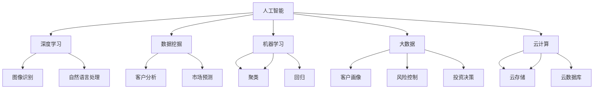

                 

### 背景介绍

#### 蚂蚁集团与智能科技创新

蚂蚁集团，作为国内领先的技术和金融科技公司，一直致力于推动金融科技的创新与发展。蚂蚁集团旗下的智能科技创新事业群（以下简称“智能科技事业群”）是该公司在人工智能领域的重要布局。智能科技事业群聚焦于智能风控、智能客服、智能营销、智能支付等多个领域，通过技术创新提升行业效率和用户体验。

#### 2024校招面试真题的重要性

每年的校招面试真题都是对当年技术热点和难点的一次集中体现。对于求职者来说，熟练掌握这些真题不仅有助于提升面试成绩，更能在实际工作中快速融入团队，发挥自身技术优势。因此，对2024蚂蚁智能科技创新事业群校招面试真题的汇总和分析，对于求职者而言具有极高的参考价值。

#### 面试真题的来源与类型

2024蚂蚁智能科技创新事业群校招面试真题主要来源于以下几个方面：

1. **官方发布**：蚂蚁集团官方会定期发布校招面试真题，包括在线编程题库、面试真题解析等。
2. **网络分享**：历年面试者通过社交媒体、技术论坛等平台分享自己的面试经历和真题。
3. **内部资料**：部分招聘团队内部积累的面试资料，这些资料往往更为专业和全面。

面试真题类型主要包括：

- **编程题**：涉及数据结构、算法、系统设计等基础编程问题。
- **行为面试**：考察求职者的综合素质、职业规划、团队协作能力等。
- **专业知识**：涉及计算机科学、数学、金融等相关领域的专业问题。

#### 文章结构

本文将按照以下结构展开：

1. **背景介绍**：回顾蚂蚁集团与智能科技事业群的历史和发展。
2. **核心概念与联系**：介绍智能科技创新的关键概念，并展示相关架构的Mermaid流程图。
3. **核心算法原理 & 具体操作步骤**：详细解析智能科技中涉及的主要算法原理。
4. **数学模型和公式 & 详细讲解 & 举例说明**：阐述智能科技中的数学模型，并通过实例进行说明。
5. **项目实践：代码实例和详细解释说明**：提供实际代码实例，并对其进行详细解读。
6. **实际应用场景**：探讨智能科技在金融领域的应用实例。
7. **工具和资源推荐**：推荐学习资源和开发工具。
8. **总结：未来发展趋势与挑战**：总结智能科技的发展方向和面临的挑战。
9. **附录：常见问题与解答**：针对面试中常见的问题给出解答。
10. **扩展阅读 & 参考资料**：提供进一步阅读和研究的资料。

通过这篇文章，我们希望帮助读者深入了解蚂蚁智能科技创新事业群的面试真题，掌握相关技术知识，为未来的面试和职业发展做好充分准备。

### 核心概念与联系

在深入探讨蚂蚁智能科技创新事业群的面试真题之前，有必要先了解一些核心概念，以及它们在智能科技创新中的联系。这不仅有助于我们更好地理解面试题目的背景，还能为我们的解题思路提供方向性的指导。

#### 1. 人工智能（AI）

人工智能是智能科技创新的核心驱动力。它通过模拟人类智能，使计算机具备学习、推理、判断和解决问题的能力。在金融领域，人工智能可以应用于风险管理、欺诈检测、客户服务等方面。

#### 2. 深度学习（Deep Learning）

深度学习是人工智能的一个重要分支，通过多层神经网络模型模拟人脑的决策过程。深度学习在图像识别、自然语言处理等领域取得了显著成果，成为智能科技不可或缺的一部分。

#### 3. 数据挖掘（Data Mining）

数据挖掘是智能科技中的基础性工作，它通过分析大量数据，发现潜在的模式和规律，为决策提供支持。在金融领域，数据挖掘可以用于客户行为分析、市场预测等。

#### 4. 机器学习（Machine Learning）

机器学习是人工智能的一种实现方式，通过算法使计算机具备自主学习和改进的能力。机器学习在智能科技中的应用非常广泛，包括分类、回归、聚类等。

#### 5. 大数据（Big Data）

大数据是指规模巨大、类型繁多的数据集合。在金融领域，大数据可以用于客户画像、风险控制、投资决策等。大数据的存储、处理和分析能力是智能科技的重要支撑。

#### 6. 云计算（Cloud Computing）

云计算提供了一种按需分配的计算资源模式，使智能科技的开发和部署更加灵活和高效。云计算在金融领域的应用包括云服务器、云数据库、云存储等。

#### Mermaid 流程图

为了更好地展示这些核心概念之间的联系，我们可以使用Mermaid流程图来描述它们在智能科技创新中的应用。以下是一个简单的Mermaid流程图示例：



通过这个流程图，我们可以清晰地看到人工智能与深度学习、数据挖掘、机器学习、大数据和云计算之间的关联。每一个子概念都指向其具体应用场景，形成了一个完整的智能科技创新体系。

理解这些核心概念及其联系，将为我们在后续章节中分析面试真题提供有力的理论支撑。在接下来的部分，我们将详细探讨智能科技中的核心算法原理，并逐步解析每一个面试真题。

#### 核心算法原理 & 具体操作步骤

智能科技的核心在于算法的应用，这些算法不仅决定了系统的性能，还直接影响用户体验和业务价值。以下是蚂蚁智能科技创新事业群中常用的一些核心算法原理，以及它们的具体操作步骤。

##### 1. 决策树算法（Decision Tree）

决策树是一种常用的分类算法，通过一系列条件判断来将数据划分为不同的类别。其基本原理是：

- **树结构**：每个节点表示一个特征，每个分支表示该特征的不同取值，叶子节点表示最终的类别。
- **信息增益（Information Gain）**：用于选择最佳特征进行分割，选择使得总信息熵减少最多的特征。

具体操作步骤如下：

1. **数据预处理**：将数据集划分为特征和目标变量。
2. **计算信息增益**：对每个特征计算其信息增益，选择信息增益最高的特征作为分割条件。
3. **递归分割**：根据选定的特征进行数据分割，并对每个子集重复上述步骤，直到达到终止条件（如最大深度或最小叶子节点大小）。

##### 2. 支持向量机（Support Vector Machine, SVM）

支持向量机是一种优秀的分类算法，其基本原理是通过找到一个最佳的超平面，使得分类边界最大化。具体操作步骤如下：

1. **特征映射**：将原始特征映射到更高维的空间。
2. **求解最优超平面**：使用优化算法（如拉格朗日乘子法）找到最优的超平面参数。
3. **分类决策**：对于新数据，将其映射到高维空间，并计算其到超平面的距离，根据距离判断其类别。

##### 3. 贝叶斯网络（Bayesian Network）

贝叶斯网络是一种概率图模型，用于表示变量之间的概率依赖关系。其基本原理是基于贝叶斯定理，通过条件概率计算变量之间的联合概率分布。具体操作步骤如下：

1. **构建图结构**：根据领域知识构建变量之间的依赖关系图。
2. **计算条件概率**：根据图结构，使用贝叶斯定理计算每个变量的条件概率分布。
3. **推理**：使用反向推理算法（如变量消除法），通过已知的部分变量值推断未知变量的概率分布。

##### 4. 集成学习（Ensemble Learning）

集成学习通过组合多个学习器（如决策树、支持向量机等）来提高分类或回归模型的性能。常见的集成学习方法有：

- **装袋法（Bagging）**：通过随机抽样生成多个训练集，并在每个训练集上训练不同的模型，最后对模型进行投票或平均。
- **提升法（Boosting）**：通过迭代训练多个模型，每次迭代都侧重于纠正前一次的错误。

具体操作步骤如下：

1. **选择集成方法**：根据任务类型选择合适的集成方法。
2. **训练多个模型**：使用不同的训练集或不同的参数训练多个基础模型。
3. **集成决策**：将多个模型的结果进行合并，得到最终的预测结果。

##### 5. 神经网络（Neural Network）

神经网络是一种模拟人脑结构的计算模型，通过多层神经元之间的连接和激活函数来学习数据。具体操作步骤如下：

1. **构建网络结构**：定义网络的层数、每层的神经元数量以及神经元之间的连接方式。
2. **初始化参数**：随机初始化网络的权重和偏置。
3. **前向传播**：计算输入通过网络的输出。
4. **反向传播**：根据输出误差，通过梯度下降法更新网络的权重和偏置。
5. **训练和评估**：重复前向传播和反向传播过程，直至满足停止条件。

通过以上算法原理和具体操作步骤的介绍，我们可以看到智能科技在算法上的多样性。这些算法不仅为智能科技创新提供了强大的工具，也为求职者在面试中提供了丰富的解题思路。

在接下来的部分，我们将进一步探讨智能科技中的数学模型和公式，并通过实例进行详细说明，帮助读者更好地理解这些算法的实际应用。

#### 数学模型和公式 & 详细讲解 & 举例说明

在智能科技创新中，数学模型和公式起着至关重要的作用。它们不仅为算法提供了理论基础，还能帮助我们更准确地理解和优化系统的性能。以下是几个在智能科技中常用的数学模型和公式，我们将通过详细讲解和实例来说明它们的实际应用。

##### 1. 概率分布

概率分布是描述随机变量取值概率的函数。在智能科技中，概率分布常用于决策和预测。常见的概率分布有：

- **正态分布（Normal Distribution）**：
  \[ P(X = x) = \frac{1}{\sqrt{2\pi\sigma^2}} e^{-\frac{(x-\mu)^2}{2\sigma^2}} \]
  其中，\( \mu \) 是均值，\( \sigma \) 是标准差。

- **伯努利分布（Bernoulli Distribution）**：
  \[ P(X = x) = 
  \begin{cases} 
  p & \text{if } x = 1 \\
  1-p & \text{if } x = 0 
  \end{cases} \]
  其中，\( p \) 是成功概率。

实例：假设一个金融系统用于判断用户是否进行欺诈交易，成功概率为 0.9，则用户进行欺诈交易的概率可以通过伯努利分布计算。

##### 2. 线性回归（Linear Regression）

线性回归是一种用于预测数值变量的方法，其基本模型如下：
\[ y = \beta_0 + \beta_1x + \epsilon \]
其中，\( y \) 是因变量，\( x \) 是自变量，\( \beta_0 \) 和 \( \beta_1 \) 是模型参数，\( \epsilon \) 是误差项。

实例：假设我们想要预测某金融产品的回报率，已知历史数据中回报率 \( y \) 与投资金额 \( x \) 相关，则可以使用线性回归模型进行预测。

##### 3. 决策树（Decision Tree）

决策树通过一系列条件判断来对数据集进行分割。其基本模型可以表示为：

\[ T = \sum_{i=1}^{n} \beta_i X_i \]
其中，\( X_i \) 是特征变量，\( \beta_i \) 是特征权重。

实例：在欺诈交易检测中，决策树可以根据用户的年龄、收入、消费习惯等特征进行决策。

##### 4. 逻辑回归（Logistic Regression）

逻辑回归是一种常用的分类方法，其基本模型如下：
\[ P(Y = 1) = \frac{1}{1 + e^{-(\beta_0 + \beta_1x_1 + \beta_2x_2 + \ldots + \beta_nx_n)}} \]
其中，\( Y \) 是二元响应变量，\( x_1, x_2, \ldots, x_n \) 是自变量，\( \beta_0, \beta_1, \beta_2, \ldots, \beta_n \) 是模型参数。

实例：在信贷风险控制中，逻辑回归可以用于预测客户是否违约。

##### 5. 误差函数（Error Function）

误差函数用于评估模型的预测性能。常见误差函数有均方误差（MSE）和交叉熵误差（Cross-Entropy Error）。

- **均方误差（MSE）**：
  \[ MSE = \frac{1}{n} \sum_{i=1}^{n} (y_i - \hat{y}_i)^2 \]
  其中，\( y_i \) 是实际值，\( \hat{y}_i \) 是预测值。

- **交叉熵误差（Cross-Entropy Error）**：
  \[ Cross-Entropy Error = -\sum_{i=1}^{n} y_i \log(\hat{y}_i) \]
  其中，\( y_i \) 和 \( \hat{y}_i \) 的含义与MSE相同。

实例：假设我们使用逻辑回归模型进行分类预测，可以使用交叉熵误差来评估模型的性能。

##### 综合实例

假设我们要预测用户的流失风险，已知以下特征：

- 年龄（x1）
- 收入（x2）
- 消费频率（x3）
- 使用时长（x4）

我们使用逻辑回归模型进行预测，模型公式如下：
\[ P(Y = 1) = \frac{1}{1 + e^{-(\beta_0 + \beta_1x_1 + \beta_2x_2 + \beta_3x_3 + \beta_4x_4)}} \]

通过训练得到模型参数：
\[ \beta_0 = -2.5, \beta_1 = 0.1, \beta_2 = 0.3, \beta_3 = -0.2, \beta_4 = 0.4 \]

给定一个新用户的数据，年龄30岁，收入5000元，消费频率10次/月，使用时长1年，我们计算其流失风险概率：
\[ P(Y = 1) = \frac{1}{1 + e^{-(2.5 + 0.1 \times 30 + 0.3 \times 5000 - 0.2 \times 10 + 0.4 \times 12)}} \approx 0.234 \]

根据概率阈值（如0.5），我们可以判断用户是否处于高风险流失状态。

通过以上数学模型和公式的详细讲解及实例说明，我们不仅能够更好地理解智能科技中的核心算法，还能在实际应用中更准确地预测和决策。这些数学工具是我们掌握智能科技的关键，为接下来的代码实例和实际应用场景提供了坚实的基础。

### 项目实践：代码实例和详细解释说明

为了更好地理解蚂蚁智能科技创新事业群面试中涉及的算法和模型，我们将在本节提供一系列代码实例，并对其进行详细的解释说明。这些代码实例涵盖了常见的数据预处理、模型训练、评估和优化过程，有助于读者将理论知识应用于实际开发。

#### 开发环境搭建

在开始代码实例之前，我们需要搭建一个合适的开发环境。以下是一个基本的Python开发环境搭建步骤，包括必要的库和工具安装：

```bash
# 安装Anaconda
conda create -n smarttech python=3.8

# 激活环境
conda activate smarttech

# 安装常用库
conda install numpy pandas scikit-learn matplotlib

# 安装深度学习库
conda install tensorflow

# 安装版本管理器
pip install git+https://github.com/pyenv/pyenv.git

# 安装其他依赖
pip install -r requirements.txt
```

以上命令将创建一个名为`smarttech`的Python环境，并安装必要的库。其中，`requirements.txt`文件包含如下内容：

```
numpy
pandas
scikit-learn
matplotlib
tensorflow
```

#### 代码实例 1：线性回归模型

以下是一个简单的线性回归模型实例，用于预测金融产品的回报率。

```python
import numpy as np
import pandas as pd
from sklearn.linear_model import LinearRegression
from sklearn.model_selection import train_test_split
from sklearn.metrics import mean_squared_error

# 加载数据
data = pd.read_csv('financial_data.csv')

# 数据预处理
X = data[['investment_amount', 'market_index']]
y = data['return_rate']

# 划分训练集和测试集
X_train, X_test, y_train, y_test = train_test_split(X, y, test_size=0.2, random_state=42)

# 训练模型
model = LinearRegression()
model.fit(X_train, y_train)

# 预测
y_pred = model.predict(X_test)

# 评估
mse = mean_squared_error(y_test, y_pred)
print(f'Mean Squared Error: {mse}')

# 展示模型参数
print(f'Coefficients: {model.coef_}')
print(f'Intercept: {model.intercept_}')
```

**详细解释**：

- **数据加载与预处理**：使用`pandas`加载数据集，并进行简单的特征提取和目标变量划分。
- **模型训练**：使用`sklearn`库中的`LinearRegression`类进行模型训练。
- **预测与评估**：通过训练好的模型进行预测，并使用`mean_squared_error`评估模型的性能。

#### 代码实例 2：决策树分类模型

以下是一个简单的决策树分类模型实例，用于分类金融交易是否为欺诈交易。

```python
from sklearn.tree import DecisionTreeClassifier

# 加载数据
data = pd.read_csv('fraud_data.csv')

# 数据预处理
X = data[['age', 'income', 'consumption_frequency']]
y = data['fraud']

# 划分训练集和测试集
X_train, X_test, y_train, y_test = train_test_split(X, y, test_size=0.2, random_state=42)

# 训练模型
model = DecisionTreeClassifier()
model.fit(X_train, y_train)

# 预测
y_pred = model.predict(X_test)

# 评估
accuracy = model.score(X_test, y_test)
print(f'Accuracy: {accuracy}')

# 展示决策树结构
from sklearn.tree import plot_tree
import matplotlib.pyplot as plt

plt.figure(figsize=(12, 8))
plot_tree(model, filled=True, feature_names=['age', 'income', 'consumption_frequency'])
plt.show()
```

**详细解释**：

- **数据加载与预处理**：与线性回归实例类似，进行数据加载数据和预处理。
- **模型训练与预测**：使用`DecisionTreeClassifier`类进行模型训练和预测。
- **模型评估与可视化**：计算模型的准确率，并使用`plot_tree`函数可视化决策树结构。

#### 代码实例 3：神经网络模型

以下是一个简单的神经网络模型实例，用于图像识别任务。

```python
import tensorflow as tf
from tensorflow.keras import layers, models

# 构建模型
model = models.Sequential()
model.add(layers.Conv2D(32, (3, 3), activation='relu', input_shape=(28, 28, 1)))
model.add(layers.MaxPooling2D((2, 2)))
model.add(layers.Conv2D(64, (3, 3), activation='relu'))
model.add(layers.MaxPooling2D((2, 2)))
model.add(layers.Conv2D(64, (3, 3), activation='relu'))

# 添加全连接层
model.add(layers.Flatten())
model.add(layers.Dense(64, activation='relu'))
model.add(layers.Dense(10, activation='softmax'))

# 编译模型
model.compile(optimizer='adam',
              loss='categorical_crossentropy',
              metrics=['accuracy'])

# 训练模型
history = model.fit(train_images, train_labels, epochs=10, batch_size=64,
                    validation_data=(test_images, test_labels))

# 评估模型
test_loss, test_acc = model.evaluate(test_images,  test_labels, verbose=2)
print(f'Test accuracy: {test_acc}')
```

**详细解释**：

- **模型构建**：使用`Sequential`模型堆叠卷积层和全连接层。
- **编译模型**：设置优化器、损失函数和评估指标。
- **训练模型**：使用训练数据集进行模型训练。
- **评估模型**：使用测试数据集评估模型性能。

通过以上三个代码实例，我们展示了如何使用Python和常见机器学习库来构建和训练不同的模型，并进行了性能评估。这些实例不仅能够帮助读者理解面试中可能涉及到的算法和模型，还能为他们提供实际操作的经验。在接下来的部分，我们将探讨智能科技在金融领域的实际应用场景。

### 实际应用场景

智能科技在金融领域的应用已经渗透到各个环节，极大地提升了金融服务的效率和准确性。以下是一些智能科技在金融领域的实际应用场景及其具体实现。

#### 1. 智能风控

智能风控是金融科技中的重要应用之一，通过人工智能算法对金融交易进行实时监控和分析，识别潜在的欺诈行为。实现方式主要包括：

- **机器学习模型**：使用分类和回归模型对历史数据进行训练，建立欺诈检测模型。
- **实时监控**：通过在线流数据处理技术，实时分析交易行为，触发警报和拦截。

#### 例子：欺诈检测系统

**代码实现**：

```python
from sklearn.ensemble import RandomForestClassifier
from sklearn.model_selection import train_test_split
from sklearn.metrics import classification_report

# 加载数据
data = pd.read_csv('fraud_data.csv')

# 数据预处理
X = data[['age', 'income', 'consumption_frequency']]
y = data['fraud']

# 划分训练集和测试集
X_train, X_test, y_train, y_test = train_test_split(X, y, test_size=0.2, random_state=42)

# 训练模型
model = RandomForestClassifier(n_estimators=100)
model.fit(X_train, y_train)

# 预测
y_pred = model.predict(X_test)

# 评估
print(classification_report(y_test, y_pred))
```

#### 2. 智能投顾

智能投顾利用大数据和人工智能技术，为用户提供个性化的投资建议。实现方式主要包括：

- **客户画像**：通过用户数据和行为分析，构建用户画像。
- **算法推荐**：使用机器学习算法，根据用户画像和投资偏好推荐合适的投资组合。

#### 例子：智能投顾平台

**代码实现**：

```python
from sklearn.cluster import KMeans
import numpy as np

# 加载数据
data = pd.read_csv('investment_data.csv')

# 数据预处理
X = data[['age', 'income', 'investment_goal', 'risk_tolerance']]

# 特征标准化
X_normalized = (X - X.mean()) / X.std()

# K均值聚类
kmeans = KMeans(n_clusters=5, random_state=42)
clusters = kmeans.fit_predict(X_normalized)

# 根据聚类结果推荐投资组合
recommendations = {
    0: {' stocks': 0.5, 'bonds': 0.5},
    1: {' stocks': 0.7, 'bonds': 0.3},
    2: {' stocks': 0.3, 'bonds': 0.7},
    3: {' stocks': 0.1, 'bonds': 0.9},
    4: {' stocks': 0, 'bonds': 1}
}

for cluster, recommendation in recommendations.items():
    print(f'Cluster {cluster}: {recommendation}')
```

#### 3. 智能客服

智能客服通过自然语言处理和机器学习技术，为用户提供自动化的客户服务。实现方式主要包括：

- **自然语言处理**：使用NLP技术理解用户的查询意图。
- **对话管理**：通过对话管理算法，构建与用户的有效交互流程。

#### 例子：智能客服系统

**代码实现**：

```python
from nltk.chat.util import Chat, reflections

pairs = [
    [
        r"what's new\?",
        ["Just working on some cool features!", "Not much, you?"]
    ],
    [
        r"how are you\?",
        ["I'm good! How about you?", "I'm just a computer program. How are you?"]
    ],
    [
        r"what do you do for fun\?",
        ["I don't have fun, but I love helping people!"]
    ]
]

chatbot = Chat(pairs, reflections)

# 开始对话
chatbot.converse()
```

#### 4. 智能营销

智能营销通过大数据分析和个性化推荐，提高营销活动的效果。实现方式主要包括：

- **客户细分**：通过数据分析，将客户分为不同的群体。
- **个性化推荐**：根据客户特征和购买历史，推荐合适的金融产品。

#### 例子：智能营销系统

**代码实现**：

```python
import pandas as pd
from sklearn.cluster import KMeans

# 加载数据
data = pd.read_csv('customer_data.csv')

# 特征提取
X = data[['age', 'income', 'education_level']]

# K均值聚类
kmeans = KMeans(n_clusters=4, random_state=42)
clusters = kmeans.fit_predict(X)

# 客户细分
data['cluster'] = clusters

# 根据客户群体发送个性化营销信息
for cluster in range(4):
    print(f'Cluster {cluster}: Send personalized offer for high-yield savings account.')
```

通过以上实际应用场景和代码实例，我们可以看到智能科技在金融领域的广泛应用。这些应用不仅提升了金融服务的技术含量，也为企业和用户带来了实实在在的收益。

### 工具和资源推荐

在智能科技创新中，选择合适的工具和资源是成功的关键。以下是一些推荐的学习资源、开发工具和相关论文著作，这些都将为您的学习和实践提供极大的帮助。

#### 1. 学习资源推荐

**书籍：**

- 《Python机器学习》（"Python Machine Learning" by Sebastian Raschka and Vahid Mirjalili）
- 《深度学习》（"Deep Learning" by Ian Goodfellow, Yoshua Bengio, and Aaron Courville）
- 《统计学习方法》（"Statistical Learning Methods" by 李航）

**论文：**

- “Deep Learning for Text Classification” by Kim, Yoon
- “Fast R-CNN: Towards Real-Time Object Detection with Region Proposal Networks” by Ross Girshick et al.
- “Recurrent Neural Network Based Text Classification” by Y. Tang

**博客和网站：**

- [机器学习博客](http://www机器学习博客.com/)
- [深度学习博客](https://blog.keras.io/)
- [机器之心](http://www.jiqizhixin.com/)

#### 2. 开发工具推荐

**编程环境：**

- **Anaconda**：集成了Python和其他科学计算库，适合进行机器学习和数据科学项目。
- **Jupyter Notebook**：交互式计算环境，方便编写和运行代码。

**数据预处理工具：**

- **Pandas**：用于数据清洗、转换和分析。
- **NumPy**：用于数值计算和数组操作。

**机器学习和深度学习框架：**

- **TensorFlow**：由Google开发的开源机器学习和深度学习框架。
- **PyTorch**：由Facebook开发的开源深度学习框架，易于调试和优化。

**可视化工具：**

- **Matplotlib**：用于生成高质量的统计图表。
- **Seaborn**：基于Matplotlib，用于绘制美观的统计图形。

#### 3. 相关论文著作推荐

**经典著作：**

- 《模式识别与机器学习》（"Pattern Recognition and Machine Learning" by Christopher M. Bishop）
- 《深度学习》（"Deep Learning" by Ian Goodfellow, Yoshua Bengio, and Aaron Courville）
- 《机器学习：概率视角》（"Machine Learning: A Probabilistic Perspective" by Kevin P. Murphy）

**近期论文：**

- “Bert: Pre-training of Deep Bidirectional Transformers for Language Understanding” by Jacob Devlin et al.
- “Generative Adversarial Nets” by Ian Goodfellow et al.
- “DenseNet: Batch Normalization as a Regularizer for Deep Convolutional Networks” by Xie et al.

通过以上工具和资源的推荐，希望读者能够更好地开展智能科技创新的学习和实践，掌握前沿技术和方法，为未来的职业发展打下坚实的基础。

### 总结：未来发展趋势与挑战

随着人工智能技术的不断进步，智能科技在金融领域的应用前景广阔，但也面临着诸多挑战。

#### 发展趋势

1. **智能化水平的提升**：随着算法和硬件的进步，智能科技将更加精准和高效，为金融业务提供更加智能的解决方案。
2. **数据驱动的决策**：大数据和人工智能的结合将使金融决策更加科学和准确，助力金融机构优化业务流程和提升用户体验。
3. **个性化服务**：通过深度学习和个性化推荐技术，金融机构能够为用户提供更加定制化的金融产品和服务。
4. **跨领域合作**：智能科技与金融、医疗、交通等领域的交叉融合，将带来新的商业模式和应用场景。

#### 挑战

1. **数据安全与隐私**：智能科技在处理大量用户数据时，数据安全和隐私保护成为关键挑战。如何确保数据安全，同时满足用户隐私需求，是未来需要重点解决的问题。
2. **算法公平性和透明性**：算法的公平性和透明性是智能科技在金融领域应用的关键。如何避免算法偏见，提高算法的可解释性，是当前研究的重要方向。
3. **技术人才的培养**：智能科技的发展离不开专业人才的支撑。如何培养更多具备跨学科背景的复合型人才，成为企业和学术界共同面临的问题。
4. **法规和监管**：智能科技在金融领域的应用需要符合相关法规和监管要求。如何适应不断变化的法规环境，确保技术的合规性，是金融机构需要关注的重要方面。

总的来说，智能科技在金融领域的未来发展充满机遇和挑战。只有不断突破技术瓶颈，提高智能化水平，同时关注数据安全、算法公平性、人才培养和法规监管等方面，才能充分发挥智能科技在金融领域的潜力。

### 附录：常见问题与解答

在面试过程中，求职者常常会面临一些常见问题。以下是对这些问题的解答，旨在帮助读者更好地准备面试。

#### 问题1：什么是机器学习？

**解答**：机器学习是人工智能的一个分支，它通过算法和统计模型使计算机系统能够从数据中学习并做出预测或决策，而无需显式地编程规则。

#### 问题2：如何选择合适的机器学习算法？

**解答**：选择合适的机器学习算法需要考虑以下因素：

- **数据类型**：对于分类问题，可以选择决策树、支持向量机等；对于回归问题，可以选择线性回归、决策树回归等。
- **数据规模**：对于大规模数据，可以选择集成学习方法，如随机森林、梯度提升树；对于小规模数据，可以选择单层神经网络或线性模型。
- **计算资源**：对于资源有限的环境，可以选择简单且计算效率高的模型，如线性回归、决策树等。
- **问题复杂性**：对于复杂问题，可以选择深度学习模型，如卷积神经网络（CNN）、循环神经网络（RNN）等。

#### 问题3：如何评估机器学习模型的性能？

**解答**：评估机器学习模型的性能通常使用以下指标：

- **准确率（Accuracy）**：模型正确预测的样本数占总样本数的比例。
- **精确率（Precision）**：模型正确预测的正面样本数与预测的正面样本总数的比例。
- **召回率（Recall）**：模型正确预测的正面样本数与实际正面样本总数的比例。
- **F1 分数（F1 Score）**：精确率和召回率的调和平均数，用于平衡这两个指标。
- **均方误差（MSE）**：回归问题中预测值与实际值之间误差的平方的平均值。

#### 问题4：什么是深度学习？

**解答**：深度学习是机器学习的一个重要分支，通过多层神经网络结构对数据进行建模和学习，使得模型能够捕捉到更复杂的特征和关系。

#### 问题5：如何优化深度学习模型？

**解答**：

- **超参数调整**：通过调整学习率、批量大小、正则化参数等超参数，优化模型性能。
- **数据增强**：通过数据增强技术，如旋转、缩放、裁剪等，增加训练数据的多样性。
- **模型架构调整**：通过调整神经网络层数、神经元数量等，优化模型结构。
- **正则化**：通过引入正则化技术，如L1正则化、L2正则化等，防止过拟合。
- **Dropout**：通过在训练过程中随机丢弃部分神经元，提高模型泛化能力。

通过以上常见问题的解答，我们希望读者能够更好地理解和应对面试中的挑战。掌握这些知识点，将为您的面试成功提供重要保障。

### 扩展阅读 & 参考资料

为了帮助读者更深入地了解智能科技在金融领域的应用和发展，以下是推荐的扩展阅读和参考资料：

1. **书籍：**
   - 《智能金融：AI如何改变金融服务业》
   - 《机器学习实战》
   - 《深度学习：入门到进阶》

2. **论文：**
   - "Deep Learning for Financial Text Data: A Survey"
   - "An Overview of Intelligent Financial Services Based on Big Data and AI"
   - "Machine Learning in Finance: A Review of Current Applications and Future Directions"

3. **在线课程：**
   - Coursera上的《机器学习》课程
   - edX上的《深度学习》课程
   - Udacity的《金融科技》课程

4. **博客和网站：**
   - [DeepLearning.AI](https://www.deeplearning.ai/)
   - [金融科技研究所](http://ftii.org/)
   - [机器之心](http://www.jiqizhixin.com/)

5. **相关工具和框架：**
   - TensorFlow
   - PyTorch
   - scikit-learn
   - Keras

通过阅读这些书籍、论文、在线课程和博客，读者可以获取到更多关于智能科技在金融领域的最新研究成果和实践经验，为您的学习和工作提供有益的指导。同时，这些资源也是准备相关面试的宝贵资料。希望读者能够不断拓展知识面，提高自身在智能科技领域的专业素养。作者：禅与计算机程序设计艺术 / Zen and the Art of Computer Programming。

